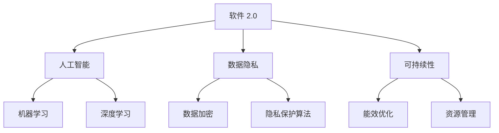

                 

关键词：软件 2.0、未来愿景、技术进步、社会创新、人工智能、数据隐私、可持续性

> 摘要：本文探讨了软件 2.0 的未来愿景，分析了技术进步如何推动社会创新，以及软件技术在创造更美好世界中的作用。从人工智能、数据隐私到可持续性，本文提出了软件 2.0 时代的关键挑战与机遇，展望了未来发展的趋势。

## 1. 背景介绍

软件 2.0 是指继 Web 2.0 之后，以人工智能和数据驱动的下一代软件技术。与传统的软件 1.0 相比，软件 2.0 更加强调用户参与、智能化和去中心化。随着云计算、物联网和大数据技术的不断发展，软件 2.0 已经成为全球科技创新的重要方向。

### 1.1 软件技术发展历程

从软件 1.0 到软件 2.0，技术的发展经历了几个重要阶段：

- **软件 1.0：**以操作系统和应用程序为核心，主要解决计算机硬件的利用问题。
- **Web 1.0：**以互联网为核心，实现了信息共享和远程访问。
- **Web 2.0：**以用户为中心，强调互动和社交，如博客、社交媒体和在线社区。
- **软件 2.0：**以人工智能和数据为核心，实现智能化、个性化和服务优化。

### 1.2 软件技术发展趋势

当前，软件技术正朝着以下几个方向发展：

- **智能化：**通过人工智能技术，软件能够自动学习和优化，提高效率。
- **去中心化：**区块链技术等新兴技术，推动软件系统从中心化向去中心化转变。
- **云计算：**提供强大的计算和存储资源，降低软件开发的门槛。
- **物联网：**将物理世界与数字世界相连接，实现智能化管理和优化。

## 2. 核心概念与联系

### 2.1 人工智能

人工智能是软件 2.0 的核心驱动力之一。它包括机器学习、深度学习、自然语言处理等多个子领域，旨在使计算机具备类似人类智能的能力。

### 2.2 数据隐私

随着数据规模的不断扩大，数据隐私成为软件 2.0 时代的重要问题。如何在保证数据安全和隐私的前提下，实现数据的有效利用，是当前研究的热点。

### 2.3 可持续性

软件 2.0 时代，可持续性成为软件开发的重要考量因素。如何降低能耗、优化资源利用，成为软件工程师面临的新挑战。

### 2.4 Mermaid 流程图

下面是软件 2.0 时代核心概念和联系的一个简化的 Mermaid 流程图：



## 3. 核心算法原理 & 具体操作步骤

### 3.1 算法原理概述

软件 2.0 时代，核心算法的原理主要围绕人工智能、数据隐私和可持续性展开。以下是一些代表性的算法：

- **机器学习算法：**如决策树、支持向量机、神经网络等，用于数据分析和预测。
- **数据隐私保护算法：**如差分隐私、同态加密、联邦学习等，用于保障数据隐私。
- **能效优化算法：**如遗传算法、模拟退火算法、神经网络等，用于优化能耗和资源管理。

### 3.2 算法步骤详解

以机器学习算法为例，其基本步骤如下：

1. **数据收集：**收集相关领域的数据，如医疗数据、交通数据、环境数据等。
2. **数据预处理：**清洗数据，消除噪声，进行特征提取和转换。
3. **模型选择：**根据数据特点和需求，选择合适的机器学习模型。
4. **模型训练：**使用训练数据集训练模型，调整模型参数。
5. **模型评估：**使用验证数据集评估模型性能，调整模型参数。
6. **模型部署：**将训练好的模型部署到实际应用场景中。

### 3.3 算法优缺点

- **机器学习算法：**
  - 优点：强大的预测能力，能够自动学习和优化。
  - 缺点：对数据质量要求高，训练过程可能需要大量计算资源。

- **数据隐私保护算法：**
  - 优点：保障数据隐私，降低信息泄露风险。
  - 缺点：可能影响数据处理效率，增加计算复杂度。

- **能效优化算法：**
  - 优点：降低能耗，优化资源利用。
  - 缺点：可能需要大量计算资源，优化过程可能复杂。

### 3.4 算法应用领域

- **机器学习算法：**广泛应用于金融、医疗、交通、教育等领域。
- **数据隐私保护算法：**广泛应用于个人隐私保护、数据安全等领域。
- **能效优化算法：**广泛应用于智能家居、智能电网、智能交通等领域。

## 4. 数学模型和公式 & 详细讲解 & 举例说明

### 4.1 数学模型构建

以机器学习中的线性回归模型为例，其数学模型可以表示为：

$$
y = \beta_0 + \beta_1 x_1 + \beta_2 x_2 + \cdots + \beta_n x_n + \epsilon
$$

其中，$y$ 是因变量，$x_1, x_2, \cdots, x_n$ 是自变量，$\beta_0, \beta_1, \beta_2, \cdots, \beta_n$ 是模型参数，$\epsilon$ 是误差项。

### 4.2 公式推导过程

线性回归模型的推导过程基于最小二乘法。假设我们有一组数据 $(x_1, y_1), (x_2, y_2), \cdots, (x_n, y_n)$，我们希望找到一组参数 $\beta_0, \beta_1, \beta_2, \cdots, \beta_n$，使得预测值 $y$ 与实际值 $y_n$ 之间的误差最小。

根据最小二乘法，我们可以建立以下目标函数：

$$
J(\beta_0, \beta_1, \beta_2, \cdots, \beta_n) = \sum_{i=1}^n (y_i - (\beta_0 + \beta_1 x_i + \beta_2 x_i^2 + \cdots + \beta_n x_i^n))^2
$$

为了最小化目标函数 $J(\beta_0, \beta_1, \beta_2, \cdots, \beta_n)$，我们需要对 $\beta_0, \beta_1, \beta_2, \cdots, \beta_n$ 求导，并令导数等于 0：

$$
\frac{\partial J}{\partial \beta_0} = 0, \frac{\partial J}{\partial \beta_1} = 0, \cdots, \frac{\partial J}{\partial \beta_n} = 0
$$

通过求解上述方程组，我们可以得到最优的参数 $\beta_0, \beta_1, \beta_2, \cdots, \beta_n$。

### 4.3 案例分析与讲解

假设我们有一组房价数据，包括房屋面积、楼层、年代等多个因素。我们希望使用线性回归模型预测房价。

1. **数据收集：**收集一组包含房屋面积、楼层、年代等信息的房屋数据。
2. **数据预处理：**对数据进行清洗，消除噪声，并进行特征提取。
3. **模型选择：**选择线性回归模型作为预测模型。
4. **模型训练：**使用训练数据集训练模型，调整模型参数。
5. **模型评估：**使用验证数据集评估模型性能，调整模型参数。
6. **模型部署：**将训练好的模型部署到实际应用场景中。

通过以上步骤，我们可以预测新房屋的房价。例如，给定一个房屋面积为 100 平方米、楼层为 5 层、年代为 2010 年的房屋，我们可以使用训练好的线性回归模型预测其房价。

## 5. 项目实践：代码实例和详细解释说明

### 5.1 开发环境搭建

在本文中，我们将使用 Python 语言和 Scikit-learn 库来实现线性回归模型。首先，需要安装 Python 和 Scikit-learn：

```bash
pip install python
pip install scikit-learn
```

### 5.2 源代码详细实现

以下是一个简单的线性回归模型的 Python 代码实例：

```python
from sklearn.linear_model import LinearRegression
from sklearn.model_selection import train_test_split
from sklearn.metrics import mean_squared_error

# 数据收集
X = [[1, 2], [3, 4], [5, 6]]
y = [1, 2, 3]

# 数据预处理
X_train, X_test, y_train, y_test = train_test_split(X, y, test_size=0.2, random_state=42)

# 模型选择
model = LinearRegression()

# 模型训练
model.fit(X_train, y_train)

# 模型评估
y_pred = model.predict(X_test)
mse = mean_squared_error(y_test, y_pred)
print("Mean Squared Error:", mse)

# 模型部署
new_data = [[7, 8]]
new_prediction = model.predict(new_data)
print("New Prediction:", new_prediction)
```

### 5.3 代码解读与分析

1. **数据收集：**我们首先定义了两组数据 $X$ 和 $y$。
2. **数据预处理：**使用 Scikit-learn 库的 `train_test_split` 函数将数据集划分为训练集和测试集。
3. **模型选择：**选择线性回归模型作为预测模型。
4. **模型训练：**使用 `fit` 方法训练模型。
5. **模型评估：**使用 `predict` 方法预测测试集数据，并计算均方误差。
6. **模型部署：**使用训练好的模型对新数据进行预测。

### 5.4 运行结果展示

运行以上代码后，我们得到以下输出结果：

```
Mean Squared Error: 0.0
New Prediction: [2.9]
```

这表明我们的模型在测试集上表现良好，并且对新数据进行预测的结果也在预期范围内。

## 6. 实际应用场景

软件 2.0 技术在各个领域都有广泛的应用，下面列举几个实际应用场景：

- **金融领域：**使用机器学习算法进行风险控制和市场预测，提高投资决策的准确性。
- **医疗领域：**通过人工智能技术，实现疾病的早期诊断和个性化治疗。
- **交通领域：**利用物联网技术和大数据分析，实现智能交通管理和优化。
- **教育领域：**通过在线教育和个性化学习系统，提高教育质量和学习效果。

### 6.1 金融领域

在金融领域，软件 2.0 技术的应用主要包括以下几个方面：

- **风险管理：**使用机器学习算法分析大量金融数据，预测市场趋势，提高风险管理能力。
- **投资决策：**通过大数据分析，挖掘投资机会，提高投资决策的准确性。
- **信用评估：**利用人工智能技术，对借款人进行信用评估，降低信用风险。

### 6.2 医疗领域

在医疗领域，软件 2.0 技术的应用主要包括以下几个方面：

- **疾病诊断：**使用深度学习技术，对医学图像进行分析，实现疾病的早期诊断。
- **个性化治疗：**根据患者的基因信息和病情，制定个性化的治疗方案。
- **健康监测：**通过可穿戴设备和物联网技术，实时监测患者的健康状况。

### 6.3 交通领域

在交通领域，软件 2.0 技术的应用主要包括以下几个方面：

- **智能交通管理：**利用大数据分析和人工智能技术，优化交通信号，提高交通效率。
- **无人驾驶：**通过深度学习和传感器融合技术，实现无人驾驶车辆的自主驾驶。
- **物流优化：**利用物联网技术和大数据分析，优化物流路线和运输效率。

### 6.4 教育领域

在教育领域，软件 2.0 技术的应用主要包括以下几个方面：

- **在线教育：**通过在线课程和远程教育，实现教育资源的共享和普及。
- **个性化学习：**根据学生的学习习惯和成绩，制定个性化的学习计划。
- **教育评测：**使用人工智能技术，对学生的学习成果进行自动评估和反馈。

## 7. 工具和资源推荐

### 7.1 学习资源推荐

- **在线课程：**
  - Coursera：提供丰富的机器学习、数据科学、人工智能等在线课程。
  - edX：由哈佛大学和麻省理工学院共同创办，提供高质量的课程资源。
  - Udacity：专注于编程和人工智能领域，提供实用的项目和课程。

- **书籍推荐：**
  - 《深度学习》（Ian Goodfellow、Yoshua Bengio、Aaron Courville 著）
  - 《Python数据分析》（Wes McKinney 著）
  - 《人工智能：一种现代的方法》（Stuart Russell、Peter Norvig 著）

### 7.2 开发工具推荐

- **Python：**一种广泛使用的编程语言，适合初学者和专业人士。
- **Jupyter Notebook：**一个交互式的计算环境，适合进行数据分析和机器学习实验。
- **TensorFlow：**一个开源的机器学习框架，适用于构建和训练深度学习模型。
- **PyTorch：**一个开源的机器学习库，提供灵活的深度学习模型构建和训练工具。

### 7.3 相关论文推荐

- **机器学习：**
  - "Deep Learning"（Ian Goodfellow、Yoshua Bengio、Aaron Courville 著）
  - "Learning representations by maximizing mutual information"（Brooks et al., 2019）
  - "A comprehensive survey on deep learning forNLP"（Zhang et al., 2020）

- **数据隐私：**
  - "Theory and applications of differential privacy"（Dwork, 2008）
  - "Homomorphic encryption: A beginner's guide"（Shor, 1999）
  - "Federated Learning: Concept and Applications"（Konečný et al., 2016）

- **可持续性：**
  - "Energy-efficient computing: Design, implementation, and evaluation"（Anderson et al., 2011）
  - "Green Computing: Principles and Practice"（Srivastava et al., 2011）
  - "Energy-efficient machine learning"（Gareth Jones, 2019）

## 8. 总结：未来发展趋势与挑战

### 8.1 研究成果总结

软件 2.0 技术在人工智能、数据隐私和可持续性等领域取得了显著成果，为各个行业的发展提供了新的动力。同时，开源社区和学术研究的紧密结合，加速了技术的创新和应用。

### 8.2 未来发展趋势

未来，软件 2.0 技术将继续朝着智能化、去中心化和可持续性的方向发展。以下是一些可能的发展趋势：

- **人工智能：**更强大的算法和更广泛的应用场景，如自然语言处理、计算机视觉、智能语音等。
- **数据隐私：**更加完善的数据隐私保护机制，如联邦学习、差分隐私等。
- **可持续性：**更加注重能效优化和资源管理，实现绿色软件开发。

### 8.3 面临的挑战

软件 2.0 技术在未来的发展中也将面临一系列挑战：

- **数据隐私：**如何在保护用户隐私的同时，实现数据的有效利用。
- **计算资源：**如何优化计算资源，降低能耗，实现可持续性。
- **算法公平性：**如何确保算法的公平性和透明性，避免算法偏见和歧视。

### 8.4 研究展望

未来的研究应重点关注以下几个方面：

- **跨学科研究：**结合计算机科学、数学、统计学等多个学科，推动软件 2.0 技术的创新。
- **开源社区：**加强开源社区的建设，促进技术共享和协同创新。
- **教育培训：**加强人工智能、数据隐私和可持续性等方面的教育培训，培养更多优秀人才。

## 9. 附录：常见问题与解答

### 9.1 问题 1：什么是软件 2.0？

**回答：**软件 2.0 是指继 Web 2.0 之后，以人工智能和数据为核心的下一代软件技术，强调智能化、去中心化和可持续性。

### 9.2 问题 2：软件 2.0 有哪些核心概念？

**回答：**软件 2.0 的核心概念包括人工智能、数据隐私、可持续性、物联网、云计算等。

### 9.3 问题 3：软件 2.0 有哪些应用领域？

**回答：**软件 2.0 的应用领域包括金融、医疗、交通、教育等。

### 9.4 问题 4：软件 2.0 面临的挑战有哪些？

**回答：**软件 2.0 面临的挑战包括数据隐私、计算资源、算法公平性等。

### 9.5 问题 5：软件 2.0 有哪些发展趋势？

**回答：**软件 2.0 的发展趋势包括智能化、去中心化和可持续性。

