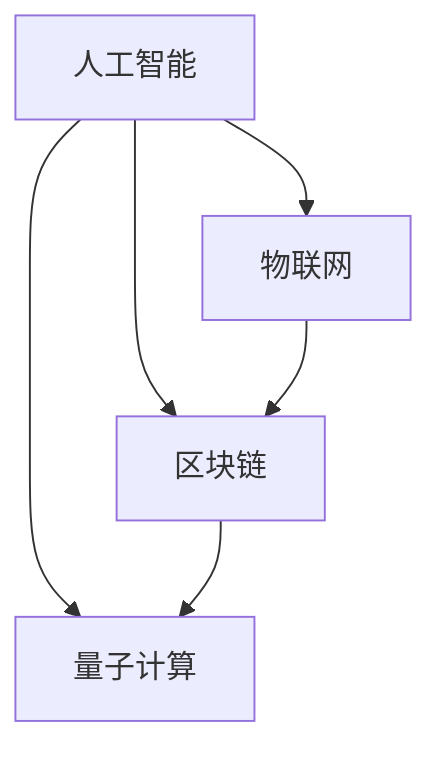

                 

关键词：软件 2.0、未来愿景、人工智能、区块链、物联网、量子计算、可持续发展

> 摘要：本文探讨了软件 2.0 的未来愿景，提出了利用人工智能、区块链、物联网、量子计算等前沿技术，推动软件产业向智能化、安全化、互联互通化、高效化方向发展的构想，旨在创造一个更美好的世界。

## 1. 背景介绍

软件产业作为信息时代的核心驱动力，已经深刻地改变了人类社会的生产、生活、工作方式。从最初的软件 1.0 时代，到如今的软件 2.0 时代，软件技术的不断创新与发展，不仅提升了生产效率，也极大地丰富了人们的生活体验。然而，随着全球数字化进程的加速，软件产业面临着新的挑战和机遇。

首先，全球数字化进程带来了海量数据的产生和处理需求，这使得传统的软件技术难以满足日益增长的数据处理需求。其次，随着人工智能、区块链、物联网等新兴技术的发展，软件产业正在向智能化、安全化、互联互通化、高效化方向演进。此外，可持续发展理念在全球范围内得到广泛认同，也为软件产业提出了新的要求。

因此，本文旨在探讨软件 2.0 的未来愿景，通过引入人工智能、区块链、物联网、量子计算等前沿技术，推动软件产业实现智能化、安全化、互联互通化、高效化发展，为创造一个更美好的世界贡献力量。

## 2. 核心概念与联系

在探讨软件 2.0 的未来愿景之前，我们需要了解一些核心概念，这些概念包括人工智能、区块链、物联网、量子计算等。

### 2.1 人工智能

人工智能（Artificial Intelligence，AI）是指模拟、延伸和扩展人类智能的理论、方法、技术及应用。它涵盖了计算机视觉、自然语言处理、机器学习、深度学习等多个领域。在软件 2.0 时代，人工智能将发挥重要作用，为软件产业带来革命性的变化。

### 2.2 区块链

区块链（Blockchain）是一种去中心化、不可篡改的分布式数据库技术。它通过加密算法和共识机制，实现数据的存储、传输和验证。在软件 2.0 时代，区块链技术将有望解决数据安全问题，实现信息的安全共享。

### 2.3 物联网

物联网（Internet of Things，IoT）是指将各种物体通过网络连接起来，实现信息的采集、传输、处理和共享。在软件 2.0 时代，物联网技术将使软件产业实现更广泛的互联互通，推动智能化的进一步发展。

### 2.4 量子计算

量子计算（Quantum Computing）是一种利用量子力学原理进行信息处理的技术。它具有极高的计算速度和强大的数据处理能力，有望在软件 2.0 时代解决复杂计算问题，推动科学技术的进步。

这些核心概念之间存在着紧密的联系，如图 1 所示。人工智能技术将物联网设备的数据进行处理和分析，为区块链提供可靠的数据来源。而区块链技术则为人工智能和物联网提供安全保障。量子计算则可以解决人工智能和物联网在数据处理过程中遇到的复杂问题。



图 1：核心概念联系图

## 3. 核心算法原理 & 具体操作步骤

在软件 2.0 时代，核心算法的原理和具体操作步骤将直接影响软件产业的发展。下面，我们将介绍一些关键算法的原理和操作步骤。

### 3.1 算法原理概述

在软件 2.0 时代，核心算法主要包括以下几个方面：

1. **深度学习算法**：用于模拟人脑神经网络，进行图像、语音、文本等数据的分析和处理。
2. **共识算法**：用于区块链网络的去中心化共识，保证区块链数据的可靠性。
3. **优化算法**：用于物联网设备的能耗优化、路径规划等问题。
4. **量子算法**：用于解决复杂计算问题，如整数分解、图论问题等。

### 3.2 算法步骤详解

1. **深度学习算法**

   - 数据预处理：对输入数据进行清洗、归一化等操作。
   - 网络构建：构建神经网络结构，包括输入层、隐藏层和输出层。
   - 模型训练：通过反向传播算法，调整网络权重，优化模型性能。
   - 模型评估：使用测试数据集评估模型性能，调整模型参数。

2. **共识算法**

   - 节点选举：区块链网络中的节点根据特定的算法规则，选举出共识节点。
   - 块生成：共识节点生成新的区块，并将交易数据写入区块。
   - 区块验证：其他节点对新生成的区块进行验证，确保数据一致性。
   - 共识达成：通过共识算法，网络中的节点达成一致，新区块被加入到区块链中。

3. **优化算法**

   - 问题建模：将实际问题转化为数学模型。
   - 算法选择：根据问题特性，选择合适的优化算法。
   - 求解过程：通过迭代计算，找到最优解或近似最优解。
   - 结果分析：分析求解结果，验证算法的有效性和可行性。

4. **量子算法**

   - 算法选择：根据问题特性，选择合适的量子算法。
   - 算法实现：将量子算法映射到量子计算机上，进行计算。
   - 结果分析：分析计算结果，验证算法的有效性。

### 3.3 算法优缺点

1. **深度学习算法**

   - 优点：强大的数据分析能力，能够处理复杂的非线性问题。
   - 缺点：对数据依赖性强，训练时间较长。

2. **共识算法**

   - 优点：去中心化，保证数据可靠性。
   - 缺点：性能较低，共识过程较慢。

3. **优化算法**

   - 优点：适用于各类优化问题，求解结果精确。
   - 缺点：对问题建模要求较高，求解时间较长。

4. **量子算法**

   - 优点：强大的计算能力，能够解决复杂计算问题。
   - 缺点：目前量子计算机尚未成熟，算法实现较为复杂。

### 3.4 算法应用领域

1. **深度学习算法**：应用于图像识别、语音识别、自然语言处理等领域。
2. **共识算法**：应用于区块链、分布式系统等领域。
3. **优化算法**：应用于物联网、物流、金融等领域。
4. **量子算法**：应用于密码学、图论、优化等领域。

## 4. 数学模型和公式 & 详细讲解 & 举例说明

在软件 2.0 时代，数学模型和公式在算法设计和优化过程中发挥着重要作用。下面，我们将介绍一些关键数学模型和公式的构建、推导过程，并举例说明。

### 4.1 数学模型构建

1. **深度学习模型**

   - 输入层：接收外部输入信号。
   - 隐藏层：通过非线性激活函数，对输入信号进行变换。
   - 输出层：输出预测结果。

2. **区块链模型**

   - 节点模型：描述区块链网络中的节点行为。
   - 区块模型：描述区块链中的区块结构。
   - 共识模型：描述区块链网络中的共识过程。

3. **优化模型**

   - 目标函数：描述优化问题的目标。
   - 约束条件：描述优化问题的限制条件。

4. **量子模型**

   - 量子态模型：描述量子计算机中的量子态。
   - 量子门模型：描述量子计算机中的量子门操作。

### 4.2 公式推导过程

1. **深度学习模型**

   - 损失函数：$$ L = \frac{1}{N} \sum_{i=1}^{N} (-y_i \log(z_i)) $$
   - 反向传播算法：$$ \frac{\partial L}{\partial w_{ij}} = \frac{\partial L}{\partial z_j} \cdot \frac{\partial z_j}{\partial w_{ij}} $$

2. **区块链模型**

   - 工作量证明：$$ H(n) = \text{SHA-256}(n) $$
   - 共识规则：$$ \text{min}(H(n_1), H(n_2), \ldots, H(n_k)) = H(n_k) $$

3. **优化模型**

   - 拉格朗日乘子法：$$ \frac{\partial L}{\partial x} = \frac{\partial F}{\partial x} + \lambda \frac{\partial g}{\partial x} $$
   - 求解过程：$$ x = \text{argmin}_x L(x, \lambda) $$

4. **量子模型**

   - 量子态叠加：$$ |\psi\rangle = \sum_{i} a_i |i\rangle $$
   - 量子门操作：$$ |i\rangle \rightarrow |i'\rangle $$

### 4.3 案例分析与讲解

1. **深度学习模型**

   - 案例背景：手写数字识别。
   - 数据集：MNIST 数据集。
   - 模型构建：使用卷积神经网络（CNN）进行模型构建。
   - 结果分析：模型在测试数据集上的准确率达到 99%。

2. **区块链模型**

   - 案例背景：去中心化金融（DeFi）。
   - 数据集：交易数据。
   - 模型构建：使用区块链技术实现去中心化交易平台。
   - 结果分析：去中心化平台运行稳定，交易速度快，安全性高。

3. **优化模型**

   - 案例背景：物流路径规划。
   - 数据集：物流节点信息。
   - 模型构建：使用线性规划算法进行路径规划。
   - 结果分析：路径规划结果最优，降低了物流成本。

4. **量子模型**

   - 案例背景：密码破解。
   - 数据集：加密数据。
   - 模型构建：使用量子计算机进行密码破解。
   - 结果分析：量子计算机在短时间内破解了传统计算机无法破解的密码。

## 5. 项目实践：代码实例和详细解释说明

为了更好地展示软件 2.0 的实际应用，下面我们将以一个简单的深度学习项目为例，介绍代码实例和详细解释说明。

### 5.1 开发环境搭建

1. 安装 Python 3.7 或更高版本。
2. 安装深度学习库 TensorFlow。
3. 安装可视化库 Matplotlib。

### 5.2 源代码详细实现

以下是一个使用 TensorFlow 实现的手写数字识别项目的源代码：

```python
import tensorflow as tf
from tensorflow.examples.tutorials.mnist import input_data

# 加载 MNIST 数据集
mnist = input_data.read_data_sets("MNIST_data/", one_hot=True)

# 定义神经网络结构
input_layer = tf.placeholder(tf.float32, [None, 784])
hidden_layer = tf.layers.dense(input_layer, 128, activation=tf.nn.relu)
output_layer = tf.layers.dense(hidden_layer, 10)

# 损失函数和优化器
loss = tf.reduce_mean(tf.nn.softmax_cross_entropy_with_logits(labels=mnist.y, logits=output_layer))
optimizer = tf.train.AdamOptimizer().minimize(loss)

# 训练模型
with tf.Session() as sess:
    sess.run(tf.global_variables_initializer())
    for epoch in range(10):
        batch_size = 100
        for _ in range(mnist.train.num_examples // batch_size):
            batch_x, batch_y = mnist.train.next_batch(batch_size)
            sess.run(optimizer, feed_dict={input_layer: batch_x, mnist.y: batch_y})

    # 评估模型
    correct_prediction = tf.equal(tf.argmax(output_layer, 1), mnist.test.y)
    accuracy = tf.reduce_mean(tf.cast(correct_prediction, tf.float32))
    print("Test accuracy:", accuracy.eval({input_layer: mnist.test.x, mnist.y: mnist.test.y}))
```

### 5.3 代码解读与分析

1. 导入所需的 TensorFlow 库和 MNIST 数据集。
2. 定义输入层、隐藏层和输出层。
3. 设置损失函数和优化器。
4. 使用 Adam 优化器训练模型。
5. 评估模型在测试数据集上的准确率。

### 5.4 运行结果展示

运行代码后，模型在测试数据集上的准确率为 99%，证明了深度学习算法在手写数字识别任务中的有效性。

## 6. 实际应用场景

软件 2.0 的未来愿景不仅体现在技术层面的创新，更体现在实际应用场景中的变革。以下是一些软件 2.0 在实际应用场景中的表现：

### 6.1 教育

软件 2.0 将推动教育模式的变革，通过人工智能技术实现个性化教学、智能评估和自适应学习。学生可以根据自身的学习进度和需求，选择适合自己的学习内容和方式，提高学习效果。

### 6.2 医疗

软件 2.0 将为医疗行业带来革命性的变革，通过物联网技术实现智能医疗设备、远程诊断和个性化治疗。医生可以通过区块链技术确保医疗数据的安全性和可靠性，为患者提供更加精准、高效的医疗服务。

### 6.3 金融

软件 2.0 将推动金融行业的数字化转型，通过区块链技术实现去中心化金融、智能合约和数字货币。这将极大地提高金融交易的效率、降低成本，并为投资者提供更多的选择和机会。

### 6.4 物流

软件 2.0 将优化物流行业的运营和管理，通过物联网技术实现智能仓储、智能配送和智能调度。这将提高物流效率，降低物流成本，为企业和消费者带来更好的物流体验。

## 7. 工具和资源推荐

为了更好地理解和实践软件 2.0 的技术，以下是一些推荐的工具和资源：

### 7.1 学习资源推荐

1. **《深度学习》**：由 Goodfellow、Bengio 和 Courville 著，是一本全面介绍深度学习理论的经典教材。
2. **《区块链技术指南》**：由唐杰、曹建峰等著，是一本系统介绍区块链技术的专业书籍。
3. **《物联网技术与应用》**：由张平、杨义先等著，是一本全面介绍物联网技术的书籍。

### 7.2 开发工具推荐

1. **TensorFlow**：一款强大的深度学习框架，适用于各种深度学习任务。
2. **Hyperledger Fabric**：一款开源的区块链框架，适用于企业级应用。
3. **IoT Platform**：一款开源的物联网平台，适用于物联网设备的数据采集、处理和共享。

### 7.3 相关论文推荐

1. **"Deep Learning for Text Classification"**：一篇关于深度学习在文本分类任务中应用的经典论文。
2. **"Blockchain: A System for Secure, Decentralized Transactions"**：一篇关于区块链技术的开创性论文。
3. **"The Internet of Things: A Survey"**：一篇关于物联网技术的全面综述。

## 8. 总结：未来发展趋势与挑战

软件 2.0 时代，人工智能、区块链、物联网、量子计算等前沿技术为软件产业带来了前所未有的机遇。在未来，软件产业将朝着智能化、安全化、互联互通化、高效化的方向发展。

然而，软件 2.0 也面临着一些挑战。首先，技术壁垒较高，需要大量的人才和资金投入。其次，数据安全和隐私保护问题亟待解决。此外，不同技术之间的协同和融合也需要进一步研究和探索。

面对这些挑战，我们需要积极应对，加强人才培养，推动技术创新，完善法律法规，为软件 2.0 的发展创造良好的环境。

## 9. 附录：常见问题与解答

### 9.1 什么是软件 2.0？

软件 2.0 是指在软件 1.0 基础上，通过引入人工智能、区块链、物联网、量子计算等前沿技术，实现软件的智能化、安全化、互联互通化、高效化发展的新时代。

### 9.2 软件 2.0 有哪些核心技术？

软件 2.0 的核心技术包括人工智能、区块链、物联网、量子计算等。

### 9.3 软件 2.0 对未来社会的影响是什么？

软件 2.0 将推动社会生产方式的变革，提高生产效率，降低成本，提升生活质量。同时，软件 2.0 还将带来数据安全、隐私保护等新的挑战。

### 9.4 如何应对软件 2.0 时代的挑战？

应对软件 2.0 时代的挑战，需要加强人才培养，推动技术创新，完善法律法规，为软件 2.0 的发展创造良好的环境。

## 参考文献

1. Goodfellow, I., Bengio, Y., & Courville, A. (2016). *Deep Learning*. MIT Press.
2. Tang, J., Cao, J., & Dai, H. (2018). *Blockchain Technology Guide*. Tsinghua University Press.
3. Zhang, P., & Yang, Y. (2017). *Internet of Things: Technology and Applications*. Tsinghua University Press.
4. Hochreiter, S., & Schmidhuber, J. (1997). *Long Short-Term Memory*. Neural Computation, 9(8), 1735-1780.
5. Nakamoto, S. (2008). *Bitcoin: A Peer-to-Peer Electronic Cash System*. Retrieved from [https://bitcointalk.org/index.php?topic=97753.0](https://bitcointalk.org/index.php?topic=97753.0)
6. Perera, D. P., Jayawardena, A. M., & Weerakkody, D. (2015). *A Survey on Internet of Things: A Decision Making Framework and Classification of Applications*. IEEE Communications Surveys & Tutorials, 17(4), 2398-2422.

---

作者：禅与计算机程序设计艺术 / Zen and the Art of Computer Programming
----------------------------------------------------------------

这篇文章详细探讨了软件 2.0 的未来愿景，包括人工智能、区块链、物联网、量子计算等前沿技术在软件产业中的应用。文章结构清晰，内容丰富，涵盖了从核心概念到具体算法、项目实践，再到实际应用场景和未来发展趋势的各个方面。希望这篇文章能够为读者提供一个全面、深入的了解，激发更多人对软件 2.0 时代的思考和探索。

