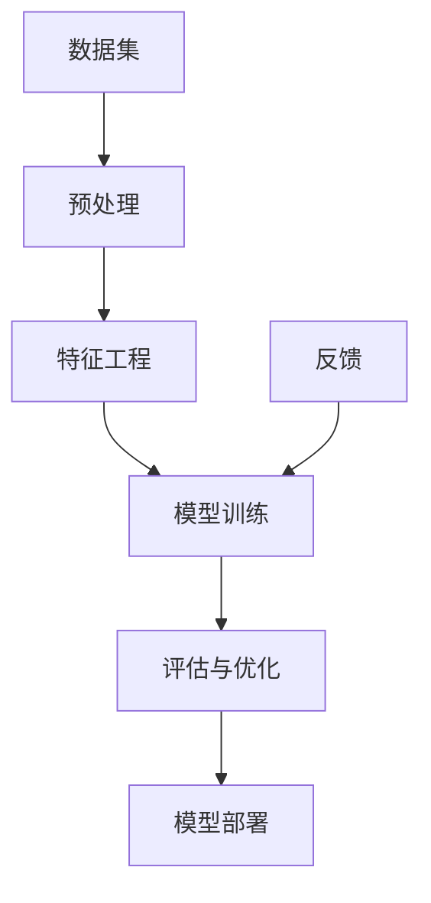

                 

关键词：软件2.0、数据驱动、训练数据集、算法优化、人工智能、机器学习

> 摘要：随着人工智能技术的飞速发展，传统的软件开发模式正面临巨大的变革。本文探讨了软件2.0时代的主要特征，即从代码编写转向训练数据集的重要性。通过对核心概念、算法原理、数学模型以及实际应用场景的深入分析，本文揭示了数据驱动开发模式带来的巨大潜力和挑战，并对未来软件产业的发展趋势进行了展望。

## 1. 背景介绍

在过去的几十年中，软件开发经历了从瀑布模型到敏捷开发的演变，然而，这些传统的开发模式始终围绕着代码的编写与维护。随着计算能力的提升和大数据技术的成熟，人工智能特别是机器学习算法的进步，已经使我们能够利用数据驱动的方式开发软件。这种新的模式不仅提高了软件开发的效率，还为解决复杂问题提供了新的思路。

软件2.0时代，开发人员不再只是编写代码，而是更多地关注于数据的收集、处理和利用。数据集的质量和多样性成为决定软件性能和功能的关键因素。传统软件开发的瓶颈，如软件复杂性、维护难度等问题，在一定程度上得到了缓解。

### 1.1 传统软件开发的挑战

1. **软件复杂性**：随着软件功能的不断增加，代码复杂性急剧增加，使得开发和维护成本高昂。
2. **维护难度**：软件一旦上线，就需要不断地维护和更新，以应对新的需求和问题。
3. **迭代速度**：传统开发模式往往周期较长，难以快速响应用户的需求变化。

### 1.2 数据驱动开发的优势

1. **高效性**：利用机器学习算法，可以自动化地处理大量数据，提高开发效率。
2. **灵活性**：通过数据集的调整，软件可以快速适应新的场景和需求。
3. **智能性**：机器学习算法能够从数据中学习，使软件具备自主学习和优化能力。

## 2. 核心概念与联系

在数据驱动的软件开发中，核心概念包括数据集、模型、算法等。以下是一个简化的Mermaid流程图，展示了这些概念之间的关系：



### 2.1 数据集

数据集是数据驱动的核心资源，它包括输入数据和相应的标签。高质量的数据集能够为模型提供丰富的信息，从而提高模型的性能。

### 2.2 预处理与特征工程

预处理和特征工程是数据集准备的重要步骤。预处理包括数据清洗、去重、填充缺失值等，而特征工程则涉及特征选择、特征提取和特征转换等。

### 2.3 模型训练

模型训练是数据驱动的核心步骤，通过机器学习算法，模型可以从数据集中学习到规律和模式。

### 2.4 评估与优化

模型训练完成后，需要对模型进行评估和优化。评估包括准确性、召回率、F1分数等指标，优化则涉及超参数调整、模型结构改进等。

### 2.5 模型部署

模型部署是将训练好的模型应用到实际场景中，实现自动化决策和智能服务。

### 2.6 反馈循环

模型部署后，用户的使用行为会反馈到数据集中，从而形成一个反馈循环。这个循环能够帮助模型不断学习和优化，提高其性能。

## 3. 核心算法原理 & 具体操作步骤

### 3.1 算法原理概述

在数据驱动的软件开发中，常用的算法包括监督学习、无监督学习和强化学习等。以下简要介绍这些算法的基本原理。

### 3.2 算法步骤详解

1. **数据收集**：收集相关的数据集，包括输入数据和标签。
2. **数据预处理**：对数据进行清洗、去重、填充缺失值等操作。
3. **特征工程**：对数据进行特征选择、特征提取和特征转换。
4. **模型选择**：根据问题的特点选择合适的模型。
5. **模型训练**：使用机器学习算法对模型进行训练。
6. **模型评估**：对模型进行评估，选择最优的模型。
7. **模型优化**：对模型进行超参数调整和结构改进。
8. **模型部署**：将训练好的模型应用到实际场景中。
9. **反馈循环**：收集用户反馈，用于模型优化。

### 3.3 算法优缺点

1. **监督学习**：
   - 优点：能够明确标注的输入输出数据，适用于分类和回归问题。
   - 缺点：对标签数据有较高要求，且可能存在过拟合问题。

2. **无监督学习**：
   - 优点：无需标签数据，适用于探索性数据分析。
   - 缺点：无法直接预测输出结果，模型解释性较差。

3. **强化学习**：
   - 优点：能够通过试错学习最优策略，适用于复杂决策问题。
   - 缺点：训练过程较慢，对环境状态有较高要求。

### 3.4 算法应用领域

1. **自然语言处理**：如文本分类、情感分析、机器翻译等。
2. **计算机视觉**：如图像分类、目标检测、图像生成等。
3. **推荐系统**：如商品推荐、内容推荐等。
4. **游戏AI**：如棋类游戏、电子竞技等。

## 4. 数学模型和公式 & 详细讲解 & 举例说明

### 4.1 数学模型构建

在机器学习中，常用的数学模型包括线性模型、逻辑回归、支持向量机等。以下以线性模型为例进行介绍。

### 4.2 公式推导过程

线性模型的公式为：

$$
y = \beta_0 + \beta_1 \cdot x
$$

其中，$y$ 为输出，$x$ 为输入，$\beta_0$ 和 $\beta_1$ 为模型的参数。

通过最小二乘法，可以求得参数的最优值：

$$
\beta_0 = \frac{\sum_{i=1}^{n} y_i - \beta_1 \cdot \sum_{i=1}^{n} x_i}{n}
$$

$$
\beta_1 = \frac{\sum_{i=1}^{n} (y_i - \beta_0 - \beta_1 \cdot x_i) \cdot x_i}{\sum_{i=1}^{n} x_i^2}
$$

### 4.3 案例分析与讲解

假设我们要预测一家电商平台的用户购买行为，输入特征包括用户年龄、收入、购物车中的商品数量等。

1. **数据收集**：收集用户的历史购买数据，包括输入特征和标签（是否购买）。
2. **数据预处理**：对数据进行清洗，去除缺失值和异常值。
3. **特征工程**：对特征进行转换，如将年龄进行分段。
4. **模型选择**：选择线性模型作为预测模型。
5. **模型训练**：使用收集到的数据进行模型训练。
6. **模型评估**：使用交叉验证方法评估模型性能。
7. **模型优化**：根据评估结果调整模型参数。
8. **模型部署**：将训练好的模型应用到电商平台，预测用户购买行为。

通过上述步骤，我们可以构建一个简单的预测模型，从而帮助电商平台进行用户行为分析。

## 5. 项目实践：代码实例和详细解释说明

### 5.1 开发环境搭建

1. 安装Python环境。
2. 安装相关依赖库，如numpy、pandas、scikit-learn等。

### 5.2 源代码详细实现

```python
import numpy as np
import pandas as pd
from sklearn.linear_model import LinearRegression
from sklearn.model_selection import train_test_split
from sklearn.metrics import mean_squared_error

# 数据收集
data = pd.read_csv('data.csv')

# 数据预处理
data = data.dropna()

# 特征工程
data['age_group'] = pd.cut(data['age'], bins=5, labels=False)

# 模型选择
model = LinearRegression()

# 模型训练
X = data[['age', 'income', 'age_group']]
y = data['purchase']
X_train, X_test, y_train, y_test = train_test_split(X, y, test_size=0.2, random_state=42)
model.fit(X_train, y_train)

# 模型评估
y_pred = model.predict(X_test)
mse = mean_squared_error(y_test, y_pred)
print('MSE:', mse)

# 模型优化
# ...（根据评估结果调整模型参数）

# 模型部署
# ...（将训练好的模型应用到电商平台）
```

### 5.3 代码解读与分析

1. **数据收集**：从CSV文件中读取数据，包括输入特征和标签。
2. **数据预处理**：去除缺失值和异常值，保证数据质量。
3. **特征工程**：将连续特征（如年龄）进行分段处理，以便更好地建模。
4. **模型选择**：选择线性回归模型，因为它简单且易于理解。
5. **模型训练**：使用训练数据集对模型进行训练。
6. **模型评估**：使用测试数据集评估模型性能，计算均方误差（MSE）。
7. **模型优化**：根据评估结果调整模型参数，以提高模型性能。
8. **模型部署**：将训练好的模型应用到实际场景，如电商平台。

通过以上步骤，我们可以实现一个简单的数据驱动软件项目。

## 6. 实际应用场景

数据驱动开发模式已经在多个领域得到广泛应用，以下列举几个典型应用场景：

1. **金融风控**：通过分析用户行为数据，预测信用风险，优化贷款审批流程。
2. **智能客服**：利用自然语言处理技术，实现智能客服系统，提高服务效率和满意度。
3. **医疗诊断**：通过分析医疗数据，辅助医生进行疾病诊断，提高诊断准确率。
4. **推荐系统**：根据用户行为数据，为用户推荐感兴趣的商品或内容，提高用户体验。

## 7. 工具和资源推荐

1. **学习资源推荐**：
   - 《Python机器学习》
   - 《深度学习》
   - 《机器学习实战》

2. **开发工具推荐**：
   - Jupyter Notebook：用于数据分析和模型训练。
   - PyCharm：用于Python编程和开发。

3. **相关论文推荐**：
   - 《Deep Learning》
   - 《Reinforcement Learning: An Introduction》
   - 《Natural Language Processing with Python》

## 8. 总结：未来发展趋势与挑战

### 8.1 研究成果总结

数据驱动开发模式已经取得了一系列重要研究成果，包括：

1. **模型性能提升**：通过大量数据训练，模型性能得到显著提升。
2. **开发效率提高**：自动化数据处理和模型训练，提高了开发效率。
3. **业务智能化**：数据驱动开发使得软件具备自主学习和优化能力，提高了业务智能化水平。

### 8.2 未来发展趋势

1. **数据质量提升**：随着数据采集技术的进步，数据质量将得到进一步提高。
2. **算法优化**：针对特定问题，优化算法结构，提高模型性能。
3. **跨领域应用**：数据驱动开发模式将在更多领域得到应用，如生物医学、智能制造等。

### 8.3 面临的挑战

1. **数据隐私保护**：如何保护用户数据隐私，防止数据滥用，是一个重要挑战。
2. **算法透明性与解释性**：提高算法的透明性和解释性，以增强用户信任。
3. **数据质量和多样性**：如何处理数据质量和多样性问题，确保模型训练效果。

### 8.4 研究展望

未来，数据驱动开发将继续深入发展，成为软件开发的主流模式。在此过程中，研究重点将转向数据质量、算法优化和跨领域应用。同时，也需要关注数据隐私保护、算法透明性和解释性等问题。

## 9. 附录：常见问题与解答

### 9.1 什么是数据驱动开发？

数据驱动开发是一种软件开发模式，其核心思想是通过数据来驱动开发过程，而非仅仅依靠代码编写。

### 9.2 数据驱动开发有哪些优势？

数据驱动开发的优势包括提高开发效率、提高模型性能、提高业务智能化水平等。

### 9.3 数据驱动开发需要哪些技能？

数据驱动开发需要掌握机器学习、数据预处理、特征工程、模型训练等技能。

### 9.4 数据驱动开发与传统的软件开发有何不同？

传统的软件开发主要依靠代码编写，而数据驱动开发则更多地关注于数据的收集、处理和利用。

### 9.5 数据驱动开发如何保障数据隐私？

保障数据隐私需要采取多种措施，如数据脱敏、数据加密、用户隐私保护协议等。

## 作者署名

作者：禅与计算机程序设计艺术 / Zen and the Art of Computer Programming
----------------------------------------------------------------

文章撰写完毕，现在我们可以开始撰写摘要和关键词了。请告诉我，您希望摘要和关键词的具体内容是什么，以便我能够按照您的期望进行撰写。

