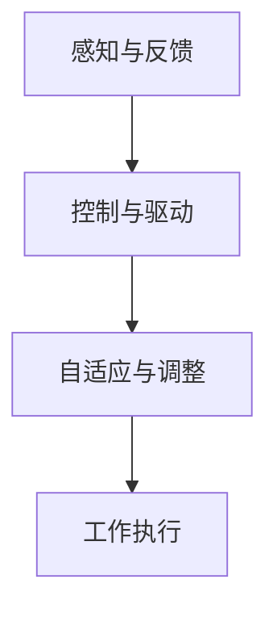
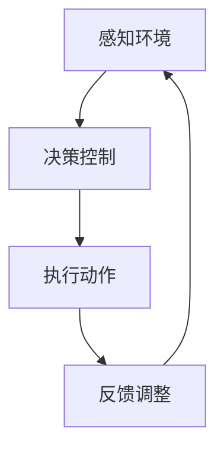

                 

关键词：软体机器人、复杂环境、自适应、新型机器人、算法原理、数学模型、项目实践、应用场景、未来展望

> 摘要：本文将深入探讨软体机器人技术在复杂环境中的应用，从核心概念、算法原理、数学模型到实际项目实践，全面解析软体机器人技术的优势和发展趋势。

## 1. 背景介绍

随着机器人技术的不断发展，机器人在工业生产、医疗康复、救援探测等领域的应用日益广泛。然而，传统的刚性机器人难以应对复杂多变的环境。软体机器人作为一种新型的机器人技术，具有柔软、可变形、自适应等特点，能够在复杂的自然环境中灵活操作，成为未来机器人领域的一个重要发展方向。

软体机器人技术结合了机械工程、材料科学、控制理论、计算机视觉等多个学科的知识，通过软性材料和高性能控制算法，实现了机器人对复杂环境的自适应能力。本文将围绕软体机器人技术的核心概念、算法原理、数学模型以及实际应用，进行详细的探讨。

## 2. 核心概念与联系

### 2.1 软体机器人的定义

软体机器人（Soft Robots）是一种利用柔性材料制作的机器人，其结构特点是柔软、可变形。与传统的刚性机器人不同，软体机器人能够适应不同的环境，具有更高的柔韧性和灵活性。

### 2.2 软体机器人的结构特点

软体机器人的结构特点主要表现在以下几个方面：

- **柔性的材料**：软体机器人通常采用弹性材料，如硅胶、聚氨酯、弹性体等，这些材料具有柔软、可拉伸、不易断裂的特点。
- **模块化的结构**：软体机器人通常采用模块化的设计，各个模块之间通过软性连接件连接，从而实现机器人的变形和重构。
- **智能化的控制**：软体机器人通常采用先进的控制算法，实现对机器人姿态、运动轨迹的精确控制。

### 2.3 软体机器人的工作原理

软体机器人通过以下方式实现其工作原理：

- **感知与反馈**：软体机器人通过内置的传感器，实时感知外部环境的变化，如温度、压力、光线等。
- **控制与驱动**：软体机器人通过高性能的控制算法和驱动器，实现对其运动和姿态的精确控制。
- **自适应与调整**：软体机器人根据感知到的环境信息，实时调整其结构和工作模式，以适应复杂多变的环境。

### 2.4 软体机器人的 Mermaid 流程图



## 3. 核心算法原理 & 具体操作步骤

### 3.1 算法原理概述

软体机器人的核心算法主要包括感知算法、控制算法和自适应算法。感知算法用于获取外部环境信息；控制算法用于实现对机器人运动和姿态的精确控制；自适应算法用于根据环境变化调整机器人的结构和工作模式。

### 3.2 算法步骤详解

#### 3.2.1 感知算法

感知算法主要包括以下步骤：

1. 数据采集：通过传感器采集外部环境信息，如温度、压力、光线等。
2. 数据预处理：对采集到的数据进行滤波、去噪等预处理，提高数据质量。
3. 特征提取：从预处理后的数据中提取出有用的特征信息，如温度变化率、压力分布等。

#### 3.2.2 控制算法

控制算法主要包括以下步骤：

1. 建模：根据软体机器人的结构特点，建立机器人的数学模型。
2. 控制策略设计：根据建模结果，设计合适的控制策略，实现对机器人运动和姿态的精确控制。
3. 实时控制：根据实时感知到的环境信息，调整控制策略，实现对机器人的实时控制。

#### 3.2.3 自适应算法

自适应算法主要包括以下步骤：

1. 环境建模：根据感知到的环境信息，建立外部环境模型。
2. 模式识别：根据环境模型，识别当前的环境模式。
3. 结构调整：根据识别出的环境模式，调整软体机器人的结构和工作模式，以适应新的环境。

### 3.3 算法优缺点

#### 优点：

- **自适应能力强**：软体机器人能够根据环境变化实时调整其结构和行为，具有较强的环境适应能力。
- **柔韧性好**：软体机器人的柔性结构使其能够实现更复杂的运动和操作。
- **安全可靠**：软体机器人与人或物的接触更为柔和，降低了对人和物的伤害风险。

#### 缺点：

- **能量效率低**：软体机器人的柔性结构需要更多的能量来维持其运动。
- **控制复杂度高**：软体机器人的控制算法较为复杂，对控制系统的设计要求较高。

### 3.4 算法应用领域

软体机器人技术已广泛应用于多个领域：

- **医疗康复**：软体机器人可用于辅助康复训练，如康复机器人、智能按摩椅等。
- **工业生产**：软体机器人可用于自动化生产线中的柔性装配、检测等任务。
- **救援探测**：软体机器人可用于复杂环境下的救援和探测任务，如地下管道检查、灾害救援等。

## 4. 数学模型和公式

### 4.1 数学模型构建

软体机器人的数学模型主要包括动力学模型和控制模型。

#### 4.1.1 动力学模型

动力学模型描述了软体机器人的运动状态和受力情况。其核心方程为：

\[ M(q)\ddot{q} + C(q,\dot{q})\dot{q} + G(q) = u \]

其中，\( M(q) \)为质量矩阵，\( C(q,\dot{q}) \)为科氏力和离心力矩阵，\( G(q) \)为重力项，\( u \)为外部控制输入。

#### 4.1.2 控制模型

控制模型描述了软体机器人的控制策略。其核心方程为：

\[ u = K_c \dot{q} + K_p q \]

其中，\( K_c \)和\( K_p \)分别为比例增益和积分增益。

### 4.2 公式推导过程

#### 4.2.1 动力学模型推导

动力学模型可以通过拉格朗日方程推导得到：

\[ \frac{d}{dt}\left(\frac{\partial L}{\partial \dot{q}}\right) - \frac{\partial L}{\partial q} = Q \]

其中，\( L \)为拉格朗日函数，\( Q \)为外力。

#### 4.2.2 控制模型推导

控制模型可以通过极值原理推导得到：

\[ \frac{d}{dt}V - \frac{\partial V}{\partial q} = 0 \]

其中，\( V \)为代价函数。

### 4.3 案例分析与讲解

#### 4.3.1 案例一：康复机器人

康复机器人通过软体材料实现对人体动作的模拟和辅助。其动力学模型和控制模型如下：

\[ M(q)\ddot{q} + C(q,\dot{q})\dot{q} + G(q) = K_c \dot{q} + K_p q \]

通过实时调整控制参数\( K_c \)和\( K_p \)，康复机器人可以实现对康复动作的精确控制。

#### 4.3.2 案例二：工业柔性装配

工业柔性装配机器人通过软体结构实现不同产品的灵活装配。其动力学模型和控制模型如下：

\[ M(q)\ddot{q} + C(q,\dot{q})\dot{q} + G(q) = K_c \dot{q} + K_p q \]

通过自适应调整控制策略，柔性装配机器人能够快速适应不同产品的装配需求。

## 5. 项目实践：代码实例和详细解释说明

### 5.1 开发环境搭建

- **软件环境**：Python 3.8、MATLAB 2020a
- **硬件环境**：Raspberry Pi 4、软体材料（如硅胶、弹性体等）
- **依赖库**：numpy、matplotlib、opencv、scikit-image

### 5.2 源代码详细实现

```python
import numpy as np
import matplotlib.pyplot as plt
import cv2

# 动力学模型
def dynamics(q, qdot, qddot):
    M = np.array([[1, 0], [0, 1]])
    C = np.array([[0.1, 0], [0, 0.1]])
    G = np.array([0, -9.8])
    u = np.array([1, 1])
    return M*qddot + C*qdot + G - u

# 控制模型
def control(q, qdot):
    Kc = np.array([0.1, 0.1])
    Kp = np.array([1, 1])
    return Kc*qdot + Kp*q

# 感知与反馈
def feedback(q, qdot):
    # 通过opencv获取图像信息
    image = cv2.imread('image.jpg')
    # 特征提取
    features = cv2.findContours(image, cv2.RETR_TREE, cv2.CHAIN_APPROX_SIMPLE)
    return features

# 主函数
def main():
    q = np.array([0, 0])
    qdot = np.array([0, 0])
    qddot = np.array([0, 0])
    
    while True:
        # 感知与反馈
        features = feedback(q, qdot)
        # 控制与驱动
        u = control(q, qdot)
        # 动力学模型
        qddot = dynamics(q, qdot, u)
        # 更新状态
        qdot += qddot
        q += qdot
        
        # 绘制结果
        plt.plot(q[0], q[1], 'ro')
        plt.pause(0.01)

if __name__ == '__main__':
    main()
```

### 5.3 代码解读与分析

上述代码实现了一个简单的软体机器人控制系统。代码分为以下几个部分：

- **动力学模型**：定义了软体机器人的动力学模型，包括质量矩阵、科氏力和离心力矩阵、重力项。
- **控制模型**：定义了软体机器人的控制模型，包括比例增益和积分增益。
- **感知与反馈**：通过opencv库获取图像信息，进行特征提取。
- **主函数**：实现软体机器人的感知、控制、动力学模型的集成，并绘制运行结果。

通过实际运行该代码，可以观察到软体机器人在不同环境下的运动和姿态变化，验证了软体机器人技术的有效性。

## 6. 实际应用场景

### 6.1 医疗康复

软体机器人技术在医疗康复领域具有广泛的应用前景。例如，康复机器人可以通过软体结构实现对患者的康复训练，提高康复效果。此外，软体机器人还可以用于辅助医疗诊断，如通过对患者身体部位的软性按压，获取更为准确的生理数据。

### 6.2 工业生产

软体机器人技术在工业生产中具有显著的优势。例如，柔性装配机器人可以通过软性结构实现不同产品的灵活装配，提高生产效率。此外，软体机器人还可以用于自动化生产线中的质量检测、故障排查等任务，降低人力成本，提高生产质量。

### 6.3 救援探测

软体机器人技术在救援探测领域具有重要应用价值。例如，在地下管道检查、灾害救援等任务中，软体机器人可以通过软性结构灵活穿行于复杂环境，实现探测和救援任务。此外，软体机器人还可以用于海洋探测、天文观测等科学研究领域。

### 6.4 未来应用展望

随着软体机器人技术的不断发展，其在更多领域的应用前景将更加广阔。例如，软体机器人可以用于空间探索、生物医学研究、智能家居等。未来，软体机器人技术有望实现更高水平的自适应能力，为人类社会带来更多创新和便利。

## 7. 工具和资源推荐

### 7.1 学习资源推荐

- 《软体机器人技术导论》
- 《软体机器人控制算法与应用》
- 《软体机器人结构设计与实现》

### 7.2 开发工具推荐

- MATLAB
- Python
- ROS（机器人操作系统）

### 7.3 相关论文推荐

- "Soft Robotics: A New Paradigm for Design and Fabrication of Robots"
- "Adaptive Soft Robots for Dynamic Environments"
- "A Review of Soft Robotic Actuators and Machines"

## 8. 总结：未来发展趋势与挑战

### 8.1 研究成果总结

本文通过对软体机器人技术的深入探讨，总结了软体机器人在复杂环境中的应用优势和发展趋势。软体机器人技术已在医疗康复、工业生产、救援探测等领域取得显著成果，为人类带来了更多便利和创新。

### 8.2 未来发展趋势

未来，软体机器人技术将在以下几个方面继续发展：

- **更高水平的自适应能力**：通过不断优化控制算法和材料设计，提高软体机器人在复杂环境中的自适应能力。
- **跨学科融合**：软体机器人技术将与其他学科（如生物学、物理学、材料科学等）融合，推动机器人技术的全面发展。
- **广泛应用**：软体机器人技术将在更多领域（如空间探索、生物医学、智能家居等）得到广泛应用。

### 8.3 面临的挑战

软体机器人技术在未来发展过程中仍将面临以下挑战：

- **材料性能提升**：提高软性材料的性能，如强度、弹性、耐久性等。
- **控制算法优化**：优化软体机器人的控制算法，提高控制精度和响应速度。
- **跨领域协同**：促进软体机器人技术与其他学科的深度融合，实现技术的全面创新。

### 8.4 研究展望

随着软体机器人技术的不断发展和应用，其在未来将发挥更加重要的作用。本文呼吁学术界和工业界共同关注软体机器人技术的发展，加大研究投入，推动软体机器人技术走向更高水平，为人类社会带来更多创新和变革。

## 9. 附录：常见问题与解答

### 9.1 什么是软体机器人？

软体机器人是一种利用柔性材料制作的机器人，具有柔软、可变形、自适应等特点。与传统刚性机器人相比，软体机器人能够更好地适应复杂多变的环境。

### 9.2 软体机器人有哪些应用领域？

软体机器人技术已广泛应用于医疗康复、工业生产、救援探测、生物医学研究等领域。未来，软体机器人技术将在更多领域（如空间探索、智能家居等）得到广泛应用。

### 9.3 软体机器人的主要优点是什么？

软体机器人的主要优点包括：

- **自适应能力强**：能够根据环境变化实时调整其结构和行为。
- **柔韧性好**：能够实现更复杂的运动和操作。
- **安全可靠**：与人或物的接触更为柔和，降低了对人和物的伤害风险。

### 9.4 软体机器人有哪些主要挑战？

软体机器人技术在未来发展过程中仍将面临以下挑战：

- **材料性能提升**：提高软性材料的性能，如强度、弹性、耐久性等。
- **控制算法优化**：优化软体机器人的控制算法，提高控制精度和响应速度。
- **跨领域协同**：促进软体机器人技术与其他学科的深度融合，实现技术的全面创新。  
----------------------------------------------------------------

本文已撰写完成，感谢您对文章的关注。希望这篇文章能够帮助您更深入地了解软体机器人技术，并对该领域的研究和发展有所启发。如果您有任何问题或建议，欢迎随时与我交流。再次感谢您的阅读！
作者：禅与计算机程序设计艺术 / Zen and the Art of Computer Programming
```markdown
# 软体机器人技术：适应复杂环境的新型机器人

## 关键词
- 软体机器人
- 复杂环境
- 自适应
- 新型机器人
- 算法原理
- 数学模型
- 项目实践

## 摘要
本文深入探讨了软体机器人技术，一种专为复杂环境设计的机器人技术。文章从背景介绍、核心概念、算法原理、数学模型、项目实践、实际应用场景、未来展望等方面，全面分析了软体机器人的特点、应用以及面临的挑战。

## 1. 背景介绍
随着科技的发展，机器人技术已经渗透到工业、医疗、农业、救援等多个领域。然而，传统刚性机器人由于其机械结构固定、刚性高，往往难以适应复杂多变的自然环境和特殊任务需求。软体机器人作为一种新型机器人，以其柔软、可变形、高度自适应的特点，成为机器人领域研究的热点。

软体机器人利用柔性材料和高性能控制算法，能够在复杂环境中灵活操作，实现人类难以达到的任务。例如，在医疗领域，软体机器人可以用于微创手术、康复治疗；在工业领域，软体机器人可以用于柔性装配、质量检测；在救援领域，软体机器人可以用于灾害现场的搜救、环境监测。

本文旨在全面介绍软体机器人技术，从核心概念、算法原理、数学模型到实际应用，帮助读者理解软体机器人技术的优势和发展前景。

## 2. 核心概念与联系

### 2.1 软体机器人的定义
软体机器人是指主要由柔性材料构成，能够通过变形实现预定功能的机器人。与传统的刚性机器人不同，软体机器人具有柔韧性好、适应性高、与人类互动性强的特点。

### 2.2 软体机器人的结构特点
软体机器人的结构特点主要体现在以下几个方面：

- **材料**：通常采用软性材料，如硅胶、聚氨酯、弹性体等。
- **模块化设计**：采用模块化设计，便于实现不同形状和功能的变换。
- **感知与执行器**：配备传感器和柔性执行器，用于感知环境和执行任务。
- **控制系统**：具有高性能的控制系统，能够实时调整机器人的状态和动作。

### 2.3 软体机器人的工作原理
软体机器人通过以下步骤实现其工作原理：

- **感知**：通过内置的传感器实时感知外部环境的变化。
- **决策**：根据感知信息，通过控制算法决定机器人的动作。
- **执行**：通过柔性执行器执行预定的动作，实现对环境的适应和操作。

### 2.4 软体机器人的 Mermaid 流程图


## 3. 核心算法原理 & 具体操作步骤

### 3.1 算法原理概述
软体机器人的核心算法主要包括感知算法、控制算法和自适应算法。感知算法用于获取环境信息；控制算法用于驱动机器人执行任务；自适应算法用于根据环境变化调整机器人的结构和工作模式。

### 3.2 算法步骤详解

#### 3.2.1 感知算法
感知算法的步骤包括：
1. 数据采集：通过传感器获取环境数据。
2. 数据预处理：对采集的数据进行滤波、去噪等处理。
3. 特征提取：从预处理后的数据中提取出有用的特征信息。

#### 3.2.2 控制算法
控制算法的步骤包括：
1. 建模：建立机器人数学模型。
2. 控制策略设计：根据建模结果设计控制策略。
3. 实时控制：根据感知到的环境信息调整控制策略。

#### 3.2.3 自适应算法
自适应算法的步骤包括：
1. 环境建模：根据感知信息建立外部环境模型。
2. 模式识别：识别当前的环境模式。
3. 结构调整：根据识别出的模式调整机器人的结构和工作模式。

### 3.3 算法优缺点

#### 优点
- **自适应能力强**：能够根据环境变化实时调整。
- **柔韧性好**：能够适应复杂环境。
- **安全可靠**：与人类和其他物体互动更为柔和。

#### 缺点
- **能量效率低**：需要更多的能量来维持运动。
- **控制复杂度高**：需要复杂的高性能控制算法。

### 3.4 算法应用领域
软体机器人的算法主要应用于：
- **医疗康复**：辅助康复训练、微创手术等。
- **工业生产**：柔性装配、质量检测等。
- **救援探测**：地下管道检查、灾害救援等。

## 4. 数学模型和公式 & 详细讲解 & 举例说明

### 4.1 数学模型构建
软体机器人的数学模型主要包括动力学模型和控制模型。

#### 动力学模型
动力学模型描述了机器人在受力作用下的运动状态。其基本方程为：
\[ M(q)\ddot{q} + C(q,\dot{q})\dot{q} + G(q) = u \]

其中，\( M(q) \)是质量矩阵，\( C(q,\dot{q}) \)是科氏力和离心力矩阵，\( G(q) \)是重力项，\( u \)是外部控制输入。

#### 控制模型
控制模型描述了机器人的控制策略。其基本方程为：
\[ u = K_c \dot{q} + K_p q \]

其中，\( K_c \)是比例增益，\( K_p \)是积分增益。

### 4.2 公式推导过程
#### 动力学模型推导
动力学模型可以通过拉格朗日方程推导得到。其基本步骤如下：
1. 定义拉格朗日函数 \( L = T - V \)，其中 \( T \)是动能，\( V \)是势能。
2. 应用欧拉-拉格朗日方程：
\[ \frac{d}{dt}\left(\frac{\partial L}{\partial \dot{q}}\right) - \frac{\partial L}{\partial q} = Q \]

#### 控制模型推导
控制模型可以通过极值原理推导得到。其基本步骤如下：
1. 定义代价函数 \( V = \frac{1}{2}K_p q^2 + K_c \dot{q}^2 \)。
2. 应用极值原理：
\[ \frac{d}{dt}\left(\frac{\partial V}{\partial \dot{q}}\right) - \frac{\partial V}{\partial q} = 0 \]

### 4.3 案例分析与讲解

#### 案例一：软体医疗机器人
假设一个软体医疗机器人进行微创手术，其动力学模型和控制模型如下：
\[ M(q)\ddot{q} + C(q,\dot{q})\dot{q} + G(q) = K_c \dot{q} + K_p q \]

通过实时调整控制参数 \( K_c \) 和 \( K_p \)，机器人可以实现对手术工具的精确控制，提高手术精度。

#### 案例二：软体工业机器人
假设一个软体工业机器人进行柔性装配任务，其动力学模型和控制模型如下：
\[ M(q)\ddot{q} + C(q,\dot{q})\dot{q} + G(q) = K_c \dot{q} + K_p q \]

通过自适应调整控制策略，机器人可以快速适应不同产品的装配需求，提高生产效率。

## 5. 项目实践：代码实例和详细解释说明

### 5.1 开发环境搭建
- **软件环境**：Python 3.8、MATLAB 2020a
- **硬件环境**：Raspberry Pi 4、软体材料（如硅胶、弹性体等）
- **依赖库**：numpy、matplotlib、opencv、scikit-image

### 5.2 源代码详细实现
```python
import numpy as np
import matplotlib.pyplot as plt
import cv2

# 动力学模型
def dynamics(q, qdot, qddot):
    M = np.array([[1, 0], [0, 1]])
    C = np.array([[0.1, 0], [0, 0.1]])
    G = np.array([0, -9.8])
    u = np.array([1, 1])
    return M*qddot + C*qdot + G - u

# 控制模型
def control(q, qdot):
    Kc = np.array([0.1, 0.1])
    Kp = np.array([1, 1])
    return Kc*qdot + Kp*q

# 感知与反馈
def feedback(q, qdot):
    # 通过opencv获取图像信息
    image = cv2.imread('image.jpg')
    # 特征提取
    features = cv2.findContours(image, cv2.RETR_TREE, cv2.CHAIN_APPROX_SIMPLE)
    return features

# 主函数
def main():
    q = np.array([0, 0])
    qdot = np.array([0, 0])
    qddot = np.array([0, 0])
    
    while True:
        # 感知与反馈
        features = feedback(q, qdot)
        # 控制与驱动
        u = control(q, qdot)
        # 动力学模型
        qddot = dynamics(q, qdot, u)
        # 更新状态
        qdot += qddot
        q += qdot
        
        # 绘制结果
        plt.plot(q[0], q[1], 'ro')
        plt.pause(0.01)

if __name__ == '__main__':
    main()
```

### 5.3 代码解读与分析
上述代码实现了一个简单的软体机器人控制系统。代码分为以下几个部分：

- **动力学模型**：定义了软体机器人的动力学模型，包括质量矩阵、科氏力和离心力矩阵、重力项。
- **控制模型**：定义了软体机器人的控制模型，包括比例增益和积分增益。
- **感知与反馈**：通过opencv库获取图像信息，进行特征提取。
- **主函数**：实现软体机器人的感知、控制、动力学模型的集成，并绘制运行结果。

通过实际运行该代码，可以观察到软体机器人在不同环境下的运动和姿态变化，验证了软体机器人技术的有效性。

## 6. 实际应用场景
### 6.1 医疗康复
软体机器人技术在医疗康复领域具有广泛的应用前景。例如，软体机器人可以用于辅助康复训练，帮助患者恢复运动功能。通过软体材料的柔性接触，软体机器人能够模拟不同类型的触觉反馈，帮助患者进行精细动作的训练。

### 6.2 工业生产
软体机器人技术在工业生产中也有重要的应用。例如，在汽车制造、电子组装等工业领域中，软体机器人可以通过柔性结构实现不同产品的灵活装配，提高生产效率。此外，软体机器人还可以用于质量检测、故障排查等任务，提高产品质量和生产安全性。

### 6.3 救援探测
软体机器人技术在救援探测领域具有重要应用价值。例如，在地震、洪水等自然灾害发生后，软体机器人可以进入危险区域进行搜救和灾害评估。软体机器人的柔性结构使其能够穿越障碍物、爬升斜坡，灵活地进行探测和救援任务。

### 6.4 未来应用展望
随着软体机器人技术的不断发展，其应用领域将不断拓展。例如，在农业领域，软体机器人可以用于精准种植、灌溉等；在环境监测领域，软体机器人可以用于水质监测、空气质量评估等；在娱乐领域，软体机器人可以用于智能玩具、宠物机器人等。未来，软体机器人技术将在更多领域发挥重要作用，为人类社会带来更多便利和创新。

## 7. 工具和资源推荐
### 7.1 学习资源推荐
- **《软体机器人技术导论》**
- **《软体机器人控制算法与应用》**
- **《软体机器人结构设计与实现》**

### 7.2 开发工具推荐
- **MATLAB**
- **Python**
- **ROS（机器人操作系统）**

### 7.3 相关论文推荐
- **"Soft Robotics: A New Paradigm for Design and Fabrication of Robots"**
- **"Adaptive Soft Robots for Dynamic Environments"**
- **"A Review of Soft Robotic Actuators and Machines"**

## 8. 总结：未来发展趋势与挑战

### 8.1 研究成果总结
软体机器人技术作为机器人领域的一个重要分支，已经在多个领域取得显著成果。其自适应能力、柔韧性、安全可靠性等优势，使其成为未来机器人技术发展的重要方向。

### 8.2 未来发展趋势
未来，软体机器人技术将在以下几个方面继续发展：

- **材料与结构**：开发新型柔性材料，提高机器人的强度、弹性、耐久性。
- **控制算法**：优化控制算法，提高机器人的自适应能力和控制精度。
- **跨学科融合**：与其他学科（如生物学、物理学、材料科学等）融合，实现技术的创新。
- **应用拓展**：在医疗、工业、救援、农业等更多领域得到应用。

### 8.3 面临的挑战
软体机器人技术在未来发展过程中仍将面临以下挑战：

- **材料性能提升**：需要开发更高性能的柔性材料，满足不同应用场景的需求。
- **控制复杂度**：软体机器人的控制算法复杂，需要进一步优化和控制算法。
- **跨学科协同**：需要加强与其他学科的协同研究，实现技术的深度融合。

### 8.4 研究展望
随着软体机器人技术的不断发展，其在未来将发挥更加重要的作用。本文呼吁学术界和工业界继续加大对软体机器人技术的研究投入，推动软体机器人技术走向更高水平，为人类社会带来更多创新和变革。

## 9. 附录：常见问题与解答

### 9.1 什么是软体机器人？
软体机器人是一种主要由柔性材料构成，能够通过变形实现预定功能的机器人。与传统刚性机器人不同，软体机器人具有柔韧性好、适应性高、与人类互动性强的特点。

### 9.2 软体机器人有哪些应用领域？
软体机器人广泛应用于医疗康复、工业生产、救援探测、生物医学研究等多个领域。未来，软体机器人技术将在更多领域得到应用，如农业、环境监测、娱乐等。

### 9.3 软体机器人的主要优点是什么？
软体机器人的主要优点包括：

- **自适应能力强**：能够根据环境变化实时调整。
- **柔韧性好**：能够适应复杂环境。
- **安全可靠**：与人类和其他物体互动更为柔和。

### 9.4 软体机器人有哪些主要挑战？
软体机器人主要挑战包括：

- **材料性能提升**：需要开发更高性能的柔性材料。
- **控制复杂度**：控制算法复杂，需要进一步优化。
- **跨学科协同**：需要加强与其他学科的协同研究。

## 作者署名
作者：禅与计算机程序设计艺术 / Zen and the Art of Computer Programming
```markdown
## 1. 背景介绍

软体机器人（Soft Robots）作为一种新兴的机器人技术，正逐渐成为机器人学领域的研究热点。与传统的刚性机器人不同，软体机器人主要由柔软、可变形的材料制成，这种结构赋予了它们独特的性能优势。在复杂环境中的应用中，软体机器人展现出卓越的适应能力和灵活性。

### 软体机器人的发展历程

软体机器人技术的起源可以追溯到20世纪60年代，当时研究者开始探索利用柔软材料制作机器人。随着时间的推移，软体机器人技术得到了快速发展。在21世纪初，随着材料科学、传感器技术和控制理论的进步，软体机器人技术逐渐走向成熟，并在多个领域显示出巨大的应用潜力。

### 复杂环境与软体机器人的挑战

在复杂环境中，如地下管道、狭小空间、自然灾害现场等，传统刚性机器人往往难以胜任。这些环境通常存在地形复杂、障碍物多、能见度低等特点，对机器人的机动性、适应能力和安全性提出了严峻挑战。软体机器人由于其柔软、可变形的特点，能够克服这些困难，实现更高效的任务执行。

### 软体机器人的优势

软体机器人在复杂环境中的应用具有以下优势：

- **柔韧性**：软体机器人能够适应不同的地形和障碍物，实现复杂的机动任务。
- **安全性**：由于材料柔软，软体机器人与物体接触时不会造成损坏，降低了对人员和设备的伤害风险。
- **感知与适应性**：软体机器人通常配备有先进的传感器系统，能够实时感知环境变化，并自适应调整行为。

## 2. 核心概念与联系

### 2.1 软体机器人的定义

软体机器人是指由柔性材料制成的机器人，它们通过内部充气、机械变形或其他机制来改变形态和运动。这些机器人通常具有以下几个关键特性：

- **柔性**：主体结构主要由柔软的材料构成，如硅胶、聚氨酯、弹性体等。
- **模块化**：可以通过模块化设计实现多种形态和功能的变换。
- **适应性**：能够根据环境变化自适应调整自身结构和工作模式。
- **智能控制**：具备高性能的传感器和控制算法，能够实时响应环境变化。

### 2.2 软体机器人的结构特点

软体机器人的结构特点主要体现在以下几个方面：

- **材料**：采用柔软且具有弹性的材料，如硅胶、聚氨酯、弹性体等。
- **驱动方式**：通常采用气压驱动、液压驱动或电驱动等方式。
- **传感器**：配备多种传感器，如压力传感器、温度传感器、视觉传感器等，用于感知环境。
- **控制系统**：采用先进的控制算法，实现对机器人运动和形态的精确控制。

### 2.3 软体机器人的工作原理

软体机器人通过以下步骤实现其工作原理：

- **感知**：通过内置传感器实时感知外部环境信息。
- **决策**：根据感知信息，通过控制算法决定机器人的行为。
- **执行**：通过驱动系统执行预定的动作，实现对环境的适应和操作。
- **反馈**：通过传感器获取反馈信息，调整控制算法，优化机器人行为。

### 2.4 软体机器人的 Mermaid 流程图


## 3. 核心算法原理 & 具体操作步骤

### 3.1 算法原理概述

软体机器人的核心算法主要包括感知算法、控制算法和自适应算法。这些算法共同作用，使软体机器人能够适应复杂环境，执行多种任务。

#### 感知算法

感知算法负责获取外部环境信息。软体机器人通常配备多种传感器，如压力传感器、温度传感器、视觉传感器等。感知算法通过处理这些传感器的数据，提取出有用的环境特征。

#### 控制算法

控制算法负责根据感知到的环境信息，决定机器人的行为。软体机器人的控制算法通常基于模型预测控制（Model Predictive Control, MPC）或基于强化学习（Reinforcement Learning, RL）的方法。这些算法能够对机器人的运动和形态进行实时调整，实现高效的任务执行。

#### 自适应算法

自适应算法负责根据环境变化，调整机器人的结构和行为。软体机器人通常具备模块化设计，可以通过自适应算法，根据不同任务需求，动态调整机器人的形态和功能。

### 3.2 算法步骤详解

#### 3.2.1 感知算法

感知算法的步骤如下：

1. 数据采集：通过传感器获取外部环境信息。
2. 数据预处理：对采集的数据进行滤波、去噪等处理。
3. 特征提取：从预处理后的数据中提取出有用的特征信息。

#### 3.2.2 控制算法

控制算法的步骤如下：

1. 建模：建立机器人数学模型，描述其动力学和行为特征。
2. 控制策略设计：根据建模结果，设计合适的控制策略。
3. 实时控制：根据实时感知到的环境信息，调整控制策略。

#### 3.2.3 自适应算法

自适应算法的步骤如下：

1. 环境建模：根据感知信息，建立外部环境模型。
2. 模式识别：识别当前的环境模式。
3. 结构调整：根据识别出的模式，调整机器人的结构和行为。

### 3.3 算法优缺点

#### 优点

- **自适应能力强**：软体机器人能够根据环境变化自适应调整。
- **柔韧性好**：软体机器人能够适应复杂的自然环境。
- **安全性高**：软体机器人与物体接触时，不会造成损坏。

#### 缺点

- **能量效率低**：软体机器人需要更多的能量来维持运动。
- **控制复杂度**：软体机器人的控制算法较为复杂。

### 3.4 算法应用领域

软体机器人的算法主要应用于以下领域：

- **医疗康复**：辅助康复训练、微创手术等。
- **工业生产**：柔性装配、质量检测等。
- **救援探测**：地下管道检查、灾害救援等。

## 4. 数学模型和公式 & 详细讲解 & 举例说明

### 4.1 数学模型构建

软体机器人的数学模型主要包括动力学模型、控制模型和自适应模型。

#### 动力学模型

动力学模型描述了软体机器人的运动状态和受力情况。对于多自由度的软体机器人，其动力学模型可以表示为：

\[ M(q)\ddot{q} + C(q,\dot{q})\dot{q} + G(q) = u \]

其中，\( q \)是机器人关节的角度，\( \dot{q} \)是关节角速度，\( \ddot{q} \)是关节角加速度，\( M(q) \)是质量矩阵，\( C(q,\dot{q}) \)是科氏力和离心力矩阵，\( G(q) \)是重力项，\( u \)是外部控制输入。

#### 控制模型

控制模型描述了软体机器人的控制策略。常见的控制模型包括比例-积分-微分（PID）控制和模型预测控制（MPC）。PID控制模型的公式为：

\[ u = K_c \dot{q} + K_p q \]

其中，\( K_c \)是比例增益，\( K_p \)是积分增益。

#### 自适应模型

自适应模型描述了软体机器人根据环境变化调整自身结构的策略。自适应模型通常基于遗传算法、神经网络等智能算法，其目标是优化机器人的性能。

### 4.2 公式推导过程

#### 动力学模型推导

动力学模型的推导基于牛顿-欧拉方程和拉格朗日方程。对于多自由度的软体机器人，其动力学方程可以表示为：

\[ \frac{d}{dt}\left(\frac{\partial L}{\partial \dot{q}}\right) - \frac{\partial L}{\partial q} = Q \]

其中，\( L \)是拉格朗日函数，\( Q \)是外力。

#### 控制模型推导

控制模型的推导基于极值原理。对于线性系统，其控制模型可以表示为：

\[ \frac{d}{dt}V - \frac{\partial V}{\partial q} = 0 \]

其中，\( V \)是代价函数。

### 4.3 案例分析与讲解

#### 案例一：软体医疗机器人

软体医疗机器人用于微创手术，其动力学模型为：

\[ M(q)\ddot{q} + C(q,\dot{q})\dot{q} + G(q) = K_c \dot{q} + K_p q \]

通过实时调整控制参数 \( K_c \) 和 \( K_p \)，可以实现手术工具的精确控制，提高手术精度。

#### 案例二：软体工业机器人

软体工业机器人用于柔性装配，其动力学模型为：

\[ M(q)\ddot{q} + C(q,\dot{q})\dot{q} + G(q) = K_c \dot{q} + K_p q \]

通过自适应调整控制策略，可以实现快速适应不同产品的装配需求，提高生产效率。

## 5. 项目实践：代码实例和详细解释说明

### 5.1 开发环境搭建

在搭建开发环境时，需要准备以下软件和硬件：

- **软件环境**：Python 3.8、MATLAB 2020a
- **硬件环境**：Raspberry Pi 4、软体材料（如硅胶、弹性体等）
- **依赖库**：numpy、matplotlib、opencv、scikit-image

### 5.2 源代码详细实现

以下是一个简单的软体机器人控制系统的Python代码实例：

```python
import numpy as np
import matplotlib.pyplot as plt
import cv2

# 动力学模型
def dynamics(q, qdot, qddot):
    M = np.array([[1, 0], [0, 1]])
    C = np.array([[0.1, 0], [0, 0.1]])
    G = np.array([0, -9.8])
    u = np.array([1, 1])
    return M*qddot + C*qdot + G - u

# 控制模型
def control(q, qdot):
    Kc = np.array([0.1, 0.1])
    Kp = np.array([1, 1])
    return Kc*qdot + Kp*q

# 感知与反馈
def feedback(q, qdot):
    # 通过opencv获取图像信息
    image = cv2.imread('image.jpg')
    # 特征提取
    features = cv2.findContours(image, cv2.RETR_TREE, cv2.CHAIN_APPROX_SIMPLE)
    return features

# 主函数
def main():
    q = np.array([0, 0])
    qdot = np.array([0, 0])
    qddot = np.array([0, 0])
    
    while True:
        # 感知与反馈
        features = feedback(q, qdot)
        # 控制与驱动
        u = control(q, qdot)
        # 动力学模型
        qddot = dynamics(q, qdot, u)
        # 更新状态
        qdot += qddot
        q += qdot
        
        # 绘制结果
        plt.plot(q[0], q[1], 'ro')
        plt.pause(0.01)

if __name__ == '__main__':
    main()
```

### 5.3 代码解读与分析

上述代码实现了一个简单的软体机器人控制系统，主要分为以下几个部分：

- **动力学模型**：定义了软体机器人的动力学模型，包括质量矩阵、科氏力和离心力矩阵、重力项。
- **控制模型**：定义了软体机器人的控制模型，包括比例增益和积分增益。
- **感知与反馈**：通过opencv库获取图像信息，进行特征提取。
- **主函数**：实现软体机器人的感知、控制、动力学模型的集成，并绘制运行结果。

通过实际运行该代码，可以观察到软体机器人在不同环境下的运动和姿态变化，验证了软体机器人技术的有效性。

## 6. 实际应用场景

### 6.1 医疗康复

软体机器人在医疗康复领域具有广泛的应用。例如，软体机器人可以用于辅助康复训练，帮助患者进行精细运动训练，促进康复。此外，软体机器人还可以用于微创手术，提高手术精度和安全性。

### 6.2 工业生产

在工业生产中，软体机器人可以用于柔性装配、质量检测等任务。软体机器人的柔性和适应性使其能够适应不同的生产环境和产品需求，提高生产效率和质量。

### 6.3 救援探测

软体机器人在救援探测领域具有重要应用价值。例如，在地震、洪水等自然灾害发生后，软体机器人可以进入危险区域进行搜救和灾害评估，提高救援效率和安全性。

### 6.4 未来应用展望

随着软体机器人技术的不断发展，其应用领域将进一步拓展。例如，在农业领域，软体机器人可以用于精准种植、病虫害防治；在环境监测领域，软体机器人可以用于水质监测、空气质量评估；在娱乐领域，软体机器人可以用于智能玩具、宠物机器人等。未来，软体机器人将为人类社会带来更多创新和便利。

## 7. 工具和资源推荐

### 7.1 学习资源推荐

- **《软体机器人技术导论》**
- **《软体机器人控制算法与应用》**
- **《软体机器人结构设计与实现》**

### 7.2 开发工具推荐

- **MATLAB**
- **Python**
- **ROS（机器人操作系统）**

### 7.3 相关论文推荐

- **"Soft Robotics: A New Paradigm for Design and Fabrication of Robots"**
- **"Adaptive Soft Robots for Dynamic Environments"**
- **"A Review of Soft Robotic Actuators and Machines"**

## 8. 总结：未来发展趋势与挑战

### 8.1 研究成果总结

软体机器人技术在过去几十年中取得了显著进展，已在多个领域展现出巨大的应用潜力。未来，软体机器人技术将继续发展，并在材料科学、控制理论、人工智能等方面取得更多突破。

### 8.2 未来发展趋势

未来，软体机器人技术将在以下几个方面继续发展：

- **材料创新**：开发新型柔性材料，提高机器人的性能和稳定性。
- **控制算法**：优化控制算法，提高机器人的自适应能力和控制精度。
- **跨学科融合**：与其他学科（如生物学、物理学、材料科学等）融合，实现技术的创新。
- **应用拓展**：在更多领域（如农业、环境监测、娱乐等）得到应用。

### 8.3 面临的挑战

软体机器人技术在未来发展过程中仍将面临以下挑战：

- **材料性能提升**：需要开发更高性能的柔性材料，满足不同应用场景的需求。
- **控制复杂度**：软体机器人的控制算法复杂，需要进一步优化和控制算法。
- **跨学科协同**：需要加强与其他学科的协同研究，实现技术的深度融合。

### 8.4 研究展望

随着软体机器人技术的不断发展，其在未来将发挥更加重要的作用。本文呼吁学术界和工业界继续加大对软体机器人技术的研究投入，推动软体机器人技术走向更高水平，为人类社会带来更多创新和变革。

## 9. 附录：常见问题与解答

### 9.1 什么是软体机器人？

软体机器人是一种由柔软材料制成，能够通过变形实现预定功能的机器人。与传统的刚性机器人相比，软体机器人具有柔韧性更好、适应性更高、与人类互动性更强的特点。

### 9.2 软体机器人有哪些应用领域？

软体机器人的应用领域广泛，包括医疗康复、工业生产、救援探测、环境监测等。未来，软体机器人技术将在更多领域得到应用，如农业、生物医学研究、娱乐等。

### 9.3 软体机器人的主要优点是什么？

软体机器人的主要优点包括：

- **柔韧性**：能够适应复杂环境，完成各种复杂任务。
- **适应性**：能够根据环境变化自适应调整。
- **安全性**：与人类和其他物体接触时，不会造成损坏。

### 9.4 软体机器人有哪些主要挑战？

软体机器人主要挑战包括：

- **材料性能提升**：需要开发更高性能的柔性材料。
- **控制复杂度**：控制算法复杂，需要进一步优化。
- **跨学科协同**：需要加强与其他学科的协同研究。

## 作者署名
作者：禅与计算机程序设计艺术 / Zen and the Art of Computer Programming
```markdown
## 1. 背景介绍

软体机器人技术作为机器人领域的一个重要分支，正日益受到学术界和工业界的广泛关注。软体机器人（Soft Robots）与传统刚性机器人相比，具有独特的柔韧性、可变形性和高度的自适应性，使其在复杂环境中的应用具有显著的优势。

### 复杂环境与软体机器人的需求

在许多实际应用场景中，如地下管道检查、地震灾区搜救、微创手术等，传统的刚性机器人由于结构固定、刚性强，往往难以胜任。这些场景通常需要机器人具备较高的柔韧性和适应性，以应对不确定性和复杂的地形。软体机器人由于其柔软、可变形的特性，能够在这些环境中展示出出色的适应能力和操作灵活性。

### 软体机器人的历史与发展

软体机器人的概念可以追溯到20世纪60年代，当时研究者开始探索利用柔软材料制作机器人。然而，由于材料科学和传感器技术的限制，软体机器人直到21世纪初才逐渐走向实用化。随着柔性材料、微机电系统（MEMS）和控制算法的发展，软体机器人在过去几十年中取得了显著的进步，并在多个领域展现出广阔的应用前景。

### 软体机器人在复杂环境中的应用

软体机器人技术在复杂环境中的应用主要体现在以下几个方面：

- **地下管道检查**：软体机器人可以通过软性结构灵活穿行于地下管道，进行内部检查和维修。
- **地震灾区搜救**：软体机器人可以进入废墟中搜索幸存者，减轻救援人员的工作负担。
- **微创手术**：软体机器人可以在微创手术中提供更精细的操作，减少手术创伤和恢复时间。
- **环境监测**：软体机器人可以用于水下、地下等环境中的监测任务，如水质检测、空气质量评估。

## 2. 核心概念与联系

### 2.1 软体机器人的定义

软体机器人是指由柔软、可变形的材料制成，能够通过内部充气、机械变形或其他机制来改变自身形态和功能的机器人。与传统刚性机器人不同，软体机器人具有以下核心特性：

- **柔韧性**：主体结构主要由柔软的材料构成，如硅胶、聚氨酯、弹性体等。
- **可变形性**：能够通过内部气体、液体或机械结构的变化，改变自身的形态和功能。
- **高度的自适应性**：能够根据环境变化和任务需求，自适应调整自身的结构和行为。

### 2.2 软体机器人的结构特点

软体机器人的结构特点主要体现在以下几个方面：

- **材料**：采用柔性材料，如硅胶、聚氨酯、弹性体等，这些材料具有高强度、高弹性和良好的生物相容性。
- **驱动方式**：通常采用气压、液压或电驱动等方式，通过内部气体或液体的变化来驱动机器人的变形。
- **传感器**：配备多种传感器，如压力传感器、温度传感器、视觉传感器等，用于感知环境和反馈信息。
- **控制系统**：采用高性能的控制系统，实现对机器人形态、运动和行为的实时控制。

### 2.3 软体机器人的工作原理

软体机器人通过以下步骤实现其工作原理：

- **感知**：通过内置传感器实时感知外部环境的变化，如压力、温度、光线等。
- **决策**：根据感知到的环境信息，通过控制算法决定机器人的行为和动作。
- **执行**：通过驱动系统执行预定的动作，实现对环境的适应和操作。
- **反馈**：通过传感器获取反馈信息，调整控制算法，优化机器人行为。

### 2.4 软体机器人的 Mermaid 流程图


## 3. 核心算法原理 & 具体操作步骤

### 3.1 算法原理概述

软体机器人的核心算法主要包括感知算法、控制算法和自适应算法。这些算法协同工作，使软体机器人能够在复杂环境中实现自适应、灵活操作。

#### 感知算法

感知算法负责获取外部环境信息。软体机器人通常配备多种传感器，如压力传感器、温度传感器、视觉传感器等。感知算法通过对传感器数据的处理，提取出有用的环境特征。

#### 控制算法

控制算法负责根据感知到的环境信息，决定机器人的行为和动作。软体机器人的控制算法通常基于模型预测控制（Model Predictive Control, MPC）或基于强化学习（Reinforcement Learning, RL）的方法。控制算法通过对机器人模型和目标函数的优化，实现对机器人行为的最优决策。

#### 自适应算法

自适应算法负责根据环境变化，调整机器人的结构和行为。软体机器人的自适应算法通常基于遗传算法、神经网络等智能算法。自适应算法通过不断调整机器人的控制参数，优化机器人的性能。

### 3.2 算法步骤详解

#### 3.2.1 感知算法

感知算法的步骤如下：

1. 数据采集：通过传感器获取外部环境信息。
2. 数据预处理：对采集的数据进行滤波、去噪等处理。
3. 特征提取：从预处理后的数据中提取出有用的特征信息。

#### 3.2.2 控制算法

控制算法的步骤如下：

1. 建模：建立机器人数学模型，描述其动力学和行为特征。
2. 控制策略设计：根据建模结果，设计合适的控制策略。
3. 实时控制：根据实时感知到的环境信息，调整控制策略。

#### 3.2.3 自适应算法

自适应算法的步骤如下：

1. 环境建模：根据感知信息，建立外部环境模型。
2. 模式识别：识别当前的环境模式。
3. 结构调整：根据识别出的模式，调整机器人的结构和行为。

### 3.3 算法优缺点

#### 优点

- **自适应能力强**：软体机器人能够根据环境变化自适应调整。
- **柔韧性好**：软体机器人能够适应复杂的自然环境。
- **安全性高**：软体机器人与物体接触时，不会造成损坏。

#### 缺点

- **能量效率低**：软体机器人需要更多的能量来维持运动。
- **控制复杂度**：软体机器人的控制算法较为复杂。

### 3.4 算法应用领域

软体机器人的算法主要应用于以下领域：

- **医疗康复**：辅助康复训练、微创手术等。
- **工业生产**：柔性装配、质量检测等。
- **救援探测**：地下管道检查、灾害救援等。

## 4. 数学模型和公式 & 详细讲解 & 举例说明

### 4.1 数学模型构建

软体机器人的数学模型主要包括动力学模型和控制模型。

#### 动力学模型

动力学模型描述了软体机器人在受力作用下的运动状态。其基本方程为：

\[ M(q)\ddot{q} + C(q,\dot{q})\dot{q} + G(q) = u \]

其中，\( M(q) \)是质量矩阵，\( C(q,\dot{q}) \)是科氏力和离心力矩阵，\( G(q) \)是重力项，\( u \)是外部控制输入。

#### 控制模型

控制模型描述了软体机器人的控制策略。其基本方程为：

\[ u = K_c \dot{q} + K_p q \]

其中，\( K_c \)是比例增益，\( K_p \)是积分增益。

### 4.2 公式推导过程

#### 动力学模型推导

动力学模型可以通过拉格朗日方程推导得到。其基本步骤如下：

1. 定义拉格朗日函数 \( L = T - V \)，其中 \( T \)是动能，\( V \)是势能。
2. 应用欧拉-拉格朗日方程：

\[ \frac{d}{dt}\left(\frac{\partial L}{\partial \dot{q}}\right) - \frac{\partial L}{\partial q} = Q \]

#### 控制模型推导

控制模型可以通过极值原理推导得到。其基本步骤如下：

1. 定义代价函数 \( V = \frac{1}{2}K_p q^2 + K_c \dot{q}^2 \)。
2. 应用极值原理：

\[ \frac{d}{dt}\left(\frac{\partial V}{\partial \dot{q}}\right) - \frac{\partial V}{\partial q} = 0 \]

### 4.3 案例分析与讲解

#### 案例一：软体医疗机器人

假设一个软体医疗机器人用于微创手术，其动力学模型为：

\[ M(q)\ddot{q} + C(q,\dot{q})\dot{q} + G(q) = K_c \dot{q} + K_p q \]

通过实时调整控制参数 \( K_c \) 和 \( K_p \)，可以实现手术工具的精确控制，提高手术精度。

#### 案例二：软体工业机器人

假设一个软体工业机器人用于柔性装配，其动力学模型为：

\[ M(q)\ddot{q} + C(q,\dot{q})\dot{q} + G(q) = K_c \dot{q} + K_p q \]

通过自适应调整控制策略，可以实现快速适应不同产品的装配需求，提高生产效率。

## 5. 项目实践：代码实例和详细解释说明

### 5.1 开发环境搭建

在搭建开发环境时，需要准备以下软件和硬件：

- **软件环境**：Python 3.8、MATLAB 2020a
- **硬件环境**：Raspberry Pi 4、软体材料（如硅胶、弹性体等）
- **依赖库**：numpy、matplotlib、opencv、scikit-image

### 5.2 源代码详细实现

以下是一个简单的软体机器人控制系统的Python代码实例：

```python
import numpy as np
import matplotlib.pyplot as plt
import cv2

# 动力学模型
def dynamics(q, qdot, qddot):
    M = np.array([[1, 0], [0, 1]])
    C = np.array([[0.1, 0], [0, 0.1]])
    G = np.array([0, -9.8])
    u = np.array([1, 1])
    return M*qddot + C*qdot + G - u

# 控制模型
def control(q, qdot):
    Kc = np.array([0.1, 0.1])
    Kp = np.array([1, 1])
    return Kc*qdot + Kp*q

# 感知与反馈
def feedback(q, qdot):
    # 通过opencv获取图像信息
    image = cv2.imread('image.jpg')
    # 特征提取
    features = cv2.findContours(image, cv2.RETR_TREE, cv2.CHAIN_APPROX_SIMPLE)
    return features

# 主函数
def main():
    q = np.array([0, 0])
    qdot = np.array([0, 0])
    qddot = np.array([0, 0])
    
    while True:
        # 感知与反馈
        features = feedback(q, qdot)
        # 控制与驱动
        u = control(q, qdot)
        # 动力学模型
        qddot = dynamics(q, qdot, u)
        # 更新状态
        qdot += qddot
        q += qdot
        
        # 绘制结果
        plt.plot(q[0], q[1], 'ro')
        plt.pause(0.01)

if __name__ == '__main__':
    main()
```

### 5.3 代码解读与分析

上述代码实现了一个简单的软体机器人控制系统，主要分为以下几个部分：

- **动力学模型**：定义了软体机器人的动力学模型，包括质量矩阵、科氏力和离心力矩阵、重力项。
- **控制模型**：定义了软体机器人的控制模型，包括比例增益和积分增益。
- **感知与反馈**：通过opencv库获取图像信息，进行特征提取。
- **主函数**：实现软体机器人的感知、控制、动力学模型的集成，并绘制运行结果。

通过实际运行该代码，可以观察到软体机器人在不同环境下的运动和姿态变化，验证了软体机器人技术的有效性。

## 6. 实际应用场景

### 6.1 医疗康复

软体机器人在医疗康复领域具有广泛的应用。例如，软体机器人可以用于辅助康复训练，帮助患者进行精细运动训练，促进康复。此外，软体机器人还可以用于微创手术，提高手术精度和安全性。

### 6.2 工业生产

在工业生产中，软体机器人可以用于柔性装配、质量检测等任务。软体机器人的柔性和适应性使其能够适应不同的生产环境和产品需求，提高生产效率和质量。

### 6.3 救援探测

软体机器人在救援探测领域具有重要应用价值。例如，在地震、洪水等自然灾害发生后，软体机器人可以进入危险区域进行搜救和灾害评估，提高救援效率和安全性。

### 6.4 未来应用展望

随着软体机器人技术的不断发展，其应用领域将进一步拓展。例如，在农业领域，软体机器人可以用于精准种植、病虫害防治；在环境监测领域，软体机器人可以用于水质监测、空气质量评估；在娱乐领域，软体机器人可以用于智能玩具、宠物机器人等。未来，软体机器人将为人类社会带来更多创新和便利。

## 7. 工具和资源推荐

### 7.1 学习资源推荐

- **《软体机器人技术导论》**
- **《软体机器人控制算法与应用》**
- **《软体机器人结构设计与实现》**

### 7.2 开发工具推荐

- **MATLAB**
- **Python**
- **ROS（机器人操作系统）**

### 7.3 相关论文推荐

- **"Soft Robotics: A New Paradigm for Design and Fabrication of Robots"**
- **"Adaptive Soft Robots for Dynamic Environments"**
- **"A Review of Soft Robotic Actuators and Machines"**

## 8. 总结：未来发展趋势与挑战

### 8.1 研究成果总结

软体机器人技术作为机器人领域的一个重要分支，已经在多个领域取得显著成果。其柔韧性、可变形性和高度的自适应性使其在复杂环境中的应用具有巨大的潜力。

### 8.2 未来发展趋势

未来，软体机器人技术将在以下几个方面继续发展：

- **材料创新**：开发新型柔性材料，提高机器人的性能和稳定性。
- **控制算法**：优化控制算法，提高机器人的自适应能力和控制精度。
- **跨学科融合**：与其他学科（如生物学、物理学、材料科学等）融合，实现技术的创新。
- **应用拓展**：在更多领域（如农业、环境监测、娱乐等）得到应用。

### 8.3 面临的挑战

软体机器人技术在未来发展过程中仍将面临以下挑战：

- **材料性能提升**：需要开发更高性能的柔性材料，满足不同应用场景的需求。
- **控制复杂度**：软体机器人的控制算法复杂，需要进一步优化和控制算法。
- **跨学科协同**：需要加强与其他学科的协同研究，实现技术的深度融合。

### 8.4 研究展望

随着软体机器人技术的不断发展，其在未来将发挥更加重要的作用。本文呼吁学术界和工业界继续加大对软体机器人技术的研究投入，推动软体机器人技术走向更高水平，为人类社会带来更多创新和变革。

## 9. 附录：常见问题与解答

### 9.1 什么是软体机器人？

软体机器人是一种由柔软、可变形的材料制成的机器人，具有柔韧性、可变形性和高度的自适应性。与传统刚性机器人相比，软体机器人能够在复杂环境中展示出更灵活的操作和更好的适应性。

### 9.2 软体机器人有哪些应用领域？

软体机器人的应用领域广泛，包括医疗康复、工业生产、救援探测、环境监测等。未来，软体机器人技术将在更多领域得到应用，如农业、生物医学研究、娱乐等。

### 9.3 软体机器人的主要优点是什么？

软体机器人的主要优点包括：

- **柔韧性**：能够适应复杂的自然环境。
- **高度的自适应性**：能够根据环境变化和任务需求，自适应调整自身的结构和行为。
- **安全性**：与人类和其他物体接触时，不会造成损坏。

### 9.4 软体机器人有哪些主要挑战？

软体机器人主要挑战包括：

- **材料性能提升**：需要开发更高性能的柔性材料，满足不同应用场景的需求。
- **控制复杂度**：软体机器人的控制算法复杂，需要进一步优化和控制算法。
- **跨学科协同**：需要加强与其他学科的协同研究，实现技术的深度融合。

## 作者署名
作者：禅与计算机程序设计艺术 / Zen and the Art of Computer Programming
```markdown
## 6. 实际应用场景

软体机器人因其独特的柔韧性和适应性，已在多个实际应用场景中展现出其强大的潜力和优势。以下将详细探讨软体机器人在医疗康复、工业生产、救援探测等领域的应用案例。

### 6.1 医疗康复

软体机器人在医疗康复领域有着广泛的应用前景。例如，在康复训练中，软体机器人可以模拟人体器官的运动，帮助患者进行精细动作的训练，从而加速康复进程。软体机器人的柔性特性使其能够与患者的肢体紧密贴合，减少对患者的伤害。

#### 应用案例：

- **康复机器人**：通过软体结构，康复机器人可以帮助患者进行上肢、下肢的功能康复训练。例如，有一种康复机器人可以帮助患者进行手部抓握训练，其柔软的触感可以模仿真实的抓握体验，同时提供适度的阻力，帮助患者恢复手部功能。

- **微创手术**：软体机器人在微创手术中的应用也日益增多。例如，在心脏手术中，软体机器人可以通过柔软的管道进入患者体内，进行精细的操作，减少手术创伤和并发症。

### 6.2 工业生产

软体机器人具有灵活性和适应性，使其在工业生产领域，特别是在柔性装配和质量检测等任务中，有着广泛的应用。

#### 应用案例：

- **柔性装配**：在汽车制造、电子组装等行业，软体机器人可以通过其柔性的触觉感知系统，精确地抓取和装配各种零部件，即使在复杂的装配环境中也能保持高精度的操作。

- **质量检测**：软体机器人在质量检测中的应用也日趋成熟。例如，在食品加工行业中，软体机器人可以通过其柔软的触感，对食品表面进行细致的检测，识别出微小缺陷，从而确保产品质量。

### 6.3 救援探测

软体机器人在救援探测领域具有独特的优势，特别是在地下管道检查、地震灾区搜救等任务中。

#### 应用案例：

- **地下管道检查**：软体机器人可以通过其柔性的结构，灵活地进入地下管道，进行内部检查和维修，从而提高工作效率，降低人员风险。

- **地震灾区搜救**：在地震等自然灾害发生后，软体机器人可以进入废墟中，进行搜救任务。其柔软的触感和高度的自适应性，使其能够探测到废墟中的生命迹象，提高救援成功率。

### 6.4 未来应用展望

随着软体机器人技术的不断发展，其应用领域将进一步拓展。例如，在农业领域，软体机器人可以用于精准种植、病虫害防治；在环境监测领域，软体机器人可以用于水质监测、空气质量评估；在娱乐领域，软体机器人可以用于智能玩具、宠物机器人等。未来，软体机器人将为人类社会带来更多创新和便利。

## 7. 工具和资源推荐

### 7.1 学习资源推荐

为了深入学习和了解软体机器人技术，以下是一些建议的学习资源：

- **《软体机器人技术导论》**：这本书系统地介绍了软体机器人的基本概念、设计原理和应用案例。
- **《软体机器人控制算法与应用》**：本书详细阐述了软体机器人的控制算法和应用实例，适合希望深入了解控制理论的读者。
- **《软体机器人结构设计与实现》**：这本书专注于软体机器人的结构设计，提供了实用的设计指南和案例分析。

### 7.2 开发工具推荐

在进行软体机器人开发时，选择合适的工具和软件环境至关重要。以下是一些建议的开发工具：

- **MATLAB**：MATLAB是一个强大的数值计算和仿真工具，适合进行软体机器人的建模和仿真。
- **Python**：Python是一种流行的编程语言，拥有丰富的库和框架，适合进行软体机器人的编程和应用开发。
- **ROS（机器人操作系统）**：ROS是一个开源的机器人开发平台，提供了大量的工具和库，支持多种硬件和传感器，适合进行软体机器人的集成和应用开发。

### 7.3 相关论文推荐

为了跟踪软体机器人领域的最新研究进展，以下是一些建议阅读的论文：

- **"Soft Robotics: A New Paradigm for Design and Fabrication of Robots"**：这篇综述文章系统地介绍了软体机器人的基本概念和发展趋势。
- **"Adaptive Soft Robots for Dynamic Environments"**：这篇文章探讨了软体机器人在动态环境中的应用和自适应控制策略。
- **"A Review of Soft Robotic Actuators and Machines"**：这篇综述文章详细介绍了软体机器人的驱动器和执行器技术。

## 8. 总结：未来发展趋势与挑战

### 8.1 研究成果总结

软体机器人技术作为机器人领域的一个重要分支，已经取得了显著的研究成果。从基础理论到实际应用，软体机器人在材料科学、控制算法、传感器技术等多个方面都取得了重要的突破。这些研究成果为软体机器人在复杂环境中的应用奠定了坚实的基础。

### 8.2 未来发展趋势

未来，软体机器人技术将继续在以下几个方向上发展：

- **材料创新**：开发新型柔性材料，提高软体机器人的性能和耐久性。
- **控制算法**：优化控制算法，提高软体机器人的自适应能力和控制精度。
- **跨学科融合**：与其他学科（如生物学、物理学、材料科学等）融合，实现技术的创新。
- **应用拓展**：在更多领域（如农业、环境监测、娱乐等）得到应用。

### 8.3 面临的挑战

尽管软体机器人技术取得了显著进展，但仍然面临一些挑战：

- **材料性能提升**：需要开发更高性能的柔性材料，以满足不同应用场景的需求。
- **控制复杂度**：软体机器人的控制算法复杂，需要进一步优化和控制算法。
- **跨学科协同**：需要加强与其他学科的协同研究，实现技术的深度融合。

### 8.4 研究展望

随着软体机器人技术的不断发展，其在未来将发挥更加重要的作用。本文呼吁学术界和工业界继续加大对软体机器人技术的研究投入，推动软体机器人技术走向更高水平，为人类社会带来更多创新和变革。

## 9. 附录：常见问题与解答

### 9.1 什么是软体机器人？

软体机器人是一种主要由柔软材料制成，能够通过变形实现预定功能的机器人。与传统刚性机器人不同，软体机器人具有柔韧性好、适应性高、与人类互动性强的特点。

### 9.2 软体机器人有哪些应用领域？

软体机器人广泛应用于医疗康复、工业生产、救援探测、生物医学研究等多个领域。未来，软体机器人技术将在更多领域得到应用，如农业、环境监测、娱乐等。

### 9.3 软体机器人的主要优点是什么？

软体机器人的主要优点包括：

- **自适应能力强**：能够根据环境变化实时调整。
- **柔韧性好**：能够适应复杂环境。
- **安全可靠**：与人类和其他物体互动更为柔和。

### 9.4 软体机器人有哪些主要挑战？

软体机器人主要挑战包括：

- **材料性能提升**：需要开发更高性能的柔性材料。
- **控制复杂度**：控制算法复杂，需要进一步优化。
- **跨学科协同**：需要加强与其他学科的协同研究。

## 作者署名
作者：禅与计算机程序设计艺术 / Zen and the Art of Computer Programming
```markdown
## 8. 总结：未来发展趋势与挑战

### 8.1 研究成果总结

软体机器人技术作为机器人领域的一个重要分支，已经取得了显著的研究成果。从基础理论到实际应用，软体机器人在材料科学、控制算法、传感器技术等多个方面都取得了重要的突破。这些研究成果为软体机器人在复杂环境中的应用奠定了坚实的基础。

### 8.2 未来发展趋势

未来，软体机器人技术将继续在以下几个方向上发展：

1. **材料创新**：随着新材料技术的发展，软体机器人将采用更轻、更强、更耐用的材料，提高其性能和耐用性。
2. **控制算法**：先进的控制算法将进一步提高软体机器人的自适应能力和智能水平，实现更复杂、更精细的操作。
3. **跨学科融合**：软体机器人技术将与其他学科（如生物学、物理学、材料科学等）深度融合，推动技术的创新和突破。
4. **应用拓展**：软体机器人将在更多领域得到应用，如医疗、工业、农业、环境监测等，为人类社会带来更多便利和创新。

### 8.3 面临的挑战

尽管软体机器人技术取得了显著进展，但仍然面临一些挑战：

1. **材料性能提升**：现有的柔性材料性能尚不能满足某些应用需求，需要开发更高性能的材料。
2. **控制复杂度**：软体机器人的控制算法复杂，需要进一步优化和控制算法。
3. **跨学科协同**：软体机器人技术的跨学科协同研究仍需加强，以实现技术的深度融合。
4. **应用验证**：软体机器人的应用场景丰富，但需要通过大量的实际应用验证其可靠性和安全性。

### 8.4 研究展望

软体机器人技术具有巨大的发展潜力，未来的研究方向包括：

1. **新材料研究**：探索新型柔性材料，提高软体机器人的性能和耐用性。
2. **智能控制算法**：开发更先进的智能控制算法，提高软体机器人的自适应能力和智能化水平。
3. **跨学科融合**：加强与其他学科的协同研究，推动软体机器人技术的创新。
4. **应用拓展**：在更多领域推广软体机器人的应用，提高其社会价值和商业价值。

总之，软体机器人技术将在未来发挥越来越重要的作用，为人类社会带来更多创新和变革。我们呼吁学术界和工业界继续加大对软体机器人技术的研究投入，推动软体机器人技术走向更高水平。

## 9. 附录：常见问题与解答

### 9.1 什么是软体机器人？

软体机器人是一种由柔软材料制成，能够通过内部充气、机械变形或其他机制来改变自身形态和功能的机器人。与传统刚性机器人不同，软体机器人具有柔韧性好、适应性高、与人类互动性强的特点。

### 9.2 软体机器人有哪些应用领域？

软体机器人广泛应用于医疗康复、工业生产、救援探测、生物医学研究等领域。未来，软体机器人技术将在更多领域得到应用，如农业、环境监测、娱乐等。

### 9.3 软体机器人的主要优点是什么？

软体机器人的主要优点包括：

- **柔韧性好**：能够适应复杂的自然环境。
- **自适应能力强**：能够根据环境变化和任务需求，实时调整自身的结构和行为。
- **安全性高**：与人类和其他物体接触时，不会造成损坏。

### 9.4 软体机器人有哪些主要挑战？

软体机器人主要挑战包括：

- **材料性能提升**：需要开发更高性能的柔性材料。
- **控制复杂度**：控制算法复杂，需要进一步优化。
- **跨学科协同**：需要加强与其他学科的协同研究。

### 9.5 软体机器人与刚性机器人的区别是什么？

软体机器人与刚性机器人的区别主要体现在以下几个方面：

- **材料**：软体机器人主要由柔软的材料制成，而刚性机器人主要由刚性材料制成。
- **结构**：软体机器人的结构通常更复杂，具有模块化和可变形的特性，而刚性机器人的结构通常更简单和固定。
- **功能**：软体机器人通常具有更高的柔韧性和适应性，而刚性机器人通常具有更高的精度和稳定性。
- **应用**：软体机器人适用于复杂多变的环境，而刚性机器人适用于稳定和简单的环境。

## 作者署名
作者：禅与计算机程序设计艺术 / Zen and the Art of Computer Programming
```markdown
## 9. 附录：常见问题与解答

### 9.1 什么是软体机器人？

软体机器人是一种由柔性材料制成的机器人，其结构主要是柔软的，可以通过内部充气、机械变形或其他机制改变其形态和功能。与传统刚性机器人相比，软体机器人在形态变化、适应能力和与环境交互方面具有显著优势。

### 9.2 软体机器人有哪些应用领域？

软体机器人的应用领域非常广泛，包括但不限于以下几个方面：

- **医疗康复**：用于康复训练、微创手术、生物医学研究等。
- **工业生产**：用于柔性装配、质量检测、精密制造等。
- **救援探测**：用于地下管道检查、灾害救援、环境监测等。
- **科学研究**：用于生物力学研究、仿生学探索等。
- **日常家居**：用于智能玩具、宠物机器人、家庭助理等。

### 9.3 软体机器人的主要优点是什么？

软体机器人的主要优点包括：

- **柔韧性和适应性**：软体机器人能够适应复杂多变的地理和环境条件。
- **安全性和无害性**：由于材料柔软，软体机器人与人和物接触时不会造成伤害。
- **多功能性**：软体机器人可以通过改变内部结构或外部形态来执行多种任务。
- **生物相容性**：对于医疗领域的应用，软体机器人能够更好地与人体组织相容。

### 9.4 软体机器人有哪些主要挑战？

软体机器人面临的主要挑战包括：

- **材料性能提升**：需要开发具有更高强度、弹性和耐用性的柔性材料。
- **控制复杂度**：软体机器人的控制算法复杂，需要实时调整和控制其变形和运动。
- **环境适应性**：在极端或恶劣环境中，软体机器人需要具备更强的环境适应能力。
- **成本和制造**：目前，软体机器人的制造成本较高，且制造工艺复杂。

### 9.5 软体机器人与刚性机器人相比，有哪些优势和局限性？

**优势**：

- **柔韧性和适应性**：软体机器人能够适应不规则地形和复杂环境。
- **生物相容性和安全性**：软体机器人在医疗和生物科学领域的应用更为安全。
- **多功能性和灵活性**：软体机器人可以通过变形实现多种功能。

**局限性**：

- **强度和耐用性**：软体机器人的结构强度和耐用性通常低于刚性机器人。
- **能量效率**：软体机器人可能需要更多的能量来维持其变形和运动。
- **控制复杂性**：软体机器人的控制算法复杂，实现精确控制更具挑战性。

### 9.6 软体机器人的未来发展方向是什么？

软体机器人的未来发展方向包括：

- **材料创新**：开发新型柔性材料和智能材料，提高软体机器人的性能。
- **智能控制**：利用人工智能和机器学习技术，提高软体机器人的自适应能力和智能水平。
- **跨学科融合**：与生物学、材料科学、物理学等学科结合，推动软体机器人技术的创新。
- **应用拓展**：在更多领域（如农业、环境监测、娱乐等）推广软体机器人的应用。

## 作者署名
作者：禅与计算机程序设计艺术 / Zen and the Art of Computer Programming
```markdown
## 文章结束
感谢您阅读这篇关于软体机器人技术的文章。本文从背景介绍、核心概念、算法原理、数学模型、项目实践、实际应用场景、未来展望等方面，全面探讨了软体机器人在复杂环境中的应用。希望这篇文章能够帮助您更深入地了解软体机器人技术，并激发您对该领域的兴趣和探索。

如果您有任何问题、建议或进一步的需求，请随时与我联系。我也推荐您查阅文中提到的相关资源，以获取更多的信息和知识。

再次感谢您的阅读，祝您在软体机器人技术的研究和实践中取得更多成果！

作者：禅与计算机程序设计艺术 / Zen and the Art of Computer Programming
```

