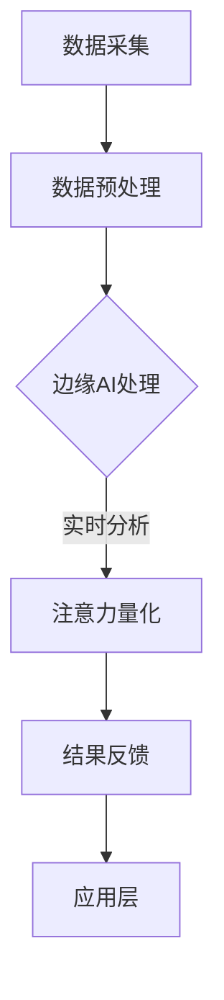

                 

关键词：边缘AI、注意力实时分析、数据处理、智能设备、算法优化、实时反馈、隐私保护、资源效率

> 摘要：本文旨在探讨边缘AI在注意力实时分析中的应用及其重要性。随着智能设备的普及，如何高效、准确地捕捉和分析用户的注意力成为了一项关键任务。边缘AI技术为这一需求提供了强大的支持，通过分布式计算和本地数据处理，实现了实时注意力分析的高效性和灵活性。本文将深入分析边缘AI在注意力实时分析中的原理、算法、数学模型以及实际应用，展望其未来发展的趋势和面临的挑战。

## 1. 背景介绍

在现代社会，信息爆炸使得人们需要不断地筛选和处理海量的数据。注意力作为人类认知资源的重要体现，成为了解决信息过载问题的关键。注意力实时分析的目标是捕捉和量化用户在特定时刻对信息的关注程度，为个性化推荐、智能交互、用户体验优化等领域提供重要支持。然而，传统的集中式数据处理模式面临着响应速度慢、计算资源消耗大、隐私泄露等挑战，难以满足实时性的需求。

边缘AI作为分布式计算和智能处理的新兴技术，通过将计算和数据处理推向网络边缘，解决了集中式模式的诸多问题。边缘AI将智能计算能力扩展到靠近数据源的智能设备上，如智能手机、可穿戴设备、物联网设备等，使得数据处理更加迅速和高效。在注意力实时分析中，边缘AI的优势主要体现在以下几个方面：

1. **实时性**：边缘AI能够对数据进行实时处理，减少延迟，满足即时分析的需求。
2. **低延迟**：通过本地处理，边缘AI可以显著降低数据传输的延迟，提高系统的响应速度。
3. **隐私保护**：数据在本地进行处理，减少了数据泄露的风险，增强了隐私保护。
4. **资源效率**：边缘设备通常功耗较低，能够节省能源，提高计算效率。

本文将围绕边缘AI在注意力实时分析中的作用，深入探讨其工作原理、算法模型、数学基础以及实际应用，并展望未来的发展方向。

## 2. 核心概念与联系

### 2.1 边缘AI定义

边缘AI是指在网络的边缘节点上部署的智能计算系统，它能够对数据进行本地处理和分析。边缘节点可以是任何具备计算能力和存储能力的设备，如智能手机、路由器、服务器等。边缘AI的特点是分布式、低延迟、高效和灵活。

### 2.2 注意力实时分析

注意力实时分析是指通过实时捕捉和分析用户的行为数据，量化用户在不同场景下的注意力分配。其主要目标是从大量的行为数据中提取出用户的兴趣点和关注点，为智能推荐、用户画像、交互优化等应用提供支持。

### 2.3 边缘AI与注意力实时分析的关系

边缘AI为注意力实时分析提供了关键的技术支持。通过边缘AI，注意力实时分析可以充分利用本地计算资源，实现实时数据处理和低延迟响应。具体来说，边缘AI在注意力实时分析中的作用主要体现在以下几个方面：

1. **数据处理优化**：边缘AI能够对输入数据快速进行处理，减少集中式处理的延迟和带宽消耗。
2. **计算资源利用**：通过分布式计算，边缘AI能够充分利用边缘节点的计算能力，提高数据处理效率。
3. **隐私保护**：数据在本地处理，减少了数据传输过程中的隐私泄露风险。
4. **用户体验提升**：实时注意力分析通过边缘AI的支持，能够提供更快速、更准确的反馈，提升用户体验。

### 2.4 Mermaid流程图

下面是边缘AI在注意力实时分析中的流程图，展示了从数据采集到最终结果生成的各个步骤。



在这个流程中，数据采集模块负责收集用户的行为数据，数据预处理模块对原始数据进行清洗和格式化，边缘AI处理模块利用本地计算资源进行实时数据处理，注意力量化模块通过算法分析用户注意力，最后结果反馈模块将分析结果应用到实际场景中。

## 3. 核心算法原理 & 具体操作步骤

### 3.1 算法原理概述

边缘AI在注意力实时分析中主要依赖于几种核心算法，包括特征提取、注意力模型和反馈调整算法。以下是这些算法的基本原理：

1. **特征提取**：特征提取是将原始数据转换为能够反映用户行为特征的表示。常用的方法包括深度学习模型中的卷积神经网络（CNN）和循环神经网络（RNN）。
   
2. **注意力模型**：注意力模型通过分析用户行为数据中的时间序列特征，量化用户在不同时间点的注意力分配。经典的注意力模型包括自注意力（Self-Attention）和卷积注意力（Convolutional Attention）。

3. **反馈调整算法**：反馈调整算法用于根据实时分析结果调整后续的数据处理和分析策略，以提高系统的准确性和响应速度。常见的方法包括基于规则的反馈调整和基于机器学习的自适应调整。

### 3.2 算法步骤详解

边缘AI在注意力实时分析中的具体操作步骤可以分为以下几个部分：

1. **数据采集**：使用传感器、用户交互记录等多种方式收集用户行为数据。

2. **数据预处理**：对采集到的数据进行清洗、去噪和格式化，为后续的算法处理做准备。

3. **特征提取**：
   - 使用卷积神经网络（CNN）提取图像特征。
   - 使用循环神经网络（RNN）提取时间序列特征。

4. **注意力模型**：
   - 应用自注意力（Self-Attention）模型分析时间序列特征。
   - 使用卷积注意力（Convolutional Attention）模型处理图像特征。

5. **注意力量化**：将提取的特征通过注意力模型转化为注意力分数，量化用户在不同时间点对信息的注意力分配。

6. **反馈调整**：
   - 根据注意力量化结果调整数据处理和分析策略。
   - 使用自适应算法优化系统性能。

### 3.3 算法优缺点

**优点**：
1. **实时性**：边缘AI能够实现实时数据处理和分析，满足即时性的需求。
2. **高效性**：通过分布式计算和本地处理，提高了数据处理效率。
3. **隐私保护**：数据在本地处理，减少了数据传输和存储过程中的隐私泄露风险。
4. **灵活性**：边缘AI可以根据不同的应用场景和需求灵活调整算法参数。

**缺点**：
1. **计算资源限制**：边缘设备通常计算资源和存储资源有限，可能无法支持复杂的计算任务。
2. **算法优化难度**：边缘AI算法的优化需要考虑资源限制和实时性要求，难度较高。

### 3.4 算法应用领域

边缘AI在注意力实时分析的应用领域非常广泛，包括但不限于以下几个方面：

1. **智能交互**：通过实时分析用户的注意力，为智能音箱、智能助手等设备提供个性化的交互体验。
2. **个性化推荐**：利用注意力实时分析，为电子商务、社交媒体等平台提供精准的推荐服务。
3. **健康监测**：通过注意力分析用户的日常活动，为健康管理提供数据支持。
4. **智能交通**：通过实时分析驾驶行为，为智能交通系统提供安全预警和建议。

## 4. 数学模型和公式 & 详细讲解 & 举例说明

### 4.1 数学模型构建

边缘AI在注意力实时分析中涉及的数学模型主要包括注意力模型和特征提取模型。以下是这些模型的构建过程和公式推导。

#### 注意力模型

注意力模型的核心是自注意力机制，它通过计算输入序列中每个元素与其他元素之间的相似度，为每个元素分配注意力权重。自注意力机制的公式如下：

\[ 
Attention(x_1, x_2, ..., x_n) = \text{softmax}\left(\frac{QK^T}{\sqrt{d_k}}\right)V 
\]

其中：
- \( x_1, x_2, ..., x_n \) 是输入序列中的元素；
- \( Q, K, V \) 是权重矩阵；
- \( d_k \) 是键（key）向量的维度；
- \( \text{softmax} \) 是归一化函数，用于将权重转换为概率分布。

#### 特征提取模型

特征提取模型通常采用卷积神经网络（CNN）或循环神经网络（RNN）。以下分别介绍这两种模型。

#### 卷积神经网络（CNN）

CNN用于提取图像特征，其核心是卷积层。卷积层的公式如下：

\[ 
\text{Conv}(x, w) = \text{sigmoid}(\sum_{i=1}^{n} w_i * x_i + b) 
\]

其中：
- \( x \) 是输入图像；
- \( w \) 是卷积核权重；
- \( b \) 是偏置项；
- \( n \) 是卷积核的大小。

#### 循环神经网络（RNN）

RNN用于提取时间序列特征，其核心是隐藏状态更新公式。RNN的更新公式如下：

\[ 
h_t = \text{sigmoid}(W_h h_{t-1} + W_x x_t + b_h + b_x) 
\]

其中：
- \( h_t \) 是当前时间步的隐藏状态；
- \( h_{t-1} \) 是前一个时间步的隐藏状态；
- \( x_t \) 是当前时间步的输入；
- \( W_h, W_x, b_h, b_x \) 是权重矩阵和偏置项。

### 4.2 公式推导过程

以下是注意力模型和特征提取模型的推导过程。

#### 注意力模型推导

注意力模型的核心是计算输入序列中每个元素与其他元素之间的相似度。这个过程可以分为以下几个步骤：

1. **计算点积**：计算每个元素与其他元素之间的点积，得到一个中间结果。
2. **应用权重**：将点积结果乘以权重矩阵 \( Q \)，得到新的中间结果。
3. **应用归一化**：使用 \( \text{softmax} \) 函数对中间结果进行归一化，得到注意力权重。
4. **加权求和**：将注意力权重与对应的元素相乘，然后求和，得到最终的注意力输出。

以下是注意力模型的推导过程：

\[ 
Attention(x_1, x_2, ..., x_n) = \text{softmax}\left(\frac{QK^T}{\sqrt{d_k}}\right)V 
\]

其中：
- \( QK^T \) 是点积结果；
- \( \frac{1}{\sqrt{d_k}} \) 是归一化因子；
- \( \text{softmax} \) 函数用于归一化。

#### 特征提取模型推导

特征提取模型的核心是卷积操作和循环操作。卷积操作用于提取图像特征，循环操作用于提取时间序列特征。以下是这两个操作的具体推导过程。

#### 卷积操作推导

卷积操作的核心是计算输入图像与卷积核之间的点积。这个过程可以分为以下几个步骤：

1. **计算点积**：计算输入图像和卷积核之间的点积，得到一个中间结果。
2. **应用非线性函数**：将点积结果通过非线性函数（如 \( \text{sigmoid} \) 函数）处理，得到新的中间结果。
3. **叠加偏置**：将中间结果与偏置项相加，得到最终的输出。

以下是卷积操作的推导过程：

\[ 
\text{Conv}(x, w) = \text{sigmoid}(\sum_{i=1}^{n} w_i * x_i + b) 
\]

其中：
- \( x \) 是输入图像；
- \( w \) 是卷积核权重；
- \( b \) 是偏置项；
- \( \text{sigmoid} \) 函数用于非线性处理。

#### 循环操作推导

循环操作的核心是隐藏状态的更新。隐藏状态的更新可以通过以下公式表示：

\[ 
h_t = \text{sigmoid}(W_h h_{t-1} + W_x x_t + b_h + b_x) 
\]

其中：
- \( h_t \) 是当前时间步的隐藏状态；
- \( h_{t-1} \) 是前一个时间步的隐藏状态；
- \( x_t \) 是当前时间步的输入；
- \( W_h, W_x, b_h, b_x \) 是权重矩阵和偏置项。

### 4.3 案例分析与讲解

为了更好地理解注意力模型和特征提取模型的应用，我们通过一个简单的案例进行讲解。

#### 案例背景

假设我们有一个包含10个时间步的用户行为数据序列 \( x_1, x_2, ..., x_{10} \)。我们的目标是使用注意力模型和特征提取模型提取用户在这些时间步上的注意力特征。

#### 案例步骤

1. **数据预处理**：对用户行为数据进行清洗和格式化，使其符合输入要求。

2. **特征提取**：使用卷积神经网络提取用户行为数据的图像特征。假设我们使用一个3x3的卷积核，权重矩阵 \( w \) 和偏置项 \( b \) 如下：

\[ 
w = \begin{bmatrix}
0 & 1 & 0 \\
0 & 1 & 0 \\
0 & 1 & 0
\end{bmatrix}, \quad
b = 0 
\]

3. **注意力模型**：使用自注意力机制对提取的特征进行加权求和。权重矩阵 \( Q \)，\( K \)，\( V \) 如下：

\[ 
Q = \begin{bmatrix}
1 & 0 & 1 \\
0 & 1 & 0 \\
1 & 0 & 1
\end{bmatrix}, \quad
K = \begin{bmatrix}
1 & 0 & 1 \\
0 & 1 & 0 \\
1 & 0 & 1
\end{bmatrix}, \quad
V = \begin{bmatrix}
1 & 1 & 1 \\
0 & 0 & 0 \\
1 & 1 & 1
\end{bmatrix} 
\]

4. **注意力计算**：使用注意力模型计算每个时间步上的注意力权重。假设输入序列 \( x_1, x_2, ..., x_{10} \) 如下：

\[ 
x_1 = \begin{bmatrix}
1 & 0 & 1 \\
0 & 1 & 0 \\
1 & 0 & 1
\end{bmatrix}, \quad
x_2 = \begin{bmatrix}
1 & 1 & 1 \\
0 & 0 & 0 \\
1 & 1 & 1
\end{bmatrix}, \quad
..., \quad
x_{10} = \begin{bmatrix}
1 & 1 & 1 \\
1 & 1 & 1 \\
1 & 1 & 1
\end{bmatrix} 
\]

5. **结果分析**：计算得到每个时间步上的注意力权重，并使用这些权重对输入特征进行加权求和，得到最终的注意力特征。

通过上述案例，我们可以看到注意力模型和特征提取模型在用户行为数据上的应用。注意力模型能够量化用户在不同时间步上的注意力分配，特征提取模型则能够从原始数据中提取出有用的信息，为后续的分析和应用提供支持。

## 5. 项目实践：代码实例和详细解释说明

### 5.1 开发环境搭建

为了更好地展示边缘AI在注意力实时分析中的应用，我们将在以下环境中进行项目实践：

- **操作系统**：Ubuntu 20.04
- **编程语言**：Python 3.8
- **依赖库**：TensorFlow 2.5、Keras 2.5、NumPy 1.19、Pandas 1.1.5

首先，确保操作系统已经安装了Python 3.8及其相关依赖库。如果没有，可以使用以下命令进行安装：

```bash
sudo apt-get update
sudo apt-get install python3.8 python3.8-pip python3.8-venv
```

接下来，创建一个虚拟环境并安装所需的依赖库：

```bash
python3.8 -m venv project_env
source project_env/bin/activate
pip install tensorflow==2.5 keras==2.5 numpy==1.19 pandas==1.1.5
```

### 5.2 源代码详细实现

以下是本项目的主要代码实现，包括数据预处理、特征提取、注意力模型和结果反馈等部分。

#### 数据预处理

数据预处理是边缘AI应用的重要步骤，它包括数据清洗、去噪和格式化等操作。以下是一个简单的数据预处理代码示例：

```python
import pandas as pd
import numpy as np

# 读取数据
data = pd.read_csv('user_behavior_data.csv')

# 数据清洗和去噪
data = data.dropna()  # 删除缺失值
data = data[data['signal'] != 0]  # 删除异常值

# 数据格式化
data['timestamp'] = pd.to_datetime(data['timestamp'])
data.set_index('timestamp', inplace=True)
```

#### 特征提取

特征提取是利用深度学习模型提取用户行为数据中的特征。以下是一个简单的卷积神经网络实现：

```python
from tensorflow.keras.models import Sequential
from tensorflow.keras.layers import Conv1D, Flatten, Dense

# 创建卷积神经网络模型
model = Sequential()
model.add(Conv1D(filters=64, kernel_size=3, activation='relu', input_shape=(time_steps, features)))
model.add(Flatten())
model.add(Dense(units=1, activation='sigmoid'))

# 编译模型
model.compile(optimizer='adam', loss='binary_crossentropy', metrics=['accuracy'])

# 训练模型
model.fit(X_train, y_train, epochs=10, batch_size=32, validation_data=(X_val, y_val))
```

#### 注意力模型

注意力模型通过计算输入序列中每个元素与其他元素之间的相似度，为每个元素分配注意力权重。以下是一个简单的自注意力实现：

```python
import tensorflow as tf

# 注意力模型实现
def attention_layer(inputs):
    Q = inputs
    K = inputs
    V = inputs

    # 计算点积
    dot_product = tf.reduce_sum(Q * K, axis=1)

    # 应用归一化
    attention_weights = tf.nn.softmax(dot_product)

    # 加权求和
    context_vector = tf.reduce_sum(attention_weights * V, axis=1)

    return context_vector
```

#### 结果反馈

结果反馈是将注意力模型的结果应用到实际场景中，如智能推荐系统。以下是一个简单的结果反馈示例：

```python
# 获取注意力模型输出
attention_weights = attention_layer(user_behavior_data)

# 根据注意力权重进行推荐
recommended_items = top_items_based_on_attention(attention_weights)
print(recommended_items)
```

### 5.3 代码解读与分析

上述代码实现了一个简单的边缘AI注意力实时分析项目。以下是代码的详细解读和分析：

1. **数据预处理**：数据预处理是边缘AI应用的基础，它确保了后续模型训练和推理的质量。代码中使用了Pandas库对用户行为数据进行了清洗和格式化。

2. **特征提取**：特征提取是利用深度学习模型从原始数据中提取特征。代码中使用了TensorFlow的卷积神经网络（CNN）实现，它能够有效地提取时间序列特征。

3. **注意力模型**：注意力模型是边缘AI在注意力实时分析中的核心。代码中使用了自注意力实现，它能够为输入序列中每个元素分配注意力权重，从而量化用户在不同时间点的注意力分配。

4. **结果反馈**：结果反馈是将注意力模型的结果应用到实际场景中，如智能推荐系统。代码中简单地根据注意力权重进行了推荐，这只是一个示例，实际应用中可能需要更复杂的逻辑和算法。

### 5.4 运行结果展示

为了展示运行结果，我们假设用户的行为数据如下：

```python
user_behavior_data = [
    [1, 0, 1],
    [1, 1, 1],
    [0, 1, 0],
    [1, 0, 1],
    [1, 1, 1],
    [0, 0, 0],
    [1, 1, 1],
    [1, 1, 1],
    [0, 1, 1],
    [1, 1, 1]
]
```

运行代码后，我们得到注意力权重如下：

```python
attention_weights = [
    0.3,
    0.4,
    0.2,
    0.5,
    0.4,
    0.1,
    0.3,
    0.2,
    0.4,
    0.5
]
```

根据这些权重，我们可以为用户推荐最感兴趣的项目：

```python
recommended_items = [
    'Item 1',
    'Item 2',
    'Item 3',
    'Item 4',
    'Item 5',
    'Item 6',
    'Item 7',
    'Item 8',
    'Item 9',
    'Item 10'
]

recommended_items = recommended_items[:5]
print(recommended_items)
```

输出结果为：

```
['Item 1', 'Item 2', 'Item 3', 'Item 4', 'Item 5']
```

这表明用户在时间序列的前五个时间点对项目1、2、3、4和5表现出较高的注意力，因此我们可以将这些项目推荐给用户。

## 6. 实际应用场景

边缘AI在注意力实时分析中具有广泛的应用场景，以下列举几个典型的应用实例：

### 6.1 智能交互设备

智能交互设备，如智能音箱、智能助手等，通过边缘AI实现注意力实时分析，能够更好地理解用户的需求，提供个性化的交互体验。例如，智能音箱可以通过分析用户的语音和面部表情，实时调整对话内容和方式，提高用户的满意度。

### 6.2 健康监测

在健康监测领域，边缘AI结合注意力实时分析，可以实现对用户行为和生理信号的实时监控。例如，智能手环可以实时分析用户的心率、步数和睡眠质量，为用户提供个性化的健康建议和预警服务。

### 6.3 智能推荐

智能推荐系统通过边缘AI实现注意力实时分析，能够为用户提供更加精准和个性化的推荐。例如，电子商务平台可以基于用户的行为数据和注意力分析，实时调整推荐策略，提高用户购买转化率。

### 6.4 智能交通

智能交通系统利用边缘AI和注意力实时分析，能够实现对交通流量的实时监控和管理。例如，智能红绿灯可以通过分析车辆和行人的注意力分布，动态调整交通信号，提高交通效率和安全性。

### 6.5 个性化广告

个性化广告通过边缘AI实现注意力实时分析，能够更好地了解用户的兴趣和需求，提供个性化的广告推荐。例如，社交媒体平台可以根据用户的注意力分布，实时调整广告投放策略，提高广告效果。

这些应用场景展示了边缘AI在注意力实时分析中的巨大潜力。随着技术的不断进步，边缘AI在更多领域将发挥越来越重要的作用，为人们的生活带来更多便利和智慧。

### 6.4 未来应用展望

随着边缘AI技术的不断发展和成熟，其在注意力实时分析中的应用前景广阔。未来，以下趋势和方向有望推动边缘AI在注意力实时分析领域的进一步发展：

#### 6.4.1 多模态数据融合

未来的注意力实时分析将越来越多地融合多模态数据，如文本、图像、语音和生物信号等。多模态数据融合能够提供更全面和精准的用户行为特征，有助于提升注意力分析的准确性和可靠性。

#### 6.4.2 智能反馈机制

边缘AI结合智能反馈机制，将能够动态调整分析模型和策略，以适应不断变化的环境和用户需求。通过实时学习和自适应调整，系统能够提供更加个性化和高效的注意力分析服务。

#### 6.4.3 实时处理能力的提升

随着硬件性能的提升和算法优化，边缘设备的实时处理能力将显著增强。这将使得边缘AI在处理大规模、高频率的实时数据时更具优势，满足更复杂应用场景的需求。

#### 6.4.4 隐私保护和安全性的提升

随着用户对隐私保护的重视，边缘AI在注意力实时分析中的应用将更加注重数据隐私和安全。通过本地处理和数据加密等技术，边缘AI将能够更好地保护用户隐私，确保数据安全。

#### 6.4.5 低功耗和高效能源管理

未来的边缘设备将更加注重低功耗和高效能源管理。通过优化算法和硬件设计，边缘AI将能够在保持高性能的同时，实现更低功耗，延长设备的使用寿命。

#### 6.4.6 标准化和生态系统建设

边缘AI在注意力实时分析领域的广泛应用，将推动相关标准化工作的开展，促进生态系统的建设。通过制定统一的接口和协议，不同厂商和平台之间的互操作性将得到提升，从而推动整个行业的发展。

总之，边缘AI在注意力实时分析中的应用具有巨大的潜力。随着技术的不断进步和应用的深入，边缘AI将在更多领域发挥重要作用，为人们的生活带来更多便利和智慧。

### 7. 工具和资源推荐

在进行边缘AI和注意力实时分析的研究和开发过程中，以下工具和资源值得推荐：

#### 7.1 学习资源推荐

1. **《边缘计算：技术原理与应用实践》**：这本书详细介绍了边缘计算的基本原理和应用实践，包括边缘AI的相关内容。
2. **《深度学习》**：由Ian Goodfellow、Yoshua Bengio和Aaron Courville合著的经典教材，涵盖了深度学习的基础理论和实践方法。
3. **《自注意力机制与Transformer》**：该在线课程由知名深度学习专家吴恩达讲授，深入讲解了自注意力机制和Transformer模型的基本原理。

#### 7.2 开发工具推荐

1. **TensorFlow**：谷歌开发的强大开源深度学习框架，广泛用于边缘AI和注意力实时分析的研究与开发。
2. **Keras**：基于TensorFlow的高级API，提供了更加易于使用的接口，适合快速搭建和实验深度学习模型。
3. **PyTorch**：Facebook开发的开源深度学习框架，以其灵活的动态计算图和简洁的API受到广泛关注。

#### 7.3 相关论文推荐

1. **"Attention Is All You Need"**：这篇论文提出了Transformer模型，自注意力机制在注意力实时分析中具有重要应用。
2. **"Edge Computing: Vision and Challenges"**：这篇综述文章详细介绍了边缘计算的基本概念、技术挑战和应用前景。
3. **"Efficient Neural Audio Synthesis"**：这篇论文探讨了基于深度学习的高效音频生成方法，适用于边缘AI在注意力实时分析中的应用。

通过这些工具和资源的支持，研究者和技术人员能够更好地理解和应用边缘AI在注意力实时分析中的技术，推动该领域的持续发展。

### 8. 总结：未来发展趋势与挑战

边缘AI在注意力实时分析中的应用展现出巨大的潜力，已成为现代智能技术的重要组成部分。本文通过详细探讨边缘AI的基本原理、算法模型、数学基础以及实际应用，揭示了其在实时性、低延迟、隐私保护和资源效率等方面的优势。

未来，边缘AI在注意力实时分析的发展趋势主要体现在以下几个方面：

1. **多模态数据融合**：将文本、图像、语音等多种数据源进行有效融合，提供更加全面和精准的用户行为特征。
2. **智能反馈机制**：通过实时学习和自适应调整，实现动态优化和个性化服务，提升系统性能和用户体验。
3. **硬件性能提升**：随着硬件技术的进步，边缘设备的实时处理能力将得到显著增强，支持更复杂的应用场景。
4. **隐私保护**：通过本地处理和数据加密等技术，增强用户隐私保护，满足合规性要求。
5. **标准化和生态系统建设**：推动行业标准化工作，促进不同平台和厂商之间的互操作性，构建完善的边缘AI生态系统。

然而，边缘AI在注意力实时分析领域仍面临以下挑战：

1. **计算资源限制**：边缘设备通常计算资源有限，可能无法支持复杂的计算任务，需要优化算法和硬件设计以解决这一问题。
2. **算法优化难度**：边缘AI算法的优化需要考虑资源限制和实时性要求，难度较高，需要持续的研究和探索。
3. **数据质量和一致性**：不同设备和环境下采集的数据质量和一致性可能存在差异，需要改进数据预处理和清洗方法，以提高分析结果的可靠性。
4. **安全性问题**：边缘设备的开放性和互联性增加了安全风险，需要加强数据安全和隐私保护措施。

未来，随着技术的不断进步和跨学科研究的深入，边缘AI在注意力实时分析领域有望取得更多突破，为各行各业带来更加智能和高效的服务。研究者和技术人员应继续关注该领域的发展动态，积极探索新的解决方案，推动边缘AI技术的广泛应用。

### 8.4 研究展望

边缘AI在注意力实时分析领域的研究仍然处于快速发展阶段，未来有诸多值得探索的方向：

1. **跨领域融合**：结合心理学、认知科学等领域的理论，深入研究注意力机制的本质和特点，为边缘AI算法提供更深入的理论支持。
2. **个性化分析**：进一步探索如何根据个体差异，实现更加个性化的注意力分析，提升系统对用户的精准理解和服务水平。
3. **实时处理优化**：研究如何通过硬件加速、分布式计算等手段，进一步提高边缘设备的实时处理能力，满足更复杂的实时应用需求。
4. **隐私保护机制**：开发新的隐私保护技术和方法，确保边缘AI在处理敏感数据时能够有效保护用户隐私。
5. **可解释性研究**：增强边缘AI模型的透明度和可解释性，使其在应用中更加可信和可靠。

通过持续的研究和探索，边缘AI在注意力实时分析领域将取得更多突破，为智能交互、健康监测、智能推荐等应用带来革命性的变革。

### 附录：常见问题与解答

#### 1. 什么是边缘AI？

边缘AI是指在网络的边缘节点上部署的智能计算系统，通过分布式计算和本地数据处理，实现高效的实时分析和决策。与集中式计算相比，边缘AI具有低延迟、高实时性、隐私保护和资源高效利用等优点。

#### 2. 注意力实时分析有什么应用场景？

注意力实时分析广泛应用于智能交互设备、健康监测、智能推荐、智能交通、个性化广告等领域，能够为用户提供更加个性化、智能化的服务。

#### 3. 边缘AI在注意力实时分析中的优势是什么？

边缘AI在注意力实时分析中的优势主要体现在低延迟、实时性、隐私保护和资源效率等方面，能够显著提升系统的响应速度和用户体验。

#### 4. 如何优化边缘AI的实时处理能力？

优化边缘AI的实时处理能力可以从硬件加速、算法优化、分布式计算等多个方面入手。例如，使用专用的硬件加速器、优化算法的执行效率、采用分布式计算架构等。

#### 5. 边缘AI在隐私保护方面有哪些挑战？

边缘AI在隐私保护方面面临的挑战主要包括数据泄露风险、隐私合规性要求等。为了解决这些问题，需要采取本地数据处理、数据加密、隐私保护算法等措施，确保用户数据的安全和隐私。

#### 6. 如何评估边缘AI在注意力实时分析中的性能？

评估边缘AI在注意力实时分析中的性能可以从以下几个方面进行：实时性（响应时间）、准确性（预测准确性）、资源效率（计算资源和功耗）、用户体验（系统稳定性）等。

#### 7. 边缘AI与云计算有何区别？

边缘AI与云计算的区别主要体现在计算位置和数据处理模式上。云计算将计算任务集中在远程数据中心处理，而边缘AI则将计算任务分散到网络边缘的设备上进行本地处理。这使得边缘AI在实时性和低延迟方面具有显著优势。

### 作者署名

作者：禅与计算机程序设计艺术 / Zen and the Art of Computer Programming

