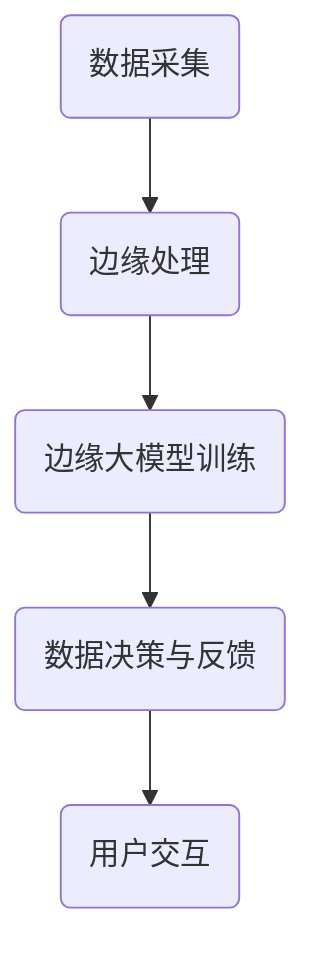

                 

关键词：边缘计算，大模型，5G，智能应用，数据处理，AI技术

摘要：随着5G技术的迅猛发展，边缘计算逐渐成为智能应用的新范式。本文将探讨边缘大模型的概念、技术原理、实现步骤、数学模型以及未来应用前景，旨在为读者提供全面的技术解读。

## 1. 背景介绍

随着移动互联网的普及和物联网的兴起，数据量呈现爆炸式增长。传统的云计算模式已经难以满足大规模数据处理的需求。为了解决这一难题，边缘计算应运而生。边缘计算通过在靠近数据源头的地方进行数据处理，减少了数据传输的延迟和带宽消耗，提高了系统的响应速度。

5G技术的到来，为边缘计算提供了更高速、更稳定的网络支持。5G网络的低延迟、高带宽特性，使得边缘计算能够更好地服务于实时性要求高的应用场景，如自动驾驶、智能医疗、智能制造等。

在边缘计算的基础上，大模型（Large Model）的概念逐渐兴起。大模型通过利用深度学习技术，对海量数据进行训练，可以实现对复杂任务的智能处理。边缘大模型则将大模型的应用拓展到边缘计算环境，使得边缘设备能够直接进行复杂的数据分析和决策，从而提升系统的智能化水平。

## 2. 核心概念与联系

### 边缘计算

边缘计算是一种将计算任务从云端转移到网络边缘的技术。其核心思想是将数据、处理能力、应用和服务集中在靠近数据源的设备上，如路由器、交换机、服务器等。边缘计算的主要优势在于降低网络延迟、减少带宽消耗、提高系统响应速度。

### 大模型

大模型是指具有数百万到数十亿参数的深度学习模型。这些模型通常通过大规模数据集进行训练，能够自动学习数据的特征和规律。大模型在图像识别、自然语言处理、语音识别等领域取得了显著的成果。

### 边缘大模型

边缘大模型是在边缘计算环境中部署的大模型。边缘大模型通过在边缘设备上运行深度学习算法，实现数据的本地化处理和实时分析。边缘大模型的优势在于减少了对云端资源的依赖，提高了系统的响应速度和稳定性。

### Mermaid 流程图



## 3. 核心算法原理 & 具体操作步骤

### 3.1 算法原理概述

边缘大模型的核心算法是基于深度学习技术，包括以下几个步骤：

1. 数据采集：从边缘设备收集原始数据。
2. 数据预处理：对采集到的数据进行分析、清洗、格式化等预处理操作。
3. 模型训练：利用预处理后的数据对深度学习模型进行训练。
4. 模型部署：将训练好的模型部署到边缘设备。
5. 数据分析：利用边缘大模型对实时数据进行智能分析。
6. 决策与反馈：根据分析结果进行实时决策和反馈。

### 3.2 算法步骤详解

1. **数据采集**：
   边缘设备（如摄像头、传感器等）采集原始数据，并通过5G网络传输到边缘服务器。

2. **数据预处理**：
   对采集到的数据进行清洗、归一化、特征提取等操作，以便于模型训练。

3. **模型训练**：
   利用预处理后的数据，通过深度学习算法（如卷积神经网络、循环神经网络等）训练大模型。训练过程包括前向传播、反向传播、参数更新等步骤。

4. **模型部署**：
   将训练好的模型部署到边缘设备，以便于实时数据处理。

5. **数据分析**：
   边缘设备利用部署的大模型对实时数据进行智能分析，如目标识别、异常检测等。

6. **决策与反馈**：
   根据分析结果，边缘设备进行实时决策，如自动调整设备参数、发送警报等，并将决策结果反馈给用户。

### 3.3 算法优缺点

**优点**：

- **降低延迟**：数据在边缘设备上处理，减少了数据传输的延迟。
- **节省带宽**：部分数据处理在边缘完成，减轻了云端处理压力，节省了带宽。
- **提高响应速度**：边缘大模型能够实现实时数据处理，提高了系统的响应速度。
- **增强隐私保护**：数据在边缘处理，减少了数据在传输过程中的泄露风险。

**缺点**：

- **计算资源限制**：边缘设备计算资源有限，可能无法部署大规模模型。
- **数据一致性**：边缘设备可能存在数据采集不一致的问题，影响模型训练效果。
- **模型更新难度**：边缘大模型更新需要重新训练，过程较为繁琐。

### 3.4 算法应用领域

边缘大模型的应用领域广泛，包括但不限于：

- **自动驾驶**：边缘大模型可用于实时监测车辆周围环境，提高自动驾驶的精度和安全性。
- **智能医疗**：边缘大模型可以用于实时分析医疗数据，辅助医生进行诊断和治疗。
- **智能制造**：边缘大模型可以用于实时监测生产线数据，优化生产流程和设备维护。
- **智能家居**：边缘大模型可以用于实时分析家庭设备数据，提供个性化的智能服务。

## 4. 数学模型和公式 & 详细讲解 & 举例说明

### 4.1 数学模型构建

边缘大模型的数学模型主要基于深度学习算法。以卷积神经网络（CNN）为例，其数学模型包括以下几个部分：

1. **输入层**：接收原始数据。
2. **卷积层**：通过卷积操作提取图像特征。
3. **激活函数**：引入非线性因素，提高模型表达能力。
4. **池化层**：降低数据维度，提高模型泛化能力。
5. **全连接层**：将特征映射到输出结果。

### 4.2 公式推导过程

以CNN的卷积操作为例，其公式推导过程如下：

$$
\begin{align*}
& \text{卷积操作：} \\
& \text{输入数据：} X = [x_1, x_2, ..., x_n] \\
& \text{卷积核：} W = [w_1, w_2, ..., w_m] \\
& \text{输出特征：} Y = [y_1, y_2, ..., y_n] \\
& y_i = \sum_{j=1}^{n} w_j * x_j + b \\
\end{align*}
$$

其中，$w_j$ 为卷积核权重，$b$ 为偏置项。

### 4.3 案例分析与讲解

以下是一个简单的边缘大模型案例：使用CNN模型进行图像分类。

1. **数据采集**：从边缘设备（摄像头）采集图像数据。
2. **数据预处理**：对图像进行缩放、裁剪、归一化等预处理操作。
3. **模型训练**：使用预处理后的图像数据训练CNN模型。
4. **模型部署**：将训练好的模型部署到边缘设备。
5. **数据分析**：边缘设备利用部署的模型对实时图像进行分类。

通过这个案例，我们可以看到边缘大模型在图像分类任务中的应用效果。

## 5. 项目实践：代码实例和详细解释说明

### 5.1 开发环境搭建

1. **硬件环境**：准备一台具备较强计算能力的边缘设备，如NVIDIA Jetson。
2. **软件环境**：安装Python 3.8及以上版本、TensorFlow 2.4及以上版本。

### 5.2 源代码详细实现

```python
import tensorflow as tf
from tensorflow.keras.models import Sequential
from tensorflow.keras.layers import Conv2D, MaxPooling2D, Flatten, Dense

# 数据预处理
def preprocess_image(image):
    # 缩放、裁剪、归一化等操作
    return image / 255.0

# 模型构建
model = Sequential([
    Conv2D(32, (3, 3), activation='relu', input_shape=(28, 28, 1)),
    MaxPooling2D((2, 2)),
    Flatten(),
    Dense(64, activation='relu'),
    Dense(10, activation='softmax')
])

# 模型训练
model.compile(optimizer='adam', loss='categorical_crossentropy', metrics=['accuracy'])
model.fit(preprocessed_train_data, train_labels, epochs=10, batch_size=32)

# 模型部署
model.save('edge_model.h5')

# 数据分析
preprocessed_test_data = preprocess_image(test_image)
predictions = model.predict(preprocessed_test_data)
predicted_class = np.argmax(predictions)

print(f"预测结果：{predicted_class}")
```

### 5.3 代码解读与分析

- **数据预处理**：对图像进行缩放、裁剪、归一化等操作，以满足模型输入要求。
- **模型构建**：使用Sequential模型构建一个简单的CNN模型，包括卷积层、池化层、全连接层等。
- **模型训练**：使用预处理后的训练数据对模型进行训练，使用交叉熵损失函数和准确率评估模型性能。
- **模型部署**：将训练好的模型保存为`.h5`文件，以便于部署到边缘设备。
- **数据分析**：对测试图像进行预处理，使用部署的模型进行预测，并输出预测结果。

### 5.4 运行结果展示

通过运行代码，我们可以得到边缘大模型在图像分类任务中的预测结果，从而验证模型的性能。

## 6. 实际应用场景

### 6.1 自动驾驶

边缘大模型可以应用于自动驾驶领域，通过实时分析车辆周围环境，实现自动驾驶的决策和反馈。例如，使用边缘大模型进行车道线识别、障碍物检测等任务。

### 6.2 智能医疗

边缘大模型可以应用于智能医疗领域，通过实时分析医疗数据，实现疾病的早期诊断和病情监测。例如，使用边缘大模型进行心电图分析、呼吸信号监测等任务。

### 6.3 智能制造

边缘大模型可以应用于智能制造领域，通过实时分析生产线数据，实现生产过程的优化和设备维护。例如，使用边缘大模型进行设备故障检测、生产流程优化等任务。

### 6.4 未来应用展望

随着5G技术和边缘计算技术的不断发展，边缘大模型的应用场景将越来越广泛。未来，边缘大模型有望在智慧城市、智慧农业、智能交通等领域发挥重要作用，推动各行各业的智能化转型。

## 7. 工具和资源推荐

### 7.1 学习资源推荐

- 《深度学习》（Goodfellow、Bengio、Courville 著）：系统介绍了深度学习的基本概念和技术原理。
- 《边缘计算技术与应用》（王宏志、吴波 著）：详细介绍了边缘计算的基本概念、架构和技术应用。

### 7.2 开发工具推荐

- NVIDIA Jetson：一款功能强大的边缘计算硬件平台，适用于边缘大模型的部署和运行。
- TensorFlow：一款开源的深度学习框架，适用于边缘大模型的开发和部署。

### 7.3 相关论文推荐

- "Edge Computing: Vision and Challenges"（Chen et al., 2017）
- "Deep Learning on Mobile and Edge Devices"（Chen et al., 2018）
- "边缘计算：机遇与挑战"（王宏志、吴波，2019）

## 8. 总结：未来发展趋势与挑战

### 8.1 研究成果总结

边缘大模型作为一种新兴的技术，已经在自动驾驶、智能医疗、智能制造等领域取得了显著的应用成果。随着5G技术的不断成熟，边缘大模型的应用前景将更加广阔。

### 8.2 未来发展趋势

- **多模态数据处理**：未来，边缘大模型将能够处理多种类型的数据，如图像、音频、文本等，实现更复杂的任务。
- **联邦学习**：边缘大模型与联邦学习技术的结合，可以实现分布式训练，提高模型的安全性和隐私保护。
- **自适应模型**：边缘大模型将能够根据实时数据和用户需求，自适应调整模型结构和参数，提高模型的适应性和灵活性。

### 8.3 面临的挑战

- **计算资源限制**：边缘设备的计算资源有限，需要优化模型结构和算法，提高计算效率。
- **数据质量**：边缘设备的数据质量参差不齐，需要建立有效的数据清洗和预处理机制。
- **安全性**：边缘大模型的安全性和隐私保护问题亟待解决，需要采取有效的安全措施。

### 8.4 研究展望

边缘大模型作为一种新兴的技术，具有广阔的应用前景。未来，我们需要进一步探索边缘大模型的优化方法、应用场景和安全性问题，推动边缘计算和人工智能技术的融合与发展。

## 9. 附录：常见问题与解答

### 9.1 什么是边缘计算？

边缘计算是一种将计算任务从云端转移到网络边缘的技术。通过在靠近数据源的地方进行数据处理，边缘计算可以降低网络延迟、节省带宽、提高系统响应速度。

### 9.2 边缘大模型的优势是什么？

边缘大模型的优势包括：降低延迟、节省带宽、提高响应速度、增强隐私保护等。

### 9.3 边缘大模型在哪些领域有应用？

边缘大模型在自动驾驶、智能医疗、智能制造、智能家居等领域有广泛的应用。未来，随着技术的不断发展，边缘大模型的应用场景将更加广泛。

### 9.4 如何优化边缘大模型？

优化边缘大模型可以从以下几个方面进行：

- **模型压缩**：通过模型压缩技术，降低模型的参数数量和计算复杂度。
- **算法优化**：优化算法结构和计算流程，提高计算效率。
- **硬件加速**：利用高性能的硬件设备，如GPU、FPGA等，加速模型训练和推理过程。

## 10. 结束语

边缘大模型作为一种新兴的技术，具有广阔的应用前景。本文从背景介绍、核心概念、算法原理、数学模型、项目实践、应用场景等多个方面，全面解读了边缘大模型的技术特点和未来发展趋势。我们期待边缘大模型能够为各行各业带来更多的智能化变革。作者：禅与计算机程序设计艺术 / Zen and the Art of Computer Programming
```

