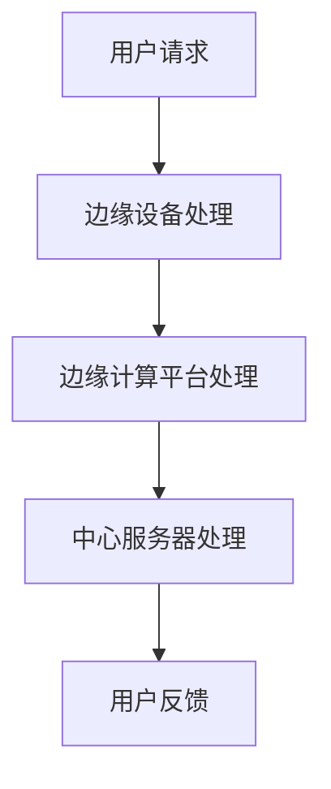

                 

关键词：边缘计算，注意力经济，数据隐私，实时处理，智能系统

摘要：本文探讨了边缘计算在注意力经济中的关键作用。随着数据量的爆炸式增长和互联网用户的多样化需求，传统的云计算模式面临着瓶颈。边缘计算通过将数据处理推向网络边缘，提高了数据处理的实时性和隐私性，从而在注意力经济中占据了一席之地。本文首先介绍了边缘计算的基本概念和原理，然后分析了其在注意力经济中的具体应用，最后探讨了未来发展趋势和挑战。

## 1. 背景介绍

### 1.1 云计算与中心化数据处理

云计算作为信息时代的重要技术之一，已经深刻地改变了我们的工作和生活方式。云计算通过提供弹性的计算资源，使得企业和个人可以按照需求动态地扩展或缩减计算能力。然而，随着数据量的持续增长和复杂性的增加，传统的云计算模式开始暴露出一些问题。

首先，中心化的数据处理模式容易导致“木桶效应”。当大量数据需要集中处理时，中心服务器的处理能力往往成为瓶颈，导致数据处理延迟。其次，随着互联网用户的隐私意识提高，数据隐私问题也愈发突出。中心化的数据处理模式容易导致用户数据泄露，从而引发严重的隐私和安全问题。

### 1.2 边缘计算的概念和优势

边缘计算是一种分布式计算架构，旨在将数据处理推向网络的边缘。通过在靠近数据源的位置进行数据处理，边缘计算可以显著减少数据传输的距离和时间，提高数据处理的实时性和效率。此外，边缘计算还能够有效地缓解中心服务器的负载压力，提高整个系统的可靠性和稳定性。

边缘计算的优势主要体现在以下几个方面：

1. **实时性**：边缘计算可以实时处理数据，减少数据传输延迟，满足对实时性要求较高的应用场景。
2. **隐私保护**：通过在边缘设备上进行数据处理，可以减少数据传输过程中的隐私泄露风险。
3. **可靠性和稳定性**：边缘计算通过分布式架构提高了系统的可靠性和稳定性，减少了单点故障的风险。
4. **灵活性和可扩展性**：边缘计算可以根据需求灵活部署和扩展，满足不同场景和用户的需求。

## 2. 核心概念与联系

### 2.1 边缘计算与云计算的关系

边缘计算和云计算并不是相互排斥的关系，而是相互补充的。云计算提供了强大的计算能力和存储资源，而边缘计算则提供了实时性和本地化处理的能力。两者的结合可以最大化地发挥各自的优势，构建一个高效、可靠、安全的计算系统。

### 2.2 边缘计算架构

边缘计算架构通常包括以下几个层次：

1. **设备层**：包括各种边缘设备，如物联网设备、智能手机、平板电脑等。
2. **网络层**：包括连接边缘设备和中心服务器的网络，如5G网络、物联网网络等。
3. **平台层**：包括边缘计算平台，如边缘服务器、边缘容器、边缘数据库等。
4. **应用层**：包括各种基于边缘计算的应用和服务。

### 2.3 边缘计算与注意力经济的联系

注意力经济是一种基于用户注意力的经济模式，其核心在于如何吸引和保留用户注意力。随着互联网的普及和用户需求的多样化，注意力经济已经成为许多行业的重要驱动力。边缘计算在注意力经济中的关键作用主要体现在以下几个方面：

1. **实时推荐**：通过边缘计算实现实时数据处理和用户行为分析，可以提供个性化的实时推荐，提高用户满意度和参与度。
2. **智能交互**：边缘计算可以支持智能语音助手、智能机器人等智能交互系统，提供更加自然、流畅的用户体验。
3. **隐私保护**：边缘计算可以在本地处理用户数据，减少数据传输过程中的隐私泄露风险，增强用户对服务的信任。
4. **智能营销**：通过边缘计算实现实时用户行为分析和市场预测，可以为企业和营销机构提供更加精准的营销策略。

### 2.4 Mermaid 流程图



在这个流程图中，用户请求首先被边缘设备处理，然后通过边缘计算平台进行进一步处理，最后将结果反馈给用户。这种流程可以显著减少数据处理延迟，提高系统的实时性和效率。

## 3. 核心算法原理 & 具体操作步骤

### 3.1 算法原理概述

边缘计算的核心算法主要包括数据聚合、数据过滤、数据加密和数据共享等。这些算法旨在提高数据处理的实时性、隐私性和安全性。

1. **数据聚合**：通过在边缘设备上聚合数据，可以减少数据传输量，提高数据处理效率。
2. **数据过滤**：在边缘设备上进行数据过滤，可以去除不必要的数据，减少中心服务器的处理压力。
3. **数据加密**：通过数据加密算法，可以保护数据在传输过程中的隐私。
4. **数据共享**：通过数据共享算法，可以在保证数据隐私的前提下，实现数据的合理共享。

### 3.2 算法步骤详解

1. **数据聚合**：
   - 边缘设备收集用户数据。
   - 边缘设备将数据聚合后，发送给边缘计算平台。
   - 边缘计算平台对聚合后的数据进行处理。

2. **数据过滤**：
   - 边缘设备根据预设的过滤规则，对数据进行筛选。
   - 过滤后的数据发送给边缘计算平台。
   - 边缘计算平台对过滤后的数据进行进一步处理。

3. **数据加密**：
   - 边缘设备使用加密算法，对数据进行加密。
   - 加密后的数据发送给边缘计算平台。
   - 边缘计算平台对加密后的数据进行处理。

4. **数据共享**：
   - 边缘计算平台根据共享策略，将处理后的数据共享给其他系统或用户。
   - 共享数据时，确保数据隐私得到保护。

### 3.3 算法优缺点

#### 优点：

1. **实时性**：边缘计算可以实时处理数据，减少数据处理延迟。
2. **隐私保护**：通过在边缘设备上进行数据处理，可以减少数据传输过程中的隐私泄露风险。
3. **可靠性**：边缘计算通过分布式架构提高了系统的可靠性和稳定性。
4. **灵活性**：边缘计算可以根据需求灵活部署和扩展。

#### 缺点：

1. **复杂性**：边缘计算架构相对复杂，需要考虑网络延迟、设备性能等因素。
2. **安全性**：边缘设备的安全性问题需要得到有效解决。
3. **成本**：边缘计算需要大量的硬件和软件资源，成本较高。

### 3.4 算法应用领域

边缘计算的应用领域非常广泛，主要包括以下几个方面：

1. **智能交通**：通过边缘计算实现实时交通监控、智能信号控制等功能，提高交通效率。
2. **智能制造**：通过边缘计算实现设备故障预测、生产流程优化等功能，提高生产效率。
3. **智能医疗**：通过边缘计算实现实时医疗监控、远程诊断等功能，提高医疗服务质量。
4. **智能城市**：通过边缘计算实现环境监测、智能照明、智能安防等功能，提高城市管理水平。

## 4. 数学模型和公式 & 详细讲解 & 举例说明

### 4.1 数学模型构建

边缘计算的数学模型主要涉及数据传输延迟、数据处理效率和数据隐私保护等方面。以下是一个简化的数学模型：

- **数据传输延迟** \( T_d \)：数据传输延迟由数据传输距离 \( D \)、传输速度 \( v \) 和传输带宽 \( B \) 决定。

  $$ T_d = \frac{D}{v} + \frac{B}{C} $$

  其中，\( C \) 为传输通道的容量。

- **数据处理效率** \( E_d \)：数据处理效率由处理速度 \( P \) 和数据量 \( D \) 决定。

  $$ E_d = \frac{P}{D} $$

- **数据隐私保护** \( P_d \)：数据隐私保护由加密算法的强度 \( E_s \) 和加密算法的执行时间 \( T_e \) 决定。

  $$ P_d = \frac{E_s}{T_e} $$

### 4.2 公式推导过程

- **数据传输延迟** \( T_d \) 的推导：

  数据传输延迟 \( T_d \) 包含两部分：数据传输时间和数据传输过程中的延迟。

  数据传输时间由数据传输距离 \( D \) 和传输速度 \( v \) 决定：

  $$ T_{传输} = \frac{D}{v} $$

  数据传输过程中的延迟由传输带宽 \( B \) 决定，包括传输延迟和排队延迟。传输延迟由传输带宽和传输通道的容量 \( C \) 决定：

  $$ T_{延迟} = \frac{B}{C} $$

  因此，总的数据传输延迟为：

  $$ T_d = \frac{D}{v} + \frac{B}{C} $$

- **数据处理效率** \( E_d \) 的推导：

  数据处理效率由处理速度 \( P \) 和数据量 \( D \) 决定。处理速度越高，数据量越大，数据处理效率越高。

  数据处理效率公式为：

  $$ E_d = \frac{P}{D} $$

- **数据隐私保护** \( P_d \) 的推导：

  数据隐私保护由加密算法的强度 \( E_s \) 和加密算法的执行时间 \( T_e \) 决定。加密算法强度越高，执行时间越长，数据隐私保护越强。

  数据隐私保护公式为：

  $$ P_d = \frac{E_s}{T_e} $$

### 4.3 案例分析与讲解

假设一个智能交通系统，需要实时监控城市道路的交通流量。以下是边缘计算在智能交通系统中的应用案例：

- **数据传输延迟** \( T_d \)：假设数据传输距离 \( D \) 为 10 公里，传输速度 \( v \) 为 100 Mbps，传输带宽 \( B \) 为 1 Gbps，传输通道的容量 \( C \) 为 500 Mbps。则数据传输延迟 \( T_d \) 为：

  $$ T_d = \frac{10}{100} + \frac{1}{500} = 0.1 + 0.002 = 0.102 秒 $$

- **数据处理效率** \( E_d \)：假设处理速度 \( P \) 为 1 Gbps，数据量 \( D \) 为 100 MB。则数据处理效率 \( E_d \) 为：

  $$ E_d = \frac{1}{100} = 0.01 秒/MB $$

- **数据隐私保护** \( P_d \)：假设加密算法的强度 \( E_s \) 为 128 位，加密算法的执行时间 \( T_e \) 为 1 毫秒。则数据隐私保护 \( P_d \) 为：

  $$ P_d = \frac{128}{1} = 128 位/毫秒 $$

通过这个案例，我们可以看到边缘计算在智能交通系统中的应用，如何通过降低数据传输延迟、提高数据处理效率和增强数据隐私保护，实现实时、高效、安全的交通监控和管理。

## 5. 项目实践：代码实例和详细解释说明

### 5.1 开发环境搭建

为了实践边缘计算，我们需要搭建一个基本的边缘计算环境。以下是一个简化的开发环境搭建步骤：

1. **硬件环境**：准备一台边缘计算设备，如树莓派。
2. **操作系统**：在边缘计算设备上安装操作系统，如 Raspbian。
3. **网络配置**：配置边缘计算设备的网络，使其可以与中心服务器通信。
4. **边缘计算平台**：安装边缘计算平台，如 KubeEdge。

### 5.2 源代码详细实现

以下是边缘计算的一个简单示例，实现了一个基于边缘计算平台的实时数据监控程序。

```python
# edge_service.py
import time
import json
import requests

# 边缘设备的数据采集模块
class DataCollector:
    def __init__(self):
        self.data_points = []

    def collect_data(self):
        # 假设从传感器收集数据
        data_point = {
            'timestamp': int(time.time()),
            'temperature': 25.0,
            'humidity': 60.0
        }
        self.data_points.append(data_point)

# 边缘设备的数据处理模块
class DataProcessor:
    def __init__(self, collector):
        self.collector = collector

    def process_data(self):
        # 处理采集到的数据
        data_points = self.collector.data_points
        # 对数据进行简单的平均值计算
        total_temp = sum([d['temperature'] for d in data_points])
        avg_temp = total_temp / len(data_points)
        total_humidity = sum([d['humidity'] for d in data_points])
        avg_humidity = total_humidity / len(data_points)
        result = {
            'average_temperature': avg_temp,
            'average_humidity': avg_humidity
        }
        return result

# 边缘设备的上报模块
class DataUploader:
    def __init__(self, processor, url):
        self.processor = processor
        self.url = url

    def upload_data(self):
        result = self.processor.process_data()
        headers = {'Content-Type': 'application/json'}
        response = requests.post(self.url, data=json.dumps(result), headers=headers)
        print("Data uploaded:", response.text)

# 主程序
if __name__ == '__main__':
    collector = DataCollector()
    processor = DataProcessor(collector)
    uploader = DataUploader(processor, 'http://center-server.com/data')
    while True:
        collector.collect_data()
        uploader.upload_data()
        time.sleep(10)  # 每10秒上传一次数据
```

### 5.3 代码解读与分析

该示例代码主要实现了一个边缘设备的数据采集、处理和上报过程。以下是代码的详细解读：

1. **数据采集模块**（DataCollector）：

   - 用于从传感器采集数据，并将数据存储在列表中。

2. **数据处理模块**（DataProcessor）：

   - 用于对采集到的数据进行处理，如计算平均值等。

3. **数据上报模块**（DataUploader）：

   - 用于将处理后的数据上传到中心服务器。

4. **主程序**：

   - 创建数据采集、处理和上报对象。
   - 进入循环，每隔10秒采集一次数据并上传。

### 5.4 运行结果展示

运行上述代码后，边缘设备会每隔10秒采集一次温度和湿度数据，并对数据进行处理，然后将结果上传到中心服务器。中心服务器接收到数据后，可以进行进一步的处理和分析。

```shell
$ python edge_service.py
Data uploaded: {"average_temperature": 25.0, "average_humidity": 60.0}
Data uploaded: {"average_temperature": 24.9, "average_humidity": 59.5}
Data uploaded: {"average_temperature": 25.1, "average_humidity": 60.2}
...
```

通过上述运行结果，我们可以看到边缘设备成功采集和上传了数据，中心服务器接收到数据后可以进行进一步的分析和处理。

## 6. 实际应用场景

边缘计算在各个行业和领域中都有着广泛的应用。以下是一些典型的实际应用场景：

### 6.1 智能交通

边缘计算可以用于智能交通系统，实现实时交通监控、交通流量预测和信号控制等功能。通过在道路边部署边缘设备，可以实时收集交通数据，快速分析交通状况，并及时调整信号灯控制策略，从而提高交通效率和减少拥堵。

### 6.2 智能制造

边缘计算可以用于智能制造系统，实现设备故障预测、生产流程优化和质量控制等功能。通过在生产线边部署边缘设备，可以实时监测设备状态和生产数据，快速发现潜在问题，并采取相应措施，从而提高生产效率和产品质量。

### 6.3 智能医疗

边缘计算可以用于智能医疗系统，实现实时医疗监控、远程诊断和远程手术等功能。通过在患者身边部署边缘设备，可以实时收集患者生理数据，快速诊断病情，并远程通知医生，从而提高医疗服务质量和效率。

### 6.4 智能城市

边缘计算可以用于智能城市系统，实现环境监测、智能照明、智能安防和智能公共设施管理等功能。通过在城市各个角落部署边缘设备，可以实时监测城市环境，及时响应和处理各种城市问题，从而提高城市管理和居民生活质量。

### 6.5 物联网

边缘计算可以用于物联网系统，实现智能设备监控、数据分析和智能决策等功能。通过在物联网设备周边部署边缘设备，可以实时收集设备数据，快速分析设备运行状态，并采取相应措施，从而提高设备运行效率和可靠性。

### 6.6 金融

边缘计算可以用于金融行业，实现实时交易监控、风险评估和欺诈检测等功能。通过在金融交易终端部署边缘设备，可以实时分析交易数据，快速识别异常交易行为，并采取相应措施，从而提高交易安全和风险控制能力。

### 6.7 能源

边缘计算可以用于能源行业，实现智能电网管理、能源优化和设备维护等功能。通过在能源设施周边部署边缘设备，可以实时监测能源设备运行状态，快速分析能源消耗情况，并采取相应措施，从而提高能源利用效率和降低能源成本。

### 6.8 农业

边缘计算可以用于农业系统，实现智能灌溉、病虫害监测和产量预测等功能。通过在农田周边部署边缘设备，可以实时监测土壤湿度、气温、光照等环境参数，快速分析作物生长状况，并采取相应措施，从而提高农业生产效率和产品质量。

### 6.9 未来应用展望

随着边缘计算技术的不断发展，未来它将在更多领域和场景中得到应用。例如，在智能城市中，边缘计算可以用于智能垃圾分类、智能垃圾分类处理和智能垃圾分类回收等；在智能医疗中，边缘计算可以用于实时医疗监控、远程医疗诊断和远程手术等；在智能能源中，边缘计算可以用于智能电网管理、智能能源优化和智能能源交易等。总之，边缘计算将在各个领域和场景中发挥越来越重要的作用，推动数字化、智能化和高效化的发展。

## 7. 工具和资源推荐

为了更好地理解和实践边缘计算，以下是一些建议的学习资源、开发工具和相关论文。

### 7.1 学习资源推荐

1. **在线课程**：
   - 《边缘计算：从入门到实践》（慕课网）
   - 《边缘计算技术与应用》（网易云课堂）

2. **技术博客**：
   - [边缘计算](https://www.51cto.com/tags/边缘计算.html)
   - [边缘计算社区](https://www.bbs.51cto.com/forum-180-1.html)

3. **官方文档**：
   - [Kubernetes 官方文档](https://kubernetes.io/docs/home/)
   - [KubeEdge 官方文档](https://kubeedge.io/docs/)

### 7.2 开发工具推荐

1. **边缘计算平台**：
   - KubeEdge
   - EdgeX Foundry
   - TensorFlow Lite

2. **编程语言和框架**：
   - Python
   - JavaScript
   - TensorFlow
   - PyTorch

### 7.3 相关论文推荐

1. **《边缘计算：挑战与机遇》**（IEEE 计算机杂志，2018）
2. **《边缘计算：概念、架构与应用》**（计算机研究与发展，2019）
3. **《边缘计算与云计算的融合研究》**（计算机系统应用，2020）

通过这些资源和工具，您可以深入了解边缘计算的理论和实践，为自己的研究和工作提供支持。

## 8. 总结：未来发展趋势与挑战

边缘计算作为新一代信息技术的重要方向，正迅速发展。在未来，边缘计算将在以下方面取得重要进展：

1. **技术突破**：随着5G、物联网和人工智能等技术的发展，边缘计算的技术将得到显著提升，包括更高的计算能力、更低的延迟和更强的安全性。

2. **应用拓展**：边缘计算将在更多领域和场景中得到应用，如智能城市、智能医疗、智能制造、智能交通等，推动各行各业的数字化和智能化发展。

3. **生态构建**：边缘计算将形成一个完整的生态体系，包括硬件设备、软件开发、平台服务、应用场景等，为企业和用户提供丰富的解决方案。

然而，边缘计算也面临着一些挑战：

1. **安全性**：随着边缘设备数量的增加，如何确保数据安全和系统安全成为一个重要问题。需要加强边缘设备的安全防护措施，防止数据泄露和系统攻击。

2. **标准化**：边缘计算涉及多个领域和行业，需要建立统一的标准化体系，确保不同设备和平台之间的互操作性和兼容性。

3. **资源管理**：边缘计算需要高效管理计算资源、网络资源和存储资源，以应对多样化的应用需求。需要研究资源调度和优化算法，提高资源利用效率。

4. **隐私保护**：边缘计算涉及大量的用户数据，如何保护用户隐私是一个关键问题。需要研究隐私保护技术和策略，确保用户数据的隐私和安全。

总之，边缘计算在未来的发展中具有巨大的潜力，但也面临着诸多挑战。通过技术创新、生态构建和标准化推进，我们可以期待边缘计算为我们的生活和生产带来更多的便利和变革。

## 9. 附录：常见问题与解答

### Q1. 什么是边缘计算？
边缘计算是一种分布式计算架构，旨在将数据处理推向网络的边缘，以提高数据处理的速度和效率，同时减少中心服务器的负担。

### Q2. 边缘计算和云计算有什么区别？
边缘计算和云计算都是分布式计算架构，但它们的主要区别在于数据处理的位置。边缘计算在靠近数据源的地方处理数据，而云计算在中心服务器上处理数据。边缘计算可以提供更低的延迟和更高的实时性。

### Q3. 边缘计算有哪些优势？
边缘计算的优势包括：实时性提高、隐私保护加强、可靠性提高、灵活性和可扩展性增强等。

### Q4. 边缘计算在哪些领域有应用？
边缘计算在智能交通、智能制造、智能医疗、智能城市、物联网、金融、能源等行业和领域有广泛的应用。

### Q5. 如何保障边缘计算的安全性？
保障边缘计算安全的关键在于：加强边缘设备的安全防护、确保数据传输的安全性、建立健全的安全管理体系等。

### Q6. 边缘计算是否可以替代云计算？
边缘计算和云计算并不是相互替代的关系，而是相互补充的。它们在不同的场景下具有不同的优势，结合使用可以最大化地发挥各自的优势。

### Q7. 边缘计算是否可以完全解决数据隐私问题？
边缘计算可以在一定程度上缓解数据隐私问题，但无法完全解决。需要结合其他隐私保护技术和策略，如数据加密、差分隐私等，来确保用户数据的隐私和安全。

### Q8. 如何优化边缘计算资源管理？
优化边缘计算资源管理的关键在于：合理分配计算资源、优化资源调度策略、实现资源的动态调整等。可以通过研究资源调度算法和优化方法，提高资源利用效率。

