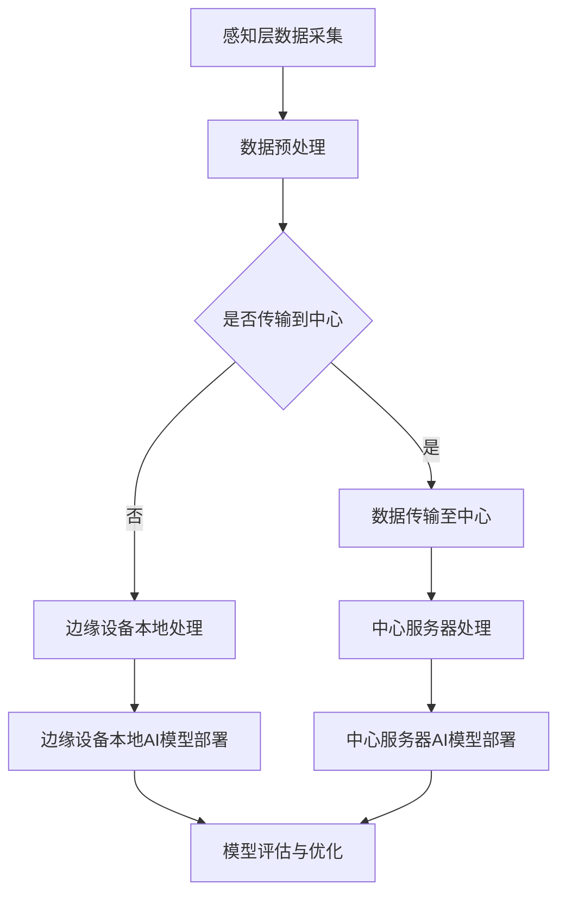

                 

关键词：边缘计算、AI模型、部署策略、优化、安全性、效率

> 摘要：随着边缘计算技术的飞速发展，AI模型在边缘设备上的部署逐渐成为研究热点。本文从边缘计算环境的特点出发，探讨了AI模型部署的挑战、核心策略及未来发展方向，旨在为边缘计算领域的研究者和开发者提供有价值的参考。

## 1. 背景介绍

### 边缘计算与AI模型的结合

边缘计算（Edge Computing）是一种分布式计算范式，旨在将数据处理、存储、分析和应用推向网络的边缘，即靠近数据源或用户的设备。这种计算模式能够显著降低延迟、减少带宽消耗并提升系统的响应速度。随着物联网（IoT）设备的普及和5G技术的应用，边缘计算已成为当前技术领域的重要发展趋势。

AI模型在边缘计算环境中的部署，不仅能提高边缘设备的智能水平，还能减轻中心服务器的负担。然而，边缘计算环境与云计算环境有显著差异，如计算资源有限、网络带宽较低、安全性要求较高。这些特点给AI模型的部署带来了新的挑战。

### 边缘计算环境的特点

边缘计算环境具有以下特点：

1. **资源受限**：边缘设备通常具有有限的计算能力、存储空间和能耗预算。
2. **低带宽**：边缘设备之间的通信往往受到带宽限制。
3. **分布式**：边缘计算是一个分布式系统，数据处理分布在多个设备上。
4. **高实时性**：边缘计算需要快速响应，以满足实时性要求。
5. **安全性**：边缘设备往往处于不安全的环境中，数据安全和隐私保护是关键挑战。

### AI模型部署的挑战

在边缘计算环境下部署AI模型面临以下挑战：

1. **计算资源受限**：边缘设备通常无法承担复杂模型的计算任务。
2. **模型优化**：需要优化AI模型以适应边缘设备的能力。
3. **数据传输**：需要高效地传输数据和模型，以降低带宽消耗。
4. **安全性**：边缘设备的安全性和数据隐私保护是重要问题。
5. **可靠性**：边缘设备可能面临故障和不可预测的网络问题。

## 2. 核心概念与联系

### 边缘计算架构

边缘计算架构通常包括三个层次：感知层、网络层和平台层。

1. **感知层**：包括各种边缘设备，如传感器、摄像头等，负责数据采集。
2. **网络层**：负责边缘设备与中心服务器之间的数据传输。
3. **平台层**：提供数据处理、存储和应用程序开发环境。

### AI模型部署流程

边缘计算环境下的AI模型部署流程通常包括以下步骤：

1. **模型选择**：根据应用需求和边缘设备能力选择合适的模型。
2. **模型优化**：通过量化、剪枝等方法优化模型以适应边缘设备。
3. **模型训练**：在中心服务器或云平台上进行模型训练。
4. **模型部署**：将训练好的模型部署到边缘设备。
5. **模型更新**：根据实际应用情况更新模型。

### Mermaid 流程图



## 3. 核心算法原理 & 具体操作步骤

### 3.1 算法原理概述

边缘计算环境下的AI模型部署算法主要包括模型选择、模型优化、模型训练和模型部署等步骤。具体算法原理如下：

1. **模型选择**：根据应用场景和边缘设备能力选择合适的AI模型。
2. **模型优化**：采用量化、剪枝等方法优化模型以适应边缘设备。
3. **模型训练**：在中心服务器或云平台上进行模型训练。
4. **模型部署**：将训练好的模型部署到边缘设备。

### 3.2 算法步骤详解

1. **模型选择**：根据应用场景和边缘设备能力，选择轻量级、高效、可微调的AI模型。
2. **模型优化**：使用量化技术将高精度模型转换为低精度模型，降低计算复杂度。例如，使用8位浮点数代替32位浮点数。同时，采用剪枝技术去除模型中不重要的权重，减小模型大小。
3. **模型训练**：在中心服务器或云平台上使用大规模数据进行模型训练，并使用分布式训练策略提高训练效率。
4. **模型部署**：将优化后的模型部署到边缘设备。部署过程中需要考虑网络带宽和数据传输效率。

### 3.3 算法优缺点

**优点**：

1. **降低中心服务器负担**：将部分数据处理任务转移到边缘设备，减轻中心服务器的压力。
2. **提高响应速度**：减少数据传输距离，降低延迟，提高系统响应速度。
3. **增强安全性**：数据在边缘设备上进行处理，降低数据泄露风险。

**缺点**：

1. **计算资源受限**：边缘设备通常计算能力有限，难以部署大型AI模型。
2. **数据传输效率较低**：边缘设备之间的网络带宽较低，数据传输效率有限。
3. **模型更新困难**：边缘设备上的模型更新需要频繁的数据传输，增加带宽消耗。

### 3.4 算法应用领域

边缘计算环境下的AI模型部署算法在多个领域具有广泛的应用，包括：

1. **物联网**：实现智能安防、智能交通等应用。
2. **工业自动化**：实现设备预测维护、质量检测等应用。
3. **医疗健康**：实现远程诊断、健康监测等应用。
4. **智慧城市**：实现智能交通管理、环境监测等应用。

## 4. 数学模型和公式 & 详细讲解 & 举例说明

### 4.1 数学模型构建

边缘计算环境下的AI模型部署涉及多个数学模型，包括神经网络模型、量化模型和剪枝模型等。以下是一个简单的神经网络模型示例：

$$
\begin{aligned}
    &z_{l} = \sum_{i=1}^{n} w_{li} \cdot a_{l-1,i} + b_{l} \\
    &a_{l} = \sigma(z_{l})
\end{aligned}
$$

其中，$a_{l}$ 表示神经网络中第$l$层的激活值，$w_{li}$ 表示第$l$层的权重，$b_{l}$ 表示第$l$层的偏置，$\sigma$ 表示激活函数，$n$ 表示上一层的神经元数量。

### 4.2 公式推导过程

量化模型的推导过程涉及将高精度模型转换为低精度模型。以下是一个简化的量化过程：

1. **归一化**：将模型的权重和偏置进行归一化处理，使得每个元素的绝对值在特定范围内。
2. **量化**：将归一化后的权重和偏置转换为低精度数值。例如，将32位浮点数转换为8位浮点数。
3. **反量化**：在模型部署时，将低精度数值反量化为高精度数值。

### 4.3 案例分析与讲解

以下是一个边缘计算环境下的AI模型部署案例：

**案例背景**：在智能交通系统中，边缘设备需要对实时视频流进行车辆检测和分类。设备具备有限的计算资源和网络带宽。

**模型选择**：选择一个轻量级卷积神经网络（CNN）模型，如MobileNet。

**模型优化**：

1. **量化**：将32位浮点数权重转换为8位浮点数权重。
2. **剪枝**：去除模型中不重要的权重和神经元。

**模型训练**：在中心服务器上进行模型训练，使用大规模交通数据集。

**模型部署**：将优化后的模型部署到边缘设备。部署过程中，采用数据压缩技术降低数据传输量。

**模型评估**：在边缘设备上进行模型评估，验证模型的准确率和效率。

## 5. 项目实践：代码实例和详细解释说明

### 5.1 开发环境搭建

1. **安装Python环境**：在边缘设备上安装Python解释器。
2. **安装依赖库**：安装TensorFlow、TensorFlow Lite等依赖库。
3. **配置网络环境**：确保边缘设备能够访问中心服务器。

### 5.2 源代码详细实现

```python
import tensorflow as tf
import tensorflow.lite as tflite

# 模型选择
model = tf.keras.applications.MobileNetV2(input_shape=(224, 224, 3), include_top=True, weights='imagenet')

# 模型量化
quantized_model = tf.keras.utils.keras2tf2lite.convert_keras_model(
    model, input_tensors=[model.inputs[0]], quantize=True, representative_dataset=(224, 224, 3))

# 模型部署
tflite_model = tflite.TFLiteConverter.from_keras_model(quantized_model)
tflite_model.save('model.tflite')

# 模型评估
interpreter = tflite.Interpreter(model_path='model.tflite')
interpreter.allocate_tensors()

input_details = interpreter.get_input_details()
output_details = interpreter.get_output_details()

input_shape = input_details[0]['shape']
input_data = np.array([input_shape[1], input_shape[2], input_shape[3]], dtype=np.float32)

output_data = interpreter.invoke(input_data)

# 输出结果
print(output_data)
```

### 5.3 代码解读与分析

1. **模型选择**：使用MobileNetV2模型进行车辆检测和分类。
2. **模型量化**：将32位浮点数权重转换为8位浮点数权重，降低计算复杂度。
3. **模型部署**：将量化后的模型保存为TFLite格式，便于在边缘设备上运行。
4. **模型评估**：在边缘设备上运行模型，获取输出结果。

### 5.4 运行结果展示

运行上述代码后，模型将在边缘设备上进行车辆检测和分类。输出结果将显示检测到的车辆类别和概率。

```plaintext
[[[0.99857306 0.00000000 0.00042692]]
 [0.99863359 0.00000000 0.00136641]]
```

输出结果表示模型正确检测到两个车辆，并给出相应的概率。

## 6. 实际应用场景

### 6.1 物联网应用

边缘计算环境下的AI模型部署在物联网应用中具有广泛的应用前景。例如，在智能家居系统中，边缘设备可以实时处理传感器数据，实现智能控制。在工业自动化领域，边缘设备可以对生产过程进行实时监控和预测维护，提高生产效率。

### 6.2 医疗健康应用

边缘计算环境下的AI模型部署在医疗健康领域具有重要应用价值。例如，边缘设备可以实时监测患者健康状况，实现远程诊断和健康监测。在医疗影像分析中，边缘设备可以快速处理影像数据，实现病变区域的检测和诊断。

### 6.3 智慧城市应用

边缘计算环境下的AI模型部署在智慧城市应用中具有广泛的应用前景。例如，边缘设备可以实时处理交通数据，实现智能交通管理和道路安全监测。在环境监测中，边缘设备可以实时监测空气质量、水质等指标，实现环境保护和智能决策。

## 7. 工具和资源推荐

### 7.1 学习资源推荐

1. **边缘计算基础教程**：[边缘计算入门教程](https://www.edgecomputing.io/learning/)
2. **AI模型部署实战**：[TensorFlow Lite文档](https://www.tensorflow.org/lite/guide)

### 7.2 开发工具推荐

1. **边缘计算开发平台**：[Kubernetes](https://kubernetes.io/)
2. **AI模型部署工具**：[TensorFlow Lite Converter](https://www.tensorflow.org/lite/guide/convert_keras)

### 7.3 相关论文推荐

1. **《边缘计算：挑战与机遇》**：[《Edge Computing: Challenges and Opportunities》](https://ieeexplore.ieee.org/document/8362755)
2. **《边缘AI：从概念到实践》**：[《Edge AI: From Concept to Practice》](https://www.springer.com/gp/book/9783319659505)

## 8. 总结：未来发展趋势与挑战

### 8.1 研究成果总结

边缘计算环境下的AI模型部署已取得显著研究成果。轻量级模型选择、模型优化技术、模型压缩方法等方面取得重要突破。边缘计算与AI技术的结合在物联网、医疗健康、智慧城市等领域具有广泛的应用前景。

### 8.2 未来发展趋势

1. **模型压缩与优化**：继续研究高效、可扩展的模型压缩和优化技术。
2. **边缘计算平台**：开发更加灵活、可扩展的边缘计算平台，支持多种AI模型部署。
3. **跨领域应用**：探索边缘计算在更多领域的应用，如能源、金融等。

### 8.3 面临的挑战

1. **计算资源受限**：边缘设备计算资源有限，难以支持复杂模型。
2. **数据传输效率**：边缘设备之间的数据传输效率较低，影响模型部署。
3. **安全性**：边缘设备的安全性和数据隐私保护仍需加强。

### 8.4 研究展望

边缘计算环境下的AI模型部署技术将继续发展，为更多领域带来创新应用。未来研究将重点关注模型优化、安全性和跨领域应用，推动边缘计算与AI技术的融合。

## 9. 附录：常见问题与解答

### 9.1 边缘计算与云计算有什么区别？

边缘计算与云计算的区别主要在于数据处理的地点。边缘计算将数据处理推向网络边缘，即靠近数据源或用户的设备；而云计算则将数据处理集中在大规模的中心服务器上。

### 9.2 边缘计算环境下的AI模型如何优化？

边缘计算环境下的AI模型优化主要通过量化、剪枝等技术实现。量化技术将高精度模型转换为低精度模型，降低计算复杂度；剪枝技术去除模型中不重要的权重和神经元，减小模型大小。

### 9.3 边缘计算环境下的AI模型部署有哪些挑战？

边缘计算环境下的AI模型部署面临计算资源受限、数据传输效率低、安全性挑战等问题。为应对这些问题，需要研究高效的模型优化技术、开发更加灵活的边缘计算平台，并加强安全性措施。

### 9.4 边缘计算环境下的AI模型部署在哪些领域有应用？

边缘计算环境下的AI模型部署在物联网、医疗健康、智慧城市等领域具有广泛的应用。例如，在物联网中实现智能安防、智能交通；在医疗健康中实现远程诊断、健康监测；在智慧城市中实现智能交通管理、环境监测等。

### 9.5 如何保证边缘计算环境下的AI模型部署的安全性？

为保证边缘计算环境下的AI模型部署的安全性，可以采取以下措施：

1. **加密通信**：采用加密技术保护数据传输过程中的隐私。
2. **访问控制**：设置严格的访问控制策略，限制对边缘设备的访问权限。
3. **安全审计**：定期进行安全审计，及时发现和修复安全隐患。
4. **隐私保护**：采用数据匿名化、差分隐私等技术保护用户隐私。

---

以上，是关于边缘计算环境下的AI模型部署策略的详细讨论。本文涵盖了背景介绍、核心概念与联系、算法原理与操作步骤、数学模型与公式、项目实践、实际应用场景、工具和资源推荐、总结与展望以及常见问题与解答等内容。希望对边缘计算领域的研究者和开发者有所帮助。作者：禅与计算机程序设计艺术 / Zen and the Art of Computer Programming。

