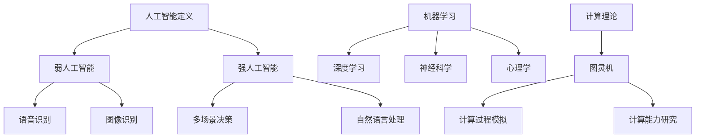

                 

关键词：人工智能、机器学习、编程范式、计算理论、计算机科学、自然语言处理、人工智能伦理

> 摘要：本文详细探讨了达特茅斯会议在计算机科学领域的开创性研究议题。通过对会议的背景、核心议题以及其对现代计算机科学的深远影响的分析，本文旨在为读者提供一个全面而深入的理解，并展望未来人工智能和机器学习的发展方向。

## 1. 背景介绍

达特茅斯会议，也被称为“人工智能的诞生会议”，是计算机科学历史上的一个重要里程碑。1956年，一群顶尖的科学家和研究者聚集在位于美国新罕布什尔州的达特茅斯学院，共同探讨了一个前所未有的概念：机器能否在某种程度上表现出类似于人类的智能。

这次会议的发起人包括约翰·麦卡锡（John McCarthy）、马文·明斯基（Marvin Minsky）、克劳德·香农（Claude Shannon）等，他们都是当时计算机科学和数学领域的佼佼者。会议的召开标志着人工智能作为一门独立学科的正式诞生。

会议的主要议题包括：

- 是否有可能制造出具有人类智能的机器？
- 人工智能如何实现推理、学习和理解？
- 机器能否拥有感知、思考和决策的能力？

这些议题不仅在当时具有前瞻性，而且至今仍然影响着人工智能的研究方向和发展进程。

## 2. 核心概念与联系

### 2.1 人工智能的定义与范畴

人工智能（Artificial Intelligence，简称AI）是一门涉及计算机科学、数学、神经科学、心理学等多个学科领域的交叉科学。其核心目标是使计算机具备类似于人类的感知、思考、学习和决策能力。

人工智能可以分为两大类：弱人工智能（Narrow AI）和强人工智能（General AI）。

- **弱人工智能**：专注于解决特定问题的智能系统，如语音识别、图像识别、自然语言处理等。
- **强人工智能**：能够像人类一样在多种场景下进行思考、学习和决策的智能系统。

### 2.2 机器学习与深度学习

机器学习（Machine Learning）是人工智能的一个重要分支，它通过算法使计算机能够从数据中自动学习和改进性能，而不是通过显式编程。深度学习（Deep Learning）是机器学习的一种方法，通过多层神经网络模拟人脑的决策过程，是目前实现人工智能的重要技术之一。

### 2.3 计算理论的基本原理

计算理论是计算机科学的基础，它研究计算过程的基本原理和能力。其中，图灵机（Turing Machine）是计算理论的核心概念，它为理解计算过程提供了一个抽象模型。图灵机的基本思想是通过一个有限的控制规则来模拟任何计算过程。

### 2.4 Mermaid 流程图



## 3. 核心算法原理 & 具体操作步骤

### 3.1 算法原理概述

人工智能的核心算法包括机器学习算法和深度学习算法。机器学习算法主要分为监督学习、无监督学习和强化学习。深度学习算法则主要基于多层神经网络，通过反向传播算法进行训练和优化。

### 3.2 算法步骤详解

- **监督学习**：给定输入数据和对应的输出标签，训练模型以预测新的输入。
- **无监督学习**：仅给定输入数据，模型需要发现数据中的模式或结构。
- **强化学习**：通过与环境交互，模型不断学习最优策略以实现目标。

### 3.3 算法优缺点

- **机器学习算法**：能够处理大量数据，自适应性强，但需要大量标注数据，模型解释性较差。
- **深度学习算法**：能够自动提取特征，处理复杂问题，但计算资源需求高，对数据质量敏感。

### 3.4 算法应用领域

人工智能算法广泛应用于自然语言处理、计算机视觉、医学诊断、金融预测等多个领域。

## 4. 数学模型和公式 & 详细讲解 & 举例说明

### 4.1 数学模型构建

人工智能中的数学模型主要包括线性回归、逻辑回归、支持向量机（SVM）等。

### 4.2 公式推导过程

- **线性回归**：

$$
y = \beta_0 + \beta_1x
$$

- **逻辑回归**：

$$
\hat{y} = \frac{1}{1 + e^{-(\beta_0 + \beta_1x)}}
$$

- **支持向量机**：

$$
\max \frac{1}{2} \sum_{i=1}^{n} w_i^2 \quad \text{subject to} \quad y_i (\langle w, x_i \rangle - \beta) \geq 1
$$

### 4.3 案例分析与讲解

以线性回归为例，假设我们有一个数据集，其中包含自变量 $x$ 和因变量 $y$。我们的目标是找到最佳的线性模型 $y = \beta_0 + \beta_1x$。

首先，我们需要计算模型的参数 $\beta_0$ 和 $\beta_1$，使用最小二乘法：

$$
\beta_1 = \frac{\sum_{i=1}^{n}(x_i - \bar{x})(y_i - \bar{y})}{\sum_{i=1}^{n}(x_i - \bar{x})^2}
$$

$$
\beta_0 = \bar{y} - \beta_1\bar{x}
$$

然后，我们使用计算出的参数对新的数据进行预测：

$$
\hat{y} = \beta_0 + \beta_1x
$$

## 5. 项目实践：代码实例和详细解释说明

### 5.1 开发环境搭建

在Python中实现线性回归模型，需要安装以下库：

- NumPy
- Matplotlib
- Scikit-learn

安装命令：

```bash
pip install numpy matplotlib scikit-learn
```

### 5.2 源代码详细实现

```python
import numpy as np
import matplotlib.pyplot as plt
from sklearn.linear_model import LinearRegression

# 生成数据集
np.random.seed(0)
x = np.random.rand(100)
y = 2 * x + 1 + np.random.randn(100) * 0.5

# 创建线性回归模型
model = LinearRegression()
model.fit(x[:, np.newaxis], y)

# 绘制数据集和回归线
plt.scatter(x, y, color='blue')
plt.plot(x, model.predict(x[:, np.newaxis]), color='red')
plt.show()
```

### 5.3 代码解读与分析

- **数据生成**：使用 NumPy 生成包含100个样本的随机数据集。
- **模型训练**：使用 Scikit-learn 的 LinearRegression 类创建模型并进行训练。
- **可视化**：使用 Matplotlib 绘制原始数据点和拟合的回归线。

### 5.4 运行结果展示

运行上述代码，我们可以看到一个包含随机数据的散点图，以及通过线性回归模型拟合出的最佳直线。

## 6. 实际应用场景

人工智能在各个领域都有广泛的应用：

- **自然语言处理**：用于智能客服、机器翻译、文本生成等。
- **计算机视觉**：用于图像识别、目标检测、自动驾驶等。
- **医学诊断**：用于疾病预测、医学图像分析等。
- **金融预测**：用于风险评估、市场预测等。

## 7. 工具和资源推荐

### 7.1 学习资源推荐

- 《深度学习》（Goodfellow, Bengio, Courville）
- 《Python机器学习》（Sebastian Raschka）

### 7.2 开发工具推荐

- Jupyter Notebook
- TensorFlow
- PyTorch

### 7.3 相关论文推荐

- "Deep Learning" by Yoshua Bengio, et al.
- "Learning to Learn" by Yaser Abu-Mostafa

## 8. 总结：未来发展趋势与挑战

### 8.1 研究成果总结

自达特茅斯会议以来，人工智能取得了长足的进步，特别是在机器学习和深度学习领域。然而，强人工智能的实现仍然面临着巨大的挑战。

### 8.2 未来发展趋势

- **更高效的算法**：研究和开发更高效的算法，以应对大规模数据处理和复杂问题。
- **更多应用场景**：探索人工智能在更多领域的应用，如医疗、教育、农业等。
- **更强大的硬件支持**：发展更先进的计算硬件，如量子计算机、神经形态芯片等。

### 8.3 面临的挑战

- **数据隐私与安全**：确保人工智能系统在处理数据时保护个人隐私。
- **算法公平性与透明性**：确保算法的决策过程是公正和透明的。
- **强人工智能的安全风险**：确保强人工智能不会被恶意使用。

### 8.4 研究展望

随着技术的不断进步，人工智能有望在未来实现更多的突破，从而推动社会的发展和变革。然而，这也需要我们不断关注和解决其中面临的各种挑战。

## 9. 附录：常见问题与解答

### 问题1：什么是机器学习？

机器学习是一种使计算机通过数据和经验自主学习和改进性能的方法，而无需显式编程。

### 问题2：什么是深度学习？

深度学习是机器学习的一种方法，通过多层神经网络模拟人脑的决策过程，自动提取特征并学习复杂模式。

### 问题3：什么是图灵机？

图灵机是计算理论的一个抽象模型，用于理解计算过程的基本原理。

### 问题4：什么是自然语言处理？

自然语言处理是人工智能的一个分支，专注于使计算机理解和生成自然语言。

### 问题5：人工智能是否会取代人类？

人工智能可以在特定领域取代人类的工作，但它无法完全取代人类的创造力和情感。人类与人工智能的协同工作是未来的趋势。

---

作者：禅与计算机程序设计艺术 / Zen and the Art of Computer Programming


