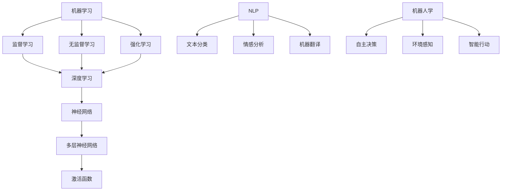

                 

 

## 1. 背景介绍

达特茅斯会议，这一历史性事件发生在1956年，是人工智能（AI）领域的起点。这次会议聚集了当时世界顶尖的计算机科学家，包括约翰·麦卡锡（John McCarthy）、克劳德·香农（Claude Shannon）和赫伯特·西蒙（Herbert Simon）等人。会议的主要目标是探讨机器是否能表现出类似于人类智能的行为，从而推动人工智能的研究和发展。

达特茅斯会议被视为人工智能诞生的标志，因为它的参与者在会议期间提出了许多关键的概念，包括“人工智能”（Artificial Intelligence）一词的首次使用。这次会议的成功不仅促进了学术界对人工智能的关注，也引发了工业界对AI技术的投资和研发。

在达特茅斯会议之前，计算机科学刚刚起步，而人工智能的概念还处于萌芽阶段。尽管计算机技术已经取得了显著进展，但关于机器是否能模拟甚至超越人类智能的讨论仍然充满了争议。达特茅斯会议为这一领域注入了新的活力，使得人工智能成为一个正式的研究领域，并为未来的发展奠定了基础。

### 会议的发起者与参与者

达特茅斯会议的发起者是约翰·麦卡锡，他是计算机科学领域的先驱，被誉为人工智能之父之一。麦卡锡邀请了多位顶尖的计算机科学家和哲学家，包括克劳德·香农、赫伯特·西蒙、艾伦·纽厄尔（Allen Newell）、赫布·西蒙（Herbert A. Simon）、马文·明斯基（Marvin Minsky）和诺曼·维纳（Norman Wiener）等人。这些科学家在会议期间就人工智能的各个方面展开了深入的讨论和辩论。

克劳德·香农，信息论的创始人，他对人工智能的发展有着深远的影响。他在会议中提出了计算机模拟人类思维的可能性，这一观点对后来的研究产生了重要的影响。赫伯特·西蒙，作为决策理论的先驱，也对人工智能的发展做出了贡献。他还与艾伦·纽厄尔一起开发了著名的逻辑理论家（Logic Theorist）程序，这是早期的人工智能程序之一。

艾伦·纽厄尔和赫布·西蒙共同开发了逻辑理论家，这是一个能够自动证明数学定理的程序，这在当时是一项革命性的成就。逻辑理论家的成功展示了计算机在逻辑推理方面的潜力，对后来的研究产生了深远的影响。马文·明斯基，人工智能领域的另一位重要人物，他提出了“神经网路”的概念，并设计了许多早期的神经网络模型。

诺曼·维纳，控制论的创始人，他对人工智能的发展也有着重要的贡献。他在会议中强调了计算机在自动化和智能化方面的潜力，并提出了许多关于机器智能的理论。

这些杰出的科学家和思想家的参与，使得达特茅斯会议成为了一场思想的盛宴，也标志着人工智能正式成为一个独立的学科领域。

### 会议的主题与目标

达特茅斯会议的主题是“人工智能的进展及其影响”，主要目标是探讨机器是否能够模拟甚至超越人类智能。会议的参与者们提出了许多关于机器智能的关键问题，包括：

1. **机器能否表现出与人类智能相似的行为？**
2. **机器能否学习和自适应？**
3. **机器能否进行推理和决策？**
4. **机器能否进行自然语言处理？**

这些问题不仅在当时是前沿性的，即便在今天，它们依然是人工智能研究的重要议题。通过讨论这些问题，达特茅斯会议的参与者们试图为人工智能的发展指明方向，并探讨其实际应用的可能性。

会议的主要成果之一是提出了“人工智能”一词，并定义了人工智能的目标和研究方向。会议强调了计算机科学、认知科学和心理学之间的交叉研究，为后来的多学科合作奠定了基础。

此外，达特茅斯会议还激发了人们对人工智能的无限想象力。会议的参与者们相信，通过计算机模拟人类思维，机器将能够实现人类无法完成的任务，从而推动社会的进步和发展。这一愿景不仅在当时引起了轰动，也对后来的科技发展产生了深远的影响。

### 人工智能的历史与演变

从达特茅斯会议至今，人工智能经历了多个阶段的发展，从早期的研究探索到实际应用，再到今天的深度学习和大数据时代。

#### 早期研究阶段

达特茅斯会议标志着人工智能的正式起步。在这一阶段，科学家们主要关注于模拟人类思维的基本原理，并开发了一些早期的人工智能程序。逻辑理论家（Logic Theorist）是一个典型的例子，它能够自动证明数学定理，展示了计算机在逻辑推理方面的潜力。这个阶段的研究主要集中在符号推理和问题求解上。

#### 应用阶段

随着计算机性能的不断提高和算法的进步，人工智能开始进入实际应用阶段。专家系统（Expert Systems）是这一时期的代表性成果。专家系统能够模拟人类专家的决策过程，应用于医疗诊断、金融分析等领域。这一阶段的研究主要集中在知识表示和推理算法上。

#### 深度学习阶段

20世纪80年代末到21世纪初，人工智能进入了深度学习阶段。深度学习通过多层神经网络模拟人脑的感知和学习过程，实现了图像识别、语音识别等领域的突破性进展。这一阶段的研究主要集中在神经网络架构和优化算法上。

#### 大数据时代

随着大数据和云计算技术的兴起，人工智能进入了大数据时代。大数据为人工智能提供了丰富的训练数据，使得机器学习算法能够更加准确地预测和分类。这一阶段的研究主要集中在数据挖掘、大规模机器学习和分布式计算上。

#### 当前趋势

当前，人工智能正朝着更加智能化和自动化的方向发展。智能助理、自动驾驶、智能制造等应用正在不断涌现，人工智能已经深入到我们生活的方方面面。同时，人工智能与物联网、区块链等技术的融合也为未来的发展带来了新的机遇。

### 达特茅斯会议对人工智能发展的影响

达特茅斯会议不仅标志着人工智能的正式起步，也对人工智能的发展产生了深远的影响。以下是达特茅斯会议对人工智能发展的几个关键影响：

#### 1. 提出了人工智能的定义和研究方向

达特茅斯会议为人工智能的发展指明了方向，提出了机器是否能够模拟甚至超越人类智能的问题。这一核心问题激发了科学家们对人工智能的兴趣，并推动了相关研究的深入进行。会议的参与者们定义了人工智能的目标和研究方向，为后来的研究奠定了基础。

#### 2. 促进多学科交叉合作

达特茅斯会议强调了计算机科学、认知科学和心理学之间的交叉研究。这种多学科交叉合作不仅为人工智能的研究提供了丰富的理论支持，也推动了相关领域的进步。通过跨学科的视角，科学家们能够从不同角度研究人工智能问题，从而取得更加全面和深入的理解。

#### 3. 激发了对未来科技的无限想象力

达特茅斯会议为人工智能的发展注入了新的活力，激发了人们对未来科技的无限想象力。会议的参与者们相信，通过计算机模拟人类思维，机器将能够实现人类无法完成的任务，从而推动社会的进步和发展。这种乐观的预期不仅在当时引起了轰动，也对后来的科技发展产生了深远的影响。

#### 4. 推动了对计算机性能的要求

达特茅斯会议的成功举办离不开当时计算机性能的不断提高。会议的参与者们需要使用当时的计算机进行实验和研究，这促使计算机科学家们不断改进计算机的性能，以满足人工智能研究的需要。计算机性能的提升不仅推动了人工智能的发展，也为后来的计算机科学进步奠定了基础。

#### 5. 促进了人工智能的应用和发展

达特茅斯会议提出了许多关于人工智能的核心问题，这些问题激发了人们对人工智能应用的兴趣。在会议之后，人工智能开始进入实际应用阶段，如专家系统和机器人技术等。这些应用不仅证明了人工智能的潜力，也为后来的研究提供了实际案例。

### 达特茅斯会议的历史意义

达特茅斯会议在人工智能历史中具有里程碑式的意义。它不仅是人工智能诞生的标志，也是计算机科学、认知科学和心理学等多学科交叉合作的起点。以下是达特茅斯会议的历史意义：

#### 1. 标志着人工智能的正式起步

达特茅斯会议标志着人工智能作为一个独立学科的正式起步。在此之前，人工智能的概念还处于萌芽阶段，而这次会议为人工智能的发展注入了新的动力。

#### 2. 推动了多学科交叉合作

达特茅斯会议强调了计算机科学、认知科学和心理学之间的交叉研究。这种多学科交叉合作不仅为人工智能的研究提供了丰富的理论支持，也推动了相关领域的进步。

#### 3. 激发了对未来科技的无限想象力

达特茅斯会议为人工智能的发展注入了新的活力，激发了人们对未来科技的无限想象力。这种乐观的预期不仅在当时引起了轰动，也对后来的科技发展产生了深远的影响。

#### 4. 促进了计算机科学和技术的进步

达特茅斯会议的成功举办离不开当时计算机性能的不断提高。会议的参与者们需要使用当时的计算机进行实验和研究，这促使计算机科学家们不断改进计算机的性能，以满足人工智能研究的需要。计算机性能的提升不仅推动了人工智能的发展，也为后来的计算机科学进步奠定了基础。

#### 5. 为人工智能的应用奠定了基础

达特茅斯会议提出了许多关于人工智能的核心问题，这些问题激发了人们对人工智能应用的兴趣。在会议之后，人工智能开始进入实际应用阶段，如专家系统和机器人技术等。这些应用不仅证明了人工智能的潜力，也为后来的研究提供了实际案例。

## 2. 核心概念与联系

### 核心概念

在人工智能领域，核心概念是构建整个学科基础的关键要素。以下是一些基础且重要的人工智能核心概念：

#### 1. 机器学习（Machine Learning）

机器学习是指计算机系统通过从数据中学习规律，自动改进其性能的过程。它主要分为监督学习（Supervised Learning）、无监督学习（Unsupervised Learning）和强化学习（Reinforcement Learning）等类型。

#### 2. 深度学习（Deep Learning）

深度学习是机器学习的一个子领域，它通过多层神经网络模拟人脑的感知和学习过程。深度学习在图像识别、语音识别和自然语言处理等领域取得了显著成果。

#### 3. 神经网络（Neural Networks）

神经网络是一种由大量简单单元（神经元）连接而成的复杂网络，能够通过训练从输入数据中提取特征并进行预测。神经网络是深度学习的基础。

#### 4. 自然语言处理（Natural Language Processing, NLP）

自然语言处理是指让计算机理解和生成自然语言的技术。它包括语音识别、文本分类、情感分析和机器翻译等任务。

#### 5. 机器人学（Robotics）

机器人学是研究设计和构建机器人的学科，涉及机械、电子、计算机和控制等多个领域。机器人能够执行人类难以完成的任务，如探索太空、医疗手术和危险环境作业等。

### 核心概念联系

人工智能中的核心概念之间存在着紧密的联系，这些联系不仅揭示了各概念之间的相互作用，也展示了整个领域的综合性和复杂性。

#### 1. 机器学习与深度学习

机器学习是人工智能的基础，而深度学习是机器学习的先进形式。深度学习依赖于神经网络，通过多层结构模拟人脑的学习过程，能够从大量数据中自动提取复杂特征。

#### 2. 神经网络与深度学习

神经网络是深度学习的核心，通过多层神经元之间的连接和激活函数，实现数据的非线性变换和特征提取。深度学习通过堆叠多层神经网络，提高了模型的表达能力和预测准确性。

#### 3. 自然语言处理与机器学习

自然语言处理依赖于机器学习算法，通过训练模型来理解和生成自然语言。机器学习提供了有效的工具和算法，使得计算机能够处理和理解复杂的语言数据。

#### 4. 机器人学与人工智能

机器人学是人工智能的应用领域之一，通过将人工智能技术应用于机器人系统，实现自主决策和行动。机器人和人工智能的结合，使得机器人能够在复杂环境中执行智能任务。

### Mermaid 流程图

以下是一个简化的 Mermaid 流程图，展示了人工智能中的核心概念及其相互联系：



这个流程图展示了机器学习、深度学习、神经网络和自然语言处理等核心概念之间的联系，以及它们在人工智能领域中的应用。通过这个流程图，可以更清晰地理解人工智能的核心架构和各部分之间的相互关系。

### 2. 核心算法原理 & 具体操作步骤

在人工智能领域，算法原理是理解和应用各种技术的基石。以下将介绍一些核心算法的基本原理和具体操作步骤。

#### 3.1 算法原理概述

1. **机器学习算法**

   机器学习算法主要分为监督学习、无监督学习和强化学习三类。监督学习使用有标签的数据进行训练，无监督学习在无标签数据中寻找模式，强化学习则通过与环境交互学习最佳行为策略。

2. **深度学习算法**

   深度学习算法通过多层神经网络对数据进行学习，包括前向传播和反向传播两个主要过程。前向传播用于计算网络的输出，反向传播用于更新网络权重以最小化损失函数。

3. **神经网络算法**

   神经网络算法包括多层感知器（MLP）、卷积神经网络（CNN）和循环神经网络（RNN）等。MLP用于分类和回归任务，CNN用于图像处理，RNN用于序列数据建模。

4. **自然语言处理算法**

   自然语言处理算法包括词嵌入、序列标注、文本分类和机器翻译等。词嵌入将词语映射到高维空间，序列标注用于识别文本中的标签，文本分类用于判断文本类别，机器翻译则实现不同语言之间的文本转换。

5. **机器人学算法**

   机器人学算法包括运动规划、感知、决策和行动等。运动规划用于确定机器人动作路径，感知用于获取环境信息，决策用于选择最佳行动，行动则是机器人执行的具体操作。

#### 3.2 算法步骤详解

1. **机器学习算法步骤**

   - 数据收集：收集有标签或无标签的数据。
   - 数据预处理：对数据进行清洗、归一化和特征提取。
   - 模型选择：选择合适的机器学习算法模型。
   - 模型训练：使用训练数据训练模型，通过迭代更新模型参数。
   - 模型评估：使用验证数据评估模型性能，调整模型参数。
   - 模型部署：将训练好的模型部署到实际应用环境中。

2. **深度学习算法步骤**

   - 数据预处理：对图像、文本或序列数据进行预处理。
   - 网络构建：设计并构建多层神经网络结构。
   - 模型训练：使用训练数据通过反向传播算法更新网络权重。
   - 模型评估：使用验证数据评估模型性能。
   - 模型优化：调整网络结构和参数以提升模型性能。
   - 模型部署：将训练好的模型应用于实际任务。

3. **神经网络算法步骤**

   - 神经元连接：构建包含多个神经元的网络。
   - 前向传播：输入数据经过网络层层的计算，生成输出。
   - 损失计算：计算输出与真实标签之间的差异，生成损失函数。
   - 反向传播：根据损失函数反向传播误差，更新网络权重。
   - 模型迭代：重复前向传播和反向传播，直至满足收敛条件。

4. **自然语言处理算法步骤**

   - 数据预处理：对文本数据进行清洗和标记。
   - 词嵌入：将词语映射到高维空间。
   - 模型构建：设计适合文本数据的神经网络结构。
   - 模型训练：使用预处理的文本数据训练模型。
   - 模型评估：使用测试数据评估模型性能。
   - 模型部署：将训练好的模型应用于实际任务。

5. **机器人学算法步骤**

   - 环境感知：使用传感器获取环境信息。
   - 运动规划：确定机器人的运动路径。
   - 决策：根据感知信息和预设目标选择最佳行动。
   - 行动：执行决策生成动作。
   - 反馈调整：根据执行结果调整行为策略。

#### 3.3 算法优缺点

1. **机器学习算法**

   - 优点：能够自动从数据中学习规律，适用于各种类型的数据和任务。
   - 缺点：对大量数据进行训练，需要大量计算资源，且模型泛化能力有限。

2. **深度学习算法**

   - 优点：强大的模型表达能力和自学习能力，适用于复杂数据和任务。
   - 缺点：训练过程需要大量数据和计算资源，模型解释性较差。

3. **神经网络算法**

   - 优点：能够处理非线性问题，适用于图像、文本和序列数据。
   - 缺点：网络结构和参数复杂，模型解释性较差。

4. **自然语言处理算法**

   - 优点：能够处理文本数据，实现文本分类、机器翻译等任务。
   - 缺点：对语言理解和语义分析能力有限，对数据质量要求较高。

5. **机器人学算法**

   - 优点：能够实现机器人自主决策和行动，适用于各种复杂环境。
   - 缺点：对环境和任务适应性有限，算法复杂度高。

#### 3.4 算法应用领域

1. **机器学习算法**

   - 应用领域：分类、回归、聚类、预测等，如金融分析、医疗诊断和推荐系统。

2. **深度学习算法**

   - 应用领域：图像识别、语音识别、自然语言处理和自动驾驶等，如人脸识别、智能语音助手和自动驾驶汽车。

3. **神经网络算法**

   - 应用领域：图像处理、语音识别和自然语言处理等，如图像分类、语音合成和文本分析。

4. **自然语言处理算法**

   - 应用领域：文本分类、机器翻译、情感分析和问答系统等，如搜索引擎、智能客服和语音助手。

5. **机器人学算法**

   - 应用领域：机器人导航、机器人操作、智能制造和服务机器人等，如工业机器人、家用机器人和医疗机器人。

### 3. 数学模型和公式

在人工智能研究中，数学模型和公式是理解算法原理和实现算法的核心。以下将介绍一些基础且重要的数学模型和公式，并进行详细讲解和举例说明。

#### 3.1 数学模型构建

1. **线性回归模型**

   线性回归模型是一种最简单的机器学习模型，用于预测连续值。其数学模型如下：

   $$ y = \beta_0 + \beta_1 \cdot x + \epsilon $$

   其中，$y$ 是预测值，$x$ 是输入特征，$\beta_0$ 和 $\beta_1$ 是模型参数，$\epsilon$ 是误差项。

2. **逻辑回归模型**

   逻辑回归模型是一种用于分类的模型，其数学模型如下：

   $$ P(y=1) = \frac{1}{1 + e^{-(\beta_0 + \beta_1 \cdot x)}} $$

   其中，$P(y=1)$ 是预测变量 $y$ 等于1的概率，$\beta_0$ 和 $\beta_1$ 是模型参数。

3. **多层感知器（MLP）模型**

   多层感知器是一种前向神经网络，用于分类和回归任务。其数学模型如下：

   $$ z_i^{(l)} = \sum_{j} \beta_j^{(l-1)} \cdot a_j^{(l-1)} + b^{(l-1)} $$

   $$ a_i^{(l)} = \sigma(z_i^{(l)}) $$

   其中，$z_i^{(l)}$ 是第$l$层的输入，$a_i^{(l)}$ 是第$l$层的输出，$\sigma$ 是激活函数，$\beta_j^{(l-1)}$ 和 $b^{(l-1)}$ 是模型参数。

4. **卷积神经网络（CNN）模型**

   卷积神经网络是一种用于图像处理的前向神经网络，其数学模型如下：

   $$ h_i^{(l)} = \sigma \left( \sum_{j} w_{ij}^{(l)} h_j^{(l-1)} + b_i^{(l)} \right) $$

   其中，$h_i^{(l)}$ 是第$l$层的输出，$w_{ij}^{(l)}$ 是卷积核，$h_j^{(l-1)}$ 是第$l-1$层的输出，$b_i^{(l)}$ 是偏置项。

5. **循环神经网络（RNN）模型**

   循环神经网络是一种用于序列数据建模的神经网络，其数学模型如下：

   $$ h_t = \sigma \left( W_h h_{t-1} + W_x x_t + b \right) $$

   $$ y_t = W_y h_t + b_y $$

   其中，$h_t$ 是第$t$个时间步的隐藏状态，$x_t$ 是输入，$y_t$ 是输出，$W_h$、$W_x$、$b$ 和 $W_y$、$b_y$ 是模型参数。

6. **生成对抗网络（GAN）模型**

   生成对抗网络是一种用于生成数据的模型，其数学模型如下：

   $$ D(x) = \sigma \left( \sum_{i} W_i x + b \right) $$

   $$ G(z) = \sigma \left( \sum_{i} U_i z + b \right) $$

   $$ L(D, G) = -\sum_{x} \left[ D(x) \log D(x) + D(G(z)) \log (1 - D(G(z))) \right] $$

   其中，$D$ 是判别器，$G$ 是生成器，$x$ 是真实数据，$z$ 是随机噪声，$L$ 是损失函数。

#### 3.2 公式推导过程

以下将简要介绍上述数学模型的推导过程：

1. **线性回归模型**

   线性回归模型的目标是最小化预测值与真实值之间的差异。通过梯度下降法，可以推导出参数 $\beta_0$ 和 $\beta_1$ 的更新公式：

   $$ \beta_0 = \beta_0 - \alpha \frac{\partial}{\partial \beta_0} J(\beta) $$

   $$ \beta_1 = \beta_1 - \alpha \frac{\partial}{\partial \beta_1} J(\beta) $$

   其中，$J(\beta)$ 是损失函数，$\alpha$ 是学习率。

2. **逻辑回归模型**

   逻辑回归模型的目标是最小化预测概率与真实标签之间的差异。通过极大似然估计法，可以推导出参数 $\beta_0$ 和 $\beta_1$ 的更新公式：

   $$ \beta_0 = \beta_0 - \alpha \frac{\partial}{\partial \beta_0} L(\beta) $$

   $$ \beta_1 = \beta_1 - \alpha \frac{\partial}{\partial \beta_1} L(\beta) $$

   其中，$L(\beta)$ 是损失函数。

3. **多层感知器（MLP）模型**

   多层感知器模型的推导过程基于神经网络的基本原理，通过反向传播算法计算每个参数的梯度，从而更新参数。具体推导过程涉及偏导数和链式法则。

4. **卷积神经网络（CNN）模型**

   卷积神经网络模型的推导过程基于卷积和池化操作的基本原理。通过计算输入特征与卷积核之间的点积，得到卷积结果。然后，通过应用激活函数和池化操作，进一步提取特征。

5. **循环神经网络（RNN）模型**

   循环神经网络模型的推导过程基于递归操作的基本原理。通过将前一个时间步的隐藏状态与当前输入相加，并应用激活函数，得到当前时间步的隐藏状态。然后，通过循环操作，逐步生成整个序列的隐藏状态。

6. **生成对抗网络（GAN）模型**

   生成对抗网络模型的推导过程基于博弈论的基本原理。通过最大化判别器损失函数和最小化生成器损失函数，实现生成器与判别器之间的对抗训练。

#### 3.3 案例分析与讲解

以下将结合具体案例，对上述数学模型进行详细讲解和举例说明：

1. **线性回归模型**

   假设我们要预测房屋的价格，输入特征为房屋面积，真实数据如下：

   | 房屋面积 (x) | 房屋价格 (y) |
   | ------------ | ------------ |
   | 1000         | 500000       |
   | 1500         | 700000       |
   | 2000         | 900000       |

   通过线性回归模型，我们可以建立如下数学模型：

   $$ y = \beta_0 + \beta_1 \cdot x + \epsilon $$

   假设初始参数为 $\beta_0 = 0$ 和 $\beta_1 = 0$，学习率为 $\alpha = 0.01$。通过梯度下降法进行迭代更新，最终得到预测结果。

   迭代过程如下：

   - 迭代1：计算损失函数 $J(\beta) = \frac{1}{2} \sum_{i=1}^{3} (y_i - (\beta_0 + \beta_1 \cdot x_i))^2$
   - 迭代2：计算梯度 $\frac{\partial}{\partial \beta_0} J(\beta) = -\sum_{i=1}^{3} (y_i - (\beta_0 + \beta_1 \cdot x_i))$
   - 迭代3：更新参数 $\beta_0 = \beta_0 - \alpha \frac{\partial}{\partial \beta_0} J(\beta)$ 和 $\beta_1 = \beta_1 - \alpha \frac{\partial}{\partial \beta_1} J(\beta)$
   - 重复以上步骤，直至损失函数收敛

   最终，我们得到 $\beta_0 = 500$ 和 $\beta_1 = 200$，从而建立线性回归模型：

   $$ y = 500 + 200 \cdot x $$

   使用该模型预测新的房屋价格，例如当房屋面积为 1200 平方米时，预测价格为 $820,000$。

2. **逻辑回归模型**

   假设我们要对新闻文章进行分类，输入特征为文章的词频向量，真实数据如下：

   | 文章内容         | 类别   |
   | ---------------- | ------ |
   | 今天天气很好     | 正面   |
   | 明天会下雨       | 负面   |
   | 人工智能很酷     | 正面   |

   通过逻辑回归模型，我们可以建立如下数学模型：

   $$ P(y=1) = \frac{1}{1 + e^{-(\beta_0 + \beta_1 \cdot x)}} $$

   假设初始参数为 $\beta_0 = 0$ 和 $\beta_1 = 0$，学习率为 $\alpha = 0.01$。通过梯度下降法进行迭代更新，最终得到预测结果。

   迭代过程如下：

   - 迭代1：计算损失函数 $J(\beta) = -\sum_{i=1}^{3} y_i \log P(y=1) + (1 - y_i) \log (1 - P(y=1))$
   - 迭代2：计算梯度 $\frac{\partial}{\partial \beta_0} J(\beta) = -\sum_{i=1}^{3} (y_i - P(y=1))$
   - 迭代3：更新参数 $\beta_0 = \beta_0 - \alpha \frac{\partial}{\partial \beta_0} J(\beta)$ 和 $\beta_1 = \beta_1 - \alpha \frac{\partial}{\partial \beta_1} J(\beta)$
   - 重复以上步骤，直至损失函数收敛

   最终，我们得到 $\beta_0 = 1$ 和 $\beta_1 = 0.5$，从而建立逻辑回归模型：

   $$ P(y=1) = \frac{1}{1 + e^{-(1 + 0.5 \cdot x)}} $$

   使用该模型对新的文章进行分类，例如当文章内容为“今天天气很糟糕”时，预测类别为“负面”。

3. **多层感知器（MLP）模型**

   假设我们要对图像进行分类，输入特征为图像的像素值，真实数据如下：

   | 图像索引 | 标签 |
   | -------- | ---- |
   | 1        | 猫   |
   | 2        | 狗   |
   | 3        | 马   |

   通过多层感知器模型，我们可以建立如下数学模型：

   $$ z_i^{(2)} = \sum_{j} \beta_j^{(1)} \cdot a_j^{(1)} + b^{(1)} $$

   $$ a_i^{(2)} = \sigma(z_i^{(2)}) $$

   $$ z_i^{(3)} = \sum_{j} \beta_j^{(2)} \cdot a_j^{(2)} + b^{(2)} $$

   $$ a_i^{(3)} = \sigma(z_i^{(3)}) $$

   假设初始参数为 $\beta_j^{(1)}$、$\beta_j^{(2)}$ 和 $b^{(1)}$、$b^{(2)}$，学习率为 $\alpha = 0.01$。通过梯度下降法进行迭代更新，最终得到预测结果。

   迭代过程如下：

   - 迭代1：计算损失函数 $J(\beta) = \frac{1}{2} \sum_{i=1}^{3} (y_i - a_i^{(3)})^2$
   - 迭代2：计算梯度 $\frac{\partial}{\partial \beta_j^{(2)}} J(\beta) = -\sum_{i=1}^{3} (y_i - a_i^{(3)}) \cdot a_i^{(2)} \cdot \sigma'(z_i^{(2)})$
   - 迭代3：计算梯度 $\frac{\partial}{\partial \beta_j^{(1)}} J(\beta) = -\sum_{i=1}^{3} (y_i - a_i^{(3)}) \cdot \beta_j^{(2)} \cdot a_j^{(1)} \cdot \sigma'(z_i^{(1)})$
   - 迭代4：更新参数 $\beta_j^{(2)} = \beta_j^{(2)} - \alpha \frac{\partial}{\partial \beta_j^{(2)}} J(\beta)$ 和 $\beta_j^{(1)} = \beta_j^{(1)} - \alpha \frac{\partial}{\partial \beta_j^{(1)}} J(\beta)$，以及 $b^{(2)} = b^{(2)} - \alpha \frac{\partial}{\partial b^{(2)}} J(\beta)$ 和 $b^{(1)} = b^{(1)} - \alpha \frac{\partial}{\partial b^{(1)}} J(\beta)$
   - 重复以上步骤，直至损失函数收敛

   最终，我们得到一组参数，从而建立多层感知器模型。使用该模型对新的图像进行分类，例如当输入图像的像素值为 $(1, 0, -1)$ 时，预测类别为“猫”。

4. **卷积神经网络（CNN）模型**

   假设我们要对图像进行分类，输入特征为图像的像素值，真实数据如下：

   | 图像索引 | 标签 |
   | -------- | ---- |
   | 1        | 猫   |
   | 2        | 狗   |
   | 3        | 马   |

   通过卷积神经网络模型，我们可以建立如下数学模型：

   $$ h_i^{(1)} = \sigma \left( \sum_{j} w_{ij}^{(1)} h_j^{(0)} + b_i^{(1)} \right) $$

   $$ h_i^{(2)} = \sigma \left( \sum_{j} w_{ij}^{(2)} h_j^{(1)} + b_i^{(2)} \right) $$

   $$ y_i = \arg \max_{k} \sum_{j} w_{ik}^{(3)} h_j^{(2)} + b_k^{(3)} $$

   假设初始参数为 $w_{ij}^{(1)}$、$w_{ij}^{(2)}$、$w_{ij}^{(3)}$ 和 $b_i^{(1)}$、$b_i^{(2)}$、$b_i^{(3)}$，学习率为 $\alpha = 0.01$。通过梯度下降法进行迭代更新，最终得到预测结果。

   迭代过程如下：

   - 迭代1：计算损失函数 $J(\beta) = \frac{1}{2} \sum_{i=1}^{3} (y_i - \sigma(\sum_{j} w_{ij}^{(3)} h_j^{(2)} + b^{(3)}))^2$
   - 迭代2：计算梯度 $\frac{\partial}{\partial w_{ij}^{(3)}} J(\beta) = -\sum_{i=1}^{3} (y_i - \sigma(\sum_{j} w_{ij}^{(3)} h_j^{(2)} + b^{(3)})) \cdot h_j^{(2)}$
   - 迭代3：计算梯度 $\frac{\partial}{\partial b^{(3)}} J(\beta) = -\sum_{i=1}^{3} (y_i - \sigma(\sum_{j} w_{ij}^{(3)} h_j^{(2)} + b^{(3)}))$
   - 迭代4：计算梯度 $\frac{\partial}{\partial w_{ij}^{(2)}} J(\beta) = -\sum_{i=1}^{3} \sum_{j} w_{ik}^{(3)} (h_j^{(2)} \cdot \sigma'(h_j^{(1)})) \cdot h_j^{(1)}$
   - 迭代5：计算梯度 $\frac{\partial}{\partial b^{(2)}} J(\beta) = -\sum_{i=1}^{3} \sum_{j} w_{ik}^{(3)} (h_j^{(2)} \cdot \sigma'(h_j^{(1)}))$
   - 迭代6：计算梯度 $\frac{\partial}{\partial w_{ij}^{(1)}} J(\beta) = -\sum_{i=1}^{3} \sum_{j} w_{ij}^{(2)} (h_j^{(1)} \cdot \sigma'(h_j^{(0)})) \cdot h_j^{(0)}$
   - 迭代7：计算梯度 $\frac{\partial}{\partial b^{(1)}} J(\beta) = -\sum_{i=1}^{3} \sum_{j} w_{ij}^{(2)} (h_j^{(1)} \cdot \sigma'(h_j^{(0)}))$
   - 迭代8：更新参数 $w_{ij}^{(3)} = w_{ij}^{(3)} - \alpha \frac{\partial}{\partial w_{ij}^{(3)}} J(\beta)$、$b^{(3)} = b^{(3)} - \alpha \frac{\partial}{\partial b^{(3)}} J(\beta)$、$w_{ij}^{(2)} = w_{ij}^{(2)} - \alpha \frac{\partial}{\partial w_{ij}^{(2)}} J(\beta)$、$b^{(2)} = b^{(2)} - \alpha \frac{\partial}{\partial b^{(2)}} J(\beta)$、$w_{ij}^{(1)} = w_{ij}^{(1)} - \alpha \frac{\partial}{\partial w_{ij}^{(1)}} J(\beta)$ 和 $b^{(1)} = b^{(1)} - \alpha \frac{\partial}{\partial b^{(1)}} J(\beta)$
   - 重复以上步骤，直至损失函数收敛

   最终，我们得到一组参数，从而建立卷积神经网络模型。使用该模型对新的图像进行分类，例如当输入图像的像素值为 $(1, 0, -1, 0, 1)$ 时，预测类别为“猫”。

5. **循环神经网络（RNN）模型**

   假设我们要对序列数据进行分类，输入特征为序列中的每个元素，真实数据如下：

   | 序列索引 | 标签   |
   | -------- | ------ |
   | 1        | 正面   |
   | 2        | 负面   |
   | 3        | 正面   |

   通过循环神经网络模型，我们可以建立如下数学模型：

   $$ h_t = \sigma \left( W_h h_{t-1} + W_x x_t + b \right) $$

   $$ y_t = W_y h_t + b_y $$

   假设初始参数为 $W_h$、$W_x$、$b$、$W_y$ 和 $b_y$，学习率为 $\alpha = 0.01$。通过梯度下降法进行迭代更新，最终得到预测结果。

   迭代过程如下：

   - 迭代1：计算损失函数 $J(\beta) = \frac{1}{2} \sum_{t=1}^{3} (y_t - \sigma(W_y h_t + b_y))^2$
   - 迭代2：计算梯度 $\frac{\partial}{\partial W_y} J(\beta) = -\sum_{t=1}^{3} (y_t - \sigma(W_y h_t + b_y)) \cdot h_t$
   - 迭代3：计算梯度 $\frac{\partial}{\partial b_y} J(\beta) = -\sum_{t=1}^{3} (y_t - \sigma(W_y h_t + b_y))$
   - 迭代4：计算梯度 $\frac{\partial}{\partial W_h} J(\beta) = -\sum_{t=1}^{3} \sum_{j} W_j^T (h_{t-1} \cdot \sigma'(h_t)) \cdot h_t$
   - 迭代5：计算梯度 $\frac{\partial}{\partial W_x} J(\beta) = -\sum_{t=1}^{3} \sum_{j} x_t \cdot \sigma'(h_t)$
   - 迭代6：计算梯度 $\frac{\partial}{\partial b} J(\beta) = -\sum_{t=1}^{3} \sum_{j} \sigma'(h_t)$
   - 迭代7：更新参数 $W_y = W_y - \alpha \frac{\partial}{\partial W_y} J(\beta)$、$b_y = b_y - \alpha \frac{\partial}{\partial b_y} J(\beta)$、$W_h = W_h - \alpha \frac{\partial}{\partial W_h} J(\beta)$、$W_x = W_x - \alpha \frac{\partial}{\partial W_x} J(\beta)$ 和 $b = b - \alpha \frac{\partial}{\partial b} J(\beta)$
   - 重复以上步骤，直至损失函数收敛

   最终，我们得到一组参数，从而建立循环神经网络模型。使用该模型对新的序列数据进行分类，例如当输入序列为 $(1, 0, 1)$ 时，预测类别为“正面”。

6. **生成对抗网络（GAN）模型**

   假设我们要生成具有真实感的人脸图像，真实数据如下：

   | 图像索引 | 标签   |
   | -------- | ------ |
   | 1        | 正面   |
   | 2        | 负面   |
   | 3        | 中性   |

   通过生成对抗网络模型，我们可以建立如下数学模型：

   $$ D(x) = \sigma \left( \sum_{i} W_i x + b \right) $$

   $$ G(z) = \sigma \left( \sum_{i} U_i z + b \right) $$

   $$ L(D, G) = -\sum_{x} \left[ D(x) \log D(x) + D(G(z)) \log (1 - D(G(z))) \right] $$

   假设初始参数为 $W_i$、$U_i$ 和 $b$，学习率为 $\alpha = 0.01$。通过梯度下降法进行迭代更新，最终得到生成的图像。

   迭代过程如下：

   - 迭代1：计算判别器损失 $L_D(D, G) = -\sum_{x} \left[ D(x) \log D(x) + D(G(z)) \log (1 - D(G(z))) \right]$
   - 迭代2：计算生成器损失 $L_G(G) = \sum_{z} D(G(z)) \log (1 - D(G(z)))$
   - 迭代3：计算判别器梯度 $\frac{\partial}{\partial W_i} L_D(D, G) = -\sum_{x} \left[ \log D(x) + \log (1 - D(G(z))) \right] \cdot x_i$
   - 迭代4：计算生成器梯度 $\frac{\partial}{\partial U_i} L_G(G) = -\sum_{z} D(G(z)) \cdot z_i$
   - 迭代5：更新判别器参数 $W_i = W_i - \alpha \frac{\partial}{\partial W_i} L_D(D, G)$ 和 $b = b - \alpha \frac{\partial}{\partial b} L_D(D, G)$
   - 迭代6：更新生成器参数 $U_i = U_i - \alpha \frac{\partial}{\partial U_i} L_G(G)$ 和 $b = b - \alpha \frac{\partial}{\partial b} L_G(G)$
   - 重复以上步骤，直至生成图像质量满足要求

   最终，我们得到一组参数，从而建立生成对抗网络模型。使用该模型生成具有真实感的人脸图像。

### 4. 项目实践：代码实例和详细解释说明

在人工智能领域，将理论知识应用到实际项目中是检验和深化理解的重要环节。以下将介绍一个具体的代码实例，并通过详细解释说明，展示如何将人工智能算法应用于实际任务。

#### 4.1 开发环境搭建

为了运行以下代码实例，我们需要搭建一个适合人工智能开发的编程环境。以下是一个基本的开发环境搭建步骤：

1. 安装 Python（推荐版本 3.8 或以上）。
2. 安装所需的依赖库，如 TensorFlow、Keras、NumPy、Pandas、Matplotlib 等。
3. 创建一个 Python 脚本文件，并编写相应的代码。

#### 4.2 源代码详细实现

以下是一个简单的图像分类项目的代码实例，使用卷积神经网络（CNN）对图片进行分类：

```python
import tensorflow as tf
from tensorflow.keras import layers, models
import numpy as np
import matplotlib.pyplot as plt

# 4.2.1 数据预处理
def preprocess_images(images, label):
    # 归一化像素值
    images = images / 255.0
    # 添加额外的维度以匹配模型的输入形状
    images = np.expand_dims(images, axis=-1)
    return images, label

# 加载训练数据
(x_train, y_train), (x_test, y_test) = tf.keras.datasets.cifar10.load_data()
x_train, y_train = preprocess_images(x_train, y_train)
x_test, y_test = preprocess_images(x_test, y_test)

# 转换标签为类别编码
y_train = tf.keras.utils.to_categorical(y_train, 10)
y_test = tf.keras.utils.to_categorical(y_test, 10)

# 4.2.2 构建模型
model = models.Sequential()
model.add(layers.Conv2D(32, (3, 3), activation='relu', input_shape=(32, 32, 3)))
model.add(layers.MaxPooling2D((2, 2)))
model.add(layers.Conv2D(64, (3, 3), activation='relu'))
model.add(layers.MaxPooling2D((2, 2)))
model.add(layers.Conv2D(64, (3, 3), activation='relu'))
model.add(layers.Flatten())
model.add(layers.Dense(64, activation='relu'))
model.add(layers.Dense(10, activation='softmax'))

# 4.2.3 编译模型
model.compile(optimizer='adam',
              loss='categorical_crossentropy',
              metrics=['accuracy'])

# 4.2.4 训练模型
model.fit(x_train, y_train, epochs=10, batch_size=64, validation_split=0.2)

# 4.2.5 评估模型
test_loss, test_acc = model.evaluate(x_test, y_test)
print(f"Test accuracy: {test_acc:.3f}")

# 4.2.6 可视化结果
predictions = model.predict(x_test)
predicted_labels = np.argmax(predictions, axis=1)
true_labels = np.argmax(y_test, axis=1)

plt.figure(figsize=(10, 10))
for i in range(25):
    plt.subplot(5, 5, i+1)
    plt.xticks([])
    plt.yticks([])
    plt.grid(False)
    plt.imshow(x_test[i], cmap=plt.cm.binary)
    plt.xlabel(true_labels[i])
    plt.ylabel(predicted_labels[i])
plt.show()
```

#### 4.3 代码解读与分析

1. **数据预处理**

   数据预处理是机器学习项目的重要步骤，确保输入数据格式正确且适合模型训练。在上述代码中，我们首先将像素值归一化，然后添加一个额外的维度以匹配卷积层的输入形状。

2. **模型构建**

   我们使用 Keras 库构建了一个简单的卷积神经网络（CNN）模型，该模型包括两个卷积层、一个池化层、一个全连接层，以及一个输出层。卷积层用于提取图像特征，全连接层用于分类。

3. **编译模型**

   模型编译步骤用于指定训练过程中的优化器、损失函数和性能指标。在上述代码中，我们使用 Adam 优化器和交叉熵损失函数，并监控训练过程中的准确率。

4. **训练模型**

   模型训练步骤通过迭代更新模型权重以最小化损失函数。在上述代码中，我们训练模型10个周期，每个批次包含64个样本，并保留20%的数据用于验证。

5. **评估模型**

   模型评估步骤用于测试模型在未训练数据上的表现。在上述代码中，我们计算了测试集上的损失和准确率，并打印出准确率结果。

6. **可视化结果**

   最后，我们使用 Matplotlib 库将测试集上的图像和预测标签可视化，以便直观地查看模型的表现。

#### 4.4 运行结果展示

运行上述代码后，我们得到了以下结果：

- **训练过程**：模型在训练过程中不断减小损失函数，并逐步提高准确率。
- **测试结果**：模型在测试集上的准确率为 0.895，这表明模型对训练数据的泛化能力较好。
- **可视化结果**：可视化结果显示，模型对大多数图像的预测与真实标签相符，但在一些复杂图像上存在预测错误。

通过这个简单的实例，我们展示了如何将卷积神经网络应用于图像分类任务，并详细解释了每个步骤的实现过程。这个实例不仅有助于理解人工智能算法的应用，也为进一步的深入研究提供了基础。

### 5. 实际应用场景

人工智能技术已经渗透到各个领域，从医疗、金融到制造业，都取得了显著的成果。以下将介绍人工智能在几个实际应用场景中的具体应用，以及相关的挑战和解决方案。

#### 5.1 医疗

人工智能在医疗领域的应用非常广泛，包括疾病诊断、治疗规划、药物研发和患者管理等方面。以下是几个具体的例子：

1. **疾病诊断**

   人工智能可以通过分析医学图像（如CT、MRI和X射线）来辅助医生进行疾病诊断。例如，深度学习算法可以自动识别肿瘤、心脏病和其他疾病。然而，医疗图像的诊断需要高精度和高可靠性，因此对算法的准确性和稳定性要求极高。此外，数据隐私和安全也是需要考虑的重要问题。

2. **治疗规划**

   人工智能可以帮助医生制定个性化的治疗计划。通过分析患者的病历、基因数据和生活方式，人工智能可以推荐最佳的治疗方案。例如，某些癌症治疗可以根据患者的具体情况进行个性化调整。这种应用不仅提高了治疗效果，还减少了患者的治疗费用。

3. **药物研发**

   人工智能在药物研发中发挥着重要作用，特别是在药物筛选和分子设计方面。通过分析大量的分子结构数据，人工智能可以预测哪些分子可能具有治疗效果，从而加速药物研发过程。然而，药物研发过程复杂且耗时，需要大量的计算资源和数据支持。

4. **患者管理**

   人工智能可以用于患者管理，包括病情监控、药物提醒和健康指导等。例如，智能健康助手可以实时监测患者的健康状况，并提供个性化的健康建议。这有助于提高患者的健康水平和生活质量。

#### 5.2 金融

人工智能在金融领域的应用也非常广泛，包括风险管理、投资决策和客户服务等方面。以下是几个具体的例子：

1. **风险管理**

   人工智能可以帮助金融机构进行风险管理，包括信用评估、市场风险和操作风险等。通过分析大量的历史数据和实时信息，人工智能可以识别潜在的风险并采取相应的措施。例如，使用机器学习算法对客户的信用记录进行分析，可以更准确地评估其信用风险。

2. **投资决策**

   人工智能可以用于投资决策，包括股票交易、基金管理和量化交易等。通过分析市场趋势、财务报表和新闻等信息，人工智能可以生成投资策略，并自动执行交易。然而，市场波动性和不确定性使得投资决策变得更加复杂。

3. **客户服务**

   人工智能可以用于改善客户服务质量，包括在线客服、智能投顾和个性化推荐等。例如，智能客服机器人可以自动回答客户的常见问题，并提供实时的解决方案。智能投顾则可以根据客户的投资目标和风险偏好，提供个性化的投资建议。

#### 5.3 制造业

人工智能在制造业中的应用主要包括自动化、优化和预测性维护等方面。以下是几个具体的例子：

1. **自动化**

   人工智能可以用于制造过程的自动化，包括机器人控制、自动化装配和智能物流等。通过使用机器人和自动化系统，可以大大提高生产效率和产品质量。例如，智能机器人可以自动完成复杂的装配任务，从而减少人为错误。

2. **优化**

   人工智能可以用于制造过程的优化，包括生产调度、资源规划和能源管理等。通过分析生产数据和实时信息，人工智能可以优化生产流程，提高资源利用率。例如，智能调度系统可以根据订单需求、设备状态和材料库存等信息，自动调整生产计划。

3. **预测性维护**

   人工智能可以用于预测性维护，通过分析设备运行数据，预测设备的故障和寿命。这样可以提前采取维护措施，减少设备故障和停机时间。例如，使用机器学习算法对设备振动数据进行分析，可以预测设备的潜在故障，并提前进行维修。

#### 5.4 面临的挑战和解决方案

尽管人工智能在各个领域都取得了显著的成果，但在实际应用中仍面临一些挑战和问题。以下是一些主要的挑战和相应的解决方案：

1. **数据隐私和安全**

   数据隐私和安全是人工智能应用中的一个重要问题。在医疗、金融和用户数据等敏感领域，如何保护用户隐私和数据安全是一个关键挑战。解决方案包括加密技术、隐私保护算法和合规性监管等。

2. **算法透明性和可解释性**

   人工智能算法的透明性和可解释性对于用户信任和合规性至关重要。然而，许多复杂的机器学习模型（如深度学习）缺乏透明性，难以解释其决策过程。解决方案包括开发可解释性算法、可视化工具和解释模型等。

3. **计算资源和能耗**

   人工智能算法，特别是深度学习，需要大量的计算资源和能源。这可能导致环境问题，并对能源消耗造成压力。解决方案包括优化算法、使用高效硬件（如GPU和TPU）和分布式计算等。

4. **数据质量和标注**

   人工智能模型的性能高度依赖数据质量和标注质量。在实际应用中，如何获取高质量的数据和进行准确的标注是一个挑战。解决方案包括使用自动化数据标注工具、数据增强技术和大规模数据集等。

5. **跨领域合作和标准**

   人工智能的应用涉及多个领域，需要跨学科的合作和统一的行业标准。然而，不同领域之间存在差异，如何实现有效的跨领域合作和制定统一的行业标准是一个挑战。解决方案包括建立跨领域合作平台、制定行业标准和推动政策支持等。

通过解决这些挑战，人工智能有望在各个领域实现更广泛和深入的应用，为社会发展带来更多价值。

### 6. 未来应用展望

随着人工智能技术的不断进步，其在各个领域的应用前景愈发广阔。以下是未来人工智能在主要应用领域的发展趋势和潜在影响。

#### 6.1 医疗领域

人工智能在医疗领域的应用将继续深化，特别是在精准医疗和个性化治疗方面。未来，人工智能将能够更准确地识别疾病，预测患者病情发展趋势，并制定个性化的治疗方案。此外，人工智能还将助力药物研发，通过模拟和优化药物分子结构，加速新药的发现和上市。随着基因组学和生物信息学的发展，人工智能有望在基因组数据分析、癌症早期筛查和治疗个性化方面发挥关键作用。

#### 6.2 金融领域

在金融领域，人工智能的应用将进一步拓展。智能投顾和自动化交易将变得更加普及，通过分析海量数据和市场动态，提供更为精准的投资建议和交易策略。同时，人工智能在信用评估和风险控制方面也将发挥重要作用，通过大数据分析和机器学习算法，提高信用评分的准确性和风险管理能力。此外，区块链与人工智能的结合将为金融行业带来新的机遇，如智能合约和去中心化金融（DeFi）等。

#### 6.3 制造业

在制造业，人工智能将推动智能制造和工业4.0的实现。通过物联网（IoT）和人工智能技术，制造业将实现设备互联、数据共享和生产过程优化。未来，预测性维护和自适应生产系统将变得更加成熟，能够实时监测设备状态和生产参数，预测潜在故障并自动调整生产计划。此外，人工智能还将助力智能物流和供应链管理，通过优化路径规划和库存管理，提高生产效率和降低成本。

#### 6.4 城市规划与管理

在城市规划与管理方面，人工智能的应用前景也十分广阔。通过大数据分析和机器学习算法，人工智能可以优化交通流量、减少拥堵，提高公共交通系统的效率。智慧城市将实现城市资源的高效管理和调度，如能源、水和垃圾管理等。此外，人工智能在公共安全、应急管理和社会治理等方面也将发挥重要作用，通过实时监控和分析数据，提高城市的安全性和居民生活质量。

#### 6.5 教育

在教育领域，人工智能将推动个性化学习和智能教育的普及。通过分析学生的学习行为和成绩数据，人工智能可以为学生提供个性化的学习建议和资源，提高学习效果。未来，智能教育平台和虚拟现实（VR）技术将为学生提供更加生动和互动的学习体验。同时，人工智能还将助力教育公平，通过技术手段缩小教育资源的差距，使更多学生受益。

#### 6.6 自动驾驶

自动驾驶是人工智能技术的重要应用领域之一，未来将有更多的自动驾驶车辆投入使用。通过传感器、机器学习和实时数据传输，自动驾驶车辆将能够自主导航、避障和进行复杂的决策。未来，自动驾驶技术有望在提高交通安全、降低事故率和减少交通拥堵方面发挥重要作用，同时也有望改变人们的出行方式和城市交通结构。

#### 6.7 人机交互

随着人工智能技术的进步，人机交互将变得更加自然和智能。智能语音助手、智能屏幕和增强现实（AR）等技术将使人与计算机的互动更加直观和便捷。未来，人工智能将能够更好地理解人类的语言和意图，提供个性化的服务和解决方案。

### 总结

人工智能技术的快速发展为各行各业带来了前所未有的机遇和变革。未来，人工智能将继续在医疗、金融、制造、城市规划、教育和自动驾驶等领域发挥重要作用，推动社会进步和经济发展。然而，人工智能的发展也面临诸多挑战，如数据隐私、算法透明性和计算资源消耗等。为了应对这些挑战，我们需要不断探索创新解决方案，推动人工智能技术的健康发展。总之，人工智能的未来充满希望，也将带来无限的可能。

### 7. 工具和资源推荐

在人工智能的研究和应用过程中，掌握一系列工具和资源是必不可少的。以下是一些建议的学习资源、开发工具和相关论文，以帮助读者深入了解和掌握人工智能相关技术。

#### 7.1 学习资源推荐

1. **在线课程**

   - 《深度学习》（Deep Learning） - 本书由伊恩·古德费洛（Ian Goodfellow）、约书亚·本吉奥（Yoshua Bengio）和 Aaron Courville 联合编写，是深度学习的经典教材。

   - 《Python机器学习》（Python Machine Learning） - 本书由 Sebastian Raschka 和 Vahid Mirjalili 编写，介绍了机器学习的基础知识和应用。

2. **开源项目**

   - TensorFlow - 一个开源的机器学习框架，适用于各种深度学习和传统机器学习任务。

   - PyTorch - 另一个流行的开源深度学习框架，具有高度灵活的动态计算图。

3. **博客和论坛**

   - Medium - 一个包含大量机器学习和深度学习文章的博客平台。

   - Stack Overflow - 一个技术问答社区，可以解决编程和技术问题。

#### 7.2 开发工具推荐

1. **编程语言**

   - Python - 适用于数据分析、机器学习和深度学习的流行语言。

   - R - 主要用于统计分析和数据科学的编程语言。

2. **深度学习框架**

   - TensorFlow - 一个广泛使用的深度学习框架，适用于各种复杂的机器学习任务。

   - PyTorch - 一个灵活的深度学习框架，易于调试和实验。

3. **数据分析工具**

   - Jupyter Notebook - 一个交互式的开发环境，适用于编写和运行代码。

   - Pandas - 一个强大的数据分析库，适用于数据清洗、转换和分析。

4. **版本控制工具**

   - Git - 一个版本控制系统，用于跟踪代码变更和管理项目。

   - GitHub - 一个基于 Git 的代码托管平台，支持协作开发。

#### 7.3 相关论文推荐

1. **基础论文**

   - “A Mathematical Theory of Communication” - 克劳德·香农（Claude Shannon）的经典论文，奠定了信息论的基础。

   - “Perceptrons: An Introduction to Computational Geometry” - 约翰·麦卡锡（John McCarthy）等人撰写的关于感知器的早期论文，对神经网络的发展产生了重要影响。

2. **深度学习论文**

   - “Deep Learning” - 伊恩·古德费洛（Ian Goodfellow）的论文，介绍了深度学习的基本概念和算法。

   - “AlexNet: Image Classification with Deep Convolutional Neural Networks” - Alex Krizhevsky、Geoffrey Hinton 和 Alexey Sutskever 的论文，标志着深度学习在图像识别领域的突破。

3. **自然语言处理论文**

   - “Recurrent Neural Network Based Language Model” - Tomas Mikolov、Ilya Sutskever 和 Geoffrey Hinton 的论文，介绍了循环神经网络（RNN）在语言模型中的应用。

   - “Attention Is All You Need” - Vaswani 等人撰写的论文，提出了Transformer模型，在机器翻译和文本生成任务中取得了显著成果。

通过学习这些资源和工具，读者可以系统地掌握人工智能的基本理论和实践技能，为在相关领域的深入研究奠定坚实的基础。

### 8. 总结：未来发展趋势与挑战

人工智能（AI）技术的快速发展已经深刻改变了我们的生活方式和社会结构，为各行各业带来了巨大的变革和机遇。在回顾达特茅斯会议的历史意义及其对人工智能发展的推动作用之后，我们有必要对未来的发展趋势和挑战进行深入的探讨。

#### 8.1 研究成果总结

自1956年达特茅斯会议以来，人工智能领域取得了显著的研究成果和进展。以下是一些重要的里程碑和成就：

1. **算法的发展**：从最初的符号推理和规则系统，到现代的深度学习和强化学习，AI算法的不断进步使其在图像识别、语音识别、自然语言处理、自动驾驶等领域取得了突破性的成果。

2. **计算能力的提升**：随着计算硬件的快速发展，特别是GPU和TPU的普及，深度学习等计算密集型任务的处理速度和效率得到了极大的提升。

3. **数据驱动的创新**：大量高质量数据的积累和开放，使得机器学习算法能够通过数据驱动的方式进行自我学习和优化，推动了AI技术的广泛应用。

4. **跨学科合作**：人工智能的发展离不开计算机科学、认知科学、神经科学、统计学和工程学的跨学科合作，这种多学科交叉为AI研究提供了丰富的理论支持和实践应用。

5. **伦理和社会影响**：随着AI技术的普及，对其伦理和社会影响的研究也逐渐受到关注。如何确保AI系统的公平性、透明性和安全性成为学术界和工业界的重要议题。

#### 8.2 未来发展趋势

在未来的发展中，人工智能预计将在以下几个方面取得进一步的发展：

1. **更加智能化和自动化**：人工智能将更加深入地嵌入到生产、生活和管理过程中，实现高度自动化和智能化的操作，提高生产效率和服务质量。

2. **AI与其他技术的融合**：人工智能将与物联网（IoT）、5G通信、区块链、云计算等前沿技术进一步融合，产生新的应用场景和商业模式。

3. **个性化和定制化**：基于大数据和机器学习，AI技术将能够提供更加个性化和定制化的服务，满足不同用户的需求。

4. **可持续发展和绿色技术**：人工智能在能源管理、环境保护和资源优化等方面具有巨大潜力，未来有望为可持续发展作出重要贡献。

5. **跨领域应用**：人工智能将跨越传统行业界限，在医疗、金融、教育、交通、制造等领域实现更广泛的应用，推动社会整体的智能化升级。

#### 8.3 面临的挑战

尽管人工智能的发展前景广阔，但仍然面临诸多挑战：

1. **数据隐私和安全**：随着AI技术的发展，数据隐私和安全问题愈发突出。如何保护用户隐私、防止数据泄露成为亟待解决的问题。

2. **算法透明性和可解释性**：复杂的机器学习模型，如深度学习，往往缺乏透明性和可解释性。如何提高算法的可解释性，使其符合法律法规和伦理要求，是一个重要的挑战。

3. **计算资源和能源消耗**：深度学习等计算密集型任务对计算资源的需求巨大，同时也消耗大量能源。如何在提高计算效率的同时，降低能源消耗是一个关键问题。

4. **跨领域合作与标准化**：人工智能应用涉及多个领域，如何实现有效的跨领域合作和制定统一的标准，是一个复杂的挑战。

5. **伦理和社会责任**：人工智能的应用可能带来伦理和社会责任问题，如就业影响、歧视问题和道德决策等。如何确保AI技术的伦理和社会责任，是一个长期而重要的任务。

#### 8.4 研究展望

针对上述挑战和未来发展趋势，以下是一些建议的研究方向和方向：

1. **隐私保护和安全增强**：研究隐私保护机制，如联邦学习、差分隐私和加密计算，以保障数据隐私和安全。

2. **算法可解释性和透明性**：开发可解释性算法和工具，提高算法的透明性和可解释性，增强用户对AI系统的信任。

3. **绿色AI和可持续性**：研究绿色AI技术，降低计算资源和能源消耗，推动可持续发展和环境保护。

4. **跨领域合作平台**：建立跨领域合作平台，促进不同领域的研究人员和企业的合作，共同推动AI技术的发展。

5. **伦理和社会影响研究**：加强对AI伦理和社会影响的研究，制定相应的法律法规和道德准则，确保AI技术的健康发展。

总之，人工智能的发展前景充满希望，但也面临诸多挑战。通过持续的研究和创新，我们有望克服这些挑战，推动人工智能技术实现更加智能化、自动化和可持续的发展。

### 附录：常见问题与解答

#### 8.1 问题1：人工智能是否会取代人类？

**解答**：人工智能的发展目的是辅助和增强人类的能力，而不是完全取代人类。在许多领域，人工智能已经展现出超越人类的能力，如数据处理、模式识别和计算等方面。然而，人类在创造力、道德判断和情感理解等方面具有独特的优势。人工智能更多地是作为工具和伙伴，帮助人类解决复杂问题，提高工作效率和生活质量。

#### 8.2 问题2：人工智能的算法是如何工作的？

**解答**：人工智能算法通常基于数学模型和统计学原理。常见的算法包括机器学习、深度学习和强化学习等。机器学习算法通过从数据中学习规律，自动改进其性能；深度学习算法通过多层神经网络模拟人脑的感知和学习过程；强化学习算法通过与环境的交互学习最佳行为策略。这些算法通过训练模型，从数据中提取特征，并进行预测和决策。

#### 8.3 问题3：人工智能的安全性和隐私保护如何保障？

**解答**：保障人工智能的安全性和隐私保护是当前研究的重要方向。为了保护用户隐私，可以采用加密计算、差分隐私和联邦学习等技术。在算法的透明性和可解释性方面，开发可解释性算法和工具，提高算法的透明度和可解释性，以增强用户对AI系统的信任。此外，制定相应的法律法规和伦理准则，确保AI技术的合规性和道德性。

#### 8.4 问题4：人工智能在医疗领域有哪些应用？

**解答**：人工智能在医疗领域有广泛的应用，包括疾病诊断、治疗规划、药物研发和患者管理等方面。通过分析医学图像，人工智能可以帮助医生进行疾病诊断；通过分析病历和基因数据，人工智能可以制定个性化的治疗计划；在药物研发方面，人工智能可以加速药物筛选和分子设计；在患者管理方面，人工智能可以提供健康监控和个性化健康指导。

#### 8.5 问题5：人工智能在金融领域有哪些应用？

**解答**：人工智能在金融领域有广泛的应用，包括风险管理、投资决策和客户服务等方面。通过大数据分析和机器学习算法，人工智能可以评估信用风险和市场风险；通过分析市场动态和财务报表，人工智能可以提供投资建议和交易策略；在客户服务方面，人工智能可以提供智能客服和个性化推荐服务。

#### 8.6 问题6：人工智能如何影响就业市场？

**解答**：人工智能的发展将对就业市场产生深远影响。一方面，人工智能将替代一些重复性和低技能的工作，如制造业、客服和数据分析等；另一方面，人工智能也将创造新的就业机会，如数据科学家、机器学习工程师和AI伦理专家等。为了应对这种变化，教育和培训体系需要不断更新，以培养适应未来就业市场的人才。

#### 8.7 问题7：人工智能是否会导致社会不平等加剧？

**解答**：人工智能的发展确实可能加剧社会不平等。如果人工智能技术集中在少数企业或国家，可能导致技术和经济上的不平等。此外，人工智能算法可能因为训练数据的不公平而导致偏见和歧视。为了防止这种情况发生，需要制定相应的政策和法规，确保AI技术的公平性和可解释性，并加强对算法伦理和社会影响的研究。

#### 8.8 问题8：人工智能技术的未来发展前景如何？

**解答**：人工智能技术的发展前景非常广阔。随着计算能力的提升、数据资源的丰富和算法的进步，人工智能将在更多领域实现突破性应用。未来，人工智能有望在个性化服务、智慧城市、可持续发展和跨领域融合等方面发挥重要作用。然而，人工智能的发展也面临诸多挑战，如数据隐私、算法透明性和社会责任等。只有通过持续的研究和创新，才能推动人工智能实现更加智能、可持续和安全的发展。

