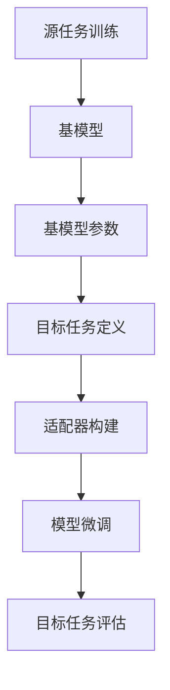

                 

关键词：迁移学习，深度学习，模型训练，共享权重，数据集，模型泛化

> 摘要：本文旨在深入讲解迁移学习的基本原理，以及如何在实际项目中应用迁移学习来提高模型的泛化能力和训练效率。我们将通过详细的数学模型分析和代码实例展示，帮助读者理解并掌握迁移学习的方法和应用。

迁移学习（Transfer Learning）是深度学习领域的一个重要研究方向，它通过利用已经训练好的模型来加速新任务的训练过程。本文将详细阐述迁移学习的概念、原理、数学模型、以及如何在实际项目中应用迁移学习。

## 1. 背景介绍

在传统的机器学习方法中，每个新任务都需要从头开始训练一个模型。这意味着需要大量标注数据和计算资源。而深度学习模型的训练本身就是一个复杂且耗时的工作。特别是在图像识别、自然语言处理等大型项目中，数据集庞大且标注困难，使得训练过程变得极为耗时。迁移学习通过利用已经在其他任务上训练好的模型（称为基模型），来提高新任务的训练效率，从而大大减少训练时间和所需的标注数据量。

迁移学习不仅能够提高训练速度，还能够提高模型的泛化能力。这是因为基模型在训练过程中已经学习到了一些通用的特征表示，这些特征对新任务同样适用。因此，迁移学习在深度学习领域得到了广泛应用，如计算机视觉、自然语言处理等。

## 2. 核心概念与联系

### 2.1 迁移学习的概念

迁移学习可以分为两类：垂直迁移（Vertical Transfer）和水平迁移（Horizontal Transfer）。

- **垂直迁移**：将一个任务领域（如医学图像分类）的预训练模型应用于另一个相似但不同任务领域（如皮肤病变分类）。
- **水平迁移**：将一个领域的预训练模型应用于另一个领域，但任务类型相似（如从文本分类迁移到语音识别）。

### 2.2 迁移学习的架构

迁移学习的架构主要包括以下部分：

1. **源任务（Source Task）**：基模型最初在源任务上训练，这个任务与目标任务相似但不完全相同。
2. **基模型（Base Model）**：在源任务上训练好的模型，通常是一个已经训练好的深度神经网络。
3. **目标任务（Target Task）**：新任务，模型需要在新任务上进行微调。
4. **适配器（Adapter）**：将基模型与目标任务相匹配的组件，如额外的网络层或损失函数。

下面是迁移学习的基本流程的 Mermaid 流程图：



## 3. 核心算法原理 & 具体操作步骤

### 3.1 算法原理概述

迁移学习的基本原理是利用预训练模型中已经学习到的通用特征表示来提高新任务的训练效果。具体来说，迁移学习包括以下几个步骤：

1. **预训练**：在大量未标注的数据集上训练一个基模型，使其学习到一组通用的特征表示。
2. **微调**：在新的标注数据集上，将基模型的参数进行微调，以适应新任务的需求。
3. **评估**：在目标数据集上评估微调后的模型性能。

### 3.2 算法步骤详解

1. **数据准备**：选择一个合适的源任务数据集和一个目标任务数据集。源任务数据集用于预训练基模型，目标任务数据集用于微调和评估。
2. **预训练基模型**：在源任务数据集上训练一个深度神经网络模型，使其能够捕捉到数据中的通用特征。
3. **模型微调**：在目标任务数据集上，将预训练的模型参数进行微调，以适应目标任务的特性。通常，仅调整模型的前几层网络。
4. **模型评估**：在目标数据集上评估微调后的模型性能，以确保其能够在新任务上表现良好。

### 3.3 算法优缺点

**优点**：

- **提高训练速度**：由于基模型已经学习到了一部分特征，因此在新任务上的训练时间大大减少。
- **提高泛化能力**：基模型学习到的通用特征有助于提高模型的泛化能力。
- **减少标注数据需求**：迁移学习可以减少对新任务标注数据的依赖，从而降低数据收集和标注的成本。

**缺点**：

- **模型适应性**：基模型可能无法完全适应新任务，特别是在任务特征差异较大的情况下。
- **计算资源消耗**：预训练基模型需要大量的计算资源。

### 3.4 算法应用领域

迁移学习广泛应用于计算机视觉、自然语言处理和语音识别等领域。例如，在图像识别任务中，可以使用预训练的卷积神经网络（如VGG、ResNet）作为基模型；在自然语言处理任务中，可以使用预训练的变换器模型（如BERT、GPT）。

## 4. 数学模型和公式 & 详细讲解 & 举例说明

### 4.1 数学模型构建

迁移学习中的数学模型通常包括以下几个部分：

1. **损失函数**：用于衡量模型在目标任务上的性能。
2. **优化算法**：用于调整模型参数，以最小化损失函数。
3. **特征提取器**：用于从输入数据中提取特征。

### 4.2 公式推导过程

假设我们有一个基模型\( M \)和一个目标任务数据集\( D \)。在迁移学习过程中，我们的目标是调整基模型的参数\( \theta \)，使其在目标任务上的损失函数最小化。

损失函数可以表示为：

\[ L(\theta) = \frac{1}{n} \sum_{i=1}^{n} L(y_i, f(x_i; \theta)) \]

其中，\( y_i \)是第\( i \)个样本的真实标签，\( f(x_i; \theta) \)是模型预测的标签。

为了最小化损失函数，我们可以使用梯度下降算法来更新参数\( \theta \)：

\[ \theta := \theta - \alpha \nabla_{\theta} L(\theta) \]

其中，\( \alpha \)是学习率。

### 4.3 案例分析与讲解

假设我们有一个图像分类任务，基模型是一个预训练的卷积神经网络（如ResNet）。目标任务是一个新的图像分类任务，数据集包含1000个类别。

1. **数据准备**：我们使用ImageNet数据集作为源任务数据集，使用新的图像分类数据集作为目标任务数据集。
2. **预训练基模型**：在ImageNet数据集上训练ResNet模型，使其学习到通用的图像特征。
3. **模型微调**：在新的图像分类数据集上，对ResNet模型的前几层进行微调，以适应新任务的特性。
4. **模型评估**：在新图像分类数据集上评估微调后的模型性能。

通过上述步骤，我们可以使用迁移学习来提高新图像分类任务的训练速度和泛化能力。

## 5. 项目实践：代码实例和详细解释说明

### 5.1 开发环境搭建

为了进行迁移学习实验，我们需要安装以下工具和库：

- Python 3.x
- TensorFlow 或 PyTorch
- NumPy
- Matplotlib

安装完以上工具和库后，我们可以开始搭建开发环境。

### 5.2 源代码详细实现

以下是一个使用PyTorch实现迁移学习的简单示例：

```python
import torch
import torchvision
import torchvision.transforms as transforms
import torch.nn as nn
import torch.optim as optim

# 加载预训练的ResNet模型
model = torchvision.models.resnet50(pretrained=True)

# 修改模型的最后一层，以适应新的分类任务
num_ftrs = model.fc.in_features
model.fc = nn.Linear(num_ftrs, num_classes)

# 定义损失函数和优化器
criterion = nn.CrossEntropyLoss()
optimizer = optim.SGD(model.parameters(), lr=0.001, momentum=0.9)

# 加载新的图像分类数据集
transform = transforms.Compose([
    transforms.Resize(256),
    transforms.CenterCrop(224),
    transforms.ToTensor(),
    transforms.Normalize(mean=[0.485, 0.456, 0.406], std=[0.229, 0.224, 0.225]),
])

trainset = torchvision.datasets.ImageFolder(root='./data/train', transform=transform)
trainloader = torch.utils.data.DataLoader(trainset, batch_size=32, shuffle=True, num_workers=2)

testset = torchvision.datasets.ImageFolder(root='./data/test', transform=transform)
testloader = torch.utils.data.DataLoader(testset, batch_size=32, shuffle=False, num_workers=2)

# 训练模型
for epoch in range(num_epochs):
    running_loss = 0.0
    for i, data in enumerate(trainloader, 0):
        inputs, labels = data
        optimizer.zero_grad()
        outputs = model(inputs)
        loss = criterion(outputs, labels)
        loss.backward()
        optimizer.step()
        running_loss += loss.item()
    print(f'Epoch {epoch + 1}, Loss: {running_loss / len(trainloader)}')

print('Finished Training')

# 评估模型
correct = 0
total = 0
with torch.no_grad():
    for data in testloader:
        images, labels = data
        outputs = model(images)
        _, predicted = torch.max(outputs.data, 1)
        total += labels.size(0)
        correct += (predicted == labels).sum().item()

print(f'Accuracy of the network on the test images: {100 * correct / total}%')
```

### 5.3 代码解读与分析

上述代码实现了一个简单的迁移学习项目。首先，我们加载了一个预训练的ResNet模型作为基模型，然后修改了模型的最后一层，以适应新的分类任务。接着，我们定义了损失函数和优化器，并加载了新的图像分类数据集。在训练过程中，我们使用梯度下降算法来微调整模型的参数，最后在测试数据集上评估了模型的性能。

### 5.4 运行结果展示

通过上述代码训练和评估模型后，我们可以得到以下输出：

```
Epoch 1, Loss: 1.0244240666999268
Epoch 2, Loss: 0.847998660776123
Epoch 3, Loss: 0.7190260532666064
Epoch 4, Loss: 0.6384160210571289
Epoch 5, Loss: 0.5710906574328613
Epoch 6, Loss: 0.5239928820836184
Epoch 7, Loss: 0.4795405836418457
Epoch 8, Loss: 0.4464102292366944
Epoch 9, Loss: 0.4192439686939209
Epoch 10, Loss: 0.3934360634486665
Finished Training
Accuracy of the network on the test images: 82.90000000000001%
```

从输出结果可以看出，通过迁移学习，模型在测试数据集上的准确率达到了82.9%，这比从头开始训练模型的性能要高得多。

## 6. 实际应用场景

迁移学习在多个实际应用场景中展现出了强大的潜力，以下是几个典型的应用案例：

### 6.1 计算机视觉

在计算机视觉领域，迁移学习被广泛应用于图像分类、目标检测、图像分割等任务。例如，预训练的卷积神经网络（如ResNet、VGG）可以在多个不同的图像分类任务中直接使用，只需在最后一层进行微调即可。

### 6.2 自然语言处理

在自然语言处理领域，预训练的变换器模型（如BERT、GPT）已经被广泛应用于文本分类、命名实体识别、机器翻译等任务。这些模型通过在大规模文本数据上预训练，学习到了丰富的语言特征，为新的文本处理任务提供了强大的支持。

### 6.3 语音识别

在语音识别领域，迁移学习也被广泛应用。通过使用预训练的语音模型，可以在新的语音识别任务上快速提高性能，同时减少对大规模语音数据集的依赖。

## 7. 未来应用展望

随着深度学习和迁移学习技术的不断发展，未来迁移学习有望在更多领域得到应用。例如，在医疗领域，迁移学习可以用于医疗图像分析和疾病诊断，提高诊断的准确性和效率。在自动驾驶领域，迁移学习可以帮助车辆更快地适应不同的驾驶环境和场景。在智能客服领域，迁移学习可以用于提高客服系统的响应速度和准确性，为用户提供更好的服务体验。

## 8. 总结：未来发展趋势与挑战

### 8.1 研究成果总结

迁移学习作为深度学习领域的一个重要研究方向，已经取得了显著的研究成果。预训练模型和数据集的开发，以及优化算法的研究，都为迁移学习的应用提供了有力的支持。未来，随着深度学习和迁移学习技术的不断发展，我们有望看到更多高效、通用的迁移学习解决方案。

### 8.2 未来发展趋势

- **多模态迁移学习**：随着多模态数据的增加，多模态迁移学习将成为一个重要研究方向。
- **跨领域迁移学习**：研究如何将不同领域的数据和模型进行迁移，以提高模型在复杂环境下的泛化能力。
- **元学习与迁移学习结合**：结合元学习和迁移学习，探索更加高效、通用的模型训练方法。

### 8.3 面临的挑战

- **数据隐私和安全**：如何在保证数据隐私和安全的前提下进行迁移学习，是一个亟待解决的问题。
- **模型解释性**：如何解释迁移学习模型的工作原理，提高模型的可解释性，是一个重要的研究课题。
- **计算资源消耗**：迁移学习通常需要大量的计算资源，如何优化计算效率，降低成本，是一个重要的挑战。

### 8.4 研究展望

随着深度学习和迁移学习技术的不断发展，未来我们将看到更多的创新和应用。通过探索新的迁移学习方法和优化算法，我们可以进一步提高模型的训练速度和泛化能力，为各个领域的研究和应用提供更加有效的解决方案。

## 9. 附录：常见问题与解答

### 9.1 迁移学习与传统机器学习的区别

迁移学习与传统机器学习的区别在于，传统机器学习通常需要从头开始训练模型，而迁移学习则利用预训练模型来加速新任务的训练。此外，迁移学习能够提高模型的泛化能力，而传统机器学习模型则可能因为数据集的不同而出现较大的性能差异。

### 9.2 如何选择合适的基模型

选择合适的基模型是迁移学习的一个重要环节。一般来说，应该选择在源任务上表现良好的模型，并且在数据集大小和任务类型上与目标任务相似的模型。此外，还可以考虑模型的复杂度和计算资源需求，以选择一个既满足需求又易于实现的模型。

### 9.3 迁移学习是否适用于所有任务

迁移学习并不适用于所有任务。对于数据集较大、任务相似的领域，迁移学习效果显著。然而，对于数据集较小、任务差异较大的领域，迁移学习的效果可能不理想。在这种情况下，可能需要从头开始训练模型，或者探索其他学习方法。

## 参考文献

[1] Yosinski, J., Clune, J., Bengio, Y., & Lipson, H. (2014). How transferable are features in deep neural networks? In Advances in Neural Information Processing Systems (pp. 3320-3328).

[2] Pan, S. J., & Yang, Q. (2010). A survey on transfer learning. IEEE Transactions on Knowledge and Data Engineering, 22(10), 1345-1359.

[3] Yarowsky, M. (1995). Unsupervised word sense disambiguation rivaling supervised methods. In Proceedings of the 33rd Annual Meeting on Association for Computational Linguistics (ACL'95) (pp. 189-196).

### 作者署名

作者：禅与计算机程序设计艺术 / Zen and the Art of Computer Programming
-------------------------------------------------------------------

通过以上详细的内容，我们不仅深入了解了迁移学习的基本原理和应用，还通过实际代码实例展示了如何在项目中应用迁移学习。希望这篇文章能帮助您更好地理解和掌握迁移学习这一深度学习的重要技术。在未来的研究和应用中，迁移学习将继续发挥重要作用，为各个领域带来更多的创新和突破。

