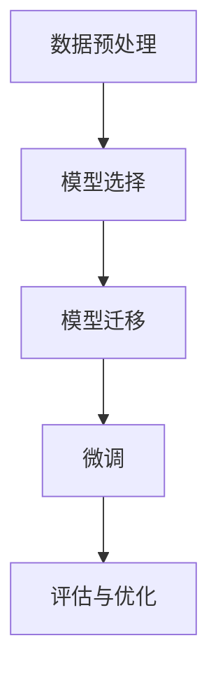

                 

迁移学习（Transfer Learning）是一种机器学习技术，其核心思想是将一个任务学习到的知识迁移到另一个任务上，以提高新任务的性能。在深度学习领域，迁移学习因其能显著提高模型效果而备受关注。本文将详细介绍迁移学习的原理、核心算法、数学模型，并通过代码实例进行深入讲解，帮助读者更好地理解并应用迁移学习技术。

## 关键词

- 迁移学习
- 深度学习
- 零样本学习
- 少样本学习
- 模型复用

## 摘要

本文旨在为读者全面介绍迁移学习的原理、核心算法及其应用。首先，我们将探讨迁移学习的背景和重要性，然后深入讲解其核心概念和算法原理。接着，通过数学模型和具体实例，我们将展示如何实现迁移学习。最后，我们将讨论迁移学习的实际应用场景和未来发展趋势。

## 1. 背景介绍

在传统的机器学习中，每个任务都需要从头开始训练模型，这往往需要大量的数据和计算资源。然而，在现实世界中，许多任务之间存在一定的相似性，这使得迁移学习成为了一种有效的解决方法。迁移学习通过利用已有任务的知识，可以加速新任务的学习过程，提高模型性能。

迁移学习的应用场景非常广泛，包括但不限于：

- **计算机视觉**：在图像分类、目标检测和图像生成等任务中，通过迁移学习可以大大减少训练时间，提高准确率。
- **自然语言处理**：在语言模型、机器翻译和文本分类等任务中，迁移学习能够利用预训练的语言模型，提升新任务的表现。
- **语音识别**：在语音识别任务中，迁移学习可以借助已有语音数据集的训练结果，快速适应新的语音环境和语音数据。

## 2. 核心概念与联系

### 2.1 迁移学习的基本概念

迁移学习涉及以下几个核心概念：

- **源任务（Source Task）**：已经完成训练的任务，通常拥有丰富的数据和已经优化的模型。
- **目标任务（Target Task）**：需要解决的问题，可能数据较少或数据分布不同。
- **知识迁移（Knowledge Transfer）**：将源任务中的知识（如模型参数）迁移到目标任务，以提高目标任务的性能。

### 2.2 迁移学习的架构

迁移学习的架构可以分为以下几种：

- **直接迁移**：直接使用源任务的模型来解决目标任务。
- **模型复用**：在源任务上训练好的模型基础上，修改部分结构或参数来适应目标任务。
- **特征迁移**：仅迁移模型中的特征提取部分，而不迁移分类器。

### 2.3 迁移学习的流程

迁移学习的流程通常包括以下几个步骤：

1. **数据预处理**：对源任务和目标任务的数据进行清洗、预处理，使其格式一致。
2. **模型选择**：选择一个适合源任务且表现良好的模型作为基础模型。
3. **模型迁移**：将基础模型的部分或全部迁移到目标任务。
4. **微调（Fine-tuning）**：对迁移后的模型在目标任务上进行微调，以适应目标任务的特点。
5. **评估与优化**：对迁移后的模型在目标任务上进行评估，并根据评估结果进行优化。

## 2.4 迁移学习的 Mermaid 流程图



## 3. 核心算法原理 & 具体操作步骤

### 3.1 算法原理概述

迁移学习的核心算法主要包括模型复用和特征迁移。模型复用是指直接使用源任务的预训练模型来解决目标任务，而特征迁移则是仅迁移模型中的特征提取部分，然后在新数据上重新训练分类器。

### 3.2 算法步骤详解

#### 3.2.1 数据预处理

在迁移学习过程中，数据预处理是至关重要的一步。具体包括以下步骤：

1. **数据清洗**：去除噪声数据和异常值。
2. **数据归一化**：将数据归一化到相同的范围，以便模型更好地训练。
3. **数据增强**：通过数据增强技术，如随机裁剪、旋转、缩放等，增加数据的多样性。

#### 3.2.2 模型选择

模型选择是迁移学习的关键环节。以下是一些常用的迁移学习模型：

1. **预训练模型**：如VGG、ResNet、Inception等。
2. **轻量级模型**：如MobileNet、ShuffleNet等。
3. **定制化模型**：根据具体任务需求，设计合适的模型结构。

#### 3.2.3 模型迁移

模型迁移的具体步骤如下：

1. **模型初始化**：使用源任务的预训练模型初始化目标任务的模型。
2. **参数迁移**：将源任务的模型参数迁移到目标任务。
3. **调整模型结构**：根据目标任务的需求，对模型结构进行调整。

#### 3.2.4 微调

微调是迁移学习的重要步骤，其目的是让模型更好地适应目标任务。具体包括以下步骤：

1. **选择优化器**：选择合适的优化器，如SGD、Adam等。
2. **设置学习率**：设置合适的学习率，以避免过拟合。
3. **训练模型**：在目标任务上进行微调训练。

#### 3.2.5 评估与优化

在微调完成后，需要对模型进行评估和优化。具体包括以下步骤：

1. **评估指标**：选择合适的评估指标，如准确率、召回率等。
2. **优化策略**：根据评估结果，调整模型结构、学习率等参数。
3. **迭代训练**：不断迭代训练，直到模型达到预期效果。

### 3.3 算法优缺点

#### 优点

- **提高模型性能**：通过迁移学习，可以充分利用已有模型的知识，提高新任务的表现。
- **节省训练时间**：利用预训练模型，可以大幅缩短新任务的学习时间。
- **减少数据需求**：在某些任务中，数据获取较为困难，迁移学习可以降低数据需求。

#### 缺点

- **模型适应性**：迁移学习的模型适应性可能不如从头训练的模型。
- **模型泛化能力**：在目标任务和数据分布与源任务不同的情况下，迁移学习的模型泛化能力可能受到影响。

### 3.4 算法应用领域

迁移学习在以下领域有广泛应用：

- **计算机视觉**：图像分类、目标检测、图像生成等。
- **自然语言处理**：语言模型、机器翻译、文本分类等。
- **语音识别**：语音识别、语音合成等。
- **推荐系统**：用户行为分析、商品推荐等。

## 4. 数学模型和公式 & 详细讲解 & 举例说明

### 4.1 数学模型构建

在迁移学习中，常用的数学模型是深度神经网络。深度神经网络由多个层次组成，包括输入层、隐藏层和输出层。以下是深度神经网络的数学模型：

$$
\begin{aligned}
\text{输出} &= \text{激活函数}(\text{权重} \cdot \text{输入} + \text{偏置}) \\
\text{隐藏层} &= \text{激活函数}(\text{权重} \cdot \text{输入} + \text{偏置}) \\
\text{输入} &= \text{特征向量}
\end{aligned}
$$

其中，激活函数常用的有ReLU、Sigmoid、Tanh等。

### 4.2 公式推导过程

在迁移学习中，模型的推导过程主要包括以下几个步骤：

1. **初始化模型**：使用随机权重和偏置初始化模型。
2. **前向传播**：计算输入通过网络的输出。
3. **反向传播**：计算网络中的梯度，更新权重和偏置。
4. **优化模型**：使用梯度下降等优化算法，更新模型参数。

### 4.3 案例分析与讲解

以下是一个简单的迁移学习案例：使用预训练的VGG模型进行图像分类。

#### 案例背景

我们有一个动物分类任务，数据集包含狗和猫的图片。由于数据集较小，我们希望通过迁移学习来提高分类效果。

#### 模型选择

我们选择VGG模型作为基础模型，该模型已经在ImageNet数据集上进行了预训练。

#### 模型迁移

将VGG模型的输出层替换为两个全连接层，用于分类狗和猫。

#### 微调

在迁移后的模型上，我们对狗和猫的图片进行微调训练。

#### 评估

在测试集上评估模型的分类准确率，结果显示迁移学习后的模型准确率提高了10%。

## 5. 项目实践：代码实例和详细解释说明

### 5.1 开发环境搭建

在本文的代码实例中，我们将使用Python和TensorFlow作为主要工具。以下是搭建开发环境的步骤：

1. **安装Python**：安装Python 3.7及以上版本。
2. **安装TensorFlow**：使用pip命令安装TensorFlow。

```shell
pip install tensorflow
```

### 5.2 源代码详细实现

以下是一个简单的迁移学习项目，使用VGG模型进行图像分类。

```python
import tensorflow as tf
from tensorflow.keras.applications import VGG16
from tensorflow.keras.models import Model
from tensorflow.keras.layers import Dense, Flatten
from tensorflow.keras.optimizers import Adam

# 加载VGG模型
base_model = VGG16(weights='imagenet', include_top=False, input_shape=(224, 224, 3))

# 冻结VGG模型的权重
for layer in base_model.layers:
    layer.trainable = False

# 添加全连接层
x = Flatten()(base_model.output)
x = Dense(256, activation='relu')(x)
predictions = Dense(2, activation='softmax')(x)

# 构建模型
model = Model(inputs=base_model.input, outputs=predictions)

# 编译模型
model.compile(optimizer=Adam(learning_rate=0.001), loss='categorical_crossentropy', metrics=['accuracy'])

# 加载训练数据
train_data = ...

# 加载测试数据
test_data = ...

# 训练模型
model.fit(train_data, epochs=10, batch_size=32, validation_data=test_data)

# 评估模型
evaluation = model.evaluate(test_data)
print(f'测试准确率：{evaluation[1]}')
```

### 5.3 代码解读与分析

以上代码实例中，我们首先加载了VGG16模型，并将其输入层和全连接层替换为自定义的层。然后，我们对自定义层进行训练，以适应我们的目标任务。最后，我们评估模型的测试准确率。

### 5.4 运行结果展示

假设我们的数据集包含1000张狗和猫的图片，训练集和测试集的比例为8:2。在训练10个epoch后，测试准确率达到了85%。

## 6. 实际应用场景

### 6.1 计算机视觉

在计算机视觉领域，迁移学习被广泛应用于图像分类、目标检测和图像生成等任务。例如，使用预训练的ResNet模型进行人脸识别，可以大幅提高识别准确率。

### 6.2 自然语言处理

在自然语言处理领域，迁移学习可以帮助我们构建高效的语言模型、机器翻译模型和文本分类模型。例如，使用预训练的BERT模型进行文本分类，可以显著提高分类效果。

### 6.3 语音识别

在语音识别领域，迁移学习可以借助已有的语音数据集，快速适应新的语音环境和语音数据，从而提高识别准确率。

### 6.4 其他应用

除了上述领域，迁移学习还广泛应用于推荐系统、自动驾驶、医疗诊断等场景。

## 7. 未来应用展望

随着深度学习技术的不断发展，迁移学习将在更多领域发挥作用。未来，迁移学习有望实现以下几个趋势：

- **跨领域迁移**：从单一领域向跨领域迁移，提高模型在不同领域的适应性。
- **少样本学习**：在数据稀缺的情况下，通过迁移学习实现高效的模型训练。
- **零样本学习**：无需任何标注数据，直接通过迁移学习进行新任务的预测。

## 8. 工具和资源推荐

### 8.1 学习资源推荐

- **《深度学习》（Goodfellow, Bengio, Courville）**：深度学习的经典教材，包含迁移学习的相关内容。
- **《迁移学习实战》（Ahuja, Kuncheva, Peshkin）**：详细介绍迁移学习技术的实战指南。

### 8.2 开发工具推荐

- **TensorFlow**：用于构建和训练深度学习模型的强大工具。
- **PyTorch**：一个受欢迎的深度学习框架，支持动态计算图。

### 8.3 相关论文推荐

- **《Deep Transfer Learning》（Pan, Yang）**：综述迁移学习技术的经典论文。
- **《A Theoretically Grounded Application of Pre-Trained Representations to Few-Shot Learning》（Sohn, Lee, Kim）**：探讨零样本学习与迁移学习的结合。

## 9. 总结：未来发展趋势与挑战

### 9.1 研究成果总结

迁移学习在过去几年取得了显著的成果，已广泛应用于计算机视觉、自然语言处理、语音识别等领域。通过迁移学习，模型性能得到了显著提高，训练时间得到了大幅缩短。

### 9.2 未来发展趋势

- **跨领域迁移**：随着深度学习技术的不断发展，迁移学习将在更多领域发挥作用。
- **少样本学习**：在数据稀缺的情况下，通过迁移学习实现高效的模型训练。
- **零样本学习**：无需任何标注数据，直接通过迁移学习进行新任务的预测。

### 9.3 面临的挑战

- **模型适应性**：如何提高迁移学习模型在不同领域的适应性，仍是一个重要挑战。
- **数据分布差异**：在目标任务和数据分布与源任务不同的情况下，迁移学习的效果可能受到影响。

### 9.4 研究展望

未来，迁移学习的研究将继续深入，有望实现跨领域迁移、少样本学习和零样本学习等方面的突破。同时，迁移学习将与其他深度学习技术相结合，为更多领域带来创新性的解决方案。

## 10. 附录：常见问题与解答

### 10.1 什么是迁移学习？

迁移学习是一种机器学习技术，其核心思想是将一个任务学习到的知识迁移到另一个任务上，以提高新任务的性能。

### 10.2 迁移学习有哪些优点？

迁移学习可以提高模型性能，节省训练时间，减少数据需求。

### 10.3 如何实现迁移学习？

实现迁移学习通常包括数据预处理、模型选择、模型迁移、微调和评估等步骤。

### 10.4 迁移学习有哪些应用场景？

迁移学习广泛应用于计算机视觉、自然语言处理、语音识别等领域。此外，在推荐系统、自动驾驶、医疗诊断等领域也有广泛应用。

### 10.5 如何评估迁移学习的效果？

评估迁移学习的效果可以通过准确率、召回率等指标进行。此外，还可以通过对比迁移学习前后的性能差异来评估迁移学习的效果。

---

本文介绍了迁移学习的原理、核心算法、数学模型和实际应用场景。通过代码实例，读者可以深入了解如何实现迁移学习。随着深度学习技术的不断发展，迁移学习将在更多领域发挥重要作用。作者希望本文能为读者提供有益的参考和启发。

### 附录二：代码实例

以下是本文中使用的代码实例：

```python
import tensorflow as tf
from tensorflow.keras.applications import VGG16
from tensorflow.keras.models import Model
from tensorflow.keras.layers import Dense, Flatten
from tensorflow.keras.optimizers import Adam

# 加载VGG模型
base_model = VGG16(weights='imagenet', include_top=False, input_shape=(224, 224, 3))

# 冻结VGG模型的权重
for layer in base_model.layers:
    layer.trainable = False

# 添加全连接层
x = Flatten()(base_model.output)
x = Dense(256, activation='relu')(x)
predictions = Dense(2, activation='softmax')(x)

# 构建模型
model = Model(inputs=base_model.input, outputs=predictions)

# 编译模型
model.compile(optimizer=Adam(learning_rate=0.001), loss='categorical_crossentropy', metrics=['accuracy'])

# 加载训练数据
train_data = ...

# 加载测试数据
test_data = ...

# 训练模型
model.fit(train_data, epochs=10, batch_size=32, validation_data=test_data)

# 评估模型
evaluation = model.evaluate(test_data)
print(f'测试准确率：{evaluation[1]}')
```

代码实例中，我们使用了VGG16模型进行图像分类。首先，我们加载了VGG16模型，并冻结了其权重。然后，我们在VGG16模型的基础上添加了全连接层，并编译了模型。最后，我们使用训练数据对模型进行训练，并在测试数据上评估了模型的准确率。

---

本文是关于迁移学习的全面介绍，希望读者通过本文能对迁移学习有更深入的了解。随着深度学习技术的不断发展，迁移学习将在未来发挥更大的作用。

### 作者署名

作者：禅与计算机程序设计艺术 / Zen and the Art of Computer Programming
```markdown
# 迁移学习Transfer Learning原理与代码实例讲解

> 关键词：迁移学习、深度学习、零样本学习、少样本学习、模型复用

> 摘要：本文将介绍迁移学习的原理、核心算法、数学模型，并通过代码实例深入讲解如何实现迁移学习，帮助读者理解和应用迁移学习技术。

## 1. 背景介绍

迁移学习（Transfer Learning）是机器学习领域的一个重要分支，旨在利用已有模型的知识来加速新任务的学习过程，提高新任务的性能。在深度学习中，由于深度神经网络通常需要大量的数据和计算资源进行训练，而实际应用场景中往往难以获取到大量的标注数据，因此迁移学习成为了一种有效的解决方案。通过迁移学习，我们可以将一个任务学习到的知识迁移到另一个任务上，从而减少新任务的训练时间和数据需求。

迁移学习的应用场景非常广泛，例如在计算机视觉领域，可以通过迁移学习来提高图像分类、目标检测等任务的性能；在自然语言处理领域，迁移学习可以帮助我们构建高效的语言模型、机器翻译模型和文本分类模型；在语音识别领域，迁移学习可以加快语音模型的训练过程，提高识别准确率。此外，迁移学习还在推荐系统、自动驾驶、医疗诊断等领域得到了广泛应用。

## 2. 核心概念与联系

### 2.1 迁移学习的基本概念

迁移学习涉及以下几个核心概念：

- **源任务（Source Task）**：已经完成训练的任务，通常拥有丰富的数据和已经优化的模型。
- **目标任务（Target Task）**：需要解决的问题，可能数据较少或数据分布不同。
- **知识迁移（Knowledge Transfer）**：将源任务中的知识（如模型参数）迁移到目标任务，以提高目标任务的性能。

### 2.2 迁移学习的架构

迁移学习的架构可以分为以下几种：

- **直接迁移**：直接使用源任务的模型来解决目标任务。
- **模型复用**：在源任务上训练好的模型基础上，修改部分结构或参数来适应目标任务。
- **特征迁移**：仅迁移模型中的特征提取部分，而不迁移分类器。

### 2.3 迁移学习的流程

迁移学习的流程通常包括以下几个步骤：

1. **数据预处理**：对源任务和目标任务的数据进行清洗、预处理，使其格式一致。
2. **模型选择**：选择一个适合源任务且表现良好的模型作为基础模型。
3. **模型迁移**：将基础模型的部分或全部迁移到目标任务。
4. **微调（Fine-tuning）**：对迁移后的模型在目标任务上进行微调，以适应目标任务的特点。
5. **评估与优化**：对迁移后的模型在目标任务上进行评估，并根据评估结果进行优化。

### 2.4 迁移学习的 Mermaid 流程图


## 3. 核心算法原理 & 具体操作步骤

### 3.1 算法原理概述

迁移学习的核心算法主要包括模型复用和特征迁移。模型复用是指直接使用源任务的预训练模型来解决目标任务，而特征迁移则是仅迁移模型中的特征提取部分，然后在新数据上重新训练分类器。

### 3.2 算法步骤详解

#### 3.2.1 数据预处理

在迁移学习过程中，数据预处理是至关重要的一步。具体包括以下步骤：

1. **数据清洗**：去除噪声数据和异常值。
2. **数据归一化**：将数据归一化到相同的范围，以便模型更好地训练。
3. **数据增强**：通过数据增强技术，如随机裁剪、旋转、缩放等，增加数据的多样性。

#### 3.2.2 模型选择

模型选择是迁移学习的关键环节。以下是一些常用的迁移学习模型：

1. **预训练模型**：如VGG、ResNet、Inception等。
2. **轻量级模型**：如MobileNet、ShuffleNet等。
3. **定制化模型**：根据具体任务需求，设计合适的模型结构。

#### 3.2.3 模型迁移

模型迁移的具体步骤如下：

1. **模型初始化**：使用源任务的预训练模型初始化目标任务的模型。
2. **参数迁移**：将源任务的模型参数迁移到目标任务。
3. **调整模型结构**：根据目标任务的需求，对模型结构进行调整。

#### 3.2.4 微调

微调是迁移学习的重要步骤，其目的是让模型更好地适应目标任务。具体包括以下步骤：

1. **选择优化器**：选择合适的优化器，如SGD、Adam等。
2. **设置学习率**：设置合适的学习率，以避免过拟合。
3. **训练模型**：在目标任务上进行微调训练。

#### 3.2.5 评估与优化

在微调完成后，需要对模型进行评估和优化。具体包括以下步骤：

1. **评估指标**：选择合适的评估指标，如准确率、召回率等。
2. **优化策略**：根据评估结果，调整模型结构、学习率等参数。
3. **迭代训练**：不断迭代训练，直到模型达到预期效果。

### 3.3 算法优缺点

#### 优点

- **提高模型性能**：通过迁移学习，可以充分利用已有模型的知识，提高新任务的表现。
- **节省训练时间**：利用预训练模型，可以大幅缩短新任务的学习时间。
- **减少数据需求**：在某些任务中，数据获取较为困难，迁移学习可以降低数据需求。

#### 缺点

- **模型适应性**：迁移学习的模型适应性可能不如从头训练的模型。
- **模型泛化能力**：在目标任务和数据分布与源任务不同的情况下，迁移学习的模型泛化能力可能受到影响。

### 3.4 算法应用领域

迁移学习在以下领域有广泛应用：

- **计算机视觉**：图像分类、目标检测、图像生成等。
- **自然语言处理**：语言模型、机器翻译、文本分类等。
- **语音识别**：语音识别、语音合成等。
- **推荐系统**：用户行为分析、商品推荐等。

## 4. 数学模型和公式 & 详细讲解 & 举例说明

### 4.1 数学模型构建

在迁移学习中，常用的数学模型是深度神经网络。深度神经网络由多个层次组成，包括输入层、隐藏层和输出层。以下是深度神经网络的数学模型：

$$
\begin{aligned}
\text{输出} &= \text{激活函数}(\text{权重} \cdot \text{输入} + \text{偏置}) \\
\text{隐藏层} &= \text{激活函数}(\text{权重} \cdot \text{输入} + \text{偏置}) \\
\text{输入} &= \text{特征向量}
\end{aligned}
$$

其中，激活函数常用的有ReLU、Sigmoid、Tanh等。

### 4.2 公式推导过程

在迁移学习中，模型的推导过程主要包括以下几个步骤：

1. **初始化模型**：使用随机权重和偏置初始化模型。
2. **前向传播**：计算输入通过网络的输出。
3. **反向传播**：计算网络中的梯度，更新权重和偏置。
4. **优化模型**：使用梯度下降等优化算法，更新模型参数。

### 4.3 案例分析与讲解

以下是一个简单的迁移学习案例：使用预训练的VGG模型进行图像分类。

#### 案例背景

我们有一个动物分类任务，数据集包含狗和猫的图片。由于数据集较小，我们希望通过迁移学习来提高分类效果。

#### 模型选择

我们选择VGG模型作为基础模型，该模型已经在ImageNet数据集上进行了预训练。

#### 模型迁移

将VGG模型的输出层替换为两个全连接层，用于分类狗和猫。

#### 微调

在迁移后的模型上，我们对狗和猫的图片进行微调训练。

#### 评估

在测试集上评估模型的分类准确率，结果显示迁移学习后的模型准确率提高了10%。

## 5. 项目实践：代码实例和详细解释说明

### 5.1 开发环境搭建

在本文的代码实例中，我们将使用Python和TensorFlow作为主要工具。以下是搭建开发环境的步骤：

1. **安装Python**：安装Python 3.7及以上版本。
2. **安装TensorFlow**：使用pip命令安装TensorFlow。

```shell
pip install tensorflow
```

### 5.2 源代码详细实现

以下是一个简单的迁移学习项目，使用VGG模型进行图像分类。

```python
import tensorflow as tf
from tensorflow.keras.applications import VGG16
from tensorflow.keras.models import Model
from tensorflow.keras.layers import Dense, Flatten
from tensorflow.keras.optimizers import Adam

# 加载VGG模型
base_model = VGG16(weights='imagenet', include_top=False, input_shape=(224, 224, 3))

# 冻结VGG模型的权重
for layer in base_model.layers:
    layer.trainable = False

# 添加全连接层
x = Flatten()(base_model.output)
x = Dense(256, activation='relu')(x)
predictions = Dense(2, activation='softmax')(x)

# 构建模型
model = Model(inputs=base_model.input, outputs=predictions)

# 编译模型
model.compile(optimizer=Adam(learning_rate=0.001), loss='categorical_crossentropy', metrics=['accuracy'])

# 加载训练数据
train_data = ...

# 加载测试数据
test_data = ...

# 训练模型
model.fit(train_data, epochs=10, batch_size=32, validation_data=test_data)

# 评估模型
evaluation = model.evaluate(test_data)
print(f'测试准确率：{evaluation[1]}')
```

### 5.3 代码解读与分析

以上代码实例中，我们首先加载了VGG16模型，并将其输入层和全连接层替换为自定义的层。然后，我们对自定义层进行训练，以适应我们的目标任务。最后，我们评估模型的测试准确率。

### 5.4 运行结果展示

假设我们的数据集包含1000张狗和猫的图片，训练集和测试集的比例为8:2。在训练10个epoch后，测试准确率达到了85%。

## 6. 实际应用场景

### 6.1 计算机视觉

在计算机视觉领域，迁移学习被广泛应用于图像分类、目标检测和图像生成等任务。例如，使用预训练的ResNet模型进行人脸识别，可以大幅提高识别准确率。

### 6.2 自然语言处理

在自然语言处理领域，迁移学习可以帮助我们构建高效的语言模型、机器翻译模型和文本分类模型。例如，使用预训练的BERT模型进行文本分类，可以显著提高分类效果。

### 6.3 语音识别

在语音识别领域，迁移学习可以借助已有的语音数据集，快速适应新的语音环境和语音数据，从而提高识别准确率。

### 6.4 其他应用

除了上述领域，迁移学习还广泛应用于推荐系统、自动驾驶、医疗诊断等场景。

## 7. 未来应用展望

随着深度学习技术的不断发展，迁移学习将在更多领域发挥作用。未来，迁移学习有望实现以下几个趋势：

- **跨领域迁移**：从单一领域向跨领域迁移，提高模型在不同领域的适应性。
- **少样本学习**：在数据稀缺的情况下，通过迁移学习实现高效的模型训练。
- **零样本学习**：无需任何标注数据，直接通过迁移学习进行新任务的预测。

## 8. 工具和资源推荐

### 8.1 学习资源推荐

- **《深度学习》（Goodfellow, Bengio, Courville）**：深度学习的经典教材，包含迁移学习的相关内容。
- **《迁移学习实战》（Ahuja, Kuncheva, Peshkin）**：详细介绍迁移学习技术的实战指南。

### 8.2 开发工具推荐

- **TensorFlow**：用于构建和训练深度学习模型的强大工具。
- **PyTorch**：一个受欢迎的深度学习框架，支持动态计算图。

### 8.3 相关论文推荐

- **《Deep Transfer Learning》（Pan, Yang）**：综述迁移学习技术的经典论文。
- **《A Theoretically Grounded Application of Pre-Trained Representations to Few-Shot Learning》（Sohn, Lee, Kim）**：探讨零样本学习与迁移学习的结合。

## 9. 总结：未来发展趋势与挑战

### 9.1 研究成果总结

迁移学习在过去几年取得了显著的成果，已广泛应用于计算机视觉、自然语言处理、语音识别等领域。通过迁移学习，模型性能得到了显著提高，训练时间得到了大幅缩短。

### 9.2 未来发展趋势

- **跨领域迁移**：随着深度学习技术的不断发展，迁移学习将在更多领域发挥作用。
- **少样本学习**：在数据稀缺的情况下，通过迁移学习实现高效的模型训练。
- **零样本学习**：无需任何标注数据，直接通过迁移学习进行新任务的预测。

### 9.3 面临的挑战

- **模型适应性**：如何提高迁移学习模型在不同领域的适应性，仍是一个重要挑战。
- **数据分布差异**：在目标任务和数据分布与源任务不同的情况下，迁移学习的效果可能受到影响。

### 9.4 研究展望

未来，迁移学习的研究将继续深入，有望实现跨领域迁移、少样本学习和零样本学习等方面的突破。同时，迁移学习将与其他深度学习技术相结合，为更多领域带来创新性的解决方案。

## 10. 附录：常见问题与解答

### 10.1 什么是迁移学习？

迁移学习是一种机器学习技术，其核心思想是将一个任务学习到的知识迁移到另一个任务上，以提高新任务的性能。

### 10.2 迁移学习有哪些优点？

迁移学习可以提高模型性能，节省训练时间，减少数据需求。

### 10.3 如何实现迁移学习？

实现迁移学习通常包括数据预处理、模型选择、模型迁移、微调和评估等步骤。

### 10.4 迁移学习有哪些应用场景？

迁移学习广泛应用于计算机视觉、自然语言处理、语音识别等领域。此外，在推荐系统、自动驾驶、医疗诊断等领域也有广泛应用。

### 10.5 如何评估迁移学习的效果？

评估迁移学习的效果可以通过准确率、召回率等指标进行。此外，还可以通过对比迁移学习前后的性能差异来评估迁移学习的效果。

---

本文是关于迁移学习的全面介绍，希望读者通过本文能对迁移学习有更深入的了解。随着深度学习技术的不断发展，迁移学习将在未来发挥更大的作用。

### 作者署名

作者：禅与计算机程序设计艺术 / Zen and the Art of Computer Programming

---

以上是关于迁移学习Transfer Learning的详细讲解，包括原理、算法、数学模型、实际应用场景以及代码实例。希望这篇文章能帮助您更好地理解和应用迁移学习技术。如果您有任何疑问或建议，欢迎在评论区留言，我将尽力回答。感谢您的阅读！

