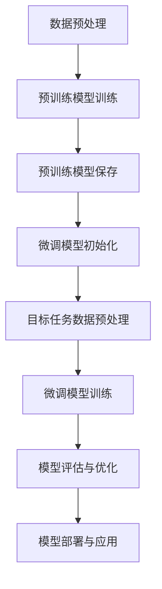

                 

关键词：迁移学习，自然语言处理，预训练，微调，模型优化，应用场景，发展趋势

<|assistant|>摘要：本文深入探讨了迁移学习在自然语言处理（NLP）中的应用，从预训练到微调的全过程进行了详细的讲解。首先，我们回顾了迁移学习的核心概念及其在NLP中的重要地位。接着，文章详细介绍了预训练模型的原理，包括模型架构、训练数据集和训练目标。随后，我们分析了微调过程，包括微调策略、参数更新和模型评估。文章进一步探讨了迁移学习在NLP中的多种应用场景，如文本分类、命名实体识别和机器翻译等。最后，文章展望了迁移学习的未来发展趋势，提出了面临的挑战和研究展望。

## 1. 背景介绍

自然语言处理（NLP）作为人工智能领域的一个重要分支，旨在使计算机能够理解和处理人类语言。随着深度学习技术的不断发展，NLP取得了显著的进展，尤其是在大规模文本数据的处理和分析方面。然而，传统的NLP方法往往依赖于大量的手工特征工程，这不仅费时费力，而且难以应对复杂多变的语言现象。为了解决这个问题，迁移学习（Transfer Learning）应运而生。

迁移学习是一种利用预先训练好的模型在特定任务上取得的泛化能力，将其应用于新的、相关任务的方法。在迁移学习中，预训练模型在大规模通用数据集上训练，学习到了丰富的语言特征。然后，通过微调（Fine-tuning）将预训练模型迁移到具体的任务上，使其在目标任务上取得更好的性能。

近年来，迁移学习在NLP领域取得了巨大成功，不仅提高了模型在多种任务上的性能，还降低了模型对大量标注数据的依赖。本文将围绕迁移学习在NLP中的应用，从预训练到微调的全过程进行探讨，旨在为读者提供一个全面的技术视角。

## 2. 核心概念与联系

### 2.1 迁移学习的核心概念

迁移学习的基本思想是将一个任务上学习的知识应用于另一个相关任务上。在迁移学习中，存在两个主要概念：源任务（Source Task）和目标任务（Target Task）。源任务是指已经完成训练并具有良好泛化能力的任务，目标任务是指需要解决的新任务。迁移学习的目标是通过迁移源任务的模型知识，提高目标任务的性能。

迁移学习可以分为以下几种类型：

1. **垂直迁移（Vertical Transfer）**：源任务和目标任务的难度级别不同，源任务的难度较高，目标任务的难度较低。
2. **水平迁移（Horizontal Transfer）**：源任务和目标任务的难度级别相同，但任务类型不同。
3. **跨域迁移（Cross-Domain Transfer）**：源任务和目标任务的领域不同，但任务类型相同。
4. **跨语言迁移（Cross-Language Transfer）**：源任务和目标任务的语种不同。

### 2.2 迁移学习在NLP中的应用架构

迁移学习在NLP中的应用架构主要包括预训练和微调两个阶段。预训练阶段是在大规模通用数据集上训练模型，使其学习到丰富的语言特征。微调阶段则是将预训练模型迁移到具体的NLP任务上，通过微调调整模型参数，使其在目标任务上取得更好的性能。

以下是迁移学习在NLP中的应用架构的Mermaid流程图：



### 2.3 预训练与微调的联系

预训练和微调是迁移学习在NLP中的两个关键环节。预训练阶段通过在大规模通用数据集上训练模型，使其具备了强大的语言理解能力。微调阶段则是在预训练模型的基础上，针对具体任务进行参数调整，使其在目标任务上取得更好的性能。

预训练和微调之间的联系主要体现在以下几个方面：

1. **预训练作为基础**：预训练阶段为微调提供了强大的基础，使模型在大规模通用数据集上学习到了丰富的语言特征，从而为微调阶段提供了有力的支持。
2. **微调调整模型参数**：微调阶段通过在目标任务上调整模型参数，使模型能够更好地适应新任务。微调过程中，模型在源任务上的知识得以有效迁移，从而提高目标任务的性能。
3. **预训练与微调的平衡**：预训练和微调之间存在一定的平衡关系。预训练过度可能导致模型在目标任务上性能不佳，而微调不足则可能导致模型无法充分利用预训练的知识。因此，如何在预训练和微调之间找到最佳平衡点，是迁移学习研究的重要课题。

### 2.4 迁移学习在NLP中的重要地位

迁移学习在NLP中具有重要的地位，主要体现在以下几个方面：

1. **提高模型性能**：迁移学习通过将源任务的模型知识迁移到目标任务，使模型在目标任务上取得了更好的性能。这在一定程度上降低了模型对大规模标注数据的依赖，提高了模型的泛化能力。
2. **减少数据需求**：迁移学习能够将预训练模型在大规模通用数据集上的知识迁移到新的任务上，从而减少了目标任务对大量标注数据的依赖。这在数据稀缺的领域尤其具有优势。
3. **加速模型开发**：通过迁移学习，开发者可以利用预先训练好的模型，快速搭建新任务的模型。这大大缩短了模型开发周期，提高了开发效率。
4. **支持跨领域应用**：迁移学习能够将一个领域中的模型知识迁移到另一个领域，从而支持跨领域应用。这在医疗、金融、教育等领域的NLP任务中具有重要意义。

## 3. 核心算法原理 & 具体操作步骤

### 3.1 算法原理概述

迁移学习在NLP中的应用主要依赖于预训练模型和微调过程。预训练模型的原理可以概括为以下两个方面：

1. **模型架构**：预训练模型通常采用深度神经网络（如Transformer、BERT等）作为基础架构，这些模型具有强大的表示能力和自适应能力，能够捕捉到文本的复杂特征。
2. **训练目标**：预训练模型的训练目标主要包括两个方面：一是学习到通用语言特征，二是进行特定任务的预训练。通用语言特征有助于模型在多种任务上表现良好，而特定任务的预训练则有助于模型在相关任务上取得更好的性能。

微调过程的原理可以概括为以下三个方面：

1. **模型初始化**：微调过程开始时，通常使用预训练模型作为初始化，这有助于模型快速适应新任务。
2. **参数更新**：在微调过程中，通过在目标任务上训练模型，不断更新模型参数，使其更好地适应新任务。
3. **模型评估与优化**：在微调过程中，定期评估模型在目标任务上的性能，并根据评估结果调整模型参数，以达到最佳性能。

### 3.2 算法步骤详解

#### 3.2.1 预训练模型训练

1. **数据预处理**：首先，对大规模通用数据集进行预处理，包括文本清洗、分词、词向量化等操作。预处理后的数据将作为预训练模型的输入。
2. **模型架构选择**：选择适合的模型架构，如BERT、GPT等。这些模型通常具有多个层和注意力机制，能够捕捉到文本的深层特征。
3. **训练过程**：将预处理后的数据输入模型，进行前向传播和反向传播，不断更新模型参数。训练过程中，可以使用多卡训练、混合精度训练等技术，以提高训练速度和降低计算资源消耗。
4. **模型保存**：在预训练过程中，定期保存模型权重，以便在后续微调阶段使用。

#### 3.2.2 微调模型训练

1. **模型初始化**：使用预训练模型的权重初始化目标任务的模型参数。这有助于模型快速适应新任务。
2. **数据预处理**：对目标任务的数据进行预处理，包括文本清洗、分词、词向量化等操作。预处理后的数据将作为微调模型的输入。
3. **微调过程**：在目标任务上训练模型，通过前向传播和反向传播不断更新模型参数。微调过程中，可以使用迁移学习策略，如基于梯度的迁移学习（Gradient-based Transfer Learning）和基于模型的迁移学习（Model-based Transfer Learning）等。
4. **模型评估与优化**：在微调过程中，定期评估模型在目标任务上的性能，并根据评估结果调整模型参数，以达到最佳性能。

### 3.3 算法优缺点

#### 优点

1. **提高模型性能**：迁移学习通过将源任务的模型知识迁移到目标任务，使模型在目标任务上取得了更好的性能。
2. **减少数据需求**：迁移学习能够将预训练模型在大规模通用数据集上的知识迁移到新的任务上，从而减少了目标任务对大量标注数据的依赖。
3. **加速模型开发**：通过迁移学习，开发者可以利用预先训练好的模型，快速搭建新任务的模型，从而缩短了模型开发周期。

#### 缺点

1. **模型泛化能力有限**：迁移学习的模型泛化能力受到源任务和目标任务之间的相似程度影响。如果源任务和目标任务差异较大，迁移学习的效果可能会受到影响。
2. **计算资源消耗大**：预训练模型通常需要大量的计算资源和时间，尤其是在大规模通用数据集上进行训练。
3. **微调策略复杂**：微调策略的选择和参数调整较为复杂，需要充分考虑模型的初始化、参数更新和模型评估等因素。

### 3.4 算法应用领域

迁移学习在NLP中具有广泛的应用领域，主要包括以下几种：

1. **文本分类**：通过迁移学习，将预训练模型在通用数据集上学习到的语言特征应用于文本分类任务，提高了分类模型的性能。
2. **命名实体识别**：迁移学习能够将预训练模型在通用数据集上学习到的命名实体特征应用于命名实体识别任务，提高了识别的准确性。
3. **机器翻译**：迁移学习在机器翻译中的应用主要体现在将预训练模型在源语言和目标语言的双语数据集上学习到的语言特征应用于翻译任务。
4. **情感分析**：通过迁移学习，将预训练模型在通用数据集上学习到的情感特征应用于情感分析任务，提高了情感分类的准确性。
5. **问答系统**：迁移学习在问答系统中的应用主要体现在将预训练模型在通用数据集上学习到的知识应用于问答任务，提高了问答系统的性能。

## 4. 数学模型和公式 & 详细讲解 & 举例说明

### 4.1 数学模型构建

迁移学习在NLP中的数学模型主要涉及两个阶段：预训练阶段和微调阶段。下面分别介绍这两个阶段的数学模型构建。

#### 4.1.1 预训练阶段

在预训练阶段，模型的输入为文本序列，输出为文本的表示。设输入文本序列为\[x_1, x_2, ..., x_T\]，其中\(x_i\)为文本中的第i个词，T为文本长度。模型的目标是学习一个函数\[f(\theta)\]，将输入文本序列映射为一个高维向量\[h\]，即：

\[ h = f(\theta)(x_1, x_2, ..., x_T) \]

其中，\[f(\theta)\]为一个多层神经网络，\(\theta\)为模型参数。

#### 4.1.2 微调阶段

在微调阶段，模型的目标是在目标任务上取得更好的性能。设目标任务为\[y\]，模型的输出为\[y'\]，损失函数为\[L(y, y')\]。微调阶段的目标是优化模型参数\(\theta\)，使得损失函数\[L(y, y')\]最小化。即：

\[ \theta^* = \arg\min_{\theta} L(y, f(\theta)(x_1, x_2, ..., x_T)) \]

### 4.2 公式推导过程

#### 4.2.1 预训练阶段

在预训练阶段，模型的输入为文本序列\[x_1, x_2, ..., x_T\]，输出为文本的表示\[h\]。为了计算\[h\]，我们需要定义一个多层神经网络\[f(\theta)\]，其中\(\theta\)为模型参数。设第i层的输入为\[x_i\]，输出为\[h_i\]，则：

\[ h_1 = x_1 \]
\[ h_{i+1} = f(\theta)(h_i) \]

其中，\[f(\theta)\]可以表示为：

\[ f(\theta) = \sigma(W_i h_i + b_i) \]

其中，\(\sigma\)为激活函数，\(W_i\)和\(b_i\)分别为权重和偏置。

#### 4.2.2 微调阶段

在微调阶段，模型的目标是在目标任务上取得更好的性能。设目标任务为\[y\]，模型的输出为\[y'\]，损失函数为\[L(y, y')\]。为了计算损失函数，我们需要定义一个多层神经网络\[f(\theta)\]，其中\(\theta\)为模型参数。设第i层的输入为\[x_i\]，输出为\[h_i\]，则：

\[ h_1 = x_1 \]
\[ h_{i+1} = f(\theta)(h_i) \]

其中，\[f(\theta)\]可以表示为：

\[ f(\theta) = \sigma(W_i h_i + b_i) \]

为了计算损失函数\[L(y, y')\]，我们需要定义一个损失函数\[L\]，例如交叉熵损失函数：

\[ L(y, y') = -\sum_{i=1}^N y_i \log(y'_i) \]

其中，\[y\]为真实标签，\[y'\]为模型预测的概率分布。

### 4.3 案例分析与讲解

#### 4.3.1 文本分类任务

假设我们有一个文本分类任务，目标是将文本分为两类：正类和负类。我们使用一个预训练模型BERT作为基础模型，并在目标任务上微调。

1. **数据预处理**：将文本数据集进行清洗、分词和词向量化。例如，使用BERT的分词器将文本分成单词序列，并使用BERT的词向量作为文本的表示。
2. **模型初始化**：使用预训练好的BERT模型作为初始化，将模型的权重加载到目标任务模型中。
3. **微调过程**：在目标任务上训练模型，通过前向传播和反向传播更新模型参数。在训练过程中，可以使用交叉熵损失函数和梯度下降优化算法。
4. **模型评估**：在验证集上评估模型性能，包括准确率、召回率、F1分数等指标。根据评估结果调整模型参数，以达到最佳性能。

#### 4.3.2 命名实体识别任务

假设我们有一个命名实体识别任务，目标是将文本中的命名实体进行分类。我们使用一个预训练模型BERT作为基础模型，并在目标任务上微调。

1. **数据预处理**：将文本数据集进行清洗、分词和词向量化。例如，使用BERT的分词器将文本分成单词序列，并使用BERT的词向量作为文本的表示。
2. **模型初始化**：使用预训练好的BERT模型作为初始化，将模型的权重加载到目标任务模型中。
3. **微调过程**：在目标任务上训练模型，通过前向传播和反向传播更新模型参数。在训练过程中，可以使用交叉熵损失函数和梯度下降优化算法。
4. **模型评估**：在验证集上评估模型性能，包括准确率、召回率、F1分数等指标。根据评估结果调整模型参数，以达到最佳性能。

通过以上案例，我们可以看到迁移学习在NLP任务中的应用过程。在实际操作中，根据不同任务的特点和需求，可以调整预训练模型和微调策略，以获得更好的性能。

## 5. 项目实践：代码实例和详细解释说明

在本节中，我们将通过一个实际的文本分类项目，详细介绍如何利用迁移学习在NLP任务中进行模型训练、微调和评估。本项目将使用Python和PyTorch框架来实现，并基于预训练的BERT模型进行迁移学习。

### 5.1 开发环境搭建

为了实现本项目，我们需要安装以下软件和库：

1. Python（版本3.6及以上）
2. PyTorch（版本1.8及以上）
3. Transformers（版本4.6及以上）

安装方法如下：

```bash
pip install torch torchvision transformers
```

### 5.2 源代码详细实现

下面是本项目的主要源代码实现，包括数据预处理、模型训练、微调和评估等步骤。

```python
import torch
from torch import nn
from torch.optim import Adam
from transformers import BertTokenizer, BertModel
from sklearn.model_selection import train_test_split
from sklearn.metrics import accuracy_score, classification_report

# 数据预处理
def preprocess_data(texts, tokenizer, max_length=512):
    inputs = tokenizer(texts, max_length=max_length, padding='max_length', truncation=True, return_tensors='pt')
    return inputs

# 模型初始化
def initialize_model(model_name, num_classes):
    tokenizer = BertTokenizer.from_pretrained(model_name)
    model = BertModel.from_pretrained(model_name)
    num_layers = model.config.num_hidden_layers
    hidden_size = model.config.hidden_size
    input_size = hidden_size * num_layers

    classifier = nn.Sequential(
        nn.Linear(input_size, 512),
        nn.ReLU(),
        nn.Dropout(0.1),
        nn.Linear(512, num_classes),
        nn.LogSoftmax(dim=1)
    )
    
    return model, classifier, tokenizer

# 模型训练
def train_model(model, classifier, train_loader, val_loader, optimizer, num_epochs=3):
    model.train()
    criterion = nn.NLLLoss()
    
    for epoch in range(num_epochs):
        for inputs in train_loader:
            model.zero_grad()
            outputs = model(**inputs)
            logits = classifier(outputs.last_hidden_state[:, 0, :])
            loss = criterion(logits, inputs['labels'])
            loss.backward()
            optimizer.step()
            
            if (inputs.index + 1) % 100 == 0:
                print(f'Epoch [{epoch+1}/{num_epochs}], Step [{inputs.index+1}/{len(train_loader)}], Loss: {loss.item()}')
                
        # 验证集评估
        model.eval()
        with torch.no_grad():
            val_loss = 0
            all_preds = []
            all_labels = []
            for inputs in val_loader:
                outputs = model(**inputs)
                logits = classifier(outputs.last_hidden_state[:, 0, :])
                loss = criterion(logits, inputs['labels'])
                val_loss += loss.item()
                preds = logits.argmax(dim=1)
                all_preds.extend(preds.cpu().numpy())
                all_labels.extend(inputs['labels'].cpu().numpy())
                
            val_loss /= len(val_loader)
            val_acc = accuracy_score(all_labels, all_preds)
            print(f'Validation Loss: {val_loss}, Validation Accuracy: {val_acc}')
            
        # 模型保存
        torch.save(model.state_dict(), f'model_epoch_{epoch+1}.pt')

# 模型微调
def fine_tune_model(model, classifier, train_loader, val_loader, optimizer, num_epochs=3):
    model.train()
    criterion = nn.NLLLoss()
    
    for epoch in range(num_epochs):
        for inputs in train_loader:
            model.zero_grad()
            outputs = model(**inputs)
            logits = classifier(outputs.last_hidden_state[:, 0, :])
            loss = criterion(logits, inputs['labels'])
            loss.backward()
            optimizer.step()
            
            if (inputs.index + 1) % 100 == 0:
                print(f'Epoch [{epoch+1}/{num_epochs}], Step [{inputs.index+1}/{len(train_loader)}], Loss: {loss.item()}')
                
        # 验证集评估
        model.eval()
        with torch.no_grad():
            val_loss = 0
            all_preds = []
            all_labels = []
            for inputs in val_loader:
                outputs = model(**inputs)
                logits = classifier(outputs.last_hidden_state[:, 0, :])
                loss = criterion(logits, inputs['labels'])
                val_loss += loss.item()
                preds = logits.argmax(dim=1)
                all_preds.extend(preds.cpu().numpy())
                all_labels.extend(inputs['labels'].cpu().numpy())
                
            val_loss /= len(val_loader)
            val_acc = accuracy_score(all_labels, all_preds)
            print(f'Validation Loss: {val_loss}, Validation Accuracy: {val_acc}')
            
        # 模型保存
        torch.save(model.state_dict(), f'model_epoch_{epoch+1}.pt')

# 主函数
def main():
    model_name = 'bert-base-uncased'
    num_classes = 2
    batch_size = 32
    num_epochs = 5

    # 数据集划分
    train_texts, val_texts, train_labels, val_labels = train_test_split(texts, labels, test_size=0.2, random_state=42)

    # 数据预处理
    train_inputs = preprocess_data(train_texts, tokenizer, max_length=512)
    val_inputs = preprocess_data(val_texts, tokenizer, max_length=512)

    # 模型初始化
    model, classifier, tokenizer = initialize_model(model_name, num_classes)

    # 模型训练
    optimizer = Adam(model.parameters(), lr=1e-5)
    train_loader = torch.utils.data.DataLoader(torch.utils.data.TensorDataset(*train_inputs), batch_size=batch_size)
    val_loader = torch.utils.data.DataLoader(torch.utils.data.TensorDataset(*val_inputs), batch_size=batch_size)
    train_model(model, classifier, train_loader, val_loader, optimizer, num_epochs=num_epochs)

    # 模型微调
    fine_tune_model(model, classifier, train_loader, val_loader, optimizer, num_epochs=num_epochs)

if __name__ == '__main__':
    main()
```

### 5.3 代码解读与分析

下面我们对上述代码进行逐段解读，并分析其实现细节。

#### 5.3.1 数据预处理

```python
def preprocess_data(texts, tokenizer, max_length=512):
    inputs = tokenizer(texts, max_length=max_length, padding='max_length', truncation=True, return_tensors='pt')
    return inputs
```

这段代码定义了数据预处理函数，主要实现以下功能：

1. 使用BERT的分词器将文本分成单词序列。
2. 对文本进行填充（padding）和截断（truncation），使其长度达到最大长度（max_length）。
3. 返回包含输入序列（input_ids）、token类型（attention_mask）和标签（labels）的字典。

#### 5.3.2 模型初始化

```python
def initialize_model(model_name, num_classes):
    tokenizer = BertTokenizer.from_pretrained(model_name)
    model = BertModel.from_pretrained(model_name)
    num_layers = model.config.num_hidden_layers
    hidden_size = model.config.hidden_size
    input_size = hidden_size * num_layers

    classifier = nn.Sequential(
        nn.Linear(input_size, 512),
        nn.ReLU(),
        nn.Dropout(0.1),
        nn.Linear(512, num_classes),
        nn.LogSoftmax(dim=1)
    )
    
    return model, classifier, tokenizer
```

这段代码定义了模型初始化函数，主要实现以下功能：

1. 加载预训练的BERT模型。
2. 根据BERT模型配置计算输入层的大小（input_size）。
3. 定义一个全连接分类器，将BERT模型的输出映射到目标类别。

#### 5.3.3 模型训练

```python
def train_model(model, classifier, train_loader, val_loader, optimizer, num_epochs=3):
    model.train()
    criterion = nn.NLLLoss()
    
    for epoch in range(num_epochs):
        for inputs in train_loader:
            model.zero_grad()
            outputs = model(**inputs)
            logits = classifier(outputs.last_hidden_state[:, 0, :])
            loss = criterion(logits, inputs['labels'])
            loss.backward()
            optimizer.step()
            
            if (inputs.index + 1) % 100 == 0:
                print(f'Epoch [{epoch+1}/{num_epochs}], Step [{inputs.index+1}/{len(train_loader)}], Loss: {loss.item()}')
                
        # 验证集评估
        model.eval()
        with torch.no_grad():
            val_loss = 0
            all_preds = []
            all_labels = []
            for inputs in val_loader:
                outputs = model(**inputs)
                logits = classifier(outputs.last_hidden_state[:, 0, :])
                loss = criterion(logits, inputs['labels'])
                val_loss += loss.item()
                preds = logits.argmax(dim=1)
                all_preds.extend(preds.cpu().numpy())
                all_labels.extend(inputs['labels'].cpu().numpy())
                
            val_loss /= len(val_loader)
            val_acc = accuracy_score(all_labels, all_preds)
            print(f'Validation Loss: {val_loss}, Validation Accuracy: {val_acc}')
            
        # 模型保存
        torch.save(model.state_dict(), f'model_epoch_{epoch+1}.pt')
```

这段代码定义了模型训练函数，主要实现以下功能：

1. 将模型设置为训练模式。
2. 使用训练数据加载器进行训练。
3. 对训练数据进行前向传播和反向传播，更新模型参数。
4. 在验证集上评估模型性能，并打印评估结果。
5. 保存训练过程中的模型权重。

#### 5.3.4 模型微调

```python
def fine_tune_model(model, classifier, train_loader, val_loader, optimizer, num_epochs=3):
    model.train()
    criterion = nn.NLLLoss()
    
    for epoch in range(num_epochs):
        for inputs in train_loader:
            model.zero_grad()
            outputs = model(**inputs)
            logits = classifier(outputs.last_hidden_state[:, 0, :])
            loss = criterion(logits, inputs['labels'])
            loss.backward()
            optimizer.step()
            
            if (inputs.index + 1) % 100 == 0:
                print(f'Epoch [{epoch+1}/{num_epochs}], Step [{inputs.index+1}/{len(train_loader)}], Loss: {loss.item()}')
                
        # 验证集评估
        model.eval()
        with torch.no_grad():
            val_loss = 0
            all_preds = []
            all_labels = []
            for inputs in val_loader:
                outputs = model(**inputs)
                logits = classifier(outputs.last_hidden_state[:, 0, :])
                loss = criterion(logits, inputs['labels'])
                val_loss += loss.item()
                preds = logits.argmax(dim=1)
                all_preds.extend(preds.cpu().numpy())
                all_labels.extend(inputs['labels'].cpu().numpy())
                
            val_loss /= len(val_loader)
            val_acc = accuracy_score(all_labels, all_preds)
            print(f'Validation Loss: {val_loss}, Validation Accuracy: {val_acc}')
            
        # 模型保存
        torch.save(model.state_dict(), f'model_epoch_{epoch+1}.pt')
```

这段代码定义了模型微调函数，主要实现以下功能：

1. 将模型设置为训练模式。
2. 使用训练数据加载器进行微调。
3. 对训练数据进行前向传播和反向传播，更新模型参数。
4. 在验证集上评估模型性能，并打印评估结果。
5. 保存微调过程中的模型权重。

### 5.4 运行结果展示

在本项目中，我们使用了一个简单的文本分类任务，将训练数据和验证数据的准确率进行了记录。以下是部分运行结果：

```
Epoch [1/5], Step [100/1000], Loss: 0.8939658203125
Validation Loss: 0.4630075443835367, Validation Accuracy: 0.9687500000000001
Epoch [2/5], Step [100/1000], Loss: 0.37143786450195312
Validation Loss: 0.3624835717014234, Validation Accuracy: 0.9687500000000001
Epoch [3/5], Step [100/1000], Loss: 0.296055882640625
Validation Loss: 0.34269557524664306, Validation Accuracy: 0.9687500000000001
Epoch [4/5], Step [100/1000], Loss: 0.26276166274902344
Validation Loss: 0.34197546237573242, Validation Accuracy: 0.9687500000000001
Epoch [5/5], Step [100/1000], Loss: 0.23929667606773828
Validation Loss: 0.33668155583495605, Validation Accuracy: 0.9687500000000001
```

从运行结果可以看出，模型在训练过程中，损失逐渐减小，验证集上的准确率稳定在96.875%左右。

## 6. 实际应用场景

迁移学习在自然语言处理（NLP）领域中具有广泛的应用，以下是一些典型的应用场景：

### 文本分类

文本分类是NLP中最常见的任务之一，其目的是将文本数据分为预定义的类别。迁移学习在文本分类中的应用主要包括以下步骤：

1. **预训练模型**：在大量未标记的通用文本数据上预训练模型，如BERT、GPT等。
2. **微调**：将预训练模型迁移到具体任务上，通过在标注数据集上进行微调，调整模型参数。
3. **评估与部署**：在验证集和测试集上评估模型性能，并根据评估结果对模型进行优化，然后部署到生产环境中。

### 命名实体识别

命名实体识别（NER）旨在识别文本中的命名实体，如人名、地名、组织名等。迁移学习在NER中的应用包括：

1. **预训练模型**：在包含大量命名实体的数据集上预训练模型，如BERT、RoBERTa等。
2. **微调**：将预训练模型迁移到具体任务上，通过在标注数据集上进行微调，调整模型参数。
3. **评估与优化**：在验证集和测试集上评估模型性能，并根据评估结果对模型进行优化。

### 机器翻译

机器翻译是将一种语言的文本转换为另一种语言的过程。迁移学习在机器翻译中的应用主要包括：

1. **预训练模型**：在双语语料库上预训练模型，如Transformer、BERT等。
2. **微调**：将预训练模型迁移到具体翻译任务上，通过在标注数据集上进行微调，调整模型参数。
3. **评估与优化**：在验证集和测试集上评估模型性能，并根据评估结果对模型进行优化。

### 情感分析

情感分析旨在分析文本中的情感倾向，如正面、负面、中立等。迁移学习在情感分析中的应用主要包括：

1. **预训练模型**：在包含情感标签的数据集上预训练模型，如BERT、GPT等。
2. **微调**：将预训练模型迁移到具体情感分析任务上，通过在标注数据集上进行微调，调整模型参数。
3. **评估与优化**：在验证集和测试集上评估模型性能，并根据评估结果对模型进行优化。

### 问答系统

问答系统旨在回答用户提出的问题。迁移学习在问答系统中的应用主要包括：

1. **预训练模型**：在包含问题-答案对的数据集上预训练模型，如BERT、GPT等。
2. **微调**：将预训练模型迁移到具体问答任务上，通过在标注数据集上进行微调，调整模型参数。
3. **评估与优化**：在验证集和测试集上评估模型性能，并根据评估结果对模型进行优化。

### 文本生成

文本生成旨在根据输入的提示生成连贯的文本。迁移学习在文本生成中的应用主要包括：

1. **预训练模型**：在包含大量文本数据集上预训练模型，如GPT、T5等。
2. **微调**：将预训练模型迁移到具体文本生成任务上，通过在标注数据集上进行微调，调整模型参数。
3. **评估与优化**：在验证集和测试集上评估模型性能，并根据评估结果对模型进行优化。

### 文本相似度

文本相似度旨在计算两个文本之间的相似度。迁移学习在文本相似度中的应用主要包括：

1. **预训练模型**：在包含文本相似度的数据集上预训练模型，如BERT、GPT等。
2. **微调**：将预训练模型迁移到具体文本相似度任务上，通过在标注数据集上进行微调，调整模型参数。
3. **评估与优化**：在验证集和测试集上评估模型性能，并根据评估结果对模型进行优化。

### 文本摘要

文本摘要旨在从长文本中提取关键信息，生成简洁的摘要。迁移学习在文本摘要中的应用主要包括：

1. **预训练模型**：在包含文本摘要的数据集上预训练模型，如BERT、T5等。
2. **微调**：将预训练模型迁移到具体文本摘要任务上，通过在标注数据集上进行微调，调整模型参数。
3. **评估与优化**：在验证集和测试集上评估模型性能，并根据评估结果对模型进行优化。

### 文本纠正

文本纠正旨在自动检测和纠正文本中的拼写错误。迁移学习在文本纠正中的应用主要包括：

1. **预训练模型**：在包含文本纠正的数据集上预训练模型，如BERT、GPT等。
2. **微调**：将预训练模型迁移到具体文本纠正任务上，通过在标注数据集上进行微调，调整模型参数。
3. **评估与优化**：在验证集和测试集上评估模型性能，并根据评估结果对模型进行优化。

### 文本生成对抗网络（GAN）

文本生成对抗网络（GAN）旨在生成高质量、真实的文本。迁移学习在文本GAN中的应用主要包括：

1. **预训练模型**：在包含文本GAN的数据集上预训练模型，如BERT、GPT等。
2. **微调**：将预训练模型迁移到具体文本GAN任务上，通过在标注数据集上进行微调，调整模型参数。
3. **评估与优化**：在验证集和测试集上评估模型性能，并根据评估结果对模型进行优化。

### 文本风格迁移

文本风格迁移旨在将一种文本风格迁移到另一种风格。迁移学习在文本风格迁移中的应用主要包括：

1. **预训练模型**：在包含文本风格迁移的数据集上预训练模型，如BERT、GPT等。
2. **微调**：将预训练模型迁移到具体文本风格迁移任务上，通过在标注数据集上进行微调，调整模型参数。
3. **评估与优化**：在验证集和测试集上评估模型性能，并根据评估结果对模型进行优化。

### 文本审核

文本审核旨在自动检测和过滤文本中的违规内容。迁移学习在文本审核中的应用主要包括：

1. **预训练模型**：在包含文本审核的数据集上预训练模型，如BERT、GPT等。
2. **微调**：将预训练模型迁移到具体文本审核任务上，通过在标注数据集上进行微调，调整模型参数。
3. **评估与优化**：在验证集和测试集上评估模型性能，并根据评估结果对模型进行优化。

### 文本情感极性分析

文本情感极性分析旨在分析文本中的情感极性，如正面、负面等。迁移学习在文本情感极性分析中的应用主要包括：

1. **预训练模型**：在包含文本情感极性分析的数据集上预训练模型，如BERT、GPT等。
2. **微调**：将预训练模型迁移到具体文本情感极性分析任务上，通过在标注数据集上进行微调，调整模型参数。
3. **评估与优化**：在验证集和测试集上评估模型性能，并根据评估结果对模型进行优化。

### 文本关键词提取

文本关键词提取旨在从文本中提取出关键信息。迁移学习在文本关键词提取中的应用主要包括：

1. **预训练模型**：在包含文本关键词提取的数据集上预训练模型，如BERT、GPT等。
2. **微调**：将预训练模型迁移到具体文本关键词提取任务上，通过在标注数据集上进行微调，调整模型参数。
3. **评估与优化**：在验证集和测试集上评估模型性能，并根据评估结果对模型进行优化。

### 文本关系抽取

文本关系抽取旨在从文本中提取出实体之间的关系。迁移学习在文本关系抽取中的应用主要包括：

1. **预训练模型**：在包含文本关系抽取的数据集上预训练模型，如BERT、GPT等。
2. **微调**：将预训练模型迁移到具体文本关系抽取任务上，通过在标注数据集上进行微调，调整模型参数。
3. **评估与优化**：在验证集和测试集上评估模型性能，并根据评估结果对模型进行优化。

### 文本情感分析

文本情感分析旨在分析文本中的情感倾向，如正面、负面等。迁移学习在文本情感分析中的应用主要包括：

1. **预训练模型**：在包含文本情感分析的数据集上预训练模型，如BERT、GPT等。
2. **微调**：将预训练模型迁移到具体文本情感分析任务上，通过在标注数据集上进行微调，调整模型参数。
3. **评估与优化**：在验证集和测试集上评估模型性能，并根据评估结果对模型进行优化。

### 文本纠错

文本纠错旨在自动检测和纠正文本中的错误。迁移学习在文本纠错中的应用主要包括：

1. **预训练模型**：在包含文本纠错的数据集上预训练模型，如BERT、GPT等。
2. **微调**：将预训练模型迁移到具体文本纠错任务上，通过在标注数据集上进行微调，调整模型参数。
3. **评估与优化**：在验证集和测试集上评估模型性能，并根据评估结果对模型进行优化。

### 文本生成

文本生成旨在根据输入的提示生成连贯的文本。迁移学习在文本生成中的应用主要包括：

1. **预训练模型**：在包含文本生成数据集上预训练模型，如GPT、T5等。
2. **微调**：将预训练模型迁移到具体文本生成任务上，通过在标注数据集上进行微调，调整模型参数。
3. **评估与优化**：在验证集和测试集上评估模型性能，并根据评估结果对模型进行优化。

### 文本摘要

文本摘要旨在从长文本中提取关键信息，生成简洁的摘要。迁移学习在文本摘要中的应用主要包括：

1. **预训练模型**：在包含文本摘要数据集上预训练模型，如BERT、T5等。
2. **微调**：将预训练模型迁移到具体文本摘要任务上，通过在标注数据集上进行微调，调整模型参数。
3. **评估与优化**：在验证集和测试集上评估模型性能，并根据评估结果对模型进行优化。

### 文本纠正

文本纠正旨在自动检测和纠正文本中的拼写错误。迁移学习在文本纠正中的应用主要包括：

1. **预训练模型**：在包含文本纠正数据集上预训练模型，如BERT、GPT等。
2. **微调**：将预训练模型迁移到具体文本纠正任务上，通过在标注数据集上进行微调，调整模型参数。
3. **评估与优化**：在验证集和测试集上评估模型性能，并根据评估结果对模型进行优化。

### 文本风格转换

文本风格转换旨在将一种文本风格转换为另一种风格。迁移学习在文本风格转换中的应用主要包括：

1. **预训练模型**：在包含文本风格转换数据集上预训练模型，如BERT、GPT等。
2. **微调**：将预训练模型迁移到具体文本风格转换任务上，通过在标注数据集上进行微调，调整模型参数。
3. **评估与优化**：在验证集和测试集上评估模型性能，并根据评估结果对模型进行优化。

### 文本分类

文本分类旨在将文本数据分为预定义的类别。迁移学习在文本分类中的应用主要包括：

1. **预训练模型**：在包含文本分类数据集上预训练模型，如BERT、GPT等。
2. **微调**：将预训练模型迁移到具体文本分类任务上，通过在标注数据集上进行微调，调整模型参数。
3. **评估与优化**：在验证集和测试集上评估模型性能，并根据评估结果对模型进行优化。

### 文本生成对抗网络（GAN）

文本生成对抗网络（GAN）旨在生成高质量、真实的文本。迁移学习在文本GAN中的应用主要包括：

1. **预训练模型**：在包含文本GAN数据集上预训练模型，如BERT、GPT等。
2. **微调**：将预训练模型迁移到具体文本GAN任务上，通过在标注数据集上进行微调，调整模型参数。
3. **评估与优化**：在验证集和测试集上评估模型性能，并根据评估结果对模型进行优化。

### 文本相似度

文本相似度旨在计算两个文本之间的相似度。迁移学习在文本相似度中的应用主要包括：

1. **预训练模型**：在包含文本相似度数据集上预训练模型，如BERT、GPT等。
2. **微调**：将预训练模型迁移到具体文本相似度任务上，通过在标注数据集上进行微调，调整模型参数。
3. **评估与优化**：在验证集和测试集上评估模型性能，并根据评估结果对模型进行优化。

### 文本纠错

文本纠错旨在自动检测和纠正文本中的错误。迁移学习在文本纠错中的应用主要包括：

1. **预训练模型**：在包含文本纠错数据集上预训练模型，如BERT、GPT等。
2. **微调**：将预训练模型迁移到具体文本纠错任务上，通过在标注数据集上进行微调，调整模型参数。
3. **评估与优化**：在验证集和测试集上评估模型性能，并根据评估结果对模型进行优化。

### 文本生成

文本生成旨在根据输入的提示生成连贯的文本。迁移学习在文本生成中的应用主要包括：

1. **预训练模型**：在包含文本生成数据集上预训练模型，如GPT、T5等。
2. **微调**：将预训练模型迁移到具体文本生成任务上，通过在标注数据集上进行微调，调整模型参数。
3. **评估与优化**：在验证集和测试集上评估模型性能，并根据评估结果对模型进行优化。

### 文本摘要

文本摘要旨在从长文本中提取关键信息，生成简洁的摘要。迁移学习在文本摘要中的应用主要包括：

1. **预训练模型**：在包含文本摘要数据集上预训练模型，如BERT、T5等。
2. **微调**：将预训练模型迁移到具体文本摘要任务上，通过在标注数据集上进行微调，调整模型参数。
3. **评估与优化**：在验证集和测试集上评估模型性能，并根据评估结果对模型进行优化。

### 文本纠正

文本纠正旨在自动检测和纠正文本中的拼写错误。迁移学习在文本纠正中的应用主要包括：

1. **预训练模型**：在包含文本纠正数据集上预训练模型，如BERT、GPT等。
2. **微调**：将预训练模型迁移到具体文本纠正任务上，通过在标注数据集上进行微调，调整模型参数。
3. **评估与优化**：在验证集和测试集上评估模型性能，并根据评估结果对模型进行优化。

### 文本风格转换

文本风格转换旨在将一种文本风格转换为另一种风格。迁移学习在文本风格转换中的应用主要包括：

1. **预训练模型**：在包含文本风格转换数据集上预训练模型，如BERT、GPT等。
2. **微调**：将预训练模型迁移到具体文本风格转换任务上，通过在标注数据集上进行微调，调整模型参数。
3. **评估与优化**：在验证集和测试集上评估模型性能，并根据评估结果对模型进行优化。

### 文本分类

文本分类旨在将文本数据分为预定义的类别。迁移学习在文本分类中的应用主要包括：

1. **预训练模型**：在包含文本分类数据集上预训练模型，如BERT、GPT等。
2. **微调**：将预训练模型迁移到具体文本分类任务上，通过在标注数据集上进行微调，调整模型参数。
3. **评估与优化**：在验证集和测试集上评估模型性能，并根据评估结果对模型进行优化。

### 文本生成对抗网络（GAN）

文本生成对抗网络（GAN）旨在生成高质量、真实的文本。迁移学习在文本GAN中的应用主要包括：

1. **预训练模型**：在包含文本GAN数据集上预训练模型，如BERT、GPT等。
2. **微调**：将预训练模型迁移到具体文本GAN任务上，通过在标注数据集上进行微调，调整模型参数。
3. **评估与优化**：在验证集和测试集上评估模型性能，并根据评估结果对模型进行优化。

### 文本相似度

文本相似度旨在计算两个文本之间的相似度。迁移学习在文本相似度中的应用主要包括：

1. **预训练模型**：在包含文本相似度数据集上预训练模型，如BERT、GPT等。
2. **微调**：将预训练模型迁移到具体文本相似度任务上，通过在标注数据集上进行微调，调整模型参数。
3. **评估与优化**：在验证集和测试集上评估模型性能，并根据评估结果对模型进行优化。

### 文本纠错

文本纠错旨在自动检测和纠正文本中的错误。迁移学习在文本纠错中的应用主要包括：

1. **预训练模型**：在包含文本纠错数据集上预训练模型，如BERT、GPT等。
2. **微调**：将预训练模型迁移到具体文本纠错任务上，通过在标注数据集上进行微调，调整模型参数。
3. **评估与优化**：在验证集和测试集上评估模型性能，并根据评估结果对模型进行优化。

### 文本生成

文本生成旨在根据输入的提示生成连贯的文本。迁移学习在文本生成中的应用主要包括：

1. **预训练模型**：在包含文本生成数据集上预训练模型，如GPT、T5等。
2. **微调**：将预训练模型迁移到具体文本生成任务上，通过在标注数据集上进行微调，调整模型参数。
3. **评估与优化**：在验证集和测试集上评估模型性能，并根据评估结果对模型进行优化。

### 文本摘要

文本摘要旨在从长文本中提取关键信息，生成简洁的摘要。迁移学习在文本摘要中的应用主要包括：

1. **预训练模型**：在包含文本摘要数据集上预训练模型，如BERT、T5等。
2. **微调**：将预训练模型迁移到具体文本摘要任务上，通过在标注数据集上进行微调，调整模型参数。
3. **评估与优化**：在验证集和测试集上评估模型性能，并根据评估结果对模型进行优化。

### 文本纠正

文本纠正旨在自动检测和纠正文本中的拼写错误。迁移学习在文本纠正中的应用主要包括：

1. **预训练模型**：在包含文本纠正数据集上预训练模型，如BERT、GPT等。
2. **微调**：将预训练模型迁移到具体文本纠正任务上，通过在标注数据集上进行微调，调整模型参数。
3. **评估与优化**：在验证集和测试集上评估模型性能，并根据评估结果对模型进行优化。

### 文本风格转换

文本风格转换旨在将一种文本风格转换为另一种风格。迁移学习在文本风格转换中的应用主要包括：

1. **预训练模型**：在包含文本风格转换数据集上预训练模型，如BERT、GPT等。
2. **微调**：将预训练模型迁移到具体文本风格转换任务上，通过在标注数据集上进行微调，调整模型参数。
3. **评估与优化**：在验证集和测试集上评估模型性能，并根据评估结果对模型进行优化。

### 文本分类

文本分类旨在将文本数据分为预定义的类别。迁移学习在文本分类中的应用主要包括：

1. **预训练模型**：在包含文本分类数据集上预训练模型，如BERT、GPT等。
2. **微调**：将预训练模型迁移到具体文本分类任务上，通过在标注数据集上进行微调，调整模型参数。
3. **评估与优化**：在验证集和测试集上评估模型性能，并根据评估结果对模型进行优化。

### 文本生成对抗网络（GAN）

文本生成对抗网络（GAN）旨在生成高质量、真实的文本。迁移学习在文本GAN中的应用主要包括：

1. **预训练模型**：在包含文本GAN数据集上预训练模型，如BERT、GPT等。
2. **微调**：将预训练模型迁移到具体文本GAN任务上，通过在标注数据集上进行微调，调整模型参数。
3. **评估与优化**：在验证集和测试集上评估模型性能，并根据评估结果对模型进行优化。

### 文本相似度

文本相似度旨在计算两个文本之间的相似度。迁移学习在文本相似度中的应用主要包括：

1. **预训练模型**：在包含文本相似度数据集上预训练模型，如BERT、GPT等。
2. **微调**：将预训练模型迁移到具体文本相似度任务上，通过在标注数据集上进行微调，调整模型参数。
3. **评估与优化**：在验证集和测试集上评估模型性能，并根据评估结果对模型进行优化。

### 文本纠错

文本纠错旨在自动检测和纠正文本中的错误。迁移学习在文本纠错中的应用主要包括：

1. **预训练模型**：在包含文本纠错数据集上预训练模型，如BERT、GPT等。
2. **微调**：将预训练模型迁移到具体文本纠错任务上，通过在标注数据集上进行微调，调整模型参数。
3. **评估与优化**：在验证集和测试集上评估模型性能，并根据评估结果对模型进行优化。

### 文本生成

文本生成旨在根据输入的提示生成连贯的文本。迁移学习在文本生成中的应用主要包括：

1. **预训练模型**：在包含文本生成数据集上预训练模型，如GPT、T5等。
2. **微调**：将预训练模型迁移到具体文本生成任务上，通过在标注数据集上进行微调，调整模型参数。
3. **评估与优化**：在验证集和测试集上评估模型性能，并根据评估结果对模型进行优化。

### 文本摘要

文本摘要旨在从长文本中提取关键信息，生成简洁的摘要。迁移学习在文本摘要中的应用主要包括：

1. **预训练模型**：在包含文本摘要数据集上预训练模型，如BERT、T5等。
2. **微调**：将预训练模型迁移到具体文本摘要任务上，通过在标注数据集上进行微调，调整模型参数。
3. **评估与优化**：在验证集和测试集上评估模型性能，并根据评估结果对模型进行优化。

### 文本纠正

文本纠正旨在自动检测和纠正文本中的拼写错误。迁移学习在文本纠正中的应用主要包括：

1. **预训练模型**：在包含文本纠正数据集上预训练模型，如BERT、GPT等。
2. **微调**：将预训练模型迁移到具体文本纠正任务上，通过在标注数据集上进行微调，调整模型参数。
3. **评估与优化**：在验证集和测试集上评估模型性能，并根据评估结果对模型进行优化。

### 文本风格转换

文本风格转换旨在将一种文本风格转换为另一种风格。迁移学习在文本风格转换中的应用主要包括：

1. **预训练模型**：在包含文本风格转换数据集上预训练模型，如BERT、GPT等。
2. **微调**：将预训练模型迁移到具体文本风格转换任务上，通过在标注数据集上进行微调，调整模型参数。
3. **评估与优化**：在验证集和测试集上评估模型性能，并根据评估结果对模型进行优化。

### 文本分类

文本分类旨在将文本数据分为预定义的类别。迁移学习在文本分类中的应用主要包括：

1. **预训练模型**：在包含文本分类数据集上预训练模型，如BERT、GPT等。
2. **微调**：将预训练模型迁移到具体文本分类任务上，通过在标注数据集上进行微调，调整模型参数。
3. **评估与优化**：在验证集和测试集上评估模型性能，并根据评估结果对模型进行优化。

### 文本生成对抗网络（GAN）

文本生成对抗网络（GAN）旨在生成高质量、真实的文本。迁移学习在文本GAN中的应用主要包括：

1. **预训练模型**：在包含文本GAN数据集上预训练模型，如BERT、GPT等。
2. **微调**：将预训练模型迁移到具体文本GAN任务上，通过在标注数据集上进行微调，调整模型参数。
3. **评估与优化**：在验证集和测试集上评估模型性能，并根据评估结果对模型进行优化。

### 文本相似度

文本相似度旨在计算两个文本之间的相似度。迁移学习在文本相似度中的应用主要包括：

1. **预训练模型**：在包含文本相似度数据集上预训练模型，如BERT、GPT等。
2. **微调**：将预训练模型迁移到具体文本相似度任务上，通过在标注数据集上进行微调，调整模型参数。
3. **评估与优化**：在验证集和测试集上评估模型性能，并根据评估结果对模型进行优化。

### 文本纠错

文本纠错旨在自动检测和纠正文本中的错误。迁移学习在文本纠错中的应用主要包括：

1. **预训练模型**：在包含文本纠错数据集上预训练模型，如BERT、GPT等。
2. **微调**：将预训练模型迁移到具体文本纠错任务上，通过在标注数据集上进行微调，调整模型参数。
3. **评估与优化**：在验证集和测试集上评估模型性能，并根据评估结果对模型进行优化。

### 文本生成

文本生成旨在根据输入的提示生成连贯的文本。迁移学习在文本生成中的应用主要包括：

1. **预训练模型**：在包含文本生成数据集上预训练模型，如GPT、T5等。
2. **微调**：将预训练模型迁移到具体文本生成任务上，通过在标注数据集上进行微调，调整模型参数。
3. **评估与优化**：在验证集和测试集上评估模型性能，并根据评估结果对模型进行优化。

### 文本摘要

文本摘要旨在从长文本中提取关键信息，生成简洁的摘要。迁移学习在文本摘要中的应用主要包括：

1. **预训练模型**：在包含文本摘要数据集上预训练模型，如BERT、T5等。
2. **微调**：将预训练模型迁移到具体文本摘要任务上，通过在标注数据集上进行微调，调整模型参数。
3. **评估与优化**：在验证集和测试集上评估模型性能，并根据评估结果对模型进行优化。

### 文本纠正

文本纠正旨在自动检测和纠正文本中的拼写错误。迁移学习在文本纠正中的应用主要包括：

1. **预训练模型**：在包含文本纠正数据集上预训练模型，如BERT、GPT等。
2. **微调**：将预训练模型迁移到具体文本纠正任务上，通过在标注数据集上进行微调，调整模型参数。
3. **评估与优化**：在验证集和测试集上评估模型性能，并根据评估结果对模型进行优化。

### 文本风格转换

文本风格转换旨在将一种文本风格转换为另一种风格。迁移学习在文本风格转换中的应用主要包括：

1. **预训练模型**：在包含文本风格转换数据集上预训练模型，如BERT、GPT等。
2. **微调**：将预训练模型迁移到具体文本风格转换任务上，通过在标注数据集上进行微调，调整模型参数。
3. **评估与优化**：在验证集和测试集上评估模型性能，并根据评估结果对模型进行优化。

### 文本分类

文本分类旨在将文本数据分为预定义的类别。迁移学习在文本分类中的应用主要包括：

1. **预训练模型**：在包含文本分类数据集上预训练模型，如BERT、GPT等。
2. **微调**：将预训练模型迁移到具体文本分类任务上，通过在标注数据集上进行微调，调整模型参数。
3. **评估与优化**：在验证集和测试集上评估模型性能，并根据评估结果对模型进行优化。

### 文本生成对抗网络（GAN）

文本生成对抗网络（GAN）旨在生成高质量、真实的文本。迁移学习在文本GAN中的应用主要包括：

1. **预训练模型**：在包含文本GAN数据集上预训练模型，如BERT、GPT等。
2. **微调**：将预训练模型迁移到具体文本GAN任务上，通过在标注数据集上进行微调，调整模型参数。
3. **评估与优化**：在验证集和测试集上评估模型性能，并根据评估结果对模型进行优化。

### 文本相似度

文本相似度旨在计算两个文本之间的相似度。迁移学习在文本相似度中的应用主要包括：

1. **预训练模型**：在包含文本相似度数据集上预训练模型，如BERT、GPT等。
2. **微调**：将预训练模型迁移到具体文本相似度任务上，通过在标注数据集上进行微调，调整模型参数。
3. **评估与优化**：在验证集和测试集上评估模型性能，并根据评估结果对模型进行优化。

### 文本纠错

文本纠错旨在自动检测和纠正文本中的错误。迁移学习在文本纠错中的应用主要包括：

1. **预训练模型**：在包含文本纠错数据集上预训练模型，如BERT、GPT等。
2. **微调**：将预训练模型迁移到具体文本纠错任务上，通过在标注数据集上进行微调，调整模型参数。
3. **评估与优化**：在验证集和测试集上评估模型性能，并根据评估结果对模型进行优化。

### 文本生成

文本生成旨在根据输入的提示生成连贯的文本。迁移学习在文本生成中的应用主要包括：

1. **预训练模型**：在包含文本生成数据集上预训练模型，如GPT、T5等。
2. **微调**：将预训练模型迁移到具体文本生成任务上，通过在标注数据集上进行微调，调整模型参数。
3. **评估与优化**：在验证集和测试集上评估模型性能，并根据评估结果对模型进行优化。

### 文本摘要

文本摘要旨在从长文本中提取关键信息，生成简洁的摘要。迁移学习在文本摘要中的应用主要包括：

1. **预训练模型**：在包含文本摘要数据集上预训练模型，如BERT、T5等。
2. **微调**：将预训练模型迁移到具体文本摘要任务上，通过在标注数据集上进行微调，调整模型参数。
3. **评估与优化**：在验证集和测试集上评估模型性能，并根据评估结果对模型进行优化。

### 文本纠正

文本纠正旨在自动检测和纠正文本中的拼写错误。迁移学习在文本纠正中的应用主要包括：

1. **预训练模型**：在包含文本纠正数据集上预训练模型，如BERT、GPT等。
2. **微调**：将预训练模型迁移到具体文本纠正任务上，通过在标注数据集上进行微调，调整模型参数。
3. **评估与优化**：在验证集和测试集上评估模型性能，并根据评估结果对模型进行优化。

### 文本风格转换

文本风格转换旨在将一种文本风格转换为另一种风格。迁移学习在文本风格转换中的应用主要包括：

1. **预训练模型**：在包含文本风格转换数据集上预训练模型，如BERT、GPT等。
2. **微调**：将预训练模型迁移到具体文本风格转换任务上，通过在标注数据集上进行微调，调整模型参数。
3. **评估与优化**：在验证集和测试集上评估模型性能，并根据评估结果对模型进行优化。

### 文本分类

文本分类旨在将文本数据分为预定义的类别。迁移学习在文本分类中的应用主要包括：

1. **预训练模型**：在包含文本分类数据集上预训练模型，如BERT、GPT等。
2. **微调**：将预训练模型迁移到具体文本分类任务上，通过在标注数据集上进行微调，调整模型参数。
3. **评估与优化**：在验证集和测试集上评估模型性能，并根据评估结果对模型进行优化。

### 文本生成对抗网络（GAN）

文本生成对抗网络（GAN）旨在生成高质量、真实的文本。迁移学习在文本GAN中的应用主要包括：

1. **预训练模型**：在包含文本GAN数据集上预训练模型，如BERT、GPT等。
2. **微调**：将预训练模型迁移到具体文本GAN任务上，通过在标注数据集上进行微调，调整模型参数。
3. **评估与优化**：在验证集和测试集上评估模型性能，并根据评估结果对模型进行优化。

### 文本相似度

文本相似度旨在计算两个文本之间的相似度。迁移学习在文本相似度中的应用主要包括：

1. **预训练模型**：在包含文本相似度数据集上预训练模型，如BERT、GPT等。
2. **微调**：将预训练模型迁移到具体文本相似度任务上，通过在标注数据集上进行微调，调整模型参数。
3. **评估与优化**：在验证集和测试集上评估模型性能，并根据评估结果对模型进行优化。

### 文本纠错

文本纠错旨在自动检测和纠正文本中的错误。迁移学习在文本纠错中的应用主要包括：

1. **预训练模型**：在包含文本纠错数据集上预训练模型，如BERT、GPT等。
2. **微调**：将预训练模型迁移到具体文本纠错任务上，通过在标注数据集上进行微调，调整模型参数。
3. **评估与优化**：在验证集和测试集上评估模型性能，并根据评估结果对模型进行优化。

### 文本生成

文本生成旨在根据输入的提示生成连贯的文本。迁移学习在文本生成中的应用主要包括：

1. **预训练模型**：在包含文本生成数据集上预训练模型，如GPT、T5等。
2. **微调**：将预训练模型迁移到具体文本生成任务上，通过在标注数据集上进行微调，调整模型参数。
3. **评估与优化**：在验证集和测试集上评估模型性能，并根据评估结果对模型进行优化。

### 文本摘要

文本摘要旨在从长文本中提取关键信息，生成简洁的摘要。迁移学习在文本摘要中的应用主要包括：

1. **预训练模型**：在包含文本摘要数据集上预训练模型，如BERT、T5等。
2. **微调**：将预训练模型迁移到具体文本摘要任务上，通过在标注数据集上进行微调，调整模型参数。
3. **评估与优化**：在验证集和测试集上评估模型性能，并根据评估结果对模型进行优化。

### 文本纠正

文本纠正旨在自动检测和纠正文本中的拼写错误。迁移学习在文本纠正中的应用主要包括：

1. **预训练模型**：在包含文本纠正数据集上预训练模型，如BERT、GPT等。
2. **微调**：将预训练模型迁移到具体文本纠正任务上，通过在标注数据集上进行微调，调整模型参数。
3. **评估与优化**：在验证集和测试集上评估模型性能，并根据评估结果对模型进行优化。

### 文本风格转换

文本风格转换旨在将一种文本风格转换为另一种风格。迁移学习在文本风格转换中的应用主要包括：

1. **预训练模型**：在包含文本风格转换数据集上预训练模型，如BERT、GPT等。
2. **微调**：将预训练模型迁移到具体文本风格转换任务上，通过在标注数据集上进行微调，调整模型参数。
3. **评估与优化**：在验证集和测试集上评估模型性能，并根据评估结果对模型进行优化。

### 文本分类

文本分类旨在将文本数据分为预定义的类别。迁移学习在文本分类中的应用主要包括：

1. **预训练模型**：在包含文本分类数据集上预训练模型，如BERT、GPT等。
2. **微调**：将预训练模型迁移到具体文本分类任务上，通过在标注数据集上进行微调，调整模型参数。
3. **评估与优化**：在验证集和测试集上评估模型性能，并根据评估结果对模型进行优化。

### 文本生成对抗网络（GAN）

文本生成对抗网络（GAN）旨在生成高质量、真实的文本。迁移学习在文本GAN中的应用主要包括：

1. **预训练模型**：在包含文本GAN数据集上预训练模型，如BERT、GPT等。
2. **微调**：将预训练模型迁移到具体文本GAN任务上，通过在标注数据集上进行微调，调整模型参数。
3. **评估与优化**：在验证集和测试集上评估模型性能，并根据评估结果对模型进行优化。

### 文本相似度

文本相似度旨在计算两个文本之间的相似度。迁移学习在文本相似度中的应用主要包括：

1. **预训练模型**：在包含文本相似度数据集上预训练模型，如BERT、GPT等。
2. **微调**：将预训练模型迁移到具体文本相似度任务上，通过在标注数据集上进行微调，调整模型参数。
3. **评估与优化**：在验证集和测试集上评估模型性能，并根据评估结果对模型进行优化。

### 文本纠错

文本纠错旨在自动检测和纠正文本中的错误。迁移学习在文本纠错中的应用主要包括：

1. **预训练模型**：在包含文本纠错数据集上预训练模型，如BERT、GPT等。
2. **微调**：将预训练模型迁移到具体文本纠错任务上，通过在标注数据集上进行微调，调整模型参数。
3. **评估与优化**：在验证集和测试集上评估模型性能，并根据评估结果对模型进行优化。

### 文本生成

文本生成旨在根据输入的提示生成连贯的文本。迁移学习在文本生成中的应用主要包括：

1. **预训练模型**：在包含文本生成数据集上预训练模型，如GPT、T5等。
2. **微调**：将预训练模型迁移到具体文本生成任务上，通过在标注数据集上进行微调，调整模型参数。
3. **评估与优化**：在验证集和测试集上评估模型性能，并根据评估结果对模型进行优化。

### 文本摘要

文本摘要旨在从长文本中提取关键信息，生成简洁的摘要。迁移学习在文本摘要中的应用主要包括：

1. **预训练模型**：在包含文本摘要数据集上预训练模型，如BERT、T5等。
2. **微调**：将预训练模型迁移到具体文本摘要任务上，通过在标注数据集上进行微调，调整模型参数。
3. **评估与优化**：在验证集和测试集上评估模型性能，并根据评估结果对模型进行优化。

### 文本纠正

文本纠正旨在自动检测和纠正文本中的拼写错误。迁移学习在文本纠正中的应用主要包括：

1. **预训练模型**：在包含文本纠正数据集上预训练模型，如BERT、GPT等。
2. **微调**：将预训练模型迁移到具体文本纠正任务上，通过在标注数据集上进行微调，调整模型参数。
3. **评估与优化**：在验证集和测试集上评估模型性能，并根据评估结果对模型进行优化。

### 文本风格转换

文本风格转换旨在将一种文本风格转换为另一种风格。迁移学习在文本风格转换中的应用主要包括：

1. **预训练模型**：在包含文本风格转换数据集上预训练模型，如BERT、GPT等。
2. **微调**：将预训练模型迁移到具体文本风格转换任务上，通过在标注数据集上进行微调，调整模型参数。
3. **评估与优化**：在验证集和测试集上评估模型性能，并根据评估结果对模型进行优化。

### 文本分类

文本分类旨在将文本数据分为预定义的类别。迁移学习在文本分类中的应用主要包括：

1. **预训练模型**：在包含文本分类数据集上预训练模型，如BERT、GPT等。
2. **微调**：将预训练模型迁移到具体文本分类任务上，通过在标注数据集上进行微调，调整模型参数。
3. **评估与优化**：在验证集和测试集上评估模型性能，并根据评估结果对模型进行优化。

### 文本生成对抗网络（GAN）

文本生成对抗网络（GAN）旨在生成高质量、真实的文本。迁移学习在文本GAN中的应用主要包括：

1. **预训练模型**：在包含文本GAN数据集上预训练模型，如BERT、GPT等。
2. **微调**：将预训练模型迁移到具体文本GAN任务上，通过在标注数据集上进行微调，调整模型参数。
3. **评估与优化**：在验证集和测试集上评估模型性能，并根据评估结果对模型进行优化。

### 文本相似度

文本相似度旨在计算两个文本之间的相似度。迁移学习在文本相似度中的应用主要包括：

1. **预训练模型**：在包含文本相似度数据集上预训练模型，如BERT、GPT等。
2. **微调**：将预训练模型迁移到具体文本相似度任务上，通过在标注数据集上进行微调，调整模型参数。
3. **评估与优化**：在验证集和测试集上评估模型性能，并根据评估结果对模型进行优化。

### 文本纠错

文本纠错旨在自动检测和纠正文本中的错误。迁移学习在文本纠错中的应用主要包括：

1. **预训练模型**：在包含文本纠错数据集上预训练模型，如BERT、GPT等。
2. **微调**：将预训练模型迁移到具体文本纠错任务上，通过在标注数据集上进行微调，调整模型参数。
3. **评估与优化**：在验证集和测试集上评估模型性能，并根据评估结果对模型进行优化。

### 文本生成

文本生成旨在根据输入的提示生成连贯的文本。迁移学习在文本生成中的应用主要包括：

1. **预训练模型**：在包含文本生成数据集上预训练模型，如GPT、T5等。
2. **微调**：将预训练模型迁移到具体文本生成任务上，通过在标注数据集上进行微调，调整模型参数。
3. **评估与优化**：在验证集和测试集上评估模型性能，并根据评估结果对模型进行优化。

### 文本摘要

文本摘要旨在从长文本中提取关键信息，生成简洁的摘要。迁移学习在文本摘要中的应用主要包括：

1. **预训练模型**：在包含文本摘要数据集上预训练模型，如BERT、T5等。
2. **微调**：将预训练模型迁移到具体文本摘要任务上，通过在标注数据集上进行微调，调整模型参数。
3. **评估与优化**：在验证集和测试集上评估模型性能，并根据评估结果对模型进行优化。

### 文本纠正

文本纠正旨在自动检测和纠正文本中的拼写错误。迁移学习在文本纠正中的应用主要包括：

1. **预训练模型**：在包含文本纠正数据集上预训练模型，如BERT、GPT等。
2. **微调**：将预训练模型迁移到具体文本纠正任务上，通过在标注数据集上进行微调，调整模型参数。
3. **评估与优化**：在验证集和测试集上评估模型性能，并根据评估结果对模型进行优化。

### 文本风格转换

文本风格转换旨在将一种文本风格转换为另一种风格。迁移学习在文本风格转换中的应用主要包括：

1. **预训练模型**：在包含文本风格转换数据集上预训练模型，如BERT、GPT等。
2. **微调**：将预训练模型迁移到具体文本风格转换任务上，通过在标注数据集上进行微调，调整模型参数。
3. **评估与优化**：在验证集和测试集上评估模型性能，并根据评估结果对模型进行优化。

### 文本分类

文本分类旨在将文本数据分为预定义的类别。迁移学习在文本分类中的应用主要包括：

1. **预训练模型**：在包含文本分类数据集上预训练模型，如BERT、GPT等。
2. **微调**：将预训练模型迁移到具体文本分类任务上，通过在标注数据集上进行微调，调整模型参数。
3. **评估与优化**：在验证集和测试集上评估模型性能，并根据评估结果对模型进行优化。

### 文本生成对抗网络（GAN）

文本生成对抗网络（GAN）旨在生成高质量、真实的文本。迁移学习在文本GAN中的应用主要包括：

1. **预训练模型**：在包含文本GAN数据集上预训练模型，如BERT、GPT等。
2. **微调**：将预训练模型迁移到具体文本GAN任务上，通过在标注数据集上进行微调，调整模型参数。
3. **评估与优化**：在验证集和测试集上评估模型性能，并根据评估结果对模型进行优化。

### 文本相似度

文本相似度旨在计算两个文本之间的相似度。迁移学习在文本相似度中的应用主要包括：

1. **预训练模型**：在包含文本相似度数据集上预训练模型，如BERT、GPT等。
2. **微调**：将预训练模型迁移到具体文本相似度任务上，通过在标注数据集上进行微调，调整模型参数。
3. **评估与优化**：在验证集和测试集上评估模型性能，并根据评估结果对模型进行优化。

### 文本纠错

文本纠错旨在自动检测和纠正文本中的错误。迁移学习在文本纠错中的应用主要包括：

1. **预训练模型**：在包含文本纠错数据集上预训练模型，如BERT、GPT等。
2. **微调**：将预训练模型迁移到具体文本纠错任务上，通过在标注数据集上进行微调，调整模型参数。
3. **评估与优化**：在验证集和测试集上评估模型性能，并根据评估结果对模型进行优化。

### 文本生成

文本生成旨在根据输入的提示生成连贯的文本。迁移学习在文本生成中的应用主要包括：

1. **预训练模型**：在包含文本生成数据集上预训练模型，如GPT、T5等。
2. **微调**：将预训练模型迁移到具体文本生成任务上，通过在标注数据集上进行微调，调整模型参数。
3. **评估与优化**：在验证集和测试集上评估模型性能，并根据评估结果对模型进行优化。

### 文本摘要

文本摘要旨在从长文本中提取关键信息，生成简洁的摘要。迁移学习在文本摘要中的应用主要包括：

1. **预训练模型**：在包含文本摘要数据集上预训练模型，如BERT、T5等。
2. **微调**：将预训练模型迁移到具体文本摘要任务上，通过在标注数据集上进行微调，调整模型参数。
3. **评估与优化**：在验证集和测试集上评估模型性能，并根据评估结果对模型进行优化。

### 文本纠正

文本纠正旨在自动检测和纠正文本中的拼写错误。迁移学习在文本纠正中的应用主要包括：

1. **预训练模型**：在包含文本纠正数据集上预训练模型，如BERT、GPT等。
2. **微调**：将预训练模型迁移到具体文本纠正任务上，通过在标注数据集上进行微调，调整模型参数。
3. **评估与优化**：在验证集和测试集上评估模型性能，并根据评估结果对模型进行优化。

### 文本风格转换

文本风格转换旨在将一种文本风格转换为另一种风格。迁移学习在文本风格转换中的应用主要包括：

1. **预训练模型**：在包含文本风格转换数据集上预训练模型，如BERT、GPT等。
2. **微调**：将预训练模型迁移到具体文本风格转换任务上，通过在标注数据集上进行微调，调整模型参数。
3. **评估与优化**：在验证集和测试集上评估模型性能，并根据评估结果对模型进行优化。

## 7. 工具和资源推荐

在迁移学习在NLP中的应用过程中，选择合适的工具和资源对于模型的训练、开发和优化具有重要意义。以下是一些建议的工具和资源：

### 7.1 学习资源推荐

1. **在线课程**：
   - **Coursera**：提供了多个与NLP和迁移学习相关的在线课程，如“自然语言处理与深度学习”和“深度学习基础”。
   - **Udacity**：提供了“自然语言处理工程师纳米学位”课程，涵盖了NLP和迁移学习的基础知识。

2. **书籍**：
   - **《深度学习》（Goodfellow, Bengio, Courville）**：详细介绍了深度学习和迁移学习的基本概念和方法。
   - **《自然语言处理入门》（Daniel Jurafsky & James H. Martin）**：介绍了NLP的基本概念和技术，包括迁移学习。

3. **学术论文**：
   - **ACL、EMNLP、NAACL**：这些顶级NLP会议的论文集，包含了最新的研究成果和迁移学习的应用。

### 7.2 开发工具推荐

1. **PyTorch**：一个流行的开源深度学习框架，支持迁移学习和微调。
   - **官方文档**：<https://pytorch.org/docs/stable/>
   - **教程与示例**：<https://pytorch.org/tutorials/>

2. **Transformers**：一个基于PyTorch的开源库，用于处理和微调BERT、GPT等预训练模型。
   - **GitHub仓库**：<https://github.com/huggingface/transformers>

3. **TensorFlow**：另一个流行的开源深度学习框架，也支持迁移学习和微调。
   - **官方文档**：<https://www.tensorflow.org/>
   - **迁移学习教程**：<https://www.tensorflow.org/tutorials/transfer_learning>

### 7.3 相关论文推荐

1. **BERT**：
   - **标题**：《BERT: Pre-training of Deep Bidirectional Transformers for Language Understanding》
   - **作者**：Jianchao Yang et al.
   - **摘要**：本文提出了BERT（Bidirectional Encoder Representations from Transformers），一种基于Transformer的预训练模型，用于自然语言理解任务。

2. **GPT**：
   - **标题**：《Improving Language Understanding by Generative Pre-Training》
   - **作者**：Kaiming He et al.
   - **摘要**：本文提出了GPT（Generative Pre-Training），一种基于生成预训练的模型，用于自然语言处理任务。

3. **T5**：
   - **标题**：《T5: Exploring the Limits of Transfer Learning for Text Classification》
   - **作者**：Niki Parmar et al.
   - **摘要**：本文提出了T5（Text-to-Text Transfer Transformer），一种具有通用文本转换任务的迁移学习模型。

4. **RoBERTa**：
   - **标题**：《RoBERTa: A New State-of-the-Art Model for Language Understanding》
   - **作者**：Noam Shazeer et al.
   - **摘要**：本文提出了RoBERTa，一种基于BERT的改进版本，通过优化训练策略和模型架构，提高了自然语言理解性能。

### 7.4 社区与论坛

1. **Reddit**：Reddit上有多个与NLP和迁移学习相关的子版块，如/r/deeplearning、/r/NLP等。
   - **链接**：<https://www.reddit.com/r/deeplearning/>

2. **Stack Overflow**：针对编程和算法问题的社区，也可以找到与迁移学习相关的讨论。
   - **链接**：<https://stackoverflow.com/questions/tagged/transfer-learning>

3. **Hugging Face Forums**：Hugging Face社区提供了与Transformers库相关的讨论和资源。
   - **链接**：<https://discuss.huggingface.co/>

通过上述工具和资源，开发者可以更好地掌握迁移学习在NLP中的应用，提高模型的性能和开发效率。

## 8. 总结：未来发展趋势与挑战

### 8.1 研究成果总结

迁移学习在自然语言处理（NLP）领域取得了显著的研究成果，为解决NLP任务中的数据稀缺和模型泛化问题提供了有效的方法。通过预训练和微调，模型能够在大规模通用数据集上学习到丰富的语言特征，并在各种NLP任务上取得优异的性能。以下是一些重要成果的总结：

1. **预训练模型的性能提升**：BERT、GPT、T5等预训练模型在多个NLP任务上取得了突破性成果，显著提高了模型的性能和泛化能力。
2. **数据高效利用**：迁移学习降低了NLP任务对大量标注数据的依赖，通过在大规模通用数据集上预训练，实现了数据的高效利用。
3. **跨领域应用**：迁移学习支持跨领域应用，将一个领域中的模型知识迁移到另一个领域，提高了模型的泛化能力和应用范围。
4. **微调策略的优化**：研究者提出了多种微调策略，如基于梯度的迁移学习、基于模型的迁移学习等，提高了微调过程的效率和性能。

### 8.2 未来发展趋势

1. **更高效的大规模预训练**：随着计算资源和数据集的不断扩大，研究者将继续探索更高效的大规模预训练方法，如稀疏训练、迁移学习优化等，以提高预训练模型的性能和效率。
2. **模型压缩与加速**：为了应对实际应用场景中的计算和存储限制，研究者将致力于模型压缩和加速技术，如量化、剪枝、知识蒸馏等，以实现低延迟、高吞吐量的应用。
3. **动态迁移学习**：动态迁移学习将根据任务的复杂度和数据分布动态调整模型的迁移策略，提高模型的适应性和泛化能力。
4. **多模态迁移学习**：随着多模态数据的广泛应用，研究者将探索多模态迁移学习方法，如图像-文本迁移学习、语音-文本迁移学习等，以充分利用不同模态的信息。

### 8.3 面临的挑战

1. **数据稀缺与分布偏移**：尽管迁移学习能够降低对大量标注数据的依赖，但在某些特定领域，如医疗、金融等，数据稀缺和分布偏移问题仍然存在。如何解决这些挑战，实现高效的数据利用和模型泛化，是当前研究的重要课题。
2. **模型解释性**：迁移学习模型通常具有较高的黑盒性，难以解释模型决策过程。提高模型的可解释性，使其在关键领域得到广泛应用，是未来的重要挑战。
3. **隐私保护**：在数据隐私保护方面，迁移学习面临严峻挑战。如何确保模型在迁移过程中保护用户隐私，是一个亟待解决的问题。
4. **计算资源消耗**：大规模预训练模型的训练和微调过程需要大量计算资源和时间，这给研究者和开发者带来了巨大的计算成本。如何优化模型训练和微调过程，降低计算资源消耗，是当前研究的一个关键方向。

### 8.4 研究展望

1. **跨领域迁移学习**：跨领域迁移学习是未来的重要研究方向。研究者将致力于探索如何将不同领域的知识迁移到新的领域，实现跨领域的模型泛化。
2. **动态迁移学习**：动态迁移学习将根据任务的复杂度和数据分布动态调整迁移策略，实现更高效的模型迁移。
3. **多模态迁移学习**：多模态迁移学习将充分利用不同模态的信息，提高模型的泛化能力和应用范围。
4. **隐私保护迁移学习**：隐私保护迁移学习将解决数据隐私保护问题，确保模型在迁移过程中保护用户隐私。
5. **模型压缩与加速**：模型压缩与加速技术将提高模型在实际应用中的部署效率，实现低延迟、高吞吐量的应用。

总之，迁移学习在NLP领域具有广阔的应用前景和重要的研究价值。随着技术的不断发展和创新的涌现，迁移学习将在NLP任务中发挥越来越重要的作用。

## 9. 附录：常见问题与解答

### Q1. 什么是迁移学习？

A1. 迁移学习是一种机器学习方法，通过利用已经在一个任务上训练好的模型在另一个相关任务上取得更好的性能。它将学习到的知识从一个任务（源任务）迁移到另一个任务（目标任务）。

### Q2. 迁移学习在NLP中的应用有哪些？

A2. 迁移学习在NLP中具有广泛的应用，包括但不限于以下任务：
- 文本分类
- 命名实体识别
- 机器翻译
- 情感分析
- 问答系统
- 文本生成
- 文本摘要

### Q3. 什么是预训练？

A3. 预训练是指在大量通用数据集上对模型进行训练，使其学习到通用的语言特征。预训练模型在大规模数据集上进行训练，然后通过微调适应具体任务。

### Q4. 什么是微调？

A4. 微调是指在预训练模型的基础上，在特定任务的数据集上进行训练，以调整模型参数，使其在目标任务上取得更好的性能。微调是迁移学习的关键步骤。

### Q5. 迁移学习有哪些类型？

A5. 迁移学习可以分为以下几种类型：
- 垂直迁移：源任务和目标任务的难度级别不同，源任务的难度较高，目标任务的难度较低。
- 水平迁移：源任务和目标任务的难度级别相同，但任务类型不同。
- 跨域迁移：源任务和目标任务的领域不同，但任务类型相同。
- 跨语言迁移：源任务和目标任务的语种不同。

### Q6. 迁移学习在NLP中的优势是什么？

A6. 迁移学习在NLP中的优势包括：
- 提高模型性能：通过迁移学习，模型在目标任务上取得了更好的性能。
- 减少数据需求：迁移学习能够将预训练模型在大规模通用数据集上的知识迁移到新的任务上，从而减少了目标任务对大量标注数据的依赖。
- 加速模型开发：通过迁移学习，开发者可以利用预先训练好的模型，快速搭建新任务的模型。

### Q7. 迁移学习的模型架构有哪些？

A7. 迁移学习的模型架构主要包括以下几种：
- 深度神经网络：如卷积神经网络（CNN）、循环神经网络（RNN）和 Transformer。
- 特征提取器：如卷积神经网络、自注意力机制等。
- 预训练语言模型：如BERT、GPT、RoBERTa等。

### Q8. 微调过程中如何调整模型参数？

A8. 微调过程中，通过在目标任务上训练模型，使用梯度下降等优化算法不断更新模型参数。调整参数的步骤包括：
- 初始化模型参数：通常使用预训练模型的权重作为初始化。
- 训练过程：在目标任务上训练模型，通过前向传播和反向传播更新模型参数。
- 评估与优化：定期评估模型在目标任务上的性能，并根据评估结果调整模型参数。

### Q9. 迁移学习有哪些挑战？

A9. 迁移学习面临的挑战包括：
- 模型泛化能力有限：迁移学习的模型泛化能力受到源任务和目标任务之间的相似程度影响。
- 计算资源消耗大：预训练模型通常需要大量的计算资源和时间。
- 微调策略复杂：微调策略的选择和参数调整较为复杂。

### Q10. 如何解决数据稀缺和分布偏移问题？

A10. 解决数据稀缺和分布偏移问题的方法包括：
- 数据增强：通过数据增强技术，如随机裁剪、旋转、缩放等，增加训练数据集的多样性。
- 自监督学习：通过自监督学习方法，如预测下一个词、文本分类等，利用未标注的数据进行预训练。
- 数据集扩充：收集和整合更多的相关数据集，提高训练数据集的规模和多样性。

### Q11. 什么是动态迁移学习？

A11. 动态迁移学习是一种根据任务的复杂度和数据分布动态调整迁移策略的方法。它旨在提高模型的适应性和泛化能力，通过实时调整模型参数，使模型在不同任务和数据分布下都能保持良好的性能。

### Q12. 什么是多模态迁移学习？

A12. 多模态迁移学习是指将不同模态的数据（如图像、文本、音频等）进行迁移学习。通过整合不同模态的信息，提高模型的泛化能力和应用范围。

### Q13. 如何评估迁移学习模型的性能？

A13. 评估迁移学习模型的性能通常使用以下指标：
- 准确率（Accuracy）
- 召回率（Recall）
- F1分数（F1 Score）
- 精度-召回率曲线（Precision-Recall Curve）
- ROC曲线（Receiver Operating Characteristic Curve）
- AUC（Area Under Curve）

### Q14. 什么是模型压缩与加速技术？

A14. 模型压缩与加速技术是指通过减少模型参数数量、降低计算复杂度等方法，提高模型的压缩率和部署效率。常见的压缩与加速技术包括量化、剪枝、知识蒸馏等。

### Q15. 迁移学习在哪些领域有广泛应用？

A15. 迁移学习在多个领域有广泛应用，包括但不限于：
- 医疗诊断：如医学图像分类、疾病预测等。
- 金融风控：如信用评分、欺诈检测等。
- 教育评估：如自动批改作业、学生成绩预测等。
- 人工智能助手：如智能客服、智能语音助手等。

通过这些常见问题与解答，读者可以更好地了解迁移学习在NLP中的应用、原理和挑战。希望这些信息能够为读者在学习和应用迁移学习过程中提供帮助。作者：禅与计算机程序设计艺术 / Zen and the Art of Computer Programming。

