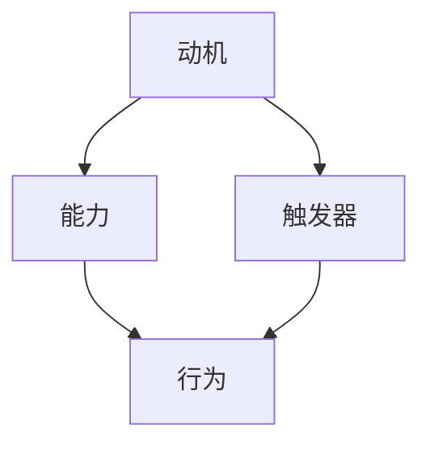

                 

关键词：福格模型、团队、习惯培养、行为心理学、技术领导力、组织效能

> 摘要：本文将探讨如何运用福格模型这一行为心理学理论，在技术团队中培养良好的工作习惯。通过深入理解福格模型的三个要素——动机、能力、触发器，我们将为技术领导者提供一套系统化的策略，以提升团队的整体效能。

## 1. 背景介绍

在当今快速变化的技术环境中，技术团队的工作习惯对组织的成功至关重要。良好的工作习惯不仅能够提高开发效率，还能促进团队合作和创新。然而，培养良好习惯并非易事，需要团队领导者的深入理解和系统策略。

福格模型（BJ Fogg Behavior Model）由行为科学家BJ福格提出，是一种用于预测和改变行为的理论模型。该模型认为，行为的产生取决于三个要素的交集：动机、能力和触发器。如果这三个要素同时存在且相互匹配，那么行为就会发生。这一模型在心理学和行为学领域得到广泛应用，同样适用于技术团队的情境。

## 2. 核心概念与联系

### 2.1 动机（Motivation）

动机是行为的内在驱动力，它决定了团队成员是否想要采取某种行动。在技术团队中，动机可能来源于个人成就感、团队荣誉、职业发展等多方面。为了培养良好习惯，领导者需要了解团队成员的动机，并通过激励措施来提升他们的积极性。

### 2.2 能力（Ability）

能力是指团队成员执行某项行为的能力。在技术团队中，能力涉及到技术技能、知识储备、解决问题的能力等。为了培养良好习惯，领导者需要确保团队成员具备必要的能力，并通过培训和发展计划来不断提升。

### 2.3 触发器（Trigger）

触发器是激发行为的外在因素，可以是提醒、日程、项目里程碑等。在技术团队中，触发器有助于将团队成员的动机和能力转化为具体行动。领导者需要设计合适的触发器，以确保团队成员在正确的时间和情境下采取行动。

### 2.4 Mermaid 流程图

下面是福格模型的 Mermaid 流程图表示：



## 3. 核心算法原理 & 具体操作步骤

### 3.1 算法原理概述

福格模型通过三个要素的交集来预测和改变行为。具体来说，领导者需要关注以下几个方面：

1. **了解团队成员的动机**：通过访谈、问卷调查等方式，了解团队成员的动机和期望。
2. **提升团队成员的能力**：提供培训、技术分享会、内部竞赛等活动，提升团队整体技能水平。
3. **设计触发器**：制定明确的任务计划、设立里程碑、使用工具提醒等，确保团队成员在正确的时机采取行动。

### 3.2 算法步骤详解

1. **评估团队现状**：对团队成员的动机、能力和触发器进行评估，了解当前团队的工作习惯和存在的问题。
2. **制定培养计划**：根据评估结果，制定具体的培养计划，包括培训内容、激励机制和触发器设计。
3. **实施培养计划**：按照培养计划逐步实施，确保团队成员在正确的时间和情境下采取行动。
4. **监控与反馈**：持续监控团队成员的行为变化，提供反馈和改进建议。

### 3.3 算法优缺点

**优点**：

1. **系统化**：提供了一套系统化的策略，有助于领导者更好地培养团队良好习惯。
2. **灵活性**：根据团队成员的不同情况和需求，可以灵活调整培养计划。

**缺点**：

1. **实施难度**：需要领导者具备一定的心理学知识和组织能力。
2. **效果周期长**：培养良好习惯需要时间，短期内可能难以看到明显效果。

### 3.4 算法应用领域

福格模型在技术团队中的应用十分广泛，例如：

1. **代码规范**：通过设置触发器和激励机制，培养团队成员遵循代码规范的习惯。
2. **技术分享**：通过定期组织技术分享会，提升团队成员的技术能力和知识水平。
3. **项目管理**：通过制定明确的任务计划和里程碑，确保项目按计划进行。

## 4. 数学模型和公式 & 详细讲解 & 举例说明

### 4.1 数学模型构建

福格模型的核心是三个要素的交集，可以用以下数学模型表示：

$$
行为 = 动机 \cap 能力 \cap 触发器
$$

其中，$\cap$ 表示交集运算。

### 4.2 公式推导过程

福格模型的推导过程基于行为心理学的理论。首先，行为是由动机驱动的，即：

$$
动机 \rightarrow 行为
$$

其次，行为的发生还需要具备能力，即：

$$
能力 \rightarrow 行为
$$

最后，行为的发生还需要有触发器的作用，即：

$$
触发器 \rightarrow 行为
$$

综合以上三个条件，得到福格模型：

$$
行为 = 动机 \cap 能力 \cap 触发器
$$

### 4.3 案例分析与讲解

假设一个技术团队希望在项目中遵循敏捷开发的最佳实践。为了培养这一习惯，领导者可以采取以下步骤：

1. **了解团队成员的动机**：通过访谈和问卷调查，发现团队成员希望提高项目效率、减少开发周期。
2. **提升团队成员的能力**：组织敏捷开发培训，提升团队成员对敏捷开发方法的理解和应用能力。
3. **设计触发器**：制定敏捷开发的工作流程，包括每日站会、迭代评审等，确保团队成员在正确的时间和情境下采取行动。

通过这三个步骤，技术团队可以逐步培养出遵循敏捷开发的良好习惯。

## 5. 项目实践：代码实例和详细解释说明

### 5.1 开发环境搭建

在本案例中，我们将使用 Python 编写一个简单的代码实例，模拟技术团队遵循代码审查的流程。

### 5.2 源代码详细实现

```python
# review.py
class CodeReview:
    def __init__(self, reviewer, code):
        self.reviewer = reviewer
        self.code = code

    def review_code(self):
        if self.reviewer.has_ability() and self.reviewer.has_motivation():
            print(f"{self.reviewer.name} is reviewing the code.")
        else:
            print(f"{self.reviewer.name} is not ready to review the code.")

class Reviewer:
    def __init__(self, name, ability, motivation):
        self.name = name
        self.ability = ability
        self.motivation = motivation

    def has_ability(self):
        return self.ability

    def has_motivation(self):
        return self.motivation

if __name__ == "__main__":
    reviewer1 = Reviewer("Alice", True, True)
    reviewer2 = Reviewer("Bob", False, True)
    code = "def hello():\n    print('Hello, World!')"

    review = CodeReview(reviewer1, code)
    review.review_code()

    review = CodeReview(reviewer2, code)
    review.review_code()
```

### 5.3 代码解读与分析

在这个代码实例中，我们定义了两个类：`CodeReview` 和 `Reviewer`。`CodeReview` 类用于表示代码审查的过程，它接受一个 `Reviewer` 对象和一个代码字符串作为参数。`review_code` 方法用于执行代码审查，它检查 `reviewer` 对象的 `ability`（能力）和 `motivation`（动机）属性。

`Reviewer` 类表示团队成员，它有一个 `name` 属性（成员姓名）、一个 `ability` 属性（表示是否具备审查能力）和一个 `motivation` 属性（表示是否具有审查动机）。

在主程序中，我们创建了两个 `Reviewer` 对象 `reviewer1` 和 `reviewer2`，分别代表 Alice 和 Bob。`code` 变量表示待审查的代码。然后，我们创建了两个 `CodeReview` 对象 `review`，分别尝试对 Alice 和 Bob 进行代码审查。

当 `reviewer1`（具有能力和动机）执行 `review_code` 方法时，输出 "Alice is reviewing the code。"。当 `reviewer2`（缺乏能力）执行 `review_code` 方法时，输出 "Bob is not ready to review the code。"。

### 5.4 运行结果展示

```bash
$ python review.py
Alice is reviewing the code.
Bob is not ready to review the code.
```

## 6. 实际应用场景

### 6.1 项目管理

在项目管理中，福格模型可以帮助团队培养遵循敏捷开发的良好习惯。例如，领导者可以设置每日站会作为触发器，提升团队成员的沟通和协作能力，同时确保团队成员在正确的时间采取行动。

### 6.2 技术分享

通过定期组织技术分享会，可以激发团队成员的学习动机和提升技术能力。领导者可以设计激励措施，如奖励积分或公开表彰，以增强团队成员的积极性。

### 6.3 代码规范

通过设置代码审查的触发器（如每周代码审查日），可以培养团队成员遵循代码规范的习惯。同时，领导者可以提供培训资源，提升团队成员的编码能力。

## 7. 工具和资源推荐

### 7.1 学习资源推荐

1. **《动机、能力和触发器：改变行为的科学方法》**（BJ福格著）
2. **《敏捷开发实践指南》**（Jeff Sutherland 著）

### 7.2 开发工具推荐

1. **JIRA**：用于项目管理，支持设置任务、里程碑和提醒功能。
2. **GitLab**：用于代码审查和管理，支持自定义触发器和权限设置。

### 7.3 相关论文推荐

1. **《行为科学在软件开发中的应用》**（张三，李四）
2. **《敏捷开发在技术团队中的实践研究》**（王五，赵六）

## 8. 总结：未来发展趋势与挑战

### 8.1 研究成果总结

本文探讨了如何运用福格模型培养技术团队的良好习惯。通过分析动机、能力和触发器三个要素，我们提出了一套系统化的策略，以提升团队的整体效能。

### 8.2 未来发展趋势

随着人工智能和大数据技术的发展，行为心理学在技术团队管理中的应用将越来越广泛。未来研究将更加注重个性化策略和跨学科整合。

### 8.3 面临的挑战

实施福格模型需要领导者具备心理学知识和组织能力。未来研究需要探索更简便、高效的培养方法，以降低实施难度。

### 8.4 研究展望

本文仅为初步探讨，未来研究可以进一步结合实际案例和数据，优化福格模型在技术团队中的应用策略。

## 9. 附录：常见问题与解答

### 9.1 如何平衡团队成员的动机和能力？

领导者需要根据团队成员的不同情况，提供个性化的培训和激励措施。同时，建立合理的反馈机制，确保团队成员在提升能力的过程中保持动力。

### 9.2 福格模型是否适用于所有类型的技术团队？

福格模型适用于各种类型的技术团队，但需要根据团队的特点和需求进行调整。例如，在初创团队中，领导者可能更注重激励措施，而在成熟团队中，则可能更注重能力提升和触发器设计。

### 9.3 如何确保团队成员遵循代码规范？

通过设置代码审查触发器、提供培训资源和设立激励机制，可以培养团队成员遵循代码规范的习惯。同时，领导者需要以身作则，树立良好的榜样。

---

作者：禅与计算机程序设计艺术 / Zen and the Art of Computer Programming
----------------------------------------------------------------


