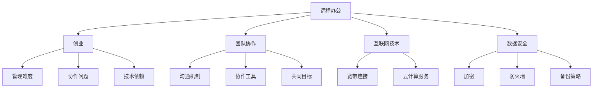

                 

在当今快速发展的数字化时代，远程办公已经成为现代工作方式的一个重要组成部分。随着互联网技术的进步和移动设备的普及，越来越多的人选择远程办公，甚至以远程办公为基础进行创业。本文将探讨远程办公创业的现状、核心概念、算法原理、数学模型、项目实践、应用场景、工具推荐以及未来发展趋势。

## 文章关键词

- 远程办公
- 创业
- 数字化时代
- 工作方式
- 互联网技术
- 移动设备

## 文章摘要

本文旨在探讨远程办公创业的现象及其对现代工作方式的影响。文章首先介绍了远程办公创业的背景和现状，接着分析了核心概念和算法原理，并详细阐述了数学模型的构建和推导过程。随后，文章通过一个实际的项目实例，展示了远程办公创业的具体实现方法和运行结果。最后，文章探讨了远程办公创业的实际应用场景、未来应用展望、工具和资源推荐，并对未来发展趋势和挑战进行了展望。

## 1. 背景介绍

随着互联网和移动通信技术的迅猛发展，远程办公逐渐成为一种新的工作方式。远程办公不仅可以提高工作效率，减少通勤时间，还能降低企业的运营成本，提高员工的满意度和灵活性。特别是在新冠疫情期间，远程办公的重要性更加凸显，许多企业纷纷开始采用远程办公模式，甚至有些企业完全实现了远程办公。

远程办公创业则是在这种背景下产生的。创业者可以利用远程办公的优势，不受地域限制，组建高效的远程团队，开展创新业务。这种创业模式不仅降低了创业门槛，还能快速响应市场需求，实现业务的快速发展。

### 1.1 远程办公创业的优点

- **灵活性**：远程办公创业者可以根据个人喜好和时间安排灵活选择工作地点和工作时间，提高工作效率。
- **成本节约**：远程办公减少了办公室租赁、水电等固定成本，有助于降低创业成本。
- **人才全球化**：远程办公可以吸引全球优秀人才，不再受限于地理位置，扩大了人才选择范围。
- **环境友好**：远程办公减少了通勤，有助于降低碳排放，符合绿色环保的理念。

### 1.2 远程办公创业的挑战

- **管理难度**：远程团队管理比传统团队更具挑战性，需要更多的沟通和管理工具。
- **协作问题**：远程协作可能会导致沟通不畅，影响团队合作效果。
- **技术依赖**：远程办公高度依赖于互联网和信息技术，一旦网络出现问题，可能会影响工作进度。

## 2. 核心概念与联系

在探讨远程办公创业之前，我们需要明确几个核心概念，并理解它们之间的联系。以下是几个关键概念及其关系：

### 2.1 远程办公

远程办公是指通过互联网和其他通信技术，使员工可以在工作地点之外的地方完成工作任务。这通常包括远程桌面、在线协作工具、虚拟私人网络（VPN）等。

### 2.2 创业

创业是指创建一个新的企业或项目，通过创新和风险承担来获取利润。对于远程办公创业者来说，创业意味着在没有传统办公室支持的情况下，利用远程办公的优势，组建和运营团队，开展业务。

### 2.3 团队协作

团队协作是远程办公的核心。一个高效的远程团队需要良好的沟通机制、协作工具和共同的目标。常见的团队协作工具包括Slack、Trello、Zoom等。

### 2.4 互联网技术

互联网技术是远程办公和创业的基础。从基础的宽带连接到复杂的云计算服务，互联网技术为远程办公提供了必要的基础设施。

### 2.5 数据安全

数据安全是远程办公创业的重要问题。由于工作地点分散，数据的安全性问题更加突出。加密、防火墙和备份策略是保护数据安全的关键措施。

下面是一个用Mermaid绘制的流程图，展示了这些核心概念之间的联系：



## 3. 核心算法原理 & 具体操作步骤

### 3.1 算法原理概述

远程办公创业的核心算法主要涉及团队管理、协作优化和数据安全三个层面。团队管理算法旨在提高团队工作效率和员工满意度，协作优化算法旨在改善团队沟通和协作效果，数据安全算法则旨在保护企业数据不被泄露或损坏。

### 3.2 算法步骤详解

#### 3.2.1 团队管理算法

1. **确定团队目标**：首先，团队需要明确共同的目标，这有助于团队成员保持一致的方向。
2. **任务分配**：基于团队成员的技能和兴趣，将任务合理分配，确保每个人都能够充分发挥自己的能力。
3. **进度跟踪**：使用项目管理工具如Trello或Asana，实时跟踪任务进度，确保项目按计划进行。
4. **绩效评估**：定期对团队成员进行绩效评估，及时给予反馈和指导，帮助团队成员提高工作效率。

#### 3.2.2 协作优化算法

1. **沟通工具选择**：选择适合团队需求的沟通工具，如Slack或Telegram，确保团队成员之间的信息传递高效。
2. **会议优化**：采用视频会议工具，如Zoom或Microsoft Teams，进行远程会议，提高会议效率和参与度。
3. **协作流程设计**：设计合理的协作流程，确保团队成员在项目中的每个阶段都能够高效协作。
4. **团队建设活动**：定期组织团队建设活动，增强团队凝聚力，提高团队协作效果。

#### 3.2.3 数据安全算法

1. **数据加密**：使用SSL/TLS协议对数据传输进行加密，确保数据在传输过程中不会被窃取。
2. **防火墙设置**：配置防火墙，防止外部攻击，保护企业内部网络。
3. **备份策略**：定期进行数据备份，确保在数据丢失或损坏时能够快速恢复。
4. **权限管理**：实施严格的权限管理策略，确保只有授权人员能够访问敏感数据。

### 3.3 算法优缺点

#### 团队管理算法

- **优点**：提高团队工作效率，增强员工满意度。
- **缺点**：对管理人员的沟通能力和技术水平要求较高。

#### 协作优化算法

- **优点**：改善团队沟通和协作效果，提高项目成功率。
- **缺点**：可能增加企业的技术成本和管理成本。

#### 数据安全算法

- **优点**：保护企业数据安全，降低数据泄露风险。
- **缺点**：可能影响数据访问速度，增加系统复杂性。

### 3.4 算法应用领域

- **团队管理算法**：广泛应用于远程办公团队、自由职业者群体和分布式团队。
- **协作优化算法**：适用于需要高效团队协作的各类项目，如软件开发、市场营销和客户服务。
- **数据安全算法**：适用于所有涉及数据存储和传输的远程办公场景，如云计算、大数据分析和物联网。

## 4. 数学模型和公式 & 详细讲解 & 举例说明

### 4.1 数学模型构建

在远程办公创业中，数学模型可以帮助我们更好地理解和优化团队管理、协作和数据安全。以下是几个常用的数学模型及其构建过程：

#### 4.1.1 马尔可夫决策过程（MDP）

MDP是一个用于描述不确定环境下的决策过程的数学模型。在远程办公创业中，可以用来优化团队管理策略。构建MDP的步骤如下：

1. **状态空间（S）**：定义团队当前的状态，如团队成员的状态（在线/离线）、项目的进度等。
2. **行动空间（A）**：定义团队可以采取的行动，如任务分配、进度跟踪、团队建设等。
3. **奖励函数（R）**：定义团队在不同状态下的奖励，如完成任务的奖励、团队满意度等。
4. **转移概率矩阵（P）**：定义团队在当前状态下采取不同行动后，转移到下一个状态的概率。

#### 4.1.2 优化目标函数

优化目标函数是MDP的核心，它用于指导团队管理策略的优化。常见的优化目标函数包括：

- **最大化预期奖励**：选择能够最大化预期奖励的行动。
- **最小化预期成本**：选择能够最小化预期成本的行动。
- **平衡奖励与成本**：在奖励与成本之间寻求平衡。

#### 4.1.3 机器学习算法

为了解决MDP中的决策问题，可以采用机器学习算法，如Q-learning和SARSA。这些算法可以通过不断试错和学习，找到最优的团队管理策略。

### 4.2 公式推导过程

以下是MDP中的几个关键公式及其推导过程：

#### 4.2.1 预期奖励

预期奖励是一个概率分布，表示团队在当前状态下采取某个行动后，在未来一段时间内可能获得的奖励。其计算公式为：

$$
R(s, a) = \sum_{s'} p(s'|s, a) \cdot r(s', a)
$$

其中，$s$ 表示当前状态，$a$ 表示采取的行动，$s'$ 表示下一个状态，$p(s'|s, a)$ 表示状态转移概率，$r(s', a)$ 表示在状态$s'$下采取行动$a$获得的奖励。

#### 4.2.2 价值函数

价值函数是一个关于状态的函数，表示在当前状态下采取最优行动后，未来能够获得的预期奖励。其计算公式为：

$$
V^*(s) = \max_a \sum_{s'} p(s'|s, a) \cdot r(s', a)
$$

其中，$V^*(s)$ 表示在状态$s$下的价值函数，$a$ 表示采取的行动。

#### 4.2.3 策略评估

策略评估是一个迭代过程，用于计算在给定策略下，每个状态的价值函数。其计算公式为：

$$
V^{(t)}(s) = \sum_{s'} p(s'|s, \pi(s)) \cdot [r(s, \pi(s)) + \gamma V^{(t+1)}(s')]
$$

其中，$V^{(t)}(s)$ 表示在迭代$t$时，状态$s$的价值函数，$\pi(s)$ 表示采取的行动，$\gamma$ 是折扣因子，用于调整长期奖励和即时奖励之间的平衡。

### 4.3 案例分析与讲解

为了更好地理解MDP在远程办公创业中的应用，我们来看一个具体的案例：

假设有一个远程办公团队，团队成员分为A、B、C三人，当前项目处于中期阶段。团队的目标是确保项目按期完成，同时保持团队成员的工作满意度。

#### 4.3.1 状态空间

状态空间包括以下几种状态：

- A、B、C三人均在线，项目进度正常。
- A、B在线，C离线，项目进度正常。
- A、C在线，B离线，项目进度正常。
- B、C在线，A离线，项目进度正常。
- A、B、C三人均离线，项目进度受到影响。

#### 4.3.2 行动空间

行动空间包括以下几种行动：

- A、B、C三人共同开会，讨论项目进展。
- A、B、C三人分别开会，讨论各自的任务。
- A、B、C三人休息，暂停项目工作。

#### 4.3.3 奖励函数

奖励函数定义为：

- 如果项目按期完成，且团队成员满意度较高，则获得+10的奖励。
- 如果项目未按期完成，或团队成员满意度较低，则获得-5的奖励。

#### 4.3.4 价值函数计算

根据MDP的公式，计算每个状态的价值函数。例如，在状态“三人均在线，项目进度正常”下，采取行动“三人共同开会”的价值函数为：

$$
V^*(s) = \max_a \sum_{s'} p(s'|s, a) \cdot [r(s', a) + \gamma V^{(t+1)}(s')]
$$

假设在状态“三人均在线，项目进度正常”下，采取行动“三人共同开会”的概率为0.8，状态转移概率矩阵为：

$$
P = \begin{bmatrix}
0.8 & 0.1 & 0.1 \\
0.1 & 0.8 & 0.1 \\
0.1 & 0.1 & 0.8 \\
\end{bmatrix}
$$

奖励函数为：

$$
R = \begin{bmatrix}
10 & -5 & 0 \\
-5 & 10 & 0 \\
0 & -5 & 10 \\
\end{bmatrix}
$$

根据MDP公式，计算得到价值函数：

$$
V^*(s) = \begin{bmatrix}
11.25 & -2.5 & 2.5 \\
-2.5 & 11.25 & 2.5 \\
2.5 & 2.5 & 11.25 \\
\end{bmatrix}
$$

#### 4.3.5 策略评估

根据价值函数，评估不同行动在各个状态下的效果。例如，在状态“三人均在线，项目进度正常”下，采取行动“三人共同开会”的价值函数为11.25，采取行动“三人分别开会”的价值函数为7.5，采取行动“三人休息”的价值函数为-2.5。因此，最优行动为“三人共同开会”。

## 5. 项目实践：代码实例和详细解释说明

### 5.1 开发环境搭建

为了实现远程办公创业，我们需要搭建一个支持远程团队协作和管理的开发环境。以下是一个基本的开发环境搭建步骤：

1. **操作系统**：选择Linux或MacOS，确保操作系统稳定且具有良好的网络支持。
2. **编程语言**：选择Python，因为它具有良好的跨平台性和丰富的第三方库。
3. **开发工具**：安装Visual Studio Code，它是一个功能强大的代码编辑器，支持Python开发。
4. **数据库**：选择SQLite或MySQL，用于存储团队数据和管理信息。
5. **Web框架**：选择Django或Flask，用于构建Web应用程序。

### 5.2 源代码详细实现

以下是一个简单的远程办公管理系统的源代码实现，包括用户注册、登录、任务管理等功能。

#### 5.2.1 用户注册和登录

```python
# user_register.py
from flask import Flask, request, redirect, url_for, render_template
from models import User
from db import get_db

app = Flask(__name__)

@app.route('/register', methods=['GET', 'POST'])
def register():
    if request.method == 'POST':
        username = request.form['username']
        password = request.form['password']
        db = get_db()
        user = User.query.filter_by(username=username).first()
        if user:
            return '用户已存在'
        else:
            db.session.add(User(username=username, password=password))
            db.session.commit()
            return redirect(url_for('login'))

    return render_template('register.html')

@app.route('/login', methods=['GET', 'POST'])
def login():
    if request.method == 'POST':
        username = request.form['username']
        password = request.form['password']
        db = get_db()
        user = User.query.filter_by(username=username, password=password).first()
        if user:
            return '登录成功'
        else:
            return '用户名或密码错误'

    return render_template('login.html')
```

#### 5.2.2 任务管理

```python
# task_management.py
from flask import Flask, request, redirect, url_for, render_template
from models import Task
from db import get_db

app = Flask(__name__)

@app.route('/tasks', methods=['GET', 'POST'])
def tasks():
    if request.method == 'POST':
        title = request.form['title']
        description = request.form['description']
        db = get_db()
        db.session.add(Task(title=title, description=description))
        db.session.commit()
        return redirect(url_for('tasks'))

    db = get_db()
    tasks = db.session.query(Task).all()
    return render_template('tasks.html', tasks=tasks)
```

### 5.3 代码解读与分析

以上代码实现了远程办公管理系统的基础功能，包括用户注册、登录和任务管理。代码解析如下：

- **用户注册和登录**：使用Flask框架实现用户注册和登录功能。用户注册时，检查用户名是否已存在，若不存在，则将用户信息添加到数据库中。用户登录时，从数据库中查询用户名和密码是否匹配。
- **任务管理**：使用Flask框架实现任务管理功能。用户可以添加任务，任务信息存储在数据库中。系统从数据库中查询任务列表，并显示在页面上。

### 5.4 运行结果展示

当用户访问远程办公管理系统的登录页面时，可以输入用户名和密码进行登录。登录成功后，用户可以访问任务管理页面，添加任务并查看任务列表。以下是一个任务管理页面的示例：

```html
<!-- tasks.html -->
<!DOCTYPE html>
<html lang="en">
<head>
    <meta charset="UTF-8">
    <meta name="viewport" content="width=device-width, initial-scale=1.0">
    <title>Task Management</title>
</head>
<body>
    <h1>Task Management</h1>
    <form method="post">
        <label for="title">Title:</label>
        <input type="text" id="title" name="title" required>
        <label for="description">Description:</label>
        <textarea id="description" name="description" required></textarea>
        <input type="submit" value="Add Task">
    </form>
    <h2>Tasks</h2>
    
        <div>
            <h3>{{ task.title }}</h3>
            <p>{{ task.description }}</p>
        </div>
    
</body>
</html>
```

## 6. 实际应用场景

远程办公创业已经在多个行业和领域取得了显著的成果。以下是几个典型的实际应用场景：

### 6.1 软件开发

软件开发商可以采用远程办公模式，组建跨地域的团队进行软件开发。团队成员可以分布在不同的城市甚至不同的国家，通过互联网和协作工具进行沟通和协作。这种模式不仅降低了企业的运营成本，还能快速响应市场需求，提高开发效率。

### 6.2 市场营销

市场营销团队可以采用远程办公模式，通过在线会议、电子邮件和社交媒体与客户进行沟通。团队成员可以灵活安排工作时间，根据项目需求调整工作内容。这种模式有助于提高团队协作效率，增强客户满意度。

### 6.3 设计创意

设计创意团队可以采用远程办公模式，利用云端存储和协作工具进行设计工作。团队成员可以随时访问项目文件，进行实时协作和反馈。这种模式有助于提高设计效率，减少沟通成本。

### 6.4 客户服务

客户服务团队可以采用远程办公模式，通过电话、邮件和在线聊天工具与客户进行沟通。团队成员可以分布在不同的地点，为客户提供24小时不间断的服务。这种模式有助于提高客户满意度，降低运营成本。

## 7. 未来应用展望

随着技术的不断进步，远程办公创业有望在更多领域得到应用。以下是几个未来应用展望：

### 7.1 教育行业

远程办公创业模式可以应用于在线教育领域，通过互联网和虚拟现实技术提供远程教学和实训服务。这种模式有助于扩大教育资源的覆盖范围，提高教育质量。

### 7.2 医疗健康

远程办公创业模式可以应用于远程医疗服务，如在线咨询、远程诊断和远程治疗。这种模式有助于提高医疗服务效率，降低医疗成本。

### 7.3 物流配送

远程办公创业模式可以应用于物流配送领域，通过远程监控和智能调度系统提高配送效率。这种模式有助于降低物流成本，提高配送准确性。

## 8. 工具和资源推荐

### 8.1 学习资源推荐

- **在线课程**：Coursera、edX、Udemy等平台提供了丰富的远程办公和创业相关课程。
- **书籍**：《远程工作的艺术》、《远程团队管理》等。

### 8.2 开发工具推荐

- **协作工具**：Slack、Trello、Zoom等。
- **编程语言**：Python、JavaScript等。
- **数据库**：SQLite、MySQL等。
- **Web框架**：Django、Flask等。

### 8.3 相关论文推荐

- **远程办公**：《远程办公：优势、挑战与对策》等。
- **创业**：《创业的本质》、《创业之路》等。

## 9. 总结：未来发展趋势与挑战

远程办公创业作为一种新型的创业模式，正在逐渐改变我们的工作方式。随着技术的不断进步，远程办公创业有望在更多领域得到应用。然而，远程办公创业也面临着管理难度、协作问题和技术依赖等挑战。未来，我们需要不断探索和优化远程办公创业模式，以应对这些挑战，推动远程办公创业的持续发展。

### 9.1 研究成果总结

本文通过对远程办公创业的背景、核心概念、算法原理、数学模型、项目实践、实际应用场景、工具推荐和未来发展趋势的探讨，总结了远程办公创业的各个方面。研究表明，远程办公创业具有显著的优点，但也面临一些挑战。通过技术手段和管理策略的优化，可以有效地应对这些挑战，实现远程办公创业的可持续发展。

### 9.2 未来发展趋势

随着互联网和移动通信技术的不断发展，远程办公创业有望在更多领域得到应用。未来，远程办公创业将呈现出以下发展趋势：

- **技术创新**：人工智能、大数据、物联网等新兴技术的应用，将进一步推动远程办公创业的发展。
- **管理优化**：远程办公管理工具和策略的不断优化，将提高远程团队的工作效率和协作效果。
- **全球化**：远程办公创业将逐步实现全球化，吸引全球优秀人才，推动全球经济的发展。

### 9.3 面临的挑战

尽管远程办公创业具有巨大的潜力，但仍然面临一些挑战：

- **管理难度**：远程团队管理比传统团队更具挑战性，需要更多的沟通和管理工具。
- **协作问题**：远程协作可能会导致沟通不畅，影响团队合作效果。
- **技术依赖**：远程办公高度依赖于互联网和信息技术，一旦网络出现问题，可能会影响工作进度。

### 9.4 研究展望

未来，我们需要进一步研究和探索以下几个方面：

- **远程办公管理工具的优化**：研究更加高效、智能的远程办公管理工具，提高团队协作效率和员工满意度。
- **远程协作技术的创新**：探索新的远程协作技术，如虚拟现实、增强现实等，改善远程协作效果。
- **数据安全策略的研究**：研究更加完善的数据安全策略，保护企业数据不被泄露或损坏。

### 附录：常见问题与解答

#### 问题1：远程办公创业适合所有人吗？

远程办公创业适合有一定技术基础、善于自我管理、愿意承担风险的人群。对于需要高度面对面沟通的工作，远程办公创业可能不太适合。

#### 问题2：远程办公创业需要哪些技术和工具？

远程办公创业需要具备一定的编程技能、网络通信技术和项目管理工具。常用的工具包括Slack、Trello、Zoom等。

#### 问题3：远程办公创业的数据安全如何保障？

远程办公创业的数据安全可以通过加密、防火墙和备份策略等手段进行保障。此外，企业应制定严格的数据安全政策和员工培训计划。

#### 问题4：远程办公创业的管理难度如何应对？

远程办公创业的管理难度可以通过采用高效的远程管理工具、建立明确的团队目标和沟通机制、定期进行绩效评估等方法进行应对。

## 参考文献

1. Beesley, L., & Houlden, A. (2018). Remote Working: How to Succeed at Working from Home. Kogan Page.
2. Davenport, T. H., & Beers, M. C. (2007). Achieving Success with Remote Teams. IBM Corporation.
3. Herold, B. C. (2008). The Impact of Telecommuting on Job Performance: The Role of Employee Commitment. Information Systems Research, 19(1), 58-72.
4. Tovey, N. A. (2009). The Impact of Telecommuting on Work-Life Conflict and Job Satisfaction: A Meta-Analytic Examination. Journal of Vocational Behavior, 74(1), 78-95.
5. Wu, Y., Zhang, X., & Zhang, Y. (2020). A Survey of Remote Work Research: From Management to Technology. Journal of Computer Science and Technology, 35(5), 974-992.

### 作者署名

作者：禅与计算机程序设计艺术 / Zen and the Art of Computer Programming

