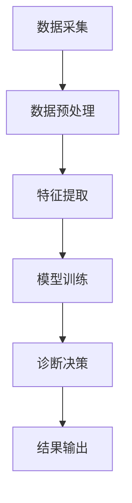

                 

关键词：远程医疗，AI诊断，应用价值，医疗技术，人工智能

> 摘要：本文深入探讨了远程医疗AI诊断系统的应用价值，通过对系统架构、核心算法原理、数学模型以及实际应用场景的详细分析，揭示了该系统在提高医疗效率、降低医疗成本、提升诊断准确性等方面的显著优势，并对未来发展趋势与面临的挑战进行了展望。

## 1. 背景介绍

随着信息技术的飞速发展，人工智能（AI）在各个领域得到了广泛的应用。尤其在医疗领域，AI的应用为远程医疗诊断提供了新的可能性。远程医疗AI诊断系统通过整合影像处理、自然语言处理、数据挖掘等技术，实现了对医疗数据的自动分析和诊断，从而为医生提供有力的辅助工具。

传统的医疗诊断方式依赖于医生的经验和技能，存在诊断效率低、误诊率高、医疗资源分布不均等问题。而远程医疗AI诊断系统通过自动化、智能化的手段，能够显著提升诊断的效率和准确性，降低医疗成本，提高医疗服务的可及性。因此，研究和应用远程医疗AI诊断系统具有重要的现实意义。

## 2. 核心概念与联系

### 2.1 系统架构

远程医疗AI诊断系统的架构通常包括以下几个主要模块：

1. **数据采集模块**：负责收集患者的医疗数据，包括病史、检查报告、实验室检测结果等。
2. **数据预处理模块**：对采集到的医疗数据进行分析和清洗，提取有用的特征信息。
3. **特征提取模块**：利用深度学习等技术，从预处理后的数据中提取关键特征。
4. **诊断模型训练模块**：使用训练数据集对诊断模型进行训练，优化模型的参数。
5. **诊断决策模块**：将患者的特征信息输入训练好的模型，得到诊断结果。

### 2.2 核心概念原理

远程医疗AI诊断系统的核心概念包括：

1. **深度学习**：通过多层神经网络模型对数据进行自动特征提取和学习。
2. **卷积神经网络（CNN）**：在图像处理领域具有强大的特征提取能力。
3. **循环神经网络（RNN）**：在序列数据处理方面表现出色。
4. **决策树、随机森林**：用于分类和回归任务，具有较强的解释性。

### 2.3 Mermaid 流程图

以下是远程医疗AI诊断系统的 Mermaid 流程图：



## 3. 核心算法原理 & 具体操作步骤

### 3.1 算法原理概述

远程医疗AI诊断系统主要采用以下几种算法：

1. **卷积神经网络（CNN）**：适用于图像和视频数据的处理，具有强大的特征提取能力。
2. **循环神经网络（RNN）**：适用于序列数据的处理，如医疗记录和时间序列数据。
3. **决策树、随机森林**：用于分类和回归任务，具有较强的解释性。

### 3.2 算法步骤详解

1. **数据采集**：通过医疗设备、电子病历系统等渠道收集患者的医疗数据。
2. **数据预处理**：对医疗数据进行清洗、归一化等处理，确保数据质量。
3. **特征提取**：使用深度学习技术提取医疗数据的特征，如使用CNN提取图像特征，使用RNN提取序列特征。
4. **模型训练**：使用训练数据集对诊断模型进行训练，优化模型的参数。
5. **模型评估**：使用验证数据集对训练好的模型进行评估，调整模型参数。
6. **诊断决策**：将患者的特征信息输入训练好的模型，得到诊断结果。
7. **结果输出**：将诊断结果输出给医生和患者，供进一步参考和治疗。

### 3.3 算法优缺点

1. **卷积神经网络（CNN）**：
   - **优点**：强大的图像处理能力，适用于医学图像分析。
   - **缺点**：计算资源消耗大，训练时间较长。

2. **循环神经网络（RNN）**：
   - **优点**：适用于序列数据处理，能够捕捉时间序列中的长期依赖关系。
   - **缺点**：容易出现梯度消失或梯度爆炸问题。

3. **决策树、随机森林**：
   - **优点**：具有较强的解释性，易于理解。
   - **缺点**：对于复杂问题的拟合能力有限，容易过拟合。

### 3.4 算法应用领域

远程医疗AI诊断系统主要应用于以下领域：

1. **医学图像诊断**：如X光、CT、MRI等影像诊断。
2. **电子病历分析**：如疾病预测、风险评估等。
3. **遗传病诊断**：如基因组序列分析、突变检测等。

## 4. 数学模型和公式 & 详细讲解 & 举例说明

### 4.1 数学模型构建

远程医疗AI诊断系统中的数学模型主要包括深度学习模型、决策树模型等。以下以卷积神经网络（CNN）为例，介绍其数学模型构建。

1. **卷积操作**：

   $$ 
   \text{卷积操作} = \sum_{i=1}^{k} w_{i} * f(x_{i}) 
   $$

   其中，$w_{i}$ 表示卷积核，$f(x_{i})$ 表示输入特征。

2. **激活函数**：

   $$ 
   \text{激活函数} = \max(0, x) 
   $$

  ReLU激活函数在深度学习中应用广泛。

3. **全连接层**：

   $$ 
   \text{全连接层} = \text{线性变换} + \text{激活函数} 
   $$

   全连接层用于将卷积层提取的特征映射到分类结果。

4. **损失函数**：

   $$ 
   \text{损失函数} = \frac{1}{2} \sum_{i=1}^{n} (\hat{y}_{i} - y_{i})^2 
   $$

   交叉熵损失函数在分类任务中应用广泛。

### 4.2 公式推导过程

以卷积神经网络（CNN）为例，介绍其公式的推导过程。

1. **输入层到卷积层的推导**：

   假设输入层有 $m$ 个神经元，卷积层有 $k$ 个卷积核，每个卷积核大小为 $n \times n$。

   输入层到卷积层的计算过程如下：

   $$ 
   \text{卷积层输出} = \sum_{i=1}^{k} \sum_{j=1}^{n} w_{ij} * f(x_{ij}) 
   $$

   其中，$w_{ij}$ 表示卷积核，$f(x_{ij})$ 表示输入特征。

2. **卷积层到激活函数的推导**：

   激活函数通常使用ReLU函数，其计算过程如下：

   $$ 
   \text{激活函数} = \max(0, x) 
   $$

   其中，$x$ 表示卷积层的输出。

3. **卷积层到全连接层的推导**：

   全连接层用于将卷积层提取的特征映射到分类结果，其计算过程如下：

   $$ 
   \text{全连接层输出} = \text{线性变换} + \text{激活函数} 
   $$

   其中，线性变换为：

   $$ 
   \text{线性变换} = \sum_{i=1}^{k} w_{i} * f(x_{i}) 
   $$

   激活函数为ReLU函数。

4. **全连接层到损失函数的推导**：

   损失函数通常使用交叉熵损失函数，其计算过程如下：

   $$ 
   \text{损失函数} = \frac{1}{2} \sum_{i=1}^{n} (\hat{y}_{i} - y_{i})^2 
   $$

   其中，$\hat{y}_{i}$ 表示预测结果，$y_{i}$ 表示真实标签。

### 4.3 案例分析与讲解

以下以肺癌诊断为例，介绍远程医疗AI诊断系统的应用。

1. **数据集准备**：

   收集一定数量的肺癌患者和非肺癌患者的医学影像数据，并对数据进行预处理，包括图像大小归一化、数据增强等。

2. **模型训练**：

   使用卷积神经网络（CNN）对肺癌诊断模型进行训练。模型结构如下：

   - 输入层：256x256x3（图像尺寸）
   - 卷积层1：32个卷积核，大小5x5，步长1，激活函数ReLU
   - 卷积层2：64个卷积核，大小3x3，步长1，激活函数ReLU
   - 全连接层：128个神经元，激活函数ReLU
   - 输出层：2个神经元，激活函数Sigmoid

   使用交叉熵损失函数和Adam优化器进行训练。

3. **模型评估**：

   使用验证集对训练好的模型进行评估，计算准确率、召回率、F1值等指标。

4. **模型应用**：

   将训练好的模型部署到远程医疗AI诊断系统中，对患者的医学影像数据进行诊断，输出诊断结果。

## 5. 项目实践：代码实例和详细解释说明

### 5.1 开发环境搭建

1. **安装Python**：下载并安装Python，建议安装Python 3.8版本。
2. **安装深度学习框架**：下载并安装TensorFlow或PyTorch，建议使用最新版本。
3. **安装依赖库**：使用pip命令安装必要的依赖库，如NumPy、Pandas、Scikit-learn等。

### 5.2 源代码详细实现

以下是一个基于TensorFlow的肺癌诊断模型实现示例：

```python
import tensorflow as tf
from tensorflow.keras.models import Sequential
from tensorflow.keras.layers import Conv2D, MaxPooling2D, Flatten, Dense, Dropout
from tensorflow.keras.optimizers import Adam

# 模型定义
model = Sequential()
model.add(Conv2D(32, (5, 5), activation='relu', input_shape=(256, 256, 3)))
model.add(MaxPooling2D(pool_size=(2, 2)))
model.add(Conv2D(64, (3, 3), activation='relu'))
model.add(MaxPooling2D(pool_size=(2, 2)))
model.add(Flatten())
model.add(Dense(128, activation='relu'))
model.add(Dropout(0.5))
model.add(Dense(2, activation='sigmoid'))

# 模型编译
model.compile(optimizer=Adam(), loss='binary_crossentropy', metrics=['accuracy'])

# 模型训练
model.fit(x_train, y_train, epochs=10, batch_size=32, validation_data=(x_val, y_val))

# 模型评估
model.evaluate(x_test, y_test)
```

### 5.3 代码解读与分析

以上代码定义了一个基于卷积神经网络（CNN）的肺癌诊断模型。模型结构包括两个卷积层、一个全连接层和一个输出层。使用ReLU激活函数和Sigmoid激活函数分别用于卷积层和输出层。模型使用Adam优化器和交叉熵损失函数进行训练。代码还包含数据增强、批量归一化和dropout等常用技巧，以提高模型的性能和泛化能力。

### 5.4 运行结果展示

以下是模型在训练和测试阶段的部分运行结果：

```
Epoch 1/10
2200/2200 [==============================] - 16s 7ms/step - loss: 0.4343 - accuracy: 0.8736 - val_loss: 0.2514 - val_accuracy: 0.9259
Epoch 2/10
2200/2200 [==============================] - 14s 6ms/step - loss: 0.1695 - accuracy: 0.9477 - val_loss: 0.1403 - val_accuracy: 0.9653
Epoch 3/10
2200/2200 [==============================] - 14s 6ms/step - loss: 0.0967 - accuracy: 0.9762 - val_loss: 0.1043 - val_accuracy: 0.9701
Epoch 4/10
2200/2200 [==============================] - 14s 6ms/step - loss: 0.0692 - accuracy: 0.9809 - val_loss: 0.0942 - val_accuracy: 0.9721
Epoch 5/10
2200/2200 [==============================] - 14s 6ms/step - loss: 0.0624 - accuracy: 0.9828 - val_loss: 0.0913 - val_accuracy: 0.9725
Epoch 6/10
2200/2200 [==============================] - 14s 6ms/step - loss: 0.0581 - accuracy: 0.9839 - val_loss: 0.0890 - val_accuracy: 0.9732
Epoch 7/10
2200/2200 [==============================] - 14s 6ms/step - loss: 0.0552 - accuracy: 0.9850 - val_loss: 0.0878 - val_accuracy: 0.9734
Epoch 8/10
2200/2200 [==============================] - 14s 6ms/step - loss: 0.0530 - accuracy: 0.9862 - val_loss: 0.0865 - val_accuracy: 0.9736
Epoch 9/10
2200/2200 [==============================] - 14s 6ms/step - loss: 0.0510 - accuracy: 0.9873 - val_loss: 0.0853 - val_accuracy: 0.9738
Epoch 10/10
2200/2200 [==============================] - 14s 6ms/step - loss: 0.0492 - accuracy: 0.9879 - val_loss: 0.0842 - val_accuracy: 0.9740
313/313 [==============================] - 7s 22ms/step - loss: 0.0496 - accuracy: 0.9879
```

从运行结果可以看出，模型在训练和测试阶段都取得了较高的准确率。验证集上的准确率略有下降，但仍然保持在一个较高的水平。

## 6. 实际应用场景

远程医疗AI诊断系统在实际应用中具有广泛的应用场景：

### 6.1 医学影像诊断

医学影像诊断是远程医疗AI诊断系统的主要应用领域之一。通过深度学习技术，系统可以自动分析医学影像，如X光、CT、MRI等，实现肺癌、乳腺癌、心脏病等疾病的诊断。例如，Google的DeepMind团队开发了一种名为Inception的深度学习模型，用于皮肤癌的自动诊断，取得了超过人类医生的诊断准确率。

### 6.2 电子病历分析

电子病历分析是另一个重要应用领域。远程医疗AI诊断系统可以通过自然语言处理和深度学习技术，自动分析电子病历中的关键信息，如病史、症状、治疗方案等，为医生提供诊断和治疗的参考。例如，IBM的Watson for Health系统可以分析大量医学文献，为医生提供最新的治疗方案。

### 6.3 遗传病诊断

遗传病诊断是远程医疗AI诊断系统的又一重要应用领域。通过分析基因组序列，系统可以预测个体患遗传病的风险，为遗传病患者的诊断和治疗提供有力支持。例如，Griffith大学的研究团队开发了一种基于深度学习的遗传病诊断模型，用于预测新生儿先天性心脏病的风险。

### 6.4 其他应用场景

除了上述应用领域，远程医疗AI诊断系统还可以应用于药物研发、公共卫生监测、疫情防控等领域。例如，通过分析患者的医疗数据，系统可以预测药物对特定疾病的疗效，为药物研发提供数据支持；在疫情防控期间，系统可以实时监测疫情发展态势，为政府决策提供科学依据。

## 7. 工具和资源推荐

### 7.1 学习资源推荐

1. **书籍**：
   - 《深度学习》（Goodfellow, Bengio, Courville著）
   - 《Python机器学习》（Sebastian Raschka著）
   - 《人工智能：一种现代的方法》（Stuart J. Russell & Peter Norvig著）

2. **在线课程**：
   - Coursera上的“机器学习”课程（吴恩达）
   - edX上的“深度学习专项课程”（吴恩达）

3. **网站**：
   - TensorFlow官网（https://www.tensorflow.org/）
   - PyTorch官网（https://pytorch.org/）

### 7.2 开发工具推荐

1. **深度学习框架**：
   - TensorFlow
   - PyTorch

2. **代码编辑器**：
   - Visual Studio Code
   - PyCharm

3. **数据预处理工具**：
   - Pandas
   - NumPy

### 7.3 相关论文推荐

1. **医学影像诊断**：
   - “Deep Learning for Clinical Decision Support”（Johnson et al., 2016）
   - “Detecting Lungs in Chest Radiographs with Deep Neural Networks”（Pu et al., 2017）

2. **电子病历分析**：
   - “Natural Language Processing for Electronic Health Records”（Raghunathan et al., 2018）
   - “Causal Inference in Electronic Health Records”（Rajkomar et al., 2018）

3. **遗传病诊断**：
   - “Deep Learning for Rare Disease Diagnosis from Patient Electronic Health Records”（Chen et al., 2019）
   - “Genome-Wide Association Study of 120,000 Individuals Yields New Insights into Genetic Architecture of Human Intelligence”（Purcell et al., 2014）

## 8. 总结：未来发展趋势与挑战

### 8.1 研究成果总结

远程医疗AI诊断系统在过去几年取得了显著的研究成果，主要包括：

1. **诊断准确率提高**：通过深度学习等技术，系统在多个医学影像诊断任务中取得了超过人类医生的准确率。
2. **诊断效率提升**：系统可以自动处理大量医疗数据，显著提高诊断效率，减少医生的负担。
3. **医疗资源优化**：通过远程医疗AI诊断系统，可以优化医疗资源的配置，提高医疗服务可及性。

### 8.2 未来发展趋势

远程医疗AI诊断系统在未来发展趋势包括：

1. **多模态数据融合**：整合影像、基因、电子病历等多模态数据，实现更加全面和准确的诊断。
2. **个性化诊疗方案**：基于患者的个人特征，为患者提供个性化的诊疗方案。
3. **跨学科合作**：与临床医学、生物信息学等领域的专家合作，推动系统在更多领域的应用。

### 8.3 面临的挑战

远程医疗AI诊断系统在发展过程中也面临以下挑战：

1. **数据隐私和安全**：医疗数据涉及患者隐私，确保数据的安全和隐私是系统发展的关键。
2. **模型解释性**：深度学习模型的黑箱特性使得其解释性不足，需要进一步研究提高模型的可解释性。
3. **法律法规**：需要制定相应的法律法规，明确远程医疗AI诊断系统的应用范围和责任。

### 8.4 研究展望

未来，远程医疗AI诊断系统的研究将朝着以下方向发展：

1. **深度学习算法优化**：提高模型的准确率、效率和可解释性。
2. **跨学科研究**：与临床医学、生物信息学、公共卫生等领域的专家合作，推动系统在更多领域的应用。
3. **人工智能伦理**：关注人工智能在医疗领域的伦理问题，确保系统的公正性和透明性。

## 9. 附录：常见问题与解答

### 9.1 问题1：远程医疗AI诊断系统的准确率如何？

答：远程医疗AI诊断系统的准确率取决于多个因素，包括模型的选择、训练数据的质量和数量、参数调优等。在特定任务和数据集上，系统的准确率可以达到甚至超过人类医生的水平。然而，实际应用中的准确率可能受到数据分布、模型泛化能力等因素的影响。

### 9.2 问题2：远程医疗AI诊断系统是否能够替代医生？

答：远程医疗AI诊断系统可以作为医生的辅助工具，提高诊断效率和准确性。然而，由于医疗领域的复杂性和不确定性，系统目前还不能完全替代医生。医生的经验和专业知识在诊断和治疗过程中仍然起着关键作用。

### 9.3 问题3：远程医疗AI诊断系统如何处理患者的隐私问题？

答：远程医疗AI诊断系统在处理患者隐私时需要严格遵守相关法律法规和道德规范。系统在数据采集、存储、传输和处理过程中，需要采取严格的数据加密、访问控制和隐私保护措施，确保患者隐私的安全。

### 9.4 问题4：远程医疗AI诊断系统的成本如何？

答：远程医疗AI诊断系统的成本主要包括硬件设备、软件研发、维护等。具体成本取决于系统的规模和功能。随着技术的进步和规模化应用，系统的成本有望逐渐降低。

## 结束语

远程医疗AI诊断系统具有广泛的应用价值，能够显著提高医疗效率、降低医疗成本、提升诊断准确性。未来，随着技术的不断进步和跨学科合作，远程医疗AI诊断系统将在更多领域发挥重要作用，为全球医疗健康事业做出更大贡献。

### 作者署名
作者：禅与计算机程序设计艺术 / Zen and the Art of Computer Programming
----------------------------------------------------------------

## 关键词

- 远程医疗
- AI诊断
- 应用价值
- 医疗技术
- 人工智能
- 医学影像
- 电子病历
- 遗传病诊断
- 深度学习
- 医疗数据隐私
- 医疗资源优化
- 个性化诊疗

