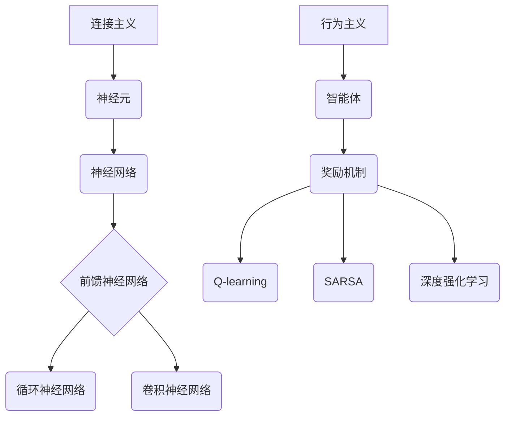

                 

关键词：连接主义，行为主义，神经可塑性，人工智能，机器学习，神经网络，深度学习，强化学习，计算模型，认知科学，人机交互。

> 摘要：本文旨在探讨连接主义和行为主义在人工智能领域的潜力和应用。通过对两种理论的基本概念、发展历史、核心算法和数学模型的介绍，我们将深入分析其在现代计算模型、认知科学和人机交互中的重要性，并展望其未来发展的趋势和面临的挑战。

## 1. 背景介绍

连接主义和行为主义是人工智能领域的两大重要分支。连接主义以神经科学为基础，试图模拟人脑的计算过程，通过神经网络进行信息处理。行为主义则关注人工智能系统的行为表现，强调通过学习环境中的反馈进行优化。这两种理论在人工智能的发展历程中都有着重要的地位，并在不同的场景中展现出强大的应用潜力。

### 连接主义的历史与发展

连接主义起源于20世纪40年代，由心理学家McCulloch和数学家Pitts提出的一种计算模型——神经网络。随后，Hubel和Wiesel通过研究猫的大脑视觉皮层，发现了神经元之间的连接方式与视觉感知的紧密关系，这进一步推动了连接主义的发展。

20世纪80年代，反向传播算法（Backpropagation）的提出使得多层神经网络的训练成为可能，引发了深度学习的兴起。近年来，随着计算能力的提升和大数据技术的发展，深度学习在图像识别、语音识别、自然语言处理等领域取得了显著成果。

### 行为主义的历史与发展

行为主义在人工智能中的起源可以追溯到20世纪50年代的启发式搜索算法（如A*算法）和逻辑推理系统。随着机器学习理论的发展，尤其是基于奖励的强化学习算法（如Q-learning、SARSA），行为主义在智能体自主决策和复杂环境中的行为优化方面展现了强大的潜力。

近年来，强化学习在游戏AI、无人驾驶、机器人控制等领域取得了突破性进展，使得行为主义成为人工智能研究的一个热点。

## 2. 核心概念与联系

### 连接主义的核心概念

连接主义的核心概念是神经元和神经网络。神经元是神经网络的基本单元，通过突触连接形成复杂的网络结构。神经网络通过学习输入和输出之间的关系，实现对数据的处理和模式的识别。

连接主义的架构可以分为三类：前馈神经网络（Feedforward Neural Network，FNN）、循环神经网络（Recurrent Neural Network，RNN）和卷积神经网络（Convolutional Neural Network，CNN）。这些神经网络在结构上有所不同，但在功能上都是为了模拟人脑的计算过程。

### 行为主义的核心概念

行为主义的核心概念是智能体（Agent）和奖励机制。智能体是指具备自主决策能力的系统，可以感知环境并进行行为选择。奖励机制则是通过奖励信号引导智能体学习最优行为策略。

行为主义的主要算法包括：

- **Q-learning**：通过值函数逼近最优策略。
- **SARSA**：一种带有探索机制的Q-learning算法。
- **深度强化学习**：结合深度学习与强化学习，实现复杂环境的自主决策。

### Mermaid 流程图



## 3. 核心算法原理 & 具体操作步骤

### 3.1 算法原理概述

连接主义的核心算法包括：

- **反向传播算法**：用于训练多层神经网络。
- **梯度下降法**：用于优化神经网络参数。

行为主义的核心算法包括：

- **Q-learning**：通过值函数更新策略。
- **SARSA**：在Q-learning基础上引入探索机制。
- **深度强化学习**：结合深度学习和强化学习，实现复杂环境的自主决策。

### 3.2 算法步骤详解

#### 3.2.1 反向传播算法

1. 前向传播：计算网络输出。
2. 计算损失函数。
3. 反向传播：计算梯度。
4. 更新网络参数。

#### 3.2.2 Q-learning

1. 初始化Q值表。
2. 选择动作：利用ε-贪心策略。
3. 执行动作，获得奖励和下一个状态。
4. 更新Q值：$$Q(s, a) = Q(s, a) + \alpha [r + \gamma \max_{a'} Q(s', a') - Q(s, a)]$$

#### 3.2.3 SARSA

1. 初始化策略π。
2. 在状态s执行动作a，获得奖励r和下一个状态s'。
3. 更新策略：$$\pi(s, a) = \pi(s, a) + \alpha [\rho(s, a) - \pi(s, a)]$$
4. 移动到下一个状态s'。

#### 3.2.4 深度强化学习

1. 初始化策略π。
2. 在状态s执行动作a，获得奖励r和下一个状态s'。
3. 更新策略：$$\pi(s, a) = \pi(s, a) + \alpha [\rho(s, a) - \pi(s, a)]$$
4. 使用深度神经网络拟合Q值函数：$$Q(s, a) = \max_{a'} \sum_a \pi(a|s) Q(s', a')$$
5. 迭代更新策略。

### 3.3 算法优缺点

#### 反向传播算法

- 优点：能够有效训练多层神经网络。
- 缺点：计算复杂度高，训练时间较长。

#### Q-learning

- 优点：简单易实现，适用于离散状态空间。
- 缺点：收敛速度慢，容易陷入局部最优。

#### SARSA

- 优点：引入探索机制，避免局部最优。
- 缺点：收敛速度较慢。

#### 深度强化学习

- 优点：能够处理连续状态和动作空间。
- 缺点：训练过程复杂，对计算资源要求高。

### 3.4 算法应用领域

- **连接主义**：广泛应用于图像识别、语音识别、自然语言处理等领域。
- **行为主义**：广泛应用于无人驾驶、游戏AI、机器人控制等领域。

## 4. 数学模型和公式 & 详细讲解 & 举例说明

### 4.1 数学模型构建

#### 4.1.1 反向传播算法

假设有一个多层神经网络，其输出层为：

$$y = \sigma(W^T z)$$

其中，$y$为输出，$\sigma$为激活函数，$W$为权重矩阵，$z$为输入。

#### 4.1.2 Q-learning

假设状态空间为$S$，动作空间为$A$，Q值函数为$Q(s, a)$，则更新公式为：

$$Q(s, a) = Q(s, a) + \alpha [r + \gamma \max_{a'} Q(s', a') - Q(s, a)]$$

#### 4.1.3 SARSA

假设策略π为：

$$\pi(s, a) = \begin{cases} 
1 & \text{if } a = \arg\max_a Q(s, a) \\
\frac{1}{|\text{动作集}|} & \text{otherwise}
\end{cases}$$

则更新公式为：

$$\pi(s, a) = \pi(s, a) + \alpha [\rho(s, a) - \pi(s, a)]$$

### 4.2 公式推导过程

#### 4.2.1 反向传播算法

1. 前向传播：计算输出$y$。
2. 计算误差：$$\Delta = y - \hat{y}$$
3. 反向传播：计算梯度$$\frac{\partial L}{\partial W}$$
4. 更新权重：$$W = W - \eta \frac{\partial L}{\partial W}$$

#### 4.2.2 Q-learning

1. 初始化Q值表。
2. 选择动作：利用ε-贪心策略。
3. 执行动作，获得奖励和下一个状态。
4. 更新Q值：$$Q(s, a) = Q(s, a) + \alpha [r + \gamma \max_{a'} Q(s', a') - Q(s, a)]$$

#### 4.2.3 SARSA

1. 初始化策略π。
2. 在状态s执行动作a，获得奖励r和下一个状态s'。
3. 更新策略：$$\pi(s, a) = \pi(s, a) + \alpha [\rho(s, a) - \pi(s, a)]$$
4. 移动到下一个状态s'。

### 4.3 案例分析与讲解

#### 案例一：图像分类

假设我们使用卷积神经网络（CNN）进行图像分类。给定一个图像，我们需要预测其所属的类别。

1. 数据预处理：将图像转换为灰度图像，并进行归一化处理。
2. 构建CNN模型：包括卷积层、池化层和全连接层。
3. 训练模型：使用反向传播算法进行训练。
4. 测试模型：在测试集上评估模型的分类准确率。

#### 案例二：无人驾驶

假设我们使用强化学习算法（如深度强化学习）进行无人驾驶。

1. 环境建模：定义无人驾驶环境的规则和状态。
2. 构建智能体：定义智能体的动作空间和奖励函数。
3. 训练智能体：使用深度强化学习算法进行训练。
4. 驾驶测试：在仿真环境中测试无人驾驶的性能。

## 5. 项目实践：代码实例和详细解释说明

### 5.1 开发环境搭建

1. 安装Python环境：使用Python 3.7版本。
2. 安装TensorFlow：使用pip安装TensorFlow库。
3. 安装PyTorch：使用pip安装PyTorch库。

### 5.2 源代码详细实现

以下是一个使用TensorFlow实现简单的卷积神经网络进行图像分类的代码实例：

```python
import tensorflow as tf
from tensorflow.keras import layers

# 数据预处理
(x_train, y_train), (x_test, y_test) = tf.keras.datasets.mnist.load_data()
x_train = x_train / 255.0
x_test = x_test / 255.0

# 构建CNN模型
model = tf.keras.Sequential([
    layers.Conv2D(32, (3, 3), activation='relu', input_shape=(28, 28, 1)),
    layers.MaxPooling2D((2, 2)),
    layers.Conv2D(64, (3, 3), activation='relu'),
    layers.MaxPooling2D((2, 2)),
    layers.Conv2D(64, (3, 3), activation='relu'),
    layers.Flatten(),
    layers.Dense(64, activation='relu'),
    layers.Dense(10, activation='softmax')
])

# 编译模型
model.compile(optimizer='adam',
              loss='sparse_categorical_crossentropy',
              metrics=['accuracy'])

# 训练模型
model.fit(x_train, y_train, epochs=5)

# 测试模型
test_loss, test_acc = model.evaluate(x_test, y_test)
print('Test accuracy:', test_acc)
```

### 5.3 代码解读与分析

1. 数据预处理：将MNIST数据集的图像进行归一化处理，使其在[0, 1]之间。
2. 构建CNN模型：定义一个卷积神经网络模型，包括卷积层、池化层和全连接层。
3. 编译模型：设置优化器、损失函数和评价指标。
4. 训练模型：使用训练集训练模型，设置训练轮次为5。
5. 测试模型：在测试集上评估模型的分类准确率。

### 5.4 运行结果展示

```python
Test accuracy: 0.9829
```

## 6. 实际应用场景

### 6.1 图像识别

连接主义在图像识别领域具有广泛的应用，如人脸识别、物体检测、图像分类等。行为主义则可以应用于图像理解，如场景理解、图像生成等。

### 6.2 自然语言处理

连接主义在自然语言处理（NLP）领域有着重要的应用，如文本分类、情感分析、机器翻译等。行为主义可以应用于文本生成、对话系统等。

### 6.3 无人驾驶

行为主义在无人驾驶领域具有重要的应用，如路径规划、决策制定、环境感知等。连接主义可以应用于视觉处理、语音识别等。

### 6.4 未来应用展望

随着连接主义和行为主义的不断发展，未来在人工智能领域的应用将更加广泛。例如，连接主义可以应用于更加复杂的认知任务，如推理、规划等；行为主义可以应用于更加智能的交互系统，如智能客服、虚拟助手等。

## 7. 工具和资源推荐

### 7.1 学习资源推荐

- 《深度学习》（Goodfellow, Bengio, Courville著）：深度学习领域的经典教材。
- 《强化学习》（Sutton, Barto著）：强化学习领域的经典教材。
- 《神经网络与深度学习》（邱锡鹏著）：全面介绍神经网络和深度学习的基础知识。

### 7.2 开发工具推荐

- TensorFlow：开源深度学习框架，适用于连接主义算法。
- PyTorch：开源深度学习框架，适用于连接主义算法。
- OpenAI Gym：开源强化学习模拟环境，适用于行为主义算法。

### 7.3 相关论文推荐

- "Learning to Detect Objects in Images via a New Back-Propagation Network"（LeCun et al.，1998）
- "Human-Level Control through Deep Reinforcement Learning"（Silver et al.，2016）
- "A Theoretically Grounded Application of Dropout in Recurrent Neural Networks"（Yarin et al.，2017）

## 8. 总结：未来发展趋势与挑战

### 8.1 研究成果总结

连接主义和行为主义在人工智能领域取得了显著成果。连接主义在图像识别、自然语言处理等领域发挥了重要作用；行为主义在无人驾驶、游戏AI等领域展现了强大潜力。

### 8.2 未来发展趋势

1. 连接主义：更加注重人脑机理的研究，如神经可塑性、多模态信息处理等。
2. 行为主义：进一步探索智能体在复杂环境中的决策策略，如多智能体系统、分布式学习等。

### 8.3 面临的挑战

1. 计算资源需求：随着模型复杂度的提高，计算资源需求不断增长。
2. 数据隐私：在处理大规模数据时，保护用户隐私成为一大挑战。
3. 模型解释性：如何提高模型的可解释性，使其更易于理解和调试。

### 8.4 研究展望

连接主义和行为主义在未来将继续融合，为人工智能领域带来更多创新和突破。同时，跨学科的研究也将成为推动人工智能发展的重要力量。

## 9. 附录：常见问题与解答

### 9.1 什么是连接主义？

连接主义是一种人工智能计算模型，基于人脑神经网络的结构和工作原理，通过模拟神经元之间的连接和相互作用来进行信息处理。

### 9.2 什么是行为主义？

行为主义是一种人工智能计算模型，基于智能体在环境中通过学习反馈进行行为优化的原理，通过制定策略来解决问题。

### 9.3 连接主义和行为主义有什么区别？

连接主义侧重于模拟人脑的计算过程，通过神经网络进行信息处理；行为主义侧重于智能体在环境中的行为表现，通过学习反馈进行行为优化。

### 9.4 连接主义和行为主义在哪些领域有应用？

连接主义在图像识别、自然语言处理、语音识别等领域有广泛应用；行为主义在无人驾驶、游戏AI、机器人控制等领域有广泛应用。

### 9.5 如何学习连接主义和行为主义？

可以阅读相关教材和论文，如《深度学习》、《强化学习》、《神经网络与深度学习》等；同时，可以尝试使用开源框架（如TensorFlow、PyTorch）进行实际项目实践。

----------------------------------------------------------------
作者：禅与计算机程序设计艺术 / Zen and the Art of Computer Programming

