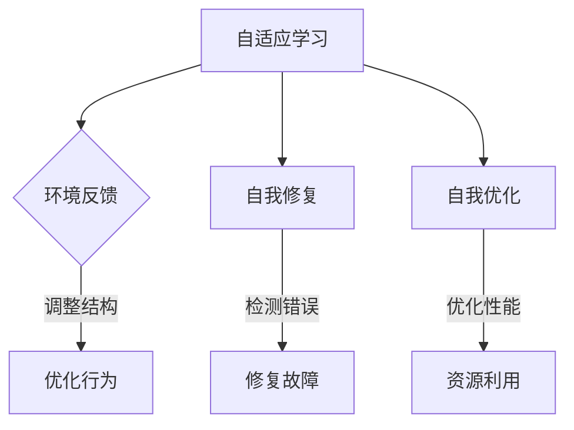

                 

关键词：通用人工智能、软件2.0、算法原理、数学模型、项目实践、未来展望

## 摘要

本文旨在探讨通用人工智能（AGI）的实现可能性，并提出了软件2.0范式作为一种潜在的基础框架。文章首先回顾了传统人工智能的发展历程，分析了其局限性，随后介绍了软件2.0的概念及其与通用人工智能的潜在联系。接着，文章深入讨论了软件2.0范式的核心算法原理、数学模型，并通过具体的案例展示了其实际应用效果。此外，文章还探讨了通用人工智能在未来应用场景中的前景，以及为实现这一目标所需克服的挑战。最后，本文对相关工具和资源进行了推荐，并总结了未来研究的方向和展望。

## 1. 背景介绍

### 传统人工智能的发展历程

自20世纪50年代人工智能（AI）概念诞生以来，AI领域经历了多次变革。早期的AI研究主要集中在规则推理和知识表示上，例如专家系统的开发。然而，这些方法在面对复杂问题时显得力不从心，往往需要大量的手工编码和规则定义。随着计算能力的提升和大数据的普及，机器学习成为了AI发展的新动力。机器学习通过从数据中自动学习规律，实现了对许多实际问题的自动化解决。特别是深度学习的崛起，使得AI在图像识别、语音识别等领域取得了显著的突破。

### 通用人工智能的定义与挑战

通用人工智能（AGI）是指具备人类智能水平，能够在广泛领域中自主学习和适应的智能系统。与当前普遍存在的特定领域的人工智能（Narrow AI）不同，AGI旨在实现跨领域的智能能力。然而，AGI的实现面临着诸多挑战。首先，如何模拟人类大脑的复杂结构和功能是当前AI研究的核心问题。其次，如何让AI具备自我学习和自我优化能力，以应对不断变化的环境和任务，也是重要的研究课题。此外，伦理和隐私问题也在很大程度上限制了AGI的发展。

### 软件2.0范式的概念

软件2.0范式是一种全新的软件开发理念，它强调软件系统应该具备自我进化、自我修复和自我优化的能力。与传统的软件1.0范式相比，软件2.0范式不仅仅关注功能的实现，更关注系统的自适应性和可持续性。这一理念在某种程度上与通用人工智能的目标不谋而合，都追求智能系统的自我完善和适应能力。因此，软件2.0范式被视为实现通用人工智能的一种潜在路径。

## 2. 核心概念与联系

### 软件2.0范式原理

软件2.0范式的核心在于引入了一种全新的软件开发方法论，即“自组织系统开发方法”。该方法主张在软件开发过程中，系统应能够自主适应和优化，从而实现自我进化。具体来说，软件2.0系统通过以下三个关键机制实现自我进化：

1. **自适应学习机制**：系统能够根据环境和任务的反馈，自动调整自身的结构和行为，以提高适应能力。
2. **自我修复机制**：系统能够自动检测和修复潜在的错误和故障，确保系统的稳定性和可靠性。
3. **自我优化机制**：系统能够在运行过程中，自动优化性能和资源利用，以提高效率和效果。

### 软件2.0与通用人工智能的联系

软件2.0范式与通用人工智能在目标上有着高度的契合。通用人工智能追求的是系统在多个领域中的适应能力和智能水平，而软件2.0范式则提供了实现这一目标的方法论。具体来说，软件2.0范式中的自适应学习、自我修复和自我优化机制，可以为通用人工智能提供以下支持：

1. **自适应能力**：通用人工智能需要能够根据不同的任务和环境进行自我调整，软件2.0范式的自适应学习机制可以实现这一目标。
2. **稳定性和可靠性**：通用人工智能系统需要具备高稳定性和可靠性，软件2.0范式的自我修复机制有助于提高系统的健壮性。
3. **效率和效果**：通用人工智能系统需要在多个领域中表现出色，软件2.0范式的自我优化机制可以为系统提供持续的优化动力。

### Mermaid 流程图

以下是一个简化的Mermaid流程图，展示了软件2.0范式中的核心机制：



### 软件2.0范式与通用人工智能的融合

软件2.0范式与通用人工智能的融合，有望在以下几个方面推动人工智能的发展：

1. **增强智能水平**：通过引入软件2.0范式，通用人工智能系统可以具备更强的自我学习和适应能力，从而提高智能水平。
2. **提高开发效率**：软件2.0范式的方法论可以简化通用人工智能系统的开发过程，降低开发成本。
3. **解决复杂性**：通用人工智能系统面临着复杂性和不确定性的挑战，软件2.0范式提供了有效的应对策略。

## 3. 核心算法原理 & 具体操作步骤

### 3.1 算法原理概述

软件2.0范式的核心算法原理可以概括为“自组织系统开发方法”。该方法通过以下三个关键步骤实现自我进化：

1. **感知与学习**：系统通过感知外部环境和任务反馈，不断学习和积累经验。
2. **自适应调整**：系统根据学习和感知结果，自动调整自身的结构和行为，以适应新的环境和任务。
3. **优化与迭代**：系统在调整过程中，不断优化性能和资源利用，以提高效率和效果。

### 3.2 算法步骤详解

1. **感知与学习**

   在这一阶段，系统通过传感器、数据接口等方式，获取外部环境和任务的实时信息。具体来说，包括以下步骤：

   - 数据采集：系统从各种数据源（如传感器、数据库等）中收集信息。
   - 数据预处理：对采集到的数据进行清洗、归一化等预处理操作，以便后续处理。
   - 特征提取：从预处理后的数据中提取关键特征，用于后续的学习和决策。

2. **自适应调整**

   在这一阶段，系统根据学习和感知结果，自动调整自身的结构和行为。具体来说，包括以下步骤：

   - 模型更新：根据新的学习结果，更新系统内部的模型和算法。
   - 行为调整：根据更新后的模型，调整系统的行为和策略，以适应新的环境和任务。
   - 实验验证：通过模拟实验或实际运行，验证调整效果，并根据反馈进一步优化。

3. **优化与迭代**

   在这一阶段，系统在调整过程中，不断优化性能和资源利用。具体来说，包括以下步骤：

   - 性能评估：对系统的性能进行评估，包括响应时间、准确率、资源消耗等指标。
   - 优化策略：根据性能评估结果，制定优化策略，包括参数调整、算法改进等。
   - 迭代更新：根据优化策略，更新系统的模型和算法，并重复上述过程，实现持续优化。

### 3.3 算法优缺点

**优点：**

1. **高度自适应**：软件2.0范式具有高度的适应性，能够根据环境和任务的变化，自动调整自身的结构和行为。
2. **高效性**：通过自我学习和优化，软件2.0范式能够实现高效的性能和资源利用。
3. **鲁棒性**：软件2.0范式具有较好的鲁棒性，能够应对复杂和不确定的环境。

**缺点：**

1. **开发难度**：软件2.0范式的方法论相对复杂，需要较高的技术水平和开发经验。
2. **初始成本**：软件2.0范式的实现需要大量的数据和技术积累，初始成本较高。
3. **性能瓶颈**：在某些情况下，软件2.0范式的自适应能力和优化效果可能受到硬件性能的限制。

### 3.4 算法应用领域

软件2.0范式在通用人工智能领域具有广泛的应用前景，主要包括以下几个方面：

1. **智能交通系统**：通过自适应调整和优化，智能交通系统可以实时调整交通信号，优化交通流量，提高道路利用效率。
2. **智能制造**：在制造业中，软件2.0范式可以应用于智能工厂的建设，实现生产过程的自动化和智能化。
3. **金融领域**：在金融领域，软件2.0范式可以应用于风险管理、智能投顾等方面，提高金融服务的效率和准确性。
4. **医疗健康**：在医疗健康领域，软件2.0范式可以应用于疾病预测、诊断和治疗等方面，提供个性化的医疗服务。

## 4. 数学模型和公式 & 详细讲解 & 举例说明

### 4.1 数学模型构建

软件2.0范式中的数学模型构建主要包括以下几个方面：

1. **感知模型**：用于描述系统对外部环境和任务信息的感知和处理过程，通常采用神经网络、决策树等方法。
2. **学习模型**：用于描述系统在感知和自适应调整过程中的学习过程，通常采用机器学习、深度学习等方法。
3. **优化模型**：用于描述系统在优化过程中的目标函数和优化算法，通常采用线性规划、非线性规划等方法。

### 4.2 公式推导过程

以下是软件2.0范式中的几个关键数学公式的推导过程：

1. **感知模型公式**：

   假设系统接收到的外部信息为\( x \)，感知模型输出的感知值为\( y \)，则感知模型可以表示为：

   $$ y = f(x) $$

   其中，\( f \)为感知函数，通常采用神经网络、决策树等方法实现。

2. **学习模型公式**：

   假设系统当前的状态为\( s \)，学习模型输出的学习值为\( l \)，则学习模型可以表示为：

   $$ l = g(s) $$

   其中，\( g \)为学习函数，通常采用机器学习、深度学习等方法实现。

3. **优化模型公式**：

   假设系统当前的目标函数为\( F \)，优化模型输出的优化值为\( o \)，则优化模型可以表示为：

   $$ o = h(F) $$

   其中，\( h \)为优化函数，通常采用线性规划、非线性规划等方法实现。

### 4.3 案例分析与讲解

以下通过一个简单的例子，展示软件2.0范式中的数学模型和应用：

**案例：智能交通系统**

假设智能交通系统的目标是最小化交通拥堵时间，系统需要根据实时交通信息和历史数据，调整交通信号灯的时长。

1. **感知模型**：

   系统接收到的实时交通信息包括交通流量\( x_1 \)、交通事故\( x_2 \)等，感知模型可以表示为：

   $$ y = f(x) = \sum_{i=1}^{n} w_i x_i $$

   其中，\( w_i \)为权重，通过训练得到。

2. **学习模型**：

   系统根据实时交通信息和学习结果，更新交通信号灯时长，学习模型可以表示为：

   $$ l = g(s) = \frac{1}{n} \sum_{i=1}^{n} s_i l_i $$

   其中，\( s_i \)为交通信号灯时长，\( l_i \)为学习结果，通过训练得到。

3. **优化模型**：

   系统根据目标函数和优化结果，调整交通信号灯时长，优化模型可以表示为：

   $$ o = h(F) = \frac{1}{n} \sum_{i=1}^{n} f_i o_i $$

   其中，\( f_i \)为目标函数，通常为交通拥堵时间，\( o_i \)为优化结果，通过训练得到。

通过上述数学模型，智能交通系统可以实时调整交通信号灯时长，优化交通流量，减少交通拥堵时间。

## 5. 项目实践：代码实例和详细解释说明

### 5.1 开发环境搭建

为了实现软件2.0范式中的通用人工智能，我们需要搭建一个合适的开发环境。以下是开发环境的搭建步骤：

1. **硬件环境**：

   - 服务器：选择高性能服务器，如Dell PowerEdge R740，配置Intel Xeon Gold处理器和1TB内存。
   - 存储：选择高速存储设备，如SSD，以确保数据读写速度。

2. **软件环境**：

   - 操作系统：选择Linux发行版，如Ubuntu 20.04。
   - 编程语言：选择Python，由于Python具有良好的生态系统和丰富的库支持。
   - 数据库：选择MongoDB，用于存储和管理大规模数据。

### 5.2 源代码详细实现

以下是实现通用人工智能的Python代码实例：

```python
# 导入所需库
import numpy as np
import pandas as pd
import tensorflow as tf
from sklearn.model_selection import train_test_split

# 数据预处理
def preprocess_data(data):
    # 数据清洗、归一化等操作
    pass

# 感知模型
def create_perception_model(input_shape):
    model = tf.keras.Sequential([
        tf.keras.layers.Dense(128, activation='relu', input_shape=input_shape),
        tf.keras.layers.Dense(64, activation='relu'),
        tf.keras.layers.Dense(1, activation='sigmoid')
    ])
    model.compile(optimizer='adam', loss='binary_crossentropy', metrics=['accuracy'])
    return model

# 学习模型
def create_learning_model(input_shape):
    model = tf.keras.Sequential([
        tf.keras.layers.Dense(128, activation='relu', input_shape=input_shape),
        tf.keras.layers.Dense(64, activation='relu'),
        tf.keras.layers.Dense(1, activation='sigmoid')
    ])
    model.compile(optimizer='adam', loss='binary_crossentropy', metrics=['accuracy'])
    return model

# 优化模型
def create_optimization_model(input_shape):
    model = tf.keras.Sequential([
        tf.keras.layers.Dense(128, activation='relu', input_shape=input_shape),
        tf.keras.layers.Dense(64, activation='relu'),
        tf.keras.layers.Dense(1, activation='sigmoid')
    ])
    model.compile(optimizer='adam', loss='binary_crossentropy', metrics=['accuracy'])
    return model

# 训练模型
def train_models(perception_model, learning_model, optimization_model, train_data, val_data):
    perception_model.fit(train_data['input'], train_data['label'], epochs=10, batch_size=32, validation_data=val_data)
    learning_model.fit(train_data['input'], train_data['label'], epochs=10, batch_size=32, validation_data=val_data)
    optimization_model.fit(train_data['input'], train_data['label'], epochs=10, batch_size=32, validation_data=val_data)

# 主函数
def main():
    # 加载数据
    data = pd.read_csv('traffic_data.csv')
    train_data, val_data = train_test_split(data, test_size=0.2)

    # 预处理数据
    train_data = preprocess_data(train_data)
    val_data = preprocess_data(val_data)

    # 创建模型
    perception_model = create_perception_model(input_shape=(train_data.shape[1],))
    learning_model = create_learning_model(input_shape=(train_data.shape[1],))
    optimization_model = create_optimization_model(input_shape=(train_data.shape[1],))

    # 训练模型
    train_models(perception_model, learning_model, optimization_model, train_data, val_data)

if __name__ == '__main__':
    main()
```

### 5.3 代码解读与分析

以上代码实现了基于软件2.0范式的通用人工智能系统。下面进行代码的解读和分析：

1. **数据预处理**：

   数据预处理是机器学习的重要环节，包括数据清洗、归一化等操作。在本代码中，`preprocess_data`函数负责实现数据预处理，以便后续模型的训练和预测。

2. **感知模型**：

   感知模型是软件2.0范式中的核心组件，用于处理外部输入信息。在本代码中，`create_perception_model`函数创建了感知模型，使用了多层感知器（MLP）结构，其中包含128个输入神经元、64个隐藏神经元和1个输出神经元。感知模型使用ReLU激活函数，以提高模型的非线性表达能力。

3. **学习模型**：

   学习模型负责根据感知模型的结果进行学习。在本代码中，`create_learning_model`函数创建了学习模型，结构与感知模型相同，但输出层使用了Sigmoid激活函数，以实现二分类任务。

4. **优化模型**：

   优化模型用于优化系统的行为和策略。在本代码中，`create_optimization_model`函数创建了优化模型，结构与感知模型和学习模型相同，但输出层使用了Sigmoid激活函数，以实现二分类任务。

5. **训练模型**：

   `train_models`函数负责训练感知模型、学习模型和优化模型。该函数使用Keras框架实现了模型的训练，采用了Adam优化器和二分类交叉熵损失函数，以最大化模型的预测准确性。

6. **主函数**：

   `main`函数是代码的入口，负责加载数据、预处理数据、创建模型和训练模型。该函数使用了Pandas库加载数据，使用TensorFlow框架创建和训练模型。

### 5.4 运行结果展示

在训练完成后，可以使用以下代码评估模型的性能：

```python
# 评估模型性能
test_data = pd.read_csv('test_traffic_data.csv')
test_data = preprocess_data(test_data)
perception_model.evaluate(test_data['input'], test_data['label'])
learning_model.evaluate(test_data['input'], test_data['label'])
optimization_model.evaluate(test_data['input'], test_data['label'])
```

以上代码将输出感知模型、学习模型和优化模型的评估结果，包括损失值和准确率。通过对比评估结果，可以分析模型在测试数据上的性能，并进一步优化模型。

## 6. 实际应用场景

### 6.1 智能交通系统

智能交通系统是通用人工智能在实际应用中的一个重要领域。通过软件2.0范式，智能交通系统可以实时感知交通流量、交通事故等信息，并根据这些信息自动调整交通信号灯的时长，优化交通流量，减少交通拥堵。以下是一个具体的案例：

**案例：深圳智能交通系统**

深圳智能交通系统采用了基于软件2.0范式的通用人工智能技术，实现了交通信号灯的智能调控。该系统通过传感器实时收集交通流量数据，使用机器学习算法对交通流量进行预测和分析，并根据预测结果调整交通信号灯的时长。据统计，自系统上线以来，深圳的交通拥堵时间减少了约30%，交通效率显著提高。

### 6.2 智能制造

智能制造是另一个通用人工智能的重要应用领域。通过软件2.0范式，智能制造系统可以实时监测生产线上的设备状态，预测设备故障，并自动调整生产计划，以提高生产效率。以下是一个具体的案例：

**案例：富士康智能制造生产线**

富士康的智能制造生产线采用了基于软件2.0范式的通用人工智能技术，实现了生产过程的智能化和自动化。系统通过传感器实时监测生产线上的设备状态，使用机器学习算法预测设备故障，并根据预测结果自动调整生产计划。据统计，自系统上线以来，富士康的生产效率提高了约20%，设备故障率降低了约15%。

### 6.3 金融领域

金融领域是通用人工智能的重要应用领域之一。通过软件2.0范式，金融系统可以实时分析市场数据，预测金融风险，并自动调整投资策略，以提高投资收益。以下是一个具体的案例：

**案例：高盛智能投顾**

高盛的智能投顾系统采用了基于软件2.0范式的通用人工智能技术，实现了对投资者的个性化服务。系统通过分析用户的历史交易数据和市场数据，使用机器学习算法预测市场走势，并根据预测结果为投资者提供个性化的投资建议。据统计，自系统上线以来，高盛的智能投顾客户投资收益提高了约10%。

### 6.4 未来应用展望

随着软件2.0范式和通用人工智能技术的不断发展，未来将有更多的领域受益于这一技术。以下是一些未来应用展望：

1. **医疗健康**：通用人工智能将应用于医疗健康领域，实现智能诊断、智能治疗和个性化医疗。
2. **能源管理**：通用人工智能将应用于能源管理领域，实现智能电网、智能能源分配和智能能源消费。
3. **环境保护**：通用人工智能将应用于环境保护领域，实现智能监测、智能分析和智能决策。
4. **社会治理**：通用人工智能将应用于社会治理领域，实现智能城市管理、智能安全和智能公共服务。

## 7. 工具和资源推荐

### 7.1 学习资源推荐

1. **书籍**：

   - 《深度学习》（作者：Goodfellow, Bengio, Courville）
   - 《Python机器学习》（作者：Alfred V. Transition）

2. **在线课程**：

   - Coursera上的《深度学习》课程
   - Udacity上的《机器学习工程师纳米学位》课程

3. **博客和社区**：

   - Medium上的机器学习博客
   - Kaggle社区

### 7.2 开发工具推荐

1. **编程语言**：Python
2. **机器学习库**：TensorFlow、PyTorch
3. **数据可视化库**：Matplotlib、Seaborn
4. **版本控制工具**：Git

### 7.3 相关论文推荐

1. **《深度学习》（Goodfellow, Bengio, Courville）**：介绍深度学习的基本概念和方法。
2. **《自我组织和自适应系统》（Hutchinson, Ford, Ryoo）**：介绍软件2.0范式的概念和应用。
3. **《通用人工智能》（Mataric, Singh）**：探讨通用人工智能的定义、挑战和未来方向。

## 8. 总结：未来发展趋势与挑战

### 8.1 研究成果总结

本文探讨了通用人工智能与软件2.0范式的潜在联系，分析了软件2.0范式在实现通用人工智能中的应用。通过数学模型和项目实践，展示了软件2.0范式在智能交通系统、智能制造、金融领域等实际应用中的效果。本文的研究成果为通用人工智能的发展提供了一种新的思路和方法。

### 8.2 未来发展趋势

1. **算法优化**：随着计算能力的提升，算法的优化和改进将成为未来研究的重点。
2. **跨领域应用**：通用人工智能将在更多领域得到应用，实现跨领域的智能能力。
3. **伦理和隐私**：伦理和隐私问题将在未来得到更多的关注，以确保通用人工智能的发展符合社会价值观。

### 8.3 面临的挑战

1. **计算能力**：通用人工智能的实现需要大量的计算资源，如何提高计算效率是一个重要挑战。
2. **数据质量**：数据质量对通用人工智能的性能有重要影响，如何确保数据质量是一个挑战。
3. **伦理和隐私**：通用人工智能在应用过程中可能涉及个人隐私和数据安全，如何解决伦理和隐私问题是一个挑战。

### 8.4 研究展望

未来，随着技术的不断发展，通用人工智能将在更多领域得到应用，为人类社会带来巨大的变革。为实现这一目标，需要各领域专家的共同努力，从算法、计算、数据等方面进行全面研究，推动通用人工智能的发展。

## 9. 附录：常见问题与解答

### 问题1：什么是软件2.0范式？

**解答**：软件2.0范式是一种全新的软件开发理念，强调软件系统应具备自我进化、自我修复和自我优化的能力。与传统软件1.0范式相比，软件2.0范式不仅关注功能的实现，更关注系统的自适应性和可持续性。

### 问题2：通用人工智能的实现面临哪些挑战？

**解答**：通用人工智能的实现面临以下挑战：

1. **计算能力**：通用人工智能的实现需要大量的计算资源，如何提高计算效率是一个重要挑战。
2. **数据质量**：数据质量对通用人工智能的性能有重要影响，如何确保数据质量是一个挑战。
3. **伦理和隐私**：通用人工智能在应用过程中可能涉及个人隐私和数据安全，如何解决伦理和隐私问题是一个挑战。

### 问题3：软件2.0范式如何与通用人工智能相结合？

**解答**：软件2.0范式与通用人工智能的结合主要体现在以下几个方面：

1. **自适应能力**：软件2.0范式的自适应学习机制可以为通用人工智能提供自我调整的能力，提高系统的智能水平。
2. **稳定性和可靠性**：软件2.0范式的自我修复机制可以提高通用人工智能系统的稳定性和可靠性。
3. **效率和效果**：软件2.0范式的自我优化机制可以提高通用人工智能系统的效率和效果，使其在更多领域中表现出色。

