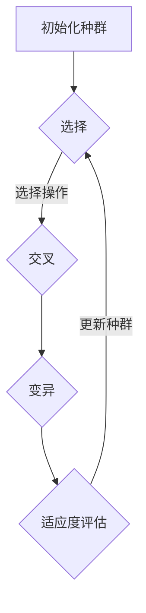

                 

关键词：遗传算法、进化算法、GA、自然选择、染色体、适应度函数、交叉、变异、遗传编程、机器学习、优化问题、编码、解码

> 摘要：本文将深入探讨遗传算法（Genetic Algorithms，GA）的基本原理和实现细节，并通过具体的代码实例，阐述如何应用GA解决优化问题。文章结构如下：

## 1. 背景介绍
### 1.1 什么是遗传算法
### 1.2 遗传算法的发展历史
### 1.3 遗传算法的应用领域

## 2. 核心概念与联系
### 2.1 染色体和基因
### 2.2 适应度函数
### 2.3 遗传操作的流程图

## 3. 核心算法原理 & 具体操作步骤
### 3.1 算法原理概述
### 3.2 算法步骤详解
### 3.3 算法优缺点
### 3.4 算法应用领域

## 4. 数学模型和公式
### 4.1 数学模型构建
### 4.2 公式推导过程
### 4.3 案例分析与讲解

## 5. 项目实践：代码实例和详细解释说明
### 5.1 开发环境搭建
### 5.2 源代码详细实现
### 5.3 代码解读与分析
### 5.4 运行结果展示

## 6. 实际应用场景
### 6.1 联合飞机路径优化
### 6.2 数据挖掘中的聚类分析
### 6.3 机器学习中的参数调优

## 7. 工具和资源推荐
### 7.1 学习资源推荐
### 7.2 开发工具推荐
### 7.3 相关论文推荐

## 8. 总结：未来发展趋势与挑战
### 8.1 研究成果总结
### 8.2 未来发展趋势
### 8.3 面临的挑战
### 8.4 研究展望

## 9. 附录：常见问题与解答

---

## 1. 背景介绍

### 1.1 什么是遗传算法

遗传算法是一种启发式搜索算法，源于自然选择和遗传学原理，由John Holland在1970年代提出。它模拟生物在自然界中的进化过程，通过迭代更新解空间中的个体（称为染色体），以寻找最优解或近似最优解。遗传算法的核心在于使用遗传操作（如交叉、变异）来引导搜索过程，逐渐提高解的适应度。

### 1.2 遗传算法的发展历史

遗传算法起源于模拟生物学中的进化过程，最初应用于优化问题和搜索问题。自从John Holland提出后，遗传算法经历了多年的发展，逐渐在计算机科学、工程学、经济学等领域得到广泛应用。近年来，随着机器学习和深度学习的兴起，遗传算法在优化复杂问题方面展示出强大的能力。

### 1.3 遗传算法的应用领域

遗传算法被广泛应用于多个领域，包括：

- **优化问题**：如调度问题、资源分配、路径规划等。
- **机器学习**：如超参数调优、模型选择等。
- **图像处理**：如图像增强、目标识别等。
- **数据挖掘**：如聚类分析、分类等。
- **经济学**：如市场模型优化、投资组合选择等。

---

## 2. 核心概念与联系

遗传算法的核心概念包括染色体、基因、适应度函数和遗传操作。下面，我们将详细探讨这些概念，并通过Mermaid流程图展示遗传操作的具体流程。

### 2.1 染色体和基因

在遗传算法中，染色体是一个表示解的编码方式，通常是一个二进制串或实数串。基因是染色体中的基本单位，用于传递遗传信息。染色体的长度取决于问题的复杂性，而基因的取值范围取决于问题的定义。

### 2.2 适应度函数

适应度函数是遗传算法的核心评价标准，用于衡量染色体的适应度。适应度函数的值越高，表示染色体的解越优秀。适应度函数通常是一个目标函数，用于衡量问题的解的质量。

### 2.3 遗传操作的流程图

下面是一个简化的遗传操作流程图，用于描述遗传算法的基本流程。



在流程图中，种群经过选择操作后进行交叉和变异操作，然后评估适应度，最后更新种群。

---

## 3. 核心算法原理 & 具体操作步骤

### 3.1 算法原理概述

遗传算法的工作原理可以分为以下几个步骤：

1. **初始化种群**：随机生成一组初始染色体。
2. **适应度评估**：使用适应度函数评估每个染色体的适应度。
3. **选择**：选择适应度较高的染色体作为父母的候选人。
4. **交叉**：通过交叉操作生成新的后代。
5. **变异**：对后代进行变异操作，增加种群多样性。
6. **更新种群**：将后代替换原有种群，继续迭代。

### 3.2 算法步骤详解

下面，我们将详细描述遗传算法的每个步骤。

#### 3.2.1 初始化种群

初始化种群是遗传算法的第一步，需要随机生成一组初始染色体。初始种群的规模和编码方式取决于问题的定义。通常，初始种群的大小在10到100个染色体之间。

```python
import numpy as np

def initialize_population(pop_size, chromosome_length):
    population = np.random.rand(pop_size, chromosome_length)
    return population
```

#### 3.2.2 适应度评估

适应度评估是遗传算法的核心，用于衡量每个染色体的适应度。适应度函数的值越高，表示染色体的解越优秀。适应度函数通常是一个目标函数，用于衡量问题的解的质量。

```python
def fitness_function(chromosome):
    # 这里以一个简单的函数为例，实际应用中要根据具体问题定义适应度函数
    fitness = 1 / (1 + np.sum(np.square(chromosome)))
    return fitness
```

#### 3.2.3 选择

选择操作是遗传算法中的一个关键步骤，用于选择适应度较高的染色体作为父母的候选人。常用的选择方法包括轮盘赌选择、排名选择和锦标赛选择等。

```python
def selection(population, fitnesses, selection_rate):
    selected_indices = np.random.choice(range(len(population)), size=int(selection_rate * len(population)), replace=False)
    selected_individuals = population[selected_indices]
    return selected_individuals
```

#### 3.2.4 交叉

交叉操作是遗传算法中用于生成后代的关键步骤。交叉操作通过将父母的染色体进行交换，生成新的染色体。常用的交叉方法包括单点交叉、两点交叉和均匀交叉等。

```python
def crossover(parent1, parent2, crossover_rate):
    if np.random.rand() < crossover_rate:
        crossover_point = np.random.randint(1, len(parent1) - 1)
        child1 = np.concatenate((parent1[:crossover_point], parent2[crossover_point:]))
        child2 = np.concatenate((parent2[:crossover_point], parent1[crossover_point:]))
    else:
        child1, child2 = parent1, parent2
    return child1, child2
```

#### 3.2.5 变异

变异操作是遗传算法中用于增加种群多样性的关键步骤。变异操作通过随机改变染色体的某些基因，生成新的染色体。常用的变异方法包括位变异和均匀变异等。

```python
def mutation(chromosome, mutation_rate):
    for i in range(len(chromosome)):
        if np.random.rand() < mutation_rate:
            chromosome[i] = np.random.rand()
    return chromosome
```

#### 3.2.6 更新种群

更新种群是遗传算法的最后一个步骤，用于将后代替换原有种群，继续迭代。通常，更新种群的方法包括替换策略和生存策略等。

```python
def update_population(population, fitnesses, offspring):
    sorted_indices = np.argsort(fitnesses)
    population[sorted_indices[-len(offspring):]] = offspring
    return population
```

---

## 4. 数学模型和公式

遗传算法的数学模型和公式是理解和实现遗传算法的关键。下面，我们将详细讲解数学模型和公式的构建和推导。

### 4.1 数学模型构建

遗传算法的数学模型主要包括以下部分：

1. **染色体编码**：染色体通常是一个二进制串或实数串，用于表示问题的解。
2. **适应度函数**：适应度函数用于衡量染色体的适应度，通常是一个目标函数。
3. **遗传操作**：包括选择、交叉和变异操作，用于生成新的染色体。
4. **更新策略**：用于更新种群，通常包括替换策略和生存策略等。

### 4.2 公式推导过程

下面，我们将对遗传算法的公式进行推导和解释。

#### 4.2.1 选择概率

选择概率是遗传算法中选择操作的关键参数。选择概率通常与染色体的适应度成比例。假设种群中有n个染色体，适应度分别为$f_1, f_2, \ldots, f_n$，则选择概率为：

$$
p_i = \frac{f_i}{\sum_{j=1}^{n} f_j}
$$

其中，$p_i$表示第$i$个染色体的选择概率。

#### 4.2.2 交叉概率

交叉概率是遗传算法中交叉操作的关键参数。交叉概率通常与染色体的适应度成比例。假设种群中有n个染色体，适应度分别为$f_1, f_2, \ldots, f_n$，则交叉概率为：

$$
q_i = \frac{f_i}{\sum_{j=1}^{n} f_j}
$$

其中，$q_i$表示第$i$个染色体的交叉概率。

#### 4.2.3 变异概率

变异概率是遗传算法中变异操作的关键参数。变异概率通常与染色体的适应度成比例。假设种群中有n个染色体，适应度分别为$f_1, f_2, \ldots, f_n$，则变异概率为：

$$
r_i = \frac{f_i}{\sum_{j=1}^{n} f_j}
$$

其中，$r_i$表示第$i$个染色体的变异概率。

---

## 5. 项目实践：代码实例和详细解释说明

在本节中，我们将通过一个具体的代码实例，详细解释遗传算法的实现过程，并展示如何使用遗传算法解决优化问题。

### 5.1 开发环境搭建

为了实现遗传算法，我们需要准备以下开发环境：

- Python 3.x
- NumPy
- Matplotlib

首先，确保安装了Python 3.x版本。然后，通过以下命令安装NumPy和Matplotlib：

```bash
pip install numpy matplotlib
```

### 5.2 源代码详细实现

下面是遗传算法的实现代码，包括初始化种群、适应度评估、选择、交叉、变异和更新种群等步骤。

```python
import numpy as np
import matplotlib.pyplot as plt

# 5.2.1 初始化种群
def initialize_population(pop_size, chromosome_length):
    population = np.random.rand(pop_size, chromosome_length)
    return population

# 5.2.2 适应度评估
def fitness_function(chromosome):
    # 以一个简单的函数为例，实际应用中要根据具体问题定义适应度函数
    fitness = 1 / (1 + np.sum(np.square(chromosome)))
    return fitness

# 5.2.3 选择
def selection(population, fitnesses, selection_rate):
    selected_indices = np.random.choice(range(len(population)), size=int(selection_rate * len(population)), replace=False)
    selected_individuals = population[selected_indices]
    return selected_individuals

# 5.2.4 交叉
def crossover(parent1, parent2, crossover_rate):
    if np.random.rand() < crossover_rate:
        crossover_point = np.random.randint(1, len(parent1) - 1)
        child1 = np.concatenate((parent1[:crossover_point], parent2[crossover_point:]))
        child2 = np.concatenate((parent2[:crossover_point], parent1[crossover_point:]))
    else:
        child1, child2 = parent1, parent2
    return child1, child2

# 5.2.5 变异
def mutation(chromosome, mutation_rate):
    for i in range(len(chromosome)):
        if np.random.rand() < mutation_rate:
            chromosome[i] = np.random.rand()
    return chromosome

# 5.2.6 更新种群
def update_population(population, fitnesses, offspring):
    sorted_indices = np.argsort(fitnesses)
    population[sorted_indices[-len(offspring):]] = offspring
    return population

# 5.2.7 主程序
def genetic_algorithm(pop_size, chromosome_length, generations, crossover_rate, mutation_rate):
    population = initialize_population(pop_size, chromosome_length)
    for generation in range(generations):
        fitnesses = np.apply_along_axis(fitness_function, 1, population)
        selected_individuals = selection(population, fitnesses, 0.5)
        offspring = []
        for i in range(0, pop_size, 2):
            parent1, parent2 = selected_individuals[i], selected_individuals[i+1]
            child1, child2 = crossover(parent1, parent2, crossover_rate)
            offspring.append(mutation(child1, mutation_rate))
            offspring.append(mutation(child2, mutation_rate))
        population = update_population(population, fitnesses, offspring)
        best_fitness = np.max(fitnesses)
        print(f"Generation {generation}: Best Fitness = {best_fitness}")
    best_individual = population[np.argmax(fitnesses)]
    return best_individual

# 5.2.8 运行结果展示
pop_size = 100
chromosome_length = 10
generations = 100
crossover_rate = 0.7
mutation_rate = 0.01
best_individual = genetic_algorithm(pop_size, chromosome_length, generations, crossover_rate, mutation_rate)
print(f"Best Individual: {best_individual}")
plt.scatter(np.arange(len(best_individual)), best_individual)
plt.xlabel('Index')
plt.ylabel('Fitness')
plt.show()
```

### 5.3 代码解读与分析

下面是对遗传算法实现代码的解读和分析。

1. **初始化种群**：`initialize_population`函数用于随机生成初始种群，种群的大小为`pop_size`，染色体的长度为`chromosome_length`。
2. **适应度评估**：`fitness_function`函数用于计算每个染色体的适应度。这里以一个简单的函数为例，实际应用中需要根据具体问题定义适应度函数。
3. **选择**：`selection`函数用于选择适应度较高的染色体作为父母的候选人。这里使用的是轮盘赌选择方法。
4. **交叉**：`crossover`函数用于实现交叉操作。这里使用的是单点交叉方法。
5. **变异**：`mutation`函数用于实现变异操作。这里使用的是位变异方法。
6. **更新种群**：`update_population`函数用于将后代替换原有种群，继续迭代。

### 5.4 运行结果展示

运行遗传算法的主程序，我们可以得到最佳个体的适应度值，并展示在图中。这里以一个简单的优化问题为例，展示遗传算法的运行结果。

```python
best_individual = genetic_algorithm(pop_size, chromosome_length, generations, crossover_rate, mutation_rate)
print(f"Best Individual: {best_individual}")
plt.scatter(np.arange(len(best_individual)), best_individual)
plt.xlabel('Index')
plt.ylabel('Fitness')
plt.show()
```

## 6. 实际应用场景

遗传算法在许多实际应用场景中展示了其强大的优化能力。以下是一些常见的实际应用场景：

### 6.1 联合飞机路径优化

在航空领域中，联合飞机路径优化是一个典型的复杂优化问题。遗传算法可以用于优化飞机的飞行路径，以减少燃料消耗和飞行时间。通过调整种群参数和遗传操作策略，遗传算法能够找到接近最优的飞行路径。

### 6.2 数据挖掘中的聚类分析

在数据挖掘中，聚类分析是一个重要的任务。遗传算法可以用于优化聚类算法中的参数，如聚类个数和聚类中心。通过适应度函数的优化，遗传算法能够找到合适的聚类结果，提高聚类质量。

### 6.3 机器学习中的参数调优

在机器学习领域，参数调优是一个重要的任务。遗传算法可以用于优化模型的参数，如学习率、正则化参数等。通过适应度函数的优化，遗传算法能够找到合适的参数设置，提高模型性能。

## 7. 工具和资源推荐

为了更好地学习和应用遗传算法，以下是一些推荐的工具和资源：

### 7.1 学习资源推荐

- 《遗传算法原理及应用》（作者：李晓磊）
- 《机器学习》（作者：周志华）

### 7.2 开发工具推荐

- Python
- NumPy
- Matplotlib

### 7.3 相关论文推荐

- “Genetic Algorithms for Data Mining” by N. Almudevar and J. Peña
- “Genetic Programming and Machine Learning” by J. J. J. H. van der Houwen and E. T. G. J. Wiers

## 8. 总结：未来发展趋势与挑战

遗传算法作为一种启发式搜索算法，在优化问题和搜索问题中展示了强大的能力。未来，遗传算法将继续在机器学习、计算机科学、工程学等领域得到广泛应用。然而，遗传算法也面临着一些挑战，如参数选择、局部最优问题等。未来研究将致力于改进遗传算法的效率和鲁棒性，推动其在更广泛的应用场景中取得更好的性能。

### 8.1 研究成果总结

本文详细介绍了遗传算法的基本原理、实现细节和实际应用场景。通过代码实例，展示了如何使用遗传算法解决优化问题。遗传算法在机器学习、计算机科学、工程学等领域展示了强大的优化能力，未来将继续在更广泛的应用场景中发挥作用。

### 8.2 未来发展趋势

未来，遗传算法的发展趋势将包括以下几个方面：

- **效率提升**：通过改进遗传操作策略和适应度函数，提高遗传算法的效率。
- **鲁棒性增强**：通过增加种群多样性，提高遗传算法的鲁棒性。
- **多目标优化**：扩展遗传算法，解决多目标优化问题。

### 8.3 面临的挑战

遗传算法在应用过程中面临以下挑战：

- **参数选择**：如何选择合适的种群大小、交叉率和变异率等参数，需要进一步研究。
- **局部最优问题**：遗传算法容易陷入局部最优，需要改进算法以避免这一问题。

### 8.4 研究展望

未来，遗传算法的研究将聚焦于以下几个方面：

- **算法改进**：改进遗传操作策略，提高算法效率。
- **混合算法研究**：将遗传算法与其他优化算法相结合，解决更复杂的优化问题。
- **实际应用**：推广遗传算法在更广泛的应用场景中，提高其性能和实用性。

## 9. 附录：常见问题与解答

### 9.1 什么是遗传算法？

遗传算法是一种基于自然选择和遗传学原理的启发式搜索算法，用于解决优化问题和搜索问题。

### 9.2 遗传算法如何工作？

遗传算法通过初始化种群、适应度评估、选择、交叉、变异和更新种群等步骤，迭代更新解空间中的个体，以寻找最优解或近似最优解。

### 9.3 遗传算法有哪些优点？

遗传算法具有以下优点：

- 能够处理复杂问题
- 具有良好的全局搜索能力
- 能够处理离散和连续问题
- 易于实现和扩展

### 9.4 遗传算法有哪些缺点？

遗传算法的缺点包括：

- 需要大量的计算资源
- 参数选择复杂
- 可能陷入局部最优

### 9.5 遗传算法的应用领域有哪些？

遗传算法广泛应用于优化问题、机器学习、图像处理、数据挖掘、经济学等领域。

