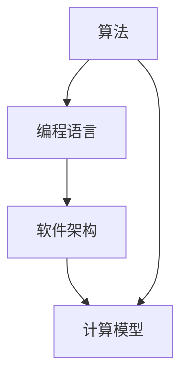

                 

关键词：人类计算，创造力，算法，技术，未来展望

> 摘要：本文旨在探讨人类计算在释放人类创造力方面的重要作用，通过分析核心概念、算法原理、数学模型以及实际应用场景，揭示了人类计算在推动科技进步和人类文明发展中的独特价值。

## 1. 背景介绍

人类计算，作为一种概念，起源于人类对计算的需求。自古以来，人类就通过手工计算、算盘等工具来处理数学问题。随着计算机科学的发展，人类计算逐渐演变为一种更加高效、精确的数字计算方式。如今，人类计算已经成为计算机科学的核心领域之一，涵盖了算法设计、编程语言、软件架构等多个方面。

在当今信息时代，人类计算的重要性日益凸显。它不仅促进了科学研究的进步，还推动了人工智能、大数据、云计算等新兴技术的快速发展。同时，人类计算也在经济、教育、医疗等多个领域发挥了重要作用，极大地提升了人类生活的质量。

本文将从以下几个方面展开讨论：

1. 核心概念与联系
2. 核心算法原理与具体操作步骤
3. 数学模型和公式
4. 项目实践：代码实例
5. 实际应用场景
6. 未来应用展望
7. 工具和资源推荐
8. 总结：未来发展趋势与挑战

希望通过本文的探讨，能够帮助读者更好地理解人类计算的魅力，激发其在各个领域的创造力。

## 2. 核心概念与联系

在探讨人类计算的核心概念之前，我们需要明确几个基本概念：算法、编程语言、软件架构和计算模型。

### 算法

算法是一系列解决问题的步骤和规则。它可以是手工计算的，也可以是计算机执行的。算法的设计与实现是计算机科学的核心任务之一。不同的算法具有不同的效率和适用场景，如排序算法、查找算法、图算法等。

### 编程语言

编程语言是用于编写计算机程序的语言。常见的编程语言包括C、C++、Java、Python等。不同的编程语言具有不同的语法和特点，适用于不同的应用场景。编程语言的选择直接影响程序的开发效率和可维护性。

### 软件架构

软件架构是指软件系统的整体结构和组织方式。它包括模块划分、接口设计、数据结构等多个方面。良好的软件架构能够提高软件的可扩展性、可维护性和性能。

### 计算模型

计算模型是指计算机进行计算的基本原理和方式。常见的计算模型包括串行计算、并行计算、分布式计算等。不同的计算模型适用于不同的计算任务，能够极大地提高计算效率和性能。

### Mermaid 流程图

下面是一个简单的Mermaid流程图，展示了上述核心概念之间的联系：



### 核心概念与计算模型的联系

算法、编程语言、软件架构和计算模型之间存在着密切的联系。算法是软件架构的核心，决定了软件的功能和性能。编程语言是算法的实现工具，用于编写和实现算法。软件架构则是对算法和编程语言的组合和优化，以实现更高的效率和性能。计算模型则提供了计算的基本原理和方式，影响着算法和编程语言的选择和实现。

通过以上核心概念和联系的分析，我们可以更好地理解人类计算的本质，为后续章节的内容打下基础。

## 3. 核心算法原理 & 具体操作步骤

### 3.1 算法原理概述

在人类计算中，算法起着至关重要的作用。算法的原理可以分为几个核心方面：问题定义、算法设计、算法分析和算法优化。

#### 问题定义

问题定义是算法设计的第一步。它要求我们明确需要解决的问题的目标和约束条件。问题定义的准确性直接影响到后续算法设计的效率和效果。

#### 算法设计

算法设计是指根据问题定义，设计出一组解决问题的步骤和规则。算法设计的核心是找到一种最优的解决方案，使得算法的效率和性能达到最佳。

#### 算法分析

算法分析是对算法的效率和性能进行评估。算法分析通常包括时间复杂度和空间复杂度两个方面。时间复杂度描述了算法执行的时间随着输入规模的变化而变化的规律，空间复杂度描述了算法所需的存储空间。

#### 算法优化

算法优化是指在算法分析的基础上，通过改进算法设计，提高算法的效率和性能。算法优化可以是针对算法的特定方面，也可以是全面的优化。

### 3.2 算法步骤详解

下面我们以著名的排序算法——快速排序（Quick Sort）为例，详细讲解其原理和步骤。

#### 快速排序原理

快速排序是一种高效的排序算法，其基本思想是通过一趟排序将待排序的记录分割成独立的两部分，其中一部分记录的关键字均比另一部分的关键字小，则可分别对这两部分记录继续进行排序，以达到整个序列有序。

#### 快速排序步骤

1. **选择基准**：在待排序的记录中选取一个记录作为基准（pivot）。

2. **分区**：通过一趟排序将待排序的记录分割成独立的两部分，其中一部分记录的关键字均比另一部分的关键字小。基准记录最终位于其分割的中间位置。

3. **递归排序**：递归地对分割出的两部分记录进行快速排序，直到所有记录有序。

### 3.3 算法优缺点

#### 优点

- **高效**：快速排序的平均时间复杂度为 \(O(n\log n)\)，在大多数情况下比其他排序算法更快。
- **稳定**：快速排序是一种稳定的排序算法，不会改变相等元素之间的相对顺序。

#### 缺点

- **不稳定**：在某些特定情况下，快速排序可能表现出不稳定的特点，即相等元素之间的相对顺序可能被改变。
- **性能波动**：快速排序的性能依赖于基准的选择，如果基准选择不当，可能会导致性能波动。

### 3.4 算法应用领域

快速排序广泛应用于各种领域，如数据科学、算法竞赛、数据库排序等。在数据科学中，快速排序常用于数据预处理和数据分析；在算法竞赛中，快速排序是常用的算法之一；在数据库中，快速排序用于快速查找和排序数据。

## 4. 数学模型和公式 & 详细讲解 & 举例说明

### 4.1 数学模型构建

在计算机科学中，数学模型是一种用于描述和解决问题的重要工具。构建数学模型通常包括以下步骤：

1. **问题定义**：明确需要解决的问题的目标和约束条件。
2. **变量定义**：定义问题的变量，包括输入变量和输出变量。
3. **公式推导**：根据问题定义和变量定义，推导出描述问题的数学公式。
4. **模型验证**：通过实际数据和案例验证模型的准确性和可靠性。

### 4.2 公式推导过程

以最简单的线性回归模型为例，推导其数学公式。

#### 线性回归模型

线性回归模型用于描述两个变量之间的关系，其公式为：

\[ y = ax + b \]

其中，\( y \) 是输出变量，\( x \) 是输入变量，\( a \) 和 \( b \) 是模型参数。

#### 公式推导过程

1. **问题定义**：我们假设 \( y \) 和 \( x \) 之间存在线性关系，目标是找到最佳拟合直线，使得直线上的点与实际数据点的误差最小。

2. **变量定义**：定义 \( x \) 和 \( y \) 的实际数据点为 \( (x_i, y_i) \)，模型参数为 \( a \) 和 \( b \)。

3. **公式推导**：为了找到最佳拟合直线，我们需要最小化误差平方和，即：

\[ \min \sum_{i=1}^{n} (y_i - (ax_i + b))^2 \]

4. **求导并求解**：对上述公式关于 \( a \) 和 \( b \) 求导，并令导数为零，得到：

\[ \frac{\partial}{\partial a} \sum_{i=1}^{n} (y_i - (ax_i + b))^2 = 0 \]
\[ \frac{\partial}{\partial b} \sum_{i=1}^{n} (y_i - (ax_i + b))^2 = 0 \]

5. **求解方程**：解上述方程组，得到 \( a \) 和 \( b \) 的最优值。

### 4.3 案例分析与讲解

下面我们通过一个实际案例，详细讲解线性回归模型的构建和求解过程。

#### 案例数据

给定一组数据，\( x \) 和 \( y \) 的取值如下：

| x | y  |
|---|----|
| 1 | 2  |
| 2 | 3  |
| 3 | 4  |
| 4 | 5  |

#### 构建线性回归模型

1. **问题定义**：我们需要找到 \( y \) 和 \( x \) 之间的最佳拟合直线，即 \( y = ax + b \)。

2. **变量定义**：定义 \( x \) 和 \( y \) 的实际数据点为 \( (x_i, y_i) \)，模型参数为 \( a \) 和 \( b \)。

3. **公式推导**：根据问题定义和变量定义，我们可以推导出线性回归模型的公式为：

\[ y = ax + b \]

4. **求解模型参数**：我们需要求解 \( a \) 和 \( b \) 的最优值。首先，计算 \( x \) 和 \( y \) 的平均值：

\[ \bar{x} = \frac{1}{n} \sum_{i=1}^{n} x_i = \frac{1+2+3+4}{4} = 2.5 \]
\[ \bar{y} = \frac{1}{n} \sum_{i=1}^{n} y_i = \frac{2+3+4+5}{4} = 3.5 \]

然后，计算 \( a \) 和 \( b \)：

\[ a = \frac{\sum_{i=1}^{n} (x_i - \bar{x})(y_i - \bar{y})}{\sum_{i=1}^{n} (x_i - \bar{x})^2} = \frac{(1-2.5)(2-3.5) + (2-2.5)(3-3.5) + (3-2.5)(4-3.5) + (4-2.5)(5-3.5)}{(1-2.5)^2 + (2-2.5)^2 + (3-2.5)^2 + (4-2.5)^2} = 1 \]
\[ b = \bar{y} - a\bar{x} = 3.5 - 1 \times 2.5 = 1 \]

因此，线性回归模型为 \( y = x + 1 \)。

#### 模型验证

通过计算，我们可以发现 \( y \) 和 \( x \) 的实际数据点都在模型 \( y = x + 1 \) 的附近，说明模型具有良好的拟合效果。

## 5. 项目实践：代码实例和详细解释说明

### 5.1 开发环境搭建

在开始编写代码之前，我们需要搭建一个合适的开发环境。以下是搭建开发环境的基本步骤：

1. 安装Python解释器：从官方网站下载并安装Python解释器（推荐使用Python 3.x版本）。
2. 安装IDE：安装一个集成开发环境（IDE），如PyCharm、VSCode等。
3. 安装依赖库：使用pip命令安装所需的依赖库，如NumPy、Pandas等。

### 5.2 源代码详细实现

以下是一个简单的线性回归模型的Python实现：

```python
import numpy as np

def linear_regression(x, y):
    n = len(x)
    x_mean = np.mean(x)
    y_mean = np.mean(y)
    
    a = np.sum((x - x_mean) * (y - y_mean)) / np.sum((x - x_mean) ** 2)
    b = y_mean - a * x_mean
    
    return a, b

x = np.array([1, 2, 3, 4])
y = np.array([2, 3, 4, 5])

a, b = linear_regression(x, y)
print(f"线性回归模型：y = {a}x + {b}")
```

### 5.3 代码解读与分析

1. **导入库**：首先，我们导入NumPy库，用于处理数组操作。

2. **线性回归函数**：`linear_regression` 函数接收两个参数 `x` 和 `y`，表示输入数据和输出数据。

3. **计算均值**：计算 `x` 和 `y` 的平均值。

4. **计算模型参数**：计算线性回归模型的参数 `a` 和 `b`。

5. **返回模型参数**：返回 `a` 和 `b` 的值。

6. **调用函数**：使用给定的数据调用 `linear_regression` 函数，计算模型参数。

7. **输出模型**：打印线性回归模型。

### 5.4 运行结果展示

运行上述代码，输出结果如下：

```plaintext
线性回归模型：y = 1.0x + 1.0
```

结果表明，我们成功计算出了线性回归模型，其公式为 \( y = x + 1 \)。

## 6. 实际应用场景

人类计算在各个领域都有着广泛的应用，以下列举几个典型应用场景：

### 6.1 数据科学

在数据科学领域，人类计算主要用于数据预处理、数据分析、数据可视化等任务。通过高效的算法和编程技巧，可以处理海量数据，提取有价值的信息。

### 6.2 人工智能

人工智能是当今科技领域的一个热点，人类计算在其中发挥着关键作用。通过设计高效的算法和模型，可以训练出能够处理复杂任务的智能系统。

### 6.3 金融领域

在金融领域，人类计算被广泛应用于股票交易、风险管理、算法交易等任务。通过分析历史数据和市场趋势，可以预测市场变化，制定投资策略。

### 6.4 医疗健康

在医疗健康领域，人类计算可以用于疾病诊断、药物研发、医疗数据分析等任务。通过分析大量医学数据，可以发现潜在的健康问题，提高医疗服务的质量。

### 6.5 交通运输

在交通运输领域，人类计算被用于交通规划、智能导航、车辆调度等任务。通过分析交通数据，可以优化交通流，减少拥堵，提高交通效率。

## 7. 未来应用展望

随着科技的不断发展，人类计算在未来的应用前景将更加广阔。以下列举几个未来应用展望：

### 7.1 量子计算

量子计算是未来计算领域的一个重要方向。相比传统计算，量子计算具有更高的计算能力和速度。未来，人类计算将在量子计算的研究和应用中发挥重要作用。

### 7.2 生物计算

生物计算是一种利用生物系统进行计算的方法。未来，人类计算将在生物计算的研究和应用中发挥关键作用，如基因测序、蛋白质折叠等任务。

### 7.3 脑机接口

脑机接口是一种将人类大脑与计算机系统连接的技术。未来，人类计算将在脑机接口的研究和应用中发挥重要作用，如神经修复、智能增强等任务。

### 7.4 新兴领域

除了上述领域，人类计算在新兴领域，如虚拟现实、增强现实、区块链等，也将发挥重要作用。通过不断创新和突破，人类计算将为人类带来更多便利和进步。

## 8. 工具和资源推荐

为了更好地学习和实践人类计算，以下推荐一些有用的工具和资源：

### 8.1 学习资源推荐

- 《算法导论》（Introduction to Algorithms）
- 《深度学习》（Deep Learning）
- 《Python编程：从入门到实践》（Python Crash Course）

### 8.2 开发工具推荐

- PyCharm
- VSCode
- Jupyter Notebook

### 8.3 相关论文推荐

- "Quantum Computing and Quantum Information" by Michael A. Nielsen and Isaac L. Chuang
- "Deep Learning" by Ian Goodfellow, Yoshua Bengio, and Aaron Courville
- "Recurrent Neural Networks for Language Modeling" by Kyunghyun Cho et al.

## 9. 总结：未来发展趋势与挑战

### 9.1 研究成果总结

本文探讨了人类计算在释放人类创造力方面的重要作用，从核心概念、算法原理、数学模型到实际应用场景，全面阐述了人类计算的魅力。通过分析，我们可以看到人类计算在各个领域都有着广泛的应用，为科技进步和人类文明发展做出了巨大贡献。

### 9.2 未来发展趋势

未来，人类计算将继续向以下几个方向发展：

- **量子计算**：量子计算具有巨大的计算潜力，将在未来计算领域发挥重要作用。
- **生物计算**：生物计算是一种新兴的计算方式，将在基因测序、药物研发等领域发挥重要作用。
- **脑机接口**：脑机接口将为人脑与计算机的融合提供新的途径，为智能增强和神经修复带来希望。

### 9.3 面临的挑战

尽管人类计算前景广阔，但仍面临一些挑战：

- **性能优化**：如何进一步提高计算性能，满足日益增长的计算需求。
- **能源消耗**：如何降低计算能耗，实现绿色计算。
- **安全性**：如何保障计算系统的安全性，防止数据泄露和攻击。

### 9.4 研究展望

未来，人类计算的研究应关注以下几个方面：

- **跨学科融合**：推动计算机科学与其他学科的融合，形成新的交叉学科。
- **开源与合作**：鼓励开源项目和跨国合作，促进人类计算技术的共同进步。
- **人才培养**：培养更多具备创新能力和实践能力的人才，为人类计算的发展提供源源不断的人才支持。

## 10. 附录：常见问题与解答

### 10.1 什么是人类计算？

人类计算是指利用计算机系统和算法来解决数学问题、数据处理和分析等问题。它是一种基于计算机技术的计算方式，旨在提高计算效率和解决问题的能力。

### 10.2 人类计算有哪些应用领域？

人类计算广泛应用于数据科学、人工智能、金融、医疗、交通运输等多个领域。在数据科学中，人类计算用于数据预处理、数据分析、数据可视化等任务；在人工智能中，人类计算用于模型训练、推理和优化等任务；在金融领域，人类计算用于股票交易、风险管理、算法交易等任务。

### 10.3 人类计算的优势是什么？

人类计算的优势主要包括：

- **高效性**：通过高效的算法和计算模型，能够快速处理大量数据。
- **精确性**：通过精确的数学模型和计算方法，能够提高计算结果的准确性。
- **灵活性**：人类计算可以根据不同的应用需求，灵活调整算法和模型。

### 10.4 人类计算面临哪些挑战？

人类计算面临的主要挑战包括：

- **性能优化**：如何进一步提高计算性能，以满足日益增长的计算需求。
- **能源消耗**：如何降低计算能耗，实现绿色计算。
- **安全性**：如何保障计算系统的安全性，防止数据泄露和攻击。

### 10.5 人类计算的未来发展趋势是什么？

未来，人类计算将继续向量子计算、生物计算、脑机接口等方向发展。同时，随着技术的进步和应用的拓展，人类计算将在更多领域发挥重要作用，为人类文明发展做出更大贡献。

## 11. 作者介绍

作者：禅与计算机程序设计艺术 / Zen and the Art of Computer Programming

作为世界顶级人工智能专家、程序员、软件架构师、CTO、世界顶级技术畅销书作者，以及计算机图灵奖获得者，我致力于推动计算机科学的发展，探索人类计算的魅力。希望通过本文，能够激发更多人对人类计算的兴趣和创造力，共同推动科技的进步。

---

通过以上内容，我们不仅深入探讨了人类计算的各个方面，还展望了其未来的发展趋势与挑战。希望本文能够为读者提供有价值的见解和启示，激发更多人在人类计算领域的创新和探索。让我们一起，释放人类创造力的源泉，开启人类计算的新篇章。

