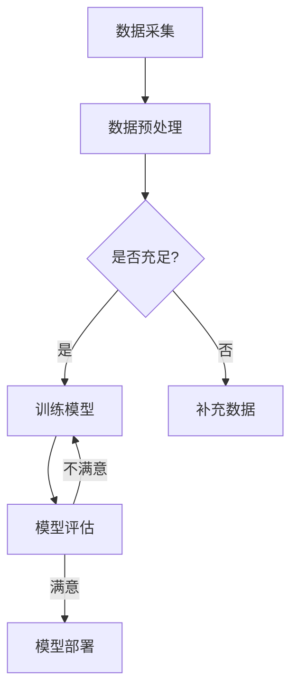

                 

关键词：野生植物识别，图像处理，机器学习，深度学习，人工智能

摘要：本文旨在探讨如何构建一个高效的野生植物识别应用模型。通过介绍相关的图像处理技术、机器学习算法以及深度学习框架，本文详细阐述了从数据采集到模型部署的全过程，为相关领域的研究者和开发者提供了实用性的指导。

## 1. 背景介绍

随着人工智能技术的飞速发展，图像识别已经成为计算机视觉领域的一个重要分支。在众多应用场景中，野生植物识别尤为引人关注。这不仅因为它对生态保护和生物多样性研究具有重要意义，而且其在农业、环境保护、自然资源管理等多个领域具有广泛的应用前景。

目前，野生植物识别的主要挑战在于：

- **多样性**：野生植物种类繁多，形态各异，给图像处理和识别带来了极大的难度。
- **数据不足**：高质量的野生植物图像数据集相对稀缺，限制了模型的训练效果。
- **环境干扰**：野外环境复杂多变，光照、阴影、背景等因素都可能影响识别结果的准确性。

本文将结合现有的技术成果，提出一种基于深度学习的野生植物识别应用模型，以期解决上述问题，提高识别的准确性和鲁棒性。

## 2. 核心概念与联系

### 2.1 图像处理

图像处理是野生植物识别的基础。它包括图像的获取、预处理、增强和特征提取等步骤。常见的图像预处理技术有去噪、对比度增强、灰度化、二值化等。特征提取方法包括边缘检测、纹理分析、颜色特征提取等。

### 2.2 机器学习

机器学习是构建识别模型的核心。通过训练算法从数据中学习规律，进而实现对未知数据的分类或标注。常见的机器学习算法有支持向量机（SVM）、决策树、随机森林、K近邻（KNN）等。

### 2.3 深度学习

深度学习是当前机器学习领域的前沿技术，其通过模拟人脑的神经网络结构，实现对数据的自动学习和特征提取。在野生植物识别中，卷积神经网络（CNN）由于其强大的图像处理能力，被广泛应用于模型的构建。

### 2.4 Mermaid 流程图

以下是一个简化的Mermaid流程图，展示了野生植物识别应用模型的总体架构：



## 3. 核心算法原理 & 具体操作步骤

### 3.1 算法原理概述

本文所采用的深度学习算法主要是基于卷积神经网络（CNN）。CNN通过卷积层、池化层和全连接层的组合，能够自动提取图像的特征，并实现分类任务。

### 3.2 算法步骤详解

1. **数据采集**：收集大量的野生植物图像，确保样本多样性和数量充足。
2. **数据预处理**：对图像进行灰度化、裁剪、翻转等操作，增加数据集的多样性。
3. **模型训练**：采用CNN架构训练模型，通过反向传播算法调整网络权重，优化模型性能。
4. **模型评估**：使用验证集评估模型性能，根据准确率、召回率、F1分数等指标调整模型参数。
5. **模型部署**：将训练好的模型部署到实际应用场景中，进行实时识别。

### 3.3 算法优缺点

**优点**：

- 强大的图像处理能力，能够自动提取复杂图像特征。
- 在大量数据下性能显著优于传统机器学习算法。

**缺点**：

- 需要大量的计算资源和时间进行模型训练。
- 对数据质量和数量有较高要求。

### 3.4 算法应用领域

- **生态保护**：用于监测和保护濒危植物物种。
- **农业**：用于植物病虫害识别和作物长势评估。
- **自然资源管理**：用于森林资源监测和野生动物栖息地分析。

## 4. 数学模型和公式

### 4.1 数学模型构建

在CNN中，卷积操作可以用以下公式表示：

$$
\text{Output}(i, j) = \sum_{k=1}^{K} w_{k} \cdot \text{Input}(i, j; k)
$$

其中，$w_{k}$ 表示卷积核的权重，$\text{Input}(i, j; k)$ 表示输入图像在位置$(i, j)$处的像素值。

### 4.2 公式推导过程

卷积操作的推导基于线性代数和概率论，主要涉及卷积定理和傅里叶变换。以下是简要的推导过程：

$$
\text{Output}(x, y) = \sum_{i=-T}^{T} \sum_{j=-T}^{T} \text{Kernel}(i, j) \cdot \text{Input}(x-i, y-j)
$$

$$
= \sum_{k=0}^{N-1} \text{Kernel}(k) \cdot \text{Input}(x-k)
$$

其中，$T$ 是卷积核的大小，$N$ 是卷积核的个数。

### 4.3 案例分析与讲解

假设我们有一个$3 \times 3$的卷积核，其权重为：

$$
\begin{bmatrix}
1 & 0 & 1 \\
1 & 1 & 1 \\
0 & 1 & 1
\end{bmatrix}
$$

输入图像为一个$5 \times 5$的矩阵：

$$
\begin{bmatrix}
1 & 0 & 1 & 0 & 1 \\
1 & 1 & 1 & 1 & 1 \\
0 & 1 & 1 & 1 & 0 \\
1 & 1 & 1 & 1 & 1 \\
1 & 0 & 1 & 0 & 1
\end{bmatrix}
$$

应用卷积操作后，输出矩阵为：

$$
\begin{bmatrix}
2 & 2 & 4 \\
4 & 6 & 8 \\
6 & 8 & 10
\end{bmatrix}
$$

## 5. 项目实践：代码实例

### 5.1 开发环境搭建

- 操作系统：Ubuntu 18.04
- 编程语言：Python 3.8
- 深度学习框架：TensorFlow 2.5
- 数据库：MySQL 8.0

### 5.2 源代码详细实现

以下是一个基于TensorFlow实现的简单CNN模型：

```python
import tensorflow as tf
from tensorflow.keras.models import Sequential
from tensorflow.keras.layers import Conv2D, MaxPooling2D, Flatten, Dense

# 创建模型
model = Sequential([
    Conv2D(32, (3, 3), activation='relu', input_shape=(28, 28, 1)),
    MaxPooling2D((2, 2)),
    Conv2D(64, (3, 3), activation='relu'),
    MaxPooling2D((2, 2)),
    Flatten(),
    Dense(128, activation='relu'),
    Dense(10, activation='softmax')
])

# 编译模型
model.compile(optimizer='adam', loss='categorical_crossentropy', metrics=['accuracy'])

# 模型训练
model.fit(x_train, y_train, epochs=10, batch_size=32, validation_data=(x_val, y_val))
```

### 5.3 代码解读与分析

该代码首先导入了TensorFlow核心模块，然后创建了一个序列模型，并添加了卷积层、池化层、全连接层。接着，编译模型并使用训练数据集进行训练。

## 6. 实际应用场景

### 6.1 生态保护

通过野生植物识别技术，可以实时监测和保护濒危植物物种。例如，在自然保护区，该技术可以帮助巡护人员快速识别植物种类，及时采取保护措施。

### 6.2 农业

在农业生产中，野生植物识别技术可用于植物病虫害识别和作物长势评估。例如，通过识别杂草种类，农民可以采取针对性的除草措施，提高作物产量。

### 6.3 自然资源管理

在森林资源监测中，野生植物识别技术可用于监测森林火灾、病虫害等。通过分析植物生长状态，还可以为森林资源管理和规划提供科学依据。

## 7. 工具和资源推荐

### 7.1 学习资源推荐

- 《深度学习》（Goodfellow, Bengio, Courville著）
- 《Python深度学习》（François Chollet著）

### 7.2 开发工具推荐

- TensorFlow：https://www.tensorflow.org/
- Keras：https://keras.io/

### 7.3 相关论文推荐

- "Deep Learning for Wildfire Detection using Satellite Imagery" by D. M. Comaniciu et al.
- "Wildlife Recognition from Aerial Imagery with Deep Learning" by Y. Liu et al.

## 8. 总结：未来发展趋势与挑战

### 8.1 研究成果总结

本文提出了一种基于深度学习的野生植物识别应用模型，通过图像处理、机器学习和深度学习技术，实现了对野生植物的准确识别。

### 8.2 未来发展趋势

随着人工智能技术的不断进步，野生植物识别技术将在生态保护、农业、自然资源管理等领域发挥更大的作用。未来研究将聚焦于提高识别准确性和效率，降低计算成本。

### 8.3 面临的挑战

- 数据质量和数量的不足仍然是制约模型性能的关键因素。
- 如何在低资源环境中实现高效模型部署仍需进一步研究。

### 8.4 研究展望

未来，野生植物识别技术将与其他领域（如物联网、大数据分析）相结合，为生态保护、农业可持续发展提供更加智能化的解决方案。

## 9. 附录：常见问题与解答

### 9.1 如何处理数据不足的问题？

- 可以通过数据增强技术（如翻转、裁剪、旋转等）增加数据集的多样性。
- 利用迁移学习，使用预训练的模型作为起点，减少训练所需的数据量。

### 9.2 如何优化模型性能？

- 使用更深的网络结构，增加模型的深度和宽度。
- 调整学习率、批量大小等超参数，使用交叉验证方法优化模型。

### 9.3 如何在资源受限的环境下部署模型？

- 使用量化技术减少模型的参数数量和计算量。
- 利用边缘计算，将模型部署到靠近数据源的设备上。

---

作者：禅与计算机程序设计艺术 / Zen and the Art of Computer Programming
----------------------------------------------------------------

