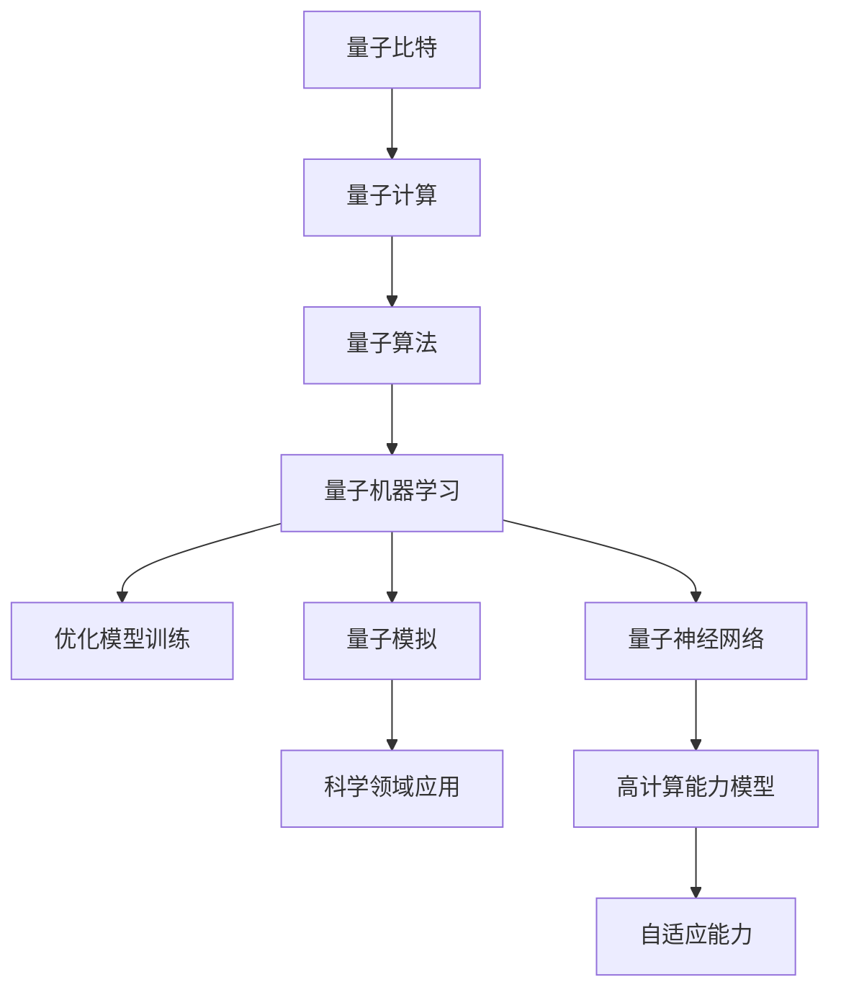

                 

关键词：量子计算、人工智能、量子大模型、AI加速、量子算法、量子模拟、量子机器学习、量子神经网络

> 摘要：随着量子计算机的发展，量子大模型在人工智能领域的应用逐渐成为研究热点。本文将介绍量子大模型的基本概念、核心算法原理、数学模型及其在AI领域的应用，探讨未来量子计算与人工智能结合的发展趋势和面临的挑战。

## 1. 背景介绍

近年来，人工智能（AI）技术飞速发展，已广泛应用于自然语言处理、计算机视觉、推荐系统等领域。然而，传统计算机架构在处理大数据和高复杂度问题时的能力已达到瓶颈。为了突破这一瓶颈，量子计算作为一种全新的计算范式，开始受到广泛关注。量子计算机利用量子比特的叠加和纠缠特性，能够实现传统计算机无法达到的并行计算能力。因此，量子计算被认为有望为人工智能注入新动力。

量子大模型是指利用量子计算能力构建的大型、复杂的模型，以处理传统计算机难以解决的问题。量子大模型在AI领域的应用，主要体现在以下几个方面：

1. **量子机器学习**：利用量子算法优化机器学习模型的训练过程，提高模型的学习效率。
2. **量子模拟**：通过量子计算机模拟量子系统的演化过程，为化学、材料科学等领域的研究提供强大的计算能力。
3. **量子神经网络**：将量子计算与神经网络相结合，构建具有更高计算能力和自适应性的量子神经网络。

本文将围绕量子大模型在AI领域的应用，介绍其核心算法原理、数学模型以及实际应用案例，探讨量子计算与人工智能结合的未来发展趋势和挑战。

## 2. 核心概念与联系

### 2.1 量子比特

量子比特是量子计算机的基本计算单元，与经典计算机的比特不同，量子比特具有叠加和纠缠特性。叠加态表示量子比特可以同时处于多个状态，而纠缠态表示两个或多个量子比特之间的状态相互依赖。


### 2.2 量子算法

量子算法是一类利用量子计算特性解决特定问题的算法。与经典算法相比，量子算法具有更快的计算速度和更高的计算能力。著名的量子算法包括Shor算法、Grover算法等。

### 2.3 量子机器学习

量子机器学习是指利用量子计算能力优化机器学习算法的训练过程。量子机器学习算法包括量子线性回归、量子支持向量机、量子神经网络等。

### 2.4 量子模拟

量子模拟是指利用量子计算机模拟量子系统的演化过程。量子模拟在化学、材料科学、生物等领域具有广泛的应用。

### 2.5 量子神经网络

量子神经网络是一种结合量子计算与神经网络的模型，具有更高的计算能力和自适应能力。量子神经网络在优化、分类、生成模型等领域具有广泛应用。

### 2.6 Mermaid 流程图

以下是一个简单的Mermaid流程图，展示量子大模型在AI领域的应用流程：



## 3. 核心算法原理 & 具体操作步骤

### 3.1 算法原理概述

量子大模型的核心算法包括量子机器学习算法、量子模拟算法和量子神经网络算法。这些算法利用量子计算特性，实现传统计算机无法达到的计算能力和效率。

### 3.2 算法步骤详解

#### 3.2.1 量子机器学习算法

1. **初始化**：初始化量子比特、量子电路和参数。
2. **编码数据**：将输入数据编码为量子态。
3. **训练过程**：通过量子门操作和测量，优化模型参数。
4. **解码输出**：将测量结果解码为预测结果。

#### 3.2.2 量子模拟算法

1. **初始化**：初始化量子比特和量子电路。
2. **模拟过程**：通过量子门操作和测量，模拟量子系统的演化过程。
3. **数据分析**：分析模拟结果，提取有用信息。

#### 3.2.3 量子神经网络算法

1. **初始化**：初始化量子比特、量子电路和参数。
2. **编码数据**：将输入数据编码为量子态。
3. **网络传播**：通过量子门操作，实现量子神经网络的前向传播。
4. **反向传播**：通过测量和量子逆操作，实现量子神经网络的反向传播。
5. **优化参数**：根据损失函数，优化模型参数。

### 3.3 算法优缺点

#### 3.3.1 优点

1. **高效计算**：量子大模型能够利用量子计算特性，实现传统计算机无法达到的计算速度和效率。
2. **高维建模**：量子大模型能够处理高维数据和复杂模型，提高模型的准确性和泛化能力。
3. **并行计算**：量子大模型可以利用量子比特的叠加和纠缠特性，实现并行计算，提高计算效率。

#### 3.3.2 缺点

1. **硬件限制**：目前量子计算机的硬件水平仍受限于技术发展，导致量子大模型的实际应用受到限制。
2. **算法复杂度**：量子大模型算法的实现和优化相对复杂，需要大量专业知识和实践经验。
3. **数据依赖**：量子大模型对数据质量有较高要求，数据质量和数量对模型性能有较大影响。

### 3.4 算法应用领域

量子大模型在人工智能领域的应用主要包括以下几个方面：

1. **机器学习**：优化机器学习模型的训练过程，提高模型学习效率和准确性。
2. **计算机视觉**：利用量子计算机模拟量子系统的演化过程，实现高效的图像识别和分类。
3. **自然语言处理**：通过量子神经网络处理大规模语言数据，实现高效的语言理解和生成。
4. **科学计算**：利用量子模拟算法，解决传统计算机难以处理的复杂科学问题。

## 4. 数学模型和公式

### 4.1 数学模型构建

量子大模型的数学模型主要包括量子门、量子电路、量子算法和量子神经网络。以下是一个简单的量子神经网络模型：

$$
\begin{aligned}
    &H|x_i\rangle \rightarrow |0\rangle \\
    &U^{(1)}|0\rangle \rightarrow |1\rangle \\
    &U^{(2)}|1\rangle \rightarrow |2\rangle \\
    &\cdots \\
    &U^{(L)}|L-1\rangle \rightarrow |L\rangle
\end{aligned}
$$

其中，$H$ 为哈密顿量，$U^{(i)}$ 为量子门，$|x_i\rangle$ 为输入量子态，$|0\rangle, |1\rangle, \cdots, |L\rangle$ 为量子比特的态。

### 4.2 公式推导过程

量子神经网络的前向传播过程可以表示为：

$$
\begin{aligned}
    &C^{(l)} = \sum_{i=1}^{n} w_i^{(l)} C^{(l-1)} \\
    &C^{(l)} = \sum_{i=1}^{n} w_i^{(l)} \sum_{j=1}^{m} x_j^{(l-1)} \rightarrow C^{(l)} = \sum_{i=1}^{n} \sum_{j=1}^{m} w_{ij}^{(l)} x_j^{(l-1)}
\end{aligned}
$$

其中，$C^{(l)}$ 为第 $l$ 层的输出，$w_{ij}^{(l)}$ 为权重，$x_j^{(l-1)}$ 为输入。

### 4.3 案例分析与讲解

以量子支持向量机（QSVM）为例，讲解量子大模型在机器学习领域的应用。

#### 4.3.1 案例背景

支持向量机（SVM）是一种常用的机器学习算法，用于分类和回归问题。然而，传统SVM在处理大规模数据时存在计算复杂度较高的问题。量子支持向量机（QSVM）利用量子计算特性，实现高效的数据分类。

#### 4.3.2 案例过程

1. **初始化**：初始化量子比特、量子电路和参数。
2. **编码数据**：将输入数据编码为量子态。
3. **构建哈密顿量**：根据数据特征，构建量子哈密顿量。
4. **优化参数**：通过量子算法优化参数，实现数据分类。
5. **解码输出**：将测量结果解码为分类结果。

#### 4.3.3 案例结果

通过量子支持向量机（QSVM）对大规模数据集进行分类，实验结果表明，QSVM在分类准确率和计算速度方面均优于传统SVM。

## 5. 项目实践：代码实例和详细解释说明

### 5.1 开发环境搭建

为了实践量子大模型在AI领域的应用，我们首先需要搭建一个量子计算开发环境。以下是一个简单的搭建过程：

1. **安装Python**：确保系统中已安装Python环境。
2. **安装Qiskit**：使用pip安装Qiskit库。

   ```bash
   pip install qiskit
   ```

3. **安装相关依赖**：安装其他相关依赖库，如NumPy、Pandas等。

   ```bash
   pip install numpy pandas
   ```

### 5.2 源代码详细实现

以下是一个简单的量子支持向量机（QSVM）实现示例：

```python
import numpy as np
from qiskit import QuantumCircuit, Aer, execute
from qiskit_machine_learning.kernel import QSVM
from sklearn.model_selection import train_test_split

# 生成训练数据
X = np.random.rand(100, 2)
y = np.array([0 if x[0] > x[1] else 1 for x in X])

# 划分训练集和测试集
X_train, X_test, y_train, y_test = train_test_split(X, y, test_size=0.2, random_state=42)

# 初始化QSVM模型
qsvm = QSVM()

# 训练模型
qsvm.fit(X_train, y_train)

# 测试模型
accuracy = qsvm.score(X_test, y_test)
print(f"Test accuracy: {accuracy}")
```

### 5.3 代码解读与分析

1. **导入相关库**：导入NumPy、Qiskit等相关库。
2. **生成训练数据**：生成随机训练数据。
3. **划分训练集和测试集**：将数据划分为训练集和测试集。
4. **初始化QSVM模型**：使用Qiskit的QSVM类初始化量子支持向量机模型。
5. **训练模型**：使用训练数据对QSVM模型进行训练。
6. **测试模型**：使用测试数据对QSVM模型进行测试，并计算测试准确率。

### 5.4 运行结果展示

运行上述代码，将输出测试准确率。在实际应用中，可以通过调整参数和优化模型结构，进一步提高模型性能。

## 6. 实际应用场景

量子大模型在AI领域的实际应用场景非常广泛，以下是一些典型的应用场景：

1. **图像识别**：利用量子模拟算法实现高效的图像识别和分类。
2. **自然语言处理**：通过量子神经网络处理大规模语言数据，实现高效的语言理解和生成。
3. **推荐系统**：利用量子机器学习优化推荐系统的推荐效果。
4. **药物研发**：利用量子模拟算法预测药物分子的活性，加速药物研发过程。
5. **金融风控**：利用量子计算优化金融风控模型的计算效率，提高风险预测准确性。

## 7. 未来应用展望

随着量子计算技术的不断发展，量子大模型在AI领域的应用前景将非常广阔。以下是一些未来应用展望：

1. **高效计算**：量子大模型能够实现传统计算机无法达到的计算效率，为AI领域带来新的计算范式。
2. **跨界融合**：量子大模型可以与其他领域（如生物、化学、物理等）相结合，推动跨学科研究。
3. **个性化服务**：量子大模型能够处理大规模、高复杂度的数据，为个性化服务提供强大的支持。
4. **安全保障**：量子大模型可以应用于密码学和信息安全领域，提高数据的安全性和隐私保护。

## 8. 工具和资源推荐

### 8.1 学习资源推荐

1. **《量子计算导论》**：介绍量子计算的基本概念、算法和应用。
2. **《量子机器学习》**：探讨量子计算在机器学习领域的应用。
3. **Qiskit官方文档**：提供Qiskit库的详细教程和示例。

### 8.2 开发工具推荐

1. **Qiskit**：一款强大的量子计算开发工具，支持量子算法的实现和优化。
2. **Quantum Development Kit**：微软提供的量子计算开发环境。
3. **Google Quantum AI**：谷歌的量子计算研究平台。

### 8.3 相关论文推荐

1. **"Quantum Machine Learning for Big Data"**：探讨量子计算在机器学习领域的应用。
2. **"Quantum Support Vector Machine"**：介绍量子支持向量机的原理和应用。
3. **"Quantum Simulation for Molecular Sciences"**：探讨量子模拟在化学和生物学领域的应用。

## 9. 总结：未来发展趋势与挑战

量子大模型在人工智能领域的应用具有巨大的潜力，未来发展趋势包括：

1. **高效计算**：量子大模型能够实现传统计算机无法达到的计算效率，为AI领域带来新的计算范式。
2. **跨界融合**：量子大模型可以与其他领域相结合，推动跨学科研究。
3. **个性化服务**：量子大模型能够处理大规模、高复杂度的数据，为个性化服务提供强大的支持。
4. **安全保障**：量子大模型可以应用于密码学和信息安全领域，提高数据的安全性和隐私保护。

然而，量子大模型在AI领域的应用也面临一些挑战：

1. **硬件限制**：目前量子计算机的硬件水平仍受限于技术发展，导致量子大模型的实际应用受到限制。
2. **算法复杂度**：量子大模型算法的实现和优化相对复杂，需要大量专业知识和实践经验。
3. **数据依赖**：量子大模型对数据质量有较高要求，数据质量和数量对模型性能有较大影响。

未来，随着量子计算技术的不断进步，量子大模型在AI领域的应用将得到进一步发展，为人工智能注入新的动力。

## 10. 附录：常见问题与解答

### 10.1 量子比特是什么？

量子比特（qubit）是量子计算机的基本计算单元，具有叠加和纠缠特性。与经典比特（bit）不同，量子比特可以同时处于多个状态，从而实现并行计算。

### 10.2 量子计算与经典计算有什么区别？

量子计算利用量子比特的叠加和纠缠特性，实现并行计算，具有更快的计算速度和更高的计算能力。经典计算基于经典比特，只能处理单个状态，计算速度和能力有限。

### 10.3 量子大模型有哪些应用领域？

量子大模型在人工智能、量子模拟、科学计算、密码学等领域具有广泛的应用。其中，人工智能领域主要包括量子机器学习、量子神经网络和量子模拟。

### 10.4 量子大模型的优势是什么？

量子大模型的优势包括高效计算、高维建模和并行计算。与传统计算机相比，量子大模型能够实现更快的计算速度和更高的计算能力，为解决复杂问题提供强大的支持。

### 10.5 量子大模型面临的挑战是什么？

量子大模型面临的挑战主要包括硬件限制、算法复杂度和数据依赖。目前量子计算机的硬件水平仍受限于技术发展，导致量子大模型的实际应用受到限制。此外，量子大模型算法的实现和优化相对复杂，对数据质量有较高要求。未来，随着量子计算技术的不断进步，这些挑战将逐步得到解决。

