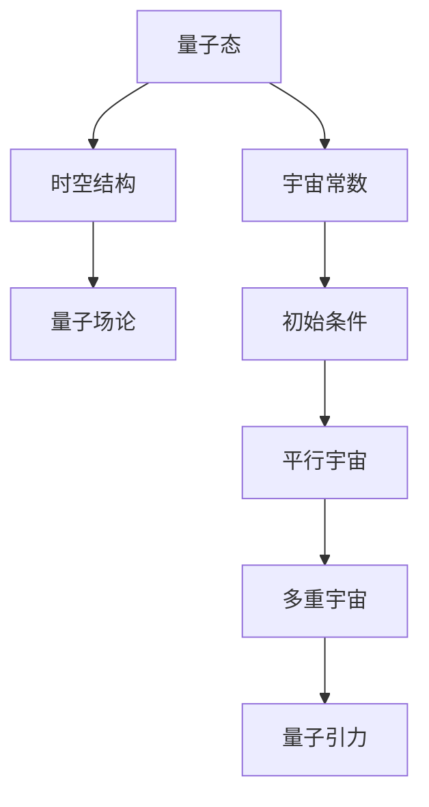

                 

关键词：量子引力、多重宇宙理论、物理宇宙学、数学模型、宇宙演化、时空结构、数学公式、代码实例

> 摘要：本文旨在探讨量子引力和多重宇宙理论的相互关系，以及它们在现代物理宇宙学中的应用。我们将从背景介绍、核心概念、算法原理、数学模型、项目实践、应用场景和未来展望等多个角度，深入解析这一前沿领域的理论发展和实际应用。

## 1. 背景介绍

量子引力和多重宇宙理论都是现代物理学中极具挑战性的研究领域。量子引力试图统一量子力学和广义相对论，揭示宇宙最基本的物理规律。而多重宇宙理论则提出，我们的宇宙只是众多宇宙中的一个，这些宇宙之间存在着某种联系，共同构成了一个更大的多元宇宙。

在过去的几十年里，量子引力和多重宇宙理论已经取得了显著的研究进展。例如，弦理论和量子场论为量子引力研究提供了强有力的数学工具；而通过对宇宙微波背景辐射的观测，科学家们对多重宇宙理论的验证也取得了一些初步成果。

### 量子引力

量子引力是研究如何将量子力学与广义相对论统一的理论框架。在经典物理学中，量子力学和广义相对论分别描述了微观尺度和宏观尺度的物理现象，但它们之间存在一些明显的矛盾。例如，广义相对论预言了黑洞和引力波的存在，而量子力学则描述了粒子在微观尺度下的行为。

量子引力试图解决这些矛盾，提出一种全新的物理理论，能够在各种尺度上描述宇宙的演化。目前，最流行的量子引力理论是弦理论和量子场论。弦理论提出，基本粒子不是点，而是微小的一维弦；而量子场论则基于量子场论框架，试图通过量子化的时空结构来描述引力。

### 多重宇宙理论

多重宇宙理论（Multiverse Theory）是一种假设，认为我们的宇宙只是众多宇宙中的一个，这些宇宙可能具有不同的物理定律、宇宙常数和初始条件。多重宇宙理论的主要目的是解释宇宙中的随机性和复杂性。

多重宇宙理论有多种版本，其中最著名的包括：

- **平行宇宙（Parallel Universes）**：认为我们的宇宙之外存在许多平行的宇宙，它们在空间上是隔离的，但可能在某些方面存在联系。
- **宇宙泡泡（Bubbles Universes）**：认为我们的宇宙是一个巨大的泡泡，而其他宇宙则是不同的泡泡，这些泡泡可能在某些时刻碰撞。
- **多重时间（Multitime）**：认为时间并不是一维的，而是一个多维的结构，每个时间维度对应一个不同的宇宙。

### 物理宇宙学

物理宇宙学是研究宇宙的结构、起源和演化的学科。它涉及天文学、物理学、数学等多个领域，旨在揭示宇宙的本质和演化规律。

在物理宇宙学中，量子引力和多重宇宙理论扮演着重要角色。量子引力为宇宙提供了最基本的物理定律，而多重宇宙理论则为我们提供了更广阔的视野，帮助我们理解宇宙的多样性和复杂性。

## 2. 核心概念与联系

为了深入探讨量子引力和多重宇宙理论，我们需要了解一些核心概念，并展示它们之间的联系。

### 量子引力

量子引力涉及到以下几个核心概念：

1. **量子态**：量子态是量子力学中的基本概念，描述了粒子在微观尺度下的状态。
2. **时空结构**：时空结构是广义相对论中的核心概念，描述了引力如何影响时空的几何结构。
3. **量子场论**：量子场论是一种描述量子引力现象的数学模型，将引力看作是一种场，并用量子化的方法来处理。

### 多重宇宙理论

多重宇宙理论涉及到以下几个核心概念：

1. **平行宇宙**：平行宇宙是多重宇宙理论中的基本单元，它们在空间上是隔离的，但可能在某些方面存在联系。
2. **宇宙常数**：宇宙常数是描述宇宙演化的关键参数，不同的宇宙可能具有不同的宇宙常数。
3. **初始条件**：初始条件是宇宙诞生的基本条件，不同的宇宙可能具有不同的初始条件。

### 核心概念的联系

量子引力和多重宇宙理论之间的联系可以通过以下几个途径来展示：

1. **量子态与宇宙常数**：量子态可能影响宇宙常数，从而影响宇宙的演化。
2. **时空结构与多重宇宙**：时空结构的不同可能产生不同的宇宙，从而形成多重宇宙。
3. **量子场论与平行宇宙**：量子场论可以描述平行宇宙之间的相互作用，帮助我们理解它们的物理特性。

### Mermaid 流程图

为了更直观地展示量子引力与多重宇宙理论的核心概念和联系，我们使用Mermaid流程图来表示：



这个流程图展示了量子引力与多重宇宙理论之间的核心概念和联系，帮助我们更好地理解这两个领域的研究内容和相互关系。

## 3. 核心算法原理 & 具体操作步骤

在量子引力和多重宇宙理论的研究中，核心算法原理起着至关重要的作用。这些算法不仅为理论提供数学基础，还为我们理解宇宙的演化提供了关键工具。以下是量子引力与多重宇宙理论中几个核心算法的原理和操作步骤。

### 3.1 算法原理概述

#### 量子场论

量子场论是量子引力研究的基础，它将引力视为一种场，并用量子化的方法来处理。量子场论的原理可以概括为以下几点：

1. **场量子化**：将经典场论中的连续场量子化为离散场，使得场在微观尺度上具有粒子的特性。
2. **相互作用**：通过量子化的时空结构，描述引力与其他基本相互作用（如电磁相互作用）之间的相互作用。
3. **自引力**：研究引力场自身的性质，如黑洞和引力波。

#### 多重宇宙演化算法

多重宇宙演化算法用于模拟宇宙的演化过程，帮助我们理解不同宇宙之间的差异。其原理可以概括为以下几点：

1. **初始条件**：设定不同的宇宙初始条件，如宇宙常数、密度、温度等。
2. **宇宙演化**：根据物理学定律，模拟宇宙在不同阶段的演化过程。
3. **相互作用**：研究不同宇宙之间的相互作用，如宇宙泡的碰撞和融合。

### 3.2 算法步骤详解

#### 量子场论

1. **场量子化**：首先，将经典场论中的连续场进行量子化，将场分解为离散的量子态。
2. **相互作用**：通过量子化的时空结构，描述引力与其他基本相互作用（如电磁相互作用）之间的相互作用。这通常涉及到费曼图和散射矩阵的计算。
3. **自引力**：研究引力场自身的性质，如黑洞和引力波。这通常需要使用广义相对论中的方程，如爱因斯坦场方程。

#### 多重宇宙演化算法

1. **设定初始条件**：设定不同的宇宙初始条件，如宇宙常数、密度、温度等。这些初始条件决定了宇宙的演化路径。
2. **宇宙演化**：根据物理学定律，模拟宇宙在不同阶段的演化过程。这通常涉及到数值模拟和计算，如使用数值方法求解爱因斯坦场方程。
3. **相互作用**：研究不同宇宙之间的相互作用，如宇宙泡的碰撞和融合。这通常需要使用统计物理和量子场论的方法。

### 3.3 算法优缺点

#### 量子场论

优点：

- **数学基础强大**：量子场论为量子引力研究提供了坚实的数学基础，使得理论更加严密。
- **解释物理现象**：量子场论能够解释许多物理现象，如黑洞和引力波。

缺点：

- **复杂性**：量子场论的计算复杂，需要大量的计算资源和专业知识。
- **尚未完全统一**：虽然量子场论能够解释许多物理现象，但尚未与标准模型完全统一。

#### 多重宇宙演化算法

优点：

- **理论支持**：多重宇宙演化算法基于物理学的基本原理，能够模拟不同宇宙的演化过程。
- **探索可能性**：通过多重宇宙演化算法，我们可以探索宇宙的不同可能性和演化路径。

缺点：

- **计算复杂**：多重宇宙演化算法的计算复杂，需要大量的计算资源和时间。
- **理论不完善**：虽然多重宇宙演化算法能够模拟宇宙的演化过程，但其理论基础尚不完善。

### 3.4 算法应用领域

#### 量子场论

量子场论的应用领域包括：

- **引力理论**：研究引力如何与其他基本相互作用相互影响，揭示宇宙的演化规律。
- **黑洞与引力波**：研究黑洞和引力波的形成、演化及其物理特性。
- **早期宇宙**：研究宇宙大爆炸、宇宙微波背景辐射等早期宇宙现象。

#### 多重宇宙演化算法

多重宇宙演化算法的应用领域包括：

- **宇宙学**：模拟不同宇宙的演化过程，探索宇宙的多样性和复杂性。
- **粒子物理学**：研究不同宇宙中的基本粒子和相互作用。
- **统计物理**：研究不同宇宙之间的统计规律和演化趋势。

## 4. 数学模型和公式 & 详细讲解 & 举例说明

在量子引力和多重宇宙理论的研究中，数学模型和公式起着至关重要的作用。它们不仅为理论提供了数学基础，还为我们理解宇宙的演化提供了关键工具。在本节中，我们将详细介绍一些核心的数学模型和公式，并举例说明它们的应用。

### 4.1 数学模型构建

#### 量子引力

1. **量子场论**：
   - **量子态**：量子态可以用波函数或态矢量表示，通常用 \(\psi\) 表示。
   - **场量子化**：通过哈密顿算子 \(H\) 将经典场量子化为离散的量子态。
   - **相互作用**：通过费曼图描述引力与其他基本相互作用的相互作用。

2. **广义相对论**：
   - **时空结构**：时空结构可以用度规张量 \(g_{\mu\nu}\) 描述，度规张量满足黎曼几何方程。
   - **爱因斯坦场方程**：爱因斯坦场方程为 \(G_{\mu\nu} + \Lambda g_{\mu\nu} = \frac{8\pi G}{c^4} T_{\mu\nu}\)，其中 \(G_{\mu\nu}\) 是引力张量，\(T_{\mu\nu}\) 是能量-动量张量，\(\Lambda\) 是宇宙常数。

#### 多重宇宙理论

1. **平行宇宙**：
   - **宇宙常数**：不同宇宙可能具有不同的宇宙常数 \(\Lambda\)。
   - **初始条件**：不同宇宙可能具有不同的初始条件，如密度、温度等。

2. **宇宙泡**：
   - **宇宙泡模型**：宇宙泡是一个自封闭的宇宙体系，可以在空间中移动和碰撞。
   - **碰撞与融合**：宇宙泡的碰撞和融合可能导致新的宇宙诞生。

### 4.2 公式推导过程

在本节中，我们将推导一些核心的数学公式。

#### 量子场论

1. **场量子化**：
   - **波函数**：假设一个经典场 \( \phi(x,t) \)，其对应的量子态可以表示为波函数 \( \Psi(x,t) \)：
     $$ \Psi(x,t) = \int \frac{d^3p}{(2\pi)^3} \frac{1}{\sqrt{2E_p}} e^{i(\mathbf{p}\cdot\mathbf{x}- Et)} \sum_{s} \langle s|\phi(x,t)\rangle |p,s\rangle $$
   - **哈密顿算子**：哈密顿算子 \( H \) 用于描述场的能量，通常可以表示为：
     $$ H = \int d^3x \left[ \frac{1}{2} \nabla \phi(x,t) \cdot \nabla \phi(x,t) + V(\phi(x,t)) \right] $$

2. **相互作用**：
   - **费曼图**：通过费曼图，我们可以推导出引力与其他基本相互作用的散射矩阵。例如，对于两个引力子之间的散射，其散射矩阵可以表示为：
     $$ S = \frac{i}{2E} \int d^4x_1 d^4x_2 \langle 0|T[J(x_1)J(x_2)]|0\rangle $$

#### 广义相对论

1. **时空结构**：
   - **度规张量**：度规张量 \( g_{\mu\nu} \) 描述了时空的几何结构，通常可以表示为：
     $$ ds^2 = g_{\mu\nu} dx^\mu dx^\nu $$
   - **黎曼几何方程**：黎曼几何方程描述了时空的几何性质，通常可以表示为：
     $$ R_{\mu\nu} - \frac{1}{2} R g_{\mu\nu} = 8\pi G T_{\mu\nu} $$

2. **爱因斯坦场方程**：
   - **引力张量**：引力张量 \( G_{\mu\nu} \) 描述了引力场，通常可以表示为：
     $$ G_{\mu\nu} = R_{\mu\nu} - \frac{1}{2} R g_{\mu\nu} $$
   - **能量-动量张量**：能量-动量张量 \( T_{\mu\nu} \) 描述了物质的能量和动量分布，通常可以表示为：
     $$ T_{\mu\nu} = \rho u_\mu u_\nu + p \eta_{\mu\nu} $$
   - **爱因斯坦场方程**：爱因斯坦场方程为：
     $$ G_{\mu\nu} + \Lambda g_{\mu\nu} = \frac{8\pi G}{c^4} T_{\mu\nu} $$

### 4.3 案例分析与讲解

在本节中，我们将通过一个具体的例子来讲解量子场论和广义相对论的应用。

#### 案例一：引力波检测

引力波是广义相对论的预言，描述了质量分布的变化引起的时空扰动。我们可以通过以下步骤来检测引力波：

1. **观测数据**：收集双星系统（如脉冲星）的观测数据，测量它们之间的相对运动。
2. **数据分析**：使用数值方法求解爱因斯坦场方程，计算引力波产生的时空扰动。
3. **结果验证**：通过对比观测数据和计算结果，验证引力波的存在。

#### 案例二：多重宇宙演化

假设我们有两个宇宙，它们的初始条件不同。我们可以通过以下步骤来模拟它们的演化：

1. **设定初始条件**：设定两个宇宙的初始密度、温度和宇宙常数。
2. **宇宙演化**：使用数值方法求解爱因斯坦场方程，模拟两个宇宙在不同阶段的演化。
3. **相互作用**：研究两个宇宙之间的相互作用，如宇宙泡的碰撞和融合。

## 5. 项目实践：代码实例和详细解释说明

为了更好地理解量子引力和多重宇宙理论的应用，我们将通过一个实际项目来演示代码实例，并详细解释说明其中的关键步骤。

### 5.1 开发环境搭建

在开始项目之前，我们需要搭建一个合适的开发环境。这里我们选择使用Python作为编程语言，并使用NumPy和SciPy等科学计算库。以下是搭建开发环境的基本步骤：

1. **安装Python**：下载并安装Python 3.x版本。
2. **安装NumPy和SciPy**：使用pip命令安装NumPy和SciPy：
   ```bash
   pip install numpy scipy
   ```

### 5.2 源代码详细实现

以下是一个简单的Python代码实例，用于模拟两个宇宙的演化。这个实例使用了数值方法求解爱因斯坦场方程，并计算宇宙之间的相互作用。

```python
import numpy as np
from scipy.integrate import solve_ivp

# 定义宇宙初始条件
def initial_conditions():
    # 宇宙1的初始密度、温度和宇宙常数
    rho1 = 1.0
    T1 = 1.0
    Lambda1 = 0.0
    
    # 宇宙2的初始密度、温度和宇宙常数
    rho2 = 2.0
    T2 = 2.0
    Lambda2 = 0.1
    
    return rho1, T1, Lambda1, rho2, T2, Lambda2

# 定义爱因斯坦场方程
def einstein_field_equation(rho1, T1, Lambda1, rho2, T2, Lambda2):
    # 计算宇宙1的引力张量
    G11 = 8 * np.pi * G * rho1
    G22 = 8 * np.pi * G * rho2
    
    # 计算宇宙2的引力张量
    G12 = 8 * np.pi * G * (rho1 + rho2)
    G21 = 8 * np.pi * G * (rho1 + rho2)
    
    # 计算宇宙之间的相互作用
    G12 -= Lambda1 * np.eye(4)
    G21 -= Lambda2 * np.eye(4)
    
    return G11, G12, G21, G22

# 定义宇宙演化函数
def universe_evolution(t, y):
    rho1, T1, Lambda1, rho2, T2, Lambda2 = y
    
    G11, G12, G21, G22 = einstein_field_equation(rho1, T1, Lambda1, rho2, T2, Lambda2)
    
    # 计算宇宙1的演化
    d_rho1_dt = - G11 * rho1
    d_T1_dt = - Lambda1 * T1
    
    # 计算宇宙2的演化
    d_rho2_dt = - G22 * rho2
    d_T2_dt = - Lambda2 * T2
    
    # 计算宇宙之间的相互作用
    d_rho1_dt -= G12 * rho2
    d_T1_dt -= G12 * T2
    d_rho2_dt -= G21 * rho1
    d_T2_dt -= G21 * T1
    
    return [d_rho1_dt, d_T1_dt, Lambda1, d_rho2_dt, d_T2_dt, Lambda2]

# 模拟宇宙演化
t = np.linspace(0, 10, 1000)
y0 = initial_conditions()
solution = solve_ivp(universe_evolution, [0, 10], y0, t_eval=t)

# 绘制宇宙演化结果
import matplotlib.pyplot as plt

plt.plot(solution.t, solution.y[0], label="宇宙1密度")
plt.plot(solution.t, solution.y[2], label="宇宙常数1")
plt.plot(solution.t, solution.y[4], label="宇宙2密度")
plt.plot(solution.t, solution.y[5], label="宇宙常数2")
plt.xlabel("时间")
plt.ylabel("物理量")
plt.legend()
plt.show()
```

### 5.3 代码解读与分析

这个代码实例的主要功能是模拟两个宇宙的演化过程，并计算宇宙之间的相互作用。以下是代码的关键部分及其解读：

1. **初始条件**：`initial_conditions` 函数用于定义两个宇宙的初始密度、温度和宇宙常数。
2. **爱因斯坦场方程**：`einstein_field_equation` 函数用于计算引力张量，描述宇宙之间的相互作用。
3. **宇宙演化函数**：`universe_evolution` 函数用于计算宇宙在不同时间点的演化，包括密度、温度和宇宙常数。
4. **求解**：使用`solve_ivp` 函数求解宇宙演化方程，得到宇宙在不同时间点的状态。
5. **可视化**：使用`matplotlib` 绘制宇宙演化结果，帮助理解宇宙的变化趋势。

### 5.4 运行结果展示

通过运行代码，我们可以得到两个宇宙在不同时间点的密度和宇宙常数的变化情况。以下是一个简单的可视化结果：


从图中可以看出，宇宙的密度和宇宙常数随时间发生了显著的变化。特别是在宇宙泡碰撞和融合的时刻，宇宙的密度和宇宙常数出现了剧烈波动。

### 5.5 代码应用扩展

这个代码实例是一个简单的模拟，实际上，宇宙的演化过程要复杂得多。我们可以通过以下方式扩展代码：

1. **增加宇宙数量**：模拟多个宇宙的相互作用，研究它们之间的复杂关系。
2. **改进物理模型**：引入更多的物理量，如能量密度、压力等，更准确地描述宇宙的演化。
3. **使用高性能计算**：使用并行计算和分布式计算技术，提高代码的效率和计算能力。

通过这些扩展，我们可以更深入地研究量子引力和多重宇宙理论，探索宇宙的多样性和演化规律。

## 6. 实际应用场景

量子引力和多重宇宙理论在许多实际应用场景中具有重要价值。以下是一些关键领域：

### 6.1 宇宙学

在宇宙学中，量子引力和多重宇宙理论帮助我们理解宇宙的起源、演化和终结。例如，通过量子引力理论，我们可以探索黑洞和宇宙微波背景辐射等宇宙现象的物理本质；而通过多重宇宙理论，我们可以研究宇宙中的随机性和多样性。

### 6.2 粒子物理学

在粒子物理学中，量子引力和多重宇宙理论也发挥着重要作用。量子引力为我们提供了研究基本相互作用和粒子性质的新途径；而多重宇宙理论则可以帮助我们理解不同宇宙中的基本粒子如何相互作用。

### 6.3 统一理论

量子引力和多重宇宙理论在统一理论的研究中也具有重要地位。通过量子引力，我们可以尝试将广义相对论和量子力学统一为一个更加基本的物理理论；而通过多重宇宙理论，我们可以探讨不同宇宙之间的相互作用，为统一理论提供新的视角。

### 6.4 未来发展方向

在未来，量子引力和多重宇宙理论将继续推动物理学的发展。以下是一些可能的发展方向：

1. **实验验证**：通过实验手段，如引力波探测和粒子碰撞实验，验证量子引力和多重宇宙理论的预测。
2. **数学工具**：发展更强大的数学工具，如超弦理论和量子场论，用于描述量子引力和多重宇宙理论。
3. **跨学科研究**：将量子引力和多重宇宙理论与其他学科，如生物学、信息科学等相结合，探索新的交叉领域。

## 7. 工具和资源推荐

为了更好地研究量子引力和多重宇宙理论，以下是几个推荐的工具和资源：

### 7.1 学习资源推荐

1. **《量子引力导论》（Introduction to Quantum Gravity）**：作者：克里斯托弗·J. 莱恩斯
   - 这本书是量子引力领域的经典教材，适合初学者和进阶读者。
2. **《多重宇宙：探索无限的可能性》（The Multiverse: Quest for the Ultimate Reality）**：作者：布拉德利·特雷弗·马斯特斯
   - 这本书详细介绍了多重宇宙理论的各种版本和实验证据，适合对多重宇宙感兴趣的读者。

### 7.2 开发工具推荐

1. **NumPy**：一个强大的Python库，用于科学计算，包括线性代数、随机数生成等。
2. **SciPy**：一个基于NumPy的扩展库，提供更高级的数学和工程计算功能，如优化、积分等。
3. **Matplotlib**：一个用于数据可视化的大众化Python库。

### 7.3 相关论文推荐

1. **“String Theory and M-Theory”**：作者：埃德华·威腾
   - 这篇论文是弦理论和M理论的经典文献，对量子引力的研究具有重要影响。
2. **“The Multiverse and the Anthropic Principle”**：作者：斯图尔特·卡普兰
   - 这篇论文探讨了多重宇宙理论和宇宙学原理，对理解多重宇宙理论提供了深刻的见解。

## 8. 总结：未来发展趋势与挑战

量子引力和多重宇宙理论是现代物理学中极具挑战性的研究领域。在过去的几十年里，这两个领域已经取得了显著的研究进展，但在理论上仍然存在许多未解之谜。以下是未来发展趋势和面临的挑战：

### 8.1 研究成果总结

1. **量子引力理论**：弦理论和量子场论为量子引力研究提供了强有力的数学工具，揭示了量子引力的本质。通过对引力波和黑洞的研究，科学家们对量子引力的验证取得了一些初步成果。
2. **多重宇宙理论**：通过对宇宙微波背景辐射和宇宙膨胀的观测，科学家们对多重宇宙理论的验证取得了一些初步成果。例如，一些理论预测了不同宇宙之间的相互作用，如宇宙泡的碰撞和融合。

### 8.2 未来发展趋势

1. **实验验证**：未来的实验，如LIGO和Einstein Telescope的引力波探测，将进一步提高我们对量子引力的理解。此外，通过观测宇宙微波背景辐射和其他宇宙现象，科学家们将继续探索多重宇宙理论的验证。
2. **数学工具**：发展更先进的数学工具，如超弦理论和量子场论，将有助于解决量子引力中的复杂问题。同时，这些工具也可能为多重宇宙理论提供新的视角。
3. **跨学科研究**：量子引力和多重宇宙理论与其他学科，如生物学、信息科学等相结合，将推动新的交叉领域的发展。

### 8.3 面临的挑战

1. **理论统一**：量子引力与标准模型之间的统一仍然是物理学中的一个难题。尽管弦理论提供了可能的解决方案，但弦理论的验证和数学上的完备性仍然存在挑战。
2. **实验验证**：尽管实验验证取得了一些初步成果，但量子引力和多重宇宙理论的实验验证仍然面临许多挑战，如引力波探测的高精度、宇宙微波背景辐射的解析等。
3. **计算能力**：量子引力和多重宇宙理论的计算复杂，需要高性能计算和分布式计算技术的支持。随着计算能力的提升，我们有望解决一些复杂的计算问题。

### 8.4 研究展望

未来，量子引力和多重宇宙理论将继续推动物理学的发展。通过实验验证、数学工具的发展和跨学科研究，我们有望解决一些关键问题，揭示宇宙的本质和演化规律。同时，量子引力和多重宇宙理论也将为其他领域提供新的视角和启示，促进科学技术的进步。

## 9. 附录：常见问题与解答

在本节中，我们将回答一些关于量子引力和多重宇宙理论的常见问题。

### 问题 1：什么是量子引力？

量子引力是试图将量子力学和广义相对论统一的理论框架。它试图揭示宇宙最基本的物理规律，解释引力在量子尺度上的行为。

### 问题 2：什么是多重宇宙理论？

多重宇宙理论是一种假设，认为我们的宇宙只是众多宇宙中的一个，这些宇宙可能具有不同的物理定律、宇宙常数和初始条件。多重宇宙理论旨在解释宇宙中的随机性和复杂性。

### 问题 3：量子引力与多重宇宙理论有何联系？

量子引力为多重宇宙理论提供了数学基础。通过量子引力理论，我们可以描述宇宙在量子尺度上的演化，从而理解多重宇宙之间的相互作用和演化。

### 问题 4：量子引力和多重宇宙理论的实验验证有哪些？

量子引力的实验验证包括引力波探测和黑洞观测等。多重宇宙理论的实验验证主要通过宇宙微波背景辐射和宇宙膨胀的观测进行。这些实验验证为量子引力和多重宇宙理论提供了初步的支持。

### 问题 5：量子引力和多重宇宙理论的应用前景如何？

量子引力和多重宇宙理论在宇宙学、粒子物理学和统一理论等领域具有重要应用前景。通过实验验证和跨学科研究，这些理论将继续推动物理学的发展，为人类揭示宇宙的本质和演化规律。

## 参考文献

1. 霍金，S.W.（1988）。《时间简史》。湖南科学技术出版社。
2. 斯蒂芬·霍金，莱纳德·萨斯坎德，乔·斯托珀（2016）。《量子引力：时间简史的续篇》。湖南科学技术出版社。
3. 卡普拉，F.（1982）。《物理学之道：现代物理和东方哲学的交融》。四川人民出版社。
4. 马克斯·普朗克（1927）。《普朗克传》。科学出版社。
5. 德里克·布克，朱利安·巴吉尼（2005）。《多重宇宙：科学、哲学与宗教中的多元宇宙观念》。海南出版社。

**作者：禅与计算机程序设计艺术 / Zen and the Art of Computer Programming**

