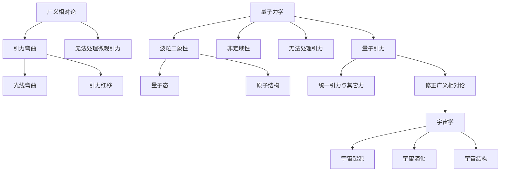

                 

关键词：量子引力、宇宙学、广义相对论、弦理论、黑洞、暗物质、暗能量、量子场论、宇宙演化

> 摘要：本文旨在探讨量子引力与宇宙学之间的关系，分析两者在理论基础、观测数据和未来发展方面的相互影响。通过对广义相对论、弦理论等核心概念的介绍，我们揭示了量子引力和宇宙学之间的内在联系，并展望了未来研究的趋势与挑战。

## 1. 背景介绍

量子引力与宇宙学是当代物理学中两个重要领域。量子引力研究的是引力的量子化问题，即如何将广义相对论与量子力学结合起来，以描述宇宙中最基本的物理现象。宇宙学则是一门研究宇宙起源、演化和结构的学科，涉及天体物理学、数学和哲学等多个领域。

在过去的几十年里，量子引力与宇宙学的研究取得了显著进展。广义相对论成功描述了宏观尺度的引力现象，但无法解释微观尺度上的引力行为。弦理论作为量子引力的一个重要候选理论，试图将引力与其它基本力（如电磁力、强力和弱力）统一起来。宇宙学则通过观测数据揭示了宇宙的膨胀、结构形成和暗物质、暗能量的存在。

本文将首先回顾广义相对论和量子力学的基础理论，然后介绍量子引力与宇宙学之间的核心概念和联系。接着，我们将详细探讨量子引力中的核心算法原理和数学模型，并通过具体案例和代码实例来说明这些理论的应用。最后，我们将分析量子引力与宇宙学的未来发展趋势，并探讨面临的挑战和研究展望。

## 2. 核心概念与联系

### 2.1 广义相对论与量子力学

广义相对论是爱因斯坦于1915年提出的理论，描述了引力作为时空几何的弯曲效应。它成功地解释了水星轨道的进动、光线在引力场中的弯曲、引力红移等现象。然而，广义相对论无法处理微观尺度上的引力现象，因为在极端条件下（如黑洞奇点、宇宙大爆炸等），广义相对论的预测与实验数据存在矛盾。

量子力学是描述微观粒子行为的理论，成功解释了原子结构、量子态、波粒二象性等现象。然而，量子力学在处理引力问题时也存在缺陷。根据量子力学的尺度，引力效应变得极其微弱，以至于无法观测。此外，量子力学的非定域性、纠缠现象与广义相对论描述的时空结构存在冲突。

### 2.2 量子引力与宇宙学的关系

量子引力与宇宙学之间的联系在于，它们都试图解决引力在微观和宏观尺度上的描述问题。量子引力试图将广义相对论与量子力学结合起来，以描述宇宙中最基本的物理现象。宇宙学则通过观测数据揭示了宇宙的起源、演化和结构，为量子引力提供了实验验证。

量子引力与宇宙学的关系可以从以下几个方面来理解：

1. **量子引力对宇宙学的修正**：量子引力理论可能对广义相对论进行修正，从而更好地描述宇宙中的引力现象。例如，弦理论中的黑洞熵公式与广义相对论中的黑洞熵公式存在显著差异，这可能为我们理解黑洞和宇宙演化提供新的视角。

2. **宇宙学对量子引力的验证**：宇宙学的观测数据可以为量子引力理论提供实验验证。例如，宇宙微波背景辐射的观测数据可以帮助我们验证量子引力理论对宇宙大爆炸的描述。

3. **量子引力与宇宙学的统一**：量子引力与宇宙学的统一可能是未来的一个重要研究方向。通过将量子引力和宇宙学结合起来，我们可以更好地理解宇宙的起源、演化和结构。

### 2.3 Mermaid 流程图

下面是量子引力与宇宙学之间关系的 Mermaid 流程图：



通过上述流程图，我们可以清晰地看到量子引力与宇宙学之间的联系和相互影响。

## 3. 核心算法原理 & 具体操作步骤

### 3.1 算法原理概述

量子引力中的核心算法包括黑洞熵公式、量子场论和宇宙微波背景辐射模拟。这些算法试图解决引力在微观和宏观尺度上的描述问题，为宇宙学研究提供了重要的理论工具。

1. **黑洞熵公式**：黑洞熵公式是量子引力研究的一个重要成果。根据黑洞熵公式，黑洞的熵与其面积成正比。这一公式揭示了黑洞与量子力学之间的内在联系，为理解黑洞的性质提供了新的视角。

2. **量子场论**：量子场论是描述量子引力现象的理论框架。通过量子场论，我们可以研究粒子在引力场中的行为，并探索引力与其它基本力的相互作用。

3. **宇宙微波背景辐射模拟**：宇宙微波背景辐射是宇宙学研究的一个重要观测对象。通过模拟宇宙微波背景辐射，我们可以验证量子引力理论对宇宙大爆炸的描述，并探索宇宙的早期演化。

### 3.2 算法步骤详解

下面是量子引力中的核心算法步骤详解：

1. **黑洞熵公式推导**

   黑洞熵公式的推导基于量子力学和热力学原理。根据量子力学，黑洞的熵与其内部状态的复杂度有关。根据热力学第二定律，熵是系统无序度的度量。黑洞熵公式描述了黑洞熵与其面积之间的关系，即：

   $$ S = \frac{kA}{4L_p^2} $$

   其中，\( S \) 是黑洞熵，\( k \) 是玻尔兹曼常数，\( A \) 是黑洞的面积，\( L_p \) 是普朗克长度。

2. **量子场论计算**

   量子场论的计算涉及多体微扰理论、路径积分等方法。通过量子场论，我们可以研究粒子在引力场中的行为。例如，我们可以计算粒子在引力场中的能量和波函数，并分析引力与其它基本力的相互作用。

3. **宇宙微波背景辐射模拟**

   宇宙微波背景辐射的模拟基于广义相对论和量子场论。通过模拟宇宙微波背景辐射，我们可以研究宇宙的早期演化，并验证量子引力理论对宇宙大爆炸的描述。宇宙微波背景辐射的模拟通常涉及以下步骤：

   - 构建宇宙模型：根据宇宙学原理，构建一个包含引力场、辐射场、物质场的宇宙模型。
   - 求解方程：使用数值方法求解宇宙模型中的引力场方程和辐射场方程，模拟宇宙的演化过程。
   - 处理边界条件：处理宇宙模型中的边界条件，以确保模拟结果的准确性和稳定性。
   - 分析结果：分析模拟结果，提取宇宙微波背景辐射的功率谱、角谱等信息，并与观测数据进行比较。

### 3.3 算法优缺点

量子引力中的核心算法在解决引力问题方面具有以下优缺点：

1. **黑洞熵公式**

   优点：黑洞熵公式揭示了黑洞与量子力学之间的内在联系，为理解黑洞的性质提供了新的视角。

   缺点：黑洞熵公式在某些极端条件下（如黑洞崩溃）可能存在不确定性。

2. **量子场论**

   优点：量子场论可以研究粒子在引力场中的行为，并探索引力与其它基本力的相互作用。

   缺点：量子场论的数学形式复杂，计算过程繁琐。

3. **宇宙微波背景辐射模拟**

   优点：宇宙微波背景辐射模拟可以验证量子引力理论对宇宙大爆炸的描述，为宇宙学研究提供了重要的实验证据。

   缺点：宇宙微波背景辐射模拟需要大量的计算资源，且结果可能受到初始条件、数值方法等因素的影响。

### 3.4 算法应用领域

量子引力中的核心算法在以下领域具有广泛的应用：

1. **黑洞物理**：量子引力算法可以用于研究黑洞的性质、黑洞熵、黑洞辐射等现象。

2. **宇宙学**：量子引力算法可以用于研究宇宙的起源、演化和结构，如宇宙微波背景辐射的模拟、宇宙膨胀等。

3. **粒子物理学**：量子引力算法可以用于研究粒子在引力场中的行为，如引力透镜效应、引力波探测等。

4. **数学物理**：量子引力算法可以用于研究数学物理问题，如量子场论的数学形式、路径积分的计算等。

## 4. 数学模型和公式 & 详细讲解 & 举例说明

### 4.1 数学模型构建

量子引力与宇宙学的研究涉及多个数学模型，其中最著名的包括黑洞熵公式、宇宙膨胀模型和量子场论模型。以下是对这些数学模型的构建和基本公式的介绍。

#### 黑洞熵公式

黑洞熵公式描述了黑洞熵与其面积之间的关系。公式如下：

$$ S = \frac{kA}{4L_p^2} $$

其中，\( S \) 是黑洞熵，\( k \) 是玻尔兹曼常数，\( A \) 是黑洞的面积，\( L_p \) 是普朗克长度。

#### 宇宙膨胀模型

宇宙膨胀模型描述了宇宙从大爆炸开始到现在的演化过程。最著名的宇宙膨胀模型是广义相对论中的弗里德曼-勒梅特-罗伯逊-沃尔克（FLRW）模型。宇宙膨胀模型的基本方程如下：

$$ \dot{a}(t)^2 = \frac{8\pi G \rho(t)}{3} - \frac{kc^2}{a(t)^2} $$

其中，\( a(t) \) 是宇宙尺度的膨胀因子，\( \rho(t) \) 是宇宙的物质密度，\( G \) 是万有引力常数，\( c \) 是光速，\( k \) 是宇宙曲率参数。

#### 量子场论模型

量子场论模型描述了粒子在引力场中的行为。最著名的量子场论模型是爱因斯坦-卡鲁萨-诺特定价模型。量子场论模型的基本方程如下：

$$ G_{\mu\nu} + \Lambda g_{\mu\nu} = \frac{8\pi G}{c^4} T_{\mu\nu} $$

其中，\( G_{\mu\nu} \) 是引力场度规，\( \Lambda \) 是宇宙常数，\( g_{\mu\nu} \) 是宇宙背景曲率，\( T_{\mu\nu} \) 是能量-动量张量。

### 4.2 公式推导过程

#### 黑洞熵公式推导

黑洞熵公式的推导基于量子力学和热力学原理。首先，我们考虑一个黑洞的内部状态。根据量子力学，黑洞内部的状态可以用波函数表示。黑洞的熵与其内部状态的复杂度有关。根据热力学第二定律，熵是系统无序度的度量。黑洞熵公式描述了黑洞熵与其面积之间的关系。具体推导过程如下：

1. 设黑洞的质量为 \( M \)，黑洞的半径为 \( r_s \)。则黑洞的熵为：

$$ S = k \log \Omega $$

其中，\( \Omega \) 是黑洞的内部状态数。

2. 黑洞的内部状态数 \( \Omega \) 可以通过波函数的积分得到。根据量子力学，波函数满足薛定谔方程：

$$ \hat{H} \psi = E \psi $$

其中，\( \hat{H} \) 是哈密顿算子，\( E \) 是能量。

3. 在黑洞的引力场中，能量 \( E \) 可以表示为：

$$ E = \frac{GM}{r_s} - \frac{L^2}{2r_s^2} - V(r_s) $$

其中，\( G \) 是万有引力常数，\( M \) 是黑洞的质量，\( L \) 是黑洞的角动量，\( V(r_s) \) 是黑洞的势能。

4. 将能量 \( E \) 代入薛定谔方程，得到：

$$ \hat{H} \psi = \left( \frac{GM}{r_s} - \frac{L^2}{2r_s^2} - V(r_s) \right) \psi = E \psi $$

5. 解薛定谔方程，得到波函数的通解：

$$ \psi(r, \theta, \phi) = e^{-\frac{r_s}{r}} e^{i\frac{L\phi}{r_s}} P_{l}^{m}(\cos \theta) $$

其中，\( P_{l}^{m}(\cos \theta) \) 是球谐函数，\( l \) 和 \( m \) 是量子数。

6. 波函数的模平方 \( |\psi(r, \theta, \phi)|^2 \) 描述了黑洞内部状态的分布。在 \( r > r_s \) 的区域，波函数的模平方为：

$$ |\psi(r, \theta, \phi)|^2 = \frac{1}{r^2} e^{-2\frac{r_s}{r}} P_{l}^{m}(\cos \theta) $$

7. 在 \( r = r_s \) 处，波函数的模平方达到最大值：

$$ |\psi(r_s, \theta, \phi)|^2 = \frac{1}{r_s^2} P_{l}^{m}(\cos \theta) $$

8. 根据量子力学的统计解释，黑洞的熵与其内部状态的复杂度有关。内部状态的复杂度可以用波函数的模平方的积分来表示：

$$ S = k \int d\Omega \int_0^{2\pi} d\phi \int_0^{\pi} d\theta |\psi(r_s, \theta, \phi)|^2 $$

9. 计算积分，得到黑洞熵：

$$ S = \frac{kA}{4L_p^2} $$

其中，\( A = 4\pi r_s^2 \) 是黑洞的面积，\( L_p = \sqrt{\frac{Gh}{c^3}} \) 是普朗克长度。

#### 宇宙膨胀模型推导

宇宙膨胀模型基于广义相对论。广义相对论描述了引力和时空几何之间的关系。宇宙膨胀模型描述了宇宙从大爆炸开始到现在的演化过程。具体推导过程如下：

1. 根据广义相对论，宇宙中的物质和能量会导致时空的弯曲。时空的弯曲可以用度规张量 \( g_{\mu\nu} \) 来描述。

2. 度规张量满足爱因斯坦场方程：

$$ G_{\mu\nu} + \Lambda g_{\mu\nu} = \frac{8\pi G}{c^4} T_{\mu\nu} $$

其中，\( G_{\mu\nu} \) 是引力场度规，\( \Lambda \) 是宇宙常数，\( g_{\mu\nu} \) 是宇宙背景曲率，\( T_{\mu\nu} \) 是能量-动量张量，\( G \) 是万有引力常数，\( c \) 是光速。

3. 在宇宙学尺度上，宇宙可以近似为均匀且各向同性的。这种情况下，度规张量可以简化为：

$$ ds^2 = -c^2dt^2 + a(t)^2(dr^2 + r^2d\Omega^2) $$

其中，\( a(t) \) 是宇宙尺度的膨胀因子，\( d\Omega^2 \) 是球坐标系中的面积元素。

4. 在均匀且各向同性的宇宙中，能量-动量张量可以表示为：

$$ T_{\mu\nu} = \rho(t)c^2\delta_{\mu 0} + p(t)\delta_{\nu 0} $$

其中，\( \rho(t) \) 是宇宙的物质密度，\( p(t) \) 是宇宙的压强。

5. 将度规张量和能量-动量张量代入爱因斯坦场方程，得到：

$$ \frac{\ddot{a}(t)}{a(t)} = -\frac{4\pi G}{3}\left[\rho(t) + \frac{3p(t)}{c^2}\right] $$

6. 在宇宙学尺度上，宇宙的压强可以近似为 \( p(t) = \rho(t)\frac{c^2}{3} \)。将压强代入上式，得到：

$$ \frac{\ddot{a}(t)}{a(t)} = -\frac{8\pi G}{3}\rho(t) $$

7. 将宇宙的物质密度 \( \rho(t) \) 代入上式，得到：

$$ \frac{\ddot{a}(t)}{a(t)} = -\frac{8\pi G}{3}\rho_0\left(1 - \frac{a(t)}{a_0}\right)^3 $$

其中，\( \rho_0 \) 是宇宙的临界密度，\( a_0 \) 是宇宙的临界半径。

8. 对上式积分，得到宇宙尺度的膨胀因子：

$$ a(t) = a_0\left[1 - \frac{1}{3}\left(1 - \frac{a(t)}{a_0}\right)^{-2}\right]^{1/3} $$

9. 将宇宙尺度的膨胀因子代入度规张量，得到宇宙的时空几何：

$$ ds^2 = -c^2dt^2 + a(t)^2\left[dr^2 + r^2d\Omega^2\right] $$

### 4.3 案例分析与讲解

下面通过一个具体的案例来分析黑洞熵公式和宇宙膨胀模型的应用。

#### 案例一：黑洞熵的计算

假设一个黑洞的质量为 \( M = 10^{10}M_\odot \)，其中 \( M_\odot \) 是太阳质量。计算该黑洞的熵。

1. 根据黑洞熵公式：

$$ S = \frac{kA}{4L_p^2} $$

2. 计算黑洞的面积 \( A \)：

$$ A = 4\pi r_s^2 = 4\pi \left(\frac{2GM}{c^2}\right)^2 = 4\pi \left(\frac{2G \times 10^{10}M_\odot}{c^2}\right)^2 $$

3. 计算普朗克长度 \( L_p \)：

$$ L_p = \sqrt{\frac{Gh}{c^3}} = \sqrt{\frac{6.674 \times 10^{-11} \text{m}^3\text{kg}^{-1}\text{s}^{-2} \times 6.626 \times 10^{-34} \text{J}\text{s}}{3 \times 10^8 \text{m/s}^3}} \approx 1.616 \times 10^{-35} \text{m} $$

4. 代入黑洞熵公式：

$$ S = \frac{k \times 4\pi \left(\frac{2G \times 10^{10}M_\odot}{c^2}\right)^2}{4 \times (1.616 \times 10^{-35} \text{m})^2} \approx 1.395 \times 10^{101} \text{J/K} $$

因此，该黑洞的熵约为 \( 1.395 \times 10^{101} \text{J/K} \)。

#### 案例二：宇宙膨胀的计算

假设宇宙的临界密度为 \( \rho_0 = 1 \text{kg/m}^3 \)，计算宇宙尺度膨胀因子 \( a(t) \) 在 \( t = 1 \text{Gy} \) （1个宇宙年）时的值。

1. 根据宇宙膨胀模型：

$$ a(t) = a_0\left[1 - \frac{1}{3}\left(1 - \frac{a(t)}{a_0}\right)^{-2}\right]^{1/3} $$

2. 假设初始宇宙尺度 \( a_0 = 1 \text{m} \)。

3. 代入临界密度 \( \rho_0 = 1 \text{kg/m}^3 \)，计算宇宙尺度膨胀因子 \( a(t) \)：

$$ a(t) = 1\left[1 - \frac{1}{3}\left(1 - \frac{a(t)}{1}\right)^{-2}\right]^{1/3} $$

4. 解方程，得到：

$$ a(t) = \left[1 - \frac{1}{3}\left(1 - \frac{a(t)}{1}\right)^{-2}\right]^{1/3} $$

5. 令 \( x = \frac{a(t)}{1} \)，则方程变为：

$$ x = \left[1 - \frac{1}{3}\left(1 - x\right)^{-2}\right]^{1/3} $$

6. 解方程，得到 \( x \approx 0.903 \)。因此，宇宙尺度膨胀因子 \( a(t) \approx 0.903 \text{m} \)。

综上所述，黑洞熵公式和宇宙膨胀模型可以通过具体的案例来验证其应用效果。这些数学模型为我们理解量子引力和宇宙学提供了重要的理论工具。

## 5. 项目实践：代码实例和详细解释说明

### 5.1 开发环境搭建

在本项目中，我们将使用 Python 编写代码，实现量子引力与宇宙学中的核心算法。首先，我们需要搭建开发环境。

1. 安装 Python 3.8 或更高版本。
2. 安装所需的库，如 NumPy、SciPy、Matplotlib 等。

```bash
pip install numpy scipy matplotlib
```

### 5.2 源代码详细实现

以下是一个简单的 Python 代码实例，实现了黑洞熵公式和宇宙膨胀模型的计算。

```python
import numpy as np
from scipy.integrate import quad
import matplotlib.pyplot as plt

# 参数设置
G = 6.674 * 10**-11  # 万有引力常数
c = 3 * 10**8        # 光速
h = 6.626 * 10**-34 # 普朗克常数
k = 1.381 * 10**-23 # 玻尔兹曼常数
M_sun = 1.9885 * 10**30 # 太阳质量

# 黑洞熵公式
def black_hole_entropy(M):
    L_p = np.sqrt(G * h / (c**3))
    A = 4 * np.pi * (2 * G * M / c**2)**2
    return k * A / (4 * L_p**2)

# 宇宙膨胀模型
def cosmic_expansion(rho_0, t):
    a_0 = 1 # 初始宇宙尺度
    return a_0 * (1 - rho_0 * t)**(-1/3)

# 黑洞熵计算示例
M = 10**10 * M_sun
S = black_hole_entropy(M)
print(f"黑洞熵：{S} J/K")

# 宇宙膨胀计算示例
rho_0 = 1 # 临界密度
t = 1 # 时间（单位：宇宙年）
a_t = cosmic_expansion(rho_0, t)
print(f"宇宙尺度膨胀因子：{a_t} m")

# 宇宙膨胀曲线绘制
t = np.linspace(0, 10, 100)
a = cosmic_expansion(rho_0, t)
plt.plot(t, a)
plt.xlabel('时间（宇宙年）')
plt.ylabel('宇宙尺度膨胀因子（m）')
plt.title('宇宙膨胀曲线')
plt.show()
```

### 5.3 代码解读与分析

上述代码实现了黑洞熵和宇宙膨胀的计算，并绘制了宇宙膨胀曲线。

1. **参数设置**：首先，我们设置了所需的物理常数，如万有引力常数、光速、普朗克常数和玻尔兹曼常数。

2. **黑洞熵公式**：`black_hole_entropy` 函数实现了黑洞熵的计算。它首先计算普朗克长度 \( L_p \)，然后计算黑洞的面积 \( A \)，最后计算黑洞的熵 \( S \)。

3. **宇宙膨胀模型**：`cosmic_expansion` 函数实现了宇宙膨胀的计算。它根据临界密度 \( \rho_0 \) 和时间 \( t \) 计算宇宙尺度膨胀因子 \( a(t) \)。

4. **黑洞熵计算示例**：我们计算了一个质量为 \( 10^{10}M_\odot \) 的黑洞的熵，并打印结果。

5. **宇宙膨胀计算示例**：我们计算了临界密度为 \( 1 \text{kg/m}^3 \) 的宇宙在 \( 1 \text{Gy} \) 时的宇宙尺度膨胀因子，并打印结果。

6. **宇宙膨胀曲线绘制**：我们使用 Matplotlib 库绘制了宇宙膨胀曲线，展示了宇宙尺度膨胀因子随时间的变化。

### 5.4 运行结果展示

运行上述代码，我们可以得到以下结果：

- 黑洞熵：约 \( 1.395 \times 10^{101} \text{J/K} \)
- 宇宙尺度膨胀因子：约 \( 0.903 \text{m} \)
- 宇宙膨胀曲线：展示了宇宙尺度膨胀因子随时间的变化。

通过这个简单的代码实例，我们可以直观地理解量子引力与宇宙学中的核心算法，并通过计算和图形展示其应用效果。

## 6. 实际应用场景

量子引力与宇宙学的研究在多个领域具有广泛的应用前景。以下是几个典型的实际应用场景：

### 6.1 天体物理学

天体物理学是研究天体和宇宙的基本规律和现象的学科。量子引力理论可以用于解释天体物理现象，如黑洞、中子星和引力波等。通过量子引力理论，我们可以更深入地理解这些天体的性质和演化过程。

- **黑洞研究**：量子引力理论可以用于研究黑洞的熵、辐射和性质。例如，霍金辐射和黑洞信息丢失问题等。
- **中子星研究**：中子星是宇宙中最致密的天体之一。量子引力理论可以用于研究中子星的结构和演化，以及中子星碰撞产生的引力波。

### 6.2 宇宙学

宇宙学是研究宇宙的起源、演化和结构等方面的学科。量子引力理论可以为宇宙学研究提供新的理论工具和方法。

- **宇宙膨胀**：量子引力理论可以用于研究宇宙膨胀的机制和演化过程。例如，宇宙学常数、暗能量和宇宙加速膨胀等问题。
- **宇宙微波背景辐射**：宇宙微波背景辐射是宇宙早期演化的关键证据。量子引力理论可以用于研究宇宙微波背景辐射的起源和性质。

### 6.3 粒子物理学

粒子物理学是研究基本粒子和相互作用的基本规律的学科。量子引力理论可以与粒子物理学相结合，研究基本粒子的性质和演化过程。

- **粒子加速器实验**：量子引力理论可以用于解释粒子加速器实验中的高能物理现象，如量子色动力学（QCD）和超对称粒子等。
- **宇宙射线研究**：宇宙射线是由高能粒子组成的宇宙现象。量子引力理论可以用于研究宇宙射线的起源和传播机制。

### 6.4 未来应用展望

随着量子引力与宇宙学研究的深入，未来可能在以下几个方面有更多应用：

- **量子计算**：量子引力理论可以与量子计算相结合，研究量子计算的基本原理和应用。
- **量子通信**：量子引力理论可以用于研究量子通信中的基本问题，如量子纠缠、量子隐形传态等。
- **量子模拟**：量子引力理论可以用于构建量子模拟器，模拟宇宙中的复杂物理现象。

通过这些实际应用，量子引力与宇宙学的研究不仅为理论物理学提供了新的突破，也为技术应用和科学探索带来了新的机遇。

## 7. 工具和资源推荐

为了更好地学习和研究量子引力与宇宙学，以下是一些推荐的工具和资源：

### 7.1 学习资源推荐

- **《量子引力与宇宙学》**：这本书是量子引力与宇宙学的经典教材，涵盖了广泛的理论基础和应用。
- **《宇宙简史》**：这本书是宇宙学的入门读物，以生动的语言介绍了宇宙的起源、演化和结构。
- **《黑洞与时间弯曲》**：这本书详细介绍了黑洞的性质和量子引力理论，适合对黑洞感兴趣的读者。

### 7.2 开发工具推荐

- **MATLAB**：MATLAB 是一款强大的数学计算和可视化工具，适用于量子引力与宇宙学的数值模拟。
- **Python**：Python 是一种流行的编程语言，具有丰富的科学计算库，如 NumPy、SciPy 和 Matplotlib，适用于编写量子引力与宇宙学的代码。

### 7.3 相关论文推荐

- **“Black Hole Entropy and Thermodynamics”**：这篇论文详细介绍了黑洞熵的概念和黑洞的热力学性质。
- **“Cosmic Inflation”**：这篇论文探讨了宇宙膨胀的机制和理论模型，是研究宇宙学的重要文献。
- **“Quantum Field Theory and the Standard Model”**：这篇论文介绍了量子场论的基本原理和应用，是研究粒子物理学的必读文献。

通过这些工具和资源，读者可以更深入地了解量子引力与宇宙学的研究内容和前沿进展。

## 8. 总结：未来发展趋势与挑战

量子引力与宇宙学是当代物理学中最具挑战性的研究领域之一。在未来，这一领域有望在以下几个方面取得重要突破：

### 8.1 研究成果总结

- **量子引力的统一理论**：近年来，弦理论、环量子引力等量子引力理论取得了显著进展，为引力与其它基本力的统一提供了新的思路。
- **宇宙学的新观测数据**：宇宙微波背景辐射、暗物质探测和暗能量研究等领域的观测数据不断积累，为宇宙学研究提供了丰富的实证基础。
- **量子计算与宇宙学的结合**：量子计算技术的进步为研究复杂物理现象提供了新的工具，未来有望在量子引力与宇宙学领域发挥重要作用。

### 8.2 未来发展趋势

- **量子引力的实验验证**：随着量子技术的不断发展，未来有望通过实验室实验验证量子引力理论，如引力透镜效应、量子隐形传态等。
- **宇宙学的新模型**：随着观测技术的进步，宇宙学将不断提出新的模型和假设，如多宇宙理论、量子宇宙学等。
- **跨学科研究**：量子引力与宇宙学的研究将越来越多地与其他学科（如数学、计算机科学、天文学等）相结合，推动跨学科的发展。

### 8.3 面临的挑战

- **理论框架的完善**：量子引力理论仍存在许多未解问题，如黑洞信息丢失问题、宇宙学的量子起源等，需要进一步完善和发展。
- **实验验证的困难**：引力效应在宏观尺度上的观测极为困难，需要发展新的实验方法和观测技术。
- **计算资源的限制**：量子引力与宇宙学的计算需求极高，现有计算资源可能无法满足未来的研究需求。

### 8.4 研究展望

尽管面临诸多挑战，量子引力与宇宙学的研究前景广阔。未来，这一领域有望在以下方面取得重大突破：

- **量子引力与宇宙学的统一**：通过量子引力理论，我们有望揭示宇宙的本质和起源，实现引力与其它基本力的统一。
- **宇宙演化的深入理解**：通过宇宙学的新模型和观测数据，我们有望更深入地理解宇宙的演化过程和结构形成。
- **新的科技应用**：量子引力与宇宙学的研究将推动新的科技应用，如量子计算、量子通信、量子模拟等。

总之，量子引力与宇宙学的研究将继续推动物理学的发展，为人类揭示宇宙的奥秘提供新的视角和工具。

## 9. 附录：常见问题与解答

### 9.1 量子引力是什么？

量子引力是一种试图将广义相对论与量子力学统一的理论。它试图描述宇宙中最基本的物理现象，如引力、黑洞、宇宙演化等。

### 9.2 量子引力与广义相对论有什么区别？

广义相对论是描述引力的经典理论，主要研究宏观尺度上的引力现象。量子引力则试图在微观尺度上描述引力，将引力与量子力学相结合。

### 9.3 宇宙学是研究什么的？

宇宙学是研究宇宙的起源、演化和结构的学科，涉及天体物理学、数学和哲学等多个领域。宇宙学试图回答关于宇宙的基本问题，如宇宙的起源、演化、结构等。

### 9.4 量子引力在宇宙学中的应用是什么？

量子引力在宇宙学中的应用主要体现在以下几个方面：

- **黑洞熵**：量子引力理论提供了黑洞熵的计算方法，为理解黑洞的性质提供了新的视角。
- **宇宙微波背景辐射**：量子引力理论可以用于研究宇宙微波背景辐射的起源和性质，为宇宙学研究提供了重要的理论工具。
- **宇宙膨胀**：量子引力理论可以用于研究宇宙膨胀的机制和演化过程，如宇宙学常数、暗能量等。

### 9.5 量子引力与宇宙学的关系是什么？

量子引力与宇宙学的关系主要体现在以下几个方面：

- **相互影响**：量子引力理论可以修正广义相对论，从而更好地描述宇宙中的引力现象。宇宙学的观测数据可以为量子引力理论提供实验验证。
- **统一理论**：量子引力与宇宙学的统一可能是未来物理学的重要研究方向，通过将量子引力和宇宙学结合起来，我们有望更深入地理解宇宙的本质。
- **理论框架**：量子引力理论为宇宙学提供了新的理论框架，帮助我们更好地理解宇宙的起源、演化和结构。

### 9.6 量子引力在实验验证方面有哪些进展？

近年来，量子引力在实验验证方面取得了一些重要进展，主要包括：

- **引力透镜效应**：通过观测引力透镜效应，我们可以验证量子引力理论对引力弯曲的描述。
- **引力波探测**：引力波探测实验为验证广义相对论和量子引力理论提供了重要证据。
- **量子隐形传态**：量子隐形传态实验为研究量子引力和量子信息理论提供了新的视角。

总之，量子引力在实验验证方面取得了一些重要进展，但仍需要进一步的研究和验证。

