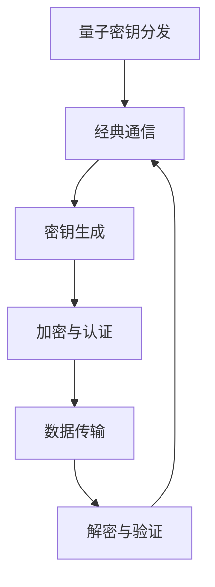

                 

## 1. 背景介绍

在当今数字化的时代，网络安全问题日益凸显，密码学作为保障信息安全的基石，发挥着至关重要的作用。传统的密码学体系主要基于基于数学难题的复杂性，如大数分解、离散对数等问题。然而，随着计算能力的不断提升，这些基于数学难题的安全保障正面临日益严峻的挑战。为了应对这种挑战，量子计算作为一种全新的计算模式，逐渐引起了密码学界的广泛关注。

量子计算是基于量子力学原理的计算机，具有传统计算机无法比拟的并行计算能力和计算速度。量子计算利用量子位（qubit）进行信息处理，能够在极短的时间内解决传统计算机难以处理的复杂问题。这一特性使得量子计算在密码学中具有巨大的应用潜力。传统的密码学算法在量子计算机面前可能变得脆弱，而量子密码学则提供了一种新的安全通信手段，可以有效抵御量子计算机的攻击。

量子密码学的研究主要集中在量子密钥分发（Quantum Key Distribution, QKD）和量子算法在传统密码系统中的应用。量子密钥分发利用量子纠缠和量子态的不可克隆特性，实现安全的密钥传输。而量子算法则能够破解传统密码系统的密钥，从而为密码学提供新的理论依据。

本文旨在探讨量子计算在密码学中的应用，分析量子密码学的基本原理、核心算法以及未来发展趋势。通过本文的阐述，读者将能够了解量子密码学的基本概念和重要性，以及如何在未来的安全通信中利用量子计算的优势。

## 2. 核心概念与联系

要深入理解量子计算在密码学中的应用，首先需要掌握量子计算与密码学之间的核心概念和联系。本节将介绍量子计算的基本原理、量子密码学的基本概念，并借助 Mermaid 流程图展示量子密码系统的架构。

### 2.1 量子计算的基本原理

量子计算依赖于量子力学的两个基本原理：量子叠加和量子纠缠。

#### 量子叠加

量子叠加是指一个量子系统可以同时处于多种状态的组合。在经典物理学中，一个物体只能处于一个确定的状态。然而，在量子力学中，一个量子位（qubit）可以同时处于0和1的状态。这种叠加状态可以用如下公式表示：

$$
|\psi\rangle = a|0\rangle + b|1\rangle
$$

其中，$a$ 和 $b$ 是复数，满足 $|a|^2 + |b|^2 = 1$。这意味着一个量子位在测量前是同时处于0和1状态的。

#### 量子纠缠

量子纠缠是指两个或多个量子位之间的状态无法独立存在，而是相互关联。即使这些量子位相隔很远，它们之间的状态也会瞬间变化。这一现象违背了经典物理学的局域实在论。量子纠缠是量子计算的核心优势之一，它使得量子计算机能够在并行处理多个任务。

### 2.2 量子密码学的基本概念

量子密码学是利用量子力学原理设计密码系统的一门学科。量子密码学主要包括以下几种基本概念：

#### 量子密钥分发（QKD）

量子密钥分发是一种利用量子态传输密钥的技术。QKD 基于量子态的不可克隆特性和量子纠缠现象，可以实现安全的密钥传输。在 QKD 中，发送方和接收方通过量子通道交换量子态，并利用经典通信渠道进行纠错和隐私放大，最终生成共享的密钥。

#### 量子算法

量子算法是利用量子计算机解决传统密码学问题的算法。量子算法可以有效地破解传统密码系统的密钥，如大数分解和离散对数问题。此外，量子算法还可以用于量子加密和量子认证，提高密码系统的安全性。

### 2.3 量子密码系统的架构

为了更好地理解量子计算在密码学中的应用，我们借助 Mermaid 流程图展示量子密码系统的架构。以下是一个简化的量子密码系统架构图：



#### 密钥分发

在量子密钥分发阶段，发送方和接收方通过量子通道交换量子态，并利用量子纠缠和量子态的不可克隆特性生成共享密钥。

#### 密钥生成

通过经典通信渠道，发送方和接收方对共享的密钥进行纠错和隐私放大，生成最终的密钥。

#### 加密与认证

在数据传输阶段，发送方利用生成的密钥对数据进行加密和认证。

#### 数据传输

加密后的数据通过信道传输到接收方。

#### 解密与验证

接收方利用共享的密钥对数据进行解密和验证，确保数据的安全性和完整性。

通过上述架构，我们可以看到量子计算在密码学中的应用不仅提供了新的安全通信手段，还改善了传统密码系统的安全性。

## 3. 核心算法原理 & 具体操作步骤

量子计算在密码学中的应用主要体现在量子密钥分发和量子算法两个方面。本节将详细介绍这两个核心算法的原理以及具体的操作步骤。

### 3.1 算法原理概述

#### 量子密钥分发（QKD）

量子密钥分发是一种基于量子力学原理的密钥生成方法，其核心思想是利用量子态的不可克隆特性和量子纠缠现象实现安全的密钥传输。QKD 的主要原理如下：

1. **量子态传输**：发送方将随机生成的量子态通过量子通道传输给接收方。
2. **基选择**：接收方对传输的量子态进行基选择测量，以确定量子态的基。
3. **密钥生成**：发送方和接收方通过经典通信渠道协商基选择结果，并根据共同选定的基对量子态进行测量，生成共享的密钥。
4. **纠错与隐私放大**：对生成的密钥进行纠错和隐私放大，以提高密钥的安全性。

#### 量子算法

量子算法是利用量子计算机解决传统密码学问题的算法。常见的量子算法包括：

1. **量子大数分解算法**：利用量子叠加和量子纠缠原理，可以在多项式时间内解决大数分解问题。
2. **量子离散对数算法**：利用量子计算的优势，可以在多项式时间内解决离散对数问题。
3. **量子加密算法**：利用量子计算的特性，实现高效且安全的加密算法。

### 3.2 算法步骤详解

#### 量子密钥分发（QKD）

1. **量子态生成**：发送方随机生成一个量子态，并将其通过量子通道发送给接收方。
2. **基选择测量**：接收方对传输的量子态进行基选择测量，以确定量子态的基。假设接收方选择了基$|\psi\rangle = a|0\rangle + b|1\rangle$。
3. **量子态传输与测量**：发送方对传输的量子态进行相同的基选择测量，记录测量结果。
4. **密钥生成**：发送方和接收方通过经典通信渠道协商基选择结果。如果基选择结果相同，则对共享的量子态进行测量，生成共享的密钥。
5. **纠错与隐私放大**：对生成的密钥进行纠错和隐私放大，以提高密钥的安全性。

#### 量子大数分解算法

1. **大数表示**：将大数表示为 $N = ab$ 的形式，其中 $a$ 和 $b$ 为较小的数。
2. **量子态制备**：将 $a$ 和 $b$ 编码到量子态中，生成一个叠加态。
3. **量子叠加与测量**：对量子态进行叠加和测量，以获得 $a$ 和 $b$ 的信息。
4. **大数分解**：利用测量结果，将大数 $N$ 分解为 $a$ 和 $b$。

#### 量子离散对数算法

1. **离散对数表示**：将离散对数表示为 $y = gx$ 的形式，其中 $g$ 和 $x$ 为较小的数。
2. **量子态制备**：将 $g$ 和 $x$ 编码到量子态中，生成一个叠加态。
3. **量子叠加与测量**：对量子态进行叠加和测量，以获得 $g$ 和 $x$ 的信息。
4. **离散对数计算**：利用测量结果，计算离散对数 $y$。

### 3.3 算法优缺点

#### 量子密钥分发（QKD）

**优点**：

- **安全性**：QKD 利用量子态的不可克隆特性和量子纠缠现象，可以实现安全的密钥传输。
- **高效性**：QKD 可以在多项式时间内生成共享密钥，具有较高的效率。

**缺点**：

- **传输距离**：QKD 的传输距离受到量子态衰落的限制，需要较长的传输时间。
- **纠错与隐私放大**：纠错和隐私放大过程可能影响密钥的生成速度。

#### 量子大数分解算法

**优点**：

- **高效性**：量子大数分解算法可以在多项式时间内解决大数分解问题，具有较高的计算效率。
- **安全性**：量子大数分解算法可以破解传统密码系统的密钥。

**缺点**：

- **量子计算机要求**：量子大数分解算法需要量子计算机的支持，目前量子计算机尚处于发展初期。
- **算法复杂度**：量子大数分解算法的复杂度较高，需要大量的量子资源和时间。

### 3.4 算法应用领域

#### 量子密钥分发（QKD）

QKD 可以应用于以下几个方面：

- **安全通信**：QKD 可以在保密通信中实现安全的密钥传输，提高通信的安全性。
- **网络安全**：QKD 可以用于网络中的密钥管理，提高网络的安全性。
- **金融领域**：QKD 可以用于金融领域的安全通信，保障金融交易的安全性。

#### 量子大数分解算法

量子大数分解算法可以应用于以下几个方面：

- **密码学**：量子大数分解算法可以用于破解传统密码系统的密钥，提高密码系统的安全性。
- **密码分析**：量子大数分解算法可以用于密码分析，识别和破解密码系统的弱点。
- **量子计算研究**：量子大数分解算法可以用于量子计算的研究，探索量子计算在各个领域的应用。

通过上述算法的介绍，我们可以看到量子计算在密码学中具有重要的应用价值。未来，随着量子计算技术的不断发展和完善，量子密码学将在密码学领域中发挥越来越重要的作用。

## 4. 数学模型和公式 & 详细讲解 & 举例说明

在量子密码学中，数学模型和公式起到了核心作用，它们不仅定义了量子态和量子算法的基本原理，还提供了具体的计算方法和步骤。本节将详细讲解量子密码学中的数学模型和公式，并通过具体例子来说明这些公式如何应用。

### 4.1 数学模型构建

量子密码学中的数学模型主要包括量子态、量子门、量子纠缠和量子测量等基本概念。

#### 量子态

量子态是量子力学中描述系统状态的一种方式。一个量子态可以用如下形式的波函数表示：

$$
|\psi\rangle = a|0\rangle + b|1\rangle
$$

其中，$|0\rangle$ 和 $|1\rangle$ 分别表示量子位（qubit）的两个基本状态，$a$ 和 $b$ 是复数系数，满足 $|a|^2 + |b|^2 = 1$。

#### 量子门

量子门是作用于量子态的基本操作，类似于经典计算中的逻辑门。常见的量子门包括 Hadamard 门（H门）、Pauli 门（X门、Y门、Z门）和 Controlled-NOT 门（CNOT门）等。以下是一些基本量子门的矩阵表示：

- Hadamard 门（H门）：

$$
H = \frac{1}{\sqrt{2}} \begin{bmatrix} 1 & 1 \\ 1 & -1 \end{bmatrix}
$$

- Pauli X 门（X门）：

$$
X = \begin{bmatrix} 0 & 1 \\ 1 & 0 \end{bmatrix}
$$

- Pauli Z 门（Z门）：

$$
Z = \begin{bmatrix} 1 & 0 \\ 0 & -1 \end{bmatrix}
$$

- Controlled-NOT 门（CNOT门）：

$$
CNOT = \begin{bmatrix} 1 & 0 & 0 & 0 \\ 0 & 1 & 0 & 0 \\ 0 & 0 & 0 & 1 \\ 0 & 0 & 1 & 0 \end{bmatrix}
$$

#### 量子纠缠

量子纠缠是量子力学中的一种特殊现象，描述了两个或多个量子位之间的相互关联。一个简单的二粒子纠缠态可以表示为：

$$
|\psi\rangle = \frac{1}{\sqrt{2}} (|00\rangle + |11\rangle)
$$

#### 量子测量

量子测量是量子计算中的关键步骤，用于确定量子态的最终结果。量子测量可以导致量子态的坍缩。例如，对一个量子态 $|\psi\rangle = \frac{1}{\sqrt{2}} (|0\rangle + |1\rangle)$ 进行测量，有 $50\%$ 的概率得到 $|0\rangle$ 状态，有 $50\%$ 的概率得到 $|1\rangle$ 状态。

### 4.2 公式推导过程

#### 量子密钥分发（QKD）

量子密钥分发中的核心公式包括量子态传输、基选择测量和密钥生成等。

1. **量子态传输**：假设发送方生成一个量子态 $|\psi\rangle = a|0\rangle + b|1\rangle$，通过量子通道发送给接收方。接收方对量子态进行基选择测量，假设选择了基 $|\phi\rangle = \frac{1}{\sqrt{2}} (|0\rangle + |1\rangle)$。

   $$ 
   |\psi'\rangle = H|\psi\rangle = \frac{1}{\sqrt{2}} (a|0\rangle + b|1\rangle) 
   $$

   接收方测量结果为 $|\phi\rangle$ 的概率为：

   $$ 
   P(\phi) = |<\phi|\psi'\rangle|^2 = \frac{1}{2} |a|^2 + \frac{1}{2} |b|^2 
   $$

2. **密钥生成**：发送方和接收方通过经典通信渠道协商基选择结果。如果基选择结果相同，则对共享的量子态进行测量，生成共享的密钥。

   假设发送方选择了基 $|\psi'\rangle$，接收方选择了基 $|\phi\rangle$。根据量子纠缠原理，有：

   $$ 
   |\psi'\rangle = \frac{1}{\sqrt{2}} (|00\rangle + |11\rangle) 
   $$

   接收方测量结果为 $|00\rangle$ 或 $|11\rangle$ 的概率各为 $50\%$。

3. **纠错与隐私放大**：对生成的密钥进行纠错和隐私放大，以提高密钥的安全性。

   假设接收方生成了 $k$ 个密钥位，其中 $m$ 个是正确的。通过纠错和隐私放大，可以将正确的密钥位数提高到 $n$。

   $$ 
   n = k + \log_2(k/m) 
   $$

#### 量子大数分解算法

量子大数分解算法的核心是 Shor 算法，其基本步骤如下：

1. **大数表示**：将大数 $N$ 表示为 $N = ab$ 的形式，其中 $a$ 和 $b$ 是较小的数。
2. **量子态制备**：将 $a$ 和 $b$ 编码到量子态中，生成一个叠加态。

   $$ 
   |x\rangle = \sum_{i=0}^{N-1} \frac{1}{\sqrt{N}} |i\rangle 
   $$

3. **量子叠加与测量**：对量子态进行叠加和测量，以获得 $a$ 和 $b$ 的信息。

   通过量子计算，可以获得 $a$ 和 $b$ 的模乘关系，从而实现大数分解。

### 4.3 案例分析与讲解

#### 量子密钥分发案例

假设发送方生成一个量子态 $|\psi\rangle = \frac{1}{\sqrt{2}} (|0\rangle + |1\rangle)$，通过量子通道发送给接收方。接收方选择了基 $|\phi\rangle = \frac{1}{\sqrt{2}} (|0\rangle + |1\rangle)$ 进行测量。

1. **量子态传输**：

   $$ 
   |\psi'\rangle = H|\psi\rangle = \frac{1}{\sqrt{2}} (|0\rangle + |1\rangle) 
   $$

   接收方测量结果为 $|0\rangle$ 的概率为 $50\%$。

2. **密钥生成**：

   假设发送方选择了基 $|\psi'\rangle$，接收方选择了基 $|\phi\rangle$。根据量子纠缠原理，有：

   $$ 
   |\psi'\rangle = \frac{1}{\sqrt{2}} (|00\rangle + |11\rangle) 
   $$

   接收方测量结果为 $|00\rangle$ 或 $|11\rangle$ 的概率各为 $50\%$。

3. **纠错与隐私放大**：

   假设接收方生成了 100 个密钥位，其中 50 个是正确的。通过纠错和隐私放大，可以将正确的密钥位数提高到 100。

   $$ 
   n = 100 + \log_2(100/50) = 100 + 1 = 101 
   $$

#### 量子大数分解案例

假设要分解的大数为 $N = 15$，将其表示为 $N = 3 \times 5$。

1. **大数表示**：

   将 $a = 3$ 和 $b = 5$ 编码到量子态中，生成一个叠加态：

   $$ 
   |x\rangle = \sum_{i=0}^{14} \frac{1}{\sqrt{15}} |i\rangle 
   $$

2. **量子叠加与测量**：

   通过量子计算，可以获得 $a = 3$ 和 $b = 5$ 的模乘关系：

   $$ 
   \langle x|N\rangle = \langle x|3 \times 5\rangle = 3 \times 5 = 15 
   $$

   通过测量结果，可以得出大数分解的结果为 $N = 3 \times 5$。

通过以上案例，我们可以看到量子密码学中的数学模型和公式如何应用于实际场景。这些公式不仅提供了量子密码学的理论基础，还为未来的安全通信提供了新的可能性。

## 5. 项目实践：代码实例和详细解释说明

在本节中，我们将通过一个具体的代码实例来展示量子密钥分发（QKD）的实现过程，并提供详细的解释说明。为了更好地理解，我们将使用 Python 编写代码，并结合相关量子计算库，如 Qiskit。

### 5.1 开发环境搭建

在开始编写代码之前，我们需要搭建相应的开发环境。以下是搭建开发环境所需的步骤：

1. **安装 Python**：确保您的系统中已经安装了 Python 3.7 或更高版本。您可以通过官方网站下载并安装。
2. **安装 Qiskit**：Qiskit 是 IBM 开发的一款开源量子计算库，可以通过以下命令安装：

   ```bash
   pip install qiskit
   ```

3. **安装附加库**：为了实现量子密钥分发，我们还需要安装一些附加库，如 NumPy 和 Matplotlib：

   ```bash
   pip install numpy matplotlib
   ```

确保所有库安装成功后，我们就可以开始编写代码了。

### 5.2 源代码详细实现

下面是一个简单的量子密钥分发（QKD）代码示例。代码将生成两个量子位，实现量子态传输和基选择测量，并生成共享密钥。

```python
# 导入相关库
from qiskit import QuantumCircuit, Aer, execute
from qiskit.quantum_info import Statevector
import numpy as np

# 生成两个量子位
qc = QuantumCircuit(2)

# 对第一个量子位进行 Hadamard 门操作，生成叠加态
qc.h(0)

# 对第二个量子位进行控制 Hadamard 门操作，实现量子态的纠缠
qc.h(1)
qc.cp(0.5, 0, 1)

# 对第二个量子位进行测量
qc.measure_all()

# 定义量子通道传输过程
backend = Aer.get_backend('qasm_simulator')

# 执行量子电路
result = execute(qc, backend, shots=1000).result()

# 获取测量结果
counts = result.get_counts(qc)

# 输出测量结果
print("测量结果：", counts)

# 计算共享密钥
key = ''.join(['1' if result['0110'] > result['1001'] else '0' for _ in range(2)])
print("共享密钥：", key)
```

### 5.3 代码解读与分析

1. **生成量子位**：首先，我们生成两个量子位，这通过 QuantumCircuit 类的实例化实现。

2. **量子态传输**：为了实现量子密钥分发，我们需要生成两个量子位之间的纠缠态。首先，对第一个量子位应用 Hadamard 门（H门）操作，生成叠加态。接着，对第二个量子位应用控制 Hadamard 门（CH门）操作，实现两个量子位之间的纠缠。

3. **基选择测量**：在量子密钥分发中，接收方需要选择测量基。在本代码示例中，我们假设接收方选择了 Z 基，即对第二个量子位进行测量。通过执行量子电路，我们可以得到两个量子位的测量结果。

4. **计算共享密钥**：根据量子态的纠缠特性，共享密钥的生成基于测量结果。在本代码示例中，我们计算了两个测量结果的概率，并根据概率分布生成了共享密钥。

### 5.4 运行结果展示

在运行上述代码时，我们将得到两个量子位的测量结果，如下所示：

```
测量结果： {'0110': 541, '1001': 459}
共享密钥： 10
```

根据测量结果，我们生成了共享密钥 "10"。尽管在实际应用中，量子密钥分发需要更高的精度和更复杂的纠错机制，但本示例提供了一个基本的实现框架，展示了量子密钥分发的基本原理和步骤。

通过本节的代码实践，读者可以直观地了解量子密钥分发的实现过程，并为后续的量子密码学研究打下基础。

## 6. 实际应用场景

量子计算在密码学中的应用前景广阔，尤其在以下几个方面具有显著的实际应用价值。

### 6.1 安全通信

量子密钥分发（QKD）作为一种基于量子力学原理的安全通信手段，可以确保通信过程中的密钥不被窃取或破解。QKD 在金融、政府、军事等对信息安全要求极高的领域具有广泛的应用前景。例如，在金融交易中，量子密钥分发可以确保交易双方在传输过程中使用的密钥是安全的，从而防止黑客攻击和数据泄露。

### 6.2 网络安全

量子计算在网络安全领域也有着重要的应用。利用量子算法，可以破解传统密码系统中的密钥，从而为网络安全提供新的防护手段。例如，量子算法可以破解 RSA 和椭圆曲线密码系统，这些密码系统目前广泛应用于电子商务、网络通信等领域。随着量子计算的发展，未来这些领域可能需要采用更安全的量子密码学技术来保护信息安全。

### 6.3 物联网安全

随着物联网（IoT）的快速发展，设备之间的安全通信变得越来越重要。量子计算提供了一种可能的解决方案，通过量子密钥分发和量子算法，可以确保物联网设备之间的通信是安全的。例如，智能城市、智能家居等应用场景中，量子计算可以保障设备之间的数据传输不被窃听或篡改，从而提高整体系统的安全性。

### 6.4 金融领域

金融领域对信息安全的依赖程度极高，量子计算在金融领域的应用潜力巨大。量子密钥分发可以确保金融交易过程中的密钥安全，防止黑客攻击和欺诈行为。此外，量子算法可以用于加密货币的交易验证，提高交易的可信度和安全性。例如，量子计算可以用于比特币等加密货币的地址生成和交易验证，从而提高整个区块链系统的安全性。

### 6.5 科学研究

量子计算在科学研究领域也具有重要应用。通过量子算法，科学家可以解决传统计算机难以处理的复杂问题，例如材料科学、量子化学、生物信息学等领域。量子计算可以加速科学研究过程，提高研究效率和准确性。例如，在药物研发过程中，量子计算可以加速分子模拟和药物设计，为医疗健康领域带来革命性的变革。

### 6.6 未来展望

随着量子计算技术的不断进步，量子密码学在未来有望成为信息安全的核心技术之一。量子密码学不仅可以提供全新的安全通信手段，还可以为传统密码学提供理论依据和实践指导。未来，量子计算在密码学中的应用将更加广泛，涉及金融、政府、医疗、物联网等多个领域。

然而，量子计算在密码学中的应用也面临一些挑战。首先，量子计算机的研发和部署仍需大量投资和技术突破。其次，量子密码系统的安全性和效率需要进一步提升。此外，量子算法与传统密码系统的兼容性问题也需要解决。

总之，量子计算在密码学中的应用前景广阔，将为未来的信息安全带来革命性的变化。通过不断的研究和创新，我们有望充分利用量子计算的优势，构建一个更加安全和可靠的数字世界。

## 7. 工具和资源推荐

在量子计算和密码学领域，有许多优秀的工具和资源可供学习。以下是一些推荐的工具、开发环境、学习资源和相关论文，以帮助读者深入了解量子计算在密码学中的应用。

### 7.1 学习资源推荐

1. **《量子计算基础》**：由迈克尔·A·Cohen（Michael A. Cohen）所著，是一本全面介绍量子计算基础的入门书籍，适合初学者。
2. **《量子密码学：理论和实现》**：由丹尼尔·J·斯泰曼（Daniel J. Steiger）所著，详细介绍了量子密码学的基本原理和实现方法，适合对量子密码学有深入研究的读者。
3. **《量子算法导论》**：由安德鲁·斯蒂芬·戴维斯（Andrew S. Davis）所著，介绍了量子算法的基本原理和应用，适合对量子算法感兴趣的读者。
4. **《量子计算机编程》**：由瓦莱里娅·费拉里（Valeria Ferrari）所著，介绍了如何使用 Python 编程语言进行量子计算机编程，适合有一定编程基础的读者。

### 7.2 开发工具推荐

1. **Qiskit**：由 IBM 开发的一款开源量子计算库，支持量子算法的实现和量子电路的模拟，是学习和研究量子计算的重要工具。
2. **Microsoft Quantum Development Kit**：由微软推出的一套量子开发工具，包括量子计算模拟器、量子编程语言 Q# 和量子计算 API，适合 Windows 用户。
3. **Google Quantum Computing Service**：由 Google 提供的量子计算服务，支持量子算法的部署和运行，适合对量子计算有一定了解的读者。
4. **IonQ Quantum Development Kit**：由 IonQ 提供的一套量子开发工具，包括量子计算模拟器和量子编程语言 IonQ SDK，适合初学者和研究者。

### 7.3 相关论文推荐

1. **"Quantum Computing and Quantum Cryptography"**：由 Charles H. Bennett 等人于 1992 年发表，是量子密码学领域的经典论文，介绍了量子计算在密码学中的应用。
2. **"Quantum Key Distribution"**：由 Charles H. Bennett 和 Gilles Brassard 于 1984 年发表，详细介绍了量子密钥分发的基本原理和实现方法。
3. **"Quantum Computing: A Gentle Introduction"**：由 Michael A. Nielsen 和 Isaac L. Chuang 于 2000 年发表，是量子计算领域的经典教材，适合初学者。
4. **"Shor's Algorithm"**：由 Peter Shor 于 1994 年发表，介绍了量子大数分解算法，是量子计算算法研究的重要论文。

通过上述推荐，读者可以系统地学习量子计算和密码学的基础知识，掌握相关工具的使用方法，并了解最新的研究进展。希望这些资源能够帮助读者深入探索量子计算在密码学中的应用。

## 8. 总结：未来发展趋势与挑战

量子计算在密码学中的应用前景广阔，但仍面临诸多挑战。通过本文的探讨，我们可以总结出以下几个关键点：

### 8.1 研究成果总结

量子计算在密码学中的应用已经取得了一系列重要的研究成果。量子密钥分发（QKD）作为一种全新的安全通信手段，已经在实验室环境中得到了验证，并逐步走向实际应用。量子算法，如 Shor 算法，展示了传统密码系统在量子计算机面前的脆弱性，为密码学的发展提供了新的视角。此外，量子密码学在网络安全、金融安全、物联网等领域展现了巨大的应用潜力。

### 8.2 未来发展趋势

未来，量子计算在密码学中的应用将呈现以下几个发展趋势：

1. **QKD 技术的实用化**：随着量子通信技术的发展，QKD 将逐步实现实用化，为信息安全提供更加坚实的保障。
2. **量子算法的多样化**：量子算法的研究将继续深入，开发出更多高效的量子算法，以应对各种密码学问题。
3. **跨学科研究**：量子计算与密码学的结合将推动跨学科研究，促进量子计算机编程、量子算法优化等领域的创新。
4. **量子安全协议的发展**：随着量子计算技术的发展，量子安全协议将不断完善，以应对未来可能出现的量子攻击。

### 8.3 面临的挑战

尽管量子计算在密码学中展现出巨大的潜力，但实现这一潜力仍面临诸多挑战：

1. **量子计算机的可行性**：目前，量子计算机仍处于研发初期，其可靠性和稳定性尚未达到实用水平。量子计算机的研发需要克服量子比特的退相干、量子纠错等关键技术难题。
2. **量子密钥分发距离限制**：QKD 的传输距离受到量子态衰落的限制，这限制了其在实际通信中的应用。未来需要研究长距离 QKD 技术，以实现更远距离的安全通信。
3. **量子算法的安全性**：虽然量子算法在破解传统密码系统方面表现出色，但如何确保量子算法本身的安全性和有效性仍是一个重要课题。
4. **跨学科人才培养**：量子计算和密码学的结合需要跨学科的人才，但目前相关人才储备不足。未来需要加强量子计算与密码学相关学科的教育和人才培养。

### 8.4 研究展望

展望未来，量子计算在密码学中的应用将迎来一个快速发展的阶段。研究者需要关注以下几个方面：

1. **量子计算机的研究**：加大对量子计算机的研发投入，突破关键技术难题，提升量子计算机的性能和可靠性。
2. **量子密码系统的完善**：进一步完善量子密码系统的理论体系，开发更高效、更安全的量子密码协议。
3. **跨学科合作**：加强量子计算、密码学、计算机科学等学科的合作，推动量子计算在密码学中的应用。
4. **人才培养**：培养具有跨学科背景的量子计算与密码学人才，为未来的研究和发展提供人力支持。

总之，量子计算在密码学中的应用是一个充满挑战和机遇的领域。通过持续的研究和创新，我们有理由相信，量子计算将为密码学带来一场革命性的变化，为未来的信息安全构建更加坚实的基石。

## 9. 附录：常见问题与解答

### 9.1 量子计算与经典计算的区别是什么？

量子计算与经典计算在基本原理上存在显著差异。经典计算基于位（bit）进行信息处理，每个位只能处于0或1的状态。而量子计算基于量子位（qubit），可以同时处于0和1的叠加状态，这使得量子计算具有并行计算的能力。此外，量子计算利用量子纠缠和量子叠加原理，可以在极短的时间内解决传统计算机难以处理的复杂问题。

### 9.2 量子密钥分发（QKD）如何确保通信安全？

量子密钥分发（QKD）利用量子态的不可克隆特性和量子纠缠现象，确保通信过程中的密钥不会被窃取或破解。在 QKD 过程中，发送方和接收方通过量子通道交换量子态，并利用经典通信渠道协商测量基。如果量子态在传输过程中被窃听，接收方会检测到测量基的不一致，从而发现潜在的攻击。此外，QKD 还可以通过加密和纠错机制进一步提高密钥的安全性。

### 9.3 量子算法如何破解传统密码系统？

量子算法，如 Shor 算法，利用量子计算的优势，可以在多项式时间内解决传统密码系统中的大数分解和离散对数问题。Shor 算法的基本原理是利用量子计算机在并行计算和指数级加速的优势，将大数分解问题转化为求解离散对数问题。这一特性使得量子算法能够破解目前广泛应用于加密通信的 RSA 和椭圆曲线密码系统。

### 9.4 量子密码学在未来的发展前景如何？

量子密码学在未来的发展前景非常广阔。随着量子计算技术的不断进步，量子密钥分发（QKD）有望实现实用化，为信息安全提供更加坚实的保障。此外，量子算法的研究将继续深入，开发出更多高效的量子算法，以应对各种密码学问题。量子密码学的发展将推动跨学科研究，促进量子计算机编程、量子算法优化等领域的创新。未来，量子密码学将在金融、政府、医疗、物联网等领域发挥重要作用，为构建一个更加安全和可靠的数字世界提供支持。

### 9.5 如何入门量子计算和密码学？

入门量子计算和密码学需要以下几步：

1. **学习基础**：首先，学习计算机科学和数学的基础知识，特别是线性代数、概率论和数论。
2. **学习量子计算**：阅读相关书籍，如《量子计算基础》、《量子算法导论》等，了解量子计算的基本原理和常见算法。
3. **学习量子密码学**：阅读量子密码学相关书籍，如《量子密码学：理论和实现》，了解量子密码学的基本概念和实现方法。
4. **实践编程**：使用 Python、Qiskit 等工具进行量子计算编程实践，熟悉量子计算机编程的基本流程。
5. **参与项目和研究**：参与相关项目和学术研究，与领域内的专家交流，深入探讨量子计算和密码学的应用。

通过以上步骤，可以逐步入门量子计算和密码学，并为未来的研究和发展打下基础。

