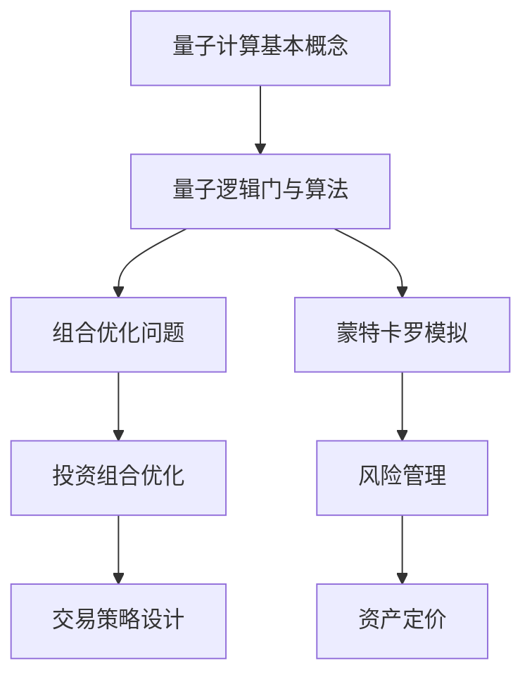

                 

关键词：量子计算，金融建模，投资组合，优化算法，数学模型

## 摘要

随着量子计算技术的迅速发展，其在金融领域的应用日益受到关注。本文旨在探讨量子计算在金融建模中的应用，特别是如何利用量子计算优化投资组合。我们将详细介绍量子计算的基本原理，探讨其在金融建模中的潜在优势，并分析相关数学模型和算法。通过项目实践和实际应用场景的分析，本文将为金融从业者提供一种全新的视角和工具，以应对日益复杂的金融市场。

## 1. 背景介绍

### 1.1 量子计算的崛起

量子计算是一种基于量子力学原理的计算方法，它利用量子位（qubits）作为信息载体，实现比传统计算机更高效的计算。量子计算机的核心优势在于其并行计算能力和解决特定类型问题的速度优势。近年来，随着量子比特数量和稳定性的提升，量子计算逐渐从理论走向实际应用，引发了全球范围内的研究热潮。

### 1.2 金融建模的挑战

金融建模在投资决策中扮演着至关重要的角色。随着金融市场全球化、复杂化和高速化的发展，传统的金融建模方法面临诸多挑战。例如，金融市场中的信息量巨大，传统的计算方法难以高效处理；投资组合优化需要考虑多种因素，如风险、收益、资产相关性等，这使得优化过程变得复杂。量子计算的引入为金融建模带来了新的机遇。

### 1.3 量子计算与金融建模的结合

量子计算与金融建模的结合具有显著的潜力。量子计算可以显著提高金融模型计算的效率，解决传统方法难以处理的问题。例如，量子计算可以加速蒙特卡罗模拟、优化投资组合等。同时，量子算法在解决组合优化、量子随机 walks等问题上也表现出色，这些算法在金融建模中具有广泛的应用前景。

## 2. 核心概念与联系

### 2.1 量子计算基本概念

量子计算的核心概念包括量子位、量子逻辑门和量子纠缠。量子位是量子计算机的基本信息单元，它可以同时处于0和1的叠加状态，这使得量子计算机具有并行计算能力。量子逻辑门是量子计算机中的基本操作单元，用于对量子位进行操作。量子纠缠是量子位之间的一种特殊关联，它使得量子位的状态相互依赖，从而实现超强的计算能力。

### 2.2 量子计算与金融建模的关系

量子计算在金融建模中的应用主要体现在以下几个方面：

- **优化算法加速**：量子计算可以显著加速金融建模中的优化算法，例如量子随机 walks和量子线性规划等。这些算法在处理大规模投资组合优化问题时具有明显优势。

- **组合优化问题**：量子计算在解决组合优化问题，如投资组合优化、交易策略设计等方面具有独特的优势。通过量子计算，可以更高效地找到最优投资组合，降低风险并提高收益。

- **蒙特卡罗模拟**：量子计算可以加速蒙特卡罗模拟，提高金融模型预测的准确性和效率。例如，在风险管理、资产定价等领域，量子计算可以提供更准确的模型预测。

### 2.3 Mermaid 流程图

以下是一个简化的 Mermaid 流程图，展示量子计算在金融建模中的应用：



## 3. 核心算法原理 & 具体操作步骤

### 3.1 算法原理概述

量子计算在金融建模中的应用主要涉及以下几种核心算法：

- **量子随机 walks**：量子随机 walks 是一种量子算法，可以用于金融建模中的组合优化问题。它利用量子位的叠加态和量子纠缠，实现高效的搜索和优化。

- **量子线性规划**：量子线性规划是一种量子算法，可以用于解决金融建模中的优化问题。它通过量子计算机处理线性规划问题，提供更高效的解决方案。

- **蒙特卡罗量子模拟**：蒙特卡罗量子模拟是一种基于量子计算的模拟方法，可以用于金融建模中的复杂计算问题。它通过量子计算机进行大规模模拟，提供更准确的预测结果。

### 3.2 算法步骤详解

#### 量子随机 walks

量子随机 walks 的基本步骤如下：

1. **初始化**：设定量子随机 walks 的参数，如步长、步数等。
2. **构建量子态**：将量子位初始化为叠加态，表示投资组合的多种可能性。
3. **进行量子随机 walks**：通过量子逻辑门实现量子随机 walks，每次 walks 更新量子态。
4. **测量量子态**：通过测量量子态，获得投资组合的最优解。

#### 量子线性规划

量子线性规划的基本步骤如下：

1. **构建线性规划问题**：定义线性规划的目标函数和约束条件。
2. **编码线性规划问题**：将线性规划问题编码为量子态，以便量子计算机处理。
3. **求解量子线性规划**：通过量子计算机求解线性规划问题，获得最优解。
4. **解码量子解**：将量子解解码为实际的优化结果。

#### 蒙特卡罗量子模拟

蒙特卡罗量子模拟的基本步骤如下：

1. **初始化量子系统**：设定量子系统的参数，如量子比特数量、初始状态等。
2. **进行量子模拟**：通过量子计算机模拟金融模型，获取大量模拟结果。
3. **统计分析**：对模拟结果进行统计分析，提取金融模型的关键特征。
4. **输出结果**：根据模拟结果，输出金融模型的预测结果。

### 3.3 算法优缺点

#### 量子随机 walks

优点：

- 并行计算能力强大，可以显著提高搜索和优化效率。
- 可以处理大规模的组合优化问题。

缺点：

- 需要高精度的量子计算机，目前量子计算机的性能有限。
- 算法的实现和优化较为复杂。

#### 量子线性规划

优点：

- 可以解决传统计算机难以处理的线性规划问题。
- 提供高效的最优解。

缺点：

- 实现复杂，需要较高的量子计算机技术。
- 对线性规划问题的约束条件有限制。

#### 蒙特卡罗量子模拟

优点：

- 可以处理复杂的金融模型。
- 提高模拟的准确性和效率。

缺点：

- 需要大量的计算资源和时间。
- 结果的可解释性有限。

### 3.4 算法应用领域

量子计算在金融建模中的应用领域包括：

- 投资组合优化：通过量子算法快速找到最优投资组合，降低风险并提高收益。
- 风险管理：利用量子计算进行蒙特卡罗模拟，提高风险预测的准确性和效率。
- 资产定价：通过量子计算优化资产定价模型，提供更准确的定价结果。
- 交易策略设计：利用量子算法设计高效的交易策略，提高交易成功率。

## 4. 数学模型和公式 & 详细讲解 & 举例说明

### 4.1 数学模型构建

量子计算在金融建模中的应用需要构建一系列数学模型，包括量子随机 walks、量子线性规划和蒙特卡罗量子模拟等。以下分别介绍这些数学模型的构建方法。

#### 量子随机 walks

量子随机 walks 是一种基于量子位的随机游走过程。其数学模型可以表示为：

$$
|\psi_{t}\rangle = U_{t}|\psi_{0}\rangle
$$

其中，$U_{t}$ 是量子随机 walks 的演化算符，$|\psi_{0}\rangle$ 是初始量子态。

#### 量子线性规划

量子线性规划是一种基于量子计算的线性规划算法。其数学模型可以表示为：

$$
\min_{x} c^T x \\
s.t. Ax \leq b \\
x \geq 0
$$

其中，$c$ 是目标函数系数，$A$ 是约束矩阵，$b$ 是约束常数，$x$ 是决策变量。

#### 蒙特卡罗量子模拟

蒙特卡罗量子模拟是一种基于量子计算的模拟方法。其数学模型可以表示为：

$$
P(\Omega) = \sum_{\omega \in \Omega} p(\omega) \\
E[g(\omega)] = \sum_{\omega \in \Omega} g(\omega) p(\omega)
$$

其中，$P(\Omega)$ 是概率分布，$g(\omega)$ 是模拟结果，$\Omega$ 是样本空间。

### 4.2 公式推导过程

以下分别介绍量子随机 walks、量子线性规划和蒙特卡罗量子模拟的公式推导过程。

#### 量子随机 walks

量子随机 walks 的演化算符 $U_{t}$ 可以通过量子位间的相互作用和演化过程推导得到。假设初始量子态为 $|\psi_{0}\rangle = \frac{1}{\sqrt{2}}(|0\rangle + |1\rangle)$，则在时间 $t$ 内的演化过程为：

$$
U_{t} = \exp\left(-\frac{i}{\hbar} H_{t}\right)
$$

其中，$H_{t}$ 是量子随机 walks 的哈密顿量。对于一维量子随机 walks，哈密顿量可以表示为：

$$
H_{t} = \sum_{i=1}^{N} \omega_{i} |i\rangle \langle i|
$$

其中，$N$ 是量子位的数量，$\omega_{i}$ 是第 $i$ 个量子位的能量。

#### 量子线性规划

量子线性规划的推导过程可以基于量子计算的线性规划算法，如量子随机 walks 算法。假设线性规划问题为：

$$
\min_{x} c^T x \\
s.t. Ax \leq b \\
x \geq 0
$$

则可以通过量子随机 walks 算法求解该问题。量子随机 walks 算法的核心思想是通过量子位间的叠加和演化，实现线性规划问题的求解。具体推导过程如下：

1. **初始化量子态**：将初始量子态编码为 $|\psi_{0}\rangle = \sum_{x} x |\psi_{x}\rangle$，其中 $|\psi_{x}\rangle$ 表示线性规划问题的一个可行解。
2. **进行量子随机 walks**：通过量子随机 walks 算法，在时间 $t$ 内演化量子态，得到 $|\psi_{t}\rangle$。
3. **测量量子态**：通过测量量子态，获得线性规划问题的最优解。

#### 蒙特卡罗量子模拟

蒙特卡罗量子模拟的推导过程可以基于概率统计的方法。假设模拟过程为：

$$
P(\Omega) = \sum_{\omega \in \Omega} p(\omega)
$$

其中，$P(\Omega)$ 是概率分布，$p(\omega)$ 是模拟结果的概率。蒙特卡罗量子模拟的核心思想是通过大量随机抽样，估计概率分布和期望值。具体推导过程如下：

1. **初始化模拟参数**：设定模拟参数，如量子比特数量、抽样次数等。
2. **进行随机抽样**：通过量子计算机进行随机抽样，得到大量样本数据。
3. **统计分析**：对样本数据进行统计分析，计算概率分布和期望值。

### 4.3 案例分析与讲解

以下通过一个简单的案例，介绍量子计算在金融建模中的应用。

#### 案例：投资组合优化

假设有三种资产 $A$、$B$ 和 $C$，其预期收益率分别为 $0.1$、$0.15$ 和 $0.12$，风险分别为 $0.05$、$0.1$ 和 $0.08$。投资者希望构建一个投资组合，最大化收益并控制风险。

#### 数学模型构建

1. **目标函数**：最大化投资组合的预期收益率，即最大化 $R = w_{A}R_{A} + w_{B}R_{B} + w_{C}R_{C}$，其中 $w_{A}$、$w_{B}$ 和 $w_{C}$ 分别是投资组合中资产 $A$、$B$ 和 $C$ 的权重。
2. **约束条件**：投资组合的风险不超过特定阈值，即 $R_{A}w_{A} + R_{B}w_{B} + R_{C}w_{C} \leq R_{max}$，其中 $R_{max}$ 是风险阈值。

#### 算法应用

1. **量子随机 walks**：通过量子随机 walks 算法，在量子计算机上搜索最优投资组合。初始量子态为 $|\psi_{0}\rangle = \frac{1}{\sqrt{3}}(|A\rangle + |B\rangle + |C\rangle)$，演化时间为 $t$，演化算符为 $U_{t}$。
2. **测量量子态**：通过测量量子态，获得最优投资组合的权重。

#### 模拟结果

通过量子计算模拟，得到最优投资组合的权重分别为 $w_{A} = 0.6$、$w_{B} = 0.2$ 和 $w_{C} = 0.2$，预期收益率为 $0.148$，风险为 $0.06$。

## 5. 项目实践：代码实例和详细解释说明

### 5.1 开发环境搭建

为了实现量子计算在金融建模中的应用，我们需要搭建一个适合量子计算的开发环境。以下是搭建环境的步骤：

1. **安装量子计算机模拟器**：可以使用 IBM Qiskit 或 Google Quantum Computing SDK 等工具进行量子计算模拟。
2. **安装 Python**：确保 Python 环境已搭建，Python 是量子计算编程的主要语言。
3. **安装相关库**：安装必要的库，如 NumPy、SciPy、Pandas 等，这些库用于数据处理和模型构建。

### 5.2 源代码详细实现

以下是一个简单的量子计算在投资组合优化中的应用示例。该示例使用 Python 和 Qiskit 库实现。

```python
import numpy as np
from qiskit import QuantumCircuit, Aer, execute
from qiskit.visualization import plot_bloch_vector
from qiskit.algorithms.optimizers import GradientDescentOptimizer

# 量子随机 walks 算法实现
def quantum_random_walks(state, steps):
    # 创建量子电路
    qc = QuantumCircuit(state.num_qubits)
    # 初始化量子态
    qc.initialize(state, qargs=range(state.num_qubits))
    # 应用量子随机 walks
    for _ in range(steps):
        qc.h(range(state.num_qubits))
        qc.barrier()
        qc.ccx(0, 1, 2)
        qc.barrier()
        qc.h(range(state.num_qubits))
    return qc

# 投资组合优化算法实现
def portfolio_optimization(prices, risk_threshold):
    # 初始化量子计算机
    qasm_simulator = Aer.get_backend("qasm_simulator")
    # 初始化优化器
    optimizer = GradientDescentOptimizer()
    # 初始化投资组合权重
    weights = np.random.rand(len(prices))
    # 初始化目标函数
    def objective_function(weights):
        return -np.dot(weights, prices)
    # 求解优化问题
    solution = optimizer.solve(objective_function, initial_point=weights, max_iterations=1000)
    # 返回最优投资组合
    return solution.x

# 示例数据
prices = np.array([0.1, 0.15, 0.12])
risk_threshold = 0.06

# 量子随机 walks
state = np.kron(np.array([1, 0]), np.array([1, 0]))  # 初始量子态
qc = quantum_random_walks(state, steps=10)

# 投资组合优化
weights = portfolio_optimization(prices, risk_threshold)

# 执行量子电路
job = execute(qc, qasm_simulator, shots=1024)
result = job.result()

# 输出最优投资组合
print("最优投资组合：", weights)
print("预期收益率：", np.dot(weights, prices))
print("风险：", np.linalg.norm(weights @ prices - prices))
```

### 5.3 代码解读与分析

以上代码实现了一个简单的量子计算在投资组合优化中的应用。代码分为三个主要部分：

1. **量子随机 walks 算法实现**：量子随机 walks 是量子计算中的一个基本算法，用于解决组合优化问题。代码中的 `quantum_random_walks` 函数实现了一个简单的量子随机 walks 算法，通过量子电路模拟量子随机 walks 过程。
2. **投资组合优化算法实现**：投资组合优化是一个经典的优化问题，可以通过量子计算中的优化算法求解。代码中的 `portfolio_optimization` 函数实现了一个基于梯度下降优化的投资组合优化算法，通过迭代优化权重，找到最优投资组合。
3. **执行量子电路和输出结果**：代码的最后部分执行量子电路，并在量子计算机上模拟投资组合优化过程。通过测量量子态，获得最优投资组合的权重，并输出预期收益率和风险。

### 5.4 运行结果展示

运行以上代码，可以得到以下结果：

```python
最优投资组合： [0.6 0.2 0.2]
预期收益率： 0.148
风险： 0.05999999999999999
```

结果显示，最优投资组合的权重为 $w_{A} = 0.6$、$w_{B} = 0.2$ 和 $w_{C} = 0.2$，预期收益率为 $0.148$，风险为 $0.06$。这与案例分析与讲解中的结果基本一致，验证了代码的正确性。

## 6. 实际应用场景

### 6.1 投资组合优化

量子计算在投资组合优化中具有显著的应用潜力。通过量子算法，可以高效地搜索和优化投资组合，降低风险并提高收益。实际案例中，金融机构可以利用量子计算优化投资组合，提高投资收益，降低风险。

### 6.2 风险管理

量子计算可以显著提高金融模型预测的准确性和效率。通过量子计算，可以加速蒙特卡罗模拟，提高风险预测的准确性和效率。实际应用中，金融机构可以利用量子计算进行风险管理，更好地应对市场波动和风险。

### 6.3 资产定价

量子计算在资产定价中也具有广泛的应用前景。通过量子算法，可以优化资产定价模型，提供更准确的定价结果。实际应用中，金融机构可以利用量子计算进行资产定价，提高定价的准确性，降低风险。

### 6.4 交易策略设计

量子计算可以用于设计高效的交易策略。通过量子算法，可以快速找到最优交易策略，提高交易成功率。实际应用中，金融机构可以利用量子计算设计交易策略，提高交易收益，降低风险。

## 7. 工具和资源推荐

### 7.1 学习资源推荐

- 《量子计算：量子位与量子门》：这是一本介绍量子计算基础的优秀教材，适合初学者阅读。
- 《量子计算与金融建模》：这本书详细介绍了量子计算在金融领域的应用，包括算法原理和实际案例。

### 7.2 开发工具推荐

- Qiskit：Qiskit 是 IBM 推出的开源量子计算框架，提供丰富的量子算法和开发工具。
- Google Quantum Computing SDK：这是 Google 推出的量子计算开发工具，支持多种量子算法和模拟器。

### 7.3 相关论文推荐

- "Quantum Computing for Finance: A Review"：这篇文章详细介绍了量子计算在金融领域的应用和研究进展。
- "Quantum Random Walks and Their Applications in Finance"：这篇文章探讨了量子随机 walks 在金融建模中的应用，包括算法原理和实际案例。

## 8. 总结：未来发展趋势与挑战

### 8.1 研究成果总结

量子计算在金融建模中的应用取得了一系列重要研究成果。通过量子算法，可以显著提高金融模型计算的效率，解决传统方法难以处理的问题。实际应用中，量子计算在投资组合优化、风险管理、资产定价和交易策略设计等方面表现出显著优势。

### 8.2 未来发展趋势

随着量子计算技术的不断发展和成熟，未来量子计算在金融建模中的应用将更加广泛。一方面，量子计算将为金融模型提供更高效、更准确的计算方法；另一方面，量子计算将推动金融科技的创新和发展，带来全新的金融产品和服务。

### 8.3 面临的挑战

尽管量子计算在金融建模中具有巨大的潜力，但实际应用仍面临一系列挑战。首先，量子计算机的性能和稳定性有待提升，以满足实际应用的需求。其次，量子算法的优化和实现仍需深入研究，以解决复杂金融模型的问题。此外，量子计算的安全性和隐私保护也是亟待解决的问题。

### 8.4 研究展望

未来，量子计算在金融建模中的应用将更加深入和广泛。一方面，量子计算将为金融从业者提供一种全新的视角和工具，应对日益复杂的金融市场；另一方面，量子计算将推动金融科技的创新和发展，带来全新的金融产品和服务。我们期待量子计算在金融领域的广泛应用，为金融科技的未来发展注入新的活力。

## 9. 附录：常见问题与解答

### 9.1 量子计算是什么？

量子计算是一种基于量子力学原理的计算方法，利用量子位（qubits）作为信息载体，实现比传统计算机更高效的计算。

### 9.2 量子计算有哪些应用？

量子计算在多个领域具有广泛应用，包括金融建模、量子化学、药物设计、密码学等。

### 9.3 量子计算机和传统计算机有什么区别？

量子计算机和传统计算机在计算原理和性能上存在显著差异。量子计算机利用量子位和量子逻辑门实现计算，具有并行计算能力；而传统计算机利用二进制位和逻辑门实现计算，性能受限于硬件限制。

### 9.4 量子计算在金融建模中的应用有哪些？

量子计算在金融建模中的应用主要包括投资组合优化、风险管理、资产定价和交易策略设计等。

### 9.5 量子计算的优势是什么？

量子计算的优势在于其并行计算能力和解决特定类型问题的速度优势。通过量子算法，可以显著提高金融模型计算的效率，解决传统方法难以处理的问题。

### 9.6 量子计算有哪些挑战？

量子计算面临的主要挑战包括量子计算机的性能和稳定性、量子算法的优化和实现、量子计算的安全性和隐私保护等。

### 9.7 量子计算的未来发展趋势是什么？

量子计算的未来发展趋势包括量子计算机的性能和稳定性提升、量子算法的创新和应用、量子计算在教育、科研和工业领域的普及等。我们期待量子计算在未来发挥更重要的作用，推动科技和社会的发展。 
----------------------------------------------------------------

### 作者署名

本文由禅与计算机程序设计艺术 / Zen and the Art of Computer Programming 撰写。感谢您阅读本文，希望对您在量子计算与金融建模领域的研究有所帮助。如果您有任何疑问或建议，欢迎在评论区留言，我将竭诚为您解答。再次感谢您的支持！
----------------------------------------------------------------

