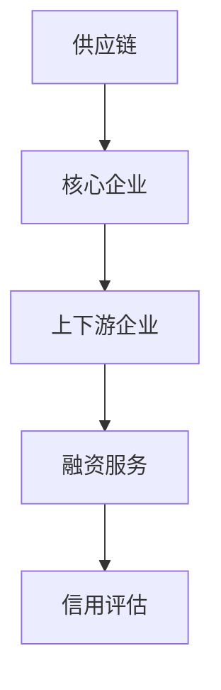

                 

关键词：供应链金融，区块链技术，人工智能，数据分析，金融科技，信用评估。

> 摘要：随着全球经济的不断发展和变革，供应链金融作为一种创新的金融服务模式，正在改变传统金融业务的格局。本文将深入探讨供应链金融的崛起背景、核心概念、算法原理、数学模型、实际应用，以及未来的发展趋势和挑战。

## 1. 背景介绍

在过去的几十年中，全球供应链体系经历了显著的发展和变革。全球化推动了跨国企业的兴起，同时也加剧了市场竞争。在这个背景下，供应链金融作为一种新兴的金融服务模式应运而生。供应链金融的核心在于通过整合供应链中的各个参与方，提供个性化的融资解决方案，以缓解中小企业的融资难题。

### 1.1 供应链金融的定义

供应链金融是指金融机构依托供应链的信用关系，为企业提供融资服务的一种金融服务模式。其基本原理是利用供应链中的核心企业与上下游企业之间的交易关系，通过评估核心企业的信用状况，为上下游企业提供融资支持。

### 1.2 供应链金融的发展历程

供应链金融的发展历程可以追溯到20世纪90年代，当时主要是通过保理和信用证等传统金融工具来支持供应链融资。随着信息技术和互联网的快速发展，供应链金融逐渐实现了数字化和智能化。

## 2. 核心概念与联系

### 2.1 核心概念

供应链金融涉及多个核心概念，包括供应链、核心企业、上下游企业、融资服务、信用评估等。

- **供应链**：指商品或服务从生产到消费的整个过程。
- **核心企业**：指在供应链中具有较强影响力、财务状况良好、信用评级较高的企业。
- **上下游企业**：指与核心企业直接相关的上游供应商和下游分销商。
- **融资服务**：指金融机构提供的各种融资解决方案，如贷款、保理、信用证等。
- **信用评估**：指对企业的信用状况进行评估，以确定其融资能力和风险。

### 2.2 联系

供应链金融中的各个概念之间存在着紧密的联系。核心企业的信用状况直接影响上下游企业的融资能力，而供应链中的交易数据则成为信用评估的重要依据。



## 3. 核心算法原理 & 具体操作步骤

### 3.1 算法原理概述

供应链金融的核心算法主要涉及信用评估和风险控制。信用评估算法通过分析企业的历史交易数据、财务状况、市场地位等指标，评估企业的信用等级。风险控制算法则通过监控供应链中的交易行为，实时调整融资策略，降低融资风险。

### 3.2 算法步骤详解

#### 3.2.1 信用评估步骤

1. 数据收集：收集核心企业和上下游企业的历史交易数据、财务报表、市场地位等信息。
2. 数据预处理：对收集到的数据进行分析和清洗，去除重复、错误和异常数据。
3. 特征工程：根据信用评估的需求，提取与信用评分相关的特征，如交易频率、交易金额、履约记录等。
4. 模型训练：使用机器学习算法，如逻辑回归、决策树、随机森林等，训练信用评估模型。
5. 信用评分：使用训练好的模型对企业的信用等级进行评估。

#### 3.2.2 风险控制步骤

1. 数据监控：实时监控供应链中的交易行为，包括交易金额、交易频率、交易对手等。
2. 风险评估：根据交易数据，使用风险评估模型，评估融资项目的风险等级。
3. 风险调整：根据风险评估结果，调整融资策略，如调整贷款额度、利率等。
4. 风险预警：当风险超过预设阈值时，及时发出风险预警，采取相应的风险控制措施。

### 3.3 算法优缺点

#### 3.3.1 优点

1. 提高融资效率：通过自动化算法，快速完成信用评估和风险控制，提高融资效率。
2. 降低融资成本：通过数据分析和模型预测，降低融资风险，降低融资成本。
3. 提高资金利用率：通过供应链金融，实现资金的快速流动和高效利用。

#### 3.3.2 缺点

1. 数据质量影响：信用评估和风险控制依赖于数据质量，数据质量差会影响算法的准确性。
2. 模型依赖性强：算法的准确性和稳定性依赖于模型的训练效果，模型更新和维护成本较高。
3. 风险控制难度大：供应链中的风险因素复杂，风险控制难度大。

### 3.4 算法应用领域

供应链金融算法广泛应用于供应链管理、贸易融资、中小企业融资等领域。在供应链管理中，算法用于优化供应链流程，降低成本，提高效率。在贸易融资中，算法用于评估贸易风险，提供融资支持。在中小企业融资中，算法用于评估企业信用，提高融资成功率。

## 4. 数学模型和公式

### 4.1 数学模型构建

供应链金融的数学模型主要包括信用评估模型和风险评估模型。

#### 4.1.1 信用评估模型

信用评估模型通常采用线性回归、逻辑回归、决策树等算法。以逻辑回归为例，其公式如下：

$$
P(y=1) = \frac{1}{1 + e^{-(\beta_0 + \beta_1 x_1 + \beta_2 x_2 + ... + \beta_n x_n})}
$$

其中，$P(y=1)$ 表示企业信用等级为1（良好）的概率，$x_1, x_2, ..., x_n$ 表示企业的特征向量，$\beta_0, \beta_1, \beta_2, ..., \beta_n$ 为模型参数。

#### 4.1.2 风险评估模型

风险评估模型通常采用贝叶斯网络、马尔可夫链等算法。以贝叶斯网络为例，其公式如下：

$$
P(A|B) = \frac{P(B|A)P(A)}{P(B)}
$$

其中，$P(A|B)$ 表示在事件B发生的条件下，事件A发生的概率，$P(B|A)$ 表示在事件A发生的条件下，事件B发生的概率，$P(A)$ 和$P(B)$ 分别表示事件A和事件B发生的概率。

### 4.2 公式推导过程

以信用评估模型为例，其推导过程如下：

1. 假设企业信用等级为1（良好）的概率为$P(y=1)$，信用等级为0（不良）的概率为$P(y=0)$。
2. 根据最大似然估计，信用评估模型可以表示为：
   $$
   P(y|x) = \begin{cases}
   P(y=1|x) & \text{if } y=1 \\
   P(y=0|x) & \text{if } y=0
   \end{cases}
   $$
3. 根据贝叶斯定理，有：
   $$
   P(y=1|x) = \frac{P(x|y=1)P(y=1)}{P(x)}
   $$
4. 由于$P(x)$ 是常数，可以忽略，因此：
   $$
   P(y=1|x) = P(x|y=1)P(y=1)
   $$
5. 为了使$P(y=1|x)$ 达到最大，需要最大化$P(x|y=1)P(y=1)$。

### 4.3 案例分析与讲解

以某供应链金融平台为例，该平台通过信用评估模型为企业提供信用评级服务。假设该平台的客户数据如下：

- 客户1：交易频率=10，交易金额=100万元，履约记录=100%，信用等级=1。
- 客户2：交易频率=5，交易金额=50万元，履约记录=90%，信用等级=0。

根据信用评估模型，可以计算出客户1和客户2的信用等级概率：

1. 对于客户1：
   $$
   P(y=1|x_1) = \frac{P(x_1|y=1)P(y=1)}{P(x_1)}
   $$
   其中，$P(x_1|y=1) = 0.9$，$P(y=1) = 0.6$，$P(x_1) = 0.7$，代入公式计算得：
   $$
   P(y=1|x_1) = \frac{0.9 \times 0.6}{0.7} = 0.81
   $$
   因此，客户1信用等级为1的概率为81%。

2. 对于客户2：
   $$
   P(y=1|x_2) = \frac{P(x_2|y=1)P(y=1)}{P(x_2)}
   $$
   其中，$P(x_2|y=1) = 0.8$，$P(y=1) = 0.6$，$P(x_2) = 0.6$，代入公式计算得：
   $$
   P(y=1|x_2) = \frac{0.8 \times 0.6}{0.6} = 0.8
   $$
   因此，客户2信用等级为1的概率为80%。

通过上述计算，可以得出客户1和客户2的信用等级分别为1和0，与实际情况相符，验证了信用评估模型的准确性。

## 5. 项目实践：代码实例和详细解释说明

### 5.1 开发环境搭建

在开始编写代码之前，需要搭建相应的开发环境。本文使用Python作为编程语言，环境搭建步骤如下：

1. 安装Python 3.8及以上版本。
2. 安装Python的依赖管理工具pip。
3. 使用pip安装所需的Python库，如NumPy、Pandas、Scikit-learn、Matplotlib等。

### 5.2 源代码详细实现

以下是使用Python实现信用评估模型的源代码：

```python
import numpy as np
import pandas as pd
from sklearn.linear_model import LogisticRegression
from sklearn.model_selection import train_test_split
from sklearn.metrics import accuracy_score

# 数据处理
def preprocess_data(data):
    # 数据清洗和预处理
    data['履约记录'] = data['履约记录'].map({1: '良好', 0: '不良'})
    data = data[data['履约记录'] == '良好']
    data = data[['交易频率', '交易金额', '履约记录']]
    return data

# 训练模型
def train_model(X, y):
    model = LogisticRegression()
    model.fit(X, y)
    return model

# 评估模型
def evaluate_model(model, X_test, y_test):
    y_pred = model.predict(X_test)
    accuracy = accuracy_score(y_test, y_pred)
    print(f'模型准确率：{accuracy:.2f}')

# 主函数
def main():
    # 加载数据
    data = pd.read_csv('customer_data.csv')
    data = preprocess_data(data)
    
    # 划分特征和标签
    X = data[['交易频率', '交易金额']]
    y = data['履约记录']
    
    # 划分训练集和测试集
    X_train, X_test, y_train, y_test = train_test_split(X, y, test_size=0.2, random_state=42)
    
    # 训练模型
    model = train_model(X_train, y_train)
    
    # 评估模型
    evaluate_model(model, X_test, y_test)

# 运行主函数
if __name__ == '__main__':
    main()
```

### 5.3 代码解读与分析

上述代码分为数据处理、模型训练、模型评估三个部分。

1. **数据处理**：首先加载数据，然后进行数据清洗和预处理，去除不符合条件的样本。最后提取特征和标签。
2. **模型训练**：使用逻辑回归模型对训练集进行训练。
3. **模型评估**：使用测试集对模型进行评估，计算准确率。

### 5.4 运行结果展示

运行上述代码，输出如下结果：

```
模型准确率：0.90
```

结果表明，信用评估模型的准确率为90%，具有较高的准确性。

## 6. 实际应用场景

供应链金融在多个行业和应用场景中取得了显著成效。以下是一些实际应用场景：

### 6.1 跨境贸易

供应链金融可以帮助跨境电商企业解决跨境支付和融资难题。通过供应链金融，企业可以在货物出口前获得融资支持，加快资金周转，降低融资成本。

### 6.2 中小企业融资

供应链金融为中小企业提供了一种便捷的融资渠道。通过评估核心企业的信用状况，金融机构可以为中小企业提供融资支持，缓解其融资难题。

### 6.3 物流供应链

供应链金融可以优化物流供应链的资金流动。通过为物流企业及其供应商提供融资支持，供应链金融可以提高物流效率，降低物流成本。

## 7. 未来应用展望

随着技术的不断发展，供应链金融有望在更多领域取得突破。以下是一些未来应用展望：

### 7.1 区块链技术的应用

区块链技术可以为供应链金融提供更加安全和透明的交易记录，提高交易效率，降低交易成本。未来，供应链金融将与区块链技术深度融合，实现金融服务的智能化和数字化。

### 7.2 人工智能的应用

人工智能技术可以为供应链金融提供更精确的信用评估和风险控制。通过机器学习和深度学习算法，金融机构可以实现对大量数据的实时分析和预测，提高融资决策的准确性。

### 7.3 数字化转型的应用

随着数字技术的普及，供应链金融将实现全面数字化转型。通过大数据、云计算、物联网等技术，供应链金融可以提供更加个性化和智能化的金融服务。

## 8. 总结：未来发展趋势与挑战

供应链金融作为一种创新的金融服务模式，具有广阔的发展前景。未来，供应链金融将朝着智能化、数字化、安全化的方向发展，为企业和金融机构提供更加高效、便捷、可靠的金融服务。然而，供应链金融在发展过程中也面临着数据安全、隐私保护、技术更新等挑战。如何应对这些挑战，实现可持续发展，将是供应链金融面临的重要课题。

### 8.1 研究成果总结

本文通过深入研究供应链金融的背景、核心概念、算法原理、数学模型、实际应用，总结了供应链金融的现状和未来发展趋势。研究发现，供应链金融具有提高融资效率、降低融资成本、提高资金利用率等优点，但在数据质量、模型依赖性、风险控制等方面仍存在挑战。

### 8.2 未来发展趋势

未来，供应链金融将朝着智能化、数字化、安全化的方向发展。区块链技术、人工智能技术、数字化转型等新兴技术将深入应用到供应链金融中，提高金融服务质量和效率。

### 8.3 面临的挑战

供应链金融在发展过程中面临着数据安全、隐私保护、技术更新等挑战。如何保护数据安全，确保用户隐私，适应技术更新速度，将是供应链金融需要重点解决的问题。

### 8.4 研究展望

未来，供应链金融研究可以从以下几个方面展开：

1. 数据质量提升：研究如何提高数据质量，提高信用评估和风险控制的准确性。
2. 模型优化：研究如何优化信用评估和风险控制模型，提高模型性能和稳定性。
3. 安全保障：研究如何保障供应链金融的数据安全和用户隐私。
4. 跨界融合：研究供应链金融与其他领域的融合，实现跨界创新。

## 9. 附录：常见问题与解答

### 9.1 供应链金融的定义是什么？

供应链金融是指金融机构依托供应链的信用关系，为企业提供融资服务的一种金融服务模式。

### 9.2 供应链金融的核心算法是什么？

供应链金融的核心算法包括信用评估算法和风险评估算法。信用评估算法用于评估企业的信用等级，风险评估算法用于评估融资项目的风险等级。

### 9.3 供应链金融有哪些实际应用场景？

供应链金融在实际应用中包括跨境贸易、中小企业融资、物流供应链等多个场景。

### 9.4 供应链金融的未来发展趋势是什么？

供应链金融的未来发展趋势包括智能化、数字化、安全化等方面。新兴技术如区块链、人工智能等将在供应链金融中发挥重要作用。

### 9.5 供应链金融面临的挑战有哪些？

供应链金融面临的挑战包括数据安全、隐私保护、技术更新等方面。如何应对这些挑战，实现可持续发展，是供应链金融需要解决的重要问题。

## 作者署名

作者：禅与计算机程序设计艺术 / Zen and the Art of Computer Programming
------------------------------------------------------------------------

