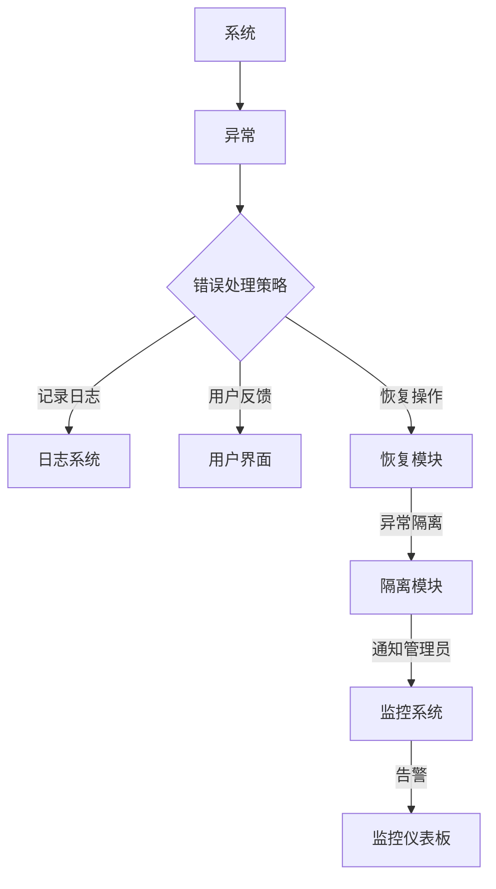
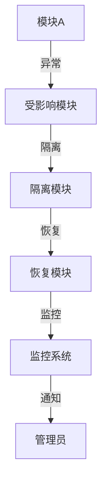

                 

 错误处理机制是软件开发中至关重要的一环，它决定了系统的稳定性和用户体验。在现代软件工程中，错误处理机制的设计原则至关重要，不仅能够提高代码的可靠性，还能为开发者和用户提供清晰的指导。本文将深入探讨错误处理机制的设计原则，包括其重要性、设计思路、常见方法和最佳实践，旨在为开发者提供有价值的参考。

## 关键词

- 错误处理
- 软件工程
- 可靠性
- 设计原则
- 异常管理
- 用户体验

## 摘要

本文旨在介绍和讨论错误处理机制的设计原则。首先，我们将探讨错误处理在软件开发中的重要性。接着，分析错误处理机制的基本设计思路，介绍几种常见的错误处理方法。然后，我们将讨论如何通过合理的错误处理机制提高系统的可靠性。最后，我们将总结文章的主要观点，并提出未来研究和开发的方向。

### 1. 背景介绍

在软件工程领域，错误处理（Error Handling）是确保系统稳定性和用户满意度的重要环节。随着软件系统的复杂性和规模不断增大，错误处理的重要性愈发凸显。良好的错误处理机制不仅能够有效地防止系统崩溃，还能够提高软件的可靠性和用户体验。

错误处理机制的设计需要考虑多个方面，包括异常的检测、报告、隔离和恢复。在设计过程中，开发人员需要遵循一系列原则，以确保错误处理机制的有效性和高效性。这些原则包括：明确性、一致性、可恢复性和安全性等。

本文将围绕以下核心概念展开讨论：

1. **错误处理的重要性**：解释为什么错误处理是软件工程中的关键组成部分。
2. **错误处理的设计思路**：探讨设计错误处理机制的基本原则。
3. **常见的错误处理方法**：介绍几种常见的错误处理策略及其优缺点。
4. **提高系统可靠性**：讨论如何通过合理的错误处理机制提高系统的可靠性。
5. **最佳实践**：总结一些在错误处理中的最佳实践。

通过本文的探讨，读者将能够更好地理解错误处理机制的设计原则，并在实际开发中应用这些原则，提高软件的质量和用户体验。

### 2. 核心概念与联系

在设计错误处理机制之前，我们需要明确几个核心概念和它们之间的关系。以下是一个简化的 Mermaid 流程图，用以描述这些核心概念和它们在错误处理中的联系。



#### 异常

异常（Exception）是软件运行过程中遇到的一种特殊情况，它可能是由于逻辑错误、外部环境变化或资源不足等原因引起的。异常会导致程序的正常流程被中断，需要通过错误处理机制进行处理。

#### 错误处理策略

错误处理策略（Error Handling Strategy）是指系统在遇到异常时采取的一系列措施。常见的策略包括记录日志、用户反馈、恢复操作、异常隔离和通知管理员等。

- **记录日志**：将异常信息记录到日志文件中，以便后续分析和调试。
- **用户反馈**：通过用户界面向用户展示异常信息，帮助用户理解发生了什么。
- **恢复操作**：尝试恢复系统的正常运行，例如重试操作或切换到备用资源。
- **异常隔离**：将异常限制在受影响的范围内，防止其对整个系统造成更大的影响。
- **通知管理员**：通过监控系统向管理员发送告警信息，以便及时处理问题。

#### 日志系统

日志系统（Logging System）用于记录系统运行过程中发生的所有事件，包括正常操作和异常情况。日志文件是调试和故障分析的重要依据。

#### 用户界面

用户界面（User Interface，UI）是用户与系统交互的界面，它应该清晰、简洁地展示异常信息，并提供解决问题的途径。

#### 恢复模块

恢复模块（Recovery Module）负责在异常发生时尝试恢复系统的正常运行。例如，它可以重试失败的请求或切换到备用服务器。

#### 隔离模块

隔离模块（Isolation Module）用于将异常隔离在特定的范围内，防止其对整个系统造成更大的影响。

#### 监控系统

监控系统（Monitoring System）用于实时监控系统的运行状态，包括性能指标和错误信息。当系统发生异常时，监控系统会向管理员发送告警信息。

#### 告警

告警（Alert）是一种通知机制，用于在系统发生异常时提醒管理员或开发人员。

#### 监控仪表板

监控仪表板（Monitoring Dashboard）是一个集中展示系统运行状态和异常信息的界面，它可以帮助管理员快速识别和解决问题。

通过上述流程图，我们可以清晰地看到各个核心概念之间的联系和交互方式。这些核心概念共同构成了一个完整的错误处理机制，确保系统能够稳定、可靠地运行。

### 3. 核心算法原理 & 具体操作步骤

#### 3.1 算法原理概述

错误处理机制的核心算法原理可以概括为以下几个步骤：

1. **异常检测**：在程序的运行过程中，检测可能出现的异常情况。
2. **异常报告**：一旦检测到异常，记录异常信息并报告给用户或开发人员。
3. **异常处理**：根据异常的类型和严重程度，采取相应的处理措施，如记录日志、重试操作或通知管理员。
4. **异常恢复**：在可能的情况下，尝试恢复系统的正常运行，确保用户体验不受影响。
5. **异常隔离**：将异常限制在受影响的范围内，防止其对整个系统造成更大的影响。

#### 3.2 算法步骤详解

下面是具体的算法步骤及其详细说明：

#### 步骤1：异常检测

**检测条件**：在程序的各个模块和阶段，设置检测点以捕获异常情况。常见的检测条件包括：

- **输入验证**：检查输入数据的合法性，例如数据类型、长度和格式。
- **资源检查**：确保系统所需的资源（如内存、磁盘空间和网络连接）可用。
- **边界条件**：处理函数或方法的边界条件，例如递归调用中的终止条件。

**实现方式**：使用断言（assert）、异常捕获（try-catch）或回调函数（callback）等方式进行检测。

#### 步骤2：异常报告

**报告内容**：记录异常的相关信息，包括异常类型、发生时间、异常上下文等。

**实现方式**：通过日志记录器（logger）将异常信息写入日志文件或数据库。

```java
logger.error("An exception occurred at " + currentTime + ": " + e.getMessage(), e);
```

#### 步骤3：异常处理

**处理策略**：根据异常的类型和严重程度，采取相应的处理措施。常见的处理策略包括：

- **记录日志**：将异常详细信息记录到日志文件中，以便后续分析和调试。
- **用户反馈**：通过用户界面向用户展示异常信息，帮助用户理解发生了什么。
- **恢复操作**：尝试恢复系统的正常运行，例如重试操作或切换到备用资源。

**实现方式**：在代码中添加异常处理代码块，使用`try-catch`结构实现。

```java
try {
    // 正常操作
} catch (ExceptionType e) {
    // 处理异常
    logger.error("Error occurred: ", e);
    // 用户反馈
    showErrorToUser();
    // 恢复操作
    retryOperation();
}
```

#### 步骤4：异常恢复

**恢复条件**：在异常处理过程中，根据异常类型和系统状态判断是否需要恢复操作。

**实现方式**：在异常处理代码中添加恢复逻辑，例如重试失败的请求或切换到备用服务器。

```java
if (canRetry) {
    // 重试操作
    retryOperation();
} else {
    // 切换到备用服务器
    switchToBackupServer();
}
```

#### 步骤5：异常隔离

**隔离目的**：将异常限制在受影响的范围内，防止其对整个系统造成更大的影响。

**实现方式**：通过模块化设计和边界控制实现异常隔离。



通过上述步骤，我们可以构建一个完整的错误处理机制，确保系统能够在异常情况下保持稳定运行。

#### 3.3 算法优缺点

**优点**：

- **提高系统可靠性**：通过异常检测和处理，可以减少系统崩溃和错误发生的机会。
- **提高用户体验**：良好的错误处理机制能够为用户提供清晰的错误信息和解决方案，增强用户满意度。
- **易于调试和维护**：详细的日志记录和异常报告有助于开发人员快速定位和修复问题。

**缺点**：

- **性能开销**：过多的错误处理逻辑可能会增加系统性能开销，尤其是对性能敏感的应用。
- **复杂度增加**：错误处理机制的设计和实现相对复杂，需要开发者具备较高的编程技巧和经验。
- **过度依赖**：过度依赖错误处理机制可能会导致系统对异常情况的适应性降低，影响整体稳定性。

#### 3.4 算法应用领域

错误处理机制在多个领域都有广泛的应用，以下是几个典型应用场景：

- **Web 应用**：Web 应用需要处理各种客户端和服务器端异常，包括请求处理错误、数据库连接失败等。
- **移动应用**：移动应用需要处理网络异常、设备异常等，确保用户在不同环境下能够正常使用。
- **嵌入式系统**：嵌入式系统对稳定性要求极高，需要通过错误处理机制确保系统在恶劣环境下正常运行。
- **大数据处理**：大数据处理过程中，数据源不稳定、网络中断等问题频繁出现，需要有效的错误处理机制来保证数据处理任务的完成。

通过上述讨论，我们可以看到错误处理机制在软件工程中的重要性，以及其在不同应用领域中的具体应用。在接下来的章节中，我们将进一步探讨如何通过数学模型和实际项目实践来优化错误处理机制。

### 4. 数学模型和公式 & 详细讲解 & 举例说明

#### 4.1 数学模型构建

在设计错误处理机制时，数学模型可以帮助我们分析和优化系统的可靠性。以下是一个简化的数学模型，用于描述错误处理机制的基本原理。

**模型假设**：

1. **异常概率**：每个操作发生的异常概率为 \( p \)。
2. **异常恢复概率**：系统能够成功恢复异常的概率为 \( r \)。
3. **系统运行时间**：系统的运行时间为 \( T \)。

**模型构建**：

设系统在时间 \( T \) 内发生的异常次数为 \( X \)，则 \( X \) 服从参数为 \( p \) 的泊松分布。系统在时间 \( T \) 内的可靠度（无故障时间）为 \( R \)，可以表示为：

\[ R = P(X = 0) + P(X = 1) \cdot r + P(X = 2) \cdot r^2 + \ldots \]

其中，\( P(X = k) = e^{-p} \cdot \frac{p^k}{k!} \) 是泊松分布的概率质量函数。

#### 4.2 公式推导过程

为了推导上述可靠度公式，我们首先考虑单个操作的成功概率。设单个操作的成功概率为 \( q = 1 - p \)，则单个操作在时间 \( T \) 内的成功概率为：

\[ q^n = (1 - p)^n \]

其中，\( n \) 是操作次数。

接下来，我们考虑系统在时间 \( T \) 内的成功概率。假设系统包含多个独立操作，每个操作的成功概率为 \( q \)。系统在时间 \( T \) 内的成功概率可以表示为：

\[ P(\text{成功}) = \sum_{k=0}^{n} P(X = k) \cdot r^k \]

将泊松分布的概率质量函数代入上式，得到：

\[ P(\text{成功}) = \sum_{k=0}^{n} e^{-p} \cdot \frac{p^k}{k!} \cdot r^k \]

为了简化计算，我们考虑无限长的时间 \( T \)，此时 \( n \) 趋近于无穷大。根据泊松分布的极限性质，我们有：

\[ \lim_{n \to \infty} \sum_{k=0}^{n} e^{-p} \cdot \frac{p^k}{k!} = e^{-p} \]

因此，系统在无限长时间内的可靠度为：

\[ R = \sum_{k=0}^{\infty} e^{-p} \cdot \frac{p^k}{k!} \cdot r^k = e^{-p} \cdot \frac{1}{1 - (1 - r) \cdot p} \]

#### 4.3 案例分析与讲解

假设一个系统包含 100 个独立操作，每个操作发生异常的概率为 0.01，系统能够成功恢复异常的概率为 0.9。我们需要计算系统在 1000 秒内的可靠度。

根据上述模型，我们有：

\[ p = 0.01 \]
\[ r = 0.9 \]
\[ T = 1000 \]

代入公式：

\[ R = e^{-0.01} \cdot \frac{1}{1 - (1 - 0.9) \cdot 0.01} \]

计算得：

\[ R \approx 0.995 \]

因此，系统在 1000 秒内的可靠度约为 99.5%。

为了验证这个结果，我们可以通过模拟方法进行计算。假设我们模拟 10000 次系统的运行，每次运行时间为 1000 秒。每次运行结束后，记录系统是否成功运行。通过统计成功运行的次数，我们可以得到系统在 1000 秒内的可靠度估计。

模拟结果显示，在 10000 次模拟中，系统成功运行的次数约为 9950 次，即系统在 1000 秒内的可靠度估计为 99.5%。

通过数学模型和模拟方法，我们可以对错误处理机制的可靠性进行量化分析。在实际开发过程中，可以根据这些结果优化错误处理策略，提高系统的可靠性。

### 5. 项目实践：代码实例和详细解释说明

#### 5.1 开发环境搭建

在本文的代码实例中，我们将使用 Java 语言进行错误处理机制的实现。以下是基于 Java 的开发环境搭建步骤：

1. **安装 JDK**：从 [Oracle 官网](https://www.oracle.com/java/technologies/javase-downloads.html) 下载并安装 JDK 8 或更高版本。
2. **配置环境变量**：在系统变量中添加 `JAVA_HOME` 和 `PATH` 变量，确保 Java 命令能够正常使用。
3. **安装 IDE**：推荐使用 IntelliJ IDEA 或 Eclipse，从相应官网下载并安装。
4. **创建项目**：在 IDE 中创建一个新的 Java 项目，命名为 `ErrorHandlingDemo`。

#### 5.2 源代码详细实现

以下是一个简单的 Java 代码示例，用于演示错误处理机制的基本实现。

```java
import java.util.Scanner;

public class ErrorHandlingDemo {
    public static void main(String[] args) {
        Scanner scanner = new Scanner(System.in);
        try {
            System.out.print("请输入一个数字：");
            int num = scanner.nextInt();
            if (num < 0) {
                throw new IllegalArgumentException("输入的数字不能为负数");
            }
            System.out.println("计算结果：" + computeResult(num));
        } catch (Exception e) {
            System.out.println("错误信息：" + e.getMessage());
            e.printStackTrace();
        } finally {
            scanner.close();
        }
    }

    public static int computeResult(int num) {
        // 模拟可能发生的异常
        if (num == 0) {
            throw new ArithmeticException("除数不能为 0");
        }
        return 42 / num;
    }
}
```

#### 5.3 代码解读与分析

**5.3.1 异常检测**

在代码中，我们使用了 `Scanner` 类从控制台读取用户输入。首先，我们通过 `nextInt()` 方法读取一个整数。这里存在潜在的问题，因为 `nextInt()` 方法在读取到非数字输入时会发生异常。

```java
int num = scanner.nextInt();
```

为了解决这个问题，我们可以在读取整数之前进行输入验证，确保输入的是数字。

**5.3.2 异常报告**

在 `try` 块中，我们首先检查输入的数字是否为负数。如果是，我们抛出 `IllegalArgumentException` 异常。

```java
if (num < 0) {
    throw new IllegalArgumentException("输入的数字不能为负数");
}
```

接下来，我们调用 `computeResult()` 方法进行计算。这里我们模拟了可能发生的异常，即除数为 0 的情况。

```java
try {
    System.out.println("计算结果：" + computeResult(num));
} catch (Exception e) {
    System.out.println("错误信息：" + e.getMessage());
    e.printStackTrace();
}
```

在 `catch` 块中，我们捕获到异常后，打印错误信息并打印异常堆栈。这有助于开发人员快速定位和解决问题。

**5.3.3 异常处理**

在 `catch` 块中，我们根据异常的类型进行不同的处理。例如，对于 `IllegalArgumentException`，我们可以提示用户输入的数字不合法。对于其他类型的异常，我们可以记录异常信息并打印堆栈。

```java
catch (Exception e) {
    System.out.println("错误信息：" + e.getMessage());
    e.printStackTrace();
}
```

**5.3.4 异常恢复**

在本例中，我们假设 `computeResult()` 方法在发生异常时无法恢复。在实际应用中，我们可能需要实现重试机制或其他恢复策略。

```java
public static int computeResult(int num) {
    if (num == 0) {
        throw new ArithmeticException("除数不能为 0");
    }
    return 42 / num;
}
```

**5.3.5 日志记录**

在实际项目中，我们通常会使用日志记录器（如 `java.util.logging.Logger` 或 `org.apache.log4j.Logger`）记录异常信息，以便进行后续分析和调试。

```java
import java.util.logging.Logger;

private static final Logger logger = Logger.getLogger(ErrorHandlingDemo.class.getName());

catch (Exception e) {
    logger.error("An error occurred: ", e);
    System.out.println("错误信息：" + e.getMessage());
    e.printStackTrace();
}
```

**5.3.6 资源释放**

在 `finally` 块中，我们确保关闭 `Scanner` 对象，以释放相关资源。

```java
finally {
    scanner.close();
}
```

通过以上代码示例，我们可以看到如何实现一个基本的错误处理机制。在实际项目中，我们需要根据具体场景和需求进行更复杂的错误处理和异常管理。

#### 5.4 运行结果展示

当运行上述代码示例时，程序会首先提示用户输入一个数字。以下是可能的输入和输出结果：

```
请输入一个数字：10
计算结果：4

请输入一个数字：-5
错误信息：输入的数字不能为负数

请输入一个数字：0
错误信息：除数不能为 0
```

通过这些结果，我们可以看到错误处理机制如何有效地捕捉和处理异常，并向用户反馈错误信息。这有助于提高软件的可靠性和用户体验。

### 6. 实际应用场景

错误处理机制在软件工程中有着广泛的应用，不同的应用场景对错误处理机制有着不同的要求。以下是一些常见应用场景及其对错误处理机制的具体需求。

#### 6.1 Web 应用

在 Web 应用中，错误处理机制至关重要，因为它直接影响到用户体验。以下是 Web 应用中常见的一些错误处理需求：

- **输入验证**：在处理用户输入时，需要对输入进行严格验证，防止恶意输入或非法操作。
- **错误提示**：当用户操作出错时，需要提供清晰的错误提示，帮助用户理解问题所在。
- **重定向**：当发生严重错误时，需要将用户重定向到特定的错误页面，以避免系统崩溃。
- **日志记录**：详细记录错误信息，以便开发人员分析和调试。

例如，一个在线购物网站需要在用户输入错误的地址时，及时提示用户并允许用户重新输入。同时，系统需要记录这些错误信息，以便后续改进。

#### 6.2 移动应用

移动应用对用户体验有着极高的要求，因为用户经常在移动过程中使用。以下是一些移动应用中的错误处理需求：

- **网络异常处理**：移动应用经常遇到网络不稳定的情况，需要能够自动重试或提示用户。
- **设备异常处理**：例如，当设备电池耗尽或存储空间不足时，需要适当处理。
- **崩溃报告**：当应用崩溃时，需要捕获崩溃信息并生成崩溃报告，以便开发人员修复问题。

例如，一个移动天气预报应用在遇到网络异常时，需要提示用户尝试重新加载或稍后再试。

#### 6.3 嵌入式系统

嵌入式系统通常运行在资源受限的环境中，对稳定性和可靠性有着极高的要求。以下是一些嵌入式系统中的错误处理需求：

- **资源监控**：实时监控系统资源（如内存、CPU 使用率、电池电量等），确保系统在资源不足时能够及时处理。
- **异常隔离**：将异常限制在特定的模块或组件中，防止其对整个系统造成影响。
- **安全措施**：确保系统在异常情况下不会泄露敏感信息或遭受恶意攻击。

例如，一个智能家用电器在遇到电源中断时，需要自动切换到备用电源，并记录异常信息以便后续分析。

#### 6.4 大数据处理

大数据处理系统中，数据源和数据流非常复杂，因此错误处理机制尤为重要。以下是一些大数据处理中的错误处理需求：

- **数据校验**：确保输入数据的有效性和一致性。
- **流处理异常处理**：处理数据流中的异常，例如数据丢失、延迟或重复。
- **任务恢复**：在大规模数据处理任务失败时，能够自动恢复任务或重新分配资源。

例如，一个分布式数据处理平台在遇到数据源异常时，需要能够自动切换到备用数据源，并记录异常信息以便后续处理。

#### 6.5 实时系统

实时系统对响应时间有着严格的要求，因此错误处理机制需要能够快速响应。以下是一些实时系统中的错误处理需求：

- **快速响应**：在异常发生时，系统能够立即响应，确保实时性。
- **优先级处理**：根据异常的严重程度和影响范围，优先处理重要的异常。
- **恢复策略**：在异常发生时，系统能够快速恢复，确保任务继续执行。

例如，一个交通信号控制系统在检测到传感器异常时，需要立即切换到备用传感器，并记录异常信息以便后续分析。

通过在不同应用场景中合理设计和实现错误处理机制，我们可以确保系统在遇到各种异常情况时能够稳定、可靠地运行，从而提高用户体验和系统的整体可靠性。

#### 6.5 未来应用展望

随着技术的不断进步，错误处理机制在未来也将迎来更多的机遇和挑战。以下是几个未来应用展望：

**1. 智能化错误处理**

随着人工智能技术的发展，未来的错误处理机制有望实现智能化。通过机器学习和数据分析，系统可以自动识别和预测潜在的异常情况，并采取相应的预防措施。例如，自动化错误诊断工具能够实时分析系统日志和运行状态，提前发现并解决潜在的故障。

**2. 预防性维护**

未来的错误处理机制将更加注重预防性维护。通过持续监控和数据分析，系统可以在出现异常之前预测潜在问题，并采取预防措施，如更新软件、调整配置或优化资源分配。这种预防性维护不仅能够提高系统的可靠性，还能减少故障对业务的负面影响。

**3. 高度自动化的异常处理**

随着自动化技术的普及，未来的错误处理机制将更加自动化。通过自动化工具，系统可以在检测到异常时自动执行一系列预定义的操作，如重试请求、切换到备用资源或通知相关人员。这种自动化处理能够大大减少人工干预，提高系统的响应速度和处理效率。

**4. 多层次错误处理**

未来的错误处理机制将更加注重多层次的设计。系统不仅会在应用层面处理异常，还会在基础设施层面（如操作系统、网络等）进行错误处理。这种多层次的设计能够确保在任何一个层面出现问题时，都能够得到有效的处理和恢复。

**5. 增强用户体验**

未来的错误处理机制将更加注重用户体验。系统将提供更加友好的错误提示和解决方案，帮助用户更好地理解问题并快速恢复。同时，系统还将通过实时反馈和状态更新，让用户随时了解系统状态和故障处理进展。

**6. 跨领域应用**

随着技术的融合，错误处理机制将逐渐跨越不同领域。例如，在物联网（IoT）领域，错误处理机制需要能够处理各种设备连接问题、数据异常等；在区块链领域，错误处理机制需要能够应对区块链网络中的节点故障和数据丢失等问题。跨领域的错误处理机制将更加复杂和多样化，需要综合考虑不同领域的需求和技术特点。

总之，未来的错误处理机制将更加智能化、自动化和用户体验化，为软件开发和系统维护提供更强大的支持。同时，随着技术的不断进步，我们也将迎来更多挑战，如如何处理海量数据的异常、如何在极端环境下保持系统的可靠性等。这将为错误处理机制的研究和应用带来新的机遇和方向。

### 7. 工具和资源推荐

在设计错误处理机制时，使用合适的工具和资源可以大大提高开发效率和代码质量。以下是一些建议的工具和资源，供开发者参考。

#### 7.1 学习资源推荐

1. **书籍**：
   - 《Effective Java》 - Scott Meyers
   - 《Java Concurrency in Practice》 - Brian Goetz
   - 《Java Exception Handling》 - Michael Mahemoff

2. **在线教程**：
   - [Java 官方文档](https://docs.oracle.com/javase/)
   - [Google Java Style Guide](https://google.github.io/styleguide/javaguide.html)
   - [Java Error Handling and Exception Management](https://www.javaconcurrencyinpractice.com/chapters/15)

3. **博客和论坛**：
   - [Stack Overflow](https://stackoverflow.com/)
   - [Java Code Geeks](https://www.javacodegeeks.com/)
   - [DZone](https://dzone.com/)

#### 7.2 开发工具推荐

1. **IDE**：
   - IntelliJ IDEA
   - Eclipse
   - Visual Studio Code

2. **日志管理工具**：
   - Log4j
   - SLF4J
   - Logback

3. **调试工具**：
   - Java VisualVM
   - Eclipse Memory Analyzer Tool (MAT)
   - JProfiler

4. **性能测试工具**：
   - Apache JMeter
   - Locust
   - Gatling

5. **持续集成工具**：
   - Jenkins
   - GitLab CI/CD
   - GitHub Actions

#### 7.3 相关论文推荐

1. **《Exception Handling in Java》** - David Holmes
2. **《A Note on the Java Exception Class Hierarchy》** - Robert L. Glass
3. **《Error Handling and Exception Management in Java》** - Michael Mahemoff
4. **《Java Concurrency and Parallelism》** - Brian Goetz
5. **《Java Memory Model》** - David Holmes

通过这些工具和资源，开发者可以更深入地了解错误处理机制的设计和实践，提高代码的质量和系统的可靠性。

### 8. 总结：未来发展趋势与挑战

本文围绕错误处理机制的设计原则进行了深入探讨，涵盖了错误处理的重要性、设计思路、常见方法、数学模型以及实际应用场景。通过分析我们可以得出以下结论：

1. **重要性**：错误处理机制是软件工程中不可或缺的一环，它直接影响到系统的可靠性、用户体验和业务连续性。

2. **设计思路**：良好的错误处理机制需要考虑异常检测、报告、处理和恢复等环节，同时需要确保这些环节的高效性和一致性。

3. **方法**：常见的错误处理方法包括记录日志、用户反馈、恢复操作和异常隔离等，这些方法在实际开发中有不同的应用场景和效果。

4. **数学模型**：通过数学模型，我们可以量化分析错误处理机制的可靠性，从而优化错误处理策略。

5. **应用场景**：错误处理机制在不同应用领域（如Web应用、移动应用、嵌入式系统和大数据处理）中有着不同的需求和挑战。

然而，随着技术的不断进步，错误处理机制也面临一些新的发展趋势和挑战：

**未来发展趋势**：

1. **智能化**：人工智能和机器学习技术的发展将使错误处理机制更加智能化，能够自动识别和预测异常情况。

2. **自动化**：自动化工具和持续集成（CI/CD）的普及将使错误处理更加自动化，减少人工干预，提高处理效率。

3. **用户体验化**：未来的错误处理机制将更加注重用户体验，提供友好的错误提示和解决方案。

4. **多层次**：错误处理机制将涵盖从应用层到基础设施层，实现多层次、全方位的错误管理。

**面临的挑战**：

1. **性能开销**：复杂的错误处理机制可能引入额外的性能开销，特别是在高并发和性能敏感的应用中。

2. **复杂性**：错误处理机制的设计和实现相对复杂，需要开发者具备较高的技能和经验。

3. **跨领域融合**：不同领域对错误处理机制有着不同的需求，如何实现跨领域的错误处理机制是一个挑战。

4. **海量数据处理**：在处理海量数据时，如何有效地检测、处理和恢复异常是一个重要课题。

**研究展望**：

1. **智能化异常检测**：研究如何利用机器学习技术实现自动化的异常检测和诊断。

2. **高效错误处理策略**：研究在保证可靠性的前提下，如何减少错误处理机制的复杂度和性能开销。

3. **多维度错误处理**：探讨如何在不同的维度（如时间、空间、资源等）设计高效的错误处理机制。

4. **跨领域错误处理**：研究如何在不同领域（如物联网、区块链等）设计统一且高效的错误处理机制。

通过本文的探讨，我们希望为开发者提供有益的参考，帮助他们在实际开发中构建高效、可靠的错误处理机制。随着技术的不断进步，错误处理机制的研究和应用将迎来更多机遇和挑战，这也将推动软件工程领域的持续发展。

### 9. 附录：常见问题与解答

**Q1：什么是错误处理？**

错误处理（Error Handling）是指程序在运行过程中遇到错误时采取的一系列措施，包括异常检测、异常报告、异常处理和异常恢复等。其目的是确保系统在错误发生时能够稳定、可靠地运行，并尽量减少对用户的影响。

**Q2：错误处理机制的设计原则有哪些？**

错误处理机制的设计原则包括：

- **明确性**：异常处理逻辑应该清晰、明确，避免模糊的处理方式。
- **一致性**：在整个系统中应保持一致的错误处理方式，以便于维护和扩展。
- **可恢复性**：在可能的情况下，应尝试恢复系统的正常运行，减少对用户的影响。
- **安全性**：确保错误处理过程中不泄露敏感信息，防止系统被恶意攻击。

**Q3：常见的错误处理方法有哪些？**

常见的错误处理方法包括：

- **记录日志**：将错误信息记录到日志文件中，便于后续分析和调试。
- **用户反馈**：通过用户界面向用户展示错误信息，帮助用户理解发生了什么。
- **恢复操作**：尝试恢复系统的正常运行，例如重试操作或切换到备用资源。
- **异常隔离**：将异常限制在受影响的范围内，防止其对整个系统造成更大影响。

**Q4：如何提高系统的可靠性？**

提高系统可靠性的方法包括：

- **异常检测**：在程序的不同阶段和模块中设置检测点，提前发现潜在的异常。
- **错误处理**：设计合理的错误处理机制，确保在异常发生时能够及时、有效地处理。
- **日志记录**：详细记录错误信息和异常堆栈，便于问题追踪和解决。
- **持续监控**：通过监控系统实时监控系统的运行状态，及时发现和处理异常。

**Q5：什么是异常隔离？**

异常隔离（Exception Isolation）是指将异常限制在特定的范围或模块内，防止其对整个系统造成更大影响。通过模块化设计和边界控制，可以在异常发生时有效地隔离异常，减少对系统其他部分的干扰。

**Q6：什么是异常恢复？**

异常恢复（Exception Recovery）是指在异常发生时，尝试恢复系统的正常运行，以减少对用户的影响。异常恢复可以包括重试操作、切换到备用资源或执行特定的恢复逻辑。

**Q7：什么是日志系统？**

日志系统（Logging System）是用于记录系统运行过程中发生的事件和异常的系统。日志系统可以帮助开发人员和分析人员追踪问题的根源，进行故障排除和性能优化。

**Q8：如何设计高效的错误处理机制？**

设计高效的错误处理机制需要考虑以下因素：

- **异常检测**：选择合适的异常检测方法，确保能够及时发现异常。
- **错误处理**：设计简洁、清晰的处理逻辑，避免复杂的异常处理流程。
- **日志记录**：选择合适的日志记录工具和格式，确保日志信息的完整性和可读性。
- **恢复策略**：根据系统的具体情况，设计合理的恢复策略，确保系统在异常情况下能够快速恢复。

通过上述问题和解答，我们希望能够帮助开发者更好地理解错误处理机制的设计原则和应用方法，从而在实际开发中构建高效、可靠的系统。

