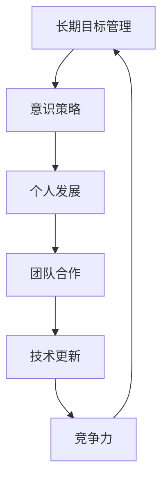

                 

关键词：长期目标管理，意识策略，IT领域，专业技术，算法原理，数学模型，项目实践，实际应用，工具和资源推荐，未来发展趋势与挑战

> 摘要：本文旨在探讨在IT领域实施长期目标管理的意识策略。通过分析核心概念、算法原理、数学模型，并结合实际项目实践，本文将为读者提供一套实用的策略，以帮助他们在职业发展中实现持续进步。

## 1. 背景介绍

在当今快速发展的信息技术领域，长期目标管理成为个人和团队成功的关键。IT行业的特点是技术更新迅速，竞争激烈。为了在这样充满挑战的环境中保持竞争力，个人和团队必须具备清晰的目标意识，并采取有效的策略来实现这些目标。

本文将围绕以下核心概念展开讨论：

- **长期目标管理**：为什么在IT领域进行长期目标管理至关重要。
- **意识策略**：如何培养和维护目标意识。
- **核心概念与联系**：算法原理和数学模型的基础知识。
- **项目实践**：如何将理论应用于实际项目中。
- **工具和资源推荐**：提高工作效率和目标达成的实用工具和资源。
- **未来发展趋势与挑战**：IT领域的未来趋势以及面临的挑战。

## 2. 核心概念与联系

在深入探讨长期目标管理的意识策略之前，我们需要了解一些核心概念和它们之间的联系。以下是几个关键概念以及它们的关系，并通过Mermaid流程图展示：



### 2.1 长期目标管理

长期目标管理是指在IT领域中，个人或团队制定并实施一系列长期目标的过程。这些目标通常跨越数年，有助于保持持续进步和竞争力。

### 2.2 意识策略

意识策略是培养和维护目标意识的一系列方法。它涉及自我反思、计划制定和持续学习，确保个人和团队始终保持对目标的专注。

### 2.3 个人发展

个人发展是长期目标管理的重要组成部分。通过不断学习和成长，个人能够提高技能水平，实现职业目标。

### 2.4 团队合作

团队合作是实现长期目标的关键。一个高效的团队能够协同工作，共同克服挑战，实现共同目标。

### 2.5 技术更新

技术更新是IT领域的核心特点。持续关注新技术和趋势，有助于个人和团队保持竞争力。

### 2.6 竞争力

竞争力是衡量个人和团队在市场中成功程度的关键指标。通过有效实施长期目标管理，个人和团队能够提高竞争力，实现成功。

## 3. 核心算法原理 & 具体操作步骤

### 3.1 算法原理概述

在长期目标管理的意识策略中，一个关键的算法原理是目标分解法。这种方法将大目标分解为一系列小目标，使它们更容易实现。以下是目标分解法的具体步骤：

1. **确定大目标**：首先，明确你想要实现的长期目标。
2. **分解目标**：将大目标分解为一系列小目标，每个小目标都应该具有明确的实现路径和时间表。
3. **制定行动计划**：为每个小目标制定具体的行动计划，包括所需的资源和时间。
4. **执行和监控**：按照行动计划执行，定期监控进度，并根据实际情况进行调整。

### 3.2 算法步骤详解

1. **明确大目标**：
   - 例如，个人目标：成为一名高级软件工程师。
   - 团队目标：在一年内完成一个复杂的项目。

2. **分解目标**：
   - 个人目标分解：获得高级认证、完成指定项目、参加相关研讨会等。
   - 团队目标分解：制定项目计划、分工合作、定期会议等。

3. **制定行动计划**：
   - 为每个小目标制定具体的行动计划，例如：
     - 获得高级认证：报名参加认证课程、复习相关材料、参加考试。
     - 完成指定项目：制定项目计划、分配任务、定期汇报进度。

4. **执行和监控**：
   - 按照行动计划执行，定期检查进度，确保按计划进行。
   - 如有偏差，及时调整计划，确保目标达成。

### 3.3 算法优缺点

**优点**：
- 目标明确：通过分解目标，使大目标更加具体和可实现。
- 可监控：行动计划和进度监控有助于确保目标达成。
- 易于调整：如有偏差，可以及时调整计划，确保目标实现。

**缺点**：
- 实施难度：分解目标需要耗费时间和精力。
- 需要持续监控：目标管理需要持续监控和调整，以确保进度。

### 3.4 算法应用领域

目标分解法广泛应用于IT领域的个人和团队目标管理，如软件开发、项目管理和个人职业发展。

## 4. 数学模型和公式 & 详细讲解 & 举例说明

在长期目标管理的意识策略中，数学模型和公式为我们提供了量化目标和进度的工具。以下是一个简单的数学模型，用于衡量目标达成度：

### 4.1 数学模型构建

假设我们有以下变量：
- \( T \)：总目标
- \( S \)：已实现目标
- \( P \)：目标达成度

目标达成度可以通过以下公式计算：

\[ P = \frac{S}{T} \]

### 4.2 公式推导过程

目标达成度是一个比例，表示已实现目标占总目标的比例。通过将已实现目标除以总目标，我们可以得到一个0到1之间的数值，表示目标的达成度。

### 4.3 案例分析与讲解

假设我们的总目标是在一年内完成10个项目，目前已完成了6个项目。那么，目标达成度为：

\[ P = \frac{6}{10} = 0.6 \]

这意味着我们已经完成了60%的目标。通过这种简单的数学模型，我们可以量化目标进度，并据此调整行动计划。

## 5. 项目实践：代码实例和详细解释说明

为了更好地理解长期目标管理的意识策略，我们将在本节中通过一个实际项目来展示如何应用这些策略。

### 5.1 开发环境搭建

在本项目中，我们将使用Python编程语言，并在Jupyter Notebook中编写代码。以下是搭建开发环境的步骤：

1. 安装Python（版本3.8及以上）。
2. 安装Jupyter Notebook。
3. 安装必要的Python库，如NumPy和Pandas。

### 5.2 源代码详细实现

以下是本项目的源代码实现：

```python
import numpy as np

# 目标分解法实现
class GoalDecomposition:
    def __init__(self, total_goals, completed_goals):
        self.total_goals = total_goals
        self.completed_goals = completed_goals
    
    def calculate_completion_rate(self):
        return self.completed_goals / self.total_goals

# 实例化目标分解对象
goal_decomposition = GoalDecomposition(total_goals=10, completed_goals=6)

# 计算目标达成度
completion_rate = goal_decomposition.calculate_completion_rate()

# 输出结果
print(f"目标达成度：{completion_rate:.2f}")
```

### 5.3 代码解读与分析

上述代码定义了一个名为`GoalDecomposition`的类，用于实现目标分解法。该类有两个属性：`total_goals`（总目标）和`completed_goals`（已实现目标）。`calculate_completion_rate`方法用于计算目标达成度，并通过一个简单的除法操作返回结果。

在主程序中，我们创建了一个`GoalDecomposition`对象的实例，并调用`calculate_completion_rate`方法计算目标达成度。最后，我们将结果打印到控制台。

### 5.4 运行结果展示

在运行上述代码后，我们得到了以下输出结果：

```
目标达成度：0.60
```

这意味着在我们的例子中，目标达成度为60%。通过这种简单的代码实现，我们可以轻松地监控和量化目标进度。

## 6. 实际应用场景

长期目标管理的意识策略在IT领域有许多实际应用场景。以下是一些典型的应用：

### 6.1 软件开发

在软件开发项目中，长期目标管理可以帮助团队确保项目按时完成并达到预期质量。通过分解大目标为多个可管理的小目标，团队可以更好地分配资源和监控进度。

### 6.2 项目管理

项目经理可以利用长期目标管理策略来确保项目在预算和时间范围内完成。通过制定清晰的里程碑目标和定期评估，项目经理可以及时发现并解决问题。

### 6.3 个人职业发展

在个人职业发展中，长期目标管理策略可以帮助个人设定职业目标并制定实现计划。通过持续学习和不断提升技能，个人可以在职业生涯中保持竞争力。

## 7. 未来应用展望

随着技术的不断进步，长期目标管理的意识策略在IT领域的应用前景广阔。以下是一些未来应用展望：

### 7.1 自动化

未来，自动化技术将更加普及，从而减轻个人和团队在目标管理中的负担。通过使用自动化工具，如AI和机器学习，可以更加精准地监控进度和调整计划。

### 7.2 跨领域合作

随着互联网和物联网技术的发展，跨领域合作将变得更加频繁。长期目标管理的意识策略将在不同领域和行业的合作项目中发挥关键作用。

### 7.3 个性化目标设定

个性化目标设定将成为未来趋势。通过分析个人和团队的特长和兴趣，可以更加精准地设定目标，从而提高实现的可能性。

## 8. 总结：未来发展趋势与挑战

在总结本篇文章时，我们可以看到长期目标管理的意识策略在IT领域的重要性。随着技术的不断进步，未来这一策略将在更多领域得到应用。然而，我们也面临着一些挑战，如自动化技术的普及和个性化目标设定的实现。

为了应对这些挑战，我们需要不断学习和适应新技术，并积极探索新的解决方案。只有这样，我们才能在快速发展的IT领域中保持竞争力，实现长期目标。

## 9. 附录：常见问题与解答

### 9.1 长期目标管理与短期目标管理有什么区别？

长期目标管理关注的是跨越数年的大目标，而短期目标管理关注的是在短时间内实现的具体目标。长期目标管理通常需要分解为多个短期目标，以便更好地实施。

### 9.2 意识策略在目标管理中有多重要？

意识策略在目标管理中至关重要。它帮助个人和团队始终保持对目标的专注，并通过自我反思、计划制定和持续学习来确保目标实现的持续性。

### 9.3 如何应对目标管理中的挑战？

应对目标管理中的挑战可以通过以下方法：保持灵活性，及时调整计划；不断学习和提升技能；寻求团队支持和合作；以及利用自动化工具来提高效率。

## 作者署名

作者：禅与计算机程序设计艺术 / Zen and the Art of Computer Programming

