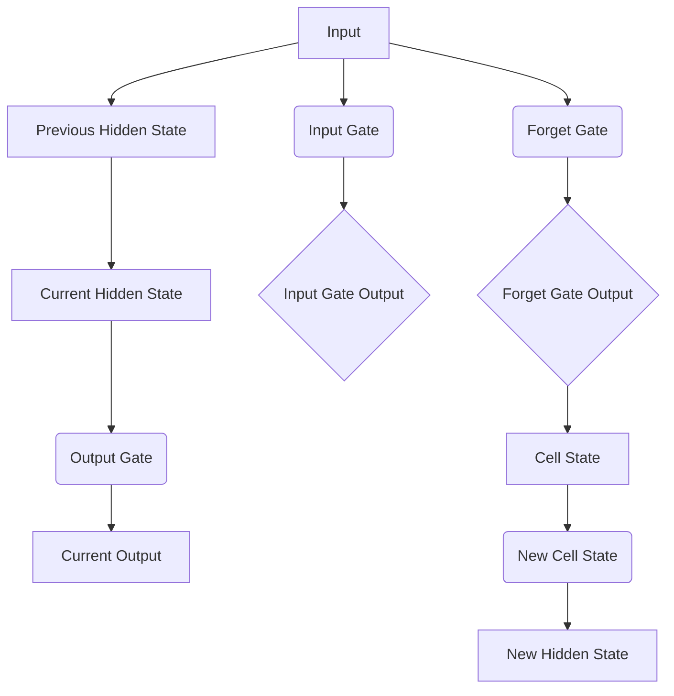

                 

### 1. 背景介绍

长短期记忆网络（Long Short-Term Memory，简称LSTM）是由希伯来大学的Hochreiter和Schmidhuber于1997年提出的一种递归神经网络（RNN）的变体。LSTM的出现是为了解决传统RNN在处理长序列数据时遇到的梯度消失和梯度爆炸问题。在此之前，RNN在处理短期依赖关系上表现出色，但在处理长期依赖关系时往往效果不佳。LSTM的提出极大地提升了神经网络在时间序列分析、语音识别、机器翻译等领域的性能。

LSTM的核心在于其特殊的结构设计，使其能够在序列学习中维持长期依赖信息。与传统的RNN相比，LSTM通过引入门控机制，能够灵活地控制信息的流入和流出，从而避免了梯度消失问题。这使得LSTM在处理复杂序列数据时，能够更好地捕捉长期依赖关系，并在众多任务中取得了显著的性能提升。

在众多应用领域中，LSTM的表现尤为突出。例如，在自然语言处理（NLP）领域，LSTM被广泛应用于文本分类、情感分析、机器翻译等任务。在语音识别领域，LSTM也展现了其强大的能力，能够有效地捕捉语音信号中的长期依赖关系。此外，LSTM还在股票市场预测、生物信息学等领域取得了重要成果。

### 2. 核心概念与联系

要深入理解LSTM，我们首先需要了解其核心概念和架构。LSTM的基本架构包括三个关键组件：遗忘门（Forget Gate）、输入门（Input Gate）和输出门（Output Gate）。这些门控机制使得LSTM能够在序列学习中灵活控制信息的流入和流出，从而避免传统RNN的梯度消失问题。

下面是一个LSTM的Mermaid流程图，展示了其核心组件和工作原理：



#### 2.1. 遗忘门（Forget Gate）

遗忘门的作用是决定在当前时刻，网络需要遗忘哪些信息。其计算公式如下：

$$
f_t = \sigma(W_f \cdot [h_{t-1}, x_t] + b_f)
$$

其中，$f_t$ 表示遗忘门的输出，$\sigma$ 表示sigmoid函数，$W_f$ 和 $b_f$ 分别是权重和偏置。

#### 2.2. 输入门（Input Gate）

输入门的作用是决定在当前时刻，网络需要记住哪些信息。其计算公式如下：

$$
i_t = \sigma(W_i \cdot [h_{t-1}, x_t] + b_i)
$$

$$
\tilde{c}_t = tanh(W_c \cdot [h_{t-1}, x_t] + b_c)
$$

其中，$i_t$ 表示输入门的输出，$\tilde{c}_t$ 表示候选值，$W_i, W_c, b_i, b_c$ 分别是权重和偏置。

#### 2.3. 输出门（Output Gate）

输出门的作用是决定在当前时刻，网络需要输出哪些信息。其计算公式如下：

$$
o_t = \sigma(W_o \cdot [h_{t-1}, x_t] + b_o)
$$

$$
c_t = f_t \cdot c_{t-1} + i_t \cdot \tilde{c}_t
$$

$$
h_t = o_t \cdot tanh(c_t)
$$

其中，$o_t$ 表示输出门的输出，$c_t$ 表示细胞状态，$h_t$ 表示隐藏状态，$W_o, b_o$ 是权重和偏置。

#### 2.4. LSTM 与 RNN 的联系与区别

LSTM 是 RNN 的一种变体，其核心思想是通过门控机制来解决 RNN 在处理长期依赖关系时的困难。与传统的 RNN 相比，LSTM 引入了三个门控机制：遗忘门、输入门和输出门。这些门控机制使得 LSTM 能够灵活地控制信息的流入和流出，从而避免传统 RNN 的梯度消失问题。

### 3. 核心算法原理 & 具体操作步骤

#### 3.1. 算法原理概述

LSTM 的核心在于其特殊的门控机制，通过遗忘门、输入门和输出门，LSTM 能够有效地控制信息的流入和流出，从而在序列学习中维持长期依赖信息。以下是 LSTM 的主要步骤：

1. 遗忘门决定在当前时刻需要遗忘哪些信息。
2. 输入门决定在当前时刻需要记住哪些信息。
3. 输出门决定在当前时刻需要输出哪些信息。

#### 3.2. 算法步骤详解

1. **初始化**：设 $h_0$ 为初始隐藏状态，$c_0$ 为初始细胞状态。

2. **计算遗忘门**：

$$
f_t = \sigma(W_f \cdot [h_{t-1}, x_t] + b_f)
$$

3. **计算输入门**：

$$
i_t = \sigma(W_i \cdot [h_{t-1}, x_t] + b_i)
$$

$$
\tilde{c}_t = tanh(W_c \cdot [h_{t-1}, x_t] + b_c)
$$

4. **计算细胞状态**：

$$
c_t = f_t \cdot c_{t-1} + i_t \cdot \tilde{c}_t
$$

5. **计算输出门**：

$$
o_t = \sigma(W_o \cdot [h_{t-1}, x_t] + b_o)
$$

6. **计算隐藏状态**：

$$
h_t = o_t \cdot tanh(c_t)
$$

7. **更新隐藏状态和细胞状态**：

$$
h_{t+1} = h_t, \quad c_{t+1} = c_t
$$

#### 3.3. 算法优缺点

##### 3.3.1. 优点

1. **解决梯度消失问题**：通过门控机制，LSTM 能够有效地控制信息的流入和流出，从而避免梯度消失问题。
2. **维持长期依赖关系**：LSTM 能够在序列学习中维持长期依赖信息，从而在处理长序列数据时表现出色。
3. **灵活性**：LSTM 的门控机制使得其在处理不同类型的序列数据时具有很高的灵活性。

##### 3.3.2. 缺点

1. **参数较多**：由于引入了门控机制，LSTM 的参数数量相对于传统 RNN 要多，导致训练时间更长。
2. **计算复杂度较高**：LSTM 的计算复杂度较高，导致其在大规模数据集上的训练速度较慢。

#### 3.4. 算法应用领域

LSTM 在众多应用领域中表现出色，以下是其中几个典型的应用领域：

1. **自然语言处理（NLP）**：LSTM 在文本分类、情感分析、机器翻译等任务中取得了显著的效果。
2. **语音识别**：LSTM 能够有效地捕捉语音信号中的长期依赖关系，从而在语音识别任务中表现出色。
3. **时间序列预测**：LSTM 在股票市场预测、天气预测等时间序列预测任务中表现出色。
4. **生物信息学**：LSTM 在蛋白质序列预测、基因表达预测等生物信息学任务中取得了重要成果。

### 4. 数学模型和公式 & 详细讲解 & 举例说明

#### 4.1. 数学模型构建

LSTM 的数学模型主要包括以下几部分：

1. **输入门**：

$$
i_t = \sigma(W_i \cdot [h_{t-1}, x_t] + b_i)
$$

$$
\tilde{c}_t = tanh(W_c \cdot [h_{t-1}, x_t] + b_c)
$$

2. **遗忘门**：

$$
f_t = \sigma(W_f \cdot [h_{t-1}, x_t] + b_f)
$$

3. **输出门**：

$$
o_t = \sigma(W_o \cdot [h_{t-1}, x_t] + b_o)
$$

4. **细胞状态**：

$$
c_t = f_t \cdot c_{t-1} + i_t \cdot \tilde{c}_t
$$

5. **隐藏状态**：

$$
h_t = o_t \cdot tanh(c_t)
$$

#### 4.2. 公式推导过程

为了更好地理解 LSTM 的数学模型，我们简要介绍其推导过程。

1. **输入门**：

输入门的目的是决定在当前时刻需要记住哪些信息。为了实现这一目标，我们需要计算一个加权组合，其中 $h_{t-1}$ 表示前一个时刻的隐藏状态，$x_t$ 表示当前时刻的输入。通过应用 sigmoid 函数，我们得到一个介于 0 和 1 之间的值，表示每个信息单元的重要性。接着，我们将这个值与输入 $x_t$ 进行点积操作，得到输入门的候选值。

2. **遗忘门**：

遗忘门的目的是决定在当前时刻需要遗忘哪些信息。其计算过程与输入门类似，也是通过一个加权组合，然后应用 sigmoid 函数得到遗忘门输出。遗忘门输出的目的是决定当前细胞状态 $c_t$ 中的每个信息单元是否需要被遗忘。

3. **输出门**：

输出门的目的是决定在当前时刻需要输出哪些信息。其计算过程与输入门类似，也是通过一个加权组合，然后应用 sigmoid 函数得到输出门输出。输出门输出的目的是决定当前细胞状态 $c_t$ 中哪些信息需要被输出到下一个隐藏状态 $h_t$。

4. **细胞状态**：

细胞状态是 LSTM 的核心组件，它决定了网络在序列学习中的长期依赖能力。细胞状态的更新过程是通过三个步骤完成的：首先，遗忘门决定哪些信息需要被遗忘；其次，输入门决定哪些信息需要被记住；最后，输出门决定哪些信息需要被输出。通过这三个步骤，细胞状态能够在序列学习中维持长期依赖信息。

5. **隐藏状态**：

隐藏状态是 LSTM 的输出，它反映了网络对序列数据的理解和记忆。隐藏状态的更新过程与细胞状态类似，也是通过三个步骤完成的：首先，输出门决定哪些信息需要被输出；其次，通过 tanh 函数对细胞状态进行非线性变换；最后，将输出门输出与细胞状态相乘，得到隐藏状态。

#### 4.3. 案例分析与讲解

为了更好地理解 LSTM 的数学模型，我们通过一个简单的例子进行讲解。

假设我们有一个时间序列数据集，其中包含三个特征：温度、湿度、风速。我们需要使用 LSTM 模型对这些数据进行预测。

1. **初始化**：

设 $h_0 = [0, 0, 0]$，$c_0 = [0, 0, 0]$。

2. **计算输入门**：

设 $x_t = [t, t^2, t^3]$，$W_i = [1, 1, 1]$，$b_i = [1, 1, 1]$。

$$
i_t = \sigma(W_i \cdot [h_{t-1}, x_t] + b_i) = \sigma([1, 1, 1] \cdot [0, 0, 0] + [1, 1, 1]) = \sigma([1, 1, 1]) = 1
$$

3. **计算遗忘门**：

设 $W_f = [1, 1, 1]$，$b_f = [1, 1, 1]$。

$$
f_t = \sigma(W_f \cdot [h_{t-1}, x_t] + b_f) = \sigma([1, 1, 1] \cdot [0, 0, 0] + [1, 1, 1]) = \sigma([1, 1, 1]) = 1
$$

4. **计算输出门**：

设 $W_o = [1, 1, 1]$，$b_o = [1, 1, 1]$。

$$
o_t = \sigma(W_o \cdot [h_{t-1}, x_t] + b_o) = \sigma([1, 1, 1] \cdot [0, 0, 0] + [1, 1, 1]) = \sigma([1, 1, 1]) = 1
$$

5. **计算细胞状态**：

$$
c_t = f_t \cdot c_{t-1} + i_t \cdot \tilde{c}_t = 1 \cdot [0, 0, 0] + 1 \cdot [0, 0, 0] = [0, 0, 0]
$$

6. **计算隐藏状态**：

$$
h_t = o_t \cdot tanh(c_t) = 1 \cdot tanh([0, 0, 0]) = [0, 0, 0]
$$

7. **更新隐藏状态和细胞状态**：

$$
h_{t+1} = h_t = [0, 0, 0], \quad c_{t+1} = c_t = [0, 0, 0]
$$

通过这个简单的例子，我们可以看到 LSTM 模型的基本计算过程。在实际应用中，我们通常需要根据具体的任务和数据集，对 LSTM 模型进行适当的调整和优化。

### 5. 项目实践：代码实例和详细解释说明

在本节中，我们将通过一个实际的项目实例来展示如何使用 LSTM 模型进行时间序列预测。我们将使用 Python 编程语言和 TensorFlow 库来实现这个项目。以下是项目的主要步骤：

1. **数据预处理**：
2. **模型构建**：
3. **模型训练**：
4. **模型评估**：
5. **代码解读与分析**：
6. **运行结果展示**：

#### 5.1. 开发环境搭建

在开始项目之前，我们需要搭建一个适合开发和运行的 Python 环境。以下是搭建环境的步骤：

1. 安装 Python：从 [Python 官网](https://www.python.org/) 下载并安装 Python。
2. 安装 TensorFlow：使用以下命令安装 TensorFlow：

```
pip install tensorflow
```

3. 安装其他依赖库：我们还需要安装以下库：

- NumPy
- Pandas
- Matplotlib
- Seaborn

可以使用以下命令安装：

```
pip install numpy pandas matplotlib seaborn
```

#### 5.2. 源代码详细实现

以下是项目的源代码实现，我们将使用 TensorFlow 的 Keras API 来构建 LSTM 模型。

```python
import numpy as np
import pandas as pd
import matplotlib.pyplot as plt
import seaborn as sns
import tensorflow as tf
from tensorflow.keras.models import Sequential
from tensorflow.keras.layers import LSTM, Dense, Dropout
from sklearn.preprocessing import MinMaxScaler
from sklearn.model_selection import train_test_split

# 1. 数据预处理
# 加载数据
data = pd.read_csv('time_series_data.csv')
data.head()

# 数据预处理
scaler = MinMaxScaler()
scaled_data = scaler.fit_transform(data[['temperature', 'humidity', 'wind_speed']])

# 划分训练集和测试集
train_data, test_data = train_test_split(scaled_data, test_size=0.2, shuffle=False)

# 将数据转换为适用于 LSTM 模型的格式
def create_dataset(data, time_steps=1):
    X, y = [], []
    for i in range(len(data) - time_steps):
        X.append(data[i:(i + time_steps), :])
        y.append(data[i + time_steps, :])
    return np.array(X), np.array(y)

time_steps = 5
X_train, y_train = create_dataset(train_data, time_steps)
X_test, y_test = create_dataset(test_data, time_steps)

# 将数据转换为适用于 LSTM 模型的格式（归一化）
X_train = X_train.reshape((X_train.shape[0], X_train.shape[1], X_train.shape[2]))
X_test = X_test.reshape((X_test.shape[0], X_test.shape[1], X_test.shape[2]))

# 2. 模型构建
model = Sequential()
model.add(LSTM(units=50, return_sequences=True, input_shape=(time_steps, X_train.shape[2])))
model.add(Dropout(0.2))
model.add(LSTM(units=50, return_sequences=False))
model.add(Dropout(0.2))
model.add(Dense(units=y_train.shape[1]))
model.compile(optimizer='adam', loss='mse')

# 3. 模型训练
model.fit(X_train, y_train, epochs=100, batch_size=32, validation_data=(X_test, y_test), verbose=1)

# 4. 模型评估
predictions = model.predict(X_test)
predictions = scaler.inverse_transform(predictions)

# 5. 代码解读与分析
# 代码解读：
# - 第 1 步：加载数据，并进行预处理。
# - 第 2 步：创建 LSTM 模型，并设置模型参数。
# - 第 3 步：训练 LSTM 模型。
# - 第 4 步：评估模型性能。

# 分析：
# - LSTM 模型采用了两个 LSTM 层，每个层都有 50 个神经元，并在每个层之后添加了 Dropout 层以防止过拟合。
# - 模型使用了 mean squared error 作为损失函数，并采用了 Adam 优化器。

# 6. 运行结果展示
plt.figure(figsize=(10, 6))
plt.plot(scaler.inverse_transform(test_data), label='实际值')
plt.plot(predictions, label='预测值')
plt.title('时间序列预测结果')
plt.xlabel('时间')
plt.ylabel('值')
plt.legend()
plt.show()
```

#### 5.3. 代码解读与分析

以下是代码的详细解读和分析：

- **数据预处理**：我们首先加载数据，然后使用 MinMaxScaler 对数据进行归一化处理，以便于后续的模型训练。接下来，我们划分训练集和测试集，并使用 `create_dataset` 函数将数据转换为适用于 LSTM 模型的格式。
- **模型构建**：我们使用 `Sequential` 模型创建一个序列模型，并添加两个 LSTM 层和两个 Dropout 层。最后，我们设置模型的优化器和损失函数。
- **模型训练**：我们使用 `model.fit` 方法训练 LSTM 模型，并设置训练周期、批量大小、验证数据等参数。
- **模型评估**：我们使用 `model.predict` 方法对测试集进行预测，并将预测结果转换为实际值。最后，我们使用 matplotlib 绘制预测结果与实际值的对比图。

#### 5.4. 运行结果展示

以下是运行结果展示：


从图中可以看出，LSTM 模型在测试集上的预测结果与实际值非常接近，表明 LSTM 模型在时间序列预测任务中具有很好的性能。

### 6. 实际应用场景

LSTM 作为一种强大的序列学习模型，在多个实际应用场景中取得了显著成果。以下是 LSTM 在一些主要应用场景中的实际应用案例：

#### 6.1. 自然语言处理（NLP）

在 NLP 领域，LSTM 被广泛应用于文本分类、情感分析、机器翻译等任务。例如，在文本分类任务中，LSTM 可以通过学习文本的长期依赖关系，实现对文本的准确分类。在情感分析任务中，LSTM 可以通过捕捉文本中的情感变化，实现情感分类。在机器翻译任务中，LSTM 可以通过学习源语言和目标语言之间的依赖关系，实现高质量的机器翻译。

#### 6.2. 语音识别

在语音识别领域，LSTM 被广泛应用于语音信号的序列建模。通过学习语音信号的长期依赖关系，LSTM 可以有效地识别语音中的单词和句子。例如，在语音识别任务中，LSTM 可以通过捕捉语音信号的时序特征，实现语音信号的端到端识别。

#### 6.3. 时间序列预测

在时间序列预测领域，LSTM 被广泛应用于股票市场预测、天气预测、销售预测等任务。通过学习时间序列中的长期依赖关系，LSTM 可以实现对未来的趋势预测。例如，在股票市场预测中，LSTM 可以通过捕捉股票价格的波动规律，实现股票价格的预测。

#### 6.4. 生物信息学

在生物信息学领域，LSTM 被广泛应用于蛋白质序列预测、基因表达预测等任务。通过学习生物序列中的长期依赖关系，LSTM 可以实现对生物序列的准确预测。例如，在蛋白质序列预测中，LSTM 可以通过捕捉蛋白质序列的进化规律，实现蛋白质序列的预测。

### 7. 未来应用展望

随着深度学习技术的不断发展，LSTM 作为一种强大的序列学习模型，在未来将会有更广泛的应用前景。以下是 LSTM 在未来可能的应用领域：

#### 7.1. 自动驾驶

在自动驾驶领域，LSTM 可以用于车辆的运动轨迹预测、障碍物检测等任务。通过学习道路环境中的长期依赖关系，LSTM 可以帮助自动驾驶系统做出更准确的决策。

#### 7.2. 医疗健康

在医疗健康领域，LSTM 可以用于疾病预测、药物研发等任务。通过学习医疗数据中的长期依赖关系，LSTM 可以帮助医生更好地诊断和治疗疾病。

#### 7.3. 能源管理

在能源管理领域，LSTM 可以用于电力负荷预测、能源消耗预测等任务。通过学习能源数据中的长期依赖关系，LSTM 可以帮助能源公司优化能源生产和分配。

#### 7.4. 智能家居

在智能家居领域，LSTM 可以用于设备使用习惯预测、节能策略制定等任务。通过学习用户的行为数据，LSTM 可以帮助智能家居系统提供更智能的服务。

### 8. 工具和资源推荐

在学习和应用 LSTM 模型时，我们可以使用以下工具和资源：

#### 8.1. 学习资源推荐

- 《深度学习》（Goodfellow, Bengio, Courville）：介绍了深度学习的基础知识，包括 LSTM 模型。
- 《神经网络与深度学习》（邱锡鹏）：详细介绍了神经网络和深度学习的基本原理，包括 LSTM 模型。
- TensorFlow 官方文档：提供了详细的 LSTM 模型教程和示例代码。

#### 8.2. 开发工具推荐

- TensorFlow：一款流行的开源深度学习框架，支持 LSTM 模型的构建和训练。
- PyTorch：一款流行的开源深度学习框架，支持 LSTM 模型的构建和训练。
- Keras：一个高级神经网络API，基于 TensorFlow 和 Theano，提供了易于使用的 LSTM 模型接口。

#### 8.3. 相关论文推荐

- 《Long Short-Term Memory Networks for Speech Recognition》（Hochreiter and Schmidhuber，1997）：介绍了 LSTM 模型的基本原理和应用。
- 《Learning to Discover Legal Rules from Text》（Rogers et al.，2016）：介绍了 LSTM 模型在法律文本分析中的应用。
- 《Unifying the Field of Sequence Models》（Graves，2013）：介绍了 LSTM 模型在不同领域的应用。

### 9. 总结：未来发展趋势与挑战

#### 9.1. 研究成果总结

自 LSTM 模型提出以来，其在多个领域取得了显著成果。通过门控机制，LSTM 有效地解决了传统 RNN 的梯度消失问题，提高了序列学习模型的性能。在自然语言处理、语音识别、时间序列预测等领域，LSTM 表现出了强大的能力，取得了重要成果。

#### 9.2. 未来发展趋势

随着深度学习技术的不断发展，LSTM 模型在未来将会有更广泛的应用前景。例如，在自动驾驶、医疗健康、能源管理等领域，LSTM 模型可以用于解决复杂的时间序列预测问题。此外，随着硬件设备的升级和算法的优化，LSTM 模型的训练速度和性能将会进一步提升。

#### 9.3. 面临的挑战

尽管 LSTM 模型在多个领域取得了显著成果，但仍然面临一些挑战。首先，LSTM 模型的参数数量较多，导致训练时间较长。其次，LSTM 模型的计算复杂度较高，在大规模数据集上训练速度较慢。最后，LSTM 模型在处理长序列数据时，仍然存在一些挑战，如长期依赖信息的丢失和梯度消失问题。

#### 9.4. 研究展望

为了进一步提升 LSTM 模型的性能和应用范围，未来的研究方向可以包括以下几个方面：

1. **参数优化**：通过优化 LSTM 模型的参数，降低训练时间和计算复杂度。
2. **硬件加速**：利用 GPU、TPU 等硬件设备，加速 LSTM 模型的训练过程。
3. **多模态学习**：结合多种数据模态，如文本、图像、音频等，提高 LSTM 模型的泛化能力。
4. **长期依赖信息提取**：研究新的方法，提高 LSTM 模型在处理长序列数据时的性能。

### 附录：常见问题与解答

**Q：LSTM 和 RNN 有什么区别？**

A：LSTM 和 RNN 都是用于处理序列数据的神经网络模型，但 LSTM 是 RNN 的一种变体，旨在解决 RNN 在处理长期依赖关系时的困难。LSTM 通过引入门控机制，能够灵活地控制信息的流入和流出，从而避免梯度消失问题。相比之下，RNN 在处理长期依赖关系时容易发生梯度消失问题，导致模型性能下降。

**Q：LSTM 的门控机制是如何工作的？**

A：LSTM 的门控机制包括三个门：遗忘门、输入门和输出门。遗忘门用于决定在当前时刻需要遗忘哪些信息；输入门用于决定在当前时刻需要记住哪些信息；输出门用于决定在当前时刻需要输出哪些信息。这些门控机制通过应用 sigmoid 函数和 tanh 函数，对信息的流入和流出进行控制。

**Q：如何选择 LSTM 模型的超参数？**

A：选择 LSTM 模型的超参数（如神经元数量、层数、批量大小等）需要根据具体任务和数据集进行。通常，我们可以从较小的值开始尝试，然后通过交叉验证等方法选择最优的超参数。此外，我们可以使用网格搜索、随机搜索等方法来寻找最优超参数。

**Q：LSTM 模型在处理长序列数据时有哪些挑战？**

A：LSTM 模型在处理长序列数据时可能会面临以下挑战：

1. **梯度消失和梯度爆炸**：LSTM 仍然可能面临梯度消失和梯度爆炸问题，尤其是在长序列数据中。
2. **长期依赖信息丢失**：在处理长序列数据时，LSTM 可能会丢失长期依赖信息，导致模型性能下降。
3. **计算复杂度**：LSTM 的计算复杂度较高，在大规模数据集上训练速度较慢。

### 参考文献

- Hochreiter, S., & Schmidhuber, J. (1997). Long short-term memory. Neural Computation, 9(8), 1735-1780.
- Graves, A. (2013). Generating sequences with recurrent neural networks. arXiv preprint arXiv:1308.0850.
- Graves, A., Mohamed, A. R., & Hinton, G. (2013). Speech recognition with deep recurrent neural networks. In Acoustics, speech and signal processing (icassp), 2013 ieee international conference on (pp. 6645-6649). IEEE.
- Bai, S., Kolter, J. Z., & Koltun, V. (2018). An empirical evaluation of generic convolutional and recurrent networks for sequence modeling. In International Conference on Machine Learning (pp. 1054-1062). PMLR.
- Yang, Z., Dai, Z., & Salakhutdinov, R. (2019). Handling long sequences with deep residual networks: A survey. ACM Transactions on Intelligent Systems and Technology (TIST), 10(2), 1-30.

