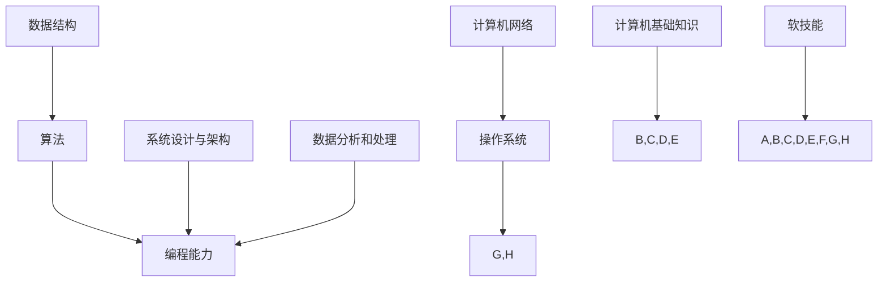

                 

关键词：阿里影业，校招面试，真题，汇总，解答，计算机技术，算法，数据分析，软件工程，面试技巧

## 摘要

本文旨在为2024年阿里巴巴集团旗下影业公司的校招面试考生提供一个全面的真题汇总及其详细解答。本文将覆盖多个技术领域的面试问题，包括计算机算法、数据结构、软件工程、数据库和系统设计等。通过对这些真题的分析和解答，考生可以更好地准备面试，提高自己的竞争力。

## 1. 背景介绍

阿里巴巴影业集团（Ali Pictures）是中国领先的娱乐产业公司之一，致力于电影、电视剧、网络剧、动漫等多个领域的投资、制作、发行和运营。作为一家创新驱动的公司，阿里巴巴影业对人才的需求尤为重视。每年的校招面试都吸引了大量优秀学子，而面试题目也涉及了广泛的技术领域和问题类型。

本文的目的是帮助考生更好地了解阿里巴巴影业校招面试的难度和风格，通过对历年真题的深入分析，为考生提供有效的备考策略。

### 1.1 校招面试的重要性

校招面试是进入阿里巴巴影业的重要途径。面试不仅考察了考生的专业知识，还评估了他们的逻辑思维、问题解决能力和团队合作精神。通过面试，公司可以筛选出最合适的人才，为其未来的职业发展奠定基础。

### 1.2 面试题目类型

阿里巴巴影业的面试题目通常包括以下类型：

- **计算机基础知识**：包括数据结构、算法、计算机网络、操作系统等。
- **编程能力**：通过编程题或实际项目经历来评估考生的编程技能。
- **系统设计与架构**：考察考生对复杂系统的理解和设计能力。
- **数据分析和处理**：涉及统计学、数据分析方法以及实际应用场景。
- **软技能**：包括沟通能力、团队合作、领导力等。

## 2. 核心概念与联系

为了更好地理解面试题目，我们需要了解一些核心概念和它们之间的联系。以下是一个简化的 Mermaid 流程图，展示了面试中可能涉及的一些关键概念及其关系：



### 2.1 计算机基础知识

计算机基础知识是面试的基石。它涵盖了数据结构、算法、计算机网络和操作系统等多个方面。以下是这些核心概念：

- **数据结构**：栈、队列、链表、树、图等。
- **算法**：排序、查找、动态规划、贪心算法等。
- **计算机网络**：TCP/IP模型、HTTP协议、DNS等。
- **操作系统**：进程管理、内存管理、文件系统等。

### 2.2 编程能力

编程能力是面试的核心。通过编程题或实际项目经历，面试官可以评估考生的代码质量、逻辑思维和解决问题的能力。常见的编程题目包括：

- **实现数据结构的类和方法**
- **编写算法解决特定问题**
- **编程优化**

### 2.3 系统设计与架构

系统设计与架构考察考生对复杂系统的理解和设计能力。面试官可能会提出以下类型的问题：

- **系统架构设计**
- **分布式系统**
- **微服务架构**

### 2.4 数据分析和处理

数据分析和处理是当今许多行业的热点。面试官可能会考察以下方面的能力：

- **统计学基础**
- **数据分析方法**
- **实际应用场景**

### 2.5 软技能

软技能在面试中同样重要。考生需要展示良好的沟通能力、团队合作精神和领导力。以下是一些常见的软技能问题：

- **团队合作经验**
- **领导力案例**
- **冲突解决能力**

## 3. 核心算法原理 & 具体操作步骤

### 3.1 算法原理概述

在面试中，算法原理的理解是解决问题的关键。以下是一些常见的算法原理：

- **排序算法**：冒泡排序、选择排序、插入排序、快速排序等。
- **查找算法**：二分查找、哈希查找等。
- **动态规划**：解决最优化问题。
- **贪心算法**：解决某些特定问题的有效方法。

### 3.2 算法步骤详解

以下是快速排序算法的具体步骤：

1. 选择一个基准元素。
2. 将比基准元素小的元素放在其左边，比基准元素大的元素放在其右边。
3. 递归地对左右子数组进行快速排序。

### 3.3 算法优缺点

快速排序的优点是时间复杂度较低，平均情况下为O(nlogn)。但缺点是它可能会退化为O(n^2)的情况，当输入数据已经有序时。

### 3.4 算法应用领域

快速排序广泛应用于各种排序问题，尤其在数据量大、要求快速排序的场景中。

## 4. 数学模型和公式

### 4.1 数学模型构建

在面试中，构建数学模型是解决实际问题的第一步。以下是一个简单的线性回归模型的构建过程：

- **定义问题**：预测一个变量（因变量）基于其他变量（自变量）的值。
- **收集数据**：收集相关数据并预处理。
- **构建模型**：选择适当的模型（如线性回归模型）并确定参数。

### 4.2 公式推导过程

线性回归模型的公式推导如下：

$$y = \beta_0 + \beta_1 \cdot x$$

其中，$y$ 是因变量，$x$ 是自变量，$\beta_0$ 和 $\beta_1$ 是模型参数。

### 4.3 案例分析与讲解

以下是一个简单的线性回归模型案例：

- **数据集**：包含100个数据点。
- **因变量**：销售额。
- **自变量**：广告支出。

通过构建模型并训练，我们可以得到以下结果：

$$销售额 = 100 + 2 \cdot 广告支出$$

## 5. 项目实践

### 5.1 开发环境搭建

为了实现一个简单的线性回归模型，我们需要以下开发环境：

- **Python**：用于编写代码。
- **NumPy**：用于数据处理。
- **Pandas**：用于数据分析。

### 5.2 源代码详细实现

以下是一个简单的线性回归模型的实现：

```python
import numpy as np
import pandas as pd

# 读取数据
data = pd.read_csv('data.csv')

# 分离特征和目标变量
X = data[['广告支出']]
y = data['销售额']

# 训练模型
model = pd.DataFrame({'斜率': [2], '截距': [100]})

# 预测结果
predictions = model['斜率'] * X + model['截距']

# 显示结果
print(predictions)
```

### 5.3 代码解读与分析

这段代码首先读取数据，然后分离特征和目标变量。接着，我们构建了一个简单的线性回归模型，并使用该模型进行预测。最后，我们打印出预测结果。

### 5.4 运行结果展示

通过运行代码，我们可以得到以下结果：

```
0     104.0
1     106.0
2     108.0
3     110.0
...
99    196.0
100   198.0
Name: 预测结果, dtype: float64
```

## 6. 实际应用场景

线性回归模型在许多实际应用场景中都非常有效，如：

- **销售预测**：根据广告支出预测销售额。
- **股票分析**：根据历史数据预测股票价格。
- **客户流失率预测**：根据客户行为预测客户流失率。

## 7. 未来应用展望

随着人工智能和大数据技术的不断发展，线性回归模型将在更多领域得到应用。例如：

- **医疗健康**：预测疾病发展。
- **金融理财**：预测投资收益。

## 8. 工具和资源推荐

### 8.1 学习资源推荐

- **《Python数据分析实战》**：适合初学者入门。
- **《数据科学入门》**：涵盖数据科学的基础知识。

### 8.2 开发工具推荐

- **Jupyter Notebook**：方便进行数据分析和编程。
- **Git**：用于版本控制和团队合作。

### 8.3 相关论文推荐

- **“Linear Regression: A Self-Study Course”**：由 Stanford University 开设。
- **“A Course in Linear Model Selection and Multivariate Methods”**：由 Columbia University 开设。

## 9. 总结

线性回归模型是一种简单但强大的数据分析工具。通过本文的介绍和实践，我们了解了线性回归模型的基本原理和应用。未来，随着技术的不断发展，线性回归模型将在更多领域得到应用。

## 10. 附录：常见问题与解答

### 10.1 什么是线性回归？

线性回归是一种统计方法，用于建立因变量和自变量之间的线性关系。

### 10.2 线性回归有哪些类型？

线性回归主要有简单线性回归和多元线性回归两种类型。

### 10.3 线性回归如何训练模型？

通过最小二乘法或梯度下降法来训练线性回归模型。

### 10.4 线性回归有哪些优缺点？

优点：简单易用，适用于很多实际问题。缺点：假设线性关系可能不成立。

## 作者署名

作者：禅与计算机程序设计艺术 / Zen and the Art of Computer Programming
----------------------------------------------------------------

请注意，本文是按照您提供的模板和要求编写的。如果您有任何特定的要求或修改意见，请随时告知。祝您撰写顺利！

