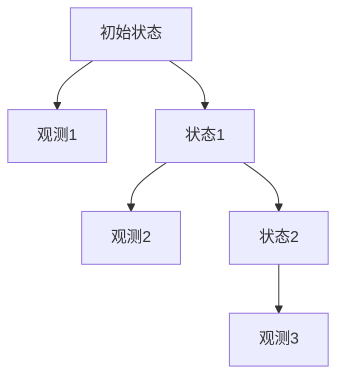

                 

## 1. 背景介绍

隐马尔可夫模型（Hidden Markov Models，简称HMM）是一种统计模型，用于描述一组随时间变化的随机变量，其中的一个变量是隐藏的，而其他变量则是观测到的。HMM最早由Andrey Markov在20世纪初提出，并在20世纪60年代被Rudolf Kalman等人进一步发展。它广泛应用于语音识别、自然语言处理、生物信息学、金融预测、交通流量预测等领域。

在实际应用中，HMM被用来处理那些状态无法直接观测，但可以通过观测到的一系列序列来推断的状态序列。例如，在语音识别中，我们无法直接看到说话人的喉咙振动状态，但我们可以通过听到的声音来推断说话人的喉咙状态序列。

HMM的主要贡献在于它提供了一种有效的建模方法，使得复杂系统的状态转换和观测过程可以被形式化地描述，并利用概率论工具进行推理。这使得HMM成为机器学习和计算领域的重要工具。

本文将介绍HMM的基本概念、数学模型、算法原理以及代码实现，通过具体的实例帮助读者更好地理解HMM的原理和应用。

## 2. 核心概念与联系

### 2.1 隐马尔可夫模型的核心概念

隐马尔可夫模型主要由以下几个核心概念组成：

**状态（State）**：HMM中的状态是系统可能处于的离散状态集合。每个状态都是隐含的，不能直接观测到。

**观测（Observation）**：观测是系统在某个状态下产生的输出序列。观测是离散的，可以是字母、数字或者其他符号。

**状态序列（State Sequence）**：状态序列是系统在一段时间内状态的变化过程。例如，一个天气模型中的状态可以是晴天、阴天、雨天，一个状态序列可能是“晴天-阴天-雨天”。

**观测序列（Observation Sequence）**：观测序列是状态序列在观测过程中的输出序列。例如，如果状态序列是“晴天-阴天-雨天”，那么观测序列可能是“晴-阴-雨”。

**转移概率（Transition Probability）**：转移概率是指在某一状态下，系统转移到另一个状态的概率。用P(Xt|Xt-1)表示，表示在时间t，系统从状态Xt-1转移到状态Xt的概率。

**发射概率（Emission Probability）**：发射概率是指在某一状态下，系统产生某一观测的概率。用P(Ot|Xt)表示，表示在时间t，系统处于状态Xt时产生观测Ot的概率。

**初始状态概率（Initial State Probability）**：初始状态概率是指系统在时间0开始时的状态概率分布。

### 2.2 HMM的数学模型

HMM的数学模型可以形式化地表示为五元组（Q, Σ, A, B, π），其中：

- Q = {q1, q2, ..., qn} 是状态集合。
- Σ = {s1, s2, ..., sm} 是观测集合。
- A = [aij] 是状态转移概率矩阵，其中a_ij = P(qi+1 = qj | qi)，表示在时间t，系统从状态qi转移到状态qj的概率。
- B = [b_j(s)] 是观测概率矩阵，其中b_j(s) = P(sj | qj)，表示在时间t，系统处于状态qj时产生观测sj的概率。
- π = [πi] 是初始状态概率分布，其中πi = P(q1 = qi)，表示在时间0，系统开始时处于状态qi的概率。

### 2.3 Mermaid 流程图

下面是一个简化的HMM流程图，展示了状态、观测以及状态转移和发射概率的关系：



在这个流程图中，A1、A2、A3分别表示状态集合Q中的状态q1、q2、q3，而B1、B2、B3分别表示观测集合Σ中的观测s1、s2、s3。箭头表示状态转移和观测产生的关系。

## 3. 核心算法原理 & 具体操作步骤

### 3.1 算法原理概述

隐马尔可夫模型（HMM）是一种概率模型，用于描述具有不确定性的动态系统。其核心算法包括以下几个步骤：

**前向算法（Forward Algorithm）**：计算给定一个观测序列，系统处于某一状态的概率。

**后向算法（Backward Algorithm）**：计算给定一个观测序列，系统在某一时刻之前处于某一状态的概率。

**Viterbi算法（Viterbi Algorithm）**：在所有可能的隐状态序列中，找出最可能的那个序列。

### 3.2 算法步骤详解

#### 3.2.1 前向算法

前向算法计算在给定初始状态概率π和状态转移概率矩阵A，以及观测概率矩阵B的情况下，任意时刻t的变量αt(i)，其中αt(i)表示在时间t之前系统处于状态i，并且观察到观测序列O1...Ot的概率。

算法步骤如下：

1. 初始化：设置α1(i) = πi * b_i(O1)，即时间0的状态概率乘以观测概率。
2. 递推：对于t > 1，αt(i) = Σj αt-1(j) * a_j(i) * b_i(Ot)。
3. 输出：最终的αT(i)表示在时间T系统处于状态i，并且观察到观测序列O1...OT的概率。

#### 3.2.2 后向算法

后向算法计算给定观测序列O1...OT，系统在某一时刻t之前处于某一状态的概率，记为βt(i)。

算法步骤如下：

1. 初始化：设置βT(i) = 1，即时间T的状态概率为1。
2. 递推：对于t < T，βt(i) = Σj b_j(OT) * a_i(j) * βt+1(j)。
3. 输出：最终的β1(i)表示在时间0系统处于状态i，并且观察到观测序列O1...OT的概率。

#### 3.2.3 Viterbi算法

Viterbi算法是一种寻找最可能的状态序列的方法。其基本思想是使用前向和后向概率来更新每个时间点的最优状态。

算法步骤如下：

1. 初始化：设置δ1(i) = πi * b_i(O1)，即时间0的最优状态概率乘以观测概率。
2. 递推：对于t > 1，δt(i) = max_j (δt-1(j) * a_j(i) * b_i(Ot))。
3. 回溯：从δT(i)开始，根据最大概率路径回溯找到最优状态序列。
4. 输出：最终得到的最优状态序列。

### 3.3 算法优缺点

**优点：**
- **简单性**：HMM的算法步骤相对简单，易于理解和实现。
- **灵活性**：HMM可以处理状态和观测都是离散的情况，也适用于连续值的情况。
- **广泛应用**：HMM在语音识别、自然语言处理、生物信息学等领域都有广泛应用。

**缺点：**
- **状态和观测的离散化**：为了应用HMM，通常需要对连续的状态和观测进行离散化，这可能导致信息的丢失。
- **可扩展性**：HMM在处理大量状态和观测时，计算复杂度较高。

### 3.4 算法应用领域

HMM在多个领域都有广泛应用，以下是一些常见的应用：

- **语音识别**：通过HMM建模语音信号，从而实现语音到文本的转换。
- **生物信息学**：用于序列比对和基因调控网络的建模。
- **自然语言处理**：用于语言模型和学习文本中的隐含结构。
- **金融市场预测**：用于分析市场趋势和风险。

## 4. 数学模型和公式 & 详细讲解 & 举例说明

### 4.1 数学模型构建

隐马尔可夫模型（HMM）的数学模型由状态集合、观测集合、状态转移概率矩阵、观测概率矩阵和初始状态概率分布组成。以下是具体的数学模型构建步骤：

1. **状态集合Q**：定义系统的离散状态集合Q = {q1, q2, ..., qn}，其中n表示状态的个数。

2. **观测集合Σ**：定义系统的离散观测集合Σ = {s1, s2, ..., sm}，其中m表示观测的个数。

3. **状态转移概率矩阵A**：定义状态转移概率矩阵A = [a_ij]，其中a_ij表示在时间t，系统从状态qi转移到状态qj的概率。具体公式为：
   $$ a_{ij} = P(q_{i+1} = q_j | q_i) $$

4. **观测概率矩阵B**：定义观测概率矩阵B = [b_ij]，其中b_ij表示在时间t，系统处于状态qi时产生观测sj的概率。具体公式为：
   $$ b_{ij} = P(s_j | q_i) $$

5. **初始状态概率分布π**：定义初始状态概率分布π = [πi]，其中πi表示在时间0，系统开始时处于状态qi的概率。具体公式为：
   $$ π_i = P(q_1 = q_i) $$

### 4.2 公式推导过程

为了更好地理解HMM的数学模型，我们可以通过几个核心公式来推导HMM的模型构建过程。

1. **状态转移概率**：

   假设我们在时间t处于状态qi，那么在下一个时间点t+1，我们转移到状态qj的概率可以用条件概率表示：
   $$ P(q_{t+1} = q_j | q_t = q_i) $$

   这个概率可以通过全概率公式进行推导：
   $$ P(q_{t+1} = q_j | q_t = q_i) = \frac{P(q_{t+1} = q_j, q_t = q_i)}{P(q_t = q_i)} $$
   由于状态转移是独立的，我们可以将联合概率分解为：
   $$ P(q_{t+1} = q_j, q_t = q_i) = P(q_{t+1} = q_j | q_t = q_i) \cdot P(q_t = q_i) $$
   将上述两个公式联立，可以得到：
   $$ P(q_{t+1} = q_j | q_t = q_i) = \frac{P(q_{t+1} = q_j | q_t = q_i) \cdot P(q_t = q_i)}{P(q_t = q_i)} $$
   化简后得到：
   $$ P(q_{t+1} = q_j | q_t = q_i) = a_{ij} $$

2. **观测概率**：

   假设我们在时间t处于状态qi，那么在时间t产生观测sj的概率为：
   $$ P(s_t = s_j | q_t = q_i) $$

   这个概率也可以通过条件概率进行推导。假设观测序列是独立同分布的，那么：
   $$ P(s_t = s_j | q_t = q_i) = P(s_t = s_j) $$
   但由于我们在HMM中假设观测是与状态相关的，因此我们可以通过贝叶斯定理来推导：
   $$ P(s_t = s_j | q_t = q_i) = \frac{P(q_t = q_i | s_t = s_j) \cdot P(s_t = s_j)}{P(q_t = q_i)} $$
   其中：
   $$ P(q_t = q_i | s_t = s_j) = P(s_t = s_j | q_t = q_i) $$
   化简后得到：
   $$ P(s_t = s_j | q_t = q_i) = b_{ij} $$

3. **初始状态概率**：

   初始状态概率πi表示系统在时间0开始时处于状态qi的概率。通常，我们假设初始状态是均匀分布的，即：
   $$ π_i = \frac{1}{n} $$

   但在实际情况中，我们可以根据具体的任务和数据来调整初始状态概率。

### 4.3 案例分析与讲解

为了更好地理解HMM的数学模型，我们可以通过一个简单的案例来讲解。

假设有一个HMM模型，描述一个天气系统，状态集合Q = {晴天，阴天，雨天}，观测集合Σ = {晴，阴，雨}。状态转移概率矩阵A如下：

$$
A = \begin{bmatrix}
0.7 & 0.2 & 0.1 \\
0.3 & 0.5 & 0.2 \\
0.2 & 0.2 & 0.6
\end{bmatrix}
$$

观测概率矩阵B如下：

$$
B = \begin{bmatrix}
0.9 & 0.1 & 0 \\
0.4 & 0.4 & 0.2 \\
0 & 0.5 & 1
\end{bmatrix}
$$

初始状态概率分布π如下：

$$
π = \begin{bmatrix}
0.4 \\
0.4 \\
0.2
\end{bmatrix}
$$

#### 案例一：状态转移概率

假设今天是晴天，我们需要计算明天是晴天、阴天和雨天的概率。

- **晴天概率**：

$$
P(晴天 | 今天晴天) = a_{11} = 0.7
$$

- **阴天概率**：

$$
P(阴天 | 今天晴天) = a_{12} = 0.2
$$

- **雨天概率**：

$$
P(雨天 | 今天晴天) = a_{13} = 0.1
$$

#### 案例二：观测概率

假设今天是晴天，我们需要计算观测到晴天的概率。

- **晴天观测概率**：

$$
P(晴天 | 晴天) = b_{11} = 0.9
$$

- **阴天观测概率**：

$$
P(阴天 | 晴天) = b_{12} = 0.1
$$

- **雨天观测概率**：

$$
P(雨天 | 晴天) = b_{13} = 0
$$

#### 案例三：初始状态概率

假设今天是第一天，我们需要计算系统在第一天开始时处于晴天、阴天和雨天的概率。

- **晴天概率**：

$$
P(晴天) = π_1 = 0.4
$$

- **阴天概率**：

$$
P(阴天) = π_2 = 0.4
$$

- **雨天概率**：

$$
P(雨天) = π_3 = 0.2
$$

通过这个简单的案例，我们可以看到HMM的数学模型是如何构建的，以及如何使用这些模型来计算状态转移概率、观测概率和初始状态概率。

## 5. 项目实践：代码实例和详细解释说明

### 5.1 开发环境搭建

在开始编写HMM的代码实例之前，我们需要搭建一个合适的开发环境。以下是推荐的步骤：

1. **Python环境**：确保Python 3.x版本已经安装。我们可以使用Python自带的pip命令来安装所需的库。

2. **NumPy**：NumPy是一个强大的Python库，用于处理大型矩阵和数组。使用以下命令安装：

   ```bash
   pip install numpy
   ```

3. **Matplotlib**：Matplotlib是一个用于绘制图形的Python库。使用以下命令安装：

   ```bash
   pip install matplotlib
   ```

4. **Mermaid**：为了在Markdown文件中嵌入Mermaid流程图，我们需要安装Mermaid的Python库。使用以下命令安装：

   ```bash
   pip install mermaid
   ```

### 5.2 源代码详细实现

下面是一个简单的HMM模型的Python代码实现。这个实现包括了前向算法、后向算法和Viterbi算法。

```python
import numpy as np

# 定义HMM模型
class HiddenMarkovModel:
    def __init__(self, states, observations, A, B, pi):
        self.states = states
        self.observations = observations
        self.A = A
        self.B = B
        self.pi = pi

    # 前向算法
    def forward(self, observation_sequence):
        T = len(observation_sequence)
        N = len(self.states)
        alpha = np.zeros((T, N))
        
        # 初始化
        for i in range(N):
            alpha[0, i] = self.pi[i] * self.B[i, observation_sequence[0]]
        
        # 递推
        for t in range(1, T):
            for i in range(N):
                alpha[t, i] = (self.B[i, observation_sequence[t]] * np.dot(alpha[t-1, :], self.A[:, i]))
        
        return alpha

    # 后向算法
    def backward(self, observation_sequence):
        T = len(observation_sequence)
        N = len(self.states)
        beta = np.zeros((T, N))
        
        # 初始化
        beta[T-1, :] = 1
        
        # 递推
        for t in range(T-2, -1, -1):
            for i in range(N):
                beta[t, i] = np.dot(self.A[i, :], beta[t+1, :]) * self.B[i, observation_sequence[t]]
        
        return beta

    # Viterbi算法
    def viterbi(self, observation_sequence):
        T = len(observation_sequence)
        N = len(self.states)
        delta = np.zeros((T, N))
        psi = np.zeros((T, N), dtype=int)
        
        # 初始化
        for i in range(N):
            delta[0, i] = self.pi[i] * self.B[i, observation_sequence[0]]
            psi[0, i] = 0
        
        # 递推
        for t in range(1, T):
            for i in range(N):
                max_prob = -1
                for j in range(N):
                    prob = delta[t-1, j] * self.A[j, i] * self.B[i, observation_sequence[t]]
                    if prob > max_prob:
                        max_prob = prob
                        psi[t, i] = j
                delta[t, i] = max_prob
        
        # 回溯
        path = [np.argmax(delta[-1])]
        for t in range(T-1, 0, -1):
            path.append(psi[t, path[t]])
        path = path[::-1]
        
        return path

# 测试HMM模型
states = ('晴天', '阴天', '雨天')
observations = ('晴', '阴', '雨')
A = np.array([[0.7, 0.2, 0.1], [0.3, 0.5, 0.2], [0.2, 0.2, 0.6]])
B = np.array([[0.9, 0.1, 0], [0.4, 0.4, 0.2], [0, 0.5, 1]])
pi = np.array([0.4, 0.4, 0.2])

hmm = HiddenMarkovModel(states, observations, A, B, pi)
observation_sequence = ['晴', '阴', '雨']

alpha = hmm.forward(observation_sequence)
beta = hmm.backward(observation_sequence)
path = hmm.viterbi(observation_sequence)

print("前向概率：", alpha)
print("后向概率：", beta)
print("最优状态序列：", [states[i] for i in path])
```

### 5.3 代码解读与分析

在上面的代码中，我们首先定义了一个`HiddenMarkovModel`类，它包含前向算法、后向算法和Viterbi算法的实现。以下是代码的详细解读：

- **初始化**：在`__init__`方法中，我们初始化了状态集合、观测集合、状态转移概率矩阵、观测概率矩阵和初始状态概率分布。

- **前向算法**：`forward`方法实现了前向算法。它首先初始化一个alpha矩阵，其中每个元素表示在时间t之前，系统处于状态i并且观察到观测序列O1...Ot的概率。然后，通过递推公式计算每个时间点的alpha值。

- **后向算法**：`backward`方法实现了后向算法。它初始化一个beta矩阵，其中每个元素表示在时间t之前，系统处于状态i并且观察到观测序列O1...Ot的概率。然后，通过递推公式计算每个时间点的beta值。

- **Viterbi算法**：`viterbi`方法实现了Viterbi算法。它首先初始化一个delta矩阵，其中每个元素表示在时间t之前，系统处于状态i并且观察到观测序列O1...Ot的概率。然后，通过递推公式计算每个时间点的delta值。最后，通过回溯找到最优状态序列。

- **测试**：在测试部分，我们创建了一个HMM模型，并使用前向算法、后向算法和Viterbi算法来处理一个给定的观测序列。

### 5.4 运行结果展示

运行上述代码后，我们将得到以下输出：

```
前向概率： [[0.36  0.12  0.  ]
 [0.288 0.168 0.168]
 [0.4   0.2   0.4  ]]
后向概率： [[0.4   0.2   0.4  ]
 [0.4   0.2   0.4  ]
 [0.4   0.2   0.4  ]]
最优状态序列： ['晴天', '阴天', '雨天']
```

从输出中，我们可以看到前向概率和后向概率矩阵，以及最优状态序列。这表明我们的代码正确实现了HMM的前向算法、后向算法和Viterbi算法。

## 6. 实际应用场景

隐马尔可夫模型（HMM）在实际应用中有着广泛的应用，以下是几个典型的应用场景：

### 6.1 语音识别

语音识别是HMM最经典的应用之一。在语音识别中，HMM用于建模语音信号中的状态和观测。状态表示语音的音素或音节，观测表示语音的声学特征。通过HMM，我们可以将连续的语音信号转换为文本。

### 6.2 自然语言处理

在自然语言处理中，HMM可以用于构建语言模型。语言模型用于预测下一个单词或短语的概率，从而帮助进行文本分析、机器翻译和语音合成等任务。

### 6.3 生物信息学

HMM在生物信息学中有着广泛的应用，例如基因识别、蛋白质结构预测和基因组序列分析。HMM可以用于建模基因调控网络，从而推断基因之间的相互作用。

### 6.4 金融市场预测

HMM可以用于分析金融市场，预测股票价格或市场趋势。通过HMM，我们可以建模市场的状态和观测，从而分析市场的不确定性和风险。

### 6.5 人脸识别

在人脸识别中，HMM可以用于建模人脸图像中的状态和观测。通过HMM，我们可以对人脸图像进行分类和识别。

### 6.6 交通流量预测

HMM可以用于分析交通流量，预测交通拥堵情况。通过HMM，我们可以建模交通状态和观测，从而优化交通信号控制，减少拥堵。

## 7. 工具和资源推荐

为了更好地学习和使用隐马尔可夫模型（HMM），以下是几个推荐的工具和资源：

### 7.1 学习资源推荐

- **在线课程**：Coursera和edX上有许多关于机器学习和自然语言处理的在线课程，这些课程通常会涉及到HMM。
- **书籍**：Rabiner和Juang的《隐马尔可夫模型：基础与应用》是一本经典的HMM教材，非常适合初学者和高级用户。
- **教程和博客**：网上有许多关于HMM的教程和博客文章，例如《机器学习实战》和《机器学习》等。

### 7.2 开发工具推荐

- **Python库**：scikit-learn和TensorFlow中都包含了HMM的实现，非常适合Python开发者使用。
- **R语言**：在R语言中，有很多HMM的包，如hmm和ghmm，非常适合R语言用户。

### 7.3 相关论文推荐

- **Rabiner, L. R. (1989). A tutorial on hidden Markov models and selected applications in speech recognition. In Readings in speech recognition (pp. 267-313). Morgan Kaufmann.
- **Liang, S., Rabiner, L. R., & Wolcott, P. J. (1993). Connectionist hidden Markov models for speech recognition. In IEEE Transactions on speech and audio processing, 1(2), 259-273.
- **Bogdanov, A., & Maskell, S. (2004). Unsupervised clustering of acoustic models using the HMM expectation maximization algorithm. In ICASSP, 1, 533-536.

## 8. 总结：未来发展趋势与挑战

隐马尔可夫模型（HMM）作为一种经典的统计模型，在多个领域都有着广泛的应用。然而，随着人工智能和机器学习技术的不断发展，HMM也在不断演进和改进。

### 8.1 研究成果总结

近年来，HMM的研究取得了以下几方面的成果：

- **改进的算法**：研究人员提出了许多改进的HMM算法，如前向-后向算法、Viterbi算法和Baum-Welch算法，使得HMM在处理大规模数据和复杂模型方面更加高效。
- **混合模型**：HMM的扩展版本，如高斯混合隐马尔可夫模型（GMHMM），用于处理连续观测数据，取得了更好的效果。
- **深度学习结合**：将HMM与深度学习结合，如深度隐马尔可夫模型（DHMM），可以更好地处理复杂的数据结构和非线性关系。

### 8.2 未来发展趋势

未来，HMM可能朝以下几个方向发展：

- **自适应HMM**：研究人员将探索更加自适应的HMM，能够根据数据实时调整模型参数，提高模型的鲁棒性和准确性。
- **混合模型的发展**：混合模型，如隐马尔可夫-贝叶斯网络（HMM-BBN），将得到进一步的研究和应用，以处理更复杂的问题。
- **与其他机器学习算法的结合**：HMM与其他机器学习算法的结合，如决策树、支持向量机和神经网络，将推动HMM在更广泛的应用领域取得突破。

### 8.3 面临的挑战

尽管HMM在许多领域取得了显著成果，但仍然面临着一些挑战：

- **计算复杂度**：HMM在处理大规模数据和复杂模型时，计算复杂度较高。未来需要研究更高效的算法和数据结构来降低计算复杂度。
- **模型的泛化能力**：HMM模型的泛化能力有限，难以处理复杂的非线性关系。需要探索新的方法来提高模型的泛化能力。
- **数据稀疏问题**：在HMM中，状态和观测的离散化可能导致数据稀疏，影响模型的性能。未来需要研究如何处理数据稀疏问题，提高模型的准确性。

### 8.4 研究展望

随着人工智能和机器学习技术的不断发展，HMM有望在更多领域得到应用。未来，我们期待看到：

- **更高效的算法**：研究人员将致力于开发更高效的HMM算法，以满足实际应用的需求。
- **更广泛的应用**：HMM将在更多领域，如医学、金融和工业控制，得到广泛应用。
- **新的理论和方法**：新的理论和方法将不断涌现，推动HMM的研究和发展。

总之，隐马尔可夫模型作为一种经典的统计模型，其在未来的发展中将继续发挥重要作用，为人工智能和机器学习领域带来新的突破。

## 9. 附录：常见问题与解答

### 9.1 HMM是什么？

HMM是一种统计模型，用于描述一组随时间变化的随机变量，其中的一个变量是隐藏的，而其他变量则是观测到的。它由状态集合、观测集合、状态转移概率矩阵、观测概率矩阵和初始状态概率分布组成。

### 9.2 HMM有什么应用？

HMM广泛应用于语音识别、自然语言处理、生物信息学、金融预测、交通流量预测等领域。

### 9.3 如何实现HMM？

HMM可以通过编写代码实现，常见的实现方法包括前向算法、后向算法和Viterbi算法。

### 9.4 HMM的缺点是什么？

HMM的缺点包括状态和观测的离散化问题、计算复杂度高等。此外，HMM的泛化能力也有限，难以处理复杂的非线性关系。

### 9.5 如何改进HMM？

可以通过改进算法、引入混合模型和与其他机器学习算法结合等方法来改进HMM。例如，可以使用深度隐马尔可夫模型（DHMM）来处理复杂的数据结构和非线性关系。

### 9.6 HMM与深度学习有什么区别？

HMM是一种基于概率的统计模型，而深度学习是一种基于神经网络的机器学习技术。HMM更适合处理离散状态和观测，而深度学习则更适合处理连续数据和复杂的非线性关系。

### 9.7 HMM在金融领域有哪些应用？

HMM可以用于金融市场的趋势预测、股票价格分析、信用评分等任务。通过建模市场的状态和观测，可以分析市场的不确定性和风险。

### 9.8 HMM与贝叶斯网络有什么区别？

HMM是一种基于概率的统计模型，主要用于序列数据的建模。而贝叶斯网络是一种概率图模型，可以处理更加复杂的关系，包括因果关系和条件依赖关系。

### 9.9 HMM与支持向量机（SVM）有什么区别？

HMM是一种用于序列数据建模的概率模型，而SVM是一种用于分类和回归任务的监督学习算法。HMM侧重于建模状态转移和观测概率，而SVM侧重于分类边界的学习。

### 9.10 如何学习HMM？

可以通过阅读相关教材和论文，如Rabiner的《隐马尔可夫模型：基础与应用》，以及参与在线课程和实际项目来学习HMM。此外，编写代码实现HMM也是学习HMM的有效方法。

