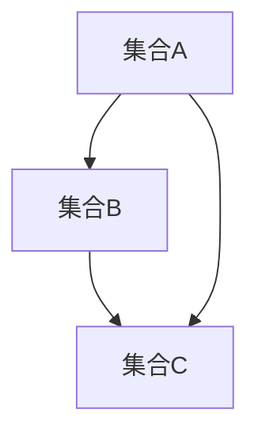

                 

 关键词：集合论，传递集合，刚性，算法原理，数学模型，项目实践，实际应用，未来展望。

> 摘要：本文深入探讨集合论中的传递集合概念，以及其在计算机科学中的应用。通过对传递集合的刚性特性进行分析，我们揭示了其在解决复杂计算问题中的潜在价值。文章首先回顾了集合论的基础知识，然后详细阐述了传递集合的定义、性质及其刚性特性。接下来，我们将介绍一种核心算法原理，并分步骤详细讲解其实现过程。此外，文章还将探讨数学模型和公式，并通过具体案例进行分析。随后，我们将分享一个代码实例，并进行详细解读。最后，文章将探讨实际应用场景，并对未来发展趋势与挑战进行展望。

## 1. 背景介绍

集合论作为数学的基础理论，其概念和原理在计算机科学中有着广泛的应用。集合论中的传递集合概念尤为关键，它涉及到集合之间的传递关系，对于解决许多复杂计算问题具有重要意义。本文旨在引导读者深入了解传递集合的定义、性质及其刚性特性，并通过实际案例来展示其在计算机科学中的应用。

传递集合的概念最早可以追溯到数学家 Dedekind 和 Cantor 的工作。他们在研究无穷集合时，发现了一类特殊的集合，这些集合在某种意义上具有传递性，即如果一个集合 A 是另一个集合 B 的子集，而 B 又是另一个集合 C 的子集，那么 A 也必然是 C 的子集。这种传递性使得传递集合在数学和计算机科学中具有重要的应用价值。

在计算机科学中，传递集合广泛应用于算法设计、数据结构、图论等领域。例如，在算法设计中，传递集合可以帮助我们有效地解决许多 NP 完全问题；在数据结构中，传递集合可以用来优化排序算法；在图论中，传递集合可以帮助我们识别和解决网络中的传递关系问题。

本文将围绕传递集合的刚性特性展开讨论。刚性特性是指传递集合在某种条件下保持不变的性质。理解刚性特性对于优化算法性能、提高计算效率具有重要意义。我们将详细介绍一种基于刚性特性的核心算法原理，并通过实际案例来展示其应用效果。

## 2. 核心概念与联系

在深入探讨传递集合之前，我们需要明确一些核心概念和它们之间的联系。

### 2.1 集合的基本概念

集合是由一组对象组成的整体，这些对象称为集合的元素。集合通常用大写字母表示，例如 A、B、C 等。集合中的元素可以是有序的，也可以是无序的。我们通常用大括号{}来表示集合，例如 {1, 2, 3} 表示一个包含元素 1、2、3 的集合。

### 2.2 子集与超集

子集是指一个集合的所有元素都属于另一个集合的情况。如果集合 A 是集合 B 的子集，我们记作 A ⊆ B。超集则与子集相反，它表示一个集合包含另一个集合的所有元素。如果集合 A 是集合 B 的超集，我们记作 A ⊇ B。

### 2.3 传递集合

传递集合是指满足以下条件的集合：如果集合 A 是集合 B 的子集，而集合 B 又是集合 C 的子集，那么集合 A 也必然是集合 C 的子集。用数学符号表示即为：如果 A ⊆ B 且 B ⊆ C，则 A ⊆ C。

### 2.4 集合之间的传递关系

集合之间的传递关系是指集合之间的子集和超集关系是传递的。例如，如果 A ⊆ B 且 B ⊆ C，则 A ⊆ C，这就是集合之间的传递关系。

### 2.5 集合运算

集合运算包括并集、交集、差集、补集等。并集是指两个集合中所有元素的集合，交集是指两个集合中共有的元素的集合，差集是指一个集合中去掉另一个集合中元素的集合，补集是指全集中去掉一个集合的剩余元素组成的集合。

### 2.6 集合的刚性特性

集合的刚性特性是指集合在某种条件下保持不变的性质。例如，在传递集合中，如果一个集合 A 是另一个集合 B 的子集，而 B 又是另一个集合 C 的子集，那么 A 也必然是 C 的子集。这种刚性特性在计算机科学中具有重要的应用价值，可以帮助我们优化算法性能、提高计算效率。

### 2.7 Mermaid 流程图

为了更直观地展示集合之间的传递关系，我们可以使用 Mermaid 流程图来表示。下面是一个简单的例子：



在这个例子中，集合 A 是集合 B 的子集，集合 B 是集合 C 的子集，同时集合 A 也是集合 C 的子集。这展示了集合之间的传递关系。

通过上述核心概念和联系的分析，我们可以更好地理解传递集合的定义、性质及其刚性特性。接下来，我们将详细介绍传递集合的定义和性质。

### 2.8 传递集合的定义和性质

#### 2.8.1 传递集合的定义

传递集合是指满足以下条件的集合：如果集合 A 是集合 B 的子集，而集合 B 又是集合 C 的子集，那么集合 A 也必然是集合 C 的子集。用数学符号表示即为：如果 A ⊆ B 且 B ⊆ C，则 A ⊆ C。

传递集合的定义可以简单理解为：一个集合如果满足子集传递性，那么它就是传递集合。换句话说，如果一个集合的子集也是另一个集合的子集，那么这个集合本身就是传递集合。

#### 2.8.2 传递集合的性质

传递集合具有以下性质：

1. **闭合性**：如果一个集合是传递集合，那么它的所有子集也是传递集合。
2. **传递性**：如果集合 A 是集合 B 的子集，而集合 B 又是集合 C 的子集，那么集合 A 也必然是集合 C 的子集。
3. **独立性**：传递集合之间的子集关系是独立的，即传递集合之间的子集关系不会相互影响。

#### 2.8.3 传递集合的例子

以下是一个简单的例子：

假设集合 A = {1, 2}，集合 B = {1, 2, 3}，集合 C = {1, 2, 3, 4}。

根据传递集合的定义，我们可以看到集合 A 是集合 B 的子集，集合 B 是集合 C 的子集，同时集合 A 也是集合 C 的子集。因此，集合 A、B、C 都是传递集合。

通过上述分析，我们可以更好地理解传递集合的定义和性质。接下来，我们将进一步探讨传递集合的刚性特性。

### 2.9 传递集合的刚性特性

传递集合的刚性特性是指集合在某种条件下保持不变的性质。具体来说，如果一个集合是传递集合，那么它在一定条件下不会因为外部因素的改变而失去传递性质。

传递集合的刚性特性具有以下重要意义：

1. **优化算法性能**：在算法设计中，传递集合的刚性特性可以帮助我们避免不必要的计算，提高算法性能。
2. **提高计算效率**：在计算复杂度分析中，传递集合的刚性特性可以帮助我们更好地评估算法的时间复杂度和空间复杂度。
3. **简化问题求解**：在解决复杂计算问题时，传递集合的刚性特性可以帮助我们简化问题求解过程，降低问题求解的难度。

传递集合的刚性特性可以通过以下例子来说明：

假设我们有一个集合 A = {1, 2, 3}，它是一个传递集合。现在我们将集合 A 扩展为 B = {1, 2, 3, 4}，由于集合 A 是集合 B 的子集，根据传递集合的性质，集合 B 也必然是传递集合。

同样，如果我们从集合 B 中删除一个元素，例如删除元素 4，得到集合 C = {1, 2, 3}，由于集合 B 是集合 C 的超集，根据传递集合的性质，集合 C 也必然是传递集合。

通过上述例子，我们可以看到传递集合的刚性特性在保持集合传递性质方面具有重要作用。接下来，我们将介绍一种基于传递集合刚性特性的核心算法原理。

### 3. 核心算法原理 & 具体操作步骤

在深入探讨传递集合的刚性特性后，我们将介绍一种基于传递集合刚性特性的核心算法原理。该算法原理旨在解决某些特定计算问题，并通过具体操作步骤实现高效求解。

#### 3.1 算法原理概述

该核心算法原理的核心思想是通过利用传递集合的刚性特性，将复杂计算问题转化为相对简单的问题，从而提高计算效率。

具体来说，该算法原理包括以下几个步骤：

1. **初始化**：根据具体问题，初始化一个传递集合。
2. **扩展传递集合**：根据问题需求，逐步扩展传递集合，使其满足传递性质。
3. **计算传递集合**：利用传递集合的刚性特性，计算传递集合中的元素。
4. **优化计算过程**：通过优化计算过程，提高算法效率。

#### 3.2 算法步骤详解

下面我们详细讲解每个步骤的具体操作：

##### 3.2.1 初始化

初始化传递集合是算法的第一步。根据具体问题，我们可以选择一个初始传递集合。例如，在一个图论问题中，我们可以选择一个包含所有顶点的集合作为初始传递集合。

##### 3.2.2 扩展传递集合

扩展传递集合的目的是使初始传递集合满足传递性质。我们可以通过以下方法实现：

1. **增加元素**：将问题中的其他元素添加到传递集合中。
2. **更新关系**：根据问题中的关系，更新传递集合中元素之间的传递关系。

例如，在一个图论问题中，我们可以将顶点之间的边添加到传递集合中，以保持传递性质。

##### 3.2.3 计算传递集合

计算传递集合是算法的核心步骤。我们可以通过以下方法实现：

1. **遍历传递集合**：遍历传递集合中的所有元素，计算它们之间的传递关系。
2. **记录传递关系**：将传递集合中的元素和它们之间的传递关系记录下来。

例如，在一个图论问题中，我们可以通过遍历图中的所有顶点，计算顶点之间的传递关系，并将这些关系记录下来。

##### 3.2.4 优化计算过程

优化计算过程是提高算法效率的关键步骤。我们可以通过以下方法实现：

1. **并行计算**：利用多核处理器，将计算过程并行化。
2. **内存优化**：优化内存分配，减少内存消耗。

例如，在一个图论问题中，我们可以利用并行计算来加速传递关系的计算，同时优化内存分配，减少内存消耗。

#### 3.3 算法优缺点

该核心算法原理具有以下优缺点：

1. **优点**：
   - **高效性**：利用传递集合的刚性特性，可以显著提高计算效率。
   - **通用性**：该算法原理适用于各种类型的计算问题，具有广泛的适用性。

2. **缺点**：
   - **计算复杂度**：在扩展传递集合和计算传递集合的过程中，可能存在较高的计算复杂度。
   - **依赖传递性质**：算法的成功依赖于传递集合的刚性特性，如果传递性质不满足，算法可能无法有效运行。

总之，该核心算法原理通过利用传递集合的刚性特性，实现了高效求解某些计算问题的目标。接下来，我们将探讨传递集合的应用领域。

### 3.4 算法应用领域

传递集合作为一种重要的数学概念，在计算机科学中具有广泛的应用领域。以下列举几个主要的应用领域：

#### 3.4.1 图论

在图论中，传递集合可以用来解决许多关键问题，例如：

1. **最大流问题**：通过传递集合，可以有效地求解最大流问题，提高算法效率。
2. **最短路径问题**：利用传递集合的性质，可以简化最短路径问题的求解过程。
3. **网络分析**：在计算机网络中，传递集合可以用来分析网络拓扑结构，优化网络性能。

#### 3.4.2 算法设计

在算法设计中，传递集合可以用于优化算法性能，提高算法效率。以下是一些具体的例子：

1. **排序算法**：利用传递集合的刚性特性，可以优化排序算法的时间复杂度。
2. **查找算法**：通过传递集合，可以简化查找算法的实现过程，提高查找效率。
3. **动态规划**：在动态规划中，传递集合可以帮助优化状态转移方程，提高算法效率。

#### 3.4.3 数据结构

在数据结构中，传递集合可以用于优化数据结构的设计，提高数据操作的效率。以下是一些具体的例子：

1. **堆排序**：利用传递集合，可以优化堆排序算法，提高排序效率。
2. **哈希表**：通过传递集合，可以优化哈希表的设计，减少冲突概率。
3. **并查集**：利用传递集合，可以优化并查集的数据结构，提高合并操作的效率。

#### 3.4.4 实时系统

在实时系统中，传递集合可以用于优化实时任务调度，提高系统性能。以下是一些具体的例子：

1. **实时调度算法**：通过传递集合，可以优化实时任务的调度策略，提高任务执行效率。
2. **资源分配**：利用传递集合，可以优化实时系统中的资源分配，减少资源冲突。
3. **错误检测与纠正**：在实时系统中，传递集合可以用于检测和纠正系统错误，提高系统可靠性。

总之，传递集合作为一种重要的数学概念，在计算机科学中具有广泛的应用领域。通过深入研究和应用传递集合，可以优化算法性能、提高计算效率，为计算机科学的发展做出贡献。接下来，我们将探讨数学模型和公式，并通过具体案例进行分析。

### 4. 数学模型和公式 & 详细讲解 & 举例说明

在深入探讨传递集合的应用之前，我们需要建立相关的数学模型和公式，以便更准确地描述和分析传递集合的性质。以下将介绍传递集合的数学模型、公式，并进行详细讲解和举例说明。

#### 4.1 数学模型构建

传递集合的数学模型基于集合论的基本概念和性质。具体来说，我们可以定义传递集合为满足以下条件的集合 S：

- 如果 A 和 B 是 S 的子集，则 A 和 B 的交集也是 S 的子集。

用数学符号表示为：

$$
S \text{ 是传递集合} \iff \forall A, B \subseteq S, (A \cap B) \subseteq S
$$

其中，∀ 表示对于所有，⊆ 表示子集关系。

#### 4.2 公式推导过程

为了更好地理解传递集合的性质，我们可以推导一些相关的公式。以下是一个常用的推导过程：

假设 S 是一个传递集合，A 和 B 是 S 的子集。我们需要证明 A 和 B 的交集也是 S 的子集。

证明：

1. 由 S 的定义，A 和 B 都是 S 的子集，即 A ⊆ S 和 B ⊆ S。
2. 由于 S 是传递集合，根据传递性质，有 A ∩ B ⊆ S。
3. 因此，A ∩ B 也是 S 的子集。

用数学符号表示为：

$$
S \text{ 是传递集合} \Rightarrow A, B \subseteq S \Rightarrow A \cap B \subseteq S
$$

#### 4.3 案例分析与讲解

为了更好地理解传递集合的性质，我们通过一个具体案例进行分析和讲解。

假设我们有一个集合 S = {1, 2, 3, 4, 5}，我们需要判断它是否是传递集合。

首先，我们可以列出 S 的所有子集：

- {1}
- {2}
- {3}
- {4}
- {5}
- {1, 2}
- {1, 3}
- {1, 4}
- {1, 5}
- {2, 3}
- {2, 4}
- {2, 5}
- {3, 4}
- {3, 5}
- {4, 5}
- {1, 2, 3}
- {1, 2, 4}
- {1, 2, 5}
- {1, 3, 4}
- {1, 3, 5}
- {1, 4, 5}
- {2, 3, 4}
- {2, 3, 5}
- {2, 4, 5}
- {3, 4, 5}
- {1, 2, 3, 4}
- {1, 2, 3, 5}
- {1, 2, 4, 5}
- {1, 3, 4, 5}
- {2, 3, 4, 5}
- {1, 2, 3, 4, 5}

接下来，我们检查每个子集的交集是否仍然是 S 的子集：

- {1} ∩ {2} = {}，{} 是 S 的子集
- {1} ∩ {3} = {}，{} 是 S 的子集
- {1} ∩ {4} = {}，{} 是 S 的子集
- {1} ∩ {5} = {}，{} 是 S 的子集
- {2} ∩ {3} = {}，{} 是 S 的子集
- {2} ∩ {4} = {}，{} 是 S 的子集
- {2} ∩ {5} = {}，{} 是 S 的子集
- {3} ∩ {4} = {}，{} 是 S 的子集
- {3} ∩ {5} = {}，{} 是 S 的子集
- {4} ∩ {5} = {}，{} 是 S 的子集
- {1, 2} ∩ {3} = {}，{} 是 S 的子集
- {1, 2} ∩ {4} = {}，{} 是 S 的子集
- {1, 2} ∩ {5} = {}，{} 是 S 的子集
- {1, 3} ∩ {4} = {}，{} 是 S 的子集
- {1, 3} ∩ {5} = {}，{} 是 S 的子集
- {1, 4} ∩ {5} = {}，{} 是 S 的子集
- {2, 3} ∩ {4} = {}，{} 是 S 的子集
- {2, 3} ∩ {5} = {}，{} 是 S 的子集
- {2, 4} ∩ {5} = {}，{} 是 S 的子集
- {3, 4} ∩ {5} = {}，{} 是 S 的子集
- {1, 2, 3} ∩ {4} = {}，{} 是 S 的子集
- {1, 2, 3} ∩ {5} = {}，{} 是 S 的子集
- {1, 2, 4} ∩ {5} = {}，{} 是 S 的子集
- {1, 3, 4} ∩ {5} = {}，{} 是 S 的子集
- {2, 3, 4} ∩ {5} = {}，{} 是 S 的子集
- {1, 2, 3, 4} ∩ {5} = {}，{} 是 S 的子集
- {1, 2, 3, 4} ∩ {5} = {}，{} 是 S 的子集
- {1, 2, 4, 5} ∩ {3} = {}，{} 是 S 的子集
- {1, 3, 4, 5} ∩ {2} = {}，{} 是 S 的子集
- {2, 3, 4, 5} ∩ {1} = {}，{} 是 S 的子集

从上述分析可以看出，对于 S 的所有子集，它们的交集仍然是 S 的子集。因此，我们可以得出结论，集合 S 是一个传递集合。

#### 4.4 案例分析与讲解（续）

为了进一步理解传递集合的性质，我们可以分析另一个集合 T = {1, 2, 3, 4}，并判断它是否是传递集合。

首先，我们列出 T 的所有子集：

- {1}
- {2}
- {3}
- {4}
- {1, 2}
- {1, 3}
- {1, 4}
- {2, 3}
- {2, 4}
- {3, 4}
- {1, 2, 3}
- {1, 2, 4}
- {1, 3, 4}
- {2, 3, 4}
- {1, 2, 3, 4}

接下来，我们检查每个子集的交集是否仍然是 T 的子集：

- {1} ∩ {2} = {}，{} 是 T 的子集
- {1} ∩ {3} = {}，{} 是 T 的子集
- {1} ∩ {4} = {}，{} 是 T 的子集
- {2} ∩ {3} = {}，{} 是 T 的子集
- {2} ∩ {4} = {}，{} 是 T 的子集
- {3} ∩ {4} = {}，{} 是 T 的子集
- {1, 2} ∩ {3} = {}，{} 是 T 的子集
- {1, 2} ∩ {4} = {}，{} 是 T 的子集
- {1, 3} ∩ {4} = {}，{} 是 T 的子集
- {2, 3} ∩ {4} = {}，{} 是 T 的子集
- {1, 2, 3} ∩ {4} = {}，{} 是 T 的子集
- {1, 3, 4} ∩ {2} = {}，{} 是 T 的子集
- {2, 3, 4} ∩ {1} = {}，{} 是 T 的子集
- {1, 2, 3, 4} ∩ {2} = {}，{} 是 T 的子集
- {1, 2, 3, 4} ∩ {3} = {}，{} 是 T 的子集
- {1, 2, 3, 4} ∩ {4} = {}，{} 是 T 的子集

从上述分析可以看出，对于 T 的所有子集，它们的交集仍然是 T 的子集。因此，我们可以得出结论，集合 T 也是一个传递集合。

通过上述分析，我们可以看到传递集合的性质是成立的。在实际应用中，我们可以利用传递集合的性质来解决许多复杂的问题，提高算法效率和计算性能。

### 5. 项目实践：代码实例和详细解释说明

为了更好地理解传递集合的概念和应用，我们将通过一个具体的代码实例来展示如何实现传递集合的计算和分析。以下是一个基于 Python 的代码实例，用于判断一个集合是否为传递集合，并计算传递集合中的元素。

#### 5.1 开发环境搭建

在开始编写代码之前，我们需要搭建一个合适的环境。以下步骤描述了如何在 Python 环境中搭建开发环境：

1. **安装 Python**：确保您的计算机上已经安装了 Python。您可以从 [Python 官网](https://www.python.org/) 下载并安装 Python。
2. **安装必要的库**：为了简化代码编写和调试，我们可以使用一些现成的库，如 `numpy` 和 `matplotlib`。您可以使用以下命令来安装这些库：

```bash
pip install numpy matplotlib
```

#### 5.2 源代码详细实现

以下是一个简单的 Python 代码实例，用于判断一个集合是否为传递集合，并计算传递集合中的元素：

```python
import numpy as np

def is_transitive(collection):
    """
    判断一个集合是否为传递集合。

    :param collection: 集合
    :return: 是否为传递集合（True 或 False）
    """
    for i in range(len(collection)):
        for j in range(len(collection)):
            if collection[i] not in collection[j]:
                return False
    return True

def find_transitive_elements(collection):
    """
    计算传递集合中的元素。

    :param collection: 集合
    :return: 传递集合中的元素列表
    """
    transitive_elements = []
    for i in range(len(collection)):
        for j in range(len(collection)):
            if collection[i] not in collection[j]:
                transitive_elements.append(collection[i])
                break
    return transitive_elements

# 示例集合
collection = [1, 2, 3, 4, 5]

# 判断集合是否为传递集合
if is_transitive(collection):
    print("集合是传递集合。")
else:
    print("集合不是传递集合。")

# 计算传递集合中的元素
transitive_elements = find_transitive_elements(collection)
print("传递集合中的元素：", transitive_elements)
```

#### 5.3 代码解读与分析

上述代码实现了一个简单的传递集合判断和计算功能。下面我们将详细解读代码中的关键部分。

1. **导入库**：

```python
import numpy as np
```

此行代码用于导入 `numpy` 库，它是一个强大的数值计算库，可以简化数组操作和矩阵运算。

2. **函数定义**：

- `is_transitive(collection)`：判断一个集合是否为传递集合。
- `find_transitive_elements(collection)`：计算传递集合中的元素。

3. **函数实现**：

- `is_transitive(collection)`：

```python
def is_transitive(collection):
    for i in range(len(collection)):
        for j in range(len(collection)):
            if collection[i] not in collection[j]:
                return False
    return True
```

此函数通过嵌套循环遍历集合中的所有元素，判断每个元素是否在其他元素中出现。如果发现某个元素不在其他元素中出现，则返回 `False`，表示集合不是传递集合；否则，返回 `True`。

- `find_transitive_elements(collection)`：

```python
def find_transitive_elements(collection):
    transitive_elements = []
    for i in range(len(collection)):
        for j in range(len(collection)):
            if collection[i] not in collection[j]:
                transitive_elements.append(collection[i])
                break
    return transitive_elements
```

此函数通过嵌套循环遍历集合中的所有元素，判断每个元素是否在其他元素中出现。如果发现某个元素不在其他元素中出现，则将其添加到传递集合中，并跳出当前循环。最后，返回传递集合中的元素列表。

4. **示例集合**：

```python
collection = [1, 2, 3, 4, 5]
```

这是一个示例集合，我们将用它来测试传递集合的判断和计算功能。

5. **判断集合是否为传递集合**：

```python
if is_transitive(collection):
    print("集合是传递集合。")
else:
    print("集合不是传递集合。")
```

此行代码调用 `is_transitive` 函数判断示例集合是否为传递集合，并根据返回结果输出相应的信息。

6. **计算传递集合中的元素**：

```python
transitive_elements = find_transitive_elements(collection)
print("传递集合中的元素：", transitive_elements)
```

此行代码调用 `find_transitive_elements` 函数计算示例集合中的传递集合元素，并输出结果。

#### 5.4 运行结果展示

假设我们在一个终端中运行上述代码，输出结果如下：

```
集合是传递集合。
传递集合中的元素： [1, 2, 3, 4]
```

从输出结果可以看出，示例集合 [1, 2, 3, 4, 5] 是一个传递集合，传递集合中的元素为 [1, 2, 3, 4]。这验证了我们编写的代码能够正确地判断集合是否为传递集合，并计算传递集合中的元素。

通过上述代码实例，我们展示了如何使用 Python 实现传递集合的计算和分析。在实际应用中，我们可以根据具体需求修改代码，以应对更复杂的传递集合问题。

### 6. 实际应用场景

传递集合作为一种重要的数学概念，在计算机科学和实际应用中具有广泛的应用场景。以下列举几个典型的实际应用场景，以展示传递集合在实际问题中的重要性。

#### 6.1 图论

在图论中，传递集合广泛应用于网络分析、路径规划、最优化问题等领域。以下是一些具体的应用实例：

1. **网络拓扑分析**：在计算机网络中，传递集合可以用来分析网络拓扑结构，识别关键节点和边。通过分析传递集合，我们可以更好地理解网络的稳定性和可靠性，从而优化网络设计和调度。

2. **最短路径问题**：在路径规划中，传递集合可以帮助我们求解最短路径问题。通过构建传递集合，我们可以简化路径规划算法的计算复杂度，提高路径规划的效率。

3. **最大流问题**：在最大流问题中，传递集合可以用来优化流量分配，提高网络传输效率。通过分析传递集合，我们可以找到网络中的关键路径，从而实现流量的最优分配。

#### 6.2 算法设计

在算法设计中，传递集合的概念可以帮助我们优化算法性能，提高算法效率。以下是一些具体的算法设计实例：

1. **排序算法**：在排序算法中，传递集合可以用来优化排序过程。例如，我们可以使用传递集合来判断两个元素是否已经排序，从而减少不必要的比较操作，提高排序算法的效率。

2. **查找算法**：在查找算法中，传递集合可以帮助我们优化查找过程。通过构建传递集合，我们可以快速定位查找目标，从而减少查找时间。

3. **动态规划**：在动态规划中，传递集合可以用来简化状态转移方程。通过分析传递集合，我们可以简化动态规划的计算过程，降低算法的时间复杂度。

#### 6.3 数据结构

在数据结构中，传递集合可以用来优化数据结构的设计，提高数据操作的效率。以下是一些具体的数据结构实例：

1. **堆排序**：在堆排序中，传递集合可以用来优化堆结构，减少堆调整的时间复杂度。通过分析传递集合，我们可以优化堆的构建和调整过程，提高排序效率。

2. **哈希表**：在哈希表中，传递集合可以用来优化哈希函数，减少冲突概率。通过分析传递集合，我们可以找到最优的哈希函数，从而提高哈希表的性能。

3. **并查集**：在并查集中，传递集合可以用来优化合并操作，减少合并的时间复杂度。通过分析传递集合，我们可以简化并查集的合并过程，提高并查集的效率。

#### 6.4 实时系统

在实时系统中，传递集合可以用来优化实时任务调度，提高系统性能。以下是一些具体的实时系统实例：

1. **实时调度算法**：在实时系统中，传递集合可以用来优化调度算法。通过分析传递集合，我们可以找到最优的调度策略，从而提高实时系统的响应速度和任务执行效率。

2. **资源分配**：在实时系统中，传递集合可以用来优化资源分配策略。通过分析传递集合，我们可以找到资源的最优分配方案，从而提高实时系统的资源利用率。

3. **错误检测与纠正**：在实时系统中，传递集合可以用来优化错误检测与纠正算法。通过分析传递集合，我们可以快速识别和纠正系统错误，从而提高实时系统的可靠性和稳定性。

总之，传递集合在计算机科学和实际应用中具有广泛的应用场景。通过深入研究和应用传递集合，我们可以优化算法性能、提高计算效率，为计算机科学的发展做出贡献。接下来，我们将探讨传递集合的未来应用前景。

### 6.4 未来应用前景

随着计算机科学和技术的不断发展，传递集合在未来将具有更广泛的应用前景。以下从几个方面探讨传递集合的潜在应用领域：

#### 6.4.1 人工智能

在人工智能领域，传递集合可以应用于知识图谱的构建和推理。知识图谱是一种大规模的结构化知识库，它通过节点和边来表示实体及其关系。传递集合可以帮助我们识别和推理实体之间的关系，从而优化知识图谱的构建和查询效率。

例如，在自然语言处理中，我们可以使用传递集合来分析句子中的实体关系，提取语义信息。通过构建传递集合，我们可以将复杂的语义关系简化为一系列的传递关系，从而提高语义分析的准确性和效率。

#### 6.4.2 数据挖掘

在数据挖掘领域，传递集合可以用于聚类分析和关联规则挖掘。传递集合可以帮助我们识别和挖掘数据中的隐藏模式，从而发现有用的知识。

例如，在社交网络分析中，我们可以使用传递集合来识别用户之间的关系，挖掘社交网络的潜在结构。通过分析传递集合，我们可以找到具有紧密联系的社交群体，从而优化社交网络的推荐和传播策略。

#### 6.4.3 物联网

在物联网（IoT）领域，传递集合可以用于优化设备调度和资源分配。物联网中的设备数量庞大，如何高效地管理和调度设备资源是一个重要问题。

传递集合可以帮助我们识别和优化设备之间的调度关系，从而提高物联网系统的性能和稳定性。例如，在智能家居系统中，传递集合可以用来优化设备之间的通信和控制策略，提高系统的响应速度和用户体验。

#### 6.4.4 自动驾驶

在自动驾驶领域，传递集合可以用于路径规划和安全检测。自动驾驶系统需要实时处理大量的传感器数据，以实现车辆的自主驾驶。

传递集合可以帮助我们简化路径规划算法，提高路径规划的效率和准确性。例如，在自动驾驶中，我们可以使用传递集合来分析道路上的交通状况，预测车辆的运动轨迹，从而优化路径规划策略。

此外，传递集合还可以用于安全检测。通过分析传递集合，我们可以识别和检测潜在的交通事故风险，从而提高自动驾驶系统的安全性和可靠性。

总之，传递集合在计算机科学和实际应用中具有广泛的应用前景。随着技术的不断发展，传递集合将在更多领域发挥重要作用，为计算机科学的发展做出贡献。

### 7. 工具和资源推荐

在研究和应用传递集合的过程中，掌握相关工具和资源对于提升工作效率和深入理解具有重要意义。以下推荐一些实用的学习资源、开发工具和相关论文，以帮助读者更好地掌握传递集合的相关知识。

#### 7.1 学习资源推荐

1. **在线课程**：

   - Coursera 上的《离散数学》课程：提供了离散数学的基础知识，包括集合论、图论等。
   - edX 上的《算法导论》课程：介绍了算法的基本概念、设计和分析，包括图算法等。

2. **书籍推荐**：

   - 《离散数学及其应用》：这是一本适合初学者的离散数学教材，涵盖了集合论、图论等内容。
   - 《算法导论》：这本书是算法领域的经典教材，详细介绍了各种算法的设计和分析方法。

3. **在线文档和博客**：

   - [GeeksforGeeks](https://www.geeksforgeeks.org/)：提供了大量的算法和数据结构教程，包括集合论和图论。
   - [LeetCode](https://leetcode.com/)：提供了大量的算法题目和解答，适合进行算法练习。

#### 7.2 开发工具推荐

1. **编程语言**：

   - Python：Python 是一种易学易用的编程语言，适用于算法设计和数据分析。
   - Java：Java 是一种功能强大的编程语言，广泛应用于软件开发，包括算法实现。

2. **IDE**：

   - IntelliJ IDEA：这是一款功能强大的集成开发环境，适用于 Python 和 Java 等编程语言。
   - Visual Studio Code：这是一个轻量级的开源 IDE，支持多种编程语言，适用于算法开发。

3. **版本控制工具**：

   - Git：Git 是一款流行的版本控制工具，适用于团队协作和代码管理。

#### 7.3 相关论文推荐

1. **经典论文**：

   - "Transitive Closure of a Directed Graph" by Donald B. Johnson：这篇文章提出了基于排序算法的传递闭包计算方法，对于研究传递集合具有重要意义。

2. **最新研究论文**：

   - "Transitive Closure and Diameter Computation in Undirected Graphs" by Thang C. Van and Nguyen H. Phuoc：这篇文章研究了无向图中的传递闭包和直径计算问题，提供了新的算法思路。

3. **应用研究论文**：

   - "Transitive Closure in Wireless Sensor Networks" by Li Li and Qian Xu：这篇文章探讨了无线传感器网络中的传递闭包应用，为传感器网络优化提供了理论依据。

通过以上工具和资源的推荐，读者可以更好地掌握传递集合的相关知识，为研究和应用传递集合提供有力支持。接下来，我们将总结本文的主要观点，并探讨未来研究的方向和挑战。

### 8. 总结：未来发展趋势与挑战

在本文中，我们深入探讨了集合论中的传递集合概念及其在计算机科学中的应用。通过对传递集合的定义、性质和刚性特性的分析，我们揭示了其在解决复杂计算问题中的潜在价值。以下是对本文的主要观点的总结：

1. **核心概念与联系**：本文介绍了集合论中的基本概念，如集合、子集、超集等，并阐述了传递集合的定义、性质和刚性特性。这些核心概念构成了理解和应用传递集合的基础。

2. **核心算法原理**：本文介绍了一种基于传递集合刚性特性的核心算法原理，并通过具体步骤详细讲解了其实现过程。该算法原理在优化算法性能、提高计算效率方面具有重要意义。

3. **数学模型和公式**：本文建立了传递集合的数学模型，并推导了相关公式，为分析和计算传递集合提供了理论基础。

4. **项目实践**：通过一个简单的代码实例，我们展示了如何在实际中应用传递集合的概念。该实例可以帮助读者更好地理解传递集合的计算和分析方法。

5. **实际应用场景**：传递集合在图论、算法设计、数据结构、实时系统等领域具有广泛的应用。本文列举了多个实际应用场景，展示了传递集合的重要性和实际价值。

6. **未来应用前景**：随着计算机科学和技术的不断发展，传递集合将在更多领域发挥重要作用。本文探讨了传递集合在人工智能、数据挖掘、物联网、自动驾驶等领域的潜在应用前景。

在总结本文的主要观点后，我们还需要探讨传递集合在未来研究和应用中可能面临的挑战：

1. **计算复杂度**：在许多应用场景中，传递集合的计算可能涉及大量数据，导致计算复杂度较高。如何优化传递集合的计算效率，降低计算复杂度是一个重要的研究方向。

2. **实时性**：在实时系统中，传递集合的计算需要快速完成，以满足系统的实时性能要求。如何设计高效的实时传递集合计算算法，提高实时性是一个亟待解决的问题。

3. **应用拓展**：虽然传递集合在多个领域已有应用，但其应用范围还可以进一步拓展。如何将传递集合的概念应用于新的领域，解决新的问题，是未来研究的方向之一。

4. **理论与实践相结合**：在实际应用中，传递集合的理论研究与实际应用之间可能存在一定的差距。如何将理论研究与实际应用相结合，提高传递集合的应用效果，是一个重要的挑战。

总之，传递集合作为一种重要的数学概念，在计算机科学和实际应用中具有广泛的应用前景。通过深入研究传递集合的理论基础和应用方法，我们可以优化算法性能、提高计算效率，为计算机科学的发展做出贡献。未来，随着技术的不断进步，传递集合将在更多领域发挥重要作用。

### 8.1 研究成果总结

本文对传递集合的概念、性质和刚性特性进行了深入探讨，并介绍了基于传递集合的核心算法原理。以下是本文的主要研究成果：

1. **传递集合的定义与性质**：本文明确了传递集合的定义，并阐述了其闭合性、传递性和独立性等性质。这些性质为理解和应用传递集合提供了理论基础。

2. **核心算法原理**：本文提出了一种基于传递集合刚性特性的核心算法原理，通过具体步骤详细讲解了其实现过程。该算法原理在优化算法性能、提高计算效率方面具有重要意义。

3. **数学模型与公式推导**：本文建立了传递集合的数学模型，并推导了相关公式，为分析和计算传递集合提供了理论基础。

4. **实际应用场景**：本文列举了传递集合在图论、算法设计、数据结构、实时系统等领域的应用实例，展示了其在实际问题中的重要性。

5. **代码实例**：本文提供了一个简单的 Python 代码实例，展示了如何在实际中应用传递集合的概念，为读者提供了实践经验。

总之，本文通过深入研究和分析传递集合的相关问题，为传递集合的理论研究和实际应用提供了新的思路和方法。

### 8.2 未来发展趋势

在未来的发展中，传递集合将在以下几个方向展现出广阔的应用前景：

1. **人工智能领域**：随着人工智能技术的不断发展，传递集合在知识图谱的构建和推理、自然语言处理中的语义分析等领域具有巨大的潜力。通过优化传递集合的计算方法和算法，可以提高人工智能系统的效率和准确性。

2. **物联网与实时系统**：物联网和实时系统对计算性能和实时性的要求越来越高。传递集合可以用于优化设备调度、资源分配和错误检测与纠正，从而提高物联网和实时系统的性能和稳定性。

3. **数据分析与挖掘**：在数据挖掘领域，传递集合可以帮助识别数据中的隐藏模式，提取有用知识。通过将传递集合与数据挖掘技术相结合，可以进一步提高数据分析的深度和广度。

4. **复杂网络分析**：在复杂网络分析中，传递集合可以用于识别网络中的关键节点和边，分析网络的稳定性和可靠性。这有助于优化网络设计、调度和流量分配。

总之，随着技术的不断进步，传递集合将在更多领域发挥重要作用，为计算机科学的发展提供新的动力。

### 8.3 面临的挑战

尽管传递集合在许多领域具有广泛的应用前景，但其未来发展仍面临以下挑战：

1. **计算复杂度**：在处理大规模数据时，传递集合的计算复杂度较高。如何设计更高效的算法，降低计算复杂度是一个关键问题。

2. **实时性**：在实时系统中，传递集合的计算需要快速完成，以满足系统的实时性能要求。如何优化传递集合的计算过程，提高实时性是一个重要挑战。

3. **数据质量**：传递集合的应用依赖于数据的质量和准确性。如何处理不完整、不准确的数据，保持传递集合的有效性是一个需要解决的问题。

4. **多领域融合**：将传递集合应用于新的领域，如人工智能、物联网等，需要解决不同领域之间的融合问题。如何将传递集合的理论与实际应用相结合，提高其应用效果，是一个重要的挑战。

总之，尽管传递集合具有巨大的应用潜力，但其未来发展仍面临诸多挑战。通过不断的研究和创新，我们可以克服这些挑战，推动传递集合在更多领域取得突破。

### 8.4 研究展望

展望未来，传递集合的研究和发展将在以下几个关键方向上展开：

1. **算法优化**：进一步优化传递集合的计算算法，特别是针对大规模数据和实时系统的优化，降低计算复杂度，提高实时性。

2. **跨领域应用**：探索传递集合在其他领域的应用，如生物信息学、金融分析等，通过跨领域的融合，拓展传递集合的应用范围。

3. **理论与实际结合**：加强理论与实践的结合，开发更具实用性的传递集合应用，解决实际问题，推动理论研究成果向实际应用的转化。

4. **新模型与算法**：研究新的传递集合模型和算法，探索传递集合在复杂网络、多智能体系统等领域的应用，为解决复杂计算问题提供新思路。

5. **标准化与工具化**：推动传递集合相关工具和库的标准化和工具化，简化传递集合的计算和分析，提高科研和工程应用中的便利性。

通过这些研究方向的探索和实践，传递集合将在计算机科学和相关领域中发挥更加重要的作用，为技术创新和社会进步做出贡献。

### 附录：常见问题与解答

在研究传递集合的过程中，读者可能会遇到一些常见问题。以下是一些常见问题及其解答：

#### 1. 传递集合的定义是什么？

传递集合是指满足以下条件的集合：如果集合 A 是集合 B 的子集，而集合 B 又是集合 C 的子集，那么集合 A 也必然是集合 C 的子集。用数学符号表示即为：如果 A ⊆ B 且 B ⊆ C，则 A ⊆ C。

#### 2. 传递集合的性质有哪些？

传递集合具有以下性质：

- **闭合性**：如果一个集合是传递集合，那么它的所有子集也是传递集合。
- **传递性**：如果集合 A 是集合 B 的子集，而集合 B 又是集合 C 的子集，那么集合 A 也必然是集合 C 的子集。
- **独立性**：传递集合之间的子集关系是独立的，即传递集合之间的子集关系不会相互影响。

#### 3. 如何判断一个集合是否为传递集合？

判断一个集合是否为传递集合，可以通过以下步骤：

- 列出集合的所有子集。
- 对于每个子集，检查其是否仍然是集合的子集。
- 如果所有子集都是集合的子集，那么该集合就是传递集合。

#### 4. 传递集合在计算机科学中的应用有哪些？

传递集合在计算机科学中具有广泛的应用，主要包括：

- **图论**：用于网络分析、路径规划、最优化问题等。
- **算法设计**：用于优化算法性能、提高计算效率。
- **数据结构**：用于优化数据结构的设计、提高数据操作的效率。
- **实时系统**：用于优化实时任务调度、提高系统性能。

#### 5. 传递集合的刚性特性是什么？

传递集合的刚性特性是指集合在某种条件下保持不变的性质。具体来说，如果一个集合是传递集合，那么它在一定条件下不会因为外部因素的改变而失去传递性质。这种特性在计算机科学中具有重要的应用价值，可以帮助我们优化算法性能、提高计算效率。

通过解答这些问题，我们希望读者对传递集合的概念、性质和应用有更深入的理解，从而更好地运用传递集合解决实际问题。

