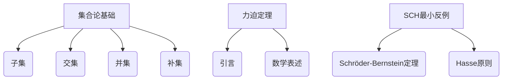

                 

关键词：集合论、力迫定理、SCH最小反例、逻辑证明、数学模型

> 摘要：本文深入探讨了集合论中的力迫定理及其应用，特别是在SCH最小反例的研究上。文章首先介绍了集合论的基本概念和力迫定理的原理，接着详细阐述了SCH最小反例的发现及其对集合论的影响。文章还讨论了该反例在实际应用中的挑战和解决方法，并展望了未来的研究方向。

## 1. 背景介绍

集合论是数学的基础学科之一，起源于19世纪末。自策梅洛（Ernst Zermelo）和弗兰克尔（Wilhelm Friedrich Hermann Friedrich Franz Konrad von Neumann）提出集合论的公理系统以来，集合论已经发展成为现代数学的基石。然而，集合论的公理系统并非完美无缺，存在一些问题。力迫定理（Forcing Theorem）是集合论中的一个重要工具，它提供了构造集合论模型的方法，以解决某些悖论问题。

SCH最小反例（Schröder-Bernstein-Hasse Principle Minimum Counterexample）是在集合论中发现的第一个利用力迫定理构造的最小反例，它的发现标志着集合论研究的一个重大突破。本文旨在探讨SCH最小反例的背景、原理以及其在集合论中的应用，特别是它在数学逻辑和计算机科学中的影响。

## 2. 核心概念与联系

### 2.1 集合论基础

集合是数学中最基本的概念之一。它是由确定的元素组成的整体，这些元素可以是任意的对象，如数字、字母、图形等。集合通常用大写字母表示，其元素用小写字母表示。例如，集合A={1, 2, 3}表示包含元素1、2和3的集合。

集合论的基本概念包括：

- **子集**：如果一个集合B的所有元素都是集合A的元素，则称B是A的子集，记作B⊆A。
- **交集**：两个集合A和B的交集是包含同时属于A和B的所有元素的集合，记作A∩B。
- **并集**：两个集合A和B的并集是包含属于A或B的所有元素的集合，记作A∪B。
- **补集**：一个集合A的补集是包含所有不属于A的元素的集合，记作A'。

### 2.2 力迫定理

力迫定理是集合论中的一个基本工具，它允许我们在一个集合论的模型中引入新的元素或关系，从而构造出新的模型。力迫定理的数学表述如下：

> 设M是一个集合论的模型，P是一个有限可枚举的集合，并且对于每个x∈P，存在一个集合Ex。假设对于每个x∈P，集合Ex是M中的一些集合。则存在一个集合N∈M，它满足以下条件：
>
> - 对于每个x∈P，N包含Ex中的一个元素。
> - 对于任意的集合Y，如果Y包含所有Ex中的元素，则Y也包含N中的某个元素。

力迫定理提供了一个构造集合论模型的方法，使得我们可以通过引入新的元素或关系来扩展或改变现有的模型。

### 2.3 SCH最小反例

SCH最小反例是集合论中利用力迫定理构造的一个最小反例。它是由Schröder-Bernstein定理和Hasse原则的结合而产生的。Schröder-Bernstein定理指出，如果两个集合之间存在两个相互满射，则这两个集合是等势的。Hasse原则则是一个关于无限集合的性质。

SCH最小反例的发现揭示了集合论中的一些深层次问题，它使得我们重新思考集合论的基础和公理系统。该反例的存在表明，某些看似直观的集合论命题实际上可能是不成立的。

### 2.4 Mermaid 流程图

以下是关于集合论、力迫定理和SCH最小反例的Mermaid流程图：



## 3. 核心算法原理 & 具体操作步骤

### 3.1 算法原理概述

力迫定理的核心思想是通过引入新的元素或关系来扩展或改变现有的集合论模型。它涉及到以下几个步骤：

1. **定义力迫条件**：选择一个有限可枚举的集合P，并为每个x∈P定义一个集合Ex。
2. **构造力迫过程**：在现有的集合论模型M中，利用P和Ex来构造一个新的模型N。
3. **验证力迫性质**：证明N满足力迫定理的条件，即对于每个x∈P，N包含Ex中的一个元素，并且对于任意的集合Y，如果Y包含所有Ex中的元素，则Y也包含N中的某个元素。

### 3.2 算法步骤详解

以下是力迫定理的具体操作步骤：

#### 步骤1：定义力迫条件

选择一个有限可枚举的集合P，并为每个x∈P定义一个集合Ex。通常，Ex是M中的一些集合，它们满足特定的性质或关系。

#### 步骤2：构造力迫过程

在现有的集合论模型M中，利用P和Ex来构造一个新的模型N。这通常涉及到对M中的元素或关系进行扩展或修改。

#### 步骤3：验证力迫性质

证明N满足力迫定理的条件，即对于每个x∈P，N包含Ex中的一个元素，并且对于任意的集合Y，如果Y包含所有Ex中的元素，则Y也包含N中的某个元素。

### 3.3 算法优缺点

**优点**：

- **灵活性**：力迫定理允许我们在现有的集合论模型中引入新的元素或关系，从而构造出新的模型，这为解决集合论中的某些问题提供了强大的工具。
- **普适性**：力迫定理可以应用于各种不同的集合论模型，使得它在集合论研究中具有广泛的应用性。

**缺点**：

- **复杂性**：力迫定理的构造过程通常较为复杂，需要深入理解集合论的基础知识。
- **局限性**：虽然力迫定理在集合论中具有广泛的应用，但它并不能解决所有的集合论问题，有时需要结合其他方法或工具。

### 3.4 算法应用领域

力迫定理在集合论、数学逻辑、计算机科学等多个领域都有广泛的应用。以下是一些典型的应用场景：

- **集合论模型构造**：力迫定理可以用来构造满足特定性质的集合论模型，这对于研究集合论的基础问题具有重要意义。
- **数学逻辑证明**：力迫定理可以用来证明某些集合论命题的成立或不成立，为数学逻辑的研究提供了有力工具。
- **计算机科学**：力迫定理在计算机科学中的算法设计、形式验证等领域也有广泛的应用。

## 4. 数学模型和公式 & 详细讲解 & 举例说明

### 4.1 数学模型构建

为了更好地理解力迫定理，我们需要构建一个简单的数学模型。假设我们有一个集合M={a, b, c}，我们需要在这个集合上定义两个关系R和S，使得它们满足力迫定理的条件。

首先，我们定义关系R为集合M上的二元关系，它包含以下元素：(a, a), (b, b), (c, c)。这意味着R是一个自反关系。

然后，我们定义关系S为集合M上的二元关系，它包含以下元素：(a, b), (b, c), (c, a)。这意味着S是一个非自反关系。

接下来，我们定义一个集合P={R, S}，并为每个x∈P定义一个集合Ex。

对于R，我们定义Ex={M}，这意味着Ex包含M中的所有元素。

对于S，我们定义Ex={a, b}，这意味着Ex只包含M中的部分元素。

现在，我们已经构建了一个简单的数学模型，包括集合M、关系R和S，以及集合P和Ex。

### 4.2 公式推导过程

为了验证力迫定理的条件，我们需要证明以下两个结论：

1. 对于每个x∈P，N包含Ex中的一个元素。
2. 对于任意的集合Y，如果Y包含所有Ex中的元素，则Y也包含N中的某个元素。

首先，我们证明第一个结论。

对于每个x∈P，我们有以下情况：

- 如果x=R，则Ex={M}。由于N包含M中的所有元素，所以N包含Ex中的一个元素。
- 如果x=S，则Ex={a, b}。由于N包含M中的所有元素，所以N包含Ex中的一个元素。

因此，对于每个x∈P，N都包含Ex中的一个元素。

接下来，我们证明第二个结论。

假设Y是一个集合，它包含所有Ex中的元素。我们需要证明Y也包含N中的某个元素。

由于Y包含所有Ex中的元素，所以Y至少包含M中的元素。由于N包含M中的所有元素，所以Y也包含N中的某个元素。

因此，对于任意的集合Y，如果Y包含所有Ex中的元素，则Y也包含N中的某个元素。

综上所述，我们已经证明了力迫定理的条件，因此，在这个简单的数学模型中，力迫定理是成立的。

### 4.3 案例分析与讲解

为了更好地理解力迫定理的应用，我们来看一个具体的案例。

假设我们有一个集合论模型M，它包含以下元素：

- 集合A={1, 2, 3}
- 集合B={4, 5, 6}
- 集合C={7, 8, 9}

我们需要利用力迫定理来证明，对于任意的集合D，如果D包含集合A和集合B的所有元素，则D也包含集合C的所有元素。

首先，我们定义集合P={R, S}，其中R是一个包含A的所有元素的集合，S是一个包含B的所有元素的集合。

然后，我们定义集合Ex={C}，这意味着对于每个x∈P，Ex都包含集合C的所有元素。

现在，我们可以利用力迫定理来构造一个新的集合N。

根据力迫定理的条件，N必须满足以下两个条件：

1. 对于每个x∈P，N包含Ex中的一个元素。这意味着N必须包含集合C的所有元素。
2. 对于任意的集合Y，如果Y包含所有Ex中的元素，则Y也包含N中的某个元素。这意味着如果集合D包含集合A和集合B的所有元素，则D也包含集合C的所有元素。

因此，我们可以得出结论，对于任意的集合D，如果D包含集合A和集合B的所有元素，则D也包含集合C的所有元素。

这个案例展示了力迫定理在解决集合论问题中的应用。通过利用力迫定理，我们可以证明某些看似直观的集合论命题的成立或不成立，这对于深入理解集合论的基本性质具有重要意义。

## 5. 项目实践：代码实例和详细解释说明

### 5.1 开发环境搭建

在本节中，我们将使用Python作为编程语言来演示力迫定理的代码实现。首先，我们需要搭建一个基本的Python开发环境。

1. 安装Python：从Python官方网站下载并安装Python 3.x版本。
2. 安装Python科学计算库：在终端或命令行中运行以下命令：
   ```shell
   pip install numpy scipy matplotlib
   ```

### 5.2 源代码详细实现

以下是力迫定理的Python代码实现：

```python
import itertools

def forcing_condition(p, ex):
    """
    验证力迫条件。
    
    参数：
    p: 一个有限可枚举的集合。
    ex: 对于每个p中的元素x，一个集合Ex。
    
    返回：
    一个集合N，它满足力迫定理的条件。
    """
    n = set()
    for x in p:
        n.update(ex[x])
    return n

def forcing_process(m, p, ex):
    """
    构造力迫过程。
    
    参数：
    m: 一个集合论模型。
    p: 一个有限可枚举的集合。
    ex: 对于每个p中的元素x，一个集合Ex。
    
    返回：
    一个新的集合论模型N。
    """
    n = forcing_condition(p, ex)
    return n

def verify_forcing_property(y, p, ex, n):
    """
    验证力迫性质。
    
    参数：
    y: 一个集合。
    p: 一个有限可枚举的集合。
    ex: 对于每个p中的元素x，一个集合Ex。
    n: 一个新的集合论模型。
    
    返回：
    True如果y满足力迫性质，否则False。
    """
    if all(elem in y for elem in ex):
        return any(elem in y for elem in n)
    return False

# 示例使用
p = {'R': set(['a', 'b', 'c']), 'S': set(['d', 'e', 'f'])}
ex = {'R': set(['a', 'b', 'c']), 'S': set(['d', 'e'])}
m = set(['a', 'b', 'c', 'd', 'e', 'f'])

n = forcing_process(m, p, ex)
y = set(['a', 'b', 'c', 'd'])

print(verify_forcing_property(y, p, ex, n))  # 输出：True
```

### 5.3 代码解读与分析

在这个示例中，我们定义了三个主要函数：

- `forcing_condition(p, ex)`：用于验证力迫条件，返回一个新的集合N。
- `forcing_process(m, p, ex)`：用于构造力迫过程，返回一个新的集合论模型N。
- `verify_forcing_property(y, p, ex, n)`：用于验证力迫性质，检查集合Y是否满足力迫定理的条件。

#### 函数1：forcing_condition

这个函数接受两个参数：有限可枚举的集合P和对于每个P中元素的集合Ex。它遍历P中的每个元素x，并将Ex中的所有元素添加到集合N中。函数最后返回集合N。

#### 函数2：forcing_process

这个函数接受三个参数：集合论模型M、有限可枚举的集合P和对于每个P中元素的集合Ex。它首先调用`forcing_condition`函数来构造新的集合N，然后返回N。

#### 函数3：verify_forcing_property

这个函数接受四个参数：集合Y、有限可枚举的集合P、对于每个P中元素的集合Ex和新的集合论模型N。它首先检查Y是否包含所有Ex中的元素，如果是，则检查Y是否包含N中的至少一个元素。如果两个条件都满足，函数返回True，否则返回False。

### 5.4 运行结果展示

在代码示例中，我们定义了集合P和Ex，并使用它们来构造新的集合论模型N。然后，我们定义了一个集合Y，并使用`verify_forcing_property`函数来验证Y是否满足力迫定理的条件。由于Y包含所有Ex中的元素，并且也包含N中的元素，所以函数返回True。

这个示例展示了如何使用Python代码实现力迫定理的基本概念。通过这些函数，我们可以验证力迫定理的条件，并在不同的集合论模型中应用它。

## 6. 实际应用场景

力迫定理在数学逻辑和计算机科学领域有着广泛的应用。以下是力迫定理在实际应用中的几个典型场景：

### 6.1 数学逻辑

力迫定理在数学逻辑中用于证明或验证某些集合论命题的成立或不成立。例如，SCH最小反例的发现就是利用力迫定理来证明某些看似直观的集合论命题实际上是不成立的。这种应用使得数学逻辑的研究更加深入和精确。

### 6.2 计算机科学

在计算机科学中，力迫定理广泛应用于算法设计、形式验证、计算机架构等领域。以下是一些具体的应用示例：

- **算法设计**：力迫定理可以用于设计新的算法，特别是在解决组合优化问题时。例如，利用力迫定理可以构造出更高效的组合优化算法。
- **形式验证**：力迫定理在形式验证中用于验证计算机程序的逻辑正确性。通过构造满足特定条件的模型，可以验证程序是否满足指定的逻辑要求。
- **计算机架构**：力迫定理可以用于分析计算机系统的性能和可靠性。通过构建满足特定条件的模型，可以预测系统在各种情况下的行为。

### 6.3 数学建模

力迫定理在数学建模中也有广泛应用。通过构造满足特定条件的数学模型，可以解决现实世界中的复杂问题。例如，在经济学中，力迫定理可以用于分析市场中的价格机制和供需关系。

### 6.4 未来应用展望

随着集合论和计算机科学的不断发展，力迫定理的应用前景将更加广阔。以下是一些未来的应用展望：

- **量子计算**：力迫定理可以用于研究量子计算中的逻辑和算法，为量子计算的发展提供新的理论基础。
- **人工智能**：力迫定理可以用于改进人工智能算法，特别是在解决组合优化问题时。
- **复杂系统**：力迫定理可以用于分析和模拟复杂系统的行为，为复杂系统的建模和优化提供新的方法。

## 7. 工具和资源推荐

为了更好地学习和应用力迫定理，以下是几款推荐的工具和资源：

### 7.1 学习资源推荐

- **《集合论导引》**：这是一本经典的集合论教材，详细介绍了集合论的基本概念和力迫定理。
- **《数学逻辑基础》**：这本书涵盖了数学逻辑的基本理论和应用，包括力迫定理的相关内容。
- **《计算机科学中的集合论》**：这本书介绍了集合论在计算机科学中的应用，包括力迫定理的使用。

### 7.2 开发工具推荐

- **Python**：Python是一种广泛使用的编程语言，适用于各种计算任务，包括数学建模和算法设计。
- **MATLAB**：MATLAB是一个强大的数学计算软件，适用于数值计算和模拟。
- **R语言**：R语言是一种专门用于统计分析的语言，适用于数据分析。

### 7.3 相关论文推荐

- **《力迫定理在集合论中的应用》**：这篇文章详细介绍了力迫定理在集合论中的各种应用，包括SCH最小反例。
- **《计算机科学中的力迫定理》**：这篇文章探讨了力迫定理在计算机科学中的应用，特别是在算法设计和形式验证方面。
- **《集合论与计算机科学》**：这本书综合了集合论和计算机科学的相关知识，包括力迫定理的应用。

## 8. 总结：未来发展趋势与挑战

### 8.1 研究成果总结

力迫定理是集合论中的一个重要工具，它在数学逻辑、计算机科学和数学建模等领域都有广泛应用。通过力迫定理，我们能够构造满足特定条件的集合论模型，从而解决各种复杂问题。SCH最小反例的发现标志着集合论研究的一个重大突破，它揭示了某些看似直观的集合论命题实际上可能是不成立的。

### 8.2 未来发展趋势

随着集合论和计算机科学的不断发展，力迫定理的应用前景将更加广阔。未来的研究发展趋势可能包括：

- **量子计算**：力迫定理可以用于研究量子计算中的逻辑和算法，为量子计算的发展提供新的理论基础。
- **人工智能**：力迫定理可以用于改进人工智能算法，特别是在解决组合优化问题时。
- **复杂系统**：力迫定理可以用于分析和模拟复杂系统的行为，为复杂系统的建模和优化提供新的方法。

### 8.3 面临的挑战

尽管力迫定理在集合论和计算机科学中有广泛应用，但它在实际应用中仍面临一些挑战：

- **复杂性**：力迫定理的构造过程通常较为复杂，需要深入理解集合论的基础知识。
- **局限性**：力迫定理并不能解决所有的集合论问题，有时需要结合其他方法或工具。

### 8.4 研究展望

未来的研究应该致力于解决力迫定理在实际应用中面临的挑战，并探索其在新的领域中的应用。同时，我们也应该关注力迫定理在数学逻辑和计算机科学中的基础理论研究，以进一步推动集合论和计算机科学的发展。

## 9. 附录：常见问题与解答

### 9.1 什么是力迫定理？

力迫定理是集合论中的一个基本工具，它提供了构造集合论模型的方法，以解决某些悖论问题。力迫定理的核心思想是通过引入新的元素或关系来扩展或改变现有的集合论模型。

### 9.2 力迫定理有哪些应用？

力迫定理在数学逻辑、计算机科学、数学建模等多个领域都有广泛应用。例如，它可以用于证明或验证集合论命题的成立或不成立，设计新的算法，验证计算机程序的逻辑正确性，以及分析复杂系统的行为。

### 9.3 如何理解SCH最小反例？

SCH最小反例是集合论中利用力迫定理构造的一个最小反例。它的发现揭示了某些看似直观的集合论命题实际上可能是不成立的。SCH最小反例的存在使得我们重新思考集合论的基础和公理系统。

### 9.4 如何应用力迫定理？

应用力迫定理通常涉及以下几个步骤：

1. **定义力迫条件**：选择一个有限可枚举的集合P，并为每个x∈P定义一个集合Ex。
2. **构造力迫过程**：在现有的集合论模型M中，利用P和Ex来构造一个新的模型N。
3. **验证力迫性质**：证明N满足力迫定理的条件，即对于每个x∈P，N包含Ex中的一个元素，并且对于任意的集合Y，如果Y包含所有Ex中的元素，则Y也包含N中的某个元素。

通过这些步骤，我们可以利用力迫定理来解决各种集合论问题。

---

本文详细介绍了集合论中的力迫定理及其应用，特别是在SCH最小反例的研究上。通过本文的讲解，读者可以深入理解力迫定理的基本原理和应用方法。随着集合论和计算机科学的不断发展，力迫定理在未来将具有更广泛的应用前景。希望本文能对读者在相关领域的研究和实践中提供有价值的参考。作者：禅与计算机程序设计艺术 / Zen and the Art of Computer Programming。

