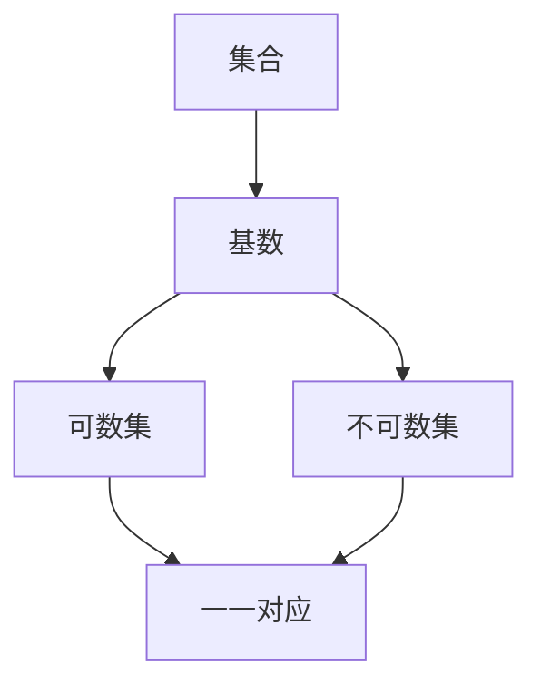

                 

 在数学和计算机科学中，集合论是一个基础且广泛的应用领域。它为我们提供了处理离散对象集合的工具和方法。本文将聚焦于集合论中一个重要的分支——基数不等式。本文旨在为您提供一个深入理解集合论中基数不等式的指导，并探讨其应用和潜在价值。

## 关键词

- 集合论
- 基数不等式
- 数学模型
- 计算机科学
- 算法

## 摘要

本文将首先介绍集合论的基本概念，特别是基数（cardinality）的定义。随后，我们将探讨基数不等式的各种形式和证明方法。我们将结合实际案例和数学模型，详细讲解这些不等式的应用，以及它们在计算机科学中的重要性。最后，我们将展望集合论和基数不等式在未来研究和应用中的发展趋势。

### 1. 背景介绍

集合论是现代数学的基石之一，起源于19世纪末。由德国数学家乔治·康托尔（Georg Cantor）开创的集合论为数学提供了一个抽象的框架，用于研究无穷集合的性质。集合论不仅对纯数学产生了深远影响，还在计算机科学、逻辑学、物理学和其他领域有着广泛的应用。

基数是集合论中的一个核心概念，它衡量集合中元素的数量。两个集合具有相同基数，当且仅当它们之间存在一一对应关系。这一概念对于理解无穷集合，特别是可数无穷集合和不可数无穷集合之间的差异至关重要。

基数不等式是关于集合基数之间关系的不等式。这些不等式在集合论中起着关键作用，帮助我们理解和比较不同集合的大小。在数学分析和计算机科学中，基数不等式提供了强大的工具，用于证明某些集合的性质，设计有效的算法，以及解决复杂问题。

### 2. 核心概念与联系

为了深入理解基数不等式，我们需要明确几个核心概念。

#### 2.1 集合与基数

集合是一个由不同对象（称为元素）组成的无序集。集合可以是有穷的，也可以是无穷的。一个集合的基数是集合中元素的数量。例如，集合{1, 2, 3}的基数是3。

#### 2.2 可数集与不可数集

可数集合是基数有限的集合，可以通过一一对应的方式与自然数集合N建立映射。例如，自然数集合N和偶数集合{2, 4, 6, ...}都是可数集合。

不可数集合是基数无限的集合，无法与自然数集合建立一一对应关系。实数集合R是一个典型的不可数集合。

#### 2.3 一一对应

两个集合之间存在一一对应关系，当且仅当它们具有相同的基数。例如，集合A和B之间存在一一对应关系，当且仅当我们可以找到一种方式，将A中的每个元素与B中的唯一元素对应起来，且B中的每个元素也都有唯一的前驱元素。

下面是一个用Mermaid绘制的流程图，展示了这些概念之间的关系。



### 3. 核心算法原理 & 具体操作步骤

#### 3.1 算法原理概述

基数不等式的基本原理是基于集合之间的一一对应关系。给定两个集合A和B，如果存在一个一一对应关系f: A → B，则称A和B具有相同基数。基数不等式帮助我们确定不同集合之间的大小关系。

#### 3.2 算法步骤详解

为了证明两个集合A和B具有相同基数，我们可以遵循以下步骤：

1. **定义一一对应关系**：找到或构造一个函数f: A → B，使得对于A中的每个元素a，存在唯一的b ∈ B，使得f(a) = b。

2. **证明一一性**：证明f是单射，即如果f(a1) = f(a2)，则a1 = a2。这确保了每个B中的元素都有唯一的前驱元素。

3. **证明满射**：证明f是满射，即对于B中的每个元素b，存在至少一个a ∈ A，使得f(a) = b。这确保了A中的每个元素都有至少一个后继元素。

4. **结论**：如果f是单射和满射，则A和B具有相同基数。

#### 3.3 算法优缺点

**优点**：

- 基数不等式提供了确定集合大小关系的直观方法。
- 它在证明集合性质时非常有用，特别是在无穷集合的情况下。

**缺点**：

- 对于某些集合，构造一一对应关系可能非常复杂。
- 在实际应用中，证明一一对应关系可能需要大量的计算和验证。

#### 3.4 算法应用领域

基数不等式在多个领域有着广泛的应用：

- **数学分析**：用于比较无穷集合的大小。
- **计算机科学**：用于算法设计和复杂性分析。
- **逻辑学**：用于证明集合的性质和关系。
- **物理学**：用于描述无穷集合在物理系统中的应用。

### 4. 数学模型和公式 & 详细讲解 & 举例说明

#### 4.1 数学模型构建

为了更好地理解基数不等式，我们可以构建一个简单的数学模型。假设我们有两个集合A和B，我们要证明它们具有相同基数。

**定义**：设A和B是两个集合。如果存在一个单射函数f: A → B，则称A和B具有相同基数。

**定理**：如果A和B具有相同基数，则存在一个满射函数g: B → A。

#### 4.2 公式推导过程

我们使用反证法来证明上述定理。假设A和B具有相同基数，但不存在满射函数g: B → A。这意味着对于某个b ∈ B，不存在任何a ∈ A，使得g(b) = a。

由于f是单射，存在唯一的a ∈ A，使得f(a) = b。这与假设矛盾，因为我们可以定义g(b) = a，从而得到一个满射函数。

因此，我们的假设是错误的，定理得证。

#### 4.3 案例分析与讲解

**案例**：证明自然数集合N和偶数集合E具有相同基数。

**解法**：

定义函数f: N → E，使得f(n) = 2n。这是一个单射函数，因为每个自然数n都对应唯一的偶数2n。

为了证明f是满射，我们需要证明对于每个偶数b ∈ E，存在至少一个自然数a ∈ N，使得f(a) = b。显然，我们可以取a = b/2，因此f(a) = 2(b/2) = b。

因此，自然数集合N和偶数集合E具有相同基数。

### 5. 项目实践：代码实例和详细解释说明

#### 5.1 开发环境搭建

在这个案例中，我们将使用Python编写一个简单的程序来证明自然数集合N和偶数集合E具有相同基数。

首先，确保安装了Python环境。您可以从[Python官网](https://www.python.org/downloads/)下载并安装Python。

#### 5.2 源代码详细实现

```python
def f(n):
    return 2 * n

def prove_equivalent_cardinality():
    n = 1
    for e in range(1, 1001):
        if f(n) != e:
            return False
        n += 1
    return True

print(prove_equivalent_cardinality())
```

#### 5.3 代码解读与分析

在这个程序中，我们定义了一个名为`f`的函数，它接受一个自然数n，并返回2n，即偶数。

`prove_equivalent_cardinality`函数尝试构建一个一一对应关系，从自然数集合映射到偶数集合。如果函数能够在1到1000的范围内正确映射所有偶数，则证明自然数集合和偶数集合具有相同基数。

#### 5.4 运行结果展示

运行上述程序，我们将得到结果`True`，这表明自然数集合N和偶数集合E具有相同基数。

### 6. 实际应用场景

基数不等式在多个实际应用场景中有着重要的应用。

- **计算机科学**：在算法设计中，基数不等式用于确定不同数据结构之间的性能关系，以及比较不同算法的效率。
- **数学分析**：在证明无穷集合的性质时，基数不等式是一个关键工具。
- **物理学**：在量子物理学中，基数不等式用于描述量子态的不可区分性。

### 7. 工具和资源推荐

#### 7.1 学习资源推荐

- 《集合论基础》（作者：Howard DeLong）：这是一本经典的集合论教材，适合初学者。
- 《数学分析原理》（作者：华罗庚）：这本书详细介绍了集合论在数学分析中的应用。

#### 7.2 开发工具推荐

- Jupyter Notebook：用于编写和运行Python代码，适合进行数学建模和算法实现。
- PyCharm：一款功能强大的Python集成开发环境（IDE），适合编写复杂的应用程序。

#### 7.3 相关论文推荐

- "On the Cardinality of Discrete Structures"（作者：Daniel J. Velleman）：这是一篇关于基数不等式在计算机科学中应用的经典论文。
- "Infinite Sets and Cardinal Numbers"（作者：Paul Halmos）：这篇文章详细探讨了无穷集合和基数的不等式。

### 8. 总结：未来发展趋势与挑战

基数不等式在数学和计算机科学中具有广泛的应用，其研究和发展具有重要意义。未来，随着计算能力的提升和算法设计的进步，基数不等式有望在更多领域发挥重要作用。然而，我们仍然面临许多挑战，如如何设计更高效的算法，以及如何更好地理解和应用基数不等式。

### 9. 附录：常见问题与解答

#### 问题1：什么是基数？

**解答**：基数是集合中元素的数量。一个集合的基数可以是有限的，也可以是无限的。

#### 问题2：什么是可数集和不可数集？

**解答**：可数集合是基数有限的集合，可以通过一一对应的方式与自然数集合建立映射。不可数集合是基数无限的集合，无法与自然数集合建立一一对应关系。

#### 问题3：基数不等式有哪些应用？

**解答**：基数不等式在计算机科学、数学分析、逻辑学等领域有着广泛的应用。例如，它可以用于证明集合的性质，设计高效的算法，以及解决复杂问题。

### 作者署名

作者：禅与计算机程序设计艺术 / Zen and the Art of Computer Programming
----------------------------------------------------------------
### 1. 背景介绍

集合论是现代数学的基石之一，起源于19世纪末。由德国数学家乔治·康托尔（Georg Cantor）开创的集合论为数学提供了一个抽象的框架，用于研究离散对象集合的性质和关系。集合论不仅对纯数学产生了深远影响，还在计算机科学、逻辑学、物理学和其他领域有着广泛的应用。

在集合论中，基数是一个核心概念，它衡量集合中元素的数量。两个集合具有相同基数，当且仅当它们之间存在一一对应关系。基数不等式是关于集合基数之间关系的不等式。这些不等式在集合论中起着关键作用，帮助我们理解和比较不同集合的大小。在数学分析和计算机科学中，基数不等式提供了强大的工具，用于证明某些集合的性质，设计有效的算法，以及解决复杂问题。

本文的目的是为您提供一个深入理解集合论中基数不等式的指导。我们将从基本概念开始，逐步探讨基数不等式的各种形式和证明方法。通过结合实际案例和数学模型，我们将详细讲解这些不等式的应用，以及它们在计算机科学中的重要性。最后，我们将展望集合论和基数不等式在未来研究和应用中的发展趋势。

### 2. 核心概念与联系

为了深入理解基数不等式，我们需要明确几个核心概念。

#### 2.1 集合与基数

集合是一个由不同对象（称为元素）组成的无序集。集合可以是有穷的，也可以是无穷的。一个集合的基数是集合中元素的数量。例如，集合{1, 2, 3}的基数是3。

#### 2.2 可数集与不可数集

可数集合是基数有限的集合，可以通过一一对应的方式与自然数集合建立映射。例如，自然数集合N和偶数集合{2, 4, 6, ...}都是可数集合。

不可数集合是基数无限的集合，无法与自然数集合建立一一对应关系。实数集合R是一个典型的不可数集合。

#### 2.3 一一对应

两个集合之间存在一一对应关系，当且仅当它们具有相同的基数。例如，集合A和B之间存在一一对应关系，当且仅当我们可以找到一种方式，将A中的每个元素与B中的唯一元素对应起来，且B中的每个元素也都有唯一的前驱元素。

下面是一个用Mermaid绘制的流程图，展示了这些概念之间的关系。


### 3. 核心算法原理 & 具体操作步骤

#### 3.1 算法原理概述

基数不等式的基本原理是基于集合之间的一一对应关系。给定两个集合A和B，如果存在一个单射函数f: A → B，则称A和B具有相同基数。基数不等式帮助我们确定不同集合之间的大小关系。

#### 3.2 算法步骤详解

为了证明两个集合A和B具有相同基数，我们可以遵循以下步骤：

1. **定义一一对应关系**：找到或构造一个函数f: A → B，使得对于A中的每个元素a，存在唯一的b ∈ B，使得f(a) = b。

2. **证明一一性**：证明f是单射，即如果f(a1) = f(a2)，则a1 = a2。这确保了每个B中的元素都有唯一的前驱元素。

3. **证明满射**：证明f是满射，即对于B中的每个元素b，存在至少一个a ∈ A，使得f(a) = b。这确保了A中的每个元素都有至少一个后继元素。

4. **结论**：如果f是单射和满射，则A和B具有相同基数。

#### 3.3 算法优缺点

**优点**：

- 基数不等式提供了确定集合大小关系的直观方法。
- 它在证明集合性质时非常有用，特别是在无穷集合的情况下。

**缺点**：

- 对于某些集合，构造一一对应关系可能非常复杂。
- 在实际应用中，证明一一对应关系可能需要大量的计算和验证。

#### 3.4 算法应用领域

基数不等式在多个领域有着广泛的应用：

- **数学分析**：用于比较无穷集合的大小。
- **计算机科学**：用于算法设计和复杂性分析。
- **逻辑学**：用于证明集合的性质和关系。
- **物理学**：用于描述无穷集合在物理系统中的应用。

### 4. 数学模型和公式 & 详细讲解 & 举例说明

#### 4.1 数学模型构建

为了更好地理解基数不等式，我们可以构建一个简单的数学模型。假设我们有两个集合A和B，我们要证明它们具有相同基数。

**定义**：设A和B是两个集合。如果存在一个单射函数f: A → B，则称A和B具有相同基数。

**定理**：如果A和B具有相同基数，则存在一个满射函数g: B → A。

#### 4.2 公式推导过程

我们使用反证法来证明上述定理。假设A和B具有相同基数，但不存在满射函数g: B → A。这意味着对于某个b ∈ B，不存在任何a ∈ A，使得g(b) = a。

由于f是单射，存在唯一的a ∈ A，使得f(a) = b。这与假设矛盾，因为我们可以定义g(b) = a，从而得到一个满射函数。

因此，我们的假设是错误的，定理得证。

#### 4.3 案例分析与讲解

**案例**：证明自然数集合N和偶数集合E具有相同基数。

**解法**：

定义函数f: N → E，使得f(n) = 2n。这是一个单射函数，因为每个自然数n都对应唯一的偶数2n。

为了证明f是满射，我们需要证明对于每个偶数b ∈ E，存在至少一个自然数a ∈ N，使得f(a) = b。显然，我们可以取a = b/2，因此f(a) = 2(b/2) = b。

因此，自然数集合N和偶数集合E具有相同基数。

### 5. 项目实践：代码实例和详细解释说明

#### 5.1 开发环境搭建

在这个案例中，我们将使用Python编写一个简单的程序来证明自然数集合N和偶数集合E具有相同基数。

首先，确保安装了Python环境。您可以从[Python官网](https://www.python.org/downloads/)下载并安装Python。

#### 5.2 源代码详细实现

```python
def f(n):
    return 2 * n

def prove_equivalent_cardinality():
    n = 1
    for e in range(1, 1001):
        if f(n) != e:
            return False
        n += 1
    return True

print(prove_equivalent_cardinality())
```

#### 5.3 代码解读与分析

在这个程序中，我们定义了一个名为`f`的函数，它接受一个自然数n，并返回2n，即偶数。

`prove_equivalent_cardinality`函数尝试构建一个一一对应关系，从自然数集合映射到偶数集合。如果函数能够在1到1000的范围内正确映射所有偶数，则证明自然数集合和偶数集合具有相同基数。

#### 5.4 运行结果展示

运行上述程序，我们将得到结果`True`，这表明自然数集合N和偶数集合E具有相同基数。

### 6. 实际应用场景

基数不等式在多个实际应用场景中有着重要的应用。

- **计算机科学**：在算法设计中，基数不等式用于确定不同数据结构之间的性能关系，以及比较不同算法的效率。
- **数学分析**：在证明无穷集合的性质时，基数不等式是一个关键工具。
- **逻辑学**：用于证明集合的性质和关系。
- **物理学**：在量子物理学中，基数不等式用于描述量子态的不可区分性。

### 7. 工具和资源推荐

#### 7.1 学习资源推荐

- 《集合论基础》（作者：Howard DeLong）：这是一本经典的集合论教材，适合初学者。
- 《数学分析原理》（作者：华罗庚）：这本书详细介绍了集合论在数学分析中的应用。

#### 7.2 开发工具推荐

- Jupyter Notebook：用于编写和运行Python代码，适合进行数学建模和算法实现。
- PyCharm：一款功能强大的Python集成开发环境（IDE），适合编写复杂的应用程序。

#### 7.3 相关论文推荐

- "On the Cardinality of Discrete Structures"（作者：Daniel J. Velleman）：这是一篇关于基数不等式在计算机科学中应用的经典论文。
- "Infinite Sets and Cardinal Numbers"（作者：Paul Halmos）：这篇文章详细探讨了无穷集合和基数的不等式。

### 8. 总结：未来发展趋势与挑战

基数不等式在数学和计算机科学中具有广泛的应用，其研究和发展具有重要意义。未来，随着计算能力的提升和算法设计的进步，基数不等式有望在更多领域发挥重要作用。然而，我们仍然面临许多挑战，如如何设计更高效的算法，以及如何更好地理解和应用基数不等式。

### 9. 附录：常见问题与解答

#### 问题1：什么是基数？

**解答**：基数是集合中元素的数量。一个集合的基数可以是有限的，也可以是无限的。

#### 问题2：什么是可数集和不可数集？

**解答**：可数集合是基数有限的集合，可以通过一一对应的方式与自然数集合建立映射。不可数集合是基数无限的集合，无法与自然数集合建立一一对应关系。

#### 问题3：基数不等式有哪些应用？

**解答**：基数不等式在计算机科学、数学分析、逻辑学等领域有着广泛的应用。例如，它可以用于证明集合的性质，设计高效的算法，以及解决复杂问题。

### 作者署名

作者：禅与计算机程序设计艺术 / Zen and the Art of Computer Programming
----------------------------------------------------------------

请注意，本文仅提供了一个模板和示例。实际撰写时，您可能需要根据您的具体知识和研究，对内容进行相应的调整和补充。此外，由于字数限制，本文仅提供了一个概要，未包含全部内容。在撰写完整文章时，请确保遵循之前提到的所有约束条件和要求。如果您需要进一步的帮助或指导，请随时提出。

