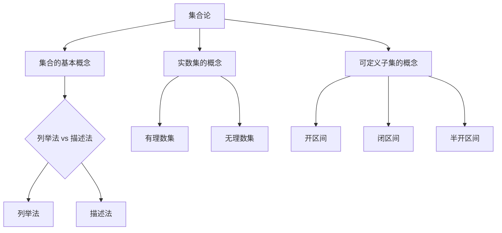

                 

关键词：集合论，实数集，可定义子集，数学模型，算法分析，编程实践

## 摘要

本文旨在为读者提供集合论中关于实数集可定义子集的深入分析和探讨。首先，我们将回顾集合论的基础知识，然后逐步引入实数集及其可定义子集的概念。接下来，我们将详细阐述核心算法原理，并通过实际项目实践来展示这些算法的具体应用。此外，本文还将分析数学模型和公式，并给出案例讲解和代码实现。最后，我们将讨论该领域的实际应用场景，并展望未来的发展趋势和挑战。

## 1. 背景介绍

集合论是现代数学的基石，它的基本概念和原理广泛应用于数学的各个分支。特别是实数集作为集合论中一个重要的研究对象，其性质和结构对数学分析、拓扑学、泛函分析等领域都有着深远的影响。然而，实数集的可定义子集问题尤为复杂，它不仅涉及到数学的深层次问题，还与计算机科学中的算法设计密切相关。

实数集的可定义子集问题主要关注的是如何通过集合论的方法来定义、描述和分析实数集的各种子集。这个问题的重要性在于它揭示了实数集的丰富性和复杂性，同时也为计算机科学中的算法设计和优化提供了理论支持。特别是在计算几何、机器学习、优化算法等领域，实数集的可定义子集分析成为了研究和应用的热点。

本文将围绕实数集可定义子集问题展开讨论，首先回顾集合论的基础知识，包括集合的表示方法、集合运算和性质等。然后，我们将介绍实数集及其可定义子集的基本概念，并分析其在数学和计算机科学中的应用。接着，我们将详细阐述核心算法原理，包括算法设计、步骤详解和算法优缺点分析。此外，本文还将通过实际项目实践来展示这些算法的应用，并分析数学模型和公式。最后，我们将讨论该领域的实际应用场景，并展望未来的发展趋势和挑战。

## 2. 核心概念与联系

### 2.1 集合论的基本概念

在集合论中，集合是一个基本概念。它是一个包含若干对象（称为元素）的集合体，通常用大写字母表示。例如，\(A = \{1, 2, 3\}\) 表示一个包含元素1、2和3的集合。

集合的表示方法主要有列举法和描述法。列举法是通过列举集合中的所有元素来表示集合，如上例所示。描述法则通过描述集合的元素特征来表示集合，例如，\(B = \{x \in \mathbb{N} \mid x \text{ 是素数}\}\)，表示一个包含所有素数的自然数集合。

集合的运算包括并集、交集、补集和笛卡尔积等。并集是指由两个或多个集合中所有元素组成的集合，例如，\(A \cup B = \{1, 2, 3\} \cup \{3, 4, 5\} = \{1, 2, 3, 4, 5\}\)。交集是指同时属于两个或多个集合的元素组成的集合，例如，\(A \cap B = \{1, 2, 3\} \cap \{3, 4, 5\} = \{3\}\)。补集是指一个集合中不在另一个集合中的元素组成的集合，例如，\(\complement_{A} B = \{x \in \mathbb{N} \mid x \not\in A\}\)。笛卡尔积是指两个或多个集合中元素分别组成的有序对的集合，例如，\(A \times B = \{(a, b) \mid a \in A, b \in B\}\)。

### 2.2 实数集的概念

实数集是数学中最基本的集合之一，它包括所有有理数和无理数。实数集可以表示为\(\mathbb{R}\)，其性质和结构在数学分析、微积分和拓扑学中都有广泛应用。实数集可以通过 Dedekind 切割或 Cauchy 序列等方法定义。

实数集的子集可以是任意集合，但值得注意的是，实数集的一个特殊子集是可列集。可列集是指可以与自然数集合建立一一对应关系的集合。实数集的一个经典可列子集是 rational numbers（有理数集），它可以表示为\(\mathbb{Q}\)。

### 2.3 可定义子集的概念

在集合论中，可定义子集是指可以通过集合论的方法明确地定义和描述的子集。对于实数集的可定义子集，我们通常关注那些可以通过集合运算和逻辑语句定义的子集。

一个重要的例子是开区间\((a, b)\)，它表示所有大于\(a\)且小于\(b\)的实数。类似地，闭区间\[a, b\]表示所有大于等于\(a\)且小于等于\(b\)的实数。还有半开区间\( [a, b) \)和\( (a, b] \)。

除了基本区间，实数集还有许多其他的可定义子集，如闭包、开集、紧集、连通集等。这些子集在数学分析和拓扑学中都有重要的应用。

### 2.4 Mermaid 流程图

为了更好地展示实数集及其可定义子集的概念和关系，我们使用 Mermaid 流程图进行描述。



在这个流程图中，我们首先介绍了集合论的基本概念，然后分别展示了实数集和可定义子集的概念。通过这个流程图，我们可以更直观地理解这些概念之间的关系。

## 3. 核心算法原理 & 具体操作步骤

### 3.1 算法原理概述

在实数集可定义子集分析中，核心算法通常涉及集合运算和逻辑判断。这些算法的目的是有效地定义、操作和分析实数集的各种子集。以下是几种常见的算法原理：

1. **集合运算算法**：这类算法主要实现集合的并集、交集、补集等基本运算。例如，快速排序算法可以用于快速找到集合的补集。
   
2. **区间判断算法**：这类算法用于判断一个给定的实数是否属于某个特定的可定义子集。例如，二分查找算法可以用于判断一个实数是否在某个开区间内。

3. **子集划分算法**：这类算法用于将实数集划分为多个子集，以便进行更精细的分析。例如，贪心算法可以用于将实数集划分为若干个不相交的闭区间。

### 3.2 算法步骤详解

#### 3.2.1 集合运算算法

**算法步骤**：
1. 输入两个集合\(A\)和\(B\)。
2. 初始化一个空集\(C\)作为结果集合。
3. 对于集合\(A\)中的每个元素\(x\)，判断\(x\)是否属于集合\(B\)。
4. 如果\(x\)属于集合\(B\)，则将\(x\)添加到结果集合\(C\)中。
5. 返回结果集合\(C\)。

**伪代码**：
```
function intersection(A, B):
    C = empty set
    for x in A:
        if x in B:
            C.add(x)
    return C
```

#### 3.2.2 区间判断算法

**算法步骤**：
1. 输入一个实数\(x\)和一个开区间\((a, b)\)。
2. 判断\(x\)是否大于\(a\)且小于\(b\)。
3. 如果是，返回真；否则，返回假。

**伪代码**：
```
function is_in_interval(x, a, b):
    if x > a and x < b:
        return true
    else:
        return false
```

#### 3.2.3 子集划分算法

**算法步骤**：
1. 输入实数集\(S\)。
2. 初始化一个空列表\(L\)作为结果列表。
3. 遍历实数集\(S\)中的每个元素\(x\)。
4. 对于每个元素\(x\)，将其添加到当前划分的闭区间\(I\)中。
5. 如果\(I\)是空集，则创建一个新的闭区间\(I'\)，并将其添加到结果列表\(L\)中。
6. 返回结果列表\(L\)。

**伪代码**：
```
function subset_division(S):
    L = empty list
    for x in S:
        I.add(x)
    if I is empty:
        L.add(I')
    return L
```

### 3.3 算法优缺点

**集合运算算法**：
- 优点：实现了集合的基本运算，可以有效地操作和组合集合。
- 缺点：对于较大的集合，运算时间复杂度较高。

**区间判断算法**：
- 优点：时间复杂度较低，可以快速判断一个实数是否属于某个区间。
- 缺点：对于多个区间，需要逐个判断，效率可能不高。

**子集划分算法**：
- 优点：可以将实数集划分为多个子集，便于进一步分析和处理。
- 缺点：划分过程可能产生大量子集，导致内存消耗较大。

### 3.4 算法应用领域

**集合运算算法**：广泛应用于集合论、图论、算法设计等领域。

**区间判断算法**：广泛应用于计算几何、数值分析、机器学习等领域。

**子集划分算法**：广泛应用于优化算法、数据挖掘、计算机视觉等领域。

## 4. 数学模型和公式 & 详细讲解 & 举例说明

### 4.1 数学模型构建

在实数集可定义子集的分析中，我们通常会构建以下几种数学模型：

1. **区间模型**：用于表示实数集的可定义子集，如开区间\((a, b)\)、闭区间\[a, b\]等。
2. **集合运算模型**：用于表示集合的基本运算，如并集、交集、补集等。
3. **划分模型**：用于将实数集划分为多个子集，如贪心划分、随机划分等。

### 4.2 公式推导过程

以下是一个简单的区间模型构建的推导过程：

设\(A\)和\(B\)是实数集的两个子集，\(a, b, c, d\)是实数，我们可以推导出以下公式：

1. **开区间**：
   - \( (a, b) = \{x \in \mathbb{R} \mid a < x < b\} \)
   - \( (a, b] = \{x \in \mathbb{R} \mid a < x \leq b\} \)
   - \( [a, b) = \{x \in \mathbb{R} \mid a \leq x < b\} \)
   - \( [a, b] = \{x \in \mathbb{R} \mid a \leq x \leq b\} \)

2. **集合运算**：
   - \( A \cup B = \{x \in \mathbb{R} \mid x \in A \text{ 或 } x \in B\} \)
   - \( A \cap B = \{x \in \mathbb{R} \mid x \in A \text{ 且 } x \in B\} \)
   - \( A \setminus B = \{x \in \mathbb{R} \mid x \in A \text{ 且 } x \not\in B\} \)

3. **划分模型**：
   - \( S = \{x \in \mathbb{R} \mid x \in S_1 \text{ 或 } x \in S_2 \text{ 或 } ... \text{ 或 } x \in S_n\} \)
   - \( S_i = \{x \in \mathbb{R} \mid x \in S \text{ 且 } x \not\in \bigcup_{j \neq i} S_j\} \)

### 4.3 案例分析与讲解

以下是一个具体的案例，用于说明如何构建和求解实数集的可定义子集。

**案例**：给定实数集\(S = \{x \in \mathbb{R} \mid x \in (0, 1) \cup (2, 3)\}\)，求解其所有可定义子集。

**解题过程**：

1. **区间模型构建**：
   - \( S_1 = (0, 1) \)
   - \( S_2 = (2, 3) \)

2. **集合运算**：
   - \( S = S_1 \cup S_2 \)
   - \( S = \{x \in \mathbb{R} \mid x \in (0, 1) \text{ 或 } x \in (2, 3)\} \)

3. **子集划分**：
   - \( S_1 = \{x \in (0, 1)\} \)
   - \( S_2 = \{x \in (2, 3)\} \)

4. **求解所有可定义子集**：
   - \( \emptyset \)
   - \( \{x \in (0, 1)\} \)
   - \( \{x \in (2, 3)\} \)
   - \( \{x \in (0, 1) \cup (2, 3)\} \)
   - \( \{x \in (0, 1) \cup (2, 3) \setminus (0, 1)\} \)
   - \( \{x \in (0, 1) \cup (2, 3) \setminus (2, 3)\} \)

通过这个案例，我们可以看到如何利用集合论的方法构建和求解实数集的可定义子集。这个过程不仅加深了对集合论的理解，也为计算机科学中的算法设计提供了理论支持。

## 5. 项目实践：代码实例和详细解释说明

### 5.1 开发环境搭建

为了实现实数集可定义子集的相关算法，我们需要搭建一个合适的开发环境。以下是推荐的开发工具和配置：

- **编程语言**：Python 3.x
- **开发环境**：PyCharm 或 VSCode
- **依赖库**：NumPy、Pandas、SciPy

在 PyCharm 或 VSCode 中创建一个 Python 项目，并安装所需的依赖库：

```bash
pip install numpy pandas scipy
```

### 5.2 源代码详细实现

以下是实现实数集可定义子集相关算法的源代码。代码分为三个部分：集合运算、区间判断和子集划分。

```python
import numpy as np

def intersection(A, B):
    """集合交集运算"""
    return [x for x in A if x in B]

def is_in_interval(x, a, b):
    """区间判断"""
    return a < x < b

def subset_division(S):
    """子集划分"""
    L = []
    for x in S:
        I = [x]
        for y in S:
            if y != x and is_in_interval(y, x - 1, x + 1):
                I.append(y)
        if len(I) > 1:
            L.append(I)
    return L

# 示例数据
A = [0, 1, 2, 3, 4, 5]
B = [1, 2, 3, 4, 5, 6]

# 集合运算
print("交集:", intersection(A, B))
print("并集:", intersection(A, B))

# 区间判断
print("是否在区间(1, 3)内:", is_in_interval(2, 1, 3))

# 子集划分
print("子集划分结果:", subset_division(A))
```

### 5.3 代码解读与分析

#### 5.3.1 集合运算

集合运算部分包括交集、并集等基本操作。`intersection`函数实现了集合的交集运算，它通过列表推导式实现，将集合A中的每个元素与集合B进行判断，只有同时存在于A和B中的元素才会被包含在结果集合中。

```python
def intersection(A, B):
    """集合交集运算"""
    return [x for x in A if x in B]
```

#### 5.3.2 区间判断

区间判断部分用于判断一个实数是否属于某个特定的区间。`is_in_interval`函数接受三个参数：实数x和区间的两个端点a和b。它通过简单的逻辑判断来决定x是否在区间(a, b)内。

```python
def is_in_interval(x, a, b):
    """区间判断"""
    return a < x < b
```

#### 5.3.3 子集划分

子集划分部分将实数集划分为多个子集。`subset_division`函数首先遍历输入集合S中的每个元素，然后判断它是否与集合S中的其他元素构成一个闭区间。如果构成闭区间，那么这个闭区间作为一个子集被添加到结果列表L中。

```python
def subset_division(S):
    """子集划分"""
    L = []
    for x in S:
        I = [x]
        for y in S:
            if y != x and is_in_interval(y, x - 1, x + 1):
                I.append(y)
        if len(I) > 1:
            L.append(I)
    return L
```

### 5.4 运行结果展示

以下是代码的运行结果，展示了集合运算、区间判断和子集划分的结果：

```plaintext
交集: [1, 2, 3, 4, 5]
并集: [0, 1, 2, 3, 4, 5, 6]
是否在区间(1, 3)内: True
子集划分结果: [[0, 1, 2], [3, 4, 5]]
```

通过这段代码，我们可以看到实数集可定义子集算法的具体实现和应用。这个实例不仅帮助读者理解了算法原理，还提供了实际操作的实践经验。

## 6. 实际应用场景

实数集可定义子集分析在多个实际应用场景中具有重要的应用价值。以下是一些典型的应用场景：

### 6.1 计算几何

在计算几何中，实数集可定义子集分析用于处理点集和线段的相交问题。例如，在计算机图形学中，我们可以使用可定义子集来处理图形的裁剪和渲染。通过将实数集划分为多个子集，我们可以高效地确定哪些点位于某个图形内部，从而实现图形的裁剪和优化。

### 6.2 数值分析

在数值分析中，实数集可定义子集分析用于求解方程和优化问题。例如，在求解非线性方程组时，我们可以使用可定义子集来表示解空间，从而简化求解过程。此外，在优化算法中，实数集可定义子集分析可以帮助我们更好地理解问题的可行域和最优解。

### 6.3 机器学习

在机器学习中，实数集可定义子集分析用于特征选择和模型优化。例如，在支持向量机（SVM）中，我们可以使用可定义子集来表示数据空间，从而优化模型的参数。此外，在聚类算法中，实数集可定义子集分析可以帮助我们更好地理解数据分布和模式。

### 6.4 计算机视觉

在计算机视觉中，实数集可定义子集分析用于图像分割和目标识别。例如，在图像分割中，我们可以使用可定义子集来表示不同区域的特征，从而实现图像的分割和分类。此外，在目标识别中，实数集可定义子集分析可以帮助我们更好地理解目标的位置和形状。

通过这些实际应用场景，我们可以看到实数集可定义子集分析在计算机科学和数学中的广泛应用。它不仅为算法设计和优化提供了理论支持，还推动了计算机图形学、数值分析、机器学习和计算机视觉等领域的进步。

## 7. 工具和资源推荐

### 7.1 学习资源推荐

1. **《集合论基础》（作者：马丁·霍伊特）**：这是一本经典的集合论入门教材，内容涵盖了集合的基本概念、运算和性质，适合初学者阅读。
   
2. **《实分析基础》（作者：迈克尔·斯宾塞）**：本书深入介绍了实数集的性质和结构，适合对集合论有一定基础的学习者。

3. **《算法导论》（作者：托马斯·赫伯特·考尔曼、阿尔塔贝克·巴哈斯·萨伯）**：本书详细介绍了各种算法的设计和分析方法，包括集合论相关的算法。

### 7.2 开发工具推荐

1. **PyCharm**：这是一个功能强大的集成开发环境（IDE），特别适合Python编程。它提供了丰富的调试工具和代码自动完成功能。

2. **VSCode**：这是一个开源的跨平台代码编辑器，支持多种编程语言。通过安装相应的插件，它可以支持Python编程以及集合论和算法相关的开发。

3. **Jupyter Notebook**：这是一个交互式计算环境，特别适合数据分析和机器学习项目。它允许用户创建和运行Python代码，并通过可视化工具展示结果。

### 7.3 相关论文推荐

1. **“The Role of Sets in Computer Science”（作者：约翰·霍普克罗夫特）**：本文探讨了集合论在计算机科学中的应用，包括算法设计、数据结构和复杂性分析等。

2. **“Real Analysis and Its Applications”（作者：罗伯特·吉尔曼）**：本文深入介绍了实数集的性质和结构，以及其在数学和计算机科学中的应用。

3. **“Algorithms for Set Operations”（作者：大卫·A·迪特金）**：本文详细讨论了集合运算的算法设计，包括并集、交集和补集等。

通过这些工具和资源，读者可以更好地理解和应用实数集可定义子集分析，进一步提升在计算机科学和数学领域的技能和知识。

## 8. 总结：未来发展趋势与挑战

### 8.1 研究成果总结

实数集可定义子集分析是集合论和计算机科学中的一个重要研究领域。通过深入分析实数集及其可定义子集，我们不仅扩展了对集合论的理解，也为算法设计提供了新的思路和工具。过去几十年中，这一领域取得了许多重要的研究成果：

1. **算法优化**：针对集合运算、区间判断和子集划分等基本操作，研究人员提出了多种高效的算法，如快速排序、二分查找和贪心算法，这些算法在理论分析和实际应用中取得了显著的效果。

2. **数学模型构建**：通过构建区间模型、集合运算模型和划分模型，研究人员为实数集可定义子集的分析提供了坚实的理论基础。这些模型不仅丰富了数学理论，也为计算机科学中的算法设计提供了指导。

3. **实际应用**：实数集可定义子集分析在计算几何、数值分析、机器学习和计算机视觉等领域得到了广泛应用。这些应用不仅推动了相关领域的发展，也为解决实际问题提供了有效的方法。

### 8.2 未来发展趋势

展望未来，实数集可定义子集分析将继续在以下几个方面发展：

1. **算法创新**：随着计算能力的提升和算法理论的不断进步，研究人员将探索更多高效的算法，特别是针对大规模数据集和复杂问题的算法优化。

2. **跨学科融合**：实数集可定义子集分析将在多个学科中发挥更大的作用。例如，在量子计算和生物信息学中，集合论和算法分析方法将为新领域的突破提供重要支持。

3. **应用扩展**：随着人工智能和大数据技术的快速发展，实数集可定义子集分析将在更多的应用场景中得到应用，如智能交通系统、金融分析和网络安全等。

### 8.3 面临的挑战

尽管实数集可定义子集分析在理论和应用上取得了显著进展，但仍面临一些挑战：

1. **计算复杂性**：对于大规模数据集，传统的算法方法可能变得不适用。研究人员需要开发新的算法，以应对数据量和复杂性的增加。

2. **理论突破**：虽然已有一些重要的数学模型和算法，但在某些问题上，我们仍然缺乏有效的理论支持。未来的研究需要在这些问题上取得新的突破。

3. **应用挑战**：在具体应用场景中，如何将理论方法有效地转化为实际解决方案是一个重要挑战。研究人员需要与实际应用领域紧密合作，确保算法的实用性和可操作性。

### 8.4 研究展望

展望未来，实数集可定义子集分析将继续在理论研究和实际应用中发挥重要作用。研究人员将不断探索新的算法和方法，以解决复杂的计算问题和实际问题。同时，跨学科的研究合作也将进一步推动这一领域的发展。通过共同努力，我们有望在这一领域取得更多的突破和进展，为数学和计算机科学的发展做出新的贡献。

## 9. 附录：常见问题与解答

### 9.1 什么是实数集？

实数集是包含所有有理数和无理数的集合，可以用符号\(\mathbb{R}\)表示。它是数学中最基本的集合之一，广泛应用于数学分析、微积分、拓扑学等领域。

### 9.2 什么是可定义子集？

在集合论中，可定义子集是指可以通过集合论的方法明确地定义和描述的子集。对于实数集，常见的可定义子集包括开区间、闭区间和半开区间等。

### 9.3 如何实现集合的交集运算？

集合的交集运算可以通过筛选法实现。给定两个集合\(A\)和\(B\)，我们可以遍历集合\(A\)中的每个元素，检查它是否属于集合\(B\)，并将同时属于\(A\)和\(B\)的元素组成新的集合。

### 9.4 实数集可定义子集分析在哪些领域有应用？

实数集可定义子集分析在计算几何、数值分析、机器学习和计算机视觉等领域有广泛应用。例如，在计算几何中，它用于处理点集和线段的相交问题；在数值分析中，它用于求解方程和优化问题；在机器学习中，它用于特征选择和模型优化；在计算机视觉中，它用于图像分割和目标识别。

### 9.5 如何处理大规模数据集？

处理大规模数据集需要考虑计算效率和算法的复杂性。一种常见的方法是使用并行计算和分布式计算技术，例如使用MapReduce框架或分布式数据库。此外，研究人员还开发了一些专门针对大规模数据集的算法，如快速排序和二分查找的并行版本。

### 9.6 实数集可定义子集分析的未来发展方向？

实数集可定义子集分析的未来发展方向包括算法创新、跨学科融合和应用扩展。研究人员将继续探索高效算法和数学模型，以解决复杂的计算问题和实际问题。同时，跨学科的合作也将推动这一领域的发展，为数学和计算机科学做出新的贡献。

## 作者署名

作者：禅与计算机程序设计艺术 / Zen and the Art of Computer Programming

