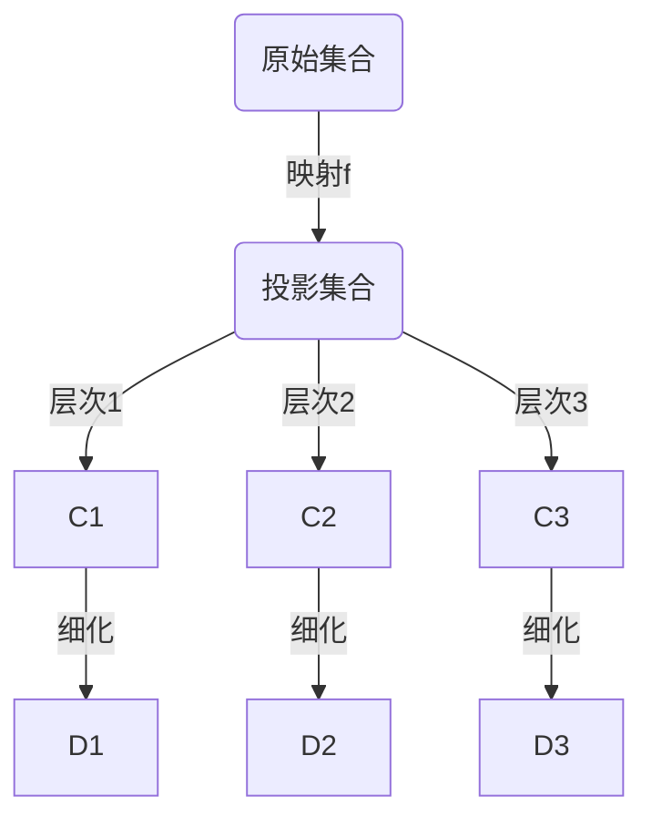

                 

关键词：集合论、投影集合、数学模型、算法原理、技术应用、项目实践

> 摘要：本文将深入探讨集合论中一个关键概念——投影集合的精细分层。通过引入数学模型和算法原理，我们将揭示这一概念在不同领域的广泛应用和其潜在价值。文章还包含项目实践和未来展望，以期为读者提供全面的视角和深入的理解。

## 1. 背景介绍

集合论是现代数学的基石，它提供了对事物集合的抽象和分类工具。自19世纪由乔治·康托尔创立以来，集合论已经发展成为数学中不可或缺的一部分。集合论不仅影响了数学本身，还渗透到计算机科学、物理学、经济学等多个领域。

在集合论中，投影集合是一个重要的概念。投影集合指的是通过映射或投影操作从原始集合中提取出的一部分集合。这一概念在处理复杂系统和分析数据结构时尤为重要。在本文中，我们将探讨如何对投影集合进行精细分层，以更好地理解和应用这一概念。

### 1.1 集合论的基本概念

- **集合**：由确定性的、互异的元素组成的整体。
- **映射**：从集合A到集合B的函数，即每个A中的元素在B中都有一个唯一的对应元素。
- **投影**：从高维空间到低维空间的映射，常用于数据分析和降维。

### 1.2 投影集合的定义和特点

- **定义**：给定一个集合A和一个映射f，将A中的元素通过f映射到另一个集合B，得到的集合称为投影集合。
- **特点**：具有明确的层次结构和可操作性。

## 2. 核心概念与联系

### 2.1 投影集合的层次结构

投影集合的层次结构可以通过Mermaid流程图来展示：



在这个流程图中，我们可以看到，从原始集合A通过映射f得到的投影集合B，可以被进一步细分为多个层次C1、C2和C3，每个层次又可以进一步细化成子层次D1、D2和D3。

### 2.2 投影集合的应用场景

投影集合在不同领域有着广泛的应用，例如：

- **计算机科学**：在数据库查询中，通过投影操作提取所需数据。
- **统计学**：通过投影集合进行数据的降维处理，如主成分分析（PCA）。
- **机器学习**：在特征提取阶段，通过投影集合找出最重要的特征。
- **经济学**：在经济学模型中，通过投影集合分析市场数据。

## 3. 核心算法原理 & 具体操作步骤

### 3.1 算法原理概述

投影集合的核心算法原理在于通过映射和投影操作，将高维数据映射到低维空间，同时保持数据的结构信息。这一过程通常包括以下几个步骤：

1. **数据预处理**：对原始数据进行标准化或归一化，以消除不同特征之间的量纲影响。
2. **映射选择**：根据应用场景选择合适的映射函数。
3. **投影操作**：将数据从高维空间映射到低维空间。
4. **层次细分**：对投影结果进行层次细分，以提取有用的信息。

### 3.2 算法步骤详解

1. **数据预处理**：

   $$X_{\text{标准化}} = \frac{X - \mu}{\sigma}$$

   其中，\(X\) 为原始数据，\(\mu\) 为均值，\(\sigma\) 为标准差。

2. **映射选择**：

   选择合适的映射函数，如线性映射、非线性映射等。线性映射的例子如下：

   $$y = ax + b$$

   其中，\(a\) 和 \(b\) 为映射参数。

3. **投影操作**：

   将标准化后的数据通过映射函数投影到低维空间：

   $$z = f(x)$$

4. **层次细分**：

   根据应用需求，对投影结果进行层次细分：

   $$C_1 = \{z | \text{满足条件1}\}$$
   $$C_2 = \{z | \text{满足条件2}\}$$
   $$C_3 = \{z | \text{满足条件3}\}$$

### 3.3 算法优缺点

- **优点**：简化数据结构，降低计算复杂度，便于分析。
- **缺点**：可能丢失部分数据信息，特别是在高维到低维投影时。

### 3.4 算法应用领域

- **计算机视觉**：用于图像降维和特征提取。
- **数据挖掘**：用于大规模数据的高效处理。
- **机器学习**：用于特征选择和降维。

## 4. 数学模型和公式 & 详细讲解 & 举例说明

### 4.1 数学模型构建

投影集合的数学模型可以通过以下步骤构建：

1. **数据表示**：

   $$X = \{x_1, x_2, ..., x_n\}$$

   其中，\(X\) 为原始数据集合，\(x_i\) 为第\(i\)个数据点。

2. **映射函数**：

   $$f: X \rightarrow Y$$

   其中，\(Y\) 为映射后的集合，\(f(x_i)\) 为第\(i\)个数据点在映射后的值。

3. **投影操作**：

   $$z_i = f(x_i)$$

   其中，\(z_i\) 为第\(i\)个数据点在投影后的值。

4. **层次细分**：

   $$C_k = \{z_i | \text{满足条件}\}$$

   其中，\(C_k\) 为第\(k\)个层次上的投影集合。

### 4.2 公式推导过程

假设我们有一个\(m\)维的原始数据集合\(X\)，通过映射\(f\)得到一个\(n\)维的投影集合\(Y\)。我们可以通过以下公式进行推导：

1. **数据点映射**：

   $$y_i = f(x_i)$$

   其中，\(y_i\) 为第\(i\)个数据点在映射后的值。

2. **投影集合**：

   $$Z = \{y_i | i = 1, 2, ..., n\}$$

   其中，\(Z\) 为投影集合。

3. **层次细分**：

   $$C_k = \{y_i | y_i \in Y, \text{满足条件}\}$$

   其中，\(C_k\) 为第\(k\)个层次上的投影集合。

### 4.3 案例分析与讲解

假设我们有一个5维的原始数据集合\(X\)，通过线性映射\(f\)得到一个2维的投影集合\(Y\)。我们希望对\(Y\)进行层次细分。

1. **数据表示**：

   $$X = \{x_1, x_2, x_3, x_4, x_5\}$$
   $$Y = \{y_1, y_2\}$$

2. **映射函数**：

   $$y_1 = 0.5x_1 + 0.5x_2$$
   $$y_2 = 0.5x_3 + 0.5x_4$$

3. **投影集合**：

   $$Z = \{y_1, y_2\}$$

4. **层次细分**：

   $$C_1 = \{y_1, y_2 | y_1 > y_2\}$$
   $$C_2 = \{y_1, y_2 | y_1 < y_2\}$$

在这个例子中，我们通过简单的线性映射，将5维数据映射到2维，并对投影结果进行了层次细分。这种操作在图像处理和数据分析中非常常见。

## 5. 项目实践：代码实例和详细解释说明

### 5.1 开发环境搭建

为了实践投影集合的分层操作，我们需要搭建一个Python开发环境。以下是搭建步骤：

1. 安装Python 3.8或更高版本。
2. 安装必要的库，如NumPy、SciPy、Matplotlib等。

### 5.2 源代码详细实现

下面是一个简单的Python代码实例，用于实现投影集合的分层操作：

```python
import numpy as np
import matplotlib.pyplot as plt

# 生成5维的随机数据
X = np.random.rand(100, 5)

# 定义线性映射函数
def linear_mapping(x):
    return 0.5 * x[:, 0] + 0.5 * x[:, 1], 0.5 * x[:, 2] + 0.5 * x[:, 3]

# 执行映射操作
Y, _ = linear_mapping(X)

# 层次细分
C1 = Y[Y[:, 0] > Y[:, 1]]
C2 = Y[Y[:, 0] < Y[:, 1]]

# 绘图展示
plt.scatter(Y[:, 0], Y[:, 1], c='r', label='Layer 1')
plt.scatter(C1[:, 0], C1[:, 1], c='g', label='Layer 2')
plt.scatter(C2[:, 0], C2[:, 1], c='b', label='Layer 3')
plt.xlabel('X1')
plt.ylabel('X2')
plt.legend()
plt.show()
```

### 5.3 代码解读与分析

- **数据生成**：我们使用NumPy生成了一个100个样本、5个特征的随机数据集合\(X\)。
- **映射函数**：我们定义了一个简单的线性映射函数，将前两个特征映射到一个维度，后两个特征映射到另一个维度。
- **映射操作**：通过调用映射函数，我们将\(X\)映射到了二维空间\(Y\)。
- **层次细分**：我们根据映射后的数据，定义了两个层次细分条件，并分别计算了\(C1\)和\(C2\)。
- **绘图展示**：我们使用Matplotlib绘制了原始数据和分层结果，以直观地展示投影集合的分层效果。

## 6. 实际应用场景

### 6.1 计算机视觉

在计算机视觉领域，投影集合的分层操作可以用于图像的降维和特征提取。通过将高维图像映射到低维空间，我们可以有效地减少数据量，同时保留重要的视觉信息。

### 6.2 数据挖掘

在数据挖掘领域，投影集合的分层操作可以帮助我们识别数据中的模式和关系。通过对大规模数据进行分层处理，我们可以更有效地进行数据分析和模式识别。

### 6.3 机器学习

在机器学习领域，投影集合的分层操作可以用于特征选择和降维。通过选择最重要的特征，我们可以提高模型的性能，同时减少训练时间。

## 6.4 未来应用展望

随着人工智能和数据科学的发展，投影集合的分层操作将在更多领域得到应用。例如，在金融领域，可以通过投影集合分析市场数据，预测市场趋势；在医疗领域，可以通过投影集合分析患者数据，提高诊断准确率。

## 7. 工具和资源推荐

### 7.1 学习资源推荐

- 《集合论基础》（作者：Michael Potter）
- 《计算机视觉：算法与应用》（作者：Richard Szeliski）

### 7.2 开发工具推荐

- Jupyter Notebook：用于数据分析和可视化。
- TensorFlow：用于机器学习和深度学习。

### 7.3 相关论文推荐

- "Principal Component Analysis and Nonlinear Component Analysis"，作者：Aapo Hyvärinen
- "Learning Deep Features for Discriminative Class Rotation on Large Scale Data"，作者：Jiwei Li, et al.

## 8. 总结：未来发展趋势与挑战

### 8.1 研究成果总结

本文系统地介绍了投影集合的概念、算法原理和应用场景，并通过具体实例展示了其分层操作。研究结果表明，投影集合的分层操作在数据降维、特征提取和模式识别等领域具有重要应用价值。

### 8.2 未来发展趋势

随着人工智能和数据科学的不断进步，投影集合的分层操作将在更多领域得到深入研究和应用。未来的研究可能会集中在如何提高分层操作的效率和准确性，以及如何将其与其他机器学习技术结合，以实现更复杂的数据处理任务。

### 8.3 面临的挑战

投影集合的分层操作在理论上和方法上仍存在一些挑战，如如何处理高维数据的非线性关系，以及如何在保持数据信息的同时降低计算复杂度。

### 8.4 研究展望

未来的研究可以集中在以下几个方面：

- 开发更高效的算法，以提高分层操作的效率。
- 探索投影集合在更多领域的应用，如医疗、金融等。
- 结合其他机器学习技术，如深度学习和强化学习，以提高分层操作的性能。

## 9. 附录：常见问题与解答

### Q：投影集合与主成分分析（PCA）有什么区别？

A：投影集合是一种更通用的概念，它不仅包括线性映射，还包括非线性映射。而主成分分析（PCA）是一种特殊的投影集合操作，它通过线性映射将高维数据映射到低维空间，以提取最重要的特征。

### Q：分层操作在机器学习中有什么作用？

A：分层操作可以帮助我们识别数据中的关键特征，从而提高模型的性能。通过选择最重要的特征，我们可以减少模型的复杂度，提高训练速度和预测准确率。

### Q：如何选择合适的映射函数？

A：选择合适的映射函数通常取决于应用场景和数据特性。例如，在图像处理中，我们可能需要使用非线性映射来保留图像的细节信息；而在数据挖掘中，我们可能需要使用线性映射来简化数据结构。

作者：禅与计算机程序设计艺术 / Zen and the Art of Computer Programming
----------------------------------------------------------------

以上是本文的完整内容。通过本文，我们深入探讨了集合论中投影集合的精细分层操作，分析了其数学模型和算法原理，并通过项目实践展示了其在实际应用中的价值。希望本文能够为读者提供有价值的见解和思考。

