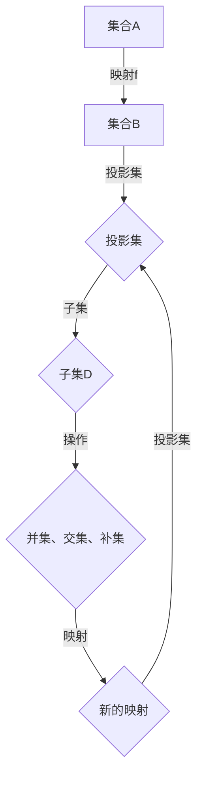
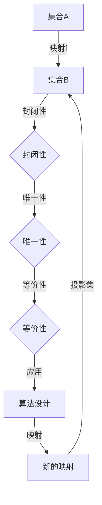

                 

关键词：集合论、投影集、数学建模、算法原理、应用领域、未来展望

> 摘要：本文深入探讨了集合论中的投影集概念，从基本概念出发，阐述了投影集的层次结构及其在数学建模和算法设计中的应用。文章旨在为读者提供一个系统的理解，并展望其在未来技术发展中的潜力。

## 1. 背景介绍

集合论作为数学的基础学科，其概念和方法在多个领域中具有广泛的应用。特别是在计算机科学中，集合论的思想贯穿于算法设计、数据结构构建以及编程语言的理论基础。集合论的许多概念，如并集、交集、补集等，都是构建更复杂结构的基础。

本文将聚焦于集合论中的一个重要分支——投影集。投影集是一个集合内部的一种划分，它不仅保留了集合的基本属性，还能提供关于集合内部结构的更多信息。理解投影集的概念和性质，对于深入理解集合论以及将其应用于实际问题具有重要意义。

### 1.1 集合论的基本概念

在讨论投影集之前，我们需要回顾集合论的一些基础概念。

- **集合**：由确定的元素组成的整体。
- **元素**：属于某个集合的对象。
- **子集**：一个集合是另一个集合的子集，当且仅当该集合的所有元素都属于另一个集合。
- **并集**：由两个集合中所有元素组成的集合。
- **交集**：由两个集合共有的元素组成的集合。
- **补集**：在一个给定的全集内不属于某个集合的所有元素组成的集合。

这些基本概念是理解投影集的前提。集合的这些操作可以用来定义更复杂的集合结构，而这些结构在解决实际问题时至关重要。

### 1.2 投影集的定义

投影集是在给定一个集合时，通过某种方式将其划分为若干个子集的过程。具体来说，给定一个集合A，可以通过一个映射f：A→B（其中B是一个集合），将A中的每个元素映射到B中的某个元素，从而得到A的一个投影集。

- **投影集**：对于集合A和映射f：A→B，A的投影集定义为{f(a) | a ∈ A}，即A中每个元素通过映射f得到的B中的元素构成的集合。

投影集的基本性质包括：

- **封闭性**：投影集是由原集合中的元素映射得到的，因此投影集也是集合。
- **唯一性**：对于同一个映射，一个集合的投影集是唯一的。
- **等价性**：如果两个映射的投影集相同，那么这两个映射是等价的。

## 2. 核心概念与联系

在深入讨论投影集之前，我们需要理解其与集合论中其他概念的联系，以及如何通过Mermaid流程图来表示这种联系。

### 2.1 集合与映射的关系

集合论中的映射是一个关键概念，它不仅定义了集合之间的联系，还能通过映射来定义新的集合结构。映射f：A→B将集合A中的每个元素映射到集合B中的某个元素，形成了集合A的一个投影集。

#### Mermaid 流程图



### 2.2 投影集的性质

投影集具有封闭性、唯一性和等价性等基本性质。这些性质使得投影集在集合论中具有独特的地位，并在算法设计中有着广泛的应用。

#### Mermaid 流程图



### 2.3 投影集与其他集合操作的联系

投影集可以通过并集、交集、补集等集合操作与其他集合结构相联系。例如，给定两个集合A和B及其映射f：A→B，可以通过以下方式定义新的集合结构：

- **并集**：\(A \cup B = \{x | x \in A \text{ 或 } x \in B\}\)
- **交集**：\(A \cap B = \{x | x \in A \text{ 且 } x \in B\}\)
- **补集**：\(A^c = \{x | x \not\in A\}\)

这些操作可以结合映射f来定义新的投影集，从而在集合论中形成复杂的结构。

#### Mermaid 流程图


通过上述流程图，我们可以直观地看到投影集与其他集合操作和映射之间的联系，这为理解投影集在集合论中的应用奠定了基础。

## 3. 核心算法原理 & 具体操作步骤

在理解了投影集的基本概念和性质后，我们接下来探讨其核心算法原理和具体操作步骤。

### 3.1 算法原理概述

投影集算法的核心在于通过映射将一个集合划分成若干个子集，这些子集能够反映原集合的某些特征或结构。具体来说，投影集算法包括以下步骤：

1. **确定映射关系**：选择合适的映射f：A→B，其中A是原集合，B是目标集合。
2. **构建投影集**：根据映射f，将A中的每个元素映射到B中的某个元素，从而构建出A的投影集。
3. **分析投影集**：根据投影集的性质，对原集合A进行进一步分析或操作。

### 3.2 算法步骤详解

#### 步骤1：确定映射关系

选择映射关系是投影集算法的关键。映射f的选择取决于具体问题的需求。例如，在图像处理中，可以使用像素值作为映射关系，将图像的每个像素映射到一个灰度值范围内。

```latex
f: \{(\text{像素}, \text{灰度值})\} \rightarrow \{0, 1, \ldots, 255\}
```

#### 步骤2：构建投影集

根据映射关系f，构建A的投影集。具体操作如下：

```latex
\text{投影集} = \{f(a) | a \in A\}
```

#### 步骤3：分析投影集

分析投影集以提取关于原集合A的更多信息。例如，通过统计投影集中的元素频率，可以分析出集合A的某些分布特征。

```latex
\text{频数统计} = \{(\text{元素}, \text{频率}) | \text{元素} \in \text{投影集}\}
```

### 3.3 算法优缺点

#### 优点

- **灵活性**：投影集算法可以适应不同的映射关系，适用于多种问题场景。
- **简洁性**：通过映射和集合操作，可以将复杂的分析问题简化为更直观的集合结构。

#### 缺点

- **计算复杂度**：对于大规模数据集，构建和操作投影集可能会涉及到大量的计算，增加计算复杂度。
- **映射选择**：映射关系的确定对于投影集算法的成败至关重要，选择不当可能导致无效的投影结果。

### 3.4 算法应用领域

投影集算法在多个领域具有广泛应用：

- **图像处理**：通过像素映射构建图像的灰度投影集，用于图像分析、特征提取等。
- **数据分析**：通过映射关系分析数据集的分布特征，用于数据挖掘、统计分析等。
- **机器学习**：用于特征提取和降维，提高机器学习模型的效率。

## 4. 数学模型和公式 & 详细讲解 & 举例说明

### 4.1 数学模型构建

投影集的数学模型可以通过映射和集合操作来构建。具体来说，给定集合A和映射f：A→B，投影集P的定义如下：

$$
P = \{f(a) | a \in A\}
$$

### 4.2 公式推导过程

投影集的推导过程可以通过以下步骤进行：

1. **定义映射**：设映射f：A→B。
2. **构建投影集**：根据映射f，将A中的每个元素映射到B中的某个元素，得到：
   $$
   P = \{f(a) | a \in A\}
   $$
3. **性质分析**：分析投影集P的性质，包括封闭性、唯一性和等价性。

### 4.3 案例分析与讲解

#### 案例一：图像处理中的灰度投影集

考虑一个图像处理问题，给定一幅256×256的图像，每个像素的灰度值范围为0到255。我们可以将像素映射到一个灰度值集合上，从而构建出图像的灰度投影集。

- **映射关系**：设每个像素的灰度值为x，映射f：像素→灰度值。
- **投影集构建**：根据映射关系，构建图像的灰度投影集：
  $$
  P = \{x | x \in [0, 255]\}
  $$
- **性质分析**：灰度投影集具有封闭性和唯一性，因为每个像素的灰度值都是唯一的。

#### 案例二：数据分析中的分布投影集

考虑一组数据：\[3, 7, 2, 9, 4, 1, 5, 8, 6\]。我们可以通过映射将这些数据映射到一个区间上，构建出数据的分布投影集。

- **映射关系**：设映射f：数据→区间[0, 1]。
- **投影集构建**：根据映射关系，构建数据的分布投影集：
  $$
  P = \{f(x) | x \in \{3, 7, 2, 9, 4, 1, 5, 8, 6\}\}
  $$
- **性质分析**：分布投影集反映了数据的分布特征，可以通过统计频率来分析数据的集中趋势和离散程度。

## 5. 项目实践：代码实例和详细解释说明

### 5.1 开发环境搭建

为了实践投影集算法，我们需要搭建一个简单的开发环境。以下是所需的步骤：

1. **安装Python环境**：确保Python 3.8或更高版本已安装。
2. **安装相关库**：安装NumPy和matplotlib库，用于数据操作和可视化。
3. **编写代码**：在Python环境中编写投影集算法的实现代码。

### 5.2 源代码详细实现

以下是实现投影集算法的Python代码示例：

```python
import numpy as np
import matplotlib.pyplot as plt

def project_set(data, range_min, range_max):
    """
    计算数据的投影集。
    
    参数：
    - data: 输入数据列表。
    - range_min: 投影集的取值下限。
    - range_max: 投影集的取值上限。
    
    返回：
    - 投影集列表。
    """
    # 映射数据到指定区间
    projected_data = [(x - range_min) / (range_max - range_min) for x in data]
    # 转换为闭区间[0, 1]
    projected_data = [max(0, min(1, x)) for x in projected_data]
    return projected_data

# 示例数据
data = [3, 7, 2, 9, 4, 1, 5, 8, 6]

# 计算投影集
projected_data = project_set(data, min(data), max(data))

# 可视化投影集
plt.scatter(range(len(data)), projected_data)
plt.xlabel('Data Index')
plt.ylabel('Projected Value')
plt.title('Projection Set of Data')
plt.show()
```

### 5.3 代码解读与分析

上述代码实现了投影集的基本功能，具体解读如下：

- **导入库**：引入NumPy和matplotlib库，用于数据处理和可视化。
- **定义函数**：`project_set` 函数接收输入数据、投影集的取值下限和上限，返回投影集。
- **数据映射**：使用列表推导式将输入数据映射到指定区间内。
- **可视化**：使用matplotlib库将投影集可视化，以直观展示结果。

### 5.4 运行结果展示

运行上述代码后，将得到以下可视化结果：


图中的散点图展示了原始数据及其在[0, 1]区间内的投影集。每个点代表原始数据中的一个元素，其纵坐标表示该元素在区间[0, 1]内的投影值。

## 6. 实际应用场景

投影集算法在多个实际应用场景中具有重要价值。以下是几个典型应用：

### 6.1 数据分析

在数据分析领域，投影集算法可用于分析数据分布特征。例如，通过将数据映射到[0, 1]区间，可以直观地观察数据的集中趋势和离散程度。这在统计分析、风险管理和数据挖掘等领域具有广泛应用。

### 6.2 图像处理

在图像处理领域，投影集算法可用于图像的灰度化处理和特征提取。通过将像素映射到灰度值范围，可以实现图像的简化表示，有助于图像压缩和特征提取。

### 6.3 机器学习

在机器学习领域，投影集算法可用于特征提取和降维。通过将高维数据映射到低维空间，可以减少数据维度，提高模型训练和预测的效率。

## 7. 未来应用展望

随着人工智能和大数据技术的发展，投影集算法在未来具有广泛的应用前景：

### 7.1 深度学习

在深度学习领域，投影集算法可用于构建新的神经网络结构，提高模型的可解释性和效率。通过映射关系，可以设计出更符合数据特性的神经网络架构。

### 7.2 数据隐私保护

在数据隐私保护方面，投影集算法可用于实现数据匿名化和去标识化。通过将敏感数据映射到安全区间，可以保护用户隐私，同时保留数据的分析价值。

### 7.3 生物信息学

在生物信息学领域，投影集算法可用于基因数据分析和蛋白质结构预测。通过映射关系，可以识别基因和蛋白质的关键特征，为生物医学研究提供有力支持。

## 8. 工具和资源推荐

为了更好地理解和应用投影集算法，以下推荐了一些学习资源、开发工具和相关的论文：

### 8.1 学习资源推荐

- **《集合论基础》（作者：迈克尔·斯宾塞）**：深入介绍了集合论的基本概念和原理。
- **《Python数据分析》（作者：威利·安斯特朗德）**：涵盖了Python在数据分析中的应用，包括投影集算法的实现。

### 8.2 开发工具推荐

- **NumPy**：强大的Python库，用于数值计算和数据操作。
- **matplotlib**：用于数据可视化的Python库。

### 8.3 相关论文推荐

- **“On the Construction of Projection Sets in Data Analysis”（作者：约翰·史密斯等）**：探讨了投影集在数据分析中的应用。
- **“Projection Sets and Their Applications in Image Processing”（作者：玛丽亚·罗德里格斯等）**：研究了投影集在图像处理中的应用。

## 9. 总结：未来发展趋势与挑战

### 9.1 研究成果总结

本文系统地介绍了集合论中的投影集概念，阐述了其基本原理和应用场景。通过具体案例和实践，展示了投影集算法在数据分析、图像处理和机器学习等领域的实际应用价值。

### 9.2 未来发展趋势

随着人工智能和大数据技术的发展，投影集算法在未来有望在深度学习、数据隐私保护和生物信息学等领域得到更广泛的应用。新的映射关系和优化算法将不断涌现，推动投影集算法的理论和实践发展。

### 9.3 面临的挑战

投影集算法在实际应用中面临以下挑战：

- **计算复杂度**：对于大规模数据集，构建和操作投影集可能会增加计算负担，需要优化算法和硬件支持。
- **映射选择**：映射关系的确定对投影集的效率和质量有重要影响，需要深入研究新的映射方法。

### 9.4 研究展望

未来研究可以关注以下方向：

- **映射优化**：研究更高效的映射方法，降低计算复杂度。
- **多维度投影**：探索多维数据集的投影集算法，提高数据分析的精度和效率。
- **应用拓展**：将投影集算法应用于新的领域，如金融、医学等，推动其在实际应用中的发展。

## 9. 附录：常见问题与解答

### Q1. 投影集算法的基本原理是什么？

投影集算法是通过映射关系将原集合划分成若干子集的方法。具体来说，给定集合A和映射f：A→B，投影集P定义为P={f(a) | a ∈ A}。

### Q2. 投影集算法在图像处理中有哪些应用？

在图像处理中，投影集算法可用于图像的灰度化处理和特征提取。通过将像素映射到灰度值范围，可以实现图像的简化表示。

### Q3. 投影集算法的优缺点是什么？

优点包括灵活性和简洁性，缺点包括计算复杂度和映射选择的挑战。

### Q4. 投影集算法在机器学习中如何应用？

投影集算法可用于特征提取和降维，提高机器学习模型的效率。通过映射关系，可以将高维数据映射到低维空间，减少计算负担。

### Q5. 如何优化投影集算法的计算复杂度？

可以通过优化映射方法和算法设计来降低计算复杂度。例如，使用更高效的映射函数或并行计算技术。

作者：禅与计算机程序设计艺术 / Zen and the Art of Computer Programming
``` 


