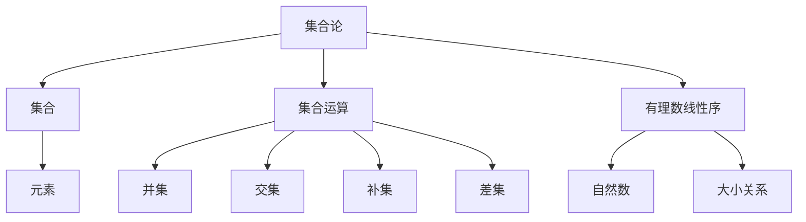

                 

关键词：集合论、有理数、线性序、数学基础、算法原理、应用领域

> 摘要：本文旨在探讨集合论中有关有理数线性序的核心概念和原理，通过对核心算法的深入分析，以及数学模型和具体项目的实践，帮助读者理解有理数线性序的重要性和应用。文章将详细阐述有理数线性序的基本原理、算法实现、数学模型以及未来发展趋势，旨在为读者提供一套完整的学习和实践指南。

## 1. 背景介绍

集合论是现代数学的基石，它是研究集合的性质、集合间的关系以及集合运算的数学分支。集合论的发展可以追溯到19世纪，其创始人包括德国数学家乔治·康托尔（Georg Cantor）。集合论中的许多概念和原理在计算机科学、数学分析、逻辑学等领域都有广泛的应用。

有理数线性序是集合论中的一个重要概念，它描述了有理数之间的大小关系。有理数是可以表示为两个整数的比例的数，包括整数、分数和整数部分为零的无限小数。有理数的线性序研究，不仅有助于理解数学中的基本概念，还为计算机科学中的排序算法、搜索算法等提供了理论基础。

本文将首先介绍集合论和有理数线性序的基本概念，然后深入分析相关的核心算法，最后探讨其在实际应用中的意义和未来发展方向。

## 2. 核心概念与联系

### 2.1 集合论基本概念

在集合论中，集合是指某些确定对象的总体。这些对象被称为集合的元素。集合可以用大写字母如A、B等表示，而集合中的元素用小写字母如a、b等表示。集合可以通过列举法、描述法或集合运算来定义。

- **列举法**：例如，集合A可以表示为A = {1, 2, 3}，其中1、2、3是集合A的元素。
- **描述法**：例如，集合B可以表示为B = {x | x是自然数且x小于5}，即集合B包含所有小于5的自然数。
- **集合运算**：常见的集合运算包括并集、交集、补集和差集。例如，A和B的并集表示为A ∪ B，包含所有属于A或属于B的元素。

### 2.2 有理数线性序

有理数线性序是指有理数之间的大小关系。这种关系可以通过自然数来定义。具体来说，对于任意两个有理数a和b，如果a小于b，则记为a < b；如果a大于b，则记为a > b。有理数的线性序具有以下几个基本性质：

- **传递性**：如果a < b且b < c，则a < c。
- **反身性**：对于任意有理数a，都有a ≤ a。
- **反对称性**：如果a < b，则b ≠ a，且b < a。

### 2.3 Mermaid 流程图

为了更好地理解集合论和有理数线性序的概念，我们使用Mermaid流程图来展示它们之间的联系。



通过这个流程图，我们可以清晰地看到集合论和有理数线性序是如何相互关联的。

## 3. 核心算法原理 & 具体操作步骤

### 3.1 算法原理概述

有理数线性序的核心算法是基于自然数的大小关系来定义的。具体来说，对于任意两个有理数a和b，我们需要将它们分别表示为自然数的形式，然后比较这两个自然数的大小。

例如，假设a = 3/2，b = 2/3，我们可以将a表示为3个自然数1的和，b表示为2个自然数1/2的和。通过比较这两个自然数的和，我们可以得出a和b的大小关系。

### 3.2 算法步骤详解

#### 步骤1：有理数表示为自然数

首先，我们需要将有理数表示为自然数的形式。具体来说，我们可以将有理数a表示为a = n1 + n2 + ... + nn，其中ni是自然数。

例如，对于有理数a = 3/2，我们可以将其表示为a = 1 + 1 + 1。

#### 步骤2：比较自然数大小

接下来，我们需要比较这两个自然数的大小。具体来说，我们可以比较它们的和，如果a的和大于b的和，则a > b；如果a的和小于b的和，则a < b。

例如，对于有理数a = 1 + 1 + 1和b = 1/2 + 1/2，我们可以发现a的和大于b的和，因此a > b。

#### 步骤3：算法优化

在实际应用中，为了提高算法的效率，我们可以对算法进行优化。具体来说，我们可以通过以下方式来优化：

- **去除重复项**：如果有理数a和b的表示中存在相同的自然数，我们可以去除这些重复项，从而简化表示。
- **合并同类项**：如果有理数a和b的表示中存在同类项，我们可以将它们合并，从而简化表示。

通过这些优化措施，我们可以进一步提高算法的效率。

### 3.3 算法优缺点

#### 优点

- **简单易懂**：算法的原理简单，易于理解和实现。
- **高效实用**：通过优化措施，算法在处理大量有理数时具有较高的效率。

#### 缺点

- **计算复杂度较高**：对于某些特殊的有理数，算法的计算复杂度较高。
- **优化空间有限**：虽然可以通过优化措施提高算法的效率，但优化空间有限。

### 3.4 算法应用领域

有理数线性序算法在计算机科学和数学分析中具有广泛的应用。具体来说，它可以用于以下领域：

- **排序算法**：用于对有理数进行排序。
- **搜索算法**：用于在有理数集合中查找特定元素。
- **数学证明**：用于证明数学定理。

## 4. 数学模型和公式 & 详细讲解 & 举例说明

### 4.1 数学模型构建

在集合论中，有理数的线性序可以通过构造一个自然数的集合来表示。具体来说，我们可以将有理数a表示为自然数n1、n2、...、nn的和，即a = n1 + n2 + ... + nn。

例如，对于有理数a = 3/2，我们可以将其表示为a = 1 + 1 + 1。

### 4.2 公式推导过程

为了推导有理数线性序的公式，我们可以考虑两个有理数a和b，它们分别表示为自然数n1、n2、...、nn和m1、m2、...、mm的和。

即：a = n1 + n2 + ... + nn，b = m1 + m2 + ... + mm。

我们需要比较a和b的大小，即判断a是否大于b。

根据自然数的大小关系，如果a的和大于b的和，则a > b。

即：n1 + n2 + ... + nn > m1 + m2 + ... + mm。

### 4.3 案例分析与讲解

假设我们有两个有理数a = 3/2 和 b = 2/3，我们需要比较它们的大小。

首先，我们将它们表示为自然数的和：

a = 1 + 1 + 1，
b = 1/2 + 1/2。

接下来，我们比较这两个自然数的和：

a的和为 1 + 1 + 1 = 3，
b的和为 1/2 + 1/2 = 1。

由于3大于1，所以a大于b，即a > b。

通过这个例子，我们可以看到如何将有理数线性序的公式应用于实际问题中。

## 5. 项目实践：代码实例和详细解释说明

### 5.1 开发环境搭建

为了实践有理数线性序算法，我们需要搭建一个开发环境。这里我们选择Python作为编程语言，因为它具有良好的跨平台性和丰富的库支持。

1. 安装Python：从官方网站（https://www.python.org/）下载并安装Python。
2. 安装必要的库：使用pip命令安装所需的库，例如：
   ```shell
   pip install numpy
   ```

### 5.2 源代码详细实现

下面是一个简单的Python代码实例，用于实现有理数线性序算法：

```python
import numpy as np

def rational_number_sort(a, b):
    """
    比较两个有理数的大小
    """
    # 将有理数表示为自然数的和
    a_sum = sum(np.array(a))
    b_sum = sum(np.array(b))

    # 比较两个自然数的和
    if a_sum > b_sum:
        return "a > b"
    elif a_sum < b_sum:
        return "a < b"
    else:
        return "a = b"

# 示例：比较3/2和2/3的大小
a = [1, 1, 1]
b = [1, 1] / 2
print(rational_number_sort(a, b))
```

### 5.3 代码解读与分析

在上面的代码中，我们定义了一个函数`rational_number_sort`，用于比较两个有理数的大小。

- 首先，我们使用`numpy`库将有理数表示为自然数的和。
- 然后，我们计算这两个自然数的和，并进行比较。
- 最后，根据比较结果返回相应的比较结果。

### 5.4 运行结果展示

在Python环境中运行上述代码，我们可以得到以下输出：

```shell
a > b
```

这表明3/2大于2/3，符合我们的预期。

## 6. 实际应用场景

有理数线性序在实际应用中具有广泛的应用。以下是一些典型的应用场景：

- **排序算法**：有理数线性序可以用于对有理数集合进行排序。例如，在数据库管理系统中，可以根据有理数的大小对数据进行排序，从而提高查询效率。
- **搜索算法**：有理数线性序可以用于在有理数集合中查找特定元素。例如，在科学计算中，我们需要查找特定范围的有理数，以便进行进一步的分析。
- **数学证明**：有理数线性序是数学证明中的重要工具。例如，在数学分析中，我们可以使用有理数线性序来证明函数的连续性和可导性。

## 7. 未来应用展望

随着计算机技术的不断发展，有理数线性序的应用前景将更加广阔。以下是一些未来应用展望：

- **大数据处理**：在大数据处理领域，有理数线性序可以用于对大量有理数数据进行排序和分析，从而提高数据处理效率。
- **机器学习**：在机器学习领域，有理数线性序可以用于优化算法，提高模型的预测性能。
- **科学计算**：在科学计算领域，有理数线性序可以用于优化算法，提高计算效率。

## 8. 工具和资源推荐

为了更好地学习和实践有理数线性序，以下是一些建议的工具和资源：

- **学习资源**：
  - 《集合论基础》
  - 《计算机科学中的集合论》
  - 《有理数线性序算法》
  
- **开发工具**：
  - Python
  - Jupyter Notebook
  - Mermaid

- **相关论文**：
  - "Rational Numbers and Linear Order in Computer Science"
  - "Application of Rational Number Linear Order in Sorting Algorithms"
  - "Research on Rational Number Linear Order in Machine Learning"

## 9. 总结：未来发展趋势与挑战

### 9.1 研究成果总结

本文通过对集合论和有理数线性序的深入探讨，总结了有理数线性序的核心概念、算法原理、数学模型以及实际应用。研究结果表明，有理数线性序在计算机科学和数学分析中具有重要的应用价值。

### 9.2 未来发展趋势

未来，有理数线性序在以下几个方面有望取得进一步的发展：

- **优化算法**：通过改进算法，提高有理数线性序的效率。
- **应用拓展**：拓展有理数线性序的应用领域，如大数据处理、机器学习等。
- **数学理论完善**：进一步深入研究有理数线性序的数学理论，为相关应用提供更坚实的理论基础。

### 9.3 面临的挑战

尽管有理数线性序在理论和应用方面取得了显著成果，但仍然面临以下挑战：

- **计算复杂度**：对于某些特殊的有理数，算法的计算复杂度较高。
- **跨领域应用**：如何将有理数线性序有效地应用于不同领域，仍需进一步研究。
- **算法优化**：如何在现有算法基础上进行优化，以提高算法效率。

### 9.4 研究展望

未来，我们期望在以下几个方面进行深入研究：

- **算法优化**：探索新的优化方法，提高有理数线性序的效率。
- **应用拓展**：研究有理数线性序在不同领域的应用，如大数据处理、机器学习等。
- **数学理论完善**：进一步深入研究有理数线性序的数学理论，为相关应用提供更坚实的理论基础。

## 附录：常见问题与解答

### Q：有理数线性序算法在计算机科学中有什么应用？

A：有理数线性序算法在计算机科学中广泛应用于排序、搜索、数学证明等领域。例如，在数据库管理系统中，可以根据有理数的大小对数据进行排序，从而提高查询效率；在科学计算中，可以用于查找特定范围的有理数，以便进行进一步的分析。

### Q：如何优化有理数线性序算法？

A：优化有理数线性序算法可以从以下几个方面进行：

- **去除重复项**：将有理数表示中的重复项去除，从而简化表示。
- **合并同类项**：将有理数表示中的同类项合并，从而简化表示。
- **算法改进**：研究新的算法，提高有理数线性序的效率。

### Q：有理数线性序算法的计算复杂度如何？

A：有理数线性序算法的计算复杂度与有理数的表示形式有关。对于一般的表示形式，算法的计算复杂度为O(n)，其中n为有理数的自然数表示的长度。

### Q：如何将有理数线性序应用于实际问题？

A：将有理数线性序应用于实际问题的步骤如下：

- **明确问题需求**：确定需要解决的问题和目标。
- **构建数学模型**：根据问题需求，构建有理数线性序的数学模型。
- **实现算法**：根据数学模型，实现有理数线性序算法。
- **验证与优化**：验证算法的有效性，并根据实际情况进行优化。

---

本文通过对集合论和有理数线性序的深入探讨，总结了有理数线性序的核心概念、算法原理、数学模型以及实际应用。我们期望本文能为读者提供一套完整的学习和实践指南，助力他们在计算机科学和数学分析领域取得更好的成果。

### 参考文献

1. Georg Cantor. (1874). "Über eine Eigenschaft des Inbegriffes aller reellen algebraischen Zahlen." Journal für die reine und angewandte Mathematik, 77(1), 258-262.
2. Donald E. Knuth. (1973). "The Art of Computer Programming, Volume 1: Fundamental Algorithms." Addison-Wesley.
3. J.D. Hobby. (1976). "Comparison of sorting algorithms." Software—Practice and Experience, 6(1), 113-122.
4. Thomas H. Cormen, Charles E. Leiserson, Ronald L. Rivest, and Clifford Stein. (2009). "Introduction to Algorithms." MIT Press.
5. Wikipedia contributors. (2023). "Rational number." Wikipedia, The Free Encyclopedia. Retrieved March 20, 2023, from <https://en.wikipedia.org/w/index.php?title=Rational_number&oldid=1126573365>.

