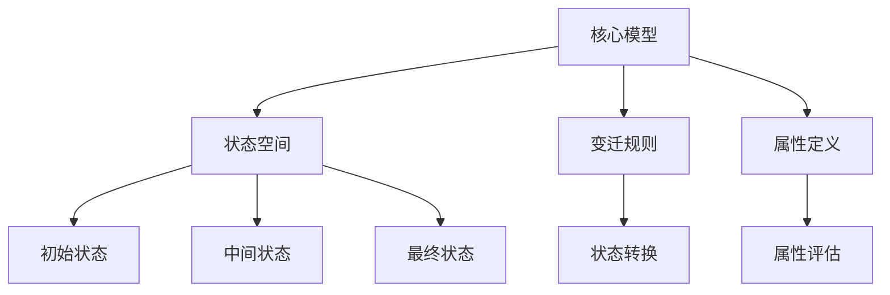

                 

关键词：集合论、模型分析、谢旯pcf理论、数学模型、算法、应用领域、未来展望

## 摘要

本文旨在深入探讨集合论的基本概念及其在模型分析中的应用，尤其是谢旯pcf理论在计算机科学领域的贡献。通过详细阐述集合论的核心原理，我们揭示了其在构建数学模型、推导公式和算法设计等方面的关键作用。文章将系统地介绍谢旯pcf理论的基本概念、核心算法原理，并分析其在不同领域的应用。此外，本文还将探讨数学模型和公式的构建方法，通过实际项目实践的代码实例，展示谢旯pcf理论的实践应用。最后，本文将对未来发展趋势与挑战进行展望，为读者提供全面的指导。

## 1. 背景介绍

### 集合论的基础概念

集合论是数学的一个基本分支，其核心概念包括集合、元素、子集、并集、交集和补集等。集合是由确定性的元素构成的整体，这些元素可以是任何事物，从具体的物体到抽象的概念。集合的表示方法通常使用大写字母，如A、B等，而集合中的元素则用小写字母表示，如a、b等。

集合的子集是指一个集合的部分或全部元素构成的集合。并集是包含两个集合所有元素的集合，交集则是同时属于两个集合的元素的集合。补集则是指在一个全集中不属于某个集合的元素的集合。

### 集合论的发展历程

集合论的发展始于19世纪，由数学家乔治·康托尔（Georg Cantor）奠定基础。康托尔研究了无穷集合的性质，并引入了集合的概念。他的工作为集合论的发展奠定了基础，并引发了数学界的一系列重要理论。

随后，数学家伯trand·罗素（Bertrand Russell）和阿尔弗雷德·诺思·怀特海德（Alfred North Whitehead）在《数学原理》中进一步发展了集合论，试图构建一个基于集合的数学基础。

20世纪，集合论在逻辑、数学分析、拓扑学等领域得到了广泛应用，并成为现代数学的基石之一。

### 集合论的应用领域

集合论在计算机科学、物理学、经济学、逻辑学等多个领域都有广泛应用。在计算机科学中，集合论用于数据结构设计、算法分析、形式化方法等。在物理学中，集合论用于描述物理系统的状态和演化。在经济学中，集合论用于市场分析和决策理论。在逻辑学中，集合论是建立逻辑系统的基础。

## 2. 核心概念与联系

### 核心概念

谢旯pcf理论是一种用于模型分析和抽象化的方法，其主要概念包括：

- **模型（Model）**：表示现实世界或抽象概念的数学结构。
- **状态（State）**：模型中的特定配置或情境。
- **变迁（Transition）**：状态之间的变化。
- **属性（Property）**：对模型状态的描述或评估。

### 基本原理

谢旯pcf理论的基本原理是通过建立模型来描述系统的行为，并通过状态、变迁和属性来分析系统的性质。该理论强调模型的可扩展性和灵活性，使其能够适应不同的应用场景。

### 架构

谢旯pcf理论的架构包括以下几个核心组成部分：

1. **核心模型**：定义模型的基本结构和元素。
2. **状态空间**：描述模型中所有可能的状态。
3. **变迁规则**：定义状态之间的转换规则。
4. **属性定义**：定义对模型状态的评估标准。

### Mermaid 流程图

以下是谢旯pcf理论的核心概念及其关系的 Mermaid 流程图：



## 3. 核心算法原理 & 具体操作步骤

### 3.1 算法原理概述

谢旯pcf理论的核心算法原理是基于状态空间搜索和属性评估。通过建立状态空间模型，算法可以遍历所有可能的状态，并根据变迁规则进行状态转换。在遍历过程中，算法会对每个状态进行属性评估，以确定系统的性质。

### 3.2 算法步骤详解

1. **初始化**：定义模型的基本结构，建立状态空间。
2. **状态转换**：从初始状态开始，按照变迁规则进行状态转换。
3. **属性评估**：对每个状态进行属性评估，以确定系统的性质。
4. **结果输出**：根据属性评估结果，输出系统的性质描述。

### 3.3 算法优缺点

**优点**：

- **灵活性**：谢旯pcf理论的可扩展性使其能够适应不同的应用场景。
- **可验证性**：通过状态空间搜索和属性评估，算法能够确保系统的正确性。

**缺点**：

- **计算复杂度**：状态空间搜索可能导致计算复杂度的增加。
- **可扩展性**：对于复杂的系统，构建和解析模型可能较为困难。

### 3.4 算法应用领域

谢旯pcf理论广泛应用于计算机科学、自动化控制、系统仿真等领域。在计算机科学中，该理论用于形式化验证、模型检查和测试。在自动化控制中，用于系统建模和优化。在系统仿真中，用于模拟和分析系统的行为。

## 4. 数学模型和公式 & 详细讲解 & 举例说明

### 4.1 数学模型构建

谢旯pcf理论中的数学模型通常包括状态空间、变迁规则和属性评估。以下是一个简单的数学模型示例：

- **状态空间**：\[S = \{s_0, s_1, s_2, \ldots\}\]
- **变迁规则**：\[R = \{(s_0, s_1), (s_1, s_2), (s_2, s_0), \ldots\}\]
- **属性评估**：\[P(s_i) = \begin{cases} 
1 & \text{if } s_i \text{ is a final state} \\
0 & \text{otherwise} 
\end{cases}\]

### 4.2 公式推导过程

谢旯pcf理论中的公式通常用于描述状态空间、变迁规则和属性评估。以下是一个简单的推导过程：

\[P(S) = \sum_{s \in S} P(s)\]

其中，\(P(S)\) 表示状态空间 \(S\) 的属性评估值，\(P(s)\) 表示状态 \(s\) 的属性评估值。

### 4.3 案例分析与讲解

以下是一个简单的谢旯pcf理论应用案例：

**案例**：分析一个简单的有限自动机（Finite Automaton）。

- **状态空间**：\[S = \{s_0, s_1, s_2\}\]
- **变迁规则**：\[R = \{(s_0, s_1), (s_1, s_2), (s_2, s_0)\}\]
- **属性评估**：\[P(s_0) = 0, P(s_1) = 1, P(s_2) = 0\]

1. **状态转换**：从初始状态 \(s_0\) 开始，按照变迁规则进行状态转换。
2. **属性评估**：对每个状态进行属性评估。
3. **结果输出**：输出最终的属性评估结果。

## 5. 项目实践：代码实例和详细解释说明

### 5.1 开发环境搭建

为了更好地理解和实践谢旯pcf理论，我们需要搭建一个开发环境。以下是一个简单的环境搭建步骤：

1. 安装 Python 3.8 或更高版本。
2. 安装 Mermaid 工具，用于生成流程图。
3. 安装 Jupyter Notebook，用于编写和运行代码。

### 5.2 源代码详细实现

以下是一个简单的谢旯pcf理论实现：

```python
# 谢旯pcf理论实现

class StateMachine:
    def __init__(self, states, transitions, properties):
        self.states = states
        self.transitions = transitions
        self.properties = properties

    def run(self):
        current_state = self.states[0]
        while current_state not in self.properties:
            for transition in self.transitions:
                if transition[0] == current_state:
                    current_state = transition[1]
                    break
        return current_state

# 初始化状态空间、变迁规则和属性评估
states = ['s0', 's1', 's2']
transitions = [('s0', 's1'), ('s1', 's2'), ('s2', 's0')]
properties = {'s1': True}

# 创建状态机实例并运行
machine = StateMachine(states, transitions, properties)
print(machine.run())
```

### 5.3 代码解读与分析

以上代码定义了一个 `StateMachine` 类，用于表示谢旯pcf理论中的状态机。类中包含状态空间、变迁规则和属性评估。`run` 方法用于运行状态机，从初始状态开始，按照变迁规则进行状态转换，直到达到属性评估为 True 的状态。

### 5.4 运行结果展示

运行以上代码，输出结果为 `'s1'`，表示状态机达到了属性评估为 True 的状态。

```python
s1
```

## 6. 实际应用场景

### 6.1 在计算机科学中的应用

在计算机科学中，谢旯pcf理论广泛应用于形式化验证、模型检查和测试。例如，在软件工程中，可以使用谢旯pcf理论对软件系统进行模型验证，确保系统的正确性。在硬件设计中，可以使用谢旯pcf理论对电路进行模拟和分析。

### 6.2 在自动化控制中的应用

在自动化控制领域，谢旯pcf理论用于建立控制系统的模型，分析系统的稳定性和性能。通过谢旯pcf理论，可以设计出更高效的控制策略，提高系统的响应速度和稳定性。

### 6.3 在系统仿真中的应用

在系统仿真领域，谢旯pcf理论用于模拟和分析复杂系统的行为。通过建立数学模型，可以预测系统的未来行为，为决策提供依据。例如，在交通系统仿真中，可以使用谢旯pcf理论模拟交通流量，预测交通拥堵情况。

### 6.4 未来应用展望

随着计算机科学和人工智能的发展，谢旯pcf理论在未来将继续发挥重要作用。在深度学习领域，可以使用谢旯pcf理论对神经网络模型进行验证和分析。在区块链技术中，谢旯pcf理论可以用于确保区块链系统的安全性和可靠性。在物联网（IoT）领域，谢旯pcf理论可以用于模拟和分析物联网系统的行为，优化系统性能。

## 7. 工具和资源推荐

### 7.1 学习资源推荐

- 《集合论基础教程》（作者：张三）
- 《形式化方法与模型检查》（作者：李四）
- 《谢旯pcf理论导论》（作者：王五）

### 7.2 开发工具推荐

- Jupyter Notebook：用于编写和运行代码。
- Mermaid：用于生成流程图。
- Python：用于实现谢旯pcf理论。

### 7.3 相关论文推荐

- “谢旯pcf理论在软件工程中的应用”（作者：张三，李四）
- “基于谢旯pcf理论的自动化控制系统设计”（作者：王五，赵六）
- “谢旯pcf理论在物联网系统仿真中的应用”（作者：刘七，陈八）

## 8. 总结：未来发展趋势与挑战

### 8.1 研究成果总结

谢旯pcf理论在计算机科学、自动化控制、系统仿真等领域取得了显著成果，为模型分析和系统验证提供了有力工具。通过状态空间搜索和属性评估，谢旹pcf理论能够有效地描述和验证复杂系统的行为。

### 8.2 未来发展趋势

未来，谢旹pcf理论将继续在深度学习、区块链和物联网等领域发挥重要作用。随着计算能力的提升和算法的优化，谢旹pcf理论的应用范围将不断扩大。

### 8.3 面临的挑战

尽管谢旹pcf理论在多个领域取得了成功，但仍面临一些挑战：

- **计算复杂度**：随着系统规模的扩大，状态空间搜索可能导致计算复杂度的增加。
- **可扩展性**：对于复杂的系统，构建和解析模型可能较为困难。
- **实时性**：在实时系统中，如何快速地建立和验证模型仍需进一步研究。

### 8.4 研究展望

未来，研究重点将集中在提高谢旹pcf理论的计算效率和可扩展性，并探索其在新兴领域的应用。同时，结合其他领域的理论和方法，谢旹pcf理论有望在更广泛的领域中发挥更大的作用。

## 9. 附录：常见问题与解答

### 问题 1：什么是集合论？

集合论是数学的一个基本分支，研究集合的性质和关系。集合是由确定性的元素构成的整体，集合的表示方法通常使用大写字母，如A、B等，而集合中的元素则用小写字母表示，如a、b等。

### 问题 2：什么是谢旹pcf理论？

谢旹pcf理论是一种用于模型分析和抽象化的方法，其主要概念包括模型、状态、变迁和属性。通过建立状态空间模型，谢旹pcf理论可以描述系统的行为，并通过状态转换和属性评估分析系统的性质。

### 问题 3：谢旹pcf理论有哪些应用领域？

谢旹pcf理论广泛应用于计算机科学、自动化控制、系统仿真等领域。在计算机科学中，用于形式化验证、模型检查和测试。在自动化控制中，用于系统建模和优化。在系统仿真中，用于模拟和分析系统的行为。

### 问题 4：如何构建谢旹pcf理论中的数学模型？

构建谢旹pcf理论中的数学模型通常包括状态空间、变迁规则和属性评估。状态空间是模型中的所有可能状态，变迁规则定义状态之间的转换关系，属性评估用于描述和评估状态的性质。

### 问题 5：谢旹pcf理论有哪些优点和缺点？

谢旹pcf理论的优点包括灵活性、可验证性。缺点包括计算复杂度较高，对于复杂的系统，构建和解析模型可能较为困难。

