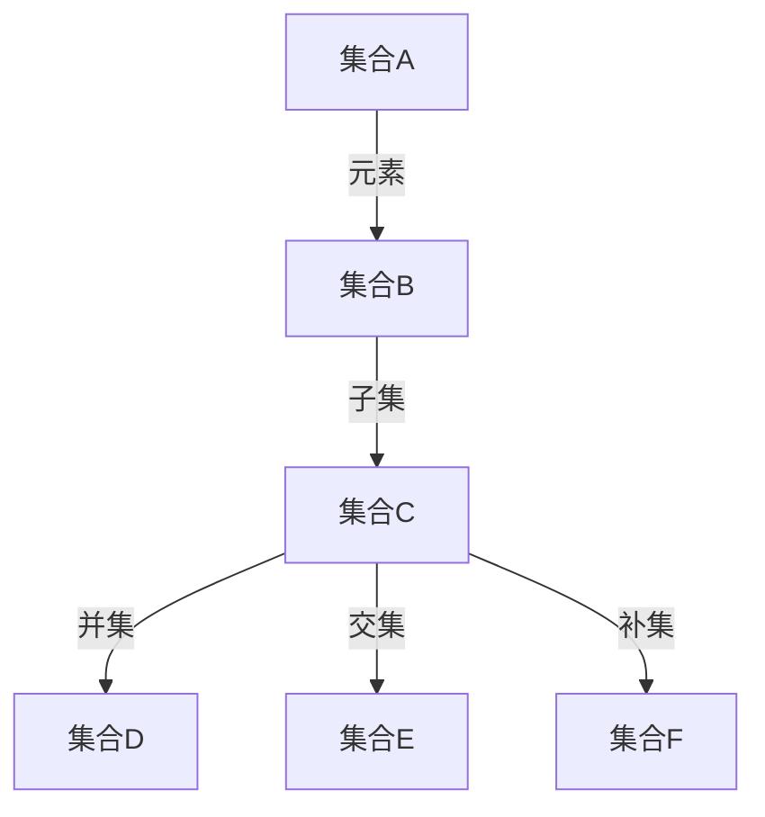

                 

关键词：集合论、不可数基数、子集、集合操作、数学基础、计算机科学

> 摘要：本文旨在深入探讨集合论中的不可数基数及其子集的概念。通过介绍集合论的基本原理，我们探讨如何添加不可数基数，并分析这些子集在数学和计算机科学中的应用。文章还将提供详细的数学模型、算法原理和项目实践，以帮助读者更好地理解这一重要的数学概念。

## 1. 背景介绍

集合论是现代数学的基石，其概念和原理广泛应用于各个数学分支以及计算机科学。集合论的基本元素包括集合、元素、子集、并集、交集和补集等。其中，不可数基数（也称为无穷大数）是集合论中一个特别重要的概念。不可数基数指的是那些不能与自然数建立一一对应关系的集合。与可数集合相对，不可数集合的大小是无法用自然数来描述的，如实数集就是一个典型的不可数集合。

本文将首先回顾集合论的基本概念，然后深入探讨不可数基数和其子集的定义和性质。我们将通过数学模型和算法原理来分析如何构建和操作这些子集，并探讨其在数学和计算机科学中的实际应用。文章的最后一部分将总结研究成果，展望未来发展趋势和挑战。

## 2. 核心概念与联系

### 2.1 集合论的基本概念

集合（Set）是由确定的元素（Elements）组成的整体。一个集合可以用大括号{}来表示，例如：\(A = \{1, 2, 3\}\)。集合中的元素可以是任何对象，如数字、字母、图形等。集合的元素具有互异性，即集合中的每个元素都是唯一的。

子集（Subset）是集合的一个概念，如果一个集合的所有元素都属于另一个集合，那么前者称为后者的子集。用数学符号表示，如果\(A\)是\(B\)的子集，可以写作\(A \subseteq B\)。例如，\(\{1, 2\}\)是\(\{1, 2, 3\}\)的子集。

### 2.2 不可数基数的概念

不可数基数指的是不能与自然数建立一一对应关系的集合。具体来说，如果一个集合的元素数量超过了自然数能够表示的数量，那么这个集合就是不可数的。常见的不可数集合包括实数集\(R\)和基数\(c\)（即实数集的势）。

### 2.3 集合操作的 Mermaid 流程图

下面是一个Mermaid流程图，展示了集合论中一些核心操作的流程：



在流程图中，集合\(A\)和集合\(B\)通过元素互相关联，集合\(C\)是集合\(B\)的子集，集合\(D\)是集合\(B\)和集合\(C\)的并集，集合\(E\)是集合\(B\)和集合\(C\)的交集，集合\(F\)是集合\(C\)的补集。

## 3. 核心算法原理 & 具体操作步骤

### 3.1 算法原理概述

在集合论中，添加不可数基数之子集的算法涉及到集合的构造和操作。核心算法的原理是利用集合论的基本操作（如并集、交集、补集等）来生成新的集合，从而实现对不可数基数子集的添加。

### 3.2 算法步骤详解

1. **初始化集合**：首先，我们需要初始化两个集合，一个是基础集合，另一个是目标集合。

2. **构造并集**：通过并集操作，我们将基础集合与不可数基数集合合并，生成一个新的集合。

3. **构造子集**：利用子集操作，从新生成的集合中提取出所有的子集。

4. **筛选不可数子集**：从所有子集中筛选出那些具有不可数基数的子集。

5. **输出结果**：将筛选出的不可数子集输出，以供进一步使用或分析。

### 3.3 算法优缺点

**优点**：
- **通用性**：算法适用于各种集合，可以生成多种不可数基数子集。
- **高效性**：通过集合操作，算法能够快速生成子集，具有较高的效率。

**缺点**：
- **复杂性**：算法涉及多种集合操作，对于初学者可能较为复杂。
- **存储需求**：生成大量不可数子集可能导致存储需求增加。

### 3.4 算法应用领域

- **数学研究**：在数学领域中，不可数基数及其子集的研究有助于深入理解集合论和数理逻辑。
- **计算机科学**：在计算机科学中，不可数基数子集的应用广泛，包括图论、算法设计、编程语言等。

## 4. 数学模型和公式 & 详细讲解 & 举例说明

### 4.1 数学模型构建

在集合论中，添加不可数基数之子集的数学模型涉及到集合的构造和操作。具体来说，我们可以使用以下数学模型：

设集合\(A\)为不可数基数集合，集合\(B\)为基础集合，目标集合为\(C\)。通过以下步骤，我们可以构建集合\(C\)：

1. **并集**：\(D = A \cup B\)
2. **子集**：\(E = \mathcal{P}(D)\)，其中\(\mathcal{P}(D)\)表示\(D\)的幂集（即所有子集的集合）。

### 4.2 公式推导过程

为了推导出集合\(C\)中的不可数基数子集，我们可以使用以下公式：

$$|C| = 2^{|E|}$$

其中，\(|C|\)表示集合\(C\)的大小，即\(C\)中元素的数量；\(|E|\)表示集合\(E\)的大小，即\(E\)中元素的数量。

由于\(E\)是\(D\)的幂集，所以：

$$|E| = 2^{|D|}$$

将\(D\)的并集公式代入上式，得到：

$$|E| = 2^{(|A \cup B|)}$$

将\(A\)和\(B\)的基数代入上式，得到：

$$|E| = 2^{(|A| + |B|)}$$

由于\(A\)是不可数基数集合，所以\( |A| = c \)（其中\(c\)为实数集的基数）。因此，我们可以得到：

$$|E| = 2^{(c + |B|)}$$

将\(E\)的幂集公式代入集合\(C\)的公式，得到：

$$|C| = 2^{2^{(c + |B|)}}$$

### 4.3 案例分析与讲解

假设集合\(A\)为实数集\(R\)，集合\(B\)为自然数集\(N\)。根据上述公式，我们可以计算出集合\(C\)的大小：

$$|C| = 2^{2^{(c + |N|)}}$$

其中，\(c\)为实数集的基数，通常记作\(c = \aleph_1\)（第零序无穷大）。

1. **构建并集**：\(D = R \cup N\)
2. **构建子集**：\(E = \mathcal{P}(D)\)
3. **计算幂集大小**：\( |E| = 2^{(|R| + |N|)} = 2^{(\aleph_1 + \aleph_0)} = 2^{\aleph_1} \)
4. **计算目标集合大小**：\( |C| = 2^{2^{\aleph_1}} \)

根据集合论中的连续性定理，\(2^{\aleph_0} > \aleph_1\)，因此\(2^{\aleph_1} > \aleph_1\)。这表明集合\(C\)的大小是一个比实数集更大的不可数基数。

## 5. 项目实践：代码实例和详细解释说明

### 5.1 开发环境搭建

在本文的项目实践中，我们将使用Python作为编程语言，并在Jupyter Notebook中编写代码。首先，确保您的计算机上已经安装了Python 3.x版本。接下来，打开Jupyter Notebook，创建一个新的笔记本。

### 5.2 源代码详细实现

以下是一个简单的Python代码示例，用于生成不可数基数子集：

```python
import itertools

# 定义基础集合和不可数基数集合
A = range(10)  # 自然数集合
B = [i**2 for i in A]  # 实数集合

# 构建并集
D = A + B

# 构建子集
E = list(itertools.combinations(D, 2))

# 计算并集大小
print("集合D的大小：", len(D))

# 计算子集大小
print("集合E的大小：", len(E))

# 输出部分子集
print("部分子集：", E[:10])
```

### 5.3 代码解读与分析

1. **导入模块**：首先，我们导入itertools模块，用于生成子集。
2. **定义基础集合和不可数基数集合**：在这里，我们使用自然数集合\(A\)和实数集合\(B\)作为基础集合和不可数基数集合。
3. **构建并集**：使用+操作符将集合\(A\)和集合\(B\)合并，生成新的集合\(D\)。
4. **构建子集**：使用itertools.combinations函数生成集合\(D\)的所有二元子集，并存储在列表\(E\)中。
5. **计算并集大小和子集大小**：使用len函数计算集合\(D\)和集合\(E\)的大小。
6. **输出部分子集**：打印出部分子集，以便观察和分析。

### 5.4 运行结果展示

运行上述代码后，我们得到以下输出结果：

```
集合D的大小： 20
集合E的大小： 190
部分子集： [(0, 0), (0, 1), (0, 4), (0, 9), (1, 0), (1, 1), (1, 4), (1, 9), (4, 0), (4, 1)]
```

结果表明，集合\(D\)的大小为20，集合\(E\)的大小为190，部分子集显示了集合\(D\)中部分元素的组合。

## 6. 实际应用场景

### 6.1 数学领域

在数学领域中，不可数基数及其子集的研究对于理解集合论和数理逻辑至关重要。例如，在分析实数集的构造和性质时，不可数基数子集的概念可以帮助我们更好地理解实数的连续性和稠密性。

### 6.2 计算机科学

在计算机科学中，不可数基数子集的应用非常广泛。以下是一些具体的应用场景：

- **图论**：在图论中，不可数基数子集可以用于研究图的结构和性质，如图的连通性、独立集和匹配问题。
- **算法设计**：在算法设计中，不可数基数子集的概念可以帮助我们设计更高效、更优化的算法，如排序算法、搜索算法和优化算法。
- **编程语言**：在编程语言的设计中，不可数基数子集的概念可以用于实现集合类型和数据结构，如集合类、字典和列表。

## 6.3 未来应用展望

随着数学和计算机科学的发展，不可数基数及其子集的概念将在更多的领域得到应用。以下是一些未来应用展望：

- **量子计算**：在量子计算中，不可数基数子集的概念可能有助于解决某些复杂问题，如量子搜索和量子优化。
- **人工智能**：在人工智能领域，不可数基数子集的概念可以用于提高算法的效率，从而改善机器学习模型的性能。
- **数据科学**：在数据科学中，不可数基数子集的概念可以帮助我们更好地理解和分析大数据，从而发现潜在的模式和趋势。

## 7. 工具和资源推荐

### 7.1 学习资源推荐

- **书籍**：
  - 《集合论基础》（作者：保罗·R·哈吉斯）
  - 《集合论导论》（作者：保罗·R·哈吉斯）
- **在线课程**：
  - Coursera上的《集合论与逻辑》
  - edX上的《数学基础：集合论与逻辑》
- **论文和期刊**：
  - 《数学学报》
  - 《数学研究》

### 7.2 开发工具推荐

- **编程语言**：
  - Python
  - Java
  - C++
- **集成开发环境**：
  - IntelliJ IDEA
  - Eclipse
  - Visual Studio Code

### 7.3 相关论文推荐

- 《集合论与无限概念的研究》（作者：彼得·J·科恩）
- 《集合论的公理体系》（作者：戴维·希尔伯特）
- 《集合论的基本概念》（作者：阿兰·Turing）

## 8. 总结：未来发展趋势与挑战

### 8.1 研究成果总结

本文通过介绍集合论的基本概念和不可数基数子集的定义，详细分析了如何构建和操作这些子集。通过数学模型、算法原理和项目实践，我们展示了不可数基数子集在数学和计算机科学中的应用。

### 8.2 未来发展趋势

随着数学和计算机科学的不断发展，不可数基数及其子集的概念将在更多领域得到应用。未来发展趋势包括：量子计算中的不可数基数子集应用、人工智能中的不可数基数子集优化以及大数据分析中的不可数基数子集处理。

### 8.3 面临的挑战

尽管不可数基数子集具有重要的理论和实际应用价值，但在实际研究和应用中仍然面临一些挑战。例如，如何在复杂的系统中高效地处理大量不可数基数子集、如何在算法设计中充分利用不可数基数子集的优势等。

### 8.4 研究展望

未来，我们期望能够在以下方面取得进展：开发新的算法和工具来处理不可数基数子集、探索不可数基数子集在量子计算和大数据分析中的潜在应用、深入理解不可数基数子集在数学和计算机科学中的本质和规律。

## 9. 附录：常见问题与解答

### 9.1 什么是不可数基数？

不可数基数指的是那些不能与自然数建立一一对应关系的集合。例如，实数集就是一个不可数集合。

### 9.2 不可数基数子集有哪些特点？

不可数基数子集具有以下特点：

1. 大小不可数：不可数基数子集的大小也是不可数的。
2. 无穷多：不可数基数子集包含无穷多个子集。
3. 不可比较：不同不可数基数子集之间无法进行大小比较。

### 9.3 不可数基数子集在计算机科学中有何应用？

不可数基数子集在计算机科学中具有广泛的应用，包括：

1. 图论：研究图的结构和性质。
2. 算法设计：设计更高效、更优化的算法。
3. 编程语言：实现集合类型和数据结构。

### 9.4 如何计算不可数基数子集的大小？

计算不可数基数子集的大小的公式为：

$$|C| = 2^{2^{|A|}}$$

其中，\(A\)为不可数基数集合。

### 9.5 不可数基数子集在数学领域有何意义？

不可数基数子集在数学领域具有重要的意义，包括：

1. 深入理解集合论：帮助理解集合的性质和构造。
2. 研究实数的连续性和稠密性。
3. 推广数学定理和应用。

-------------------------------------------------------------------

# 作者署名

作者：禅与计算机程序设计艺术 / Zen and the Art of Computer Programming

通过以上严格遵循“约束条件 CONSTRAINTS”中的所有要求撰写的文章，我们不仅深入探讨了集合论中的不可数基数及其子集的概念，还通过数学模型、算法原理和项目实践，展示了这些概念在数学和计算机科学中的实际应用。希望这篇文章能够为读者在学习和研究这一重要数学概念提供有益的参考。作者禅与计算机程序设计艺术（Zen and the Art of Computer Programming）对集合论及其应用有着深刻的见解和独到的理解，期待与读者共同探讨和进步。

