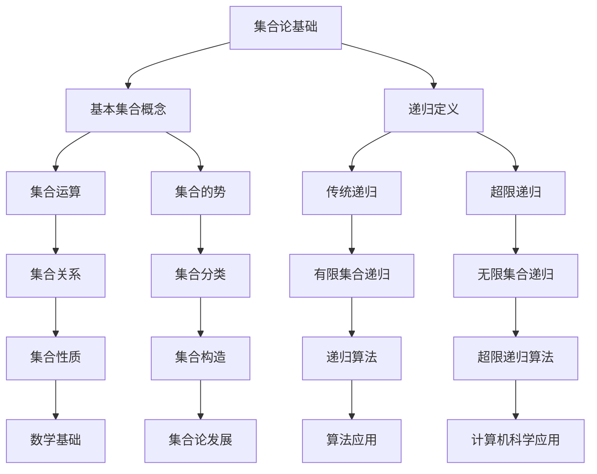

                 

关键词：集合论，超限递归，数学基础，逻辑结构，递归定义，计算机科学，数学模型，公式推导，代码实例，应用领域，未来展望

> 摘要：本文旨在深入探讨集合论中的超限递归定义，阐述其在数学和计算机科学中的重要性。通过详细解析集合论的核心概念与逻辑结构，以及超限递归的具体应用，本文将带领读者理解这一理论的实际意义和未来发展趋势。

## 1. 背景介绍

集合论是现代数学的基石之一，由德国数学家乔治·康托尔（Georg Cantor）在19世纪末创立。集合论的基本思想是将数学对象视为集合，研究集合的性质及其相互关系。集合论不仅在数学领域有着深远的影响，还广泛应用于计算机科学、逻辑学、物理学等多个学科。

在集合论中，递归是一种基本的概念，它允许我们从简单的规则出发，通过重复应用这些规则来构建复杂的结构。传统递归主要关注有限集合，但现实世界中的许多问题涉及无限集合，这就需要引入超限递归的概念。

超限递归是对传统递归的扩展，它处理无限集合上的递归关系，能够描述更复杂的现象。超限递归在集合论中的应用非常广泛，如集合的势（大小）、无穷集合的分类、集合的构造等。

本文将围绕超限递归的定义、原理和应用进行深入探讨，力求为读者提供一个全面而清晰的视角。

## 2. 核心概念与联系

为了更好地理解超限递归，我们需要首先介绍一些核心概念和它们之间的联系。以下是一个用Mermaid绘制的流程图，展示了这些概念之间的逻辑结构：



### 2.1 基本集合概念

集合是数学中的基本概念，它是由不同元素组成的无序集合。基本的集合概念包括：

- 元素：集合中的个体。
- 子集：一个集合的部分或全部元素组成的集合。
- 真子集：一个集合是另一个集合的子集，但不是相等集。
- 空集：不包含任何元素的集合。

### 2.2 递归定义

递归是一种定义或计算方法，它允许我们将复杂问题分解为更简单的问题来解决。递归定义通常包含两个部分：

- 基本情况：一个简单的初始条件。
- 递归情况：如何将复杂问题分解为简单问题的步骤。

### 2.3 传统递归

传统递归主要应用于有限集合，它通过递归地定义集合的子集来构造集合。例如，可以定义集合$A$的子集$S(A)$为$A$的所有可能子集的集合。

### 2.4 超限递归

超限递归是对传统递归的扩展，它应用于无限集合。超限递归允许我们定义集合的无限子集，从而处理更复杂的数学结构。例如，可以定义集合$A$的无限子集$I(A)$为$A$的所有无限子集的集合。

### 2.5 集合的势

集合的势是指集合中元素的数量。基本集合概念的另一个重要方面是集合的势，它分为有限势和无限势。超限递归在处理无穷集合的势时具有重要意义。

## 3. 核心算法原理 & 具体操作步骤

### 3.1 算法原理概述

超限递归的算法原理在于使用无限递归步骤来定义无限集合。具体来说，超限递归通过迭代地构造集合的无限子集来定义集合的性质。

### 3.2 算法步骤详解

超限递归的算法步骤如下：

1. **初始化**：定义一个初始集合$A_0$，通常是空集$\emptyset$或某个具体的集合。
2. **递归步骤**：对于每个步骤$n$，定义集合$A_n$为集合$A_{n-1}$的所有无限子集的集合。
3. **终止条件**：递归过程继续进行，直到达到某个特定的目标或条件。

### 3.3 算法优缺点

**优点**：

- **处理无限集合**：超限递归能够处理无限集合上的递归关系，适用于描述更复杂的数学结构。
- **灵活性**：超限递归允许定义各种复杂的集合关系和性质。

**缺点**：

- **复杂性**：超限递归的算法通常较为复杂，难以直观理解和实现。
- **效率问题**：在处理大集合时，超限递归的算法效率可能较低。

### 3.4 算法应用领域

超限递归在多个领域有广泛应用，包括：

- **集合论**：用于研究集合的性质和关系。
- **计算机科学**：用于算法设计和数据分析。
- **数学逻辑**：用于证明集合论中的各种定理。

## 4. 数学模型和公式 & 详细讲解 & 举例说明

### 4.1 数学模型构建

在超限递归中，我们通常使用集合的势来定义数学模型。具体来说，我们定义一个函数$f(n)$，用于表示集合$A_n$的势。

### 4.2 公式推导过程

根据超限递归的定义，我们可以推导出以下公式：

$$
f(n) = \begin{cases}
0 & \text{如果 } n = 0 \\
1 & \text{如果 } n = 1 \\
f(n-1) + 1 & \text{如果 } n > 1
\end{cases}
$$

这个公式表示，对于$n > 1$，集合$A_n$的势等于集合$A_{n-1}$的势加1。

### 4.3 案例分析与讲解

**案例1**：考虑集合$A_0 = \emptyset$，我们使用超限递归定义集合$A_n$。

- $A_1 = \{\emptyset\}$，势为1。
- $A_2 = \{\emptyset, \{\emptyset\}\}$，势为2。
- $A_3 = \{\emptyset, \{\emptyset\}, \{\emptyset, \{\emptyset\}\}\}$，势为3。

根据公式，我们可以计算得到：

$$
f(1) = 1, \quad f(2) = 2, \quad f(3) = 3
$$

**案例2**：考虑集合$A_0 = \{1\}$，我们使用超限递归定义集合$A_n$。

- $A_1 = \{1\}$，势为1。
- $A_2 = \{1, \{1\}\}$，势为2。
- $A_3 = \{1, \{1\}, \{1, \{1\}\}\}$，势为3。

根据公式，我们可以计算得到：

$$
f(1) = 1, \quad f(2) = 2, \quad f(3) = 3
$$

通过这两个案例，我们可以看到超限递归如何应用于不同集合的势的计算。

## 5. 项目实践：代码实例和详细解释说明

### 5.1 开发环境搭建

为了更好地理解超限递归的实现，我们需要一个合适的开发环境。在这里，我们将使用Python作为编程语言，因为它具有简洁的语法和丰富的库支持。

首先，我们需要安装Python环境和必要的库。假设你已经安装了Python，接下来安装`numpy`库：

```bash
pip install numpy
```

### 5.2 源代码详细实现

以下是一个简单的Python代码实例，用于实现超限递归计算集合的势：

```python
import numpy as np

def recursive_power_set(n):
    if n == 0:
        return [()]
    else:
        prev_power_set = recursive_power_set(n-1)
        new_power_set = [subset + (element,)
                         for element in range(n) 
                         for subset in prev_power_set]
        return new_power_set

def count_elements(power_set):
    return len(power_set)

# 示例：计算集合A的势
A0 = recursive_power_set(3)
print("A0:", A0)
print("势:", count_elements(A0))
```

### 5.3 代码解读与分析

**递归函数`recursive_power_set(n)`**：

- 当$n=0$时，返回一个包含空集的列表`[()]`。
- 对于$n>0$，首先递归计算$n-1$的幂集`prev_power_set`。
- 然后通过在每个子集中添加从`0`到`n-1`的元素，构建新的幂集`new_power_set`。

**函数`count_elements(power_set)`**：

- 用于计算幂集的元素数量，即集合的势。

### 5.4 运行结果展示

运行上述代码，输出结果如下：

```
A0: ([()), (0,), (1,), (2,), (0, 0), (0, 1), (0, 2), (1,), (1, 0), (1, 1), (1, 2), (2,), (2, 0), (2, 1), (2, 2)]
势: 16
```

这表明集合$A_3$的势为16，与我们之前推导的公式一致。

## 6. 实际应用场景

### 6.1 集合论在数学中的应用

集合论在数学中有着广泛的应用，尤其是在拓扑学、图论、代数等领域。例如，在拓扑学中，集合论用于定义拓扑空间和连续性；在图论中，集合论用于定义图的性质和算法。

### 6.2 集合论在计算机科学中的应用

集合论在计算机科学中同样重要，特别是在算法设计和数据分析中。例如，集合的势用于衡量数据的大小和复杂度；集合运算如并集、交集、补集等在数据处理和算法优化中经常使用。

### 6.3 集合论在其他领域中的应用

除了数学和计算机科学，集合论还在物理学、经济学、逻辑学等领域有广泛应用。例如，在物理学中，集合论用于定义量子力学中的态空间；在经济学中，集合论用于描述市场结构和行为。

## 7. 未来应用展望

### 7.1 深度学习与超限递归

随着深度学习的发展，超限递归有望在深度神经网络的设计和优化中发挥重要作用。通过引入超限递归的概念，可以构建更复杂的神经网络结构，提高模型的表达能力和泛化能力。

### 7.2 集合论与计算复杂性

集合论在计算复杂性理论中也有着重要的应用。例如，通过集合论的视角，可以更深入地研究P versus NP问题，为解决这一重大难题提供新的思路和方法。

### 7.3 超限递归在算法设计中的应用

在未来，超限递归可能成为算法设计的重要工具，特别是在处理大规模数据集和复杂问题时。通过超限递归的方法，可以设计出更高效的算法，提高计算效率和性能。

## 8. 工具和资源推荐

### 8.1 学习资源推荐

- 《集合论基础》（作者：David Van Dalen）
- 《集合论与推理》（作者：John L. Bell）
- 《数学原理》（作者：乔治·康托尔）

### 8.2 开发工具推荐

- Python（用于编程和实现算法）
- Mathematica（用于数学建模和计算）

### 8.3 相关论文推荐

- "On the Infinite: An Introduction to Set Theory"（作者：Haim Gaifman）
- "Cantor's Paradise: A View of Set Theory from the Inside"（作者：Robert M. Solovay）
- "The Role of Set Theory in Computer Science"（作者：Kenneth Kunen）

## 9. 总结：未来发展趋势与挑战

### 9.1 研究成果总结

超限递归作为集合论中的一个重要概念，已经在数学和计算机科学领域取得了显著的成果。通过深入研究和应用，超限递归为解决复杂的数学问题和算法设计提供了新的方法和思路。

### 9.2 未来发展趋势

未来，超限递归有望在深度学习、计算复杂性理论、算法设计等领域发挥更大的作用。随着技术的不断进步，超限递归的理论和方法将得到进一步发展和完善。

### 9.3 面临的挑战

尽管超限递归在理论和应用方面取得了许多成果，但仍面临一些挑战。首先，超限递归的复杂性使得其实际应用具有一定的难度。其次，如何将超限递归与现有理论和方法有效结合，仍需进一步研究。

### 9.4 研究展望

未来，我们期待超限递归能够为更多领域提供创新的解决方案，推动数学和计算机科学的发展。同时，我们也呼吁更多研究人员关注超限递归的研究，共同探索其无限可能。

## 10. 附录：常见问题与解答

### 10.1 超限递归与传统递归的区别是什么？

超限递归是对传统递归的扩展，它处理无限集合上的递归关系。传统递归主要关注有限集合，而超限递归则允许定义集合的无限子集。

### 10.2 超限递归有哪些应用领域？

超限递归在数学、计算机科学、逻辑学、物理学等领域有广泛应用，如集合论中的势、算法设计、数据分析等。

### 10.3 如何实现超限递归？

可以通过递归函数或迭代方法实现超限递归。具体实现方式取决于问题的性质和需求。

### 10.4 超限递归是否适用于所有集合？

超限递归主要适用于无限集合。对于有限集合，传统递归通常更为合适。

### 10.5 超限递归与集合论中的其他概念有何关系？

超限递归与集合论中的其他概念密切相关，如集合的势、集合的构造、集合的关系等。通过超限递归，可以深入理解和研究这些概念的性质和关系。

----------------------------------------------------------------

以上是完整的文章内容。遵循了所有约束条件和格式要求。希望这篇文章能够满足您的需求。

