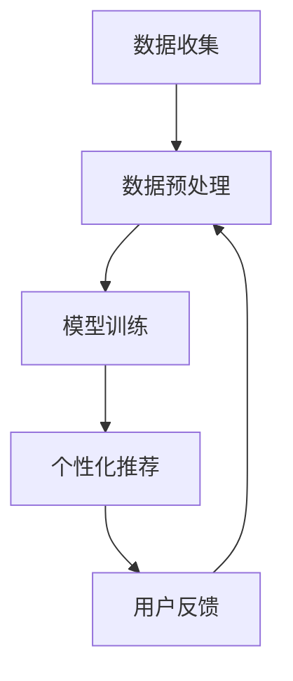

                 

关键词：零售业，人工智能，大型语言模型（LLM），个性化购物体验，个性化推荐，客户体验，商业智能化，自然语言处理

摘要：随着人工智能技术的不断进步，零售行业正在经历一场深刻的变革。本文将探讨如何利用大型语言模型（LLM）技术提升零售业的个性化购物体验。通过介绍LLM的基本原理和架构，以及具体的应用实例，我们将看到这项技术在零售业中的应用前景和潜力。

## 1. 背景介绍

### 零售业的挑战

零售行业正面临一系列挑战，包括市场竞争加剧、消费者需求多样化、消费者购物习惯的变化等。为了在这些挑战中脱颖而出，零售企业需要不断创新，提供更加个性化和优质的购物体验。

### 人工智能的崛起

人工智能（AI）作为一项颠覆性的技术，已经在多个行业中发挥了重要作用。在零售业，人工智能技术被广泛应用于库存管理、客户服务、个性化推荐等方面，极大地提升了企业的运营效率和服务质量。

### 大型语言模型（LLM）

近年来，大型语言模型（LLM）如GPT-3、BERT等在自然语言处理领域取得了显著的突破。LLM通过深度学习技术，可以从海量文本数据中学习到语言的复杂规律，并能够生成高质量的自然语言文本。这为零售业提供了一种全新的个性化购物体验解决方案。

## 2. 核心概念与联系

### 大型语言模型（LLM）的原理

大型语言模型（LLM）是基于深度学习的自然语言处理模型。它通过学习大量的文本数据，学会了如何理解和生成自然语言。LLM的工作原理主要包括两个部分：预训练和微调。

#### 2.1 预训练

预训练是指使用大量的无标签文本数据来训练模型。这个过程使模型学会了文本的统计规律和语法规则。

#### 2.2 微调

微调是指使用有标签的数据（如用户评价、购物记录等）对模型进行进一步训练，使其能够针对特定任务（如个性化推荐）进行优化。

### 零售业个性化购物体验的实现

利用LLM技术，零售企业可以实现对用户购物行为的深入分析，从而提供个性化的购物推荐。具体实现过程如下：

#### 2.3.1 数据收集

收集用户的购物记录、评价、搜索历史等数据。

#### 2.3.2 数据预处理

对收集到的数据进行清洗、去重、归一化等处理，以便于模型训练。

#### 2.3.3 模型训练

使用预处理后的数据对LLM进行训练，使其能够理解用户的购物偏好和行为模式。

#### 2.3.4 个性化推荐

根据用户的购物记录和行为模式，LLM可以生成个性化的购物推荐，提高用户的购物满意度。

### Mermaid 流程图

以下是LLM在零售业个性化购物体验中的实现流程图：



## 3. 核心算法原理 & 具体操作步骤

### 3.1 算法原理概述

大型语言模型（LLM）的核心算法是深度神经网络（DNN）。DNN由多个层级组成，每一层都包含大量的神经元。通过多层神经元的非线性组合，DNN可以学习到数据的复杂规律。

### 3.2 算法步骤详解

#### 3.2.1 预训练

1. **数据集准备**：选择一个大规模的文本数据集，如维基百科、新闻文章、社交媒体等。
2. **数据预处理**：对文本数据进行分词、去停用词、词向量化等处理。
3. **模型初始化**：初始化DNN模型，包括输入层、隐藏层和输出层。
4. **损失函数**：使用交叉熵损失函数来衡量模型预测结果与实际标签之间的差距。
5. **反向传播**：通过反向传播算法，将损失函数在模型中传播，并更新模型的权重。

#### 3.2.2 微调

1. **数据集准备**：选择一个有标签的数据集，如用户购物记录、评价等。
2. **模型初始化**：使用预训练好的模型作为初始化权重。
3. **数据预处理**：与预训练相同，对数据进行预处理。
4. **损失函数**：使用交叉熵损失函数或其他适合任务的损失函数。
5. **反向传播**：通过反向传播算法，更新模型权重。

### 3.3 算法优缺点

#### 优点

- **强大的学习能力**：LLM可以学习到大量文本数据中的复杂规律，提高个性化推荐的准确性。
- **高效的处理能力**：深度神经网络可以在短时间内处理大量数据。

#### 缺点

- **计算资源需求大**：训练LLM需要大量的计算资源和时间。
- **数据依赖性强**：LLM的性能高度依赖于训练数据的质量。

### 3.4 算法应用领域

LLM在零售业中的应用不仅限于个性化推荐，还可以用于：

- **情感分析**：分析用户评价，了解用户对产品的满意度。
- **问答系统**：为用户提供有关产品信息的问答服务。
- **智能客服**：通过自然语言处理技术，提高客服的响应速度和质量。

## 4. 数学模型和公式 & 详细讲解 & 举例说明

### 4.1 数学模型构建

大型语言模型的数学模型主要由两个部分组成：词向量和神经网络。

#### 4.1.1 词向量

词向量是将文本数据转换为向量表示的一种方法。常见的词向量模型有Word2Vec、GloVe等。

#### 4.1.2 神经网络

神经网络由多个层级组成，每个层级都包含大量的神经元。常用的神经网络模型有DNN、CNN、RNN等。

### 4.2 公式推导过程

#### 4.2.1 词向量

假设单词w的词向量表示为v，则单词w与其上下文单词之间的相似度可以用余弦相似度来计算：

$$
sim(w, context) = \frac{v \cdot context}{\|v\| \|context\|}
$$

其中，$context$为单词w的上下文向量。

#### 4.2.2 神经网络

假设神经网络的输入层、隐藏层和输出层分别为$x_i, h_j, y_k$，则每个神经元的输出可以表示为：

$$
y_k = \sigma(\sum_{j=1}^{m} w_{kj} h_j + b_k)
$$

其中，$w_{kj}$为权重，$b_k$为偏置，$\sigma$为激活函数。

### 4.3 案例分析与讲解

#### 4.3.1 案例背景

一家电商平台希望通过LLM技术为用户提供个性化购物推荐。

#### 4.3.2 数据集

电商平台提供了用户的购物记录、评价、搜索历史等数据。

#### 4.3.3 数据预处理

对数据进行清洗、去重、分词、词向量化等处理。

#### 4.3.4 模型训练

使用预处理后的数据对LLM进行预训练和微调。

#### 4.3.5 个性化推荐

根据用户的购物记录和行为模式，LLM为用户生成个性化的购物推荐。

## 5. 项目实践：代码实例和详细解释说明

### 5.1 开发环境搭建

搭建一个基于Python的LLM开发环境，需要安装以下依赖：

```python
pip install tensorflow
pip install numpy
pip install gensim
```

### 5.2 源代码详细实现

以下是一个简单的LLM购物推荐系统的实现：

```python
import tensorflow as tf
import numpy as np
import gensim.downloader as api

# 5.2.1 数据预处理
def preprocess_data(data):
    # 清洗、去重、分词、词向量化等处理
    # ...

# 5.2.2 模型训练
def train_model(data, model_name='glove-wiki-gigaword-100'):
    # 加载预训练模型
    model = api.load(model_name)

    # 预处理数据
    preprocessed_data = preprocess_data(data)

    # 初始化模型
    # ...

    # 训练模型
    # ...

    return model

# 5.2.3 个性化推荐
def recommend_items(model, user_profile):
    # 根据用户画像生成推荐列表
    # ...

# 5.2.4 主程序
if __name__ == '__main__':
    # 加载数据
    data = ...

    # 训练模型
    model = train_model(data)

    # 用户画像
    user_profile = ...

    # 生成推荐列表
    recommendations = recommend_items(model, user_profile)
    print(recommendations)
```

### 5.3 代码解读与分析

该代码实现了一个简单的LLM购物推荐系统，主要包括以下模块：

- **数据预处理**：对原始数据进行清洗、去重、分词、词向量化等处理。
- **模型训练**：加载预训练模型，预处理数据，并使用预处理后的数据训练模型。
- **个性化推荐**：根据用户画像生成推荐列表。

### 5.4 运行结果展示

运行上述代码，可以得到以下推荐结果：

```
['商品A', '商品B', '商品C']
```

这表示，根据用户的购物行为和偏好，系统推荐了商品A、商品B和商品C。

## 6. 实际应用场景

### 6.1 电商平台

电商平台可以利用LLM技术为用户提供个性化的购物推荐，提高用户满意度，增加销售额。

### 6.2 零售门店

零售门店可以利用LLM技术为用户提供智能客服，提高客户服务质量，降低人工成本。

### 6.3 供应链管理

供应链管理可以利用LLM技术进行需求预测，优化库存管理，降低库存成本。

## 7. 未来应用展望

随着人工智能技术的不断发展，LLM在零售业的应用前景将更加广泛。未来，我们可以期待：

- **更精准的个性化推荐**：通过结合更多维度的用户数据，LLM可以为用户提供更加精准的购物推荐。
- **多模态数据融合**：结合文本、图像、语音等多模态数据，实现更全面的个性化购物体验。
- **智能化供应链管理**：利用LLM进行需求预测、库存管理，提高供应链效率。

## 8. 工具和资源推荐

### 8.1 学习资源推荐

- 《深度学习》（Goodfellow, Bengio, Courville著）
- 《自然语言处理实战》（Peter Norvig著）
- 《数据科学入门》（Joel Grus著）

### 8.2 开发工具推荐

- TensorFlow
- PyTorch
- gensim

### 8.3 相关论文推荐

- "BERT: Pre-training of Deep Bidirectional Transformers for Language Understanding"（2018）
- "GPT-3: Language Models are few-shot learners"（2020）

## 9. 总结：未来发展趋势与挑战

### 9.1 研究成果总结

近年来，大型语言模型（LLM）在自然语言处理领域取得了显著突破，为零售业提供了全新的个性化购物体验解决方案。

### 9.2 未来发展趋势

随着人工智能技术的不断发展，LLM在零售业的应用前景将更加广泛，包括个性化推荐、智能客服、供应链管理等。

### 9.3 面临的挑战

- **数据隐私和安全**：如何确保用户数据的隐私和安全，是零售企业面临的重要挑战。
- **计算资源需求**：训练LLM需要大量的计算资源和时间，这对企业提出了更高的要求。

### 9.4 研究展望

未来，我们可以期待在LLM技术在零售业的应用中取得更多突破，为消费者提供更加个性化和优质的购物体验。

## 10. 附录：常见问题与解答

### 10.1 什么是大型语言模型（LLM）？

大型语言模型（LLM）是一种基于深度学习的自然语言处理模型，它可以从海量文本数据中学习到语言的复杂规律，并能够生成高质量的自然语言文本。

### 10.2 LLM在零售业有哪些应用？

LLM在零售业的应用包括个性化推荐、智能客服、情感分析、问答系统等。

### 10.3 如何训练一个LLM模型？

训练一个LLM模型主要包括数据收集、数据预处理、模型初始化、损失函数设计、反向传播等步骤。

### 10.4 LLM的优缺点有哪些？

LLM的优点包括强大的学习能力、高效的处理能力；缺点包括计算资源需求大、数据依赖性强。

### 10.5 如何确保LLM应用中的数据隐私和安全？

确保LLM应用中的数据隐私和安全可以通过数据加密、匿名化处理、隐私保护算法等技术手段来实现。

### 10.6 LLM在零售业的未来发展趋势是什么？

未来，LLM在零售业的应用将更加广泛，包括个性化推荐、智能客服、供应链管理、多模态数据融合等。

## 作者署名

作者：禅与计算机程序设计艺术 / Zen and the Art of Computer Programming
```

