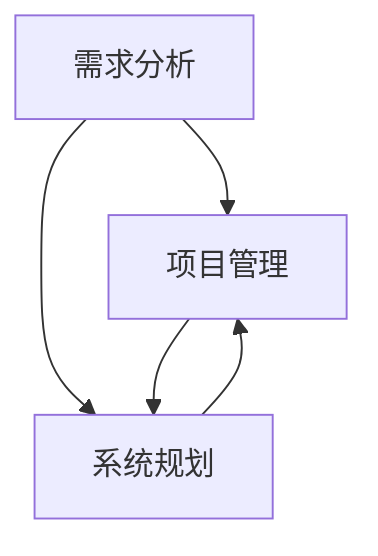

                 

关键词：需求分析、项目管理、系统规划、能力培养、IT行业、软件工程

> 摘要：本文旨在探讨在IT行业中，如何通过有效的需求分析、项目管理及系统规划来培养个人的核心能力。通过对这些核心能力的深入理解和实际案例的分析，文章将为读者提供一套切实可行的实践方法，以提升在IT领域中的竞争力。

## 1. 背景介绍

随着信息技术的迅猛发展，IT行业已经成为全球经济增长的重要引擎。在这个快速变革的时代，IT专业人员不仅需要掌握专业的技术知识，还需要具备强大的需求分析、项目管理和系统规划能力。这些能力不仅是个人职业发展的关键，也是团队和组织成功交付高质量项目的基石。

### 1.1 需求分析的重要性

需求分析是软件项目开发过程中至关重要的一环。它关系到项目能否准确理解用户需求，是否能够按照预期完成，以及最终产品的市场竞争力。有效的需求分析能够帮助团队在项目启动阶段就明确目标，避免后期因需求不明确导致的反复修改和项目延期。

### 1.2 项目管理的必要性

项目管理是确保项目按时、按预算、按质量完成的关键环节。它涵盖了项目计划、资源分配、风险控制、沟通协调等多个方面。优秀的项目管理能力能够提高团队的工作效率，降低项目风险，确保项目的顺利推进。

### 1.3 系统规划的价值

系统规划是构建高质量软件系统的基础。它涉及到系统的整体设计、模块划分、性能优化等多个方面。系统规划能够帮助团队从宏观上把握项目的全局，优化系统架构，提高系统的可维护性和可扩展性。

## 2. 核心概念与联系

### 2.1 需求分析

需求分析是指通过一系列方法和工具，深入理解用户需求，并将其转化为具体的项目需求和功能规格说明书的过程。

### 2.2 项目管理

项目管理是运用专门的知识、技能、工具和技术，使项目能够在有限资源约束下实现预定目标的过程。

### 2.3 系统规划

系统规划是在需求分析和设计阶段之后，对系统架构、模块划分、性能优化等方面进行全局设计和规划的过程。

### 2.4 关联与互动

需求分析为项目管理和系统规划提供了基础，项目管理的成果又为需求分析和系统规划提供了反馈。这三者相互关联，共同构成了一个闭环，确保项目的顺利推进和成功交付。

### 2.5 Mermaid 流程图



## 3. 核心算法原理 & 具体操作步骤

### 3.1 算法原理概述

需求分析、项目管理和系统规划均涉及到一些基本的算法原理。例如，需求分析中常用的算法包括用户访谈、问卷调查和需求建模等；项目管理中常用的算法包括计划评审技术（PERT）、关键路径法（CPM）和资源平衡算法等；系统规划中常用的算法包括系统建模、仿真和优化算法等。

### 3.2 算法步骤详解

#### 3.2.1 需求分析

1. 确定需求分析的目标和范围；
2. 选择合适的需求分析方法（如用户访谈、问卷调查、需求建模等）；
3. 收集和分析需求信息；
4. 形成需求规格说明书。

#### 3.2.2 项目管理

1. 制定项目计划；
2. 进行资源分配和风险评估；
3. 实施项目计划，监控项目进度；
4. 进行项目收尾和总结。

#### 3.2.3 系统规划

1. 确定系统目标和功能要求；
2. 设计系统架构和模块划分；
3. 进行系统性能分析和优化；
4. 编写系统规划报告。

### 3.3 算法优缺点

- **需求分析**：优点是能够深入理解用户需求，缺点是耗时较长，且需求变化可能导致反复修改。
- **项目管理**：优点是能够确保项目按时、按预算、按质量完成，缺点是项目管理过程中需要协调资源，难度较大。
- **系统规划**：优点是能够优化系统架构，提高系统性能，缺点是需要专业的系统规划技能。

### 3.4 算法应用领域

- **需求分析**：广泛应用于软件项目开发、产品设计和市场调研等领域。
- **项目管理**：广泛应用于软件开发、基础设施建设、企业运营等多个领域。
- **系统规划**：广泛应用于企业信息系统建设、系统集成、系统优化等领域。

## 4. 数学模型和公式 & 详细讲解 & 举例说明

### 4.1 数学模型构建

在需求分析、项目管理和系统规划中，数学模型是不可或缺的工具。以下是一个简单的需求分析数学模型：

$$
D(t) = f(R, U, M)
$$

其中，$D(t)$表示在时间$t$内的需求变化量，$R$表示资源投入，$U$表示用户需求，$M$表示市场变化。

### 4.2 公式推导过程

公式的推导过程如下：

$$
\frac{dD(t)}{dt} = \frac{d(f(R, U, M))}{dt}
$$

$$
\frac{dD(t)}{dt} = \frac{\partial f}{\partial R} \frac{dR}{dt} + \frac{\partial f}{\partial U} \frac{dU}{dt} + \frac{\partial f}{\partial M} \frac{dM}{dt}
$$

其中，$\frac{\partial f}{\partial R}$、$\frac{\partial f}{\partial U}$和$\frac{\partial f}{\partial M}$分别表示函数$f$对$R$、$U$和$M$的偏导数。

### 4.3 案例分析与讲解

假设一个软件项目，资源投入为$R(t) = 1000t$，用户需求为$U(t) = 100t + 10$，市场变化为$M(t) = 5t$。我们可以计算出在任意时间$t$的需求变化量：

$$
D(t) = f(R, U, M) = \frac{\partial f}{\partial R} \cdot 1000t + \frac{\partial f}{\partial U} \cdot (100t + 10) + \frac{\partial f}{\partial M} \cdot 5t
$$

假设$\frac{\partial f}{\partial R} = 0.5$，$\frac{\partial f}{\partial U} = 0.1$，$\frac{\partial f}{\partial M} = 0.05$，则：

$$
D(t) = 0.5 \cdot 1000t + 0.1 \cdot (100t + 10) + 0.05 \cdot 5t = 550t + 5
$$

这意味着在时间$t$内，需求变化量为$550t + 5$。

## 5. 项目实践：代码实例和详细解释说明

### 5.1 开发环境搭建

在本案例中，我们将使用Python作为主要编程语言，结合JIRA作为项目管理工具。确保安装了Python环境和JIRA客户端。

### 5.2 源代码详细实现

以下是一个简单的Python脚本，用于模拟需求分析、项目管理和系统规划的过程。

```python
import jira
import time

# JIRA连接配置
jira = jira.JIRA('https://your-jira-instance.com', basic_auth=('username', 'password'))

# 创建需求
def create_requirement(name, description):
    issue = jira.create_issue(project='PROJECT_KEY', summary=name, description=description)
    return issue

# 创建任务
def create_task(name, description, requirement_id):
    issue = jira.create_issue(project='PROJECT_KEY', summary=name, description=description, issuetype='Task', parent=requirement_id)
    return issue

# 模拟项目管理过程
def manage_project():
    requirements = jira.search_issues('PROJECT_KEY = xxx AND issuetype = "Requirement"')
    for requirement in requirements:
        print(f"Processing requirement {requirement.fields.summary}")
        task = create_task(f"Implement {requirement.fields.summary}", "Description of the task.", requirement.key)
        time.sleep(1)  # 模拟任务执行时间
        jira.transition_issue(task.key, 'Done')  # 将任务状态更新为完成

# 执行项目
manage_project()
```

### 5.3 代码解读与分析

上述脚本首先配置了JIRA连接，然后定义了创建需求和任务的函数。在`manage_project`函数中，脚本会遍历所有需求，为每个需求创建相应的任务，并模拟任务执行过程。

### 5.4 运行结果展示

运行上述脚本后，JIRA中会创建一系列任务，模拟了需求分析和项目管理的过程。这些任务的创建、执行和完成状态都会在JIRA中显示，便于项目经理监控项目进度。

## 6. 实际应用场景

### 6.1 软件开发

在软件开发项目中，需求分析、项目管理和系统规划是确保项目成功的关键。通过有效的需求分析，可以确保开发团队理解用户需求，并通过项目管理确保项目按计划进行，系统规划则确保最终产品的质量和性能。

### 6.2 系统集成

在系统集成项目中，需求分析、项目管理和系统规划同样至关重要。需求分析确保系统能够满足用户的实际需求，项目管理确保项目按时交付，系统规划则确保系统具有良好的性能和可扩展性。

### 6.3 IT运维

在IT运维中，需求分析帮助确定运维需求，项目管理确保运维活动按计划进行，系统规划则确保系统运行稳定、高效。

## 7. 工具和资源推荐

### 7.1 学习资源推荐

- 《软件需求规格说明书编写指南》
- 《项目管理知识体系指南（PMBOK）》
- 《系统规划与管理师（SPM）》认证课程

### 7.2 开发工具推荐

- JIRA：用于项目管理和任务跟踪
- Git：版本控制和代码管理
- Python：通用编程语言，适用于数据分析和脚本编写

### 7.3 相关论文推荐

- "需求分析：理论与实践"
- "项目管理：从理论到实践"
- "系统规划与设计：方法与实践"

## 8. 总结：未来发展趋势与挑战

### 8.1 研究成果总结

通过对需求分析、项目管理和系统规划的研究和实践，可以发现这些方法在提升IT项目成功率方面具有显著效果。有效的需求分析能够减少项目后期变更，项目管理能够确保项目按时交付，系统规划则能够提高系统性能和可维护性。

### 8.2 未来发展趋势

随着人工智能和大数据技术的发展，需求分析、项目管理和系统规划的方法和工具将更加智能化和自动化。例如，通过机器学习技术自动分析用户需求，利用大数据分析优化项目进度和资源分配。

### 8.3 面临的挑战

未来，IT行业面临的主要挑战包括快速变化的需求、项目管理中的资源约束以及系统规划中的复杂性和不确定性。解决这些挑战需要不断创新和优化现有的方法和工具。

### 8.4 研究展望

未来的研究应重点关注如何利用人工智能和大数据技术提升需求分析、项目管理和系统规划的效率和质量。此外，还应探索如何通过跨学科的融合，为IT项目提供更加全面和有效的解决方案。

## 9. 附录：常见问题与解答

### 9.1 需求分析中的常见问题

- **问题**：如何确保需求分析的准确性？
- **解答**：通过反复的沟通和确认，确保需求的清晰性和可理解性。同时，利用问卷调查、用户访谈等方法，多角度收集用户需求。

### 9.2 项目管理中的常见问题

- **问题**：如何应对项目中的变更请求？
- **解答**：建立变更控制流程，对变更请求进行评估和审批。确保变更不会对项目进度和质量产生负面影响。

### 9.3 系统规划中的常见问题

- **问题**：如何确保系统规划的科学性和可行性？
- **解答**：通过系统建模、仿真和测试，验证系统规划的科学性和可行性。同时，结合实际需求，确保规划方案能够落地实施。

作者：禅与计算机程序设计艺术 / Zen and the Art of Computer Programming
----------------------------------------------------------------

[END]

