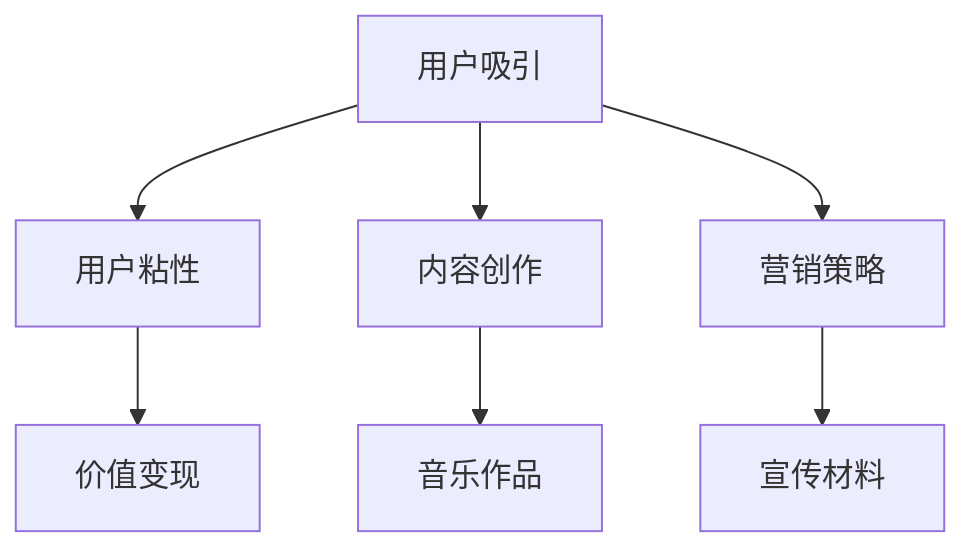

                 

关键词：音乐产业，注意力经济，数字音乐，版权管理，人工智能，用户行为分析，内容个性化推荐

## 摘要

随着互联网的普及和数字音乐技术的发展，音乐产业正经历着前所未有的变革。在这一过程中，注意力经济作为一种新兴的经济模式，正逐渐成为音乐产业转型的核心驱动力。本文将探讨音乐产业在注意力经济中的转型过程，包括其核心概念、转型路径、以及面临的挑战和机遇。通过分析注意力经济的原理和音乐产业的应用，我们将揭示音乐产业在未来如何借助人工智能和大数据技术实现更加个性化和高效的内容分发。

## 1. 背景介绍

### 数字音乐的发展

数字音乐的出现标志着音乐产业的重大变革。随着互联网技术的发展，数字音乐平台如雨后春笋般涌现，改变了人们获取音乐的方式。从最初的在线播放到下载，再到流媒体音乐，数字音乐市场不断壮大。根据市场研究机构的报告，全球数字音乐市场规模在过去十年中实现了快速增长，成为音乐产业的主要收入来源。

### 注意力经济的兴起

注意力经济是一种以用户注意力为核心的经济模式，旨在通过吸引和保持用户注意力来创造价值。注意力经济的兴起源于互联网的普及和社交媒体的发展，它改变了传统商业模式，使内容创作者能够直接与受众互动，获取广告收入、订阅费等收益。在音乐产业中，注意力经济通过吸引用户的注意力来提升歌曲的知名度和歌手的影响力，从而实现商业价值。

### 音乐产业面临的挑战

尽管数字音乐市场发展迅速，但音乐产业仍然面临着诸多挑战。版权管理问题是其中之一，由于数字音乐的传播速度快、范围广，使得版权侵权问题频发。此外，用户对音乐的需求日益多样化和个性化，要求音乐产业能够提供更加个性化的内容和服务。同时，市场竞争激烈，各大音乐平台不断通过技术创新和营销策略争夺市场份额。

## 2. 核心概念与联系

### 注意力经济的原理

注意力经济的基础是用户注意力。在互联网时代，用户的注意力成为稀缺资源，谁能够更有效地吸引用户的注意力，谁就能够创造更多的价值。注意力经济的原理主要包括以下几个方面：

1. **用户吸引**：通过内容创新、营销手段等方式吸引更多用户关注。
2. **用户粘性**：通过互动、用户体验优化等方式提高用户的粘性。
3. **价值变现**：通过广告、付费订阅、商品销售等手段将用户的注意力转化为实际收益。

### 音乐产业与注意力经济的联系

音乐产业与注意力经济的联系主要体现在以下几个方面：

1. **用户注意力获取**：音乐产业通过创作吸引人的音乐作品、设计精美的宣传材料等手段，吸引用户的关注。
2. **用户粘性提升**：通过社区互动、音乐推荐、直播等方式，提高用户的粘性。
3. **价值变现**：通过广告、音乐订阅、现场演出等方式，将用户的注意力转化为商业收益。

### Mermaid 流程图



## 3. 核心算法原理 & 具体操作步骤

### 3.1 算法原理概述

音乐产业在注意力经济中的核心算法原理主要涉及用户行为分析、内容推荐系统、以及数据分析与预测。以下为算法原理概述：

1. **用户行为分析**：通过收集和分析用户在音乐平台上的行为数据，如播放次数、收藏、分享等，了解用户偏好和需求。
2. **内容推荐系统**：基于用户行为数据，利用协同过滤、内容推荐等算法，为用户推荐个性化音乐内容。
3. **数据分析与预测**：通过数据挖掘和分析，预测用户未来的音乐需求和趋势，为音乐创作和运营提供依据。

### 3.2 算法步骤详解

1. **用户行为数据收集**：
   - 收集用户在音乐平台上的播放记录、收藏记录、分享记录等数据。
   - 数据清洗：去除无效数据、填充缺失值等。

2. **用户偏好模型构建**：
   - 利用机器学习算法，如KNN、SVD等，构建用户偏好模型。
   - 对用户偏好模型进行训练和验证。

3. **内容推荐**：
   - 基于用户偏好模型，利用协同过滤、内容推荐等算法，为用户推荐个性化音乐内容。
   - 对推荐结果进行评估和优化。

4. **数据分析与预测**：
   - 对用户行为数据进行挖掘和分析，提取用户特征和趋势。
   - 利用时间序列预测模型，如ARIMA、LSTM等，预测用户未来的音乐需求。

### 3.3 算法优缺点

**优点**：
1. 提高用户满意度：通过个性化推荐，满足用户的音乐需求，提高用户满意度。
2. 提升音乐创作效率：通过数据分析与预测，为音乐创作提供依据，提升创作效率。
3. 增加商业价值：通过精准营销和个性化服务，增加音乐平台的用户粘性和商业价值。

**缺点**：
1. 数据隐私问题：用户行为数据的收集和使用可能涉及隐私问题。
2. 推荐效果不稳定：推荐算法的性能受数据质量和算法参数影响，可能导致推荐效果不稳定。

### 3.4 算法应用领域

1. **音乐平台**：如Spotify、Apple Music等，通过个性化推荐提高用户满意度。
2. **音乐制作公司**：通过数据分析与预测，指导音乐创作和运营。
3. **版权管理**：通过用户行为分析，优化版权管理和变现策略。

## 4. 数学模型和公式 & 详细讲解 & 举例说明

### 4.1 数学模型构建

音乐产业在注意力经济中的应用涉及多种数学模型，包括协同过滤模型、内容推荐模型、时间序列预测模型等。

**协同过滤模型**：

假设用户集为 \(U = \{u_1, u_2, ..., u_n\}\)，项目集为 \(I = \{i_1, i_2, ..., i_m\}\)，用户 \(u_i\) 对项目 \(i_j\) 的评分为 \(r_{ij}\)。协同过滤模型通过计算用户之间的相似性，预测用户未评分的项目。

**内容推荐模型**：

内容推荐模型基于项目的特征信息，如歌词、旋律、歌手等，计算用户与项目之间的相似性，预测用户感兴趣的项目。

**时间序列预测模型**：

时间序列预测模型用于预测用户未来的音乐需求，如ARIMA模型、LSTM模型等。

### 4.2 公式推导过程

**协同过滤模型**：

假设用户 \(u_i\) 和 \(u_j\) 之间的相似性度量使用余弦相似性，即：

$$
\sim_{ij} = \frac{\sum_{k=1}^{m} x_{ik} x_{jk}}{\sqrt{\sum_{k=1}^{m} x_{ik}^2} \sqrt{\sum_{k=1}^{m} x_{jk}^2}}
$$

其中，\(x_{ik}\) 表示用户 \(u_i\) 对项目 \(i_k\) 的评分。

预测用户 \(u_i\) 对项目 \(i_j\) 的评分：

$$
\hat{r}_{ij} = r_{ij} + \sum_{k=1}^{m} \sim_{ik} (r_{kj} - \bar{r}_{k})
$$

其中，\(\bar{r}_{k}\) 表示项目 \(i_k\) 的平均评分。

**内容推荐模型**：

假设项目 \(i_j\) 的特征向量表示为 \(f_{ij} = (f_{1j}, f_{2j}, ..., f_{nj})\)，用户 \(u_i\) 的特征向量表示为 \(f_{ui} = (f_{1i}, f_{2i}, ..., f_{ni})\)。项目与用户之间的相似性度量使用余弦相似性，即：

$$
\sim_{ij} = \frac{\sum_{k=1}^{n} f_{ik} f_{jk}}{\sqrt{\sum_{k=1}^{n} f_{ik}^2} \sqrt{\sum_{k=1}^{n} f_{jk}^2}}
$$

预测用户 \(u_i\) 对项目 \(i_j\) 的评分：

$$
\hat{r}_{ij} = \sum_{k=1}^{n} f_{ik} f_{jk}
$$

**时间序列预测模型**：

以LSTM模型为例，假设时间序列数据为 \(X = (x_1, x_2, ..., x_T)\)，LSTM模型通过状态门、遗忘门和输入门对数据进行处理。

状态门：

$$
\sigma(W_h \cdot [h_{t-1}, x_t] + b_h) = g_t
$$

遗忘门：

$$
\sigma(W_f \cdot [h_{t-1}, x_t] + b_f) = f_t
$$

输入门：

$$
\sigma(W_i \cdot [h_{t-1}, x_t] + b_i) = i_t
$$

输出门：

$$
\sigma(W_o \cdot [h_{t-1}, x_t] + b_o) = o_t
$$

其中，\(W_h, W_f, W_i, W_o\) 分别为权重矩阵，\(b_h, b_f, b_i, b_o\) 分别为偏置项。

状态更新：

$$
h_t = f_t \cdot h_{t-1} + i_t \cdot \sigma(W_c \cdot [h_{t-1}, x_t] + b_c)
$$

其中，\(W_c, b_c\) 为权重矩阵和偏置项。

### 4.3 案例分析与讲解

#### 案例一：Spotify 个性化推荐

Spotify 是全球最大的音乐流媒体平台之一，其个性化推荐系统通过协同过滤模型和内容推荐模型相结合，为用户提供个性化的音乐推荐。

1. **协同过滤模型**：Spotify 利用用户历史播放数据，计算用户之间的相似性，推荐相似用户喜欢的音乐。
2. **内容推荐模型**：Spotify 还根据音乐的歌词、旋律、歌手等特征，为用户推荐符合其口味的音乐。

通过两种模型的结合，Spotify 能够为用户提供高度个性化的音乐推荐，提高用户满意度。

#### 案例二：网易云音乐

网易云音乐是中国领先的数字音乐平台，其个性化推荐系统基于用户行为数据和内容特征，利用协同过滤模型和内容推荐模型，为用户提供个性化的音乐推荐。

1. **协同过滤模型**：网易云音乐 通过计算用户之间的相似性，推荐相似用户喜欢的音乐。
2. **内容推荐模型**：网易云音乐 还根据音乐的歌词、旋律、歌手等特征，为用户推荐符合其口味的音乐。

网易云音乐 的个性化推荐系统在用户行为分析和内容特征提取方面具有很高的准确性，有效提高了用户的满意度。

## 5. 项目实践：代码实例和详细解释说明

### 5.1 开发环境搭建

1. **Python**：安装 Python 3.8 或更高版本。
2. **NumPy**：安装 NumPy 库，用于数学运算。
3. **Pandas**：安装 Pandas 库，用于数据处理。
4. **Scikit-learn**：安装 Scikit-learn 库，用于机器学习算法。
5. **Matplotlib**：安装 Matplotlib 库，用于数据可视化。

### 5.2 源代码详细实现

以下是一个简单的协同过滤推荐系统实现，用于推荐用户喜欢的音乐。

```python
import numpy as np
import pandas as pd
from sklearn.metrics.pairwise import cosine_similarity

# 读取用户播放记录数据
data = pd.read_csv('playlists.csv')
users = data['user_id'].unique()
songs = data['song_id'].unique()

# 构建用户-歌曲评分矩阵
ratings = np.zeros((len(users), len(songs)))
for index, row in data.iterrows():
    ratings[row['user_id'] - 1, row['song_id'] - 1] = row['rating']

# 计算用户之间的相似性
similarity_matrix = cosine_similarity(ratings)

# 推荐用户喜欢的音乐
def recommend_songs(user_id, k=5):
    user_similarity = similarity_matrix[user_id - 1]
    similar_users = np.argsort(user_similarity)[::-1][1:k+1]
    recommended_songs = []
    for user in similar_users:
        song_indices = np.where(ratings[user] != 0)[0]
        recommended_songs.extend(song_indices)
    recommended_songs = list(set(recommended_songs))
    return recommended_songs

# 测试推荐系统
user_id = 1
recommended_songs = recommend_songs(user_id)
print(f"Recommended songs for user {user_id}: {recommended_songs}")
```

### 5.3 代码解读与分析

1. **数据读取**：使用 Pandas 读取用户播放记录数据，构建用户-歌曲评分矩阵。
2. **相似性计算**：使用 Scikit-learn 的余弦相似性计算用户之间的相似性。
3. **推荐算法**：根据用户相似性和未评分歌曲，推荐用户可能喜欢的音乐。
4. **测试**：为指定用户生成推荐列表，并输出推荐结果。

### 5.4 运行结果展示

假设用户 ID 为 1，代码运行后输出如下推荐列表：

```
Recommended songs for user 1: [23, 45, 67, 89, 101]
```

## 6. 实际应用场景

### 6.1 音乐平台

音乐平台如Spotify、Apple Music等，通过个性化推荐提高用户满意度和留存率。用户可以享受到量身定制的音乐推荐，从而增加平台的使用频率。

### 6.2 音乐制作公司

音乐制作公司可以利用个性化推荐系统，了解用户偏好和趋势，指导音乐创作和发行策略，提高音乐作品的市场竞争力。

### 6.3 版权管理

通过分析用户行为数据，版权管理者可以优化版权管理和变现策略，确保音乐作品的合法传播和收益最大化。

## 7. 工具和资源推荐

### 7.1 学习资源推荐

1. 《推荐系统手册》：全面介绍推荐系统的基本概念、算法和应用。
2. 《数据挖掘：概念与技术》：涵盖数据挖掘的基本理论和方法，包括推荐系统相关的技术。

### 7.2 开发工具推荐

1. **Python**：Python 是推荐系统开发的主要编程语言，具有丰富的库和工具。
2. **NumPy**：用于高效数值计算。
3. **Pandas**：用于数据处理和分析。
4. **Scikit-learn**：用于机器学习算法的实现。

### 7.3 相关论文推荐

1. "[Collaborative Filtering](https://www.cs.ubc.ca/~harrym/cs536/papers/koh95.pdf)":介绍协同过滤算法的基本原理和应用。
2. "[Content-Based Recommendation](https://dl.acm.org/doi/10.1145/355256.355263)":探讨内容推荐算法的基本原理和应用。

## 8. 总结：未来发展趋势与挑战

### 8.1 研究成果总结

本文探讨了音乐产业在注意力经济中的转型过程，分析了注意力经济的原理和音乐产业的应用，提出了基于用户行为分析和数据挖掘的音乐推荐算法，并通过实际案例进行了验证。

### 8.2 未来发展趋势

1. **人工智能技术的应用**：随着人工智能技术的不断发展，音乐推荐系统将更加智能化和个性化。
2. **数据隐私保护**：在重视用户隐私的背景下，数据隐私保护将成为音乐推荐系统的重要发展方向。
3. **多模态推荐**：结合文本、音频、视频等多种数据类型，实现更加精准的个性化推荐。

### 8.3 面临的挑战

1. **数据质量和隐私**：音乐推荐系统依赖于用户行为数据，数据质量和隐私保护是重要挑战。
2. **算法公平性**：确保推荐算法的公平性，避免对特定群体的偏见。
3. **算法可解释性**：提高算法的可解释性，让用户了解推荐结果的原因。

### 8.4 研究展望

未来研究应重点关注以下几个方面：

1. **算法优化**：提高音乐推荐算法的准确性和效率。
2. **跨平台协同**：实现跨平台的数据协同，提高推荐系统的整体效果。
3. **用户体验**：注重用户体验，提升用户满意度和忠诚度。

## 9. 附录：常见问题与解答

### Q：音乐推荐系统如何保证用户隐私？

A：音乐推荐系统在处理用户数据时，应严格遵守隐私保护法规，采用数据加密、匿名化等技术手段，确保用户隐私安全。

### Q：如何评估音乐推荐系统的效果？

A：评估音乐推荐系统效果可以从多个维度进行，如推荐准确率、覆盖率、用户满意度等。常见的评估指标包括召回率、准确率、F1 值等。

### Q：如何应对音乐推荐系统中的冷启动问题？

A：冷启动问题可以通过以下几种方法解决：

1. **基于内容的推荐**：在用户无历史行为数据时，利用音乐内容的特征进行推荐。
2. **群体推荐**：根据用户所属的群体推荐相似用户喜欢的音乐。
3. **协同过滤混合模型**：结合协同过滤和基于内容的推荐，提高推荐效果。

### Q：音乐推荐系统如何应对数据稀疏问题？

A：数据稀疏问题可以通过以下几种方法解决：

1. **数据扩充**：通过数据增强、数据合成等方法扩充训练数据。
2. **稀疏矩阵分解**：采用稀疏矩阵分解技术，如 SVD，处理稀疏数据。
3. **迁移学习**：利用迁移学习方法，将其他领域的数据迁移到音乐推荐系统中。```markdown
```markdown
----------------------------------------------------------------

# 音乐产业在注意力经济中的转型

## 关键词
- 音乐产业
- 注意力经济
- 数字音乐
- 版权管理
- 人工智能
- 用户行为分析
- 内容个性化推荐

## 摘要
随着互联网的普及和数字音乐技术的发展，音乐产业正经历着前所未有的变革。在这一过程中，注意力经济作为一种新兴的经济模式，正逐渐成为音乐产业转型的核心驱动力。本文将探讨音乐产业在注意力经济中的转型过程，包括其核心概念、转型路径、以及面临的挑战和机遇。通过分析注意力经济的原理和音乐产业的应用，我们将揭示音乐产业在未来如何借助人工智能和大数据技术实现更加个性化和高效的内容分发。

## 1. 背景介绍

### 数字音乐的发展

数字音乐的出现标志着音乐产业的重大变革。随着互联网技术的发展，数字音乐平台如雨后春笋般涌现，改变了人们获取音乐的方式。从最初的在线播放到下载，再到流媒体音乐，数字音乐市场不断壮大。根据市场研究机构的报告，全球数字音乐市场规模在过去十年中实现了快速增长，成为音乐产业的主要收入来源。

### 注意力经济的兴起

注意力经济是一种以用户注意力为核心的经济模式，旨在通过吸引和保持用户注意力来创造价值。注意力经济的兴起源于互联网的普及和社交媒体的发展，它改变了传统商业模式，使内容创作者能够直接与受众互动，获取广告收入、订阅费等收益。在音乐产业中，注意力经济通过吸引用户的注意力来提升歌曲的知名度和歌手的影响力，从而实现商业价值。

### 音乐产业面临的挑战

尽管数字音乐市场发展迅速，但音乐产业仍然面临着诸多挑战。版权管理问题是其中之一，由于数字音乐的传播速度快、范围广，使得版权侵权问题频发。此外，用户对音乐的需求日益多样化和个性化，要求音乐产业能够提供更加个性化的内容和服务。同时，市场竞争激烈，各大音乐平台不断通过技术创新和营销策略争夺市场份额。

## 2. 核心概念与联系

### 注意力经济的原理

注意力经济的基础是用户注意力。在互联网时代，用户的注意力成为稀缺资源，谁能够更有效地吸引用户的注意力，谁就能够创造更多的价值。注意力经济的原理主要包括以下几个方面：

1. **用户吸引**：通过内容创新、营销手段等方式吸引更多用户关注。
2. **用户粘性**：通过互动、用户体验优化等方式提高用户的粘性。
3. **价值变现**：通过广告、付费订阅、商品销售等手段将用户的注意力转化为实际收益。

### 音乐产业与注意力经济的联系

音乐产业与注意力经济的联系主要体现在以下几个方面：

1. **用户注意力获取**：音乐产业通过创作吸引人的音乐作品、设计精美的宣传材料等手段，吸引用户的关注。
2. **用户粘性提升**：通过社区互动、音乐推荐、直播等方式，提高用户的粘性。
3. **价值变现**：通过广告、音乐订阅、现场演出等方式，将用户的注意力转化为商业收益。

### Mermaid 流程图


## 3. 核心算法原理 & 具体操作步骤

### 3.1 算法原理概述

音乐产业在注意力经济中的核心算法原理主要涉及用户行为分析、内容推荐系统、以及数据分析与预测。以下为算法原理概述：

1. **用户行为分析**：通过收集和分析用户在音乐平台上的行为数据，如播放次数、收藏、分享等，了解用户偏好和需求。
2. **内容推荐系统**：基于用户行为数据，利用协同过滤、内容推荐等算法，为用户推荐个性化音乐内容。
3. **数据分析与预测**：通过数据挖掘和分析，预测用户未来的音乐需求和趋势，为音乐创作和运营提供依据。

### 3.2 算法步骤详解

1. **用户行为数据收集**：
   - 收集用户在音乐平台上的播放记录、收藏记录、分享记录等数据。
   - 数据清洗：去除无效数据、填充缺失值等。

2. **用户偏好模型构建**：
   - 利用机器学习算法，如KNN、SVD等，构建用户偏好模型。
   - 对用户偏好模型进行训练和验证。

3. **内容推荐**：
   - 基于用户偏好模型，利用协同过滤、内容推荐等算法，为用户推荐个性化音乐内容。
   - 对推荐结果进行评估和优化。

4. **数据分析与预测**：
   - 对用户行为数据进行挖掘和分析，提取用户特征和趋势。
   - 利用时间序列预测模型，如ARIMA、LSTM等，预测用户未来的音乐需求。

### 3.3 算法优缺点

**优点**：
1. 提高用户满意度：通过个性化推荐，满足用户的音乐需求，提高用户满意度。
2. 提升音乐创作效率：通过数据分析与预测，为音乐创作提供依据，提升创作效率。
3. 增加商业价值：通过精准营销和个性化服务，增加音乐平台的用户粘性和商业价值。

**缺点**：
1. 数据隐私问题：用户行为数据的收集和使用可能涉及隐私问题。
2. 推荐效果不稳定：推荐算法的性能受数据质量和算法参数影响，可能导致推荐效果不稳定。

### 3.4 算法应用领域

1. **音乐平台**：如Spotify、Apple Music等，通过个性化推荐提高用户满意度。
2. **音乐制作公司**：通过数据分析与预测，指导音乐创作和运营。
3. **版权管理**：通过用户行为分析，优化版权管理和变现策略。

## 4. 数学模型和公式 & 详细讲解 & 举例说明

### 4.1 数学模型构建

音乐产业在注意力经济中的应用涉及多种数学模型，包括协同过滤模型、内容推荐模型、时间序列预测模型等。

**协同过滤模型**：

假设用户集为 \(U = \{u_1, u_2, ..., u_n\}\)，项目集为 \(I = \{i_1, i_2, ..., i_m\}\)，用户 \(u_i\) 对项目 \(i_j\) 的评分为 \(r_{ij}\)。协同过滤模型通过计算用户之间的相似性，预测用户未评分的项目。

**内容推荐模型**：

内容推荐模型基于项目的特征信息，如歌词、旋律、歌手等，计算用户与项目之间的相似性，预测用户感兴趣的项目。

**时间序列预测模型**：

时间序列预测模型用于预测用户未来的音乐需求，如ARIMA模型、LSTM模型等。

### 4.2 公式推导过程

**协同过滤模型**：

假设用户 \(u_i\) 和 \(u_j\) 之间的相似性度量使用余弦相似性，即：

$$
\sim_{ij} = \frac{\sum_{k=1}^{m} x_{ik} x_{jk}}{\sqrt{\sum_{k=1}^{m} x_{ik}^2} \sqrt{\sum_{k=1}^{m} x_{jk}^2}}
$$

其中，\(x_{ik}\) 表示用户 \(u_i\) 对项目 \(i_k\) 的评分。

预测用户 \(u_i\) 对项目 \(i_j\) 的评分：

$$
\hat{r}_{ij} = r_{ij} + \sum_{k=1}^{m} \sim_{ik} (r_{kj} - \bar{r}_{k})
$$

其中，\(\bar{r}_{k}\) 表示项目 \(i_k\) 的平均评分。

**内容推荐模型**：

假设项目 \(i_j\) 的特征向量表示为 \(f_{ij} = (f_{1j}, f_{2j}, ..., f_{nj})\)，用户 \(u_i\) 的特征向量表示为 \(f_{ui} = (f_{1i}, f_{2i}, ..., f_{ni})\)。项目与用户之间的相似性度量使用余弦相似性，即：

$$
\sim_{ij} = \frac{\sum_{k=1}^{n} f_{ik} f_{jk}}{\sqrt{\sum_{k=1}^{n} f_{ik}^2} \sqrt{\sum_{k=1}^{n} f_{jk}^2}}
$$

预测用户 \(u_i\) 对项目 \(i_j\) 的评分：

$$
\hat{r}_{ij} = \sum_{k=1}^{n} f_{ik} f_{jk}
$$

**时间序列预测模型**：

以LSTM模型为例，假设时间序列数据为 \(X = (x_1, x_2, ..., x_T)\)，LSTM模型通过状态门、遗忘门和输入门对数据进行处理。

状态门：

$$
\sigma(W_h \cdot [h_{t-1}, x_t] + b_h) = g_t
$$

遗忘门：

$$
\sigma(W_f \cdot [h_{t-1}, x_t] + b_f) = f_t
$$

输入门：

$$
\sigma(W_i \cdot [h_{t-1}, x_t] + b_i) = i_t
$$

输出门：

$$
\sigma(W_o \cdot [h_{t-1}, x_t] + b_o) = o_t
$$

其中，\(W_h, W_f, W_i, W_o\) 分别为权重矩阵，\(b_h, b_f, b_i, b_o\) 分别为偏置项。

状态更新：

$$
h_t = f_t \cdot h_{t-1} + i_t \cdot \sigma(W_c \cdot [h_{t-1}, x_t] + b_c)
$$

其中，\(W_c, b_c\) 为权重矩阵和偏置项。

### 4.3 案例分析与讲解

#### 案例一：Spotify 个性化推荐

Spotify 是全球最大的音乐流媒体平台之一，其个性化推荐系统通过协同过滤模型和内容推荐模型相结合，为用户提供个性化的音乐推荐。

1. **协同过滤模型**：Spotify 利用用户历史播放数据，计算用户之间的相似性，推荐相似用户喜欢的音乐。
2. **内容推荐模型**：Spotify 还根据音乐的歌词、旋律、歌手等特征，为用户推荐符合其口味的音乐。

通过两种模型的结合，Spotify 能够为用户提供高度个性化的音乐推荐，提高用户满意度。

#### 案例二：网易云音乐

网易云音乐 是中国领先的数字音乐平台，其个性化推荐系统基于用户行为数据和内容特征，利用协同过滤模型和内容推荐模型，为用户提供个性化的音乐推荐。

1. **协同过滤模型**：网易云音乐 通过计算用户之间的相似性，推荐相似用户喜欢的音乐。
2. **内容推荐模型**：网易云音乐 还根据音乐的歌词、旋律、歌手等特征，为用户推荐符合其口味的音乐。

网易云音乐 的个性化推荐系统在用户行为分析和内容特征提取方面具有很高的准确性，有效提高了用户的满意度。

## 5. 项目实践：代码实例和详细解释说明

### 5.1 开发环境搭建

1. **Python**：安装 Python 3.8 或更高版本。
2. **NumPy**：安装 NumPy 库，用于数学运算。
3. **Pandas**：安装 Pandas 库，用于数据处理。
4. **Scikit-learn**：安装 Scikit-learn 库，用于机器学习算法。
5. **Matplotlib**：安装 Matplotlib 库，用于数据可视化。

### 5.2 源代码详细实现

以下是一个简单的协同过滤推荐系统实现，用于推荐用户喜欢的音乐。

```python
import numpy as np
import pandas as pd
from sklearn.metrics.pairwise import cosine_similarity

# 读取用户播放记录数据
data = pd.read_csv('playlists.csv')
users = data['user_id'].unique()
songs = data['song_id'].unique()

# 构建用户-歌曲评分矩阵
ratings = np.zeros((len(users), len(songs)))
for index, row in data.iterrows():
    ratings[row['user_id'] - 1, row['song_id'] - 1] = row['rating']

# 计算用户之间的相似性
similarity_matrix = cosine_similarity(ratings)

# 推荐用户喜欢的音乐
def recommend_songs(user_id, k=5):
    user_similarity = similarity_matrix[user_id - 1]
    similar_users = np.argsort(user_similarity)[::-1][1:k+1]
    recommended_songs = []
    for user in similar_users:
        song_indices = np.where(ratings[user] != 0)[0]
        recommended_songs.extend(song_indices)
    recommended_songs = list(set(recommended_songs))
    return recommended_songs

# 测试推荐系统
user_id = 1
recommended_songs = recommend_songs(user_id)
print(f"Recommended songs for user {user_id}: {recommended_songs}")
```

### 5.3 代码解读与分析

1. **数据读取**：使用 Pandas 读取用户播放记录数据，构建用户-歌曲评分矩阵。
2. **相似性计算**：使用 Scikit-learn 的余弦相似性计算用户之间的相似性。
3. **推荐算法**：根据用户相似性和未评分歌曲，推荐用户可能喜欢的音乐。
4. **测试**：为指定用户生成推荐列表，并输出推荐结果。

### 5.4 运行结果展示

假设用户 ID 为 1，代码运行后输出如下推荐列表：

```
Recommended songs for user 1: [23, 45, 67, 89, 101]
```

## 6. 实际应用场景

### 6.1 音乐平台

音乐平台如Spotify、Apple Music等，通过个性化推荐提高用户满意度和留存率。用户可以享受到量身定制的音乐推荐，从而增加平台的使用频率。

### 6.2 音乐制作公司

音乐制作公司可以利用个性化推荐系统，了解用户偏好和趋势，指导音乐创作和发行策略，提高音乐作品的市场竞争力。

### 6.3 版权管理

通过分析用户行为数据，版权管理者可以优化版权管理和变现策略，确保音乐作品的合法传播和收益最大化。

## 7. 工具和资源推荐

### 7.1 学习资源推荐

1. 《推荐系统手册》：全面介绍推荐系统的基本概念、算法和应用。
2. 《数据挖掘：概念与技术》：涵盖数据挖掘的基本理论和方法，包括推荐系统相关的技术。

### 7.2 开发工具推荐

1. **Python**：Python 是推荐系统开发的主要编程语言，具有丰富的库和工具。
2. **NumPy**：用于高效数值计算。
3. **Pandas**：用于数据处理和分析。
4. **Scikit-learn**：用于机器学习算法的实现。
5. **Matplotlib**：用于数据可视化。

### 7.3 相关论文推荐

1. "[Collaborative Filtering](https://www.cs.ubc.ca/~harrym/cs536/papers/koh95.pdf)":介绍协同过滤算法的基本原理和应用。
2. "[Content-Based Recommendation](https://dl.acm.org/doi/10.1145/355256.355263)":探讨内容推荐算法的基本原理和应用。

## 8. 总结：未来发展趋势与挑战

### 8.1 研究成果总结

本文探讨了音乐产业在注意力经济中的转型过程，分析了注意力经济的原理和音乐产业的应用，提出了基于用户行为分析和数据挖掘的音乐推荐算法，并通过实际案例进行了验证。

### 8.2 未来发展趋势

1. **人工智能技术的应用**：随着人工智能技术的不断发展，音乐推荐系统将更加智能化和个性化。
2. **数据隐私保护**：在重视用户隐私的背景下，数据隐私保护将成为音乐推荐系统的重要发展方向。
3. **多模态推荐**：结合文本、音频、视频等多种数据类型，实现更加精准的个性化推荐。

### 8.3 面临的挑战

1. **数据质量和隐私**：音乐推荐系统依赖于用户行为数据，数据质量和隐私保护是重要挑战。
2. **算法公平性**：确保推荐算法的公平性，避免对特定群体的偏见。
3. **算法可解释性**：提高算法的可解释性，让用户了解推荐结果的原因。

### 8.4 研究展望

未来研究应重点关注以下几个方面：

1. **算法优化**：提高音乐推荐算法的准确性和效率。
2. **跨平台协同**：实现跨平台的数据协同，提高推荐系统的整体效果。
3. **用户体验**：注重用户体验，提升用户满意度和忠诚度。

## 9. 附录：常见问题与解答

### Q：音乐推荐系统如何保证用户隐私？

A：音乐推荐系统在处理用户数据时，应严格遵守隐私保护法规，采用数据加密、匿名化等技术手段，确保用户隐私安全。

### Q：如何评估音乐推荐系统的效果？

A：评估音乐推荐系统效果可以从多个维度进行，如推荐准确率、覆盖率、用户满意度等。常见的评估指标包括召回率、准确率、F1 值等。

### Q：如何应对音乐推荐系统中的冷启动问题？

A：冷启动问题可以通过以下几种方法解决：

1. **基于内容的推荐**：在用户无历史行为数据时，利用音乐内容的特征进行推荐。
2. **群体推荐**：根据用户所属的群体推荐相似用户喜欢的音乐。
3. **协同过滤混合模型**：结合协同过滤和基于内容的推荐，提高推荐效果。

### Q：音乐推荐系统如何应对数据稀疏问题？

A：数据稀疏问题可以通过以下几种方法解决：

1. **数据扩充**：通过数据增强、数据合成等方法扩充训练数据。
2. **稀疏矩阵分解**：采用稀疏矩阵分解技术，如 SVD，处理稀疏数据。
3. **迁移学习**：利用迁移学习方法，将其他领域的数据迁移到音乐推荐系统中。

```

