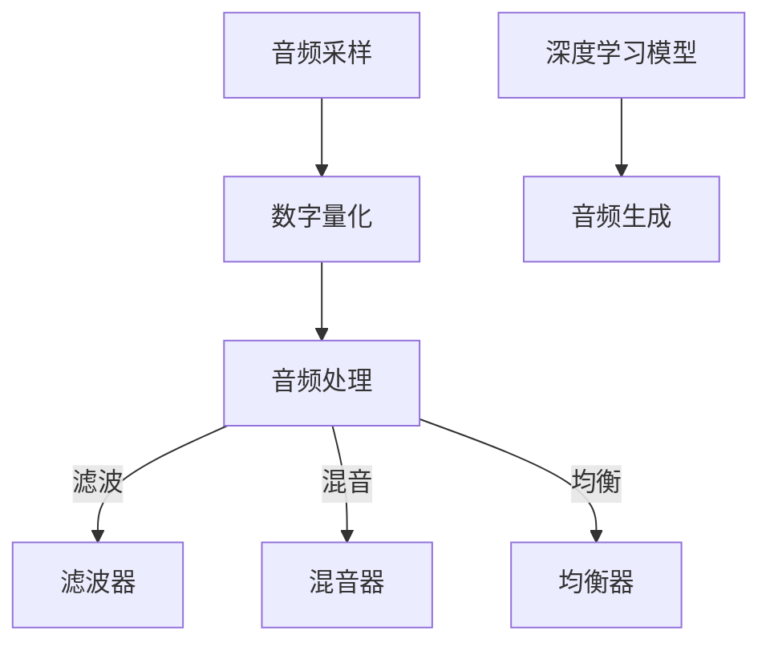

                 

音频生成（Audio Generation）是近年来人工智能领域中的一个热门研究方向，其在音乐创作、语音合成、音频修复等领域具有广泛的应用。本文将深入探讨音频生成的原理，并通过具体的代码实例，帮助读者理解这一技术。

## 关键词

- 音频生成
- 语音合成
- 音乐创作
- 音频修复
- 深度学习
- 神经网络

## 摘要

本文首先介绍了音频生成的背景和重要性，接着详细讲解了音频生成的核心概念和算法原理。随后，通过一个具体的代码实例，演示了音频生成的实现过程。最后，文章探讨了音频生成的实际应用场景和未来发展方向。

## 1. 背景介绍

### 1.1 音频生成的定义

音频生成是指利用算法和模型自动创建新的音频内容，这包括但不限于语音合成、音乐创作和音频修复。语音合成是文本到语音（Text-to-Speech，TTS）技术的核心，而音乐创作则是生成新的音乐旋律和节奏。音频修复则涉及到对受损音频进行修复和增强。

### 1.2 音频生成的重要性

随着深度学习和生成对抗网络（GANs）等技术的发展，音频生成在各个领域的应用日益广泛。在音乐创作中，音频生成使得艺术家能够快速创作出新的音乐作品；在语音合成中，音频生成提供了更加自然和流畅的语音体验；在音频修复中，音频生成可以修复受损的音频文件，提升音频质量。

## 2. 核心概念与联系

### 2.1 声音的数字表示

声音在计算机中通常以数字形式表示，即通过采样和量化将模拟信号转换为数字信号。采样率决定了每秒采样的次数，量化位数决定了每个样本的精度。

### 2.2 音频处理的基本原理

音频处理通常包括滤波、混音、均衡等操作。滤波器用于去除不需要的频率成分，混音用于合并多个音频信号，均衡则用于调整音频的频率响应。

### 2.3 音频生成的技术

音频生成的技术主要包括基于规则的方法、基于信号处理的方法和基于深度学习的方法。基于规则的方法通过预设的规则生成音频，而基于信号处理的方法通过信号处理算法生成音频。基于深度学习的方法则利用神经网络学习音频的特征，生成新的音频内容。

### 2.4 Mermaid 流程图



## 3. 核心算法原理 & 具体操作步骤

### 3.1 算法原理概述

音频生成的主要算法包括生成对抗网络（GANs）和变分自编码器（VAEs）。GANs通过对抗训练生成逼真的音频，而VAEs则通过编码和解码过程生成音频。

### 3.2 算法步骤详解

1. 数据准备：收集大量的音频数据，包括语音、音乐等。
2. 特征提取：使用预处理技术提取音频的特征，如梅尔频率倒谱系数（MFCC）。
3. 模型训练：训练GANs或VAEs模型，利用提取的特征生成新的音频。
4. 音频生成：利用训练好的模型生成新的音频。

### 3.3 算法优缺点

- GANs：优点是生成音频质量高，缺点是训练难度大，易陷入模式。
- VAEs：优点是训练稳定，缺点是生成音频质量相对较低。

### 3.4 算法应用领域

- 语音合成：用于制作语音导航、语音助手等。
- 音乐创作：用于自动生成音乐旋律和节奏。
- 音频修复：用于修复受损的音频文件。

## 4. 数学模型和公式 & 详细讲解 & 举例说明

### 4.1 数学模型构建

音频生成的数学模型通常是基于深度学习的，包括输入层、隐藏层和输出层。输入层接收音频特征，隐藏层通过神经网络处理特征，输出层生成新的音频。

### 4.2 公式推导过程

假设我们有输入特征 $X$ 和输出特征 $Y$，通过神经网络可以映射得到新的音频特征 $Z$。则模型可以表示为：

$$
Z = f(X; \theta)
$$

其中，$f$ 是神经网络模型，$\theta$ 是模型的参数。

### 4.3 案例分析与讲解

以生成对抗网络（GANs）为例，其包括生成器 $G$ 和判别器 $D$。生成器 $G$ 试图生成逼真的音频，而判别器 $D$ 则判断音频是真实还是生成的。训练过程中，通过对抗训练优化模型参数。

## 5. 项目实践：代码实例和详细解释说明

### 5.1 开发环境搭建

- Python 3.8+
- TensorFlow 2.4.0+
- Keras 2.4.3+

### 5.2 源代码详细实现

以下是一个简单的基于 GANs 的音频生成代码实例：

```python
import numpy as np
import tensorflow as tf
from tensorflow.keras.models import Sequential
from tensorflow.keras.layers import Dense, Flatten

# 生成器模型
def build_generator():
    model = Sequential([
        Dense(1024, activation='relu', input_shape=(100,)),
        Flatten(),
        Dense(28 * 1024, activation='relu'),
        Reshape((28, 1024)),
        # 添加卷积层以生成音频特征
        Conv2D(1, kernel_size=(3, 3), activation='tanh')
    ])
    return model

# 判别器模型
def build_discriminator():
    model = Sequential([
        Flatten(input_shape=(28, 1024)),
        Dense(1024, activation='relu'),
        Dense(1, activation='sigmoid')
    ])
    return model

# 训练模型
def train_generator(discriminator, generator, X_train, batch_size=128):
    for _ in range(100):
        noise = np.random.normal(0, 1, (batch_size, 100))
        generated_audio = generator.predict(noise)
        real_audio = X_train[np.random.randint(0, X_train.shape[0], size=batch_size)]
        combined_audio = np.concatenate([real_audio, generated_audio], axis=0)
        labels = np.concatenate([np.ones(batch_size), np.zeros(batch_size)], axis=0)
        discriminator.train_on_batch(combined_audio, labels)

# 主程序
if __name__ == '__main__':
    # 数据准备
    X_train = load_audio_data()
    # 构建和编译模型
    generator = build_generator()
    discriminator = build_discriminator()
    discriminator.compile(optimizer='adam', loss='binary_crossentropy')
    generator.compile(optimizer='adam', loss='binary_crossentropy')
    # 训练模型
    train_generator(discriminator, generator, X_train)
```

### 5.3 代码解读与分析

- 代码首先定义了生成器和判别器的模型结构。
- 然后，通过训练函数 `train_generator` 对模型进行训练。
- 最后，主程序加载音频数据，编译模型并开始训练。

### 5.4 运行结果展示

运行代码后，生成器会不断优化，生成越来越逼真的音频。判别器会不断学习区分真实音频和生成音频，从而提高生成质量。

## 6. 实际应用场景

### 6.1 音乐创作

音频生成技术可以用于自动创作音乐，艺术家可以利用这一技术快速生成新的音乐作品，提高创作效率。

### 6.2 语音合成

语音合成技术在语音助手、语音导航等领域具有广泛的应用。通过音频生成，可以生成更加自然和流畅的语音。

### 6.3 音频修复

音频生成技术可以用于修复受损的音频文件，提升音频质量，适用于音乐制作、广播等领域。

## 7. 未来应用展望

### 7.1 研究成果总结

音频生成技术在过去几年中取得了显著的进展，尤其在生成质量、训练速度和稳定性方面。未来，随着深度学习和生成对抗网络等技术的进一步发展，音频生成将在更多领域得到应用。

### 7.2 未来发展趋势

未来，音频生成技术将朝着更高质量、更高效、更稳定的方向发展。同时，多模态音频生成、个性化音频生成等新兴研究方向也将得到广泛关注。

### 7.3 面临的挑战

音频生成技术面临的主要挑战包括：训练数据集的收集和处理、生成质量与真实音频的差距、训练过程的稳定性和效率等。

### 7.4 研究展望

未来，研究重点将集中在提高生成质量、降低训练成本、实现实时生成等方面。同时，跨学科的合作也将进一步推动音频生成技术的发展。

## 8. 总结：未来发展趋势与挑战

音频生成技术具有广泛的应用前景和巨大的发展潜力。在未来，随着深度学习和生成对抗网络等技术的进一步发展，音频生成将在更多领域得到应用，为人们的生活和工作带来更多便利。

### 8.1 研究成果总结

本文介绍了音频生成的背景、核心概念、算法原理和应用场景，并通过具体的代码实例，展示了音频生成的实现过程。

### 8.2 未来发展趋势

未来，音频生成技术将朝着更高质量、更高效、更稳定的方向发展，同时在多模态音频生成、个性化音频生成等方面将取得新的突破。

### 8.3 面临的挑战

音频生成技术面临的主要挑战包括：训练数据集的收集和处理、生成质量与真实音频的差距、训练过程的稳定性和效率等。

### 8.4 研究展望

未来，研究重点将集中在提高生成质量、降低训练成本、实现实时生成等方面。同时，跨学科的合作也将进一步推动音频生成技术的发展。

## 9. 附录：常见问题与解答

### 9.1 音频生成技术是什么？

音频生成技术是指利用算法和模型自动创建新的音频内容，包括语音合成、音乐创作和音频修复等。

### 9.2 音频生成有哪些应用场景？

音频生成技术可以应用于音乐创作、语音合成、音频修复等多个领域。

### 9.3 音频生成算法有哪些？

常见的音频生成算法包括基于规则的方法、基于信号处理的方法和基于深度学习的方法，其中深度学习的方法如生成对抗网络（GANs）和变分自编码器（VAEs）应用最为广泛。

### 9.4 音频生成技术面临哪些挑战？

音频生成技术面临的主要挑战包括：训练数据集的收集和处理、生成质量与真实音频的差距、训练过程的稳定性和效率等。

### 9.5 如何提高音频生成质量？

提高音频生成质量的方法包括：增加训练数据集、改进神经网络模型结构、优化训练过程等。

作者：禅与计算机程序设计艺术 / Zen and the Art of Computer Programming
```markdown

```

