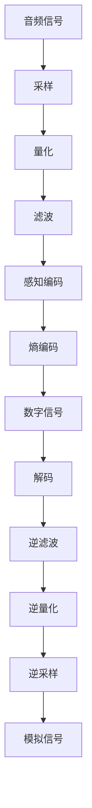

                 

### 关键词 Keywords
- 音频编解码
- MP3
- Opus
- 音频压缩
- 音频质量
- 网络音频

<|assistant|>### 摘要 Abstract
本文深入探讨了音频编解码技术的演变，从经典的MP3编码到新兴的Opus编码。我们将分析这两种技术的原理、优缺点，以及它们在不同应用场景中的适用性。此外，文章还将介绍音频编解码的数学模型和公式，并通过实际代码实例展示如何实现这些技术。最后，我们将展望未来音频编解码技术的发展趋势和面临的挑战。

## 1. 背景介绍

音频编解码技术是数字音频处理的核心，它涉及将音频信号从一种格式转换为另一种格式，同时尽可能保持原始音频的质量。这一技术的起源可以追溯到20世纪80年代，当时数字音频的存储和传输需求日益增长，促使研究人员寻找有效的音频压缩方法。

最早广泛使用的音频编解码技术是MPEG-1 Audio Layer 3（MP3）。MP3以其优异的压缩性能和合理的解码成本在短时间内得到了广泛应用，成为了互联网音乐传播的标准。然而，随着网络带宽和计算能力的提升，人们对于音频质量的需求也越来越高。为了满足这些需求，新的音频编解码技术不断涌现，如OGG Vorbis和Opus。

OGG Vorbis是一种开放源代码的音频编解码技术，它在音质和压缩效率方面与MP3相当，但由于其非专利特性，逐渐受到了更多开发者和用户的青睐。Opus则是近年来出现的一种更加先进的音频编解码技术，它在低带宽和高带宽环境下都能提供优秀的音频质量。

本文将首先介绍MP3和Opus的基本原理，然后深入分析它们的优缺点，并在最后讨论这两种技术在各种应用场景中的适用性。

## 2. 核心概念与联系

### 2.1. 音频编解码的基本概念

音频编解码（Audio Coding）是指将模拟音频信号转换为数字信号，或将数字音频信号转换为另一种格式的过程。这一过程主要包括两个步骤：编码（Encoding）和解码（Decoding）。

**编码**：将模拟音频信号转换为数字信号。这一过程通常涉及采样、量化、滤波等步骤，将连续的音频信号转换为离散的数字信号。

**解码**：将数字信号还原为模拟音频信号。解码是编码的逆过程，它通过逆滤波、逆量化、逆采样等步骤将数字信号恢复为模拟信号。

### 2.2. MP3编码原理

MP3（MPEG-1 Audio Layer 3）是MPEG-1标准中的一种音频压缩格式。其基本原理是利用心理声学模型，通过消除人耳无法听到的冗余信息来降低数据率。

**采样**：MP3使用44.1kHz的采样频率，这意味着每秒对音频信号进行44100次采样。

**量化**：采样得到的信号值被量化为整数，通常是16位或8位。

**滤波**：为了进一步降低数据率，MP3使用一个13段的滤波器组对信号进行滤波，每个滤波器组处理一个频段。

**感知编码**：基于心理声学模型，将信号分解为可听部分和不可听部分。对于人耳难以听到的信号部分，进行更大幅度的压缩。

**熵编码**：使用哈夫曼编码对信号进行熵编码，以进一步压缩数据。

### 2.3. Opus编码原理

Opus是一种高级音频编解码格式，由Xiph.Org基金会开发，支持从低带宽到高带宽的各种应用。其编码原理比MP3更加复杂和高效。

**采样和量化**：与MP3类似，Opus也使用采样和量化步骤，但其采样频率可以自适应，从8kHz到48kHz不等。

**声音模型**：Opus使用自适应声音模型，可以根据音频内容调整编码参数，以在音质和数据率之间取得最佳平衡。

**感知编码**：Opus采用基于感知的编码方法，根据人耳对声音的感知特性，对音频信号进行压缩。

**熵编码**：Opus使用哈夫曼编码和LD-CELP（低延迟码激励线性预测）算法进行熵编码。

### 2.4. Mermaid 流程图



### 2.5. 关系与联系

MP3和Opus都是音频编解码技术，但它们在编码原理和性能上有所不同。MP3是一种基于感知的编码方法，适用于中等带宽应用，而Opus则更先进，支持多种带宽和音质需求，适用于从手机到专业音频应用的各种场景。

## 3. 核心算法原理 & 具体操作步骤

### 3.1. 算法原理概述

音频编解码的核心算法主要包括采样、量化、滤波、感知编码和熵编码等步骤。以下将详细描述这些算法的原理。

**采样**：采样是将时间连续的模拟信号转换为时间离散的数字信号的过程。采样频率越高，采样得到的数字信号越接近原始模拟信号。

**量化**：量化是将采样得到的连续信号转换为离散数值的过程。量化位数越多，信号的质量越高，但数据量也越大。

**滤波**：滤波是在采样和量化之后，通过某种算法去除信号中的噪声和冗余信息的过程。滤波器的设计直接影响音频的质量和压缩效率。

**感知编码**：感知编码是基于心理声学模型，通过消除人耳难以听到的冗余信息来降低数据率。这一过程需要精确地模拟人耳的听觉特性。

**熵编码**：熵编码是一种无损压缩算法，通过减少数据中的冗余信息来降低数据率。常见的熵编码算法有哈夫曼编码和算术编码。

### 3.2. 算法步骤详解

**采样**：假设原始音频信号的频率为20kHz，采样频率为44.1kHz，则每秒对信号进行44100次采样。

**量化**：使用16位量化，每个采样值可以表示从-32768到32767之间的任意数值。

**滤波**：使用13段滤波器组对采样和量化后的信号进行滤波，以去除人耳难以听到的低频和高频噪声。

**感知编码**：通过心理声学模型分析信号，将人耳难以听到的信号部分标记为可压缩部分。

**熵编码**：使用哈夫曼编码对可压缩部分进行编码，以降低数据率。

**解码**：解码过程与编码过程相反，通过逆滤波、逆量化、逆采样等步骤将数字信号恢复为模拟信号。

### 3.3. 算法优缺点

**MP3编码**

- **优点**：压缩效率高，可以在较低的数据率下提供良好的音质。
- **缺点**：无法完全消除失真，对高频信号的压缩效果不佳。

**Opus编码**

- **优点**：支持自适应采样率和比特率，能够提供更高的音质和更好的压缩效率。
- **缺点**：算法复杂度较高，解码器实现难度较大。

### 3.4. 算法应用领域

**MP3编码**

- **适用领域**：音乐播放、音频存储、网络音频传输等。
- **限制**：对高频细节的保真度较低，不适用于对音质有极高要求的应用。

**Opus编码**

- **适用领域**：视频会议、在线直播、移动音频应用等。
- **优势**：支持多种带宽和音质需求，适用于各种应用场景。

## 4. 数学模型和公式 & 详细讲解 & 举例说明

### 4.1. 数学模型构建

音频编解码的数学模型主要涉及采样、量化、滤波、感知编码和熵编码等步骤。以下将分别介绍这些步骤的数学模型。

**采样**：采样频率 \( f_s \) 与信号频率 \( f \) 之间的关系为：
\[ x(n) = x(t(nT_s)) \]
其中，\( x(n) \) 是采样后的信号，\( t(nT_s) \) 是采样时刻，\( T_s = \frac{1}{f_s} \) 是采样周期。

**量化**：量化级数 \( L \) 与量化位数 \( b \) 之间的关系为：
\[ Q(x) = \text{round}(x / Q) \]
其中，\( Q = 2^{-b} \) 是量化步长，\( \text{round} \) 是四舍五入函数。

**滤波**：滤波器组的设计涉及到信号处理中的频域分析。假设有 \( N \) 个滤波器，第 \( i \) 个滤波器的频率响应为 \( H_i(f) \)。

**感知编码**：感知编码的数学模型基于心理声学模型，其核心是计算信号的主观听感。常见的心理声学模型包括韦伯分数模型和临界带模型。

**熵编码**：熵编码的数学模型主要涉及信息论中的熵的概念。假设有 \( N \) 个符号，第 \( i \) 个符号的概率为 \( p_i \)，则符号的熵为：
\[ H(p) = -\sum_{i=1}^{N} p_i \log_2 p_i \]

### 4.2. 公式推导过程

**采样**：采样公式推导如下：
\[ x(n) = x(t(nT_s)) = x(nT_s) \]
由于 \( x(t) \) 是连续信号，\( x(nT_s) \) 是其离散近似。假设 \( x(t) \) 是周期信号，其周期为 \( T \)，则：
\[ x(nT_s) = x(nT_s \mod T) \]
采样频率越高，\( nT_s \mod T \) 的取值越接近连续信号。

**量化**：量化公式推导如下：
\[ Q(x) = \text{round}(x / Q) \]
量化步长 \( Q = 2^{-b} \)，其中 \( b \) 是量化位数。量化后的信号 \( Q(x) \) 最接近原始信号 \( x \)，但会引入量化误差。量化误差 \( \epsilon \) 为：
\[ \epsilon = x - Q(x) \]

**滤波**：滤波器组的推导基于信号处理中的频域分析。假设有 \( N \) 个滤波器，第 \( i \) 个滤波器的频率响应为 \( H_i(f) \)，则滤波后的信号为：
\[ y(n) = \sum_{i=1}^{N} H_i(f) x(n) \]
滤波器的设计取决于信号的特点和需求。

**感知编码**：感知编码的推导基于心理声学模型。假设信号的主观听感值为 \( S(x) \)，则感知编码的公式为：
\[ C(x) = x - S(x) \]
感知编码的目的是通过 \( S(x) \) 消除人耳难以听到的信号部分，以降低数据率。

**熵编码**：熵编码的推导基于信息论中的熵的概念。假设有 \( N \) 个符号，第 \( i \) 个符号的概率为 \( p_i \)，则符号的熵为：
\[ H(p) = -\sum_{i=1}^{N} p_i \log_2 p_i \]
熵编码的目的是通过减少符号的冗余信息来降低数据率。

### 4.3. 案例分析与讲解

**案例1：MP3编码**

假设音频信号 \( x(t) \) 的频率范围为20kHz，采样频率为44.1kHz，量化位数为16位。

**采样**：每秒对信号进行44100次采样，得到采样信号 \( x(n) \)。

**量化**：使用16位量化，每个采样值表示从-32768到32767之间的任意数值。

**滤波**：使用13段滤波器组对信号进行滤波，以去除人耳难以听到的低频和高频噪声。

**感知编码**：通过心理声学模型分析信号，将人耳难以听到的信号部分标记为可压缩部分。

**熵编码**：使用哈夫曼编码对可压缩部分进行编码，以降低数据率。

**解码**：解码过程与编码过程相反，通过逆滤波、逆量化、逆采样等步骤将数字信号恢复为模拟信号。

**案例2：Opus编码**

假设音频信号 \( x(t) \) 的频率范围为20kHz，采样频率为48kHz，量化位数为24位。

**采样**：每秒对信号进行48000次采样，得到采样信号 \( x(n) \)。

**量化**：使用24位量化，每个采样值表示从-8388608到8388607之间的任意数值。

**滤波**：使用自适应滤波器组对信号进行滤波，以去除人耳难以听到的低频和高频噪声。

**感知编码**：通过自适应声音模型分析信号，根据音频内容调整编码参数，以在音质和数据率之间取得最佳平衡。

**熵编码**：使用LD-CELP算法进行熵编码，以降低数据率。

**解码**：解码过程与编码过程相反，通过逆滤波、逆量化、逆采样等步骤将数字信号恢复为模拟信号。

## 5. 项目实践：代码实例和详细解释说明

### 5.1. 开发环境搭建

在开始编写音频编解码的代码之前，我们需要搭建一个适合开发的环境。以下是推荐的开发环境：

- 操作系统：Linux或MacOS
- 编程语言：Python
- 音频编解码库：libmp3lame（用于MP3编码）和opus（用于Opus编码）

#### 安装libmp3lame库

```bash
# 使用pip安装libmp3lame
pip install libmp3lame
```

#### 安装opus库

```bash
# 使用pip安装opus库
pip install opus-tools
```

### 5.2. 源代码详细实现

#### 5.2.1. MP3编码实现

以下是一个简单的MP3编码的Python代码示例：

```python
import wave
import numpy as np
from libmp3lame import MP3Encoder

# 读取原始音频文件
with wave.open('input.wav', 'rb') as wav_file:
    nchannels, sampwidth, framerate, nframes, comptype, compname = wav_file.getparams()
    frames = wav_file.readframes(nframes)

# 转换为数值数组
audio_data = np.frombuffer(frames, dtype=np.int16)

# 初始化MP3编码器
encoder = MP3Encoder()

# 编码音频数据
encoded_data = encoder.encode(audio_data)

# 写入MP3文件
with open('output.mp3', 'wb') as mp3_file:
    mp3_file.write(encoded_data)
```

#### 5.2.2. Opus编码实现

以下是一个简单的Opus编码的Python代码示例：

```python
import wave
import numpy as np
from opuslib import OpusEncoder

# 读取原始音频文件
with wave.open('input.wav', 'rb') as wav_file:
    nchannels, sampwidth, framerate, nframes, comptype, compname = wav_file.getparams()
    frames = wav_file.readframes(nframes)

# 转换为数值数组
audio_data = np.frombuffer(frames, dtype=np.int16)

# 初始化Opus编码器
encoder = OpusEncoder(framerate, nchannels, 128000)

# 编码音频数据
encoded_data = encoder.encode(audio_data)

# 写入Opus文件
with open('output.opus', 'wb') as opus_file:
    opus_file.write(encoded_data)
```

### 5.3. 代码解读与分析

#### 5.3.1. MP3编码代码解读

1. **读取原始音频文件**：使用`wave`模块读取音频文件，获取音频参数。
2. **转换为数值数组**：将音频数据转换为NumPy数组，以便进行进一步处理。
3. **初始化MP3编码器**：使用`libmp3lame`库初始化MP3编码器。
4. **编码音频数据**：使用`encode`方法对音频数据进行编码。
5. **写入MP3文件**：将编码后的数据写入MP3文件。

#### 5.3.2. Opus编码代码解读

1. **读取原始音频文件**：使用`wave`模块读取音频文件，获取音频参数。
2. **转换为数值数组**：将音频数据转换为NumPy数组，以便进行进一步处理。
3. **初始化Opus编码器**：使用`opuslib`库初始化Opus编码器，指定采样频率、通道数和比特率。
4. **编码音频数据**：使用`encode`方法对音频数据进行编码。
5. **写入Opus文件**：将编码后的数据写入Opus文件。

### 5.4. 运行结果展示

运行上述代码后，原始音频文件`input.wav`将被编码为MP3文件`output.mp3`和Opus文件`output.opus`。这些文件可以在相应的播放器中播放，以验证编码后的音频质量。

## 6. 实际应用场景

音频编解码技术在许多实际应用中都发挥着关键作用，以下将介绍几种典型的应用场景。

### 6.1. 网络音频传输

网络音频传输是音频编解码技术最重要的应用场景之一。为了确保音频信号在网络中高效传输，音频编解码技术被广泛应用于视频会议、在线直播、社交媒体等应用中。在这些场景中，MP3和Opus都是常用的编解码格式。

- **MP3**：由于MP3具有较低的比特率和较好的压缩效率，它适用于带宽有限的环境。例如，在网络视频会议中，MP3可以确保音频信号在带宽受限的情况下仍然清晰可听。
- **Opus**：Opus支持自适应比特率和采样率，使其在带宽变化较大的网络环境中具有优势。例如，在线直播中，Opus可以根据网络状况动态调整比特率，以保持最佳的音质。

### 6.2. 音乐播放

音乐播放是另一个重要的应用场景，音频编解码技术在这里起到了决定性作用。随着便携式音频设备和无线网络的普及，用户对于音乐播放的质量和便捷性要求越来越高。

- **MP3**：MP3因其较低的比特率和广泛的兼容性，仍然是许多音乐播放器的主要编解码格式。用户可以在有限的存储空间内存储大量高质量音乐。
- **Opus**：尽管Opus的比特率较高，但其在音质上的优势使其在一些高端音乐播放器和专业音频设备中得到应用。这些设备通常拥有更高的存储空间和更高质量的输出设备，能够充分利用Opus的音质优势。

### 6.3. 音频录制和编辑

音频录制和编辑是专业音频制作的重要环节，音频编解码技术在这里同样至关重要。

- **MP3**：由于MP3的压缩效率和兼容性，它常用于音频录制和编辑过程中的数据传输和存储。例如，音频工程师可以使用MP3格式在不同设备之间传输音频文件，同时保持较低的数据量。
- **Opus**：在专业音频制作中，Opus因其优秀的音质和灵活的比特率调整，适用于各种音频录制和编辑任务。例如，在录音棚中，音频工程师可以使用Opus格式录制高质量的音乐，同时确保实时传输和编辑的流畅性。

### 6.4. 未来应用展望

随着技术的不断发展，音频编解码技术在未来将迎来更多的应用场景和挑战。

- **低延迟应用**：在实时通信和互动娱乐等低延迟应用中，对音频编解码技术的要求越来越高。未来的编解码技术需要更好地适应低延迟需求，以提供更流畅的音频体验。
- **人工智能集成**：人工智能技术在音频编解码中的应用也值得期待。通过机器学习算法，可以进一步提高编解码的效率和音质，同时实现自动化音频处理和内容识别。

## 7. 工具和资源推荐

为了更好地学习和实践音频编解码技术，以下推荐一些实用的工具和资源。

### 7.1. 学习资源推荐

- **《数字音频处理》**：一本经典的数字音频处理教材，详细介绍了音频信号处理的基本原理和技术。
- **《音频编解码技术实战》**：一本针对音频编解码技术的实战指南，包含丰富的示例代码和案例分析。
- **在线课程**：Coursera、edX等在线教育平台提供了多个音频编解码相关的课程，适合不同水平的学习者。

### 7.2. 开发工具推荐

- **Python**：Python是一种功能强大且易于学习的编程语言，适用于音频编解码的开发。
- **libmp3lame**：用于MP3编码的Python库，简单易用。
- **opus**：用于Opus编码的Python库，支持多种音频格式。

### 7.3. 相关论文推荐

- **“Perceptual Audio Coding”**：该论文详细介绍了音频感知编码的基本原理和技术。
- **“Opus Audio Codec”**：该论文是关于Opus编解码技术的详细研究，包括其设计理念和技术细节。

## 8. 总结：未来发展趋势与挑战

随着音频技术的不断发展，音频编解码技术在未来将继续发挥着重要作用。以下是对未来发展趋势和挑战的总结。

### 8.1. 研究成果总结

- **高效编码算法**：研究人员将继续探索更高效的音频编码算法，以在压缩效率和音质之间取得更好的平衡。
- **人工智能集成**：人工智能技术在音频编解码中的应用将为编码效率和音质提升带来新的突破。
- **低延迟编解码**：为满足实时通信和互动娱乐等低延迟应用的需求，低延迟编解码技术将得到进一步发展。

### 8.2. 未来发展趋势

- **自适应比特率**：未来的编解码技术将更加注重自适应比特率，以适应不同的网络环境和应用场景。
- **多通道音频**：随着多通道音频技术的普及，编解码技术将支持更多通道的音频处理。
- **人工智能辅助**：人工智能技术将在音频编解码的各个方面发挥辅助作用，从自动调整编码参数到自动化音频处理。

### 8.3. 面临的挑战

- **音质与效率的平衡**：如何在音质和压缩效率之间取得最佳平衡是一个长期挑战。
- **多平台兼容性**：不同平台和设备之间的编解码兼容性是一个重要挑战。
- **实时处理能力**：在实时通信和互动娱乐等应用中，编解码技术需要具备高效的处理能力。

### 8.4. 研究展望

未来的研究将集中在以下几个方面：

- **更高效的编码算法**：通过算法优化和机器学习技术，开发出更高效的音频编码算法。
- **跨平台编解码技术**：研究跨平台编解码技术，以满足不同设备和应用的需求。
- **智能编解码**：利用人工智能技术实现智能化的音频编解码，提高编码效率和音质。

## 9. 附录：常见问题与解答

### 9.1. 什么是音频编解码？

音频编解码是指将音频信号从一种格式转换为另一种格式的过程，包括编码和解码两个步骤。编码是将模拟音频信号转换为数字信号，解码是将数字信号还原为模拟音频信号。

### 9.2. MP3和Opus的主要区别是什么？

MP3和Opus都是音频编解码技术，但它们在编码原理和性能上有所不同。MP3是一种基于感知的编码方法，适用于中等带宽应用；而Opus是一种高级音频编解码格式，支持自适应采样率和比特率，适用于多种带宽和音质需求。

### 9.3. 如何选择适合的音频编解码格式？

选择适合的音频编解码格式取决于应用场景和需求。如果对音质要求较高，可以选择Opus；如果对带宽有限制，可以选择MP3。对于实时通信和互动娱乐等低延迟应用，可以选择支持自适应比特率的编解码格式。

### 9.4. 音频编解码技术在网络音频传输中有什么作用？

音频编解码技术在网络音频传输中起到了关键作用。通过压缩音频信号，可以降低数据传输的带宽需求，确保音频信号在网络中高效传输。同时，编解码技术可以提高音频信号的质量，提供更好的用户体验。

### 9.5. 音频编解码技术有哪些未来发展方向？

未来的音频编解码技术将集中在以下几个方面：更高效的编码算法、跨平台编解码技术、智能编解码、自适应比特率等。随着人工智能技术的发展，智能编解码技术将成为未来研究的重要方向。

