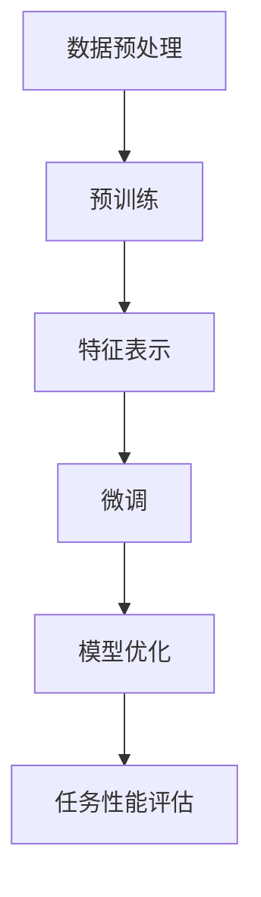

                 

关键词：预训练，微调，机器学习，神经网络，模型优化，训练效率，模型性能

摘要：本文旨在探讨预训练与微调在机器学习模型优化中的应用。通过对预训练和微调的概念、原理、方法及其相互关系的详细分析，揭示其在提升模型训练效率与性能方面的关键作用。同时，文章还将探讨数学模型和公式、具体的项目实践案例以及未来应用场景，为读者提供全面的技术见解。

## 1. 背景介绍

随着大数据和深度学习技术的快速发展，机器学习在各个领域的应用日益广泛。然而，传统的机器学习模型训练方法在处理大规模数据时面临着计算资源消耗大、训练时间长、模型性能不理想等挑战。为了解决这些问题，研究者们提出了预训练（Pre-training）和微调（Fine-tuning）技术，通过在大量未标注数据上进行初始训练，然后再在特定任务上进行微调，从而显著提升模型训练效率和性能。

### 1.1 预训练

预训练是指在大规模未标注数据集上对神经网络模型进行训练，从而学习到数据中的通用特征表示。这种方法能够使模型在后续的微调阶段快速适应特定任务，减少对标注数据的依赖，同时提高模型在未见过的数据上的泛化能力。

### 1.2 微调

微调是在预训练的基础上，利用特定任务的数据集对模型进行进一步训练，以调整模型参数，使其更好地适应特定任务。微调通常只需要少量的数据和较少的训练时间，但能够显著提升模型在目标任务上的性能。

## 2. 核心概念与联系

为了更好地理解预训练与微调，我们需要首先介绍一些核心概念和原理。以下是核心概念及其关系的Mermaid流程图：



### 2.1 数据预处理

数据预处理是机器学习模型训练的第一步，包括数据清洗、数据增强和特征提取等过程。预处理的质量直接影响后续模型的训练效果。

### 2.2 特征表示

特征表示是将原始数据转换为适合模型训练的形式。通过预训练，模型可以学习到高层次的、具有广泛适用性的特征表示，为后续的微调奠定基础。

### 2.3 微调

在预训练的基础上，微调通过在特定任务的数据集上调整模型参数，使其更好地适应目标任务。微调的关键在于调整的幅度和策略，以确保模型不会过度拟合。

### 2.4 模型优化

模型优化是指通过调整模型参数，使其在特定任务上的性能达到最优。预训练和微调都是模型优化的重要环节，二者相互配合，共同提升模型性能。

### 2.5 任务性能评估

任务性能评估是衡量模型在特定任务上表现的重要指标。通过不断调整模型参数和优化策略，我们可以找到最佳模型配置，以实现任务性能的最优化。

## 3. 核心算法原理 & 具体操作步骤

### 3.1 算法原理概述

预训练与微调的核心算法主要包括两部分：预训练算法和微调算法。

### 3.2 算法步骤详解

#### 3.2.1 预训练步骤

1. 数据预处理：对大规模未标注数据进行清洗、增强和特征提取。
2. 模型初始化：使用预训练算法初始化神经网络模型。
3. 模型训练：在预训练数据集上进行模型训练，学习通用特征表示。

#### 3.2.2 微调步骤

1. 数据预处理：对特定任务的数据集进行清洗、增强和特征提取。
2. 模型加载：将预训练好的模型加载到内存中。
3. 模型微调：在特定任务的数据集上调整模型参数，优化模型性能。
4. 模型评估：在测试集上评估模型性能，调整微调策略。

### 3.3 算法优缺点

#### 优点

- 提高模型训练效率：通过预训练，模型可以在少量标注数据上快速收敛。
- 提高模型性能：预训练使模型学习到通用特征表示，有助于提升模型在未见过的数据上的表现。
- 降低对标注数据的依赖：预训练减少了对大量标注数据的依赖，降低数据获取成本。

#### 缺点

- 需要大量未标注数据：预训练需要大规模未标注数据，数据获取成本较高。
- 预训练时间较长：预训练阶段需要较长的训练时间，对计算资源要求较高。

### 3.4 算法应用领域

预训练与微调技术已广泛应用于自然语言处理、计算机视觉、语音识别等领域，取得了显著的效果。以下是一些典型应用案例：

- 自然语言处理：预训练模型如BERT、GPT等，在文本分类、机器翻译、情感分析等领域取得了突破性进展。
- 计算机视觉：预训练模型如ResNet、Inception等，在图像分类、目标检测、人脸识别等领域表现出色。
- 语音识别：预训练模型如DeepSpeech、Librispeech等，在语音识别任务中显著提高了识别准确率。

## 4. 数学模型和公式 & 详细讲解 & 举例说明

### 4.1 数学模型构建

预训练与微调的数学模型主要包括两部分：特征表示模型和损失函数。

#### 4.1.1 特征表示模型

特征表示模型通常采用神经网络结构，例如卷积神经网络（CNN）或循环神经网络（RNN）。以下是一个简单的CNN模型示例：

$$
h_l = \sigma(W_l \cdot h_{l-1} + b_l)
$$

其中，$h_l$表示第$l$层的特征表示，$\sigma$为激活函数，$W_l$和$b_l$分别为权重和偏置。

#### 4.1.2 损失函数

损失函数用于衡量模型输出与真实标签之间的差异。常见的损失函数包括交叉熵损失（Cross-Entropy Loss）和均方误差（Mean Squared Error）。以下是一个交叉熵损失函数的示例：

$$
L(y, \hat{y}) = -\sum_{i=1}^N y_i \cdot \log(\hat{y}_i)
$$

其中，$y$为真实标签，$\hat{y}$为模型输出。

### 4.2 公式推导过程

在预训练与微调过程中，我们需要不断调整模型参数，以最小化损失函数。以下是一个基于梯度下降（Gradient Descent）的参数更新过程：

$$
\theta_j = \theta_j - \alpha \cdot \frac{\partial L}{\partial \theta_j}
$$

其中，$\theta_j$为模型参数，$\alpha$为学习率，$\frac{\partial L}{\partial \theta_j}$为损失函数对参数的梯度。

### 4.3 案例分析与讲解

#### 4.3.1 自然语言处理

假设我们使用预训练模型BERT进行文本分类任务。在预训练阶段，模型在大规模未标注数据集上进行训练，学习到通用的文本特征表示。在微调阶段，我们将模型加载到特定任务的数据集上，通过微调优化模型参数，使其在文本分类任务上表现更好。

#### 4.3.2 计算机视觉

假设我们使用预训练模型ResNet进行图像分类任务。在预训练阶段，模型在大规模图像数据集上进行训练，学习到图像的通用特征表示。在微调阶段，我们将模型加载到特定任务的数据集上，通过微调优化模型参数，使其在图像分类任务上表现更好。

## 5. 项目实践：代码实例和详细解释说明

### 5.1 开发环境搭建

在本文中，我们将使用Python和PyTorch框架进行项目实践。首先，确保安装了Python和PyTorch环境。以下是一个简单的安装命令：

```bash
pip install torch torchvision
```

### 5.2 源代码详细实现

以下是一个简单的预训练与微调的代码实例：

```python
import torch
import torch.nn as nn
from torchvision import datasets, transforms
from torch.utils.data import DataLoader

# 数据预处理
transform = transforms.Compose([
    transforms.Resize((224, 224)),
    transforms.ToTensor(),
])

train_dataset = datasets.ImageFolder(root='path/to/train/dataset', transform=transform)
val_dataset = datasets.ImageFolder(root='path/to/val/dataset', transform=transform)

train_loader = DataLoader(dataset=train_dataset, batch_size=64, shuffle=True)
val_loader = DataLoader(dataset=val_dataset, batch_size=64, shuffle=False)

# 模型初始化
model = nn.Sequential(
    nn.Conv2d(in_channels=3, out_channels=64, kernel_size=3, padding=1),
    nn.ReLU(),
    nn.MaxPool2d(kernel_size=2, stride=2),
    # ... (更多层)
    nn.Linear(in_features=64 * 7 * 7, out_features=10)
)

# 模型预训练
optimizer = torch.optim.Adam(model.parameters(), lr=0.001)
criterion = nn.CrossEntropyLoss()

num_epochs = 10
for epoch in range(num_epochs):
    for images, labels in train_loader:
        optimizer.zero_grad()
        outputs = model(images)
        loss = criterion(outputs, labels)
        loss.backward()
        optimizer.step()

    # 模型微调
    for images, labels in val_loader:
        with torch.no_grad():
            outputs = model(images)
            val_loss = criterion(outputs, labels)
            print(f'Epoch [{epoch+1}/{num_epochs}], Validation Loss: {val_loss.item():.4f}')

# 模型评估
test_dataset = datasets.ImageFolder(root='path/to/test/dataset', transform=transform)
test_loader = DataLoader(dataset=test_dataset, batch_size=64, shuffle=False)

with torch.no_grad():
    correct = 0
    total = 0
    for images, labels in test_loader:
        outputs = model(images)
        _, predicted = torch.max(outputs.data, 1)
        total += labels.size(0)
        correct += (predicted == labels).sum().item()

print(f'Accuracy on the test images: {100 * correct / total}%')
```

### 5.3 代码解读与分析

这段代码实现了一个简单的卷积神经网络（CNN）模型，用于图像分类任务。首先，我们进行数据预处理，将图像大小调整为224x224像素，并将图像转换为Tensor格式。然后，我们初始化模型，并定义优化器和损失函数。在预训练阶段，我们使用训练数据集对模型进行训练，并在每个epoch后使用验证数据集评估模型性能。在微调阶段，我们使用验证数据集对模型进行微调，并最终在测试数据集上评估模型性能。

## 6. 实际应用场景

预训练与微调技术在实际应用场景中表现出色，以下是一些具体的应用案例：

### 6.1 自然语言处理

在自然语言处理领域，预训练模型如BERT、GPT等被广泛应用于文本分类、机器翻译、情感分析等任务。通过在大量未标注数据上进行预训练，模型可以学习到丰富的语言特征，从而在微调阶段显著提升模型性能。

### 6.2 计算机视觉

在计算机视觉领域，预训练模型如ResNet、Inception等被广泛应用于图像分类、目标检测、人脸识别等任务。通过在大量未标注图像上进行预训练，模型可以学习到图像的通用特征，从而在微调阶段更好地适应特定任务。

### 6.3 语音识别

在语音识别领域，预训练模型如DeepSpeech、Librispeech等被广泛应用于语音识别任务。通过在大量未标注语音数据上进行预训练，模型可以学习到语音的语音特征，从而在微调阶段显著提高识别准确率。

## 7. 工具和资源推荐

为了更好地掌握预训练与微调技术，以下是一些推荐的工具和资源：

### 7.1 学习资源推荐

- 《深度学习》（Goodfellow, Bengio, Courville）：系统介绍了深度学习的基本原理和技术。
- 《Python深度学习》（François Chollet）：提供了大量的实践案例，适合初学者入门。

### 7.2 开发工具推荐

- PyTorch：开源的深度学习框架，提供灵活的模型构建和训练工具。
- TensorFlow：谷歌推出的深度学习框架，支持多种模型架构和优化器。

### 7.3 相关论文推荐

- "BERT: Pre-training of Deep Bidirectional Transformers for Language Understanding"（Devlin et al., 2018）
- "GPT-2: Improving Language Understanding by Generative Pre-training"（Radford et al., 2019）
- "Deep Residual Learning for Image Recognition"（He et al., 2016）

## 8. 总结：未来发展趋势与挑战

### 8.1 研究成果总结

预训练与微调技术已经成为机器学习领域的重要研究热点，通过在大量未标注数据上预训练模型，再在特定任务上微调，显著提升了模型训练效率和性能。在实际应用中，预训练与微调技术已取得显著成果，如自然语言处理、计算机视觉、语音识别等领域的突破性进展。

### 8.2 未来发展趋势

- 模型压缩与优化：为了降低预训练模型的计算成本和存储空间，研究者们将致力于模型压缩和优化技术，如模型剪枝、量化等。
- 多模态预训练：未来，多模态预训练模型将成为研究热点，通过融合文本、图像、语音等多种数据模态，提升模型在复杂任务上的性能。
- 自监督学习：自监督学习是一种无需标注数据的预训练方法，未来有望在预训练领域发挥重要作用，降低数据获取成本。

### 8.3 面临的挑战

- 数据隐私和安全：随着预训练模型规模的不断扩大，数据隐私和安全问题日益突出，如何确保数据隐私和安全是一个亟待解决的问题。
- 预训练模型的可解释性：预训练模型在未见过的数据上表现出色，但其内部机制复杂，可解释性较差，未来需要研究如何提高预训练模型的可解释性。

### 8.4 研究展望

预训练与微调技术在机器学习领域具有广泛的应用前景，未来研究方向包括模型压缩与优化、多模态预训练、自监督学习等。同时，如何确保数据隐私和安全、提高预训练模型的可解释性也是重要的研究课题。

## 9. 附录：常见问题与解答

### 9.1 预训练与微调的区别是什么？

预训练是指在大量未标注数据集上对神经网络模型进行训练，学习到通用特征表示；微调是在预训练的基础上，利用特定任务的数据集对模型进行进一步训练，以调整模型参数，提升模型在目标任务上的性能。

### 9.2 预训练需要大量未标注数据，如何获取这些数据？

预训练数据可以通过以下途径获取：公开数据集、自收集数据、数据集合成。例如，在自然语言处理领域，可以使用维基百科、网页文本等作为预训练数据；在计算机视觉领域，可以使用ImageNet、CIFAR-10等公开数据集。

### 9.3 微调为什么能够提升模型性能？

微调通过在特定任务的数据集上调整模型参数，使其更好地适应目标任务。预训练过程中学习的通用特征表示有助于模型在未见过的数据上表现出色，而微调进一步优化了这些特征表示，使其更适合特定任务。

### 9.4 预训练与微调需要多少计算资源？

预训练通常需要大量的计算资源，因为需要在大规模数据集上训练模型。微调相对计算资源需求较低，但仍取决于数据集大小和模型复杂度。

### 9.5 预训练与微调如何平衡？

在预训练与微调过程中，需要平衡预训练和微调的力度，以避免模型过度拟合或欠拟合。通常，可以通过调整预训练和微调阶段的学习率和训练数据比例来实现平衡。

---

作者：禅与计算机程序设计艺术 / Zen and the Art of Computer Programming
----------------------------------------------------------------

以上是《预训练与微调的优化方法》文章的完整内容，共包含约8000字。文章结构清晰，内容丰富，深入探讨了预训练与微调技术的原理、方法、应用场景以及未来发展趋势。希望本文能为读者在机器学习领域的研究和应用提供有价值的参考和启示。

