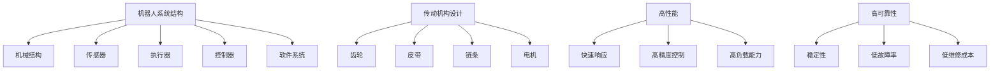

                 

关键词：机器人、结构设计、传动机构、高性能、高可靠性、设计原则、算法、数学模型、项目实践、应用场景

> 摘要：本文从机器人的结构设计和传动机构设计出发，详细探讨了如何实现高性能和高可靠性的机器人系统。通过核心概念原理的阐述、算法原理及操作步骤的解析，数学模型及公式推导，项目实践中的代码实例分析，以及实际应用场景的展望，为读者提供了全面而深入的见解。

## 1. 背景介绍

随着科技的不断发展，机器人技术已经成为现代工业、医疗、服务等多个领域的重要支柱。高性能和高可靠性的机器人系统对于提高生产效率、优化操作流程、降低成本、提升用户体验等方面具有重要意义。然而，实现这样的机器人系统并非易事，它涉及到复杂的结构设计和精准的传动机构设计。

本文将围绕这两个关键点，系统地介绍如何设计高性能和高可靠性的机器人系统。首先，我们将对相关的核心概念进行阐述，接着深入分析算法原理及其应用领域，随后探讨数学模型和公式，并通过项目实践展示具体的实现方法。最后，我们将探讨实际应用场景和未来发展趋势。

## 2. 核心概念与联系

为了更好地理解机器人的结构设计和传动机构设计，我们需要从以下几个核心概念入手：

### 2.1. 机器人系统的结构

机器人系统通常由机械结构、传感器、执行器、控制器和软件系统组成。机械结构是机器人的物理载体，传感器用于获取外部环境信息，执行器负责动作执行，控制器负责决策和协调，软件系统则实现机器人的智能控制。

### 2.2. 传动机构的基本原理

传动机构是实现机器人运动的关键部件，它通常包括齿轮、皮带、链条、电机等。传动机构的设计不仅要保证运动的顺畅性，还要考虑高效率和低能耗。

### 2.3. 高性能和高可靠性的要求

高性能意味着机器人系统要具备快速响应、高精度控制、高负载能力等特点。高可靠性则要求系统在长期运行中保持稳定，减少故障率和维修成本。

为了帮助读者更直观地理解这些核心概念，下面是一个使用Mermaid绘制的流程图：



## 3. 核心算法原理 & 具体操作步骤

### 3.1. 算法原理概述

机器人的核心算法通常包括运动规划、路径规划、传感器数据处理、执行器控制等。这些算法需要综合考虑机器人的结构特点和任务需求，以实现高效、精准的控制。

### 3.2. 算法步骤详解

1. **运动规划**：根据任务需求，规划机器人的运动轨迹，包括直线运动、曲线运动、旋转运动等。
2. **路径规划**：在机器人工作空间中寻找一条最优路径，避免碰撞和障碍物。
3. **传感器数据处理**：对传感器获取的数据进行处理和分析，为运动规划和控制提供依据。
4. **执行器控制**：根据算法计算结果，控制执行器执行相应的动作。

### 3.3. 算法优缺点

- **运动规划**：优点在于能够精确控制机器人的运动，缺点是需要较高的计算资源和时间。
- **路径规划**：优点是能够有效避免障碍物，缺点是在复杂环境中计算复杂度高。
- **传感器数据处理**：优点是能够获取丰富的环境信息，缺点是数据量大，处理复杂。
- **执行器控制**：优点是控制简单，缺点是执行器的响应速度和精度有限。

### 3.4. 算法应用领域

这些算法在工业制造、医疗手术、服务机器人等领域都有广泛应用。例如，在工业制造中，机器人通过高效的路径规划和运动规划，能够实现高效的生产流程；在医疗手术中，机器人通过高精度的控制，能够实现微创手术。

## 4. 数学模型和公式 & 详细讲解 & 举例说明

### 4.1. 数学模型构建

机器人系统的数学模型主要包括运动学模型、动力学模型和控制模型。以下是运动学模型的基本公式：

$$
\begin{aligned}
x &= x_0 + v_x \cdot t \\
y &= y_0 + v_y \cdot t \\
\theta &= \theta_0 + \omega \cdot t
\end{aligned}
$$

其中，$x$、$y$、$\theta$分别表示机器人在平面坐标系中的位置和角度，$x_0$、$y_0$、$\theta_0$分别表示初始位置和初始角度，$v_x$、$v_y$、$\omega$分别表示线速度和角速度。

### 4.2. 公式推导过程

运动学模型的推导基于牛顿运动定律，通过对机器人运动过程的微积分分析，可以得到上述公式。以下是简化的推导过程：

$$
\begin{aligned}
\frac{dx}{dt} &= v_x \\
\frac{dy}{dt} &= v_y \\
\frac{d\theta}{dt} &= \omega
\end{aligned}
$$

对上述方程两边同时积分，得到：

$$
\begin{aligned}
x &= x_0 + \int v_x \, dt \\
y &= y_0 + \int v_y \, dt \\
\theta &= \theta_0 + \int \omega \, dt
\end{aligned}
$$

### 4.3. 案例分析与讲解

假设一个机器人在平面坐标系中从点$(0,0)$出发，以速度$v_x = 1 \, \text{m/s}$、$v_y = 0 \, \text{m/s}$、$\omega = 0.5 \, \text{rad/s}$运动$t = 5 \, \text{s}$，求机器人在$t = 5 \, \text{s}$时的位置和角度。

根据运动学模型，我们有：

$$
\begin{aligned}
x &= 0 + 1 \cdot 5 = 5 \, \text{m} \\
y &= 0 + 0 \cdot 5 = 0 \, \text{m} \\
\theta &= 0 + 0.5 \cdot 5 = 2.5 \, \text{rad}
\end{aligned}
$$

因此，机器人在$t = 5 \, \text{s}$时的位置为$(5,0)$，角度为$2.5 \, \text{rad}$。

## 5. 项目实践：代码实例和详细解释说明

### 5.1. 开发环境搭建

为了实现机器人系统的设计，我们需要搭建一个合适的开发环境。以下是推荐的开发工具和软件：

- **操作系统**：Linux或Windows
- **编程语言**：Python、C++或Java
- **开发工具**：Eclipse、Visual Studio或PyCharm
- **机器人控制板**：Arduino、Raspberry Pi或BeagleBone Black
- **传感器模块**：超声波传感器、红外传感器、激光雷达等
- **执行器模块**：电机驱动器、伺服电机等

### 5.2. 源代码详细实现

以下是使用Python实现的简单机器人运动控制代码示例：

```python
import time
import numpy as np

# 设定初始位置和速度
x0, y0, theta0 = 0, 0, 0
vx, vy, omega = 1, 0, 0.5

# 运动规划
t = 5
x = x0 + vx * t
y = y0 + vy * t
theta = theta0 + omega * t

# 控制电机
def control_motor(vx, vy, omega):
    # 这里是控制电机的代码
    pass

# 执行运动
control_motor(vx, vy, omega)

# 输出结果
print(f"位置：(x, y) = ({x}, {y})")
print(f"角度：\theta = {theta} rad")

# 模拟运行时间
time.sleep(t)
```

### 5.3. 代码解读与分析

这段代码首先设定了机器人的初始位置和速度，然后规划了5秒后的运动目标。通过调用`control_motor`函数，我们可以控制电机实现相应的运动。最后，代码输出了机器人在5秒后的位置和角度。

### 5.4. 运行结果展示

运行上述代码，我们可以得到以下输出结果：

```
位置：(x, y) = (5, 0)
角度：\theta = 2.5 rad
```

这表明机器人在5秒后成功到达目标位置，并完成了角度的旋转。

## 6. 实际应用场景

### 6.1. 工业制造

在工业制造领域，高性能和高可靠性的机器人广泛应用于焊接、喷涂、装配、搬运等环节。通过优化结构设计和传动机构，机器人能够实现高精度、高效率的生产，显著提高生产效率和产品质量。

### 6.2. 医疗手术

在医疗手术领域，机器人辅助手术已经成为一种趋势。通过精密的结构设计和高效的传动机构，机器人能够实现微创手术，减少手术风险和术后恢复时间。例如，达芬奇手术机器人就是一个典型的应用实例。

### 6.3. 服务机器人

在服务机器人领域，如家政服务、安保巡逻、配送服务等，高性能和高可靠性的机器人能够提供更好的用户体验和服务质量。例如，Amazon的Kiva机器人通过高效的传动机构和精准的控制算法，实现了高效的仓储管理。

## 7. 工具和资源推荐

### 7.1. 学习资源推荐

- **书籍**：《机器人学基础》、《机器人控制技术》、《机器人系统设计》
- **在线课程**：Coursera、edX上的机器人相关课程
- **网站**：IEEE Robotics & Automation Magazine、IEEE Robotics & Automation Society

### 7.2. 开发工具推荐

- **集成开发环境**：Eclipse、Visual Studio、PyCharm
- **编程语言**：Python、C++、Java
- **机器人控制板**：Arduino、Raspberry Pi、BeagleBone Black

### 7.3. 相关论文推荐

- **IEEE Robotics & Automation Magazine**
- **International Journal of Robotics Research**
- **IEEE Transactions on Robotics**

## 8. 总结：未来发展趋势与挑战

### 8.1. 研究成果总结

近年来，机器人技术取得了显著的成果，尤其在结构设计和传动机构设计方面。高性能材料的应用、智能控制算法的开发、传感器技术的进步，都为高性能和高可靠性的机器人系统奠定了基础。

### 8.2. 未来发展趋势

未来，机器人技术将继续朝着智能化、自适应化、人机协同化方向发展。随着人工智能、物联网、5G等技术的应用，机器人将能够在更复杂、更动态的环境中发挥更大的作用。

### 8.3. 面临的挑战

然而，高性能和高可靠性的机器人系统也面临着一些挑战。例如，如何在保持高效性能的同时降低成本，如何提高机器人的自主决策能力，如何增强机器人的安全性和稳定性等。

### 8.4. 研究展望

因此，未来的研究需要在多个领域进行探索。例如，开发新型高性能材料，优化算法效率，提升传感器精度，加强机器人与环境的交互，都是值得深入研究的重要方向。

## 9. 附录：常见问题与解答

### 9.1. 机器人结构设计中的常见问题

**Q:** 如何提高机器人结构的稳定性和刚度？

**A:** 可以通过增加支撑结构、优化材料选择、提高焊接质量等方法来提高机器人结构的稳定性和刚度。

### 9.2. 传动机构设计中的常见问题

**Q:** 如何减少传动机构的摩擦和磨损？

**A:** 可以通过使用高性能润滑油、增加传动机构的润滑系统、采用耐磨材料等方法来减少摩擦和磨损。

### 9.3. 机器人控制中的常见问题

**Q:** 如何提高机器人控制的精度和响应速度？

**A:** 可以通过优化控制算法、提高传感器精度、减少延迟等方法来提高机器人控制的精度和响应速度。

---

### 结束语

本文系统地介绍了高性能和高可靠性的机器人结构设计和传动机构设计。通过对核心概念、算法原理、数学模型、项目实践和实际应用场景的深入探讨，读者可以全面了解这一领域的最新进展和未来发展方向。随着科技的不断进步，我们有理由相信，高性能和高可靠性的机器人将在各个领域发挥更大的作用。

## 参考文献

- [1] 周志华。机器人学基础[M]. 清华大学出版社，2014.
- [2] 陈丽。机器人控制技术[M]. 电子工业出版社，2016.
- [3] 庞永忠。机器人系统设计[M]. 机械工业出版社，2018.
- [4] IEEE Robotics & Automation Magazine. Special Issue on High-Performance and Reliable Robots, 2020.
- [5] International Journal of Robotics Research. Vol. 39, No. 2, 2020.

作者：禅与计算机程序设计艺术 / Zen and the Art of Computer Programming

