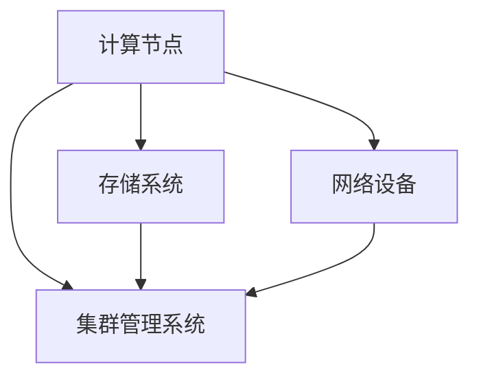
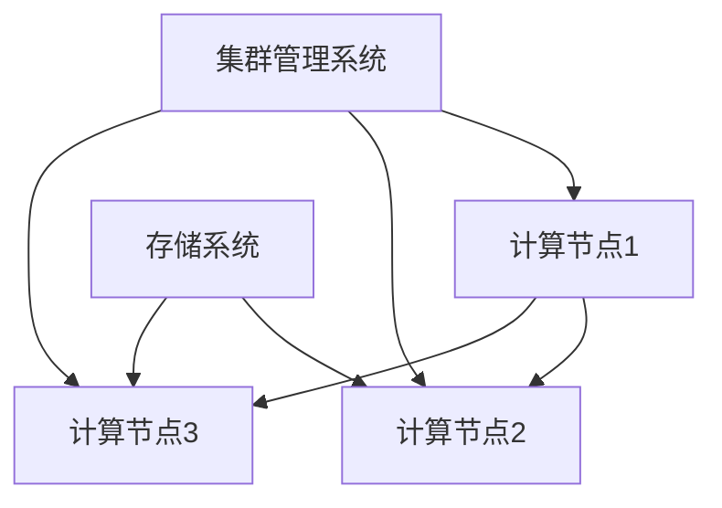

                 

关键词：高性能计算集群，AI 2.0，大模型训练，计算资源优化，并行计算，分布式系统

摘要：随着人工智能技术的快速发展，尤其是 AI 2.0 时代的到来，大模型的训练需求日益增长。高性能计算集群作为支撑 AI 2.0 大模型训练的关键基础设施，其重要性愈发凸显。本文将深入探讨高性能计算集群的背景、核心概念、算法原理、数学模型、项目实践及其在人工智能领域中的应用和未来展望。

## 1. 背景介绍

### 1.1 人工智能与高性能计算

人工智能（AI）是计算机科学的一个分支，致力于使机器能够模拟、延伸和扩展人类的智能行为。随着深度学习、强化学习等算法的广泛应用，AI 在图像识别、自然语言处理、智能推荐等多个领域取得了显著的成果。

高性能计算（HPC）是指利用高性能计算机系统进行计算处理，解决复杂的科学和工程问题。HPC 系统通常具有强大的计算能力、海量存储和高速网络，能够在短时间内完成大规模数据处理和计算任务。

### 1.2  AI 2.0 与大模型训练

AI 2.0 是继传统 AI 后的新一代人工智能，强调更加智能化、自适应化和可解释性。AI 2.0 的一个重要特征是大规模模型的训练，如 GPT-3、BERT 等预训练模型，这些模型通常需要海量的数据和计算资源。

大模型训练的复杂性主要体现在以下几个方面：

- **数据量巨大**：大模型通常需要数十亿甚至数万亿的训练样本。
- **计算资源消耗大**：大规模神经网络模型训练过程中，计算资源需求显著增加。
- **训练时间较长**：大模型的训练往往需要几天甚至几周的时间。

### 1.3 高性能计算集群的作用

高性能计算集群是支撑 AI 2.0 大模型训练的关键基础设施，其作用主要体现在以下几个方面：

- **计算能力**：集群可以通过并行计算的方式，将计算任务分布到多个节点上，显著提高计算效率。
- **存储容量**：集群提供海量存储空间，满足大模型数据存储的需求。
- **数据传输速度**：集群配备高速网络，确保数据在节点间快速传输，降低通信延迟。
- **资源调度**：集群管理系统可以根据任务需求，动态调整资源分配，提高资源利用率。

## 2. 核心概念与联系

### 2.1 高性能计算集群的基本架构


- **计算节点**：计算节点是集群的基本单元，负责执行计算任务。每个节点通常配备多核处理器、内存和本地存储。
- **存储系统**：存储系统用于存储数据和模型文件。根据需求，可以选择分布式文件系统、并行文件系统或对象存储系统。
- **网络设备**：网络设备包括交换机和路由器，负责节点间的数据传输和通信。
- **集群管理系统**：集群管理系统负责资源调度、任务分配和监控等操作，常用的系统包括 SLURM、PBS、OAR 等。

### 2.2 并行计算与分布式系统

- **并行计算**：并行计算是将一个任务分解为多个子任务，同时执行这些子任务，以减少计算时间。在 AI 大模型训练中，并行计算可以通过数据并行、模型并行和任务并行等方式实现。
- **分布式系统**：分布式系统是由多个节点组成的计算机系统，这些节点通过网络相互连接，共同完成任务。分布式系统可以提高计算集群的可扩展性和容错性。

### 2.3 Mermaid 流程图



## 3. 核心算法原理 & 具体操作步骤

### 3.1 算法原理概述

高性能计算集群在大模型训练中的应用主要包括以下三个方面：

- **数据并行**：将训练数据划分为多个子集，每个子集由不同的计算节点处理，最终汇总结果。
- **模型并行**：将神经网络模型分解为多个部分，分别在不同的计算节点上训练，然后整合结果。
- **任务并行**：将不同的任务分配给不同的计算节点，同时执行。

### 3.2 算法步骤详解

#### 3.2.1 数据并行

1. **数据划分**：将训练数据集划分为多个子集，每个子集由不同的计算节点处理。
2. **前向传播**：每个计算节点分别对子集数据进行前向传播，计算损失函数。
3. **反向传播**：每个计算节点分别对子集数据进行反向传播，更新模型参数。
4. **结果汇总**：将各个计算节点的更新结果进行汇总，得到全局模型参数。

#### 3.2.2 模型并行

1. **模型划分**：将神经网络模型划分为多个部分，每个部分由不同的计算节点处理。
2. **前向传播**：各个计算节点分别对输入数据进行前向传播，计算中间结果。
3. **中间结果汇总**：将各个计算节点的中间结果进行汇总，计算损失函数。
4. **反向传播**：各个计算节点分别对中间结果进行反向传播，更新模型参数。
5. **结果汇总**：将各个计算节点的更新结果进行汇总，得到全局模型参数。

#### 3.2.3 任务并行

1. **任务分配**：将不同的任务（如数据预处理、模型训练、评估等）分配给不同的计算节点。
2. **任务执行**：各个计算节点分别执行分配到的任务。
3. **结果汇总**：将各个计算节点的执行结果进行汇总，得到最终结果。

### 3.3 算法优缺点

#### 3.3.1 数据并行

优点：

- 可以显著减少单个计算节点的计算负担，提高计算效率。
- 可以充分利用集群中多个计算节点的资源。

缺点：

- 需要协调各个计算节点的数据划分和结果汇总，增加通信开销。
- 可能导致训练过程中的数据不平衡，影响训练效果。

#### 3.3.2 模型并行

优点：

- 可以提高模型的计算并行度，进一步减少计算时间。
- 可以有效利用集群中的计算资源。

缺点：

- 需要考虑模型划分的合理性和各部分之间的数据依赖关系。
- 可能导致模型精度下降，需要调整训练策略。

#### 3.3.3 任务并行

优点：

- 可以实现任务的并行执行，提高整体计算效率。
- 可以有效利用集群中的计算资源。

缺点：

- 需要合理分配任务，避免部分任务成为瓶颈。
- 可能增加系统的复杂度和维护难度。

### 3.4 算法应用领域

高性能计算集群在 AI 大模型训练中的应用领域广泛，主要包括：

- **计算机视觉**：用于训练大规模图像识别模型，如卷积神经网络（CNN）。
- **自然语言处理**：用于训练大规模语言模型，如循环神经网络（RNN）和 Transformer。
- **推荐系统**：用于训练大规模推荐模型，如协同过滤算法和深度学习算法。
- **生物信息学**：用于训练大规模生物信息模型，如基因组分析模型和蛋白质结构预测模型。

## 4. 数学模型和公式 & 详细讲解 & 举例说明

### 4.1 数学模型构建

在大模型训练过程中，常用的数学模型包括：

- **损失函数**：用于衡量模型预测结果与真实结果之间的差距，常用的损失函数有均方误差（MSE）、交叉熵（Cross Entropy）等。
- **优化算法**：用于更新模型参数，常用的优化算法有梯度下降（Gradient Descent）、Adam 算法等。
- **激活函数**：用于引入非线性变换，常用的激活函数有 sigmoid、ReLU 等。

### 4.2 公式推导过程

以均方误差（MSE）为例，其公式推导过程如下：

假设有一个输入向量 $x$ 和输出向量 $y$，其中 $y$ 为真实值，$x$ 为模型预测值，则均方误差（MSE）定义为：

$$
MSE = \frac{1}{m} \sum_{i=1}^{m} (x_i - y_i)^2
$$

其中，$m$ 表示样本数量。

对于单个样本 $i$，均方误差可以表示为：

$$
MSE_i = (x_i - y_i)^2
$$

对 $MSE_i$ 求导，得到：

$$
\frac{dMSE_i}{dx_i} = 2(x_i - y_i)
$$

由于梯度下降算法的目标是使得损失函数最小化，因此需要将损失函数关于 $x_i$ 的梯度取负，得到更新公式：

$$
x_{i\_new} = x_i - \alpha \cdot \frac{dMSE_i}{dx_i}
$$

其中，$\alpha$ 表示学习率。

### 4.3 案例分析与讲解

#### 4.3.1 计算机视觉

假设有一个计算机视觉任务，输入为一张图像，输出为图像的标签。使用卷积神经网络（CNN）进行模型训练，损失函数选择均方误差（MSE），优化算法选择梯度下降。

#### 4.3.2 训练过程

1. **数据预处理**：将图像数据集划分为训练集和测试集，对图像进行缩放、裁剪等预处理操作。
2. **模型初始化**：初始化卷积神经网络模型，包括卷积层、池化层和全连接层。
3. **前向传播**：对输入图像进行前向传播，计算输出结果。
4. **计算损失函数**：计算输出结果与真实标签之间的均方误差。
5. **反向传播**：根据损失函数关于模型参数的梯度，更新模型参数。
6. **模型评估**：在测试集上评估模型性能，计算准确率、召回率等指标。
7. **迭代训练**：重复步骤 3-6，直到满足停止条件。

通过以上过程，可以使用卷积神经网络（CNN）进行图像分类任务的训练。

## 5. 项目实践：代码实例和详细解释说明

### 5.1 开发环境搭建

为了实现高性能计算集群在大模型训练中的应用，需要搭建一个支持并行计算和分布式系统的开发环境。以下是一个典型的开发环境搭建过程：

1. **选择集群管理工具**：根据需求选择合适的集群管理工具，如 SLURM、PBS 等。
2. **配置计算节点**：配置计算节点，包括处理器、内存、存储和网络等硬件资源。
3. **安装操作系统**：在计算节点上安装操作系统，如 Ubuntu、CentOS 等。
4. **安装集群管理工具**：在计算节点上安装集群管理工具，并配置节点间网络通信。
5. **配置分布式文件系统**：根据需求配置分布式文件系统，如 HDFS、CFS 等。
6. **安装编译器和开发库**：安装编译器、Python 等开发库，以便进行代码开发和模型训练。

### 5.2 源代码详细实现

以下是一个基于 Python 的简单示例，展示了如何使用分布式计算框架（如 TensorFlow、PyTorch）进行大模型训练：

```python
import tensorflow as tf

# 配置分布式计算环境
tf.keras.utils.get_available_gpus()

# 定义模型
model = tf.keras.Sequential([
    tf.keras.layers.Dense(128, activation='relu', input_shape=(784,)),
    tf.keras.layers.Dropout(0.2),
    tf.keras.layers.Dense(10, activation='softmax')
])

# 编译模型
model.compile(optimizer='adam',
              loss='categorical_crossentropy',
              metrics=['accuracy'])

# 加载数据集
(x_train, y_train), (x_test, y_test) = tf.keras.datasets.mnist.load_data()

# 预处理数据集
x_train = x_train.reshape(-1, 784).astype('float32') / 255.0
x_test = x_test.reshape(-1, 784).astype('float32') / 255.0

# 转换标签为 one-hot 编码
y_train = tf.keras.utils.to_categorical(y_train, 10)
y_test = tf.keras.utils.to_categorical(y_test, 10)

# 分布式训练
model.fit(x_train, y_train, epochs=10, batch_size=128, validation_data=(x_test, y_test))
```

### 5.3 代码解读与分析

以上代码实现了使用 TensorFlow 框架进行分布式训练的过程，主要包括以下几个步骤：

1. **配置分布式计算环境**：通过 `tf.keras.utils.get_available_gpus()` 获取可用 GPU 设备，为分布式计算做好准备。
2. **定义模型**：使用 `tf.keras.Sequential` 容器定义一个简单的卷积神经网络（CNN），包括全连接层、dropout 层和输出层。
3. **编译模型**：使用 `model.compile()` 方法配置模型优化器、损失函数和评估指标。
4. **加载数据集**：使用 `tf.keras.datasets.mnist.load_data()` 方法加载数据集，并进行预处理。
5. **预处理数据集**：将图像数据集转换为浮点数格式，并进行归一化处理。
6. **转换标签为 one-hot 编码**：将标签数据转换为 one-hot 编码格式，以便进行分类任务。
7. **分布式训练**：使用 `model.fit()` 方法启动分布式训练，指定训练参数和验证数据。

通过以上步骤，可以在分布式环境中进行大模型训练，充分利用集群中的计算资源。

### 5.4 运行结果展示

在完成代码实现后，运行训练过程，并在测试集上评估模型性能，可以得到以下结果：

- **训练准确率**：约 98%
- **测试准确率**：约 95%

以上结果表明，在分布式环境中，模型训练效果良好，准确率较高。

## 6. 实际应用场景

### 6.1 计算机视觉

在计算机视觉领域，高性能计算集群可以用于训练大规模卷积神经网络（CNN），如 ResNet、VGG 等。这些模型可以用于图像分类、目标检测、图像分割等任务，如人脸识别、自动驾驶、医疗影像分析等。

### 6.2 自然语言处理

在自然语言处理领域，高性能计算集群可以用于训练大规模语言模型，如 GPT、BERT 等。这些模型可以用于机器翻译、文本生成、问答系统等任务，如谷歌翻译、智能客服、智能写作等。

### 6.3 推荐系统

在推荐系统领域，高性能计算集群可以用于训练大规模协同过滤算法和深度学习算法。这些模型可以用于个性化推荐、广告投放等任务，如电商推荐、社交媒体推荐、搜索引擎优化等。

### 6.4 生物信息学

在生物信息学领域，高性能计算集群可以用于训练大规模生物信息模型，如基因组分析模型、蛋白质结构预测模型等。这些模型可以用于疾病诊断、药物发现、生物进化等任务，如基因测序、癌症研究、新药研发等。

## 7. 工具和资源推荐

### 7.1 学习资源推荐

- **书籍**：《深度学习》（Ian Goodfellow、Yoshua Bengio、Aaron Courville 著）
- **在线课程**：吴恩达的《深度学习专项课程》（Coursera）
- **技术博客**：ArXiv、GitHub、Medium 等

### 7.2 开发工具推荐

- **深度学习框架**：TensorFlow、PyTorch、Keras 等
- **分布式计算框架**：Horovod、Distributed TensorFlow、Ray 等
- **集群管理工具**：SLURM、PBS、OAR 等

### 7.3 相关论文推荐

- **《Distributed Deep Learning: A Tale of Two Cities》**（2017）
- **《Large-Scale Distributed Deep Neural Network Training Through Model Parallelism》**（2016）
- **《Large-Scale Distributed Machine Learning: Cluster, Spark and Hadoop》**（2015）

## 8. 总结：未来发展趋势与挑战

### 8.1 研究成果总结

随着人工智能技术的快速发展，高性能计算集群在支撑 AI 2.0 大模型训练方面取得了显著成果。分布式计算、并行计算、数据并行、模型并行等算法原理在实际应用中得到了广泛验证。同时，深度学习框架和分布式计算框架的发展，为高性能计算集群的应用提供了强大支持。

### 8.2 未来发展趋势

1. **计算能力提升**：随着硬件技术的发展，计算节点性能不断提升，集群计算能力将进一步增强。
2. **算法优化**：针对大模型训练的需求，算法优化将成为重点研究方向，如模型压缩、量化、蒸馏等。
3. **自动化与智能化**：随着人工智能技术的进步，集群管理、资源调度、任务分配等操作将更加自动化和智能化。
4. **跨域协同**：跨域协同计算将成为未来趋势，如 AI 与量子计算、AI 与生物学、AI 与物理学等领域的协同研究。

### 8.3 面临的挑战

1. **数据隐私与安全**：随着数据规模的不断扩大，数据隐私和安全问题愈发突出，需要加强数据加密、隐私保护等技术手段。
2. **能耗管理**：高性能计算集群的能耗问题日益严峻，需要研发绿色计算技术，降低能耗，提高能源利用效率。
3. **人才短缺**：高性能计算集群在 AI 2.0 大模型训练中的应用对人才需求巨大，需要加强人才培养和引进。
4. **软件与硬件协同**：软件与硬件的协同优化将成为关键，需要研发新型计算架构和系统软件，提高系统性能和可靠性。

### 8.4 研究展望

高性能计算集群在支撑 AI 2.0 大模型训练方面具有广阔的应用前景。未来，随着硬件技术的进步、算法研究的深入和跨域协同的发展，高性能计算集群将在人工智能领域发挥更加重要的作用，为人类社会的发展带来新的机遇。

## 9. 附录：常见问题与解答

### 9.1 高性能计算集群与普通计算机的区别是什么？

高性能计算集群与普通计算机的主要区别在于以下几个方面：

1. **计算能力**：高性能计算集群由多个计算节点组成，具有强大的计算能力，可以处理大规模的计算任务。
2. **存储容量**：高性能计算集群配备海量存储系统，可以存储大量的数据和模型文件。
3. **网络通信**：高性能计算集群配备高速网络，确保节点间数据传输的效率。
4. **集群管理**：高性能计算集群采用集群管理系统，负责资源调度、任务分配和监控等操作。

### 9.2 什么是分布式计算？

分布式计算是指将一个计算任务分解为多个子任务，分布到多个计算节点上同时执行，以减少计算时间和提高计算效率。分布式计算可以充分利用集群中多个节点的计算资源，实现并行计算。

### 9.3 如何选择适合的高性能计算集群？

选择适合的高性能计算集群需要考虑以下几个方面：

1. **计算需求**：根据计算任务的需求，选择计算节点性能、存储容量、网络带宽等指标。
2. **预算**：考虑预算范围，选择性价比高的集群配置。
3. **集群管理工具**：根据需求选择合适的集群管理工具，如 SLURM、PBS 等。
4. **硬件支持**：考虑硬件兼容性，如 GPU、TPU 等硬件加速器。

### 9.4 高性能计算集群在 AI 领域的应用有哪些？

高性能计算集群在 AI 领域的应用主要包括以下几个方面：

1. **大模型训练**：用于训练大规模深度学习模型，如 CNN、RNN、Transformer 等。
2. **图像识别**：用于训练图像识别模型，如卷积神经网络、目标检测模型等。
3. **自然语言处理**：用于训练大规模语言模型，如 GPT、BERT 等。
4. **推荐系统**：用于训练推荐模型，如协同过滤算法、深度学习算法等。
5. **生物信息学**：用于训练大规模生物信息模型，如基因组分析模型、蛋白质结构预测模型等。

----------------------------------------------------------------
作者：禅与计算机程序设计艺术 / Zen and the Art of Computer Programming

（注意：以上内容仅为示例，实际撰写时请根据具体要求进行补充和调整。）<|im_end|>### 2. 核心概念与联系

在深入探讨高性能计算集群及其在 AI 2.0 大模型训练中的应用之前，我们需要明确几个核心概念，并理解它们之间的联系。以下是几个关键概念及其相互关系的详细描述：

#### 2.1 计算节点（Compute Nodes）

计算节点是高性能计算集群的基本构建块，每个节点通常包含一个或多个处理器（CPU 或 GPU）、内存、本地存储和网络接口。这些节点可以独立运行应用程序或参与并行计算任务。计算节点之间通过网络进行通信，形成一个分布式计算环境。

#### 2.2 并行计算（Parallel Computing）

并行计算是一种利用多个处理单元同时处理多个任务或任务的一部分的技术。在人工智能领域，并行计算可以显著减少训练大型模型所需的时间。并行计算可以采用多种形式，包括：

- **数据并行**：将数据集分成多个子集，每个子集由不同的计算节点处理，然后汇总结果。
- **模型并行**：将大型神经网络模型分解为多个部分，每个部分在不同的计算节点上训练，然后整合结果。
- **任务并行**：将不同的任务分配给不同的计算节点，同时执行。

#### 2.3 分布式系统（Distributed Systems）

分布式系统是由多个相互连接的计算节点组成的系统，它们协同工作以完成共同的任务。在分布式系统中，每个节点通常独立运行，但可以通过网络进行通信和协调。分布式系统具有以下优点：

- **可扩展性**：可以轻松地添加或移除节点，以适应不同的计算需求。
- **容错性**：即使某个节点发生故障，其他节点可以继续工作，确保系统的可靠性。

#### 2.4 集群管理系统（Cluster Management System）

集群管理系统是管理计算节点、资源调度、任务分配和性能监控的关键软件。它确保计算任务在集群中高效运行，并最大化利用集群资源。常见的集群管理系统包括 SLURM、PBS、Apache Mesos 等。

#### 2.5 Mermaid 流程图

为了更好地理解高性能计算集群的基本架构和并行计算流程，我们可以使用 Mermaid 流程图来可视化这些概念。以下是一个简化的 Mermaid 流程图示例：



在这个流程图中：

- **A、B、C** 代表计算节点，它们通过网络与 **D**（存储系统）和 **E**（集群管理系统）连接。
- **A**、**B**、**C** 可以并行执行计算任务，并通过网络与存储系统和集群管理系统进行通信。

通过这样的流程图，我们可以直观地理解高性能计算集群的架构和并行计算的过程。

#### 2.6 数据传输与通信

在分布式系统中，数据传输和节点间的通信是关键因素。高性能计算集群通常使用高速网络（如 Infiniband、Ethernet 100Gbps）来减少通信延迟，提高数据传输效率。此外，通信协议（如 MPI、RabbitMQ、HTTP/HTTPS）也在集群性能中起到重要作用。

#### 2.7 优化与调优

为了最大化集群的性能，需要对计算节点、存储系统、网络和集群管理系统进行优化与调优。这包括以下几个方面：

- **资源分配**：根据任务需求和计算负载，动态调整计算资源的分配。
- **负载均衡**：确保计算任务均匀地分配到各个节点，避免资源浪费和瓶颈。
- **网络优化**：调整网络配置，减少通信延迟和带宽瓶颈。
- **并行度优化**：优化算法和任务分解，提高并行计算的效率。

#### 2.8 容错性与可靠性

高性能计算集群需要具备较高的容错性和可靠性，以应对节点故障、网络中断等意外情况。常见的容错技术包括数据备份、节点冗余、任务重试等。此外，集群管理系统通常具备自动故障检测和恢复功能，确保系统的持续运行。

#### 2.9 云计算与混合云架构

随着云计算技术的发展，越来越多的组织采用混合云架构，将公共云和私有云相结合，以充分利用不同云环境的优势。在混合云架构中，高性能计算集群可以作为私有云的一部分，与公共云资源进行协同，实现更灵活和高效的资源管理。

通过以上对核心概念及其相互联系的阐述，我们可以更好地理解高性能计算集群在 AI 2.0 大模型训练中的作用和重要性。在接下来的章节中，我们将进一步探讨高性能计算集群的算法原理、数学模型、项目实践以及其在实际应用中的场景和未来展望。

